# 45：JupyterLab 入门（初级）🚀

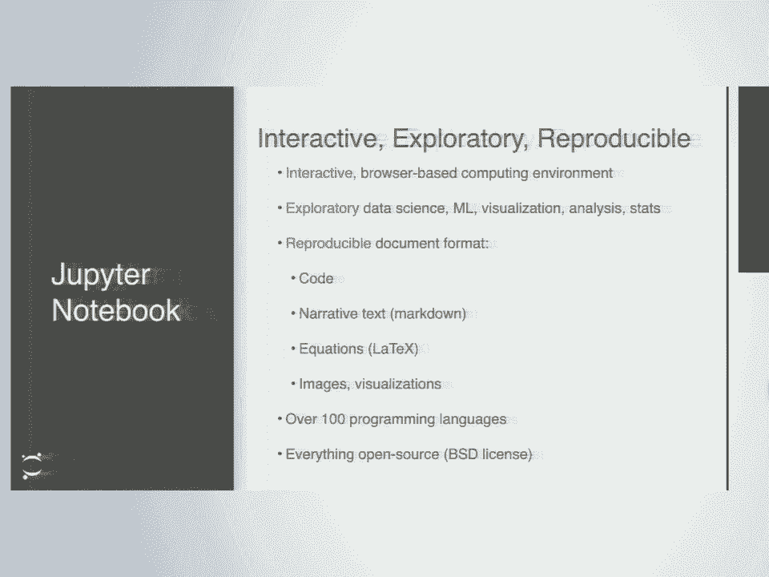

在本课程中，我们将学习 JupyterLab 的基础知识。JupyterLab 是下一代 Jupyter Notebook 的 Web 界面，它提供了一个集成的工作环境，将笔记本、文件浏览器、终端、文本编辑器等多种工具整合在一起。我们将从介绍 JupyterLab 的起源和核心概念开始，然后通过演示和练习，逐步掌握其基本操作、高级工作流以及如何编写自定义扩展。

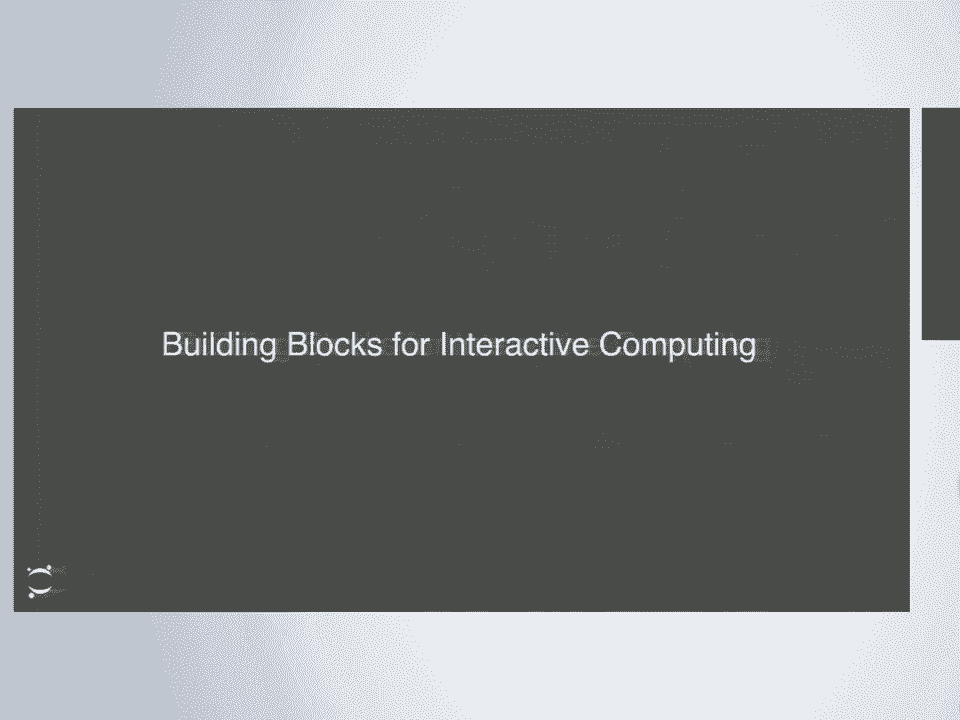

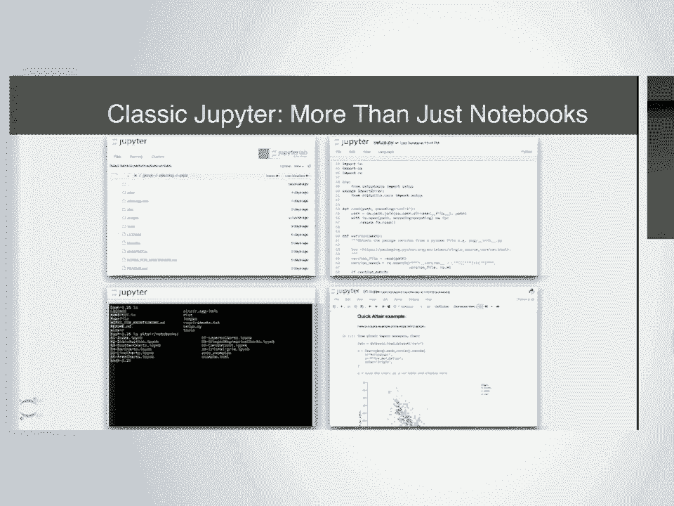

---

## JupyterLab 的起源与愿景 🌟

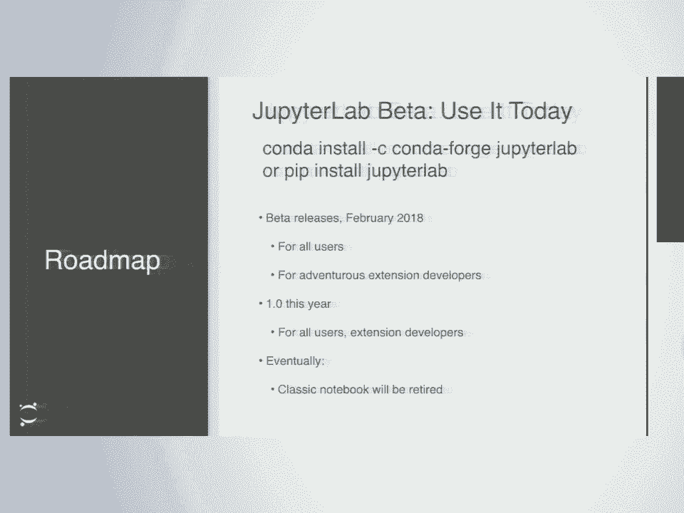

上一节我们介绍了本课程的目标，本节中我们来看看 JupyterLab 从何而来。

我是 Jason Grout。过去三年我一直在 JupyterLab 项目上工作。这位是 Matias，他同样在 Jupyter 项目上工作了多年。

首先是一些事务性说明：请从代码仓库拉取最新文件以更新。如果你已经克隆了仓库，只需执行 `git pull` 命令即可获取最新更新。我们目前处于提交 FA69。

我们将从一个简短的介绍开始，让大家了解 JupyterLab，并进行一个简短的演示。然后，我们将逐步引导你学习 JupyterLab 的多种使用方式，你将有机会练习在介绍中看到的许多功能。

我们计划涵盖 JupyterLab 的使用，以及 JupyterLab 相对于 Jupyter Notebook 提供的一些新工作流，最后以编写你自己的扩展作为结束。希望今天结束时，我们能写出大约 60、70 或 80 个扩展。

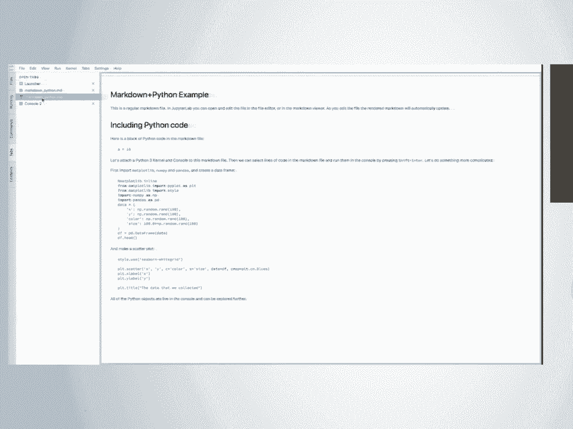

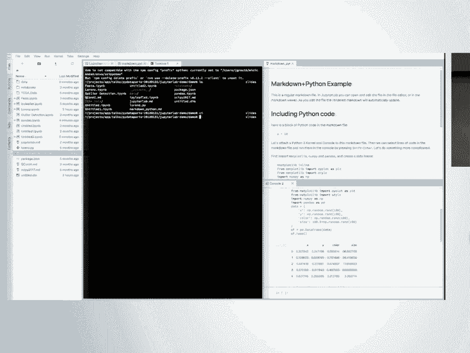

有多少人使用过 Jupyter Notebook？很好。有多少人使用过 Jupyter Lab？太棒了。有多少人在本教程前已经安装了 Jupyter Lab？好的，很好。有多少人目前已经按照教程说明安装好了一切？很好。在第一个练习中，我们也会帮助解决任何安装问题。

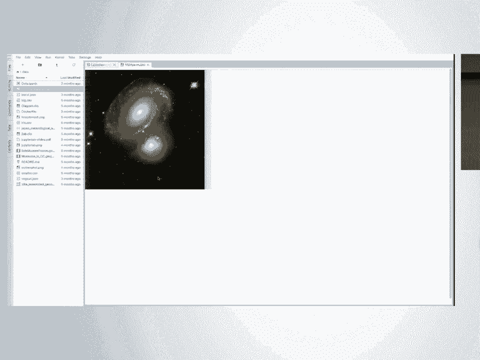

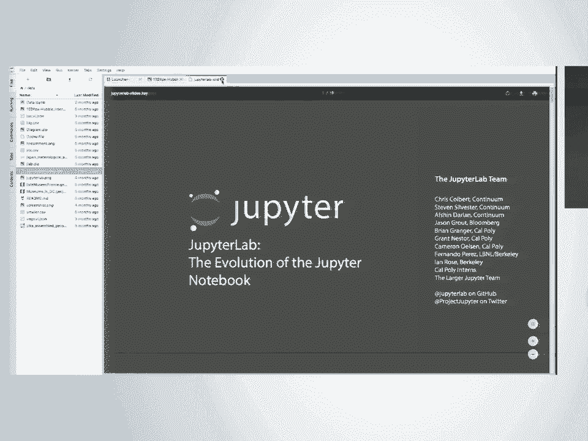

让我们从 JupyterLab 的简短介绍开始，回顾一下 JupyterLab 的起源。但首先，我要感谢幻灯片左侧列出的所有为 JupyterLab 做出贡献的人。它最初是 Anaconda、Bloomberg 和 Project Jupyter 之间的合作项目，后来发展成为由许多个人共同完成的工作。Chris Colbert、Steve Sylvester 和 Afton Darien 早期投入了大量工作，Ian Rose 和我，以及 Brian Granger 等许多人也为此付出了巨大努力，此后项目吸引了更多人参与。

让我们回到 Jupyter Notebook。Jupyter Notebook 可以说已经席卷全球，成为进行数据科学和科学计算的事实标准平台。其理念是提供一个基于浏览器的交互式计算环境，让你可以交互式地探索数据。它既提供了一种交互式工作流，也提供了一种文档格式，使得在一个笔记本文档中轻松共享代码输入、代码输出以及叙述性文字成为可能。

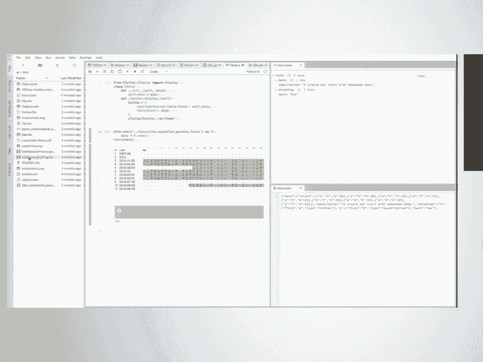

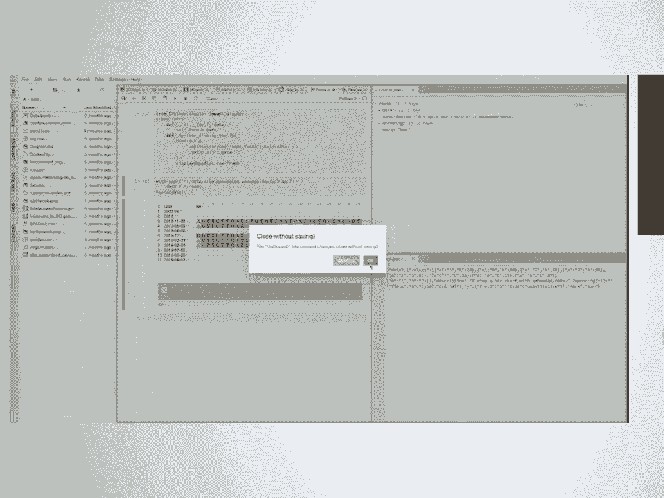

Jupyter 背后的一个基本理念是，这类工作流是与语言无关的。因此，我们有许多针对不同编程语言的内核，目前数量超过 100 个。当然，所有内容都是 BSD 许可的。

这是一个 Jupyter Notebook 的例子，我想根据举手情况，大家对此都比较熟悉。

那么，我们今天处于什么位置？我们仍然拥有数百万用户，甚至比去年更多。仅在 GitHub 上就有数百万个笔记本，我相信在 GitHub 之外还有更多。我们一直在支持可重复的科学。我们喜欢的一个例子是 LIGO 合作项目，他们将所有数据以 Jupyter Notebook 的形式在线发布，你可以通过下载 Jupyter Notebook 并能够在他们的数据上运行分析，来重现上个世纪最重要的物理学发现之一。我们允许你，并且这是使用 Binder 项目的一个例子，能够下载他们的笔记本，底部有一个链接，可以下载构成近期最重要物理学发现之一基础的科学计算。

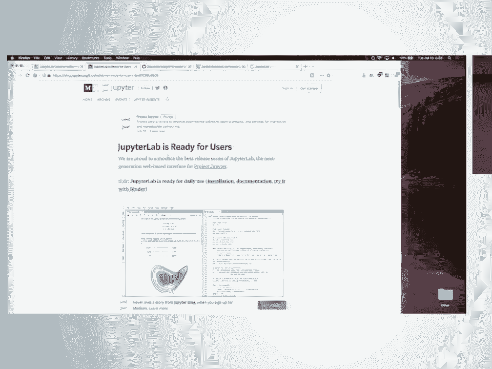

我们一直在支持开放数据新闻业。例如，BuzzFeed 将他们所有文章的支持性 Jupyter Notebook 都发布出来，包括这篇关于网球拍的文章。交互式教科书平台也基于 Jupyter Notebooks 来编写交互式教科书。当然，你们中的许多人一直在工作中使用它。

然而，我们意识到，在人们使用 Jupyter Notebook 的工作流中，他们需要的不仅仅是一个笔记本。我们有笔记本，但也需要文件浏览器、终端、文本编辑器，当然还有笔记本本身。我们看到，你当然需要比笔记本多得多的组件。因此，我们开始将这些组件放入笔记本中，我们有一系列这些组件，它们基本上是独立的工具。我们称这些为工作流的构建模块，科学计算工作流的构建模块。JupyterLab 背后的理念之一就是将所有这些东西整合到一个集成的体验中。

因此，作为 Jupyter Notebook 的下一代 Web 界面，JupyterLab 将这些工具和其他工具整合到一个集成的界面中。基于这种架构，你拥有无限的可能性，各种工具可以协同工作。

这是一张 JupyterLab 的截图。左边是一个笔记本，右边是一个 Python 文件。笔记本正在导入 Python 文件，我们可以同时处理两者。

JupyterLab 包含了许多流行词汇。它满足了所有流行词汇的要求，但更重要的是超越了这些词汇。我们努力构建了一个灵活的、可扩展的、高性能的架构。我们早期非常注重设计，试图让 UI 和 UX 正确。我们努力让扩展 JupyterLab 的 API 非常清晰，使其可以成为构建在其上的许多不同工作流和工具的基础。

今天，JupyterLab 已经开发了大约四年。我们有大约 150 位贡献者。构成 JupyterLab 的独立组件大约有 60 个。截至上次统计，我们发布了大约 2600 个版本。这个数字有些虚高，因为这 60 个组件每次发布新版本时，每个组件都会有一个版本号，所以一次 JupyterLab 发布实际上涉及这 60 个组件各自独立的发布。但到目前为止，我们总共发布了大约 2600 个版本，提交了大约 13000 次。为了对比，经典 Notebook 仓库目前的提交数大约是 11000 次。所以在提交数量上，我们与经典 Notebook 相当。

我们目前处于所谓的“测试版”，但我想你应该把它理解为用户 1.0 版本。这大约是在一月或二月发布的。我们在二月发布了我们称之为 JupyterLab 测试版的系列版本。我们说，现在它已经准备好供用户使用了。你可以将其视为用户 1.0 版本，可以在日常工作中使用。我们已经使用了很长时间。我们仍在稳定扩展 API，所以我们称之为测试版。因此，我们说它适合所有用户，但适合喜欢冒险的扩展开发者。我们今天稍后会详细讨论扩展开发。计划是在今年发布 1.0 版本，为扩展开发者提供稳定的 API。最终，经典 Notebook 将被淘汰，并由 JupyterLab 取代。

在我进行简短演示之前，我想提一下，我们邀请大家参加 8 月 21 日至 25 日在纽约举行的 JupyterCon。25 日是星期六，来和我们一起冲刺吧。我们将在那个星期六举行代码冲刺和贡献者冲刺。

---

## JupyterLab 界面与核心操作演示 🖥️

上一节我们了解了 JupyterLab 的背景，本节中我们通过一个快速演示来熟悉其界面和基本操作。

好的，让我们再举一次手。有多少人使用 JupyterLab 不仅仅是打开它以确保安装成功？看起来大约有四分之一的人。很好。

这就是 JupyterLab。左侧有一个文件浏览器。我们有一个称为主区域的主要工作区。在左侧，我们有所谓的左侧边栏。有时右侧会出现一些东西，称为右侧边栏。在左侧边栏中，有一个文件浏览器。这是一个典型的文件浏览器，提供了你期望的许多操作。如果你右键点击它，你可以执行许多文件操作。顶部有一个面包屑导航，你可以点击面包屑返回右侧，或者点击面包屑返回上一级目录。实际上，你甚至可以使用面包屑来移动文件。例如，如果我想移动一个文件，我可以将其拖到这里，将其移动到主目录。让我们把它放回数据目录。在最顶部，按相反顺序，有一个刷新按钮来刷新文件列表，一个上传按钮将文件上传到当前目录，一个创建按钮，一个新文件夹按钮，然后是一个新启动器。

启动器是主工作区中的一个标签页，允许你创建各种项目。在左侧边栏，我们有文件标签页。点击标签页可以切换左侧边栏的显示。运行标签页会跟踪你正在运行的内核。命令面板包含许多命令，它们在整个系统中工作，并标注了键盘快捷键等。标签列表显示所有打开的标签页。我安装了一个额外的扩展，它是一个目录扩展，所以扩展可以向左侧边栏添加内容。

好的，让我们使用加号按钮创建一个新标签页。你注意到它创建了一个新的启动器。这类似于浏览器，你创建一个标签页，然后选择要在该标签页中放置什么。我们可以点击 Python 3 创建一个新的 Python 3 笔记本，然后我们就有了一个新笔记本。

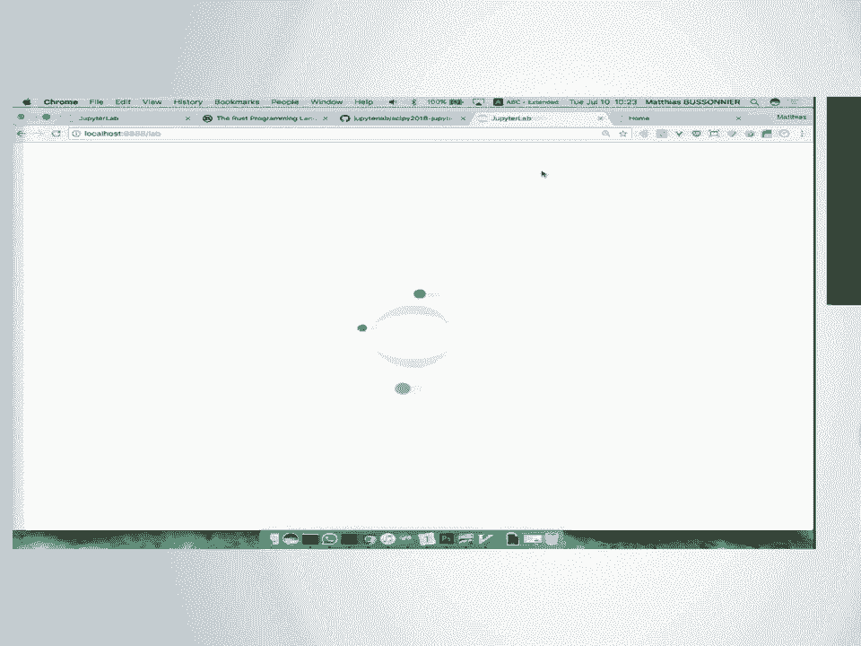

这个笔记本是经典笔记本界面的完全重写。我们试图保持与经典笔记本的兼容性，包括键盘快捷键和鼠标交互等。它使用与经典笔记本完全相同的文件格式。所以是相同的文件格式，相同的工作流，但全新的实现，允许我们做一些新的事情。

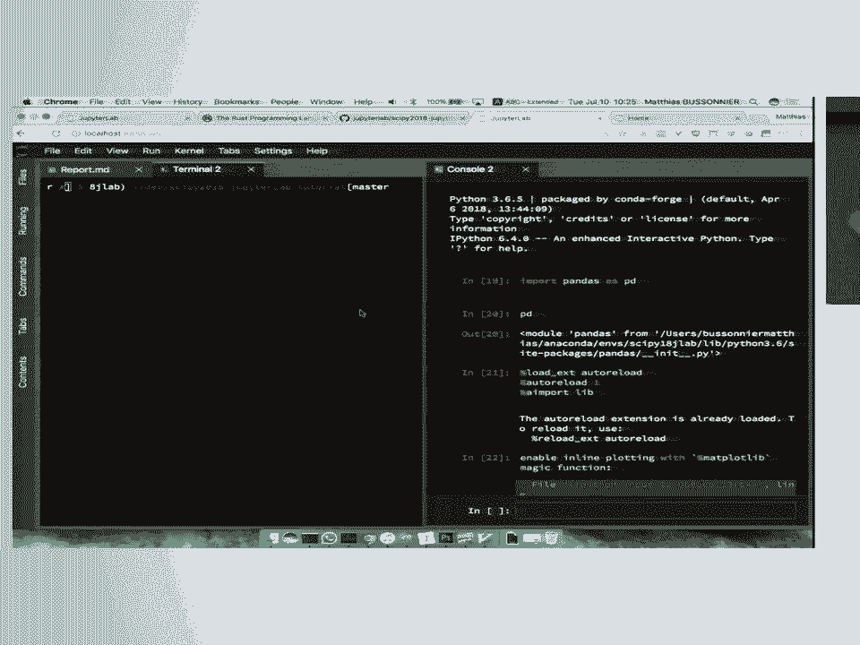

例如，这是 Jake VanderPlas 书中的一个笔记本。Shift-Enter 仍然有效。哇，我没有安装 Seaborn。我想我们应该把 Seaborn 列为需要安装的东西之一，但你可以看到它在这里运行。Shift-Enter 有效。我可以点击顶部工具栏的“运行”按钮运行，或者我有一个“运行”菜单，其中有许多运行选项。你仍然有“Markdown”、“数学”、“富文本”、“交互式 Jupyter 小部件”等。

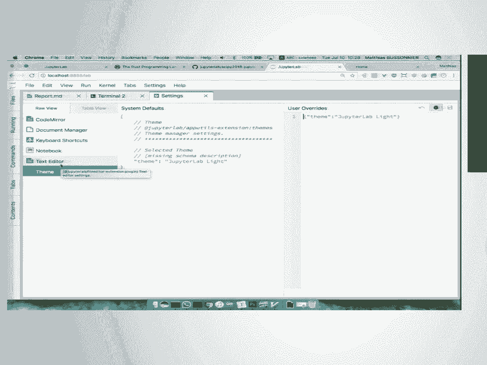

由于这是重写，我们也借此机会做了一些新的事情，比如你现在有可折叠的单元格。任何单元格都可以折叠输出、折叠输入，或者两者都折叠。你也可以拖动单元格。在这里，我拖动单元格来移动它。只需抓住提示区域并拖动即可。我们还有一个更强大的笔记本扩展机制来向笔记本添加功能。

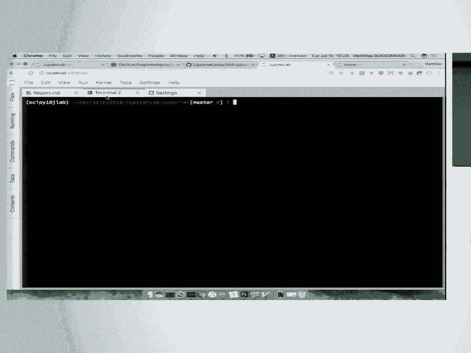

在 JupyterLab 中，我们可以为文件创建一个新视图。在这里，我将为这个笔记本创建一个新视图。这是两个笔记本，我将标签页拖动到并排显示。这很不错，我可以在笔记本顶部操作，也可以在笔记本底部操作。我甚至可以在笔记本之间拖动单元格。在这里，我将把这个单元格拖到笔记本的最顶部。我将某个东西从最底部移动到最顶部。实际上，如果你在这个视图中滚动，你会看到两个视图是完全同步的，所以你可以看到同一个文件的两个部分。这是一个视图，而不是副本。它是同一个笔记本的视图。是的，同一个底层模型为两个视图提供服务。

还有其他问题吗？好的，好问题。

在 JupyterLab 中，我们非常希望让组件之间能够轻松交互。例如，我们可以在这里右键点击，稍后我们会更多地体验这一点。我们将为这个笔记本创建一个新的控制台。这是一个绑定到与笔记本相同内核的控制台。所以如果我在笔记本中按 Shift-Enter，我想我需要运行单元格，如果我在笔记本中按 Shift-Enter，你可以看到在这里，我的内核正在显示结果，因为我在那个内核中执行。实际上，我可以在这里的控制台中运行东西，这意味着我在笔记本背后的内核中运行它，而不会弄乱笔记本。这样我就可以尝试探索那个数据框是什么，而不会弄乱我的笔记本。我有两个不同的工具，控制台和笔记本，与同一个底层内核通信并相互交互。

这是另一个展示 Jupyter 小部件的笔记本。小部件在 Jupyter 中运行得很好。这是我们在笔记本中关于洛伦兹吸引子的经典例子。但我们这里也有一些新的工作流。如果我右键点击并为这个输出创建一个新视图，它可以将输出拉到一个单独的标签页中。我可以移动它，你可以看到笔记本内的输出与标签页内的输出完全同步响应。这实际上是同一个输出的两个视图。但它确实允许我用我的标签页替换笔记本，现在我有了一个非常简单的类似仪表板的 UI，类似 Web 应用的 UI，背后由笔记本驱动。

所以这就是笔记本。你熟悉和喜爱的相同界面，你熟悉和喜爱的相同文件格式。完全重写以使其更具可扩展性、更强大，并能与 Jupyter 内的其他组件协同工作。

让我们看看编辑器。让我关闭其中一些。实际上，我可以转到“文件”->“全部关闭”，回到初始状态。让我们看看编辑器。

例如，这是一个 Markdown 文件。我想看到这个 Markdown 文件不仅仅是文本，而是渲染后的样子。所以我们有能够为同一个文件提供多个查看器的概念。我将用 Markdown 预览打开它，并将其放在一边。注意我这里也有一些代码。所以我也可以为这个编辑器创建一个控制台。现在我们有了一个在其他工具中常见的非常常见的工作流，我们有一个文件和一个与该文件关联的可执行控制台。但与许多工具不同，这个文件是 Markdown 文件，不是代码文件。但这没关系。控制台可以与任何文件关联。我按 Shift-Enter，它会将该行发送到控制台并执行。然后转到控制台，看到是的，A 等于 10。实际上，在 Markdown 文件中，有逻辑可以将整个代码块发送到控制台。所以我可以处理我的 Markdown 文件，并查看代码块的输出。再次强调，我这里有三个不同的工具在一个工作流中协同工作。实际上，这些工具在这里是实时编辑的。再次强调，我们在编辑器和预览中有文件的相同视图，所以我最终得到了 Markdown 的实时预览。

这实现了一个非常流畅的工作流，可以从脚本甚至代码文件中执行代码。我正在教我的女儿如何编程。在树莓派上，我们安装了 JupyterLab，这是教编程的最佳方式之一。我们在 JupyterLab 的一个窗口中有一个代码文件，在另一个窗口中有一个控制台，通过按 Shift-Enter 在控制台中执行代码，然后在控制台中尝试理解编程概念，再回到 Python 代码文件，这非常容易。你可以通过将它们连接到控制台来检查你的库文件等。同样，这适用于任何文件。你可以选择几行，只执行那些行。你可以看到 JupyterLab 的一个优点是，你可以有许多协同工作的工具，很快你可能会发现自己陷入这个小角落。所以我们提供了一个 UI，能够将其中一个标签页放大到整个工作区。如果你转到“视图”->“单文档模式”，砰，现在我可以专注于一个标签页。然后这里的标签页视图变得更加重要，因为我不再有标签页了。我们移除了它们以清理工作区。但我仍然可以使用这个标签页视图在事物之间切换。我可以退出单文档模式，那里也有一个键盘快捷键。

好的，终端。让我们打开一个新的启动器。我将启动一个终端。这是一个完整的终端。我甚至可以启动 VI。我可以退出 VI。我想这是第一次一下子就成功了。完整的终端，你可以运行 EMACS，做任何你想做的事情。我们有许多可以自定义的设置。同样，我们将在教程中更多地讨论这些。你可以在设置菜单中看到一些。我们有一个高级设置编辑器，允许你做各种事情，比如键盘快捷键和文本编辑器中的设置等。实际上，这里的任何扩展都可以提供一个设置界面来自定义它。我们将在稍后的教程中进一步探讨。

人们可能想立即进行的一项设置是主题。如果你喜欢深色主题，我们有一个深色主题。如果你喜欢浅色主题，我们有浅色主题。这完全是可扩展的。你可以编写自己的主题，分发自己的主题，并安装自己的主题。键盘快捷键完全可扩展。我们稍后会处理这些。然后还有许多其他可以自定义的东西。

当然，在我们的工作流中，我们经常处理许多不同类型的数据文件。同样，JupyterLab 背后的理念是一个可扩展的工作流，一个可扩展的工具，一个我们可以构建的平台。因此，我们有许多针对不同类型文件的查看器。

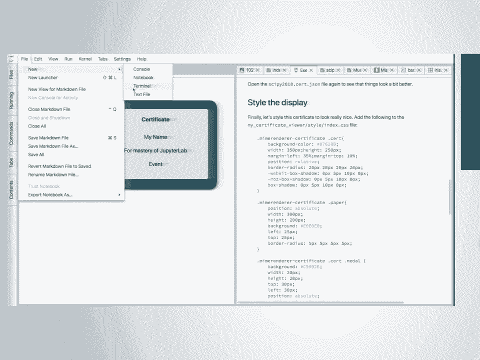

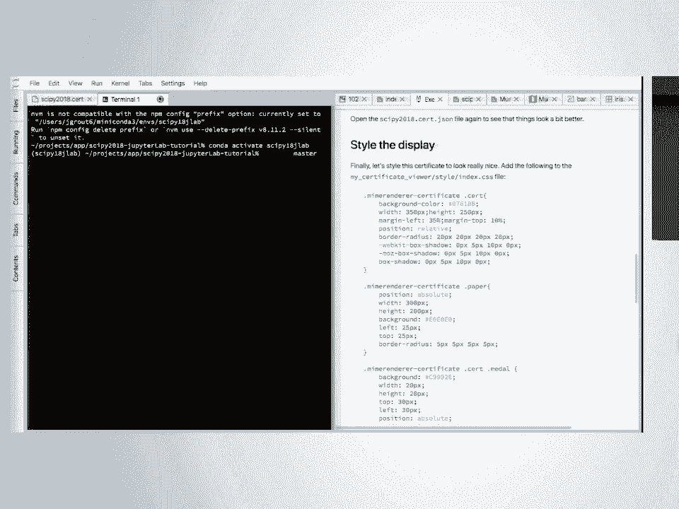

我们有标准的东西，比如图像查看器，可以加减缩放，左右括号旋转图像。我点击了图像的末端。所以这是一个不错的图像查看器。我们有 PDF 查看器。这是使用浏览器的 PDF 查看器。这是我们看到的幻灯片的一些版本。我们甚至有 GeoJSON 查看器。让我们看看，如果我们去华盛顿特区的博物馆，你知道，通常这就是我们处理的东西，对吧？但能够双击这个并将其视为实际的地图当然要容易得多。同样，这是一个插件。实际上，这个插件是在 SciPy 编写的，或者至少它的初始版本是在 SciPy 用几个小时编写的，或者经过一夜的打磨。它表明了编写这些查看器是多么容易。实际上，到今天结束时，我们将为我们自己的文件格式编写我们自己的查看器。

我们还有 VegaLite 文件查看器。这实际上是一个 JSON 文件。让我们看看它在 JSON 中的样子。我们可以打开这个。这是一种图形格式，一种来自华盛顿大学的 JSON 图形格式，现在相当流行。实际上，也可以用编辑器打开它。

所以我们这里有这个文件的三种不同视图：JSON 树视图、实际图形视图和编辑器视图。同样，所有这些视图都是实时的。我想如果我把那个改成圆形，你可以看到图形更新了，JSON 查看器更新了，当然编辑器也更新了。我可以保存我的文件，然后继续。

当然，我们经常处理的文件格式之一是数据网格类型的文件格式，比如 CSV 或某种表格数据格式。这是一个全新的 CSV 查看器，是专门为在 JupyterLab 中使用而编写的。它基于 Chris Colbert 编写的底层库 PhosphorJS，该库构成了 JupyterLab 应用程序的基础。当然，我们有小的 CSV 文件，但它甚至可以处理更大的 CSV 文件。这是一个 120 万行的 CSV，Excel 在尝试打开它时会卡住很长时间。但 JupyterLab 只需几秒钟就能将 200 兆字节加载到你的浏览器中，然后你可以流畅地滚动。实际上，200 兆字节在这里算是小的。在 Chrome 中，我们可以处理高达 800 兆字节左右的文件；在 Safari 中，我们基本上受限于浏览器允许的内存分配；在 Firefox 中，你大约有 200 兆字节的限制。但任何 1.5 千兆字节的 CSV 文件，一旦数据加载到浏览器中，你就可以流畅地滚动浏览。

好的，这些是 JupyterLab 自带的一些文件查看器。这是一个可扩展的系统。添加你自己的文件查看器很简单。

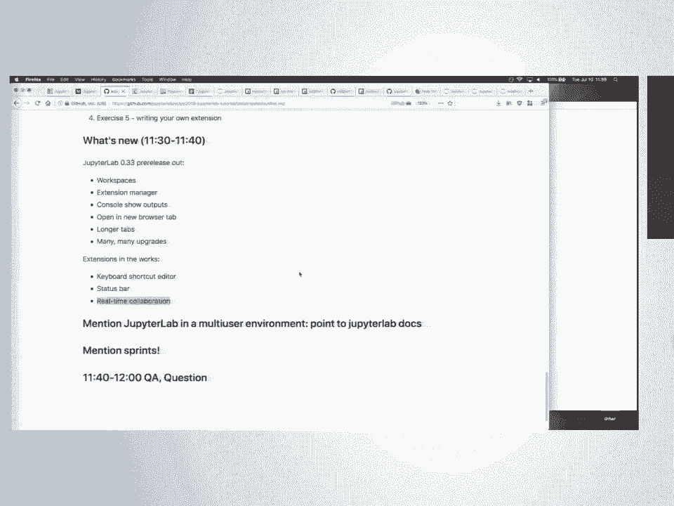

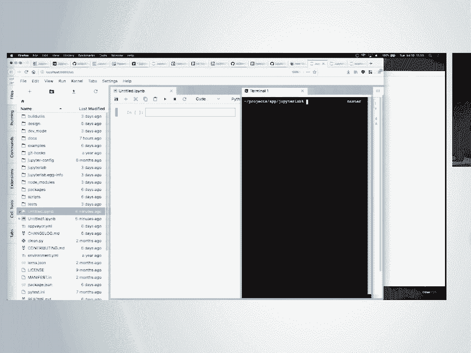

例如，去年在 SciPy，我们展示了 JupyterLab，有人说，伙计，我处理 FASTA 文件并进行基因组分析，如果有一个 FASTA 查看器就好了。所以我们坐下来，只用了一两个小时，找到了一个在线库，可以读取 FASTA 文件并渲染它们。只需几十行代码来包装这个库。现在我们有了一个 FASTA 查看器。这是一个 FASTA 查看器。这个文件实际上看起来是这样的。所以你可以想象，你更愿意处理这个还是处理这个？他们更喜欢这个。不仅仅是文件查看器，系统的可扩展性足以让这变得非常容易。完全相同的几十行代码，不仅使这成为可能，还自动成为了笔记本中的一个查看器。

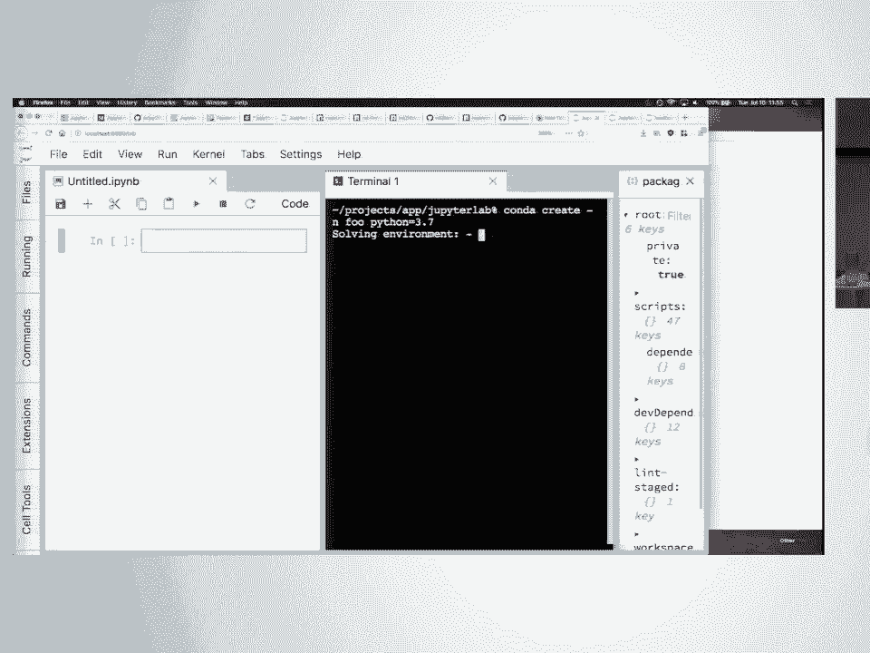

看起来出了点问题。我想这是——当你打开 200 兆字节的 CSV 文件并保持打开状态时，浏览器会出现内存问题。所以我关闭了那个大的 CSV 文件。你可以看到这里，完全相同的几十行代码，花了大约一两个小时编写，包装了这个已经可用的 JavaScript 库。不仅让你查看文件，还让你在笔记本中查看数据。同样，今天结束时，你将编写一个这样的扩展。

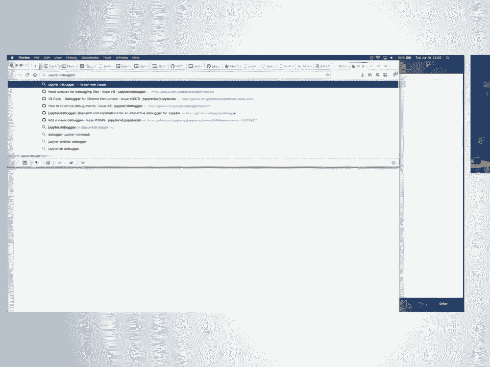

作为另一个例子，一月份我们在巴黎举办了一个研讨会，有人说，伙计，我希望能够在 JupyterLab 中绘制图表。有一个非常酷的库叫做 draw.io。它是一个用于绘制图表的 JavaScript 库。我们能包装它吗？事实证明你可以。令人惊讶的是，才华横溢的 Wolf Brackett 和 Quantstack 制作了一个新的 draw.io 图表插件。所以我们最终得到了一个功能齐全的图表编辑器，包装了 draw.io 的 JavaScript 代码，让你可以绘制图表。这是一个完整的图表。你可以编辑它，可以保存文件，可以打开新文件。这是一个我喜欢的例子。但它确实是一个非常不错的图表编辑器。花了大约一周时间来弄清楚如何包装它，与代码库接口等。现在你在 JupyterLab 中有了一个功能齐全的图表编辑器。

这是一个非常酷的想法。实际上，这个特定的插件真正让我看到了 JupyterLab