# 46：TensorFlow入门教程  🚀

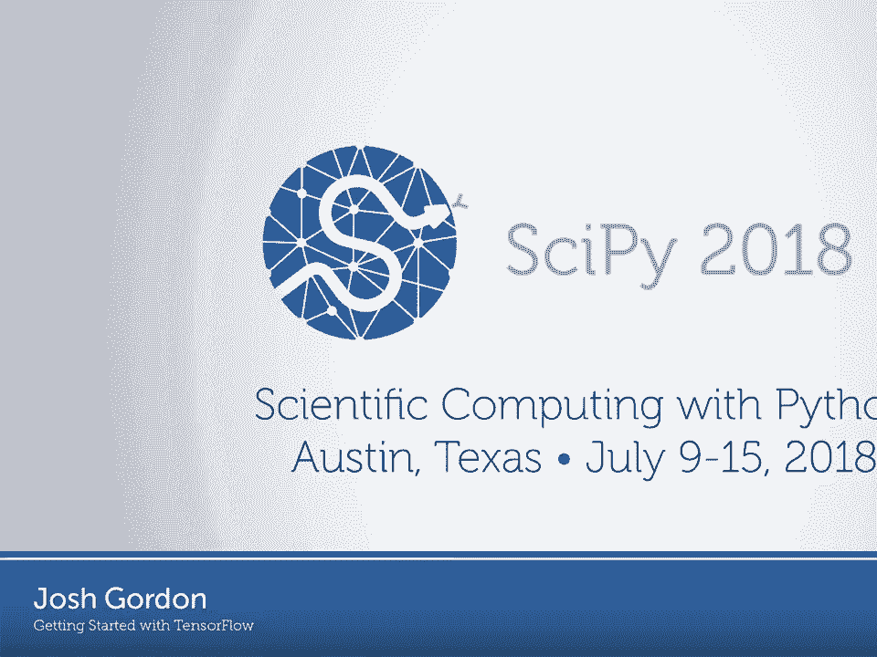

## 概述

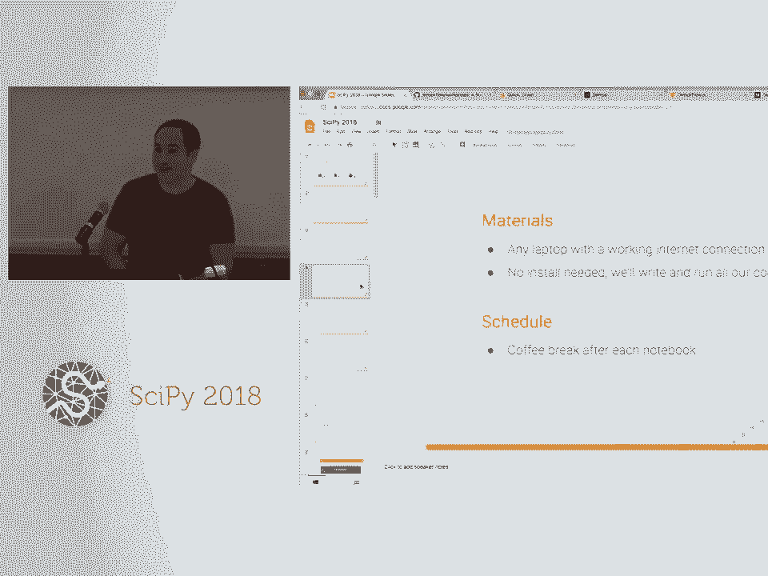


在本教程中，我们将学习如何使用TensorFlow 1.9版本进行深度学习。本教程面向初学者，旨在提供最有效、代码量最少的方式来编写TensorFlow程序，并训练神经网络。我们将通过四个入门级的Notebook进行实践，涵盖图像分类、文本分类、结构化数据预测以及文本生成等内容。所有代码都将在Colab（一个基于Web的免费Jupyter Notebook环境）中运行，无需安装任何软件。

---

## TensorFlow简介与Colab环境 🛠️

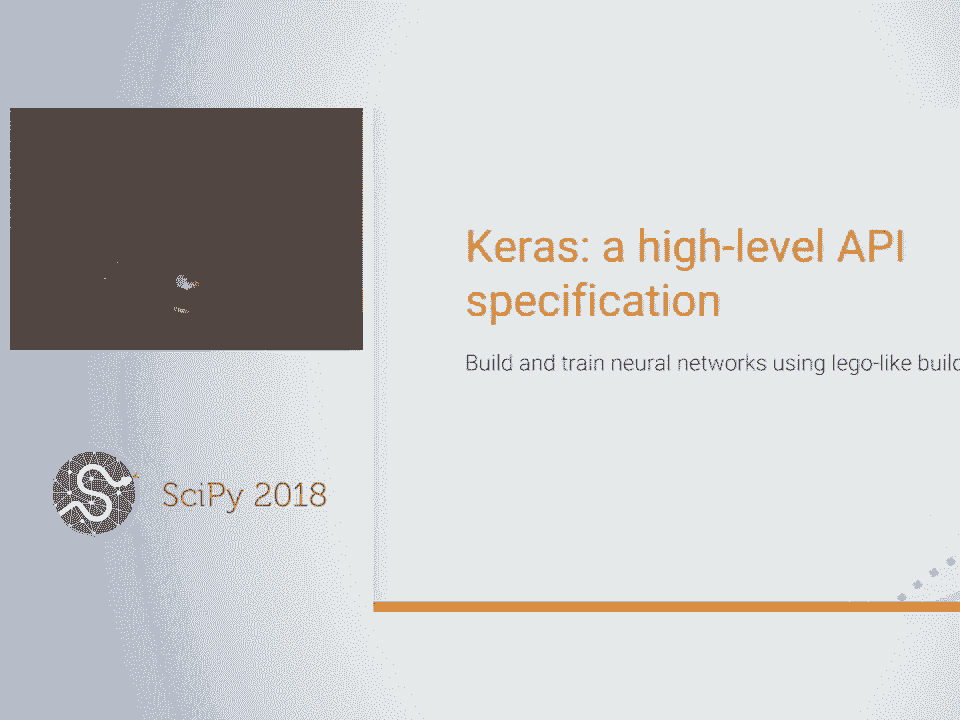


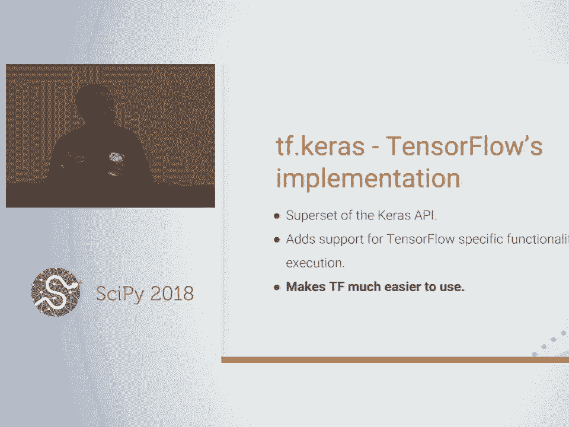

上一节我们概述了本教程的内容，本节中我们来看看TensorFlow的基本介绍以及我们将要使用的Colab环境。

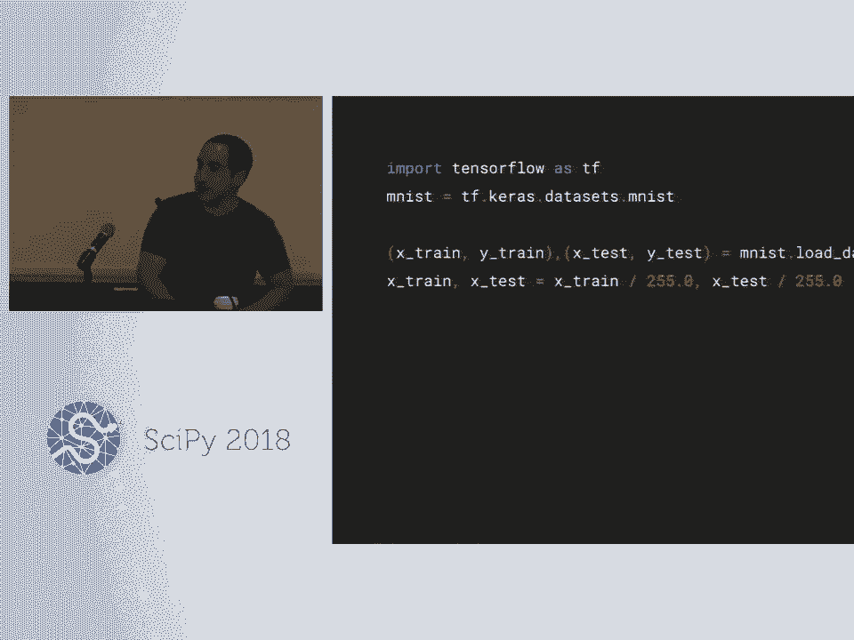

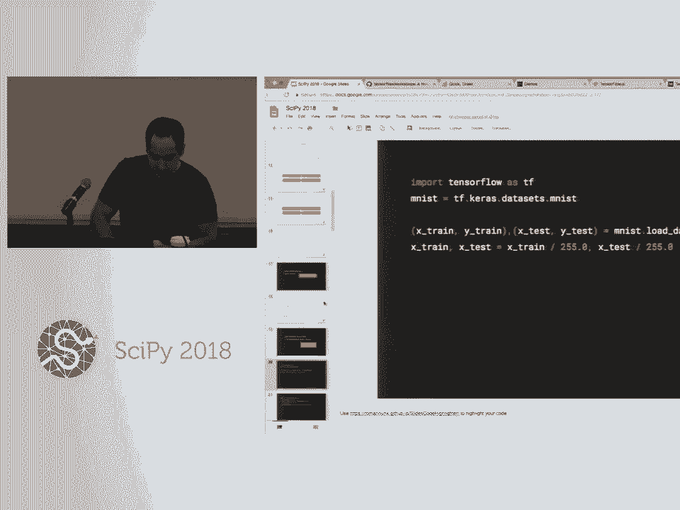


TensorFlow是一个由Google开发的开源机器学习框架，拥有庞大的开发者社区。它支持多种平台和设备，包括JavaScript、Android、iOS、GPU和TPU。TensorFlow的核心是一个数据流图（Dataflow Graph），但为了简化使用，我们推荐从高级API开始。

我们将使用Colab（colab.research.google.com）来运行所有代码。Colab是一个免费的、基于Web的Jupyter Notebook环境，预装了TensorFlow，并且提供免费的GPU资源。你可以将Colab中编写的代码下载为标准的Jupyter Notebook文件，也可以保存到Google Drive或GitHub。

以下是Colab的一些有用功能：
*   代码片段（Snippets）：提供常用代码块的快速插入。
*   硬件加速器：可以在设置中启用GPU以加速计算。
*   运行时管理：可以重启运行时以清除状态。

对于深度学习初学者，不建议立即购买昂贵的GPU硬件。可以先从云环境（如Colab）开始，待有明确需求后再考虑本地硬件。

---

## 第一个Notebook：Fashion MNIST图像分类 👕

上一节我们介绍了Colab环境，本节中我们来看看如何使用TensorFlow进行第一个图像分类任务。

我们将使用Fashion MNIST数据集，它是经典MNIST数据集的一个变体，包含60,000张28x28像素的灰度服装图片，分为10个类别（如T恤、裤子、鞋子等）。我们的目标是训练一个模型，能够根据图片预测其所属的服装类别。

### 代码步骤解析

以下是训练一个神经网络的核心步骤：


1.  **导入库与数据**：首先导入TensorFlow、Keras（作为`tf.keras`）、NumPy和Matplotlib。然后加载Fashion MNIST数据集，该数据集已内置在TensorFlow中。

    ```python
    import tensorflow as tf
    from tensorflow import keras
    import numpy as np
    import matplotlib.pyplot as plt

    fashion_mnist = keras.datasets.fashion_mnist
    (train_images, train_labels), (test_images, test_labels) = fashion_mnist.load_data()
    ```

2.  **数据预处理**：将像素值从0-255归一化到0-1之间，这对神经网络的训练很重要。同时，我们查看一下数据的形状。

    ```python
    train_images = train_images / 255.0
    test_images = test_images / 255.0
    print(train_images.shape) # 输出：(60000, 28, 28)
    ```

3.  **构建模型**：使用Keras的Sequential API顺序堆叠层来定义模型。我们首先将28x28的二维图像展平（Flatten）成一维向量（784个像素），然后添加一个具有128个神经元、使用ReLU激活函数的全连接层（Dense），最后添加一个具有10个神经元（对应10个类别）、使用Softmax激活函数的输出层。

    ```python
    model = keras.Sequential([
        keras.layers.Flatten(input_shape=(28, 28)),
        keras.layers.Dense(128, activation='relu'),
        keras.layers.Dense(10, activation='softmax')
    ])
    ```

4.  **编译模型**：需要指定优化器（Optimizer）、损失函数（Loss Function）和评估指标（Metrics）。对于多分类问题，我们使用`sparse_categorical_crossentropy`作为损失函数，使用`Adam`作为优化器。

    ```python
    model.compile(optimizer='adam',
                  loss='sparse_categorical_crossentropy',
                  metrics=['accuracy'])
    ```

5.  **训练模型**：使用`fit`方法在训练数据上训练模型。我们需要指定训练的轮数（epochs）。训练过程中会输出损失和准确率。

    ```python
    model.fit(train_images, train_labels, epochs=10)
    ```

6.  **评估模型**：使用`evaluate`方法在测试集上评估模型的性能，这是衡量模型泛化能力的关键。

    ```python
    test_loss, test_acc = model.evaluate(test_images, test_labels)
    print('Test accuracy:', test_acc)
    ```

7.  **进行预测**：使用训练好的模型对新的图像进行预测，并可视化部分预测结果。

    ```python
    predictions = model.predict(test_images)
    # 获取第一个测试图像的预测类别
    predicted_label = np.argmax(predictions[0])
    print(predicted_label)
    ```


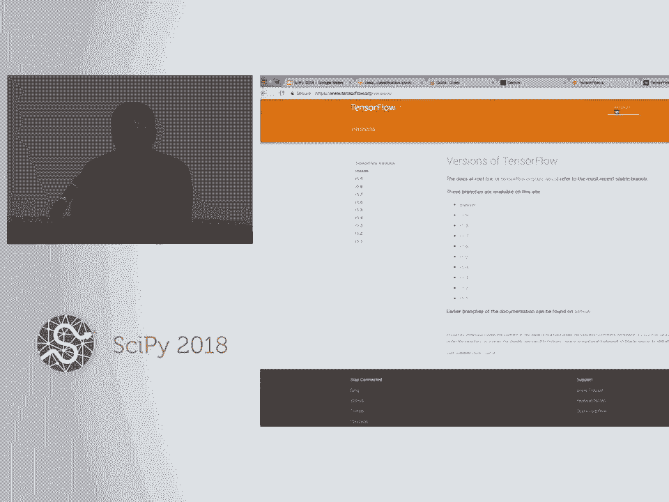

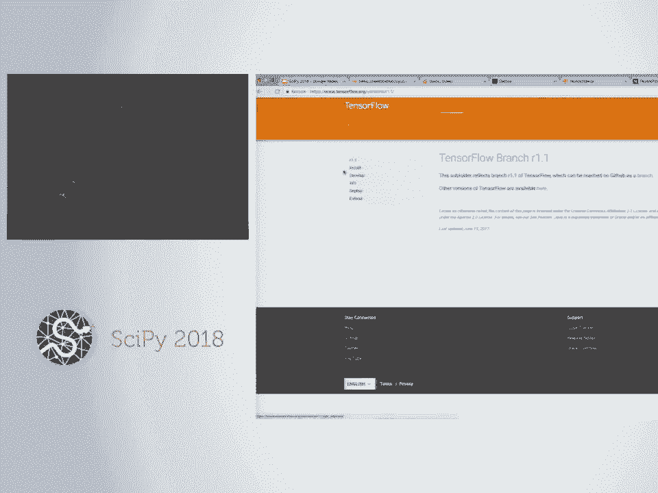

### 核心概念与技巧


*   **模型容量与过拟合**：网络层数和每层神经元数决定了模型的容量。容量不足可能导致欠拟合（无法学习数据中的模式），容量过大则可能导致过拟合（记忆训练数据，在测试集上表现差）。需要通过实验找到平衡点。
*   **超参数**：如训练轮数（epochs）、学习率等，需要针对具体问题进行调整。寻找最佳epochs的常用方法是观察验证集损失不再下降的时刻。
*   **资源推荐**：对于损失函数、优化器等概念，推荐参考Google的**Machine Learning Crash Course**进行学习（注重概念，可先忽略其中的代码示例）。

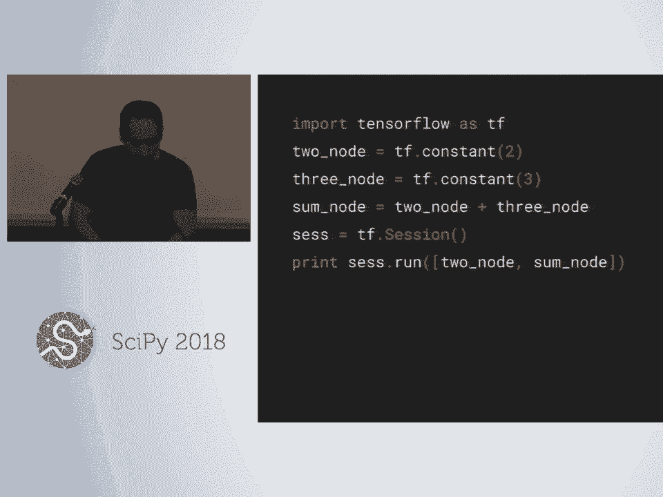

通过修改模型架构（例如增加一个`Dense`层），可以轻松尝试不同的网络设计，这是Keras API的一大优势。

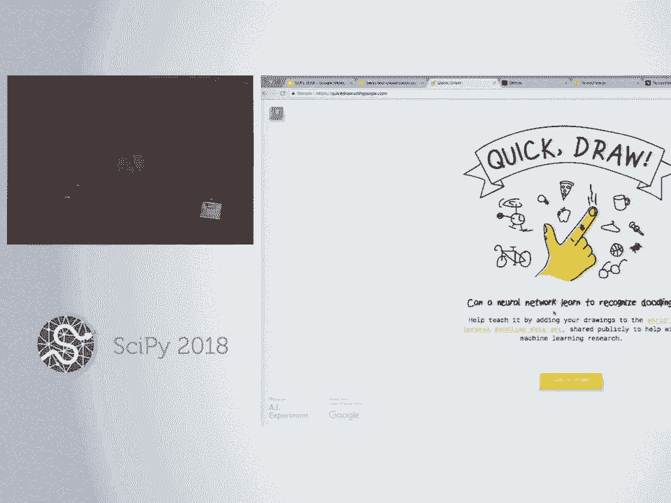


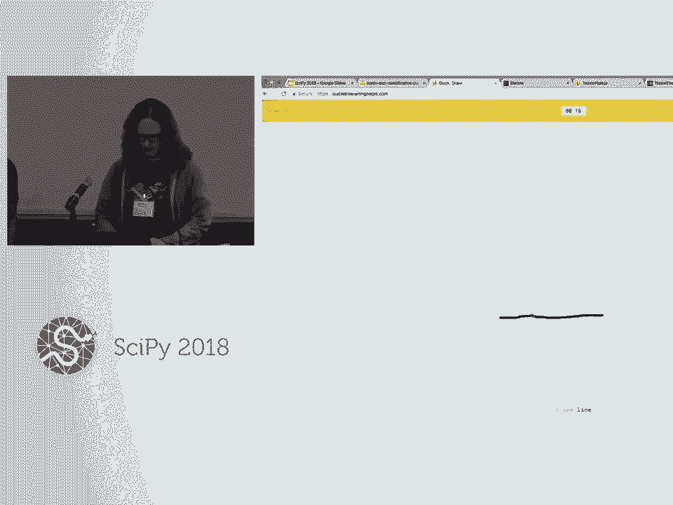


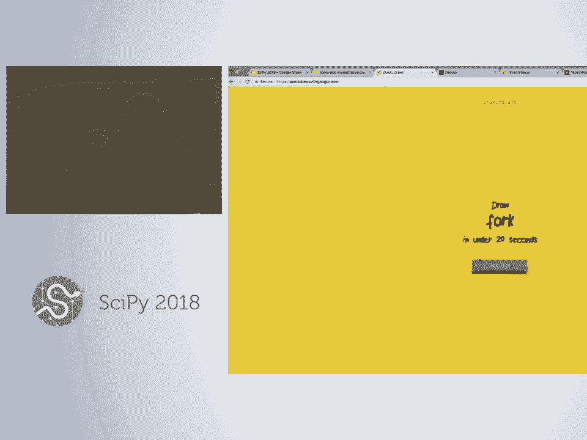

---

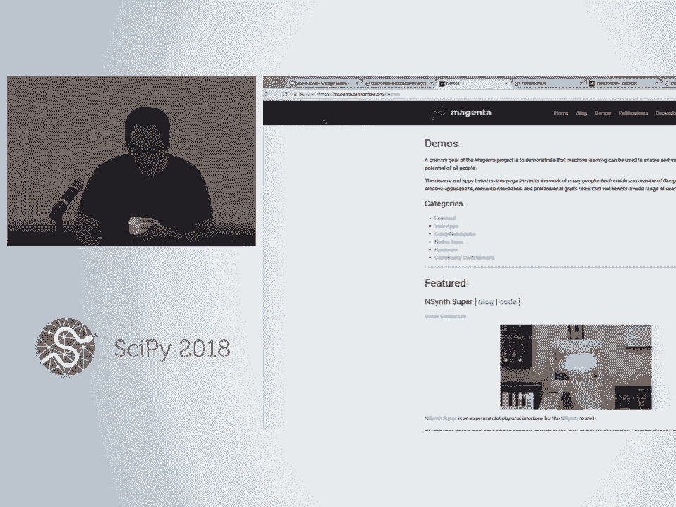

## 第二个Notebook：IMDB电影评论情感分类 🎬

上一节我们完成了图像分类，本节中我们来看看如何处理文本分类任务。

我们将使用IMDB电影评论数据集，其中包含25,000条电影评论，标签为正面（1）或负面（0）。目标是训练一个模型，能够根据评论文本判断其情感倾向。

### 代码步骤解析

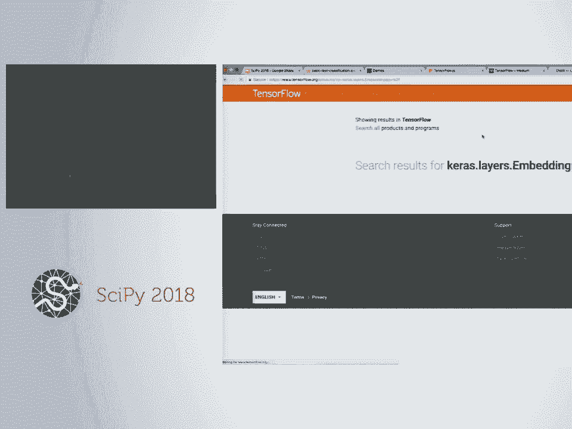

1.  **加载与预处理文本数据**：IMDB数据集中的评论已被编码为整数序列，每个整数代表一个单词。我们限制只考虑数据集中前10，000个最常用的单词。由于每条评论长度不同，我们需要将它们填充（pad）或截断（truncate）到相同的长度（例如256个单词）。

    ```python
    from tensorflow.keras.preprocessing.sequence import pad_sequences
    train_data = pad_sequences(train_data, value=0, padding='post', maxlen=256)
    test_data = pad_sequences(test_data, value=0, padding='post', maxlen=256)
    ```

2.  **构建模型**：与图像分类不同，文本分类常使用嵌入层（Embedding Layer）。该层将每个单词索引映射为一个固定大小的密集向量。然后通过一个全局平均池化层（GlobalAveragePooling1D）对序列进行降维，最后连接全连接层。

    ```python
    model = keras.Sequential([
        keras.layers.Embedding(10000, 16),
        keras.layers.GlobalAveragePooling1D(),
        keras.layers.Dense(16, activation='relu'),
        keras.layers.Dense(1, activation='sigmoid')
    ])
    ```

3.  **编译与训练**：对于二分类问题，损失函数使用`binary_crossentropy`。我们将训练数据的一部分（如最后10，000条）作为验证集（validation set），用于在训练过程中监控模型在未见数据上的表现。

    ```python
    model.compile(optimizer='adam', loss='binary_crossentropy', metrics=['accuracy'])
    history = model.fit(train_data, train_labels, epochs=40,
                        validation_data=(val_data, val_labels), verbose=2)
    ```

### 核心概念：训练集、验证集与测试集

这是机器学习中至关重要的概念：
*   **训练集**：用于训练模型、调整模型内部参数（权重）的数据。
*   **验证集**：用于在训练过程中模拟测试集，调整超参数（如epochs、网络结构），**不参与**模型权重的更新。
*   **测试集**：用于最终评估模型性能的数据，**仅使用一次**。在模型开发和调优完成后，用测试集给出最终的性能报告。

如果验证集准确率远低于训练集准确率，通常意味着模型出现了**过拟合**。

---

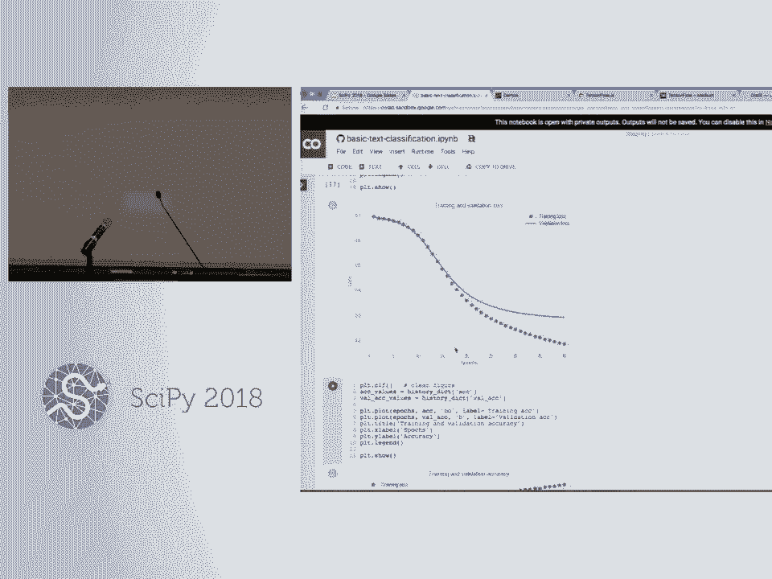

## 第三个Notebook：波士顿房价预测（结构化数据）🏠

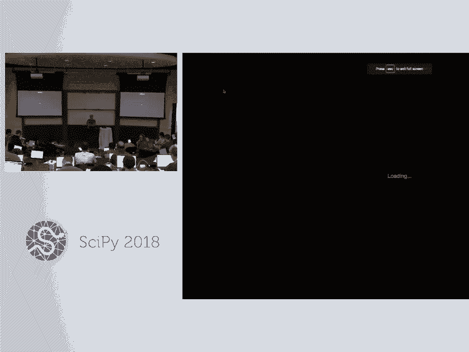

上一节我们处理了文本数据，本节中我们来看看如何处理表格型的结构化数据。

我们将使用经典的波士顿房价数据集，包含13个特征（如人均犯罪率、房间数等），目标是预测房屋的中位数价格。这是一个**回归**问题（预测连续值），而非分类问题。

### 代码步骤解析

1.  **数据探索与标准化**：使用Pandas等工具查看数据。对于结构化数据，理解每个特征的含义和分布非常重要。通常需要对数值特征进行标准化（减均值、除标准差），使它们处于相近的尺度，有利于网络训练。

    ```python
    mean = train_data.mean(axis=0)
    std = train_data.std(axis=0)
    train_data = (train_data - mean) / std
    test_data = (test_data - mean) / std
    ```

2.  **构建与训练回归模型**：输出层只有一个神经元，不使用激活函数（以输出任意范围的数值）。损失函数使用均方误差（Mean Squared Error， MSE）。

    ```python
    model = keras.Sequential([
        keras.layers.Dense(64, activation='relu', input_shape=[len(train_data.keys())]),
        keras.layers.Dense(64, activation='relu'),
        keras.layers.Dense(1)
    ])
    model.compile(optimizer='adam', loss='mse', metrics=['mae'])
    ```

3.  **使用回调函数**：可以使用`EarlyStopping`回调，当验证集损失在连续一定轮数内不再下降时，自动停止训练，防止过拟合并节省时间。

    ```python
    early_stop = keras.callbacks.EarlyStopping(monitor='val_loss', patience=20)
    history = model.fit(train_data, train_labels, epochs=500,
                        validation_split=0.2, callbacks=[early_stop])
    ```

### 关于结构化数据的补充

*   **特征工程**：对于结构化数据，特征的质量和数量至关重要。大部分时间会花在数据收集、清洗和特征工程上。
*   **工具推荐**：可以使用**Facets**等工具可视化表格数据，帮助理解特征分布和重要性。
*   **更高级的教程**：对于更复杂的结构化数据问题，可以查阅TensorFlow的 **“Wide & Deep”** 教程，它提供了更丰富的特征处理方式。

---

## 第四个Notebook：过拟合与欠拟合的应对策略 ⚖️

上一节我们介绍了回归任务，本节中我们深入探讨机器学习中的核心挑战：过拟合与欠拟合，并学习应对策略。

我们将再次使用IMDB数据集，但这次使用**独热编码**（One-Hot Encoding）来表示文本，并比较不同容量模型的性能。

### 策略一：调整模型容量

*   **小模型（欠拟合）**：如果模型层数太少或神经元过少，可能无法学习数据中的有效模式，表现为在训练集和验证集上的性能都很差。
*   **大模型（过拟合）**：如果模型过于复杂，它可能会“记住”训练数据中的噪声和细节，而不是学习泛化模式，表现为训练集性能极好，但验证集性能很差。
*   **合适容量的模型**：需要在两者之间取得平衡。

### 策略二：权重正则化

通过向网络的损失函数中添加一个与权重大小相关的惩罚项，迫使网络权重取较小的值，从而使模型更加简单，缓解过拟合。常见的有L1和L2正则化。

```python
# 在Dense层中添加L2正则化
keras.layers.Dense(16, activation='relu',
                   kernel_regularizer=keras.regularizers.l2(0.001))
```

### 策略三：Dropout

Dropout是另一种强大且常用的正则化技术。在训练过程中，它随机“丢弃”（即暂时移除）网络层中的一部分输出单元。这可以防止单元之间产生复杂的协同适应，迫使网络学习更鲁棒的特征。

```python
model = keras.Sequential([
    keras.layers.Dense(16, activation='relu'),
    keras.layers.Dropout(0.5), # 丢弃50%的单位
    keras.layers.Dense(16, activation='relu'),
    keras.layers.Dropout(0.5),
    keras.layers.Dense(1, activation='sigmoid')
])
```

通过绘制训练损失和验证损失随训练轮数变化的曲线，可以直观地判断过拟合发生的位置，并据此调整模型容量、正则化强度或使用早停法。

---

## 第五个Notebook：使用Eager Execution进行文本生成 📝

上一节我们讨论了正则化技术，本节中我们来看看TensorFlow的一种更灵活的执行模式：Eager Execution，并用它来实现一个有趣的文本生成模型。

Eager Execution是一种命令式编程环境，TensorFlow操作会立即被执行并返回结果，无需构建静态计算图。这使得TensorFlow的开发和调试更像普通的Python编程。

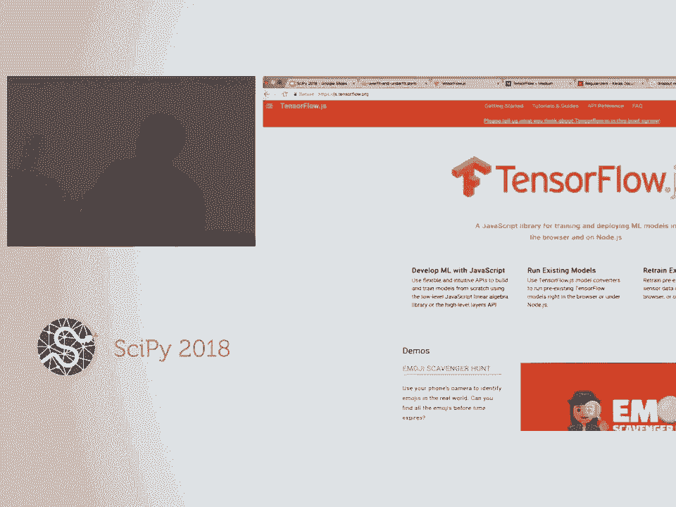


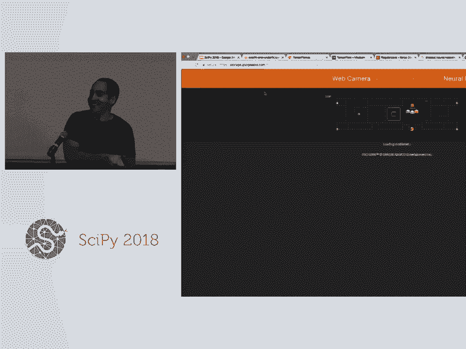

我们将训练一个循环神经网络（RNN），使其学习莎士比亚文风的文本，然后让它生成新的文本。


### 代码核心思路


1.  **启用Eager Execution并准备数据**：将莎士比亚文本转换为字符序列，并创建字符到索引的映射。

    ```python
    tf.enable_eager_execution()
    # ... 文本加载和字符映射代码 ...
    ```

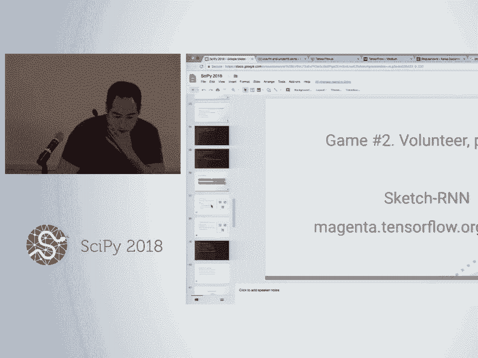

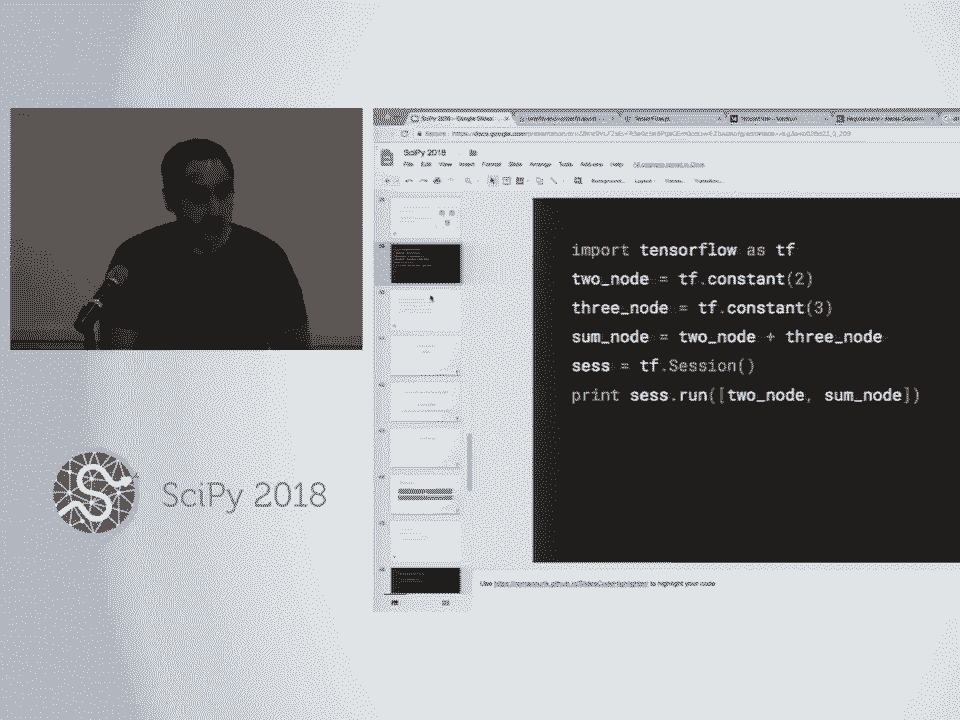

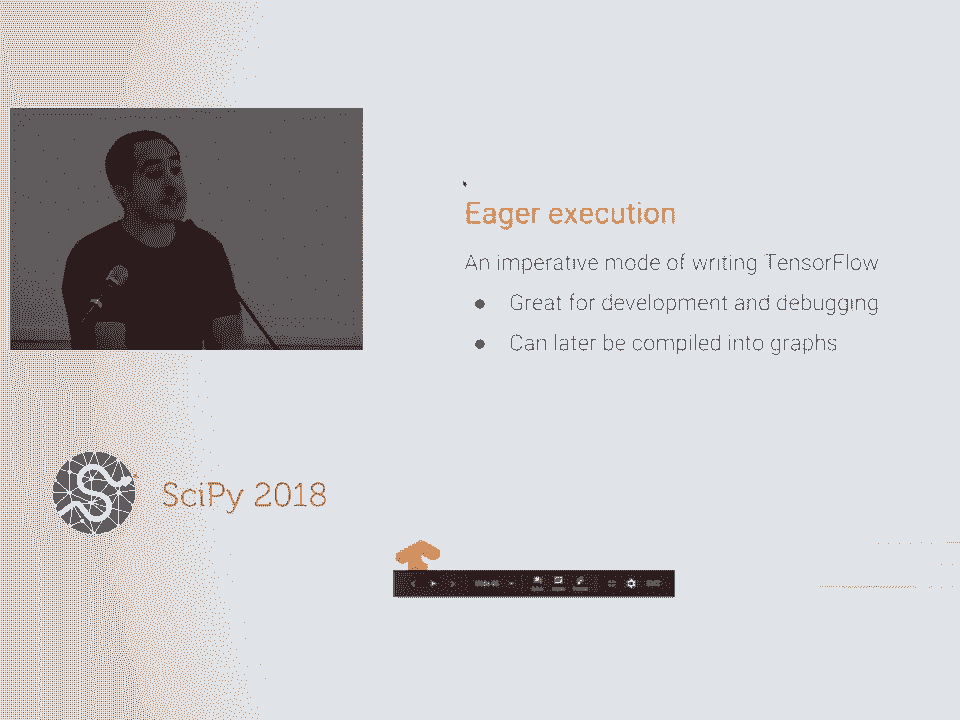

2.  **创建训练样本**：将文本分割成多个连续的序列。对于每个序列，输入是前N个字符，目标是第N+1个字符。

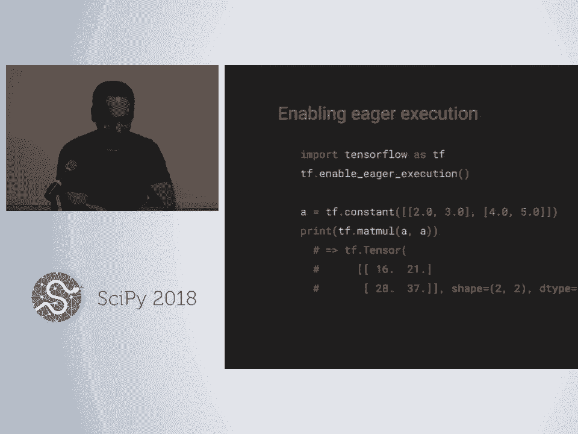

3.  **构建RNN模型**：模型包含一个嵌入层（将字符索引映射为向量）、一个GRU层（一种RNN单元）和一个全连接输出层。

    ```python
    class TextGenModel(tf.keras.Model):
        def __init__(self, vocab_size, embedding_dim, units):
            super(TextGenModel, self).__init__()
            self.embedding = tf.keras.layers.Embedding(vocab_size, embedding_dim)
            self.gru = tf.keras.layers.GRU(units, return_sequences=True, return_state=True)
            self.fc = tf.keras.layers.Dense(vocab_size)
    ```

4.  **自定义训练循环**：在Eager模式下，我们可以编写显式的训练循环，这提供了极大的灵活性（例如实现梯度裁剪、自定义损失等）。

    ```python
    for epoch in range(EPOCHS):
        for (batch, (inp, target)) in enumerate(dataset):
            with tf.GradientTape() as tape:
                predictions, _ = model(inp)
                loss = compute_loss(target, predictions)
            gradients = tape.gradient(loss, model.trainable_variables)
            optimizer.apply_gradients(zip(gradients, model.trainable_variables))
    ```

5.  **文本生成**：从一个起始字符串开始，模型预测下一个最可能的字符，然后将该字符追加到输入中，重复此过程以生成长文本。

这个例子展示了如何将`tf.keras`层与底层的TensorFlow操作（在Eager模式下）结合使用，以实现复杂且灵活的研究想法。你可以通过替换训练文本（例如使用项目Gutenberg的电子书）来生成不同风格的文本。

---

## 其他资源与总结 🎯

在本教程中，我们一起学习了：
1.  TensorFlow和Keras API的基本使用方法。
2.  在Colab环境中运行深度学习代码。
3.  如何处理图像分类（Fashion MNIST）、文本分类（IMDB）和回归（波士顿房价）任务。
4.  机器学习中的重要概念：训练/验证/测试集、过拟合与欠拟合，以及应对策略（调整容量、正则化、Dropout）。
5.  如何使用Eager Execution进行更灵活的研究和开发。

### 延伸学习资源

*   **Google Machine Learning Crash Course (MLCC)**：极佳的概念学习资源。
*   **Stanford CS231n (CNN for Visual Recognition)** 和 **CS224n (NLP with Deep Learning)**：深入的课程。
*   **François Chollet的《Deep Learning with Python》**：学习Keras的绝佳书籍。
*   **TensorFlow.js**：在浏览器中运行和部署TensorFlow模型。
*   **TensorFlow官方文档和教程**：随着1.9版本发布，网站将更新更多初学者友好的材料。

TensorFlow是一个庞大且快速发展的生态系统。对于初学者，建议从`tf.keras`开始，这是最直接、高效的入门路径。随着经验的积累，你可以根据需要探索更底层的API或其他高级功能。


祝你学习愉快！