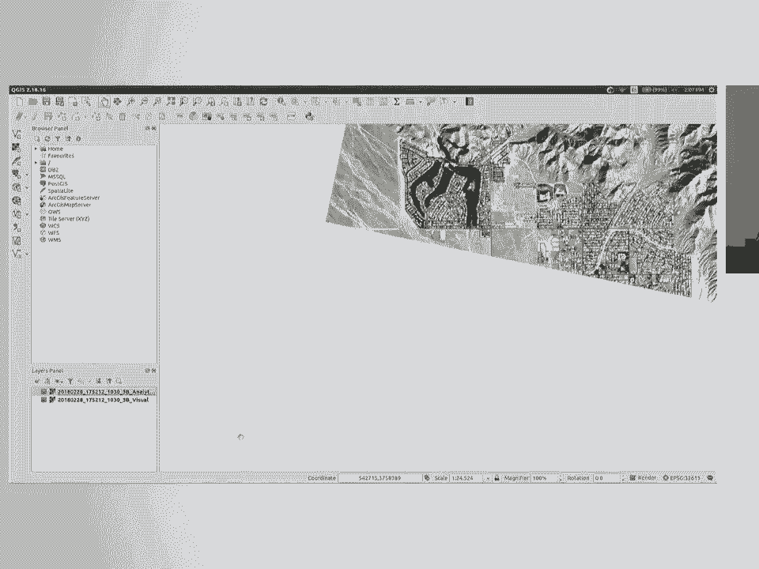
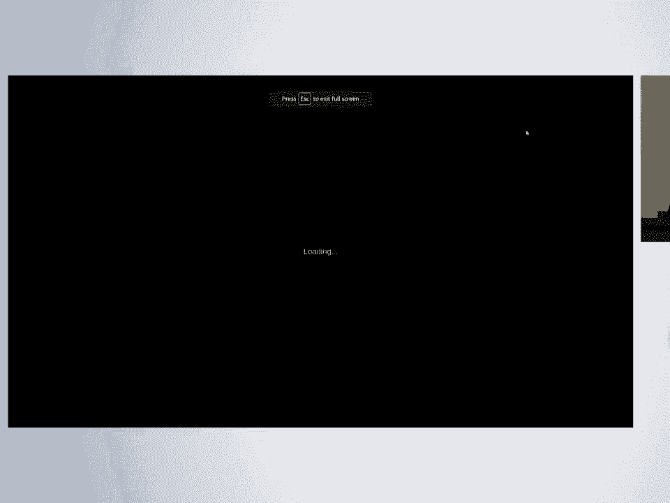
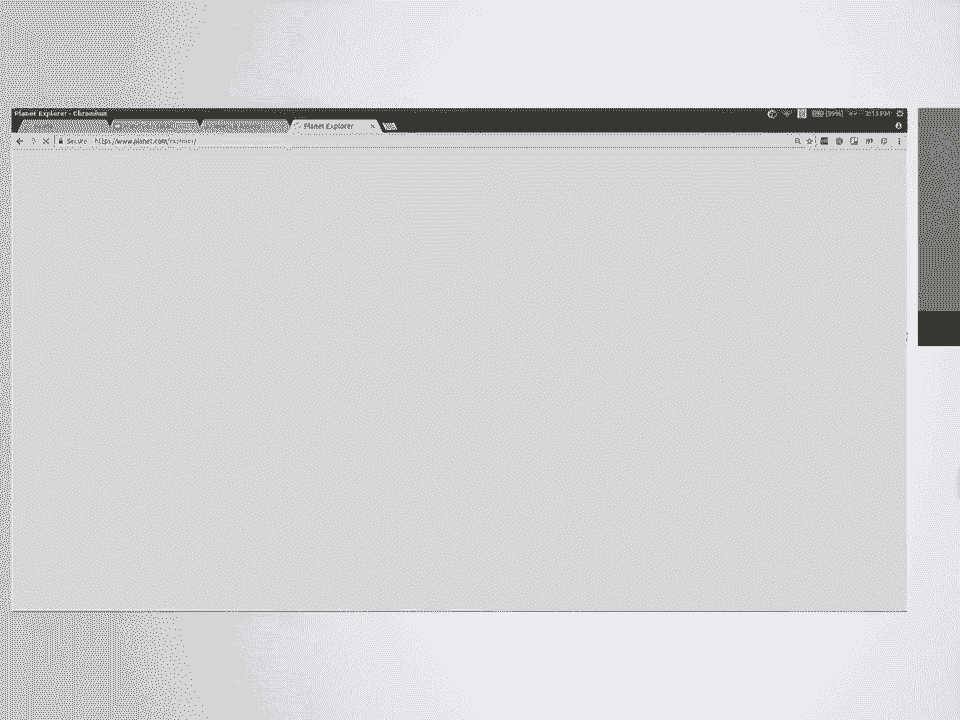
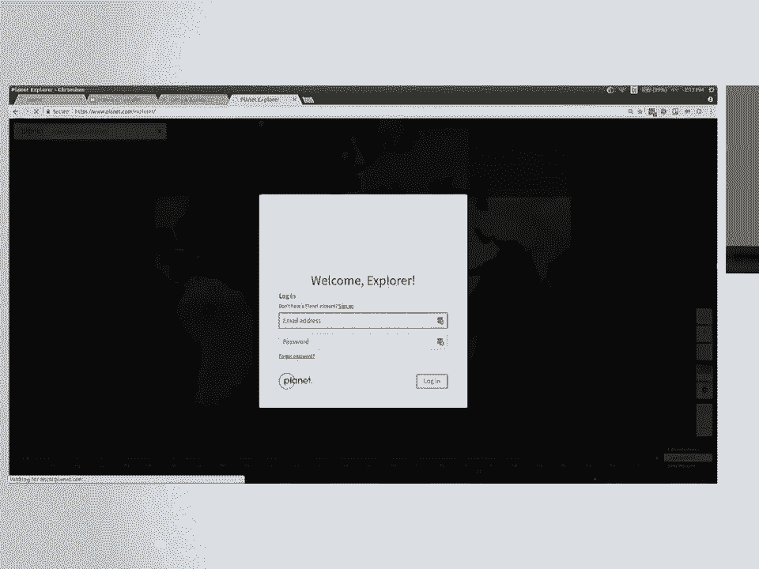
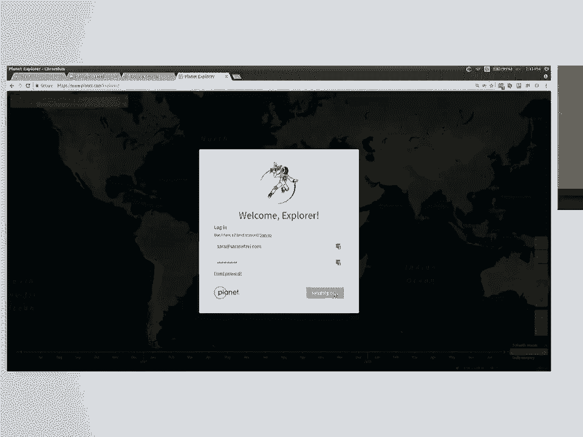
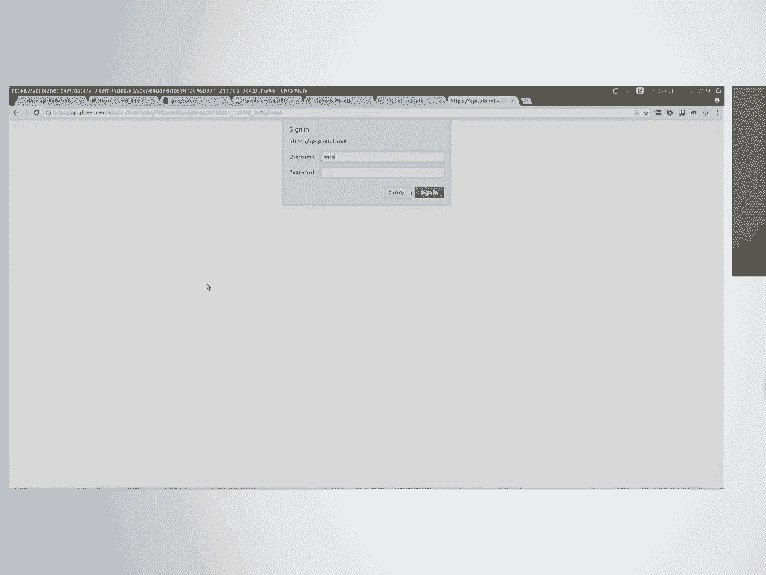
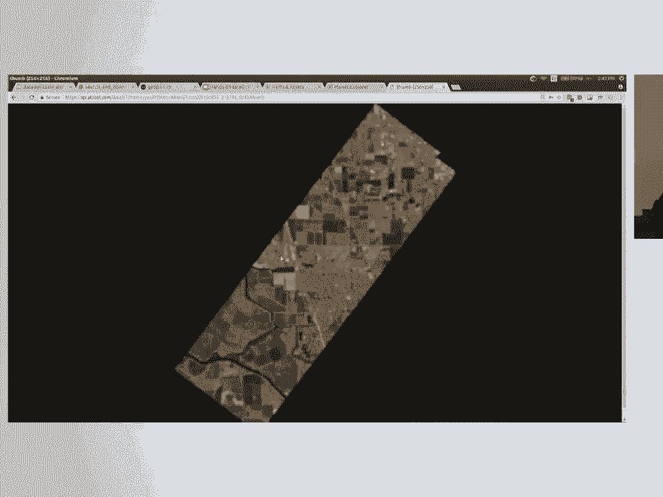
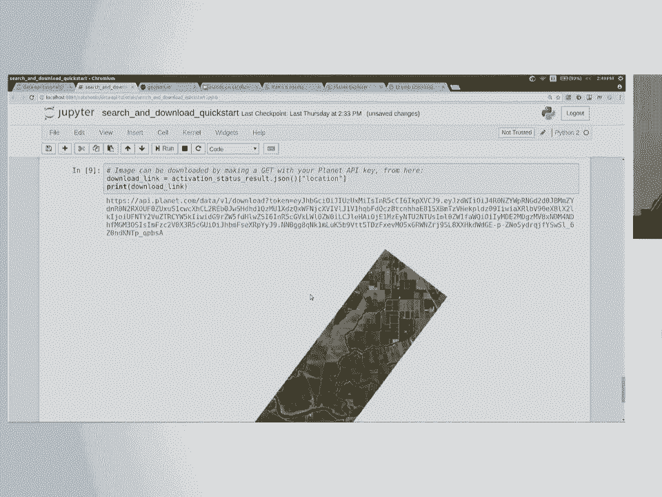
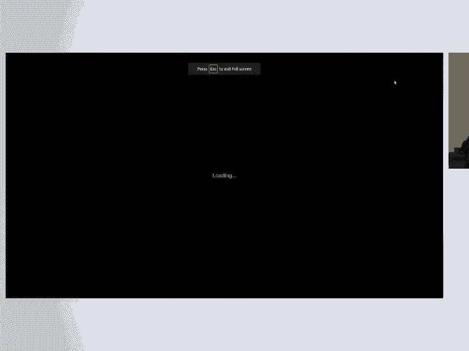
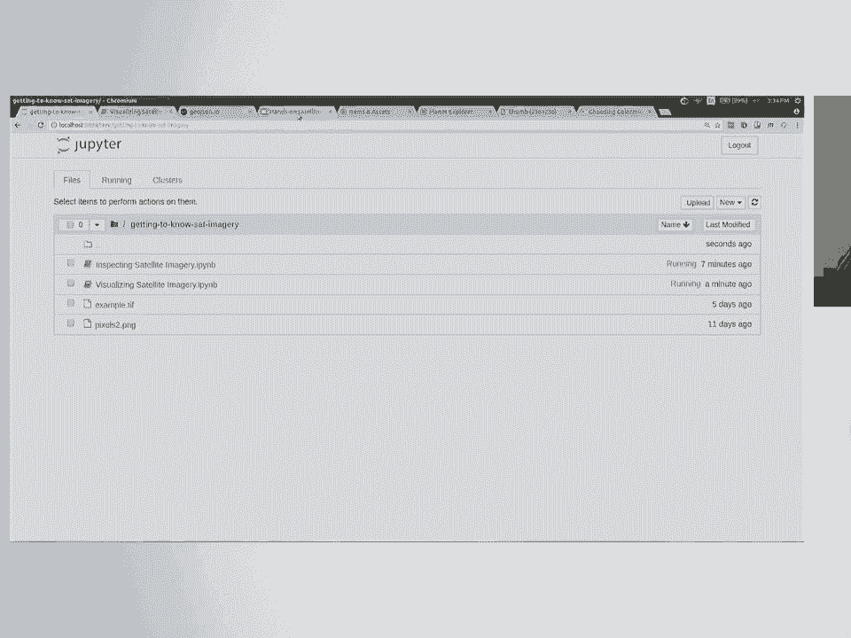

# 47：动手卫星影像分析 🛰️

在本课程中，我们将学习卫星影像和地球观测数据的基础知识。我们将了解如何获取、查看和分析这类数据，并使用Python进行实际操作。

---

## 概述

大家好，感谢各位的到来。我是Sarah Safavi，是Planet公司的一名软件工程师。今天，我们将一起探索卫星影像分析的世界。课程分为两部分：首先，我们将了解卫星数据的基本概念，并使用QGIS软件查看数据；然后，我们将使用Python来获取、处理和分析卫星影像。

---

## 卫星与地球观测简介 🌍

上一节我们介绍了课程的整体安排，本节中我们来看看卫星和地球观测的基本概念。

Planet公司（前身为Planet Labs）是一家初创公司，专门制造和发射小型卫星。这些卫星大约只有大鞋盒大小，重量约8公斤。它们的主要任务是进行地球观测，每天以约3米的分辨率拍摄整个地球陆地表面的影像。

除了Planet，还有其他许多卫星在进行地球观测，例如：
*   **Landsat**：由NASA和USGS运营，是历史最悠久的地球观测卫星项目。
*   **Sentinel**：由欧洲空间局（ESA）运营。
*   其他商业卫星，如Digital Globe。

卫星传感器可以捕捉比人眼可见光更广的光谱范围。除了红、绿、蓝波段，它们还能捕捉**近红外**波段。近红外光在区分植被和人造地物（如道路、建筑）方面非常有用。

**地球观测数据**是指从远处（通常通过卫星或飞机）收集的关于地球表面的数据。我们今天主要关注的是**卫星影像**。

---

## 卫星数据的特点 📊

上一节我们了解了卫星的基本情况，本节中我们来看看卫星数据本身的特点。

卫星影像是一种**地理空间栅格数据**。理解以下几点至关重要：

1.  **栅格 vs. 矢量**：
    *   **栅格数据**：由像素网格组成的图像，就像JPEG图片。
    *   **矢量数据**：由点、线、面等几何图形组成的数据。

2.  **地理空间特性**：
    与普通图片不同，卫星影像附带了**位置信息**。每个影像都知道自己在地球表面的位置，并拥有一个**坐标参考系统**。

3.  **波段**：
    卫星影像通常包含多个**波段**，每个波段代表不同光谱范围的信息。例如，一个四波段影像可能包含蓝、绿、红和近红外波段。每个像素在每个波段上都有一个数值。

    波段顺序等信息存储在影像的**元数据**中。元数据还可能包含坐标参考系统、影像覆盖范围、像素数量等信息。

---

## 使用QGIS查看数据 🗺️



了解了数据的基本概念后，我们来看看如何直观地查看它们。我们将使用开源桌面GIS工具——QGIS。



以下是加载和查看栅格数据的基本步骤：

1.  打开QGIS。
2.  在左侧工具栏，找到并点击“添加栅格图层”按钮（图标像像素网格）。
3.  导航并打开一个具有 `.tif` 扩展名的卫星影像文件。

在QGIS中，您可以：
*   查看影像的视觉呈现。
*   右键点击图层，选择“属性”，查看其坐标参考系统（如 `EPSG:32611`）、波段数量等元数据。
*   由于QGIS理解影像的空间信息，当您加载多个同一区域的影像时，它们会自动重叠。将鼠标悬停在地图上，底部状态栏会显示当前光标所在位置的地理坐标。

如果打开一个多波段（如四波段）影像，颜色可能看起来很奇怪，这是因为QGIS在尝试用屏幕颜色显示近红外等不可见波段的信息。我们稍后会用Python来处理这些波段。





---



## 获取数据的方式 🔍

现在我们知道如何查看数据了，那么如何获取数据呢？主要有以下几种方式：

1.  **“运动鞋网络”**：通过物理媒介（如U盘）共享数据。
2.  **AWS开放数据注册表**：亚马逊云服务提供了一个开放数据平台，托管了如Landsat 8、Sentinel-2等大量卫星数据。这些数据通常以**云优化GeoTIFF**格式存储，支持按范围读取，无需下载整个大文件。
3.  **Planet API**：我们将主要使用Planet的API来搜索和下载数据。Planet的“开放加州”项目提供了加州地区延迟两周发布的CC-BY-SA许可的影像数据，非常适合学习和研究。

---

## 使用Planet API搜索数据（上）🔑

上一节我们提到了多种数据来源，本节我们将重点学习如何使用Planet API来搜索数据。

首先，我们需要在浏览器中登录 `planet.com/explorer`。这个界面可以帮助我们直观地定义搜索区域和筛选条件。

以下是搜索数据的关键步骤和概念：

1.  **定义感兴趣区域**：在地图上绘制一个矩形或多边形，作为搜索的地理范围。
2.  **应用筛选器**：
    *   **日期范围**：选择影像的拍摄时间。
    *   **云覆盖率**：例如，筛选云覆盖率低于30%的影像。
    *   **覆盖百分比**：确保影像覆盖您感兴趣区域的比例。
    *   **数据源/资产类型**：
        *   **Item**：指传感器类型，如 `PSScene`（PlanetScope卫星）。
        *   **Asset**：指从传感器产生的影像类型，如 `analytic`（经过正射校正的四波段影像）或 `visual`（仅三波段的真彩色影像）。

在Explorer中选定影像后，可以创建订单以下载。数据从冷存储中激活需要几分钟时间，完成后会通过邮件提供下载链接。


---

## 使用Planet API搜索数据（下）🐍

在浏览器界面熟悉了搜索流程后，现在我们用Python代码来实现同样的功能。

我们将使用 `requests` 库通过Planet API进行搜索、激活和下载。核心步骤如下：

1.  **定义AOI**：使用 `geojson.io` 网站绘制一个区域，并获取其GeoJSON格式的几何坐标。
    ```python
    # 示例：定义AOI的几何坐标
    aoi_geometry = {
        "type": "Polygon",
        "coordinates": [[[-121.5, 38.0], [-121.5, 38.1], [-121.4, 38.1], [-121.4, 38.0], [-121.5, 38.0]]]
    }
    ```

2.  **设置过滤器**：组合几何范围、日期和云量等过滤器。
    ```python
    # 示例：创建几何过滤器
    geom_filter = {
        "type": "GeometryFilter",
        "field_name": "geometry",
        "config": aoi_geometry
    }
    # 创建日期范围过滤器
    date_filter = {
        "type": "DateRangeFilter",
        "field_name": "acquired",
        "config": {"gte": "2016-08-31T00:00:00.000Z", "lte": "2016-08-31T23:59:59.999Z"}
    }
    # 组合过滤器
    combined_filter = {"type": "AndFilter", "config": [geom_filter, date_filter]}
    ```

3.  **执行搜索**：向API发送请求，获取匹配的影像元数据列表。
4.  **激活资产**：选择特定影像的 `analytic` 资产，并发送请求将其激活（准备下载）。
5.  **下载影像**：轮询激活状态，当状态变为 `"active"` 后，即可通过提供的URL下载GeoTIFF文件。

---

## 使用Rasterio检查卫星影像 🔬

成功获取数据后，我们开始用Python深入分析它。我们将使用 `rasterio` 库，它是一个用于处理栅格数据的强大且Pythonic的库。

首先，我们打开一个GeoTIFF文件并检查其基本属性：





```python
import rasterio

# 打开卫星影像文件
with rasterio.open('example.tif') as src:
    # 获取影像边界（左下角，右上角坐标）
    bounds = src.bounds
    # 获取影像宽度和高度（像素数）
    width, height = src.width, src.height
    # 获取坐标参考系统
    crs = src.crs
    # 获取波段数量
    num_bands = src.count
    # 获取元数据
    meta = src.meta
```

通过计算，我们还可以得到影像的地面分辨率（米/像素），这是衡量影像细节程度的关键指标。

栅格数据在 `rasterio` 和 `numpy` 中被表示为多维数组。每个波段都是一个二维数组（行×列），每个像素值代表该波段的光谱反射强度。

```python
# 读取特定波段（索引从1开始）
blue_band = src.read(1)
# 获取该波段数组的最小值和最大值
import numpy as np
band_min = np.amin(blue_band)
band_max = np.amax(blue_band)
```

---



## 使用Matplotlib可视化影像 📈



检查完数据属性，我们将其可视化。`matplotlib` 库可以轻松地将数值数组绘制成图像。

以下是可视化不同波段的示例：

```python
import matplotlib.pyplot as plt

# 假设我们已经用rasterio读取了波段：blue, green, red, nir
fig, axes = plt.subplots(2, 2, figsize=(12, 10))

# 绘制蓝波段，使用'Blues'色彩映射
im0 = axes[0, 0].imshow(blue, cmap='Blues')
axes[0, 0].set_title('Blue Band')
plt.colorbar(im0, ax=axes[0, 0])

# 绘制绿波段，使用'Greens'色彩映射
im1 = axes[0, 1].imshow(green, cmap='Greens')
axes[0, 1].set_title('Green Band')
plt.colorbar(im1, ax=axes[0, 1])

# 绘制红波段，使用'Reds'色彩映射
im2 = axes[1, 0].imshow(red, cmap='Reds')
axes[1, 0].set_title('Red Band')
plt.colorbar(im2, ax=axes[1, 0])

# 绘制近红外波段，使用'viridis'色彩映射
im3 = axes[1, 1].imshow(nir, cmap='viridis')
axes[1, 1].set_title('Near-Infrared Band')
plt.colorbar(im3, ax=axes[1, 1])

# 隐藏坐标轴刻度以便更清晰地查看图像
for ax in axes.flat:
    ax.set_xticks([])
    ax.set_yticks([])

plt.tight_layout()
plt.show()
```

通过为不同波段分配不同的色彩映射，我们可以直观地观察各地物在不同光谱下的响应情况。

---

## 课堂练习 💻

我们已经学习了使用 `rasterio` 和 `matplotlib` 的基础知识，现在请通过以下练习来应用这些技能：

以下是三个练习主题，每个都包含一个空白笔记本和一个答案密钥：
*   **波段运算与生成NDVI**：通过红波段和近红外波段计算归一化差分植被指数，这是一种常用的植被健康度指标。
    *   **公式**：`NDVI = (NIR - Red) / (NIR + Red)`
*   **影像镶嵌**：将多个相邻的卫星影像拼接成一幅更大的、覆盖完整区域的影像。
*   **掩膜处理**：利用一个矢量边界文件（如GeoJSON），从卫星影像中裁剪出特定区域的子集。

请尝试在不看答案的情况下完成练习。您可以使用提供的演示数据，也可以使用自己通过API下载的数据。

---

## 总结与资源 📚

本节课中，我们一起学习了卫星影像分析的完整流程：

1.  **理解基础**：了解了地球观测、卫星类型以及栅格数据的基本概念（波段、坐标系统）。
2.  **查看数据**：使用QGIS桌面工具直观地加载和检查卫星影像。
3.  **获取数据**：探索了多种数据源，并重点练习了通过Planet API编程搜索和下载影像。
4.  **分析数据**：使用 `rasterio` 库在Python中读取和检查影像的元数据及像素值。
5.  **可视化数据**：使用 `matplotlib` 将影像波段绘制成图，并进行初步解读。
6.  **应用实践**：通过课堂练习操作了波段运算、影像镶嵌和裁剪等常见分析任务。



**进一步学习资源：**
*   **Planet开发者网站**：`developers.planet.com` - 包含API文档、教程和示例。
*   **Rasterio文档**：`rasterio.readthedocs.io`
*   **GDAL**：`gdal.org` - Rasterio所基于的底层库。
*   **QGIS**：`qgis.org` - 开源GIS软件。

如果您有任何问题或做出了有趣的项目，欢迎通过邮件与我联系。感谢大家的参与！

---
**课程讲师**：Sarah Safavi
**联系方式**：`sarah@planet.com`
**课程资料GitHub仓库**：`github.com/planetlabs/notebooks`