# 50：Python 打包是如何工作的 🧀

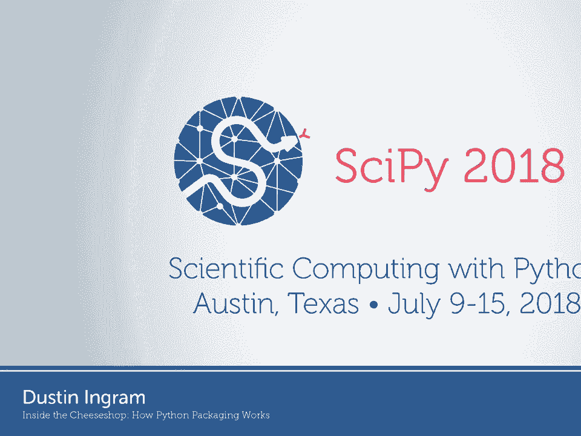

在本节课中，我们将跟随 Dustin 的演讲，一起探索 Python 打包系统的演进历程。我们将了解从 Python 诞生之初到现代，打包工具和平台是如何一步步发展，以解决“如何将代码交付给用户”这一核心问题的。

---

大家好，我是 Dustin。我是 Python 打包权威组织的成员，也是 PyPI 的维护者之一。


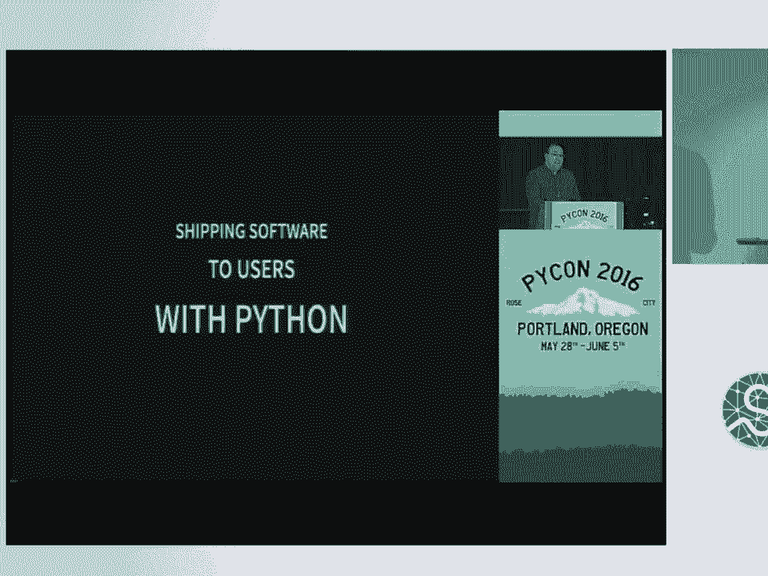

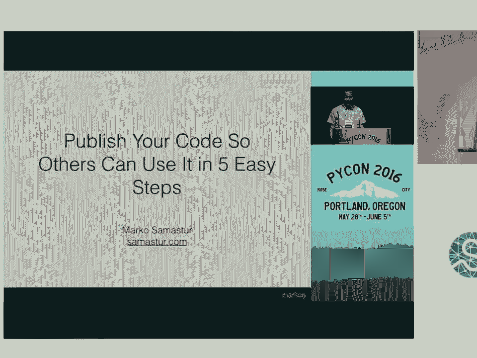

为这次演讲确定标题很困难，因为关于 Python 打包的演讲已经有很多了。我曾想过很多标题，例如“Python 打包：用你写代码的语言将代码交付给用户”、“只需五步的 Python 打包”等等，但发现这些主题都已被讨论过。

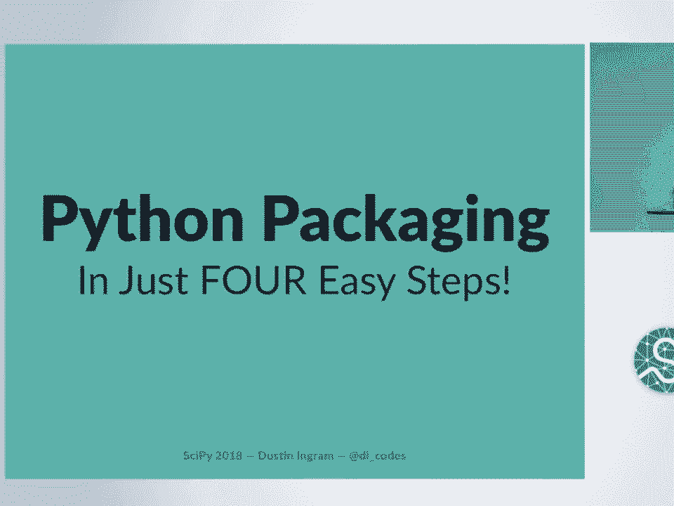


最终，我选择了这个标题：“Inside the Cheeseshop - How Python Packaging Works”。这个标题可能有些晦涩，因为“Cheeseshop”是 PyPI 的一个昵称，源自一个“没有奶酪的奶酪店”的喜剧桥段，暗指 PyPI 最初是空的。同时，解释一个如此庞大复杂的系统如何工作，似乎是一项不可能完成的任务。但我认为 Python 打包现在运行得相当不错，我们可能已经习惯了它的便利，而忘记了它曾经的艰难。

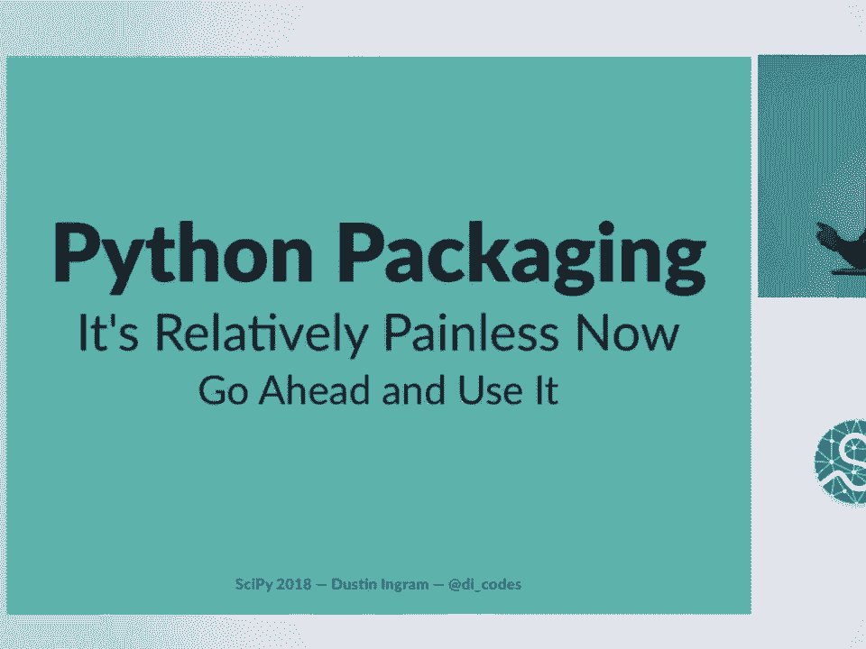


所以，我想和大家一起进行一次“打包考古”，回顾打包系统的演变，理解每个阶段面临的新问题及其解决方案，从而明白为何今天的一切是现在这个样子。

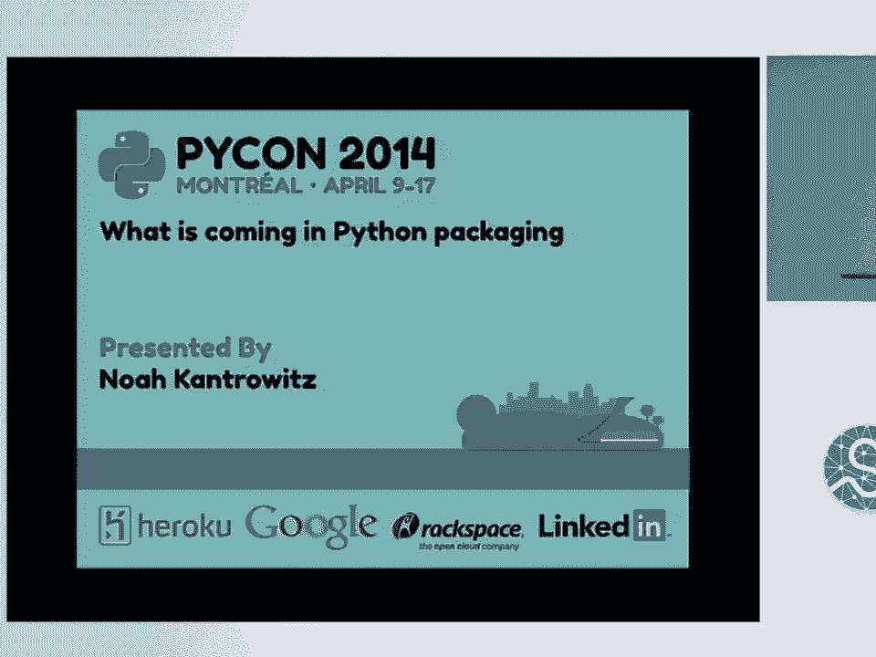

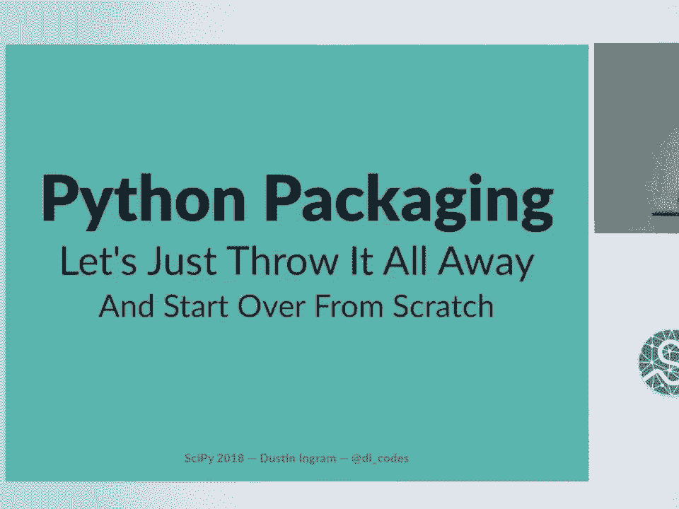

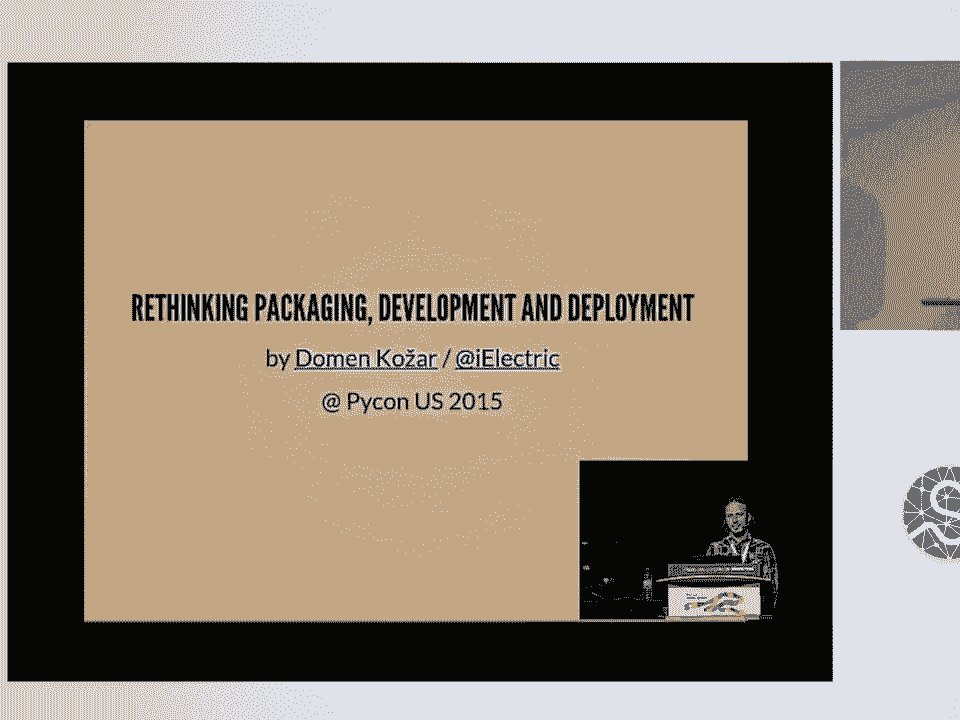

## 回到最初：只有 Python 的时代

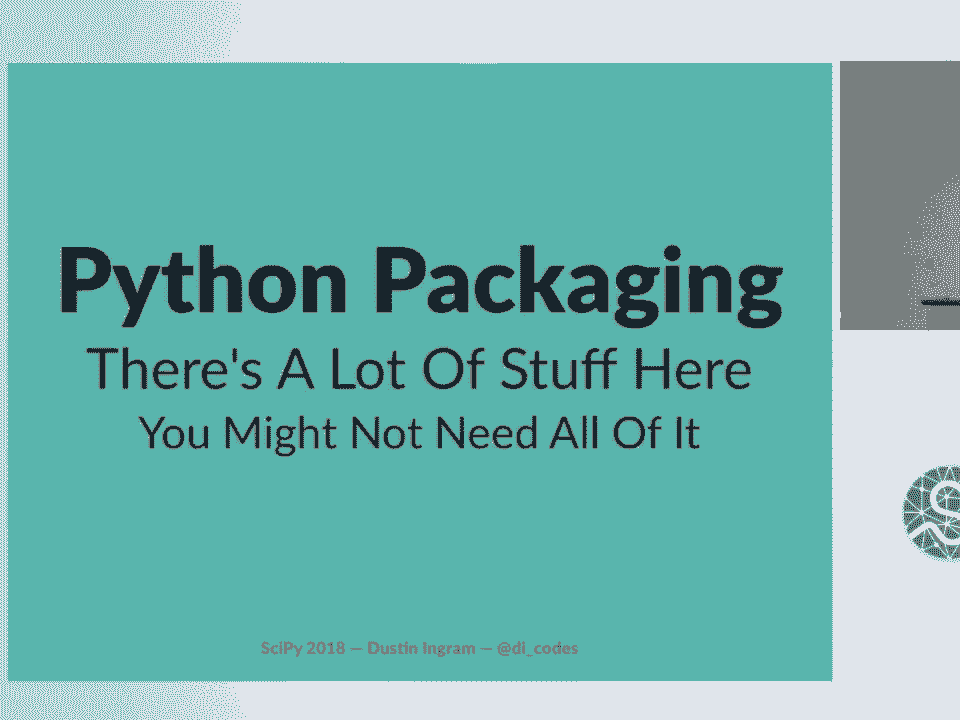

让我们回到 Python 刚刚诞生的年代。那时，一切都很简单。


假设你编写了一个非常棒的库。但此刻，这段代码只对你自己有用。我们遇到的第一个根本性问题就是：**如何将代码交付给用户？**

最初，你可能会通过电子邮件发送代码，或者在个人网站上提供下载链接。但这存在一个问题：别人如何发现你的代码？在 1991 年 Python 发布时，谷歌还要等六年才出现。

这引出了第二个问题：**如何找到 Python 代码？**

我们需要一个地方，让人们能够发现有趣的 Python 代码，一个 Python 软件的索引。

## 第一个索引：Parnassus 宝库

于是，第一个 Python 软件索引诞生了，它被称为 **Vaults of Parnassus**。它本质上就是一个链接列表，将用户引导至托管在其他网站上的项目。

此时，“包”的概念还很模糊。每个项目都有自己独特的构建方式，可能是 Python 脚本、Makefile 或简单的文本说明。这对用户来说非常痛苦，因为他们需要为每个想安装的库学习不同的构建方法。

## 标准化构建：Distutils

1998 年，一个名为 **Distutils** 的项目启动了，并在 2000 年随 Python 1.6 被纳入标准库。它为我们带来了熟悉的命令：


```bash
python setup.py install
```


`setup.py` 本质上就是一个 Python 脚本。其理念是：既然你已经拥有 Python 的全部能力，为何还要创造新的领域特定语言或配置文件呢？所以，我们用更多的 Python 代码来解决这个问题。

Distutils 最初旨在提供一个一致的构建工具，以取代各种 Makefile。它还提供了打包源代码以便分享的方法，即 **源码分发**。

源码分发是一个压缩归档文件（如 .zip 或 .tar.gz），也称为 **sdist**。

```bash
python setup.py sdist
```

## 从源码到二进制：构建分发

很快我们发现，仅靠源码分发有时不够。如果项目包含需要编译的 C 或 Fortran 代码，每次安装都重新编译既耗时又浪费资源，尤其是在相同架构的不同机器上重复安装时。

解决方案是 **构建分发**。这是一种预编译好的、针对特定架构的发行版，安装时无需构建步骤，直接复制文件即可。这也被称为 **bdist**。

```bash
python setup.py bdist
```

Distutils 解决了构建问题，但回避了两个关键问题。

## 被回避的问题一：如何“打包”？

这里的“打包”指广义的打包过程：如何在用户运行构建命令之前，将他们所需的一切准备就绪？Distutils 的作者认为这是一个已解决的问题，因为他们假设所有平台都有系统级的包管理器（如 Linux 的 RPM）。

然而，开发者喜欢在没有官方包管理器的平台上开发，比如 macOS 或 Windows。

## 被回避的问题二：依赖管理

Distutils 没有提供声明项目依赖的方法。这可以理解，因为当时还没有一个集中的索引可以指向。

## 集中化索引：PyPI 诞生

为了解决平台差异和获取最新软件的问题，我们创建了一个专属于 Python 的包索引：**Python Package Index**。

这就是 **PyPI**。它在 2002 年上线，为 Python 软件提供了一个官方、一致且集中的存放地。最初，它仍然只是链接到外部托管的文件，但结构更清晰。

PyPI 也被昵称为 **“奶酪店”**，这个梗来自 Monty Python 的一个喜剧小品，讲的是一家没有奶酪卖的奶酪店。这个昵称是因为 PyPI 刚创建时里面什么都没有。不过现在它已有数十万个包，这个昵称已经不太合适了。

## 增强工具集：setuptools 与依赖声明

有了集中索引，我们不仅可以指向特定版本的包，还可以分发功能比 Distutils 更强大的工具。于是 **setuptools** 出现了。

setuptools 本质上通过“猴子补丁”的方式扩展了标准库中的 Distutils。这样做的好处是能快速向用户推送新功能，无需升级整个 Python 发行版。但猴子补丁，尤其是对标准库的补丁，从来不是个好主意。

不过，setuptools 使我们能够轻松声明依赖。

## 简化安装：EasyInstall

既然能声明依赖，如何让安装变得更简单呢？用户觉得安装太麻烦了。

解决方案是一个名为 **EasyInstall** 的工具。理论上，它让用户安装各种项目变得更容易。与 setuptools 配合，用户可以直接从 PyPI 安装项目依赖。

它还引入了一种新的构建分发格式，因为现有的格式不够用。这种格式叫做 **egg** 分发。egg 本质上是一个包含元数据和 Python 代码的 zip 文件。

但 EasyInstall 带来了一系列新问题：它无法卸载包、无法列出已安装的包，并且会随意修改 `sys.path`，这通常不是个好主意。

## 更好的安装器：从 PyInstall 到 pip

于是，新的工具 **PyInstall** 被创建来解决这些问题。你可能从未听说过它，因为它几乎在诞生的同时就遇到了新问题：名字太长了。输入 `PyInstall install` 显得很冗余。

解决方案是将 PyInstall 重命名为 **pip**。pip 代表 **PIP Installs Packages**，这是一个递归缩写。

pip 做了一件有趣的事：它完全忽略了 egg 格式，只从源码分发安装。它看到了 EasyInstall 处理 egg 时的所有问题，并决定与之划清界限。

## 应用依赖管理：requirements.txt

此时，人们开始用 pip 来安装应用程序的依赖，而不是库的依赖。对于应用程序，没有“顶层项目”可安装。那么，如何指定应用程序的依赖呢？

解决方案是 pip 引入了一个名为 **requirements.txt** 的文件。这个文件可以精确指定应用程序所需依赖的版本。

```bash
pip install -r requirements.txt
```

这为实现半可复现的环境迈出了一步。

## 性能与安全：PyPI 托管文件

现在大家都在愉快地使用 `pip install`。但新问题出现了：安装速度有点慢。因为 PyPI 当时只是一个索引，pip 需要爬取 PyPI，然后跳转到托管在各个第三方域名的文件。这些域名的性能可能不佳，文件甚至可能已不存在。

更大的问题是安全：这要求用户信任所有这些第三方域名。如果维护者忘记续费域名，攻击者可以注册该域名并替换为恶意代码，而用户可能毫无察觉。

解决方案是 PyPI 开始直接托管发行版文件。这在 PEP 438 中规定。现在，所有文件都直接存放在 PyPI 上，不再需要第三方域名。

## 科学计算的挑战：Anaconda 与 Conda

大约此时，我们开始注意到一个新趋势：科学计算 Python 的兴起。这带来了一系列 Distutils 未曾预料到的挑战：
1.  **Distutils 能力不足**：难以处理需要链接外部库的复杂扩展编译。
2.  **缺乏构建环境定义**：无法指定构建项目所需的环境（如特定编译器、库）。
3.  **需要预编译二进制包**：从源码编译科学计算库非常痛苦，而当时我们已经放弃了 egg，没有二进制分发格式。
4.  **依赖非 Python 生态**：可能需要 R、LLVM、HDF5、MKL 等 Python 生态外的工具。
5.  **系统可能没有 Python**：用户可能连 Python 都没有安装。

这些需求超出了当时 Python 打包生态的范畴。解决方案是 **Anaconda** 和 **Conda**。
*   Anaconda 是一个包含 1000 多个开源软件包的发行版。
*   Conda 是一个与 Python 无关的包管理器和安装器，既可以安装 Python 包，也可以安装非 Python 包。

## 重回二进制分发：wheel


在通用 Python 生态中，我们也有对二进制分发的需求，并且有点羡慕科学计算社区能方便地分发二进制包。我们需要二进制分发，但不想要 egg。egg 格式定义不清，文件名约定无法涵盖所有可能的构建平台，而且名声不佳。

解决方案是 **wheel** 分发。这是另一种类似 egg 的构建分发格式，也是一个 zip 文件。但最关键的是，它拥有一个明确的规范（PEP 427）。它从 easy_install 和 egg 的错误中吸取了教训。

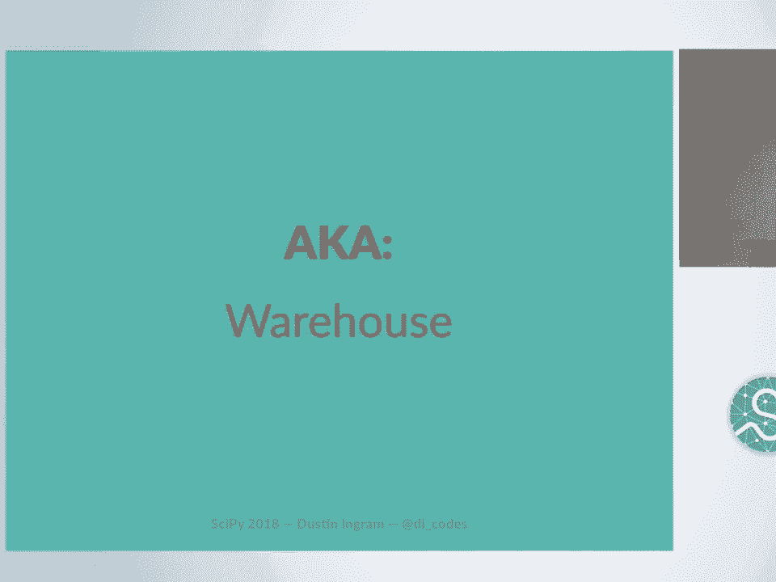

它的名字来源于“奶酪轮”，你把“轮子”放进“奶酪店”。这个名字很妙，因为没人能说他们“重新发明了轮子”。

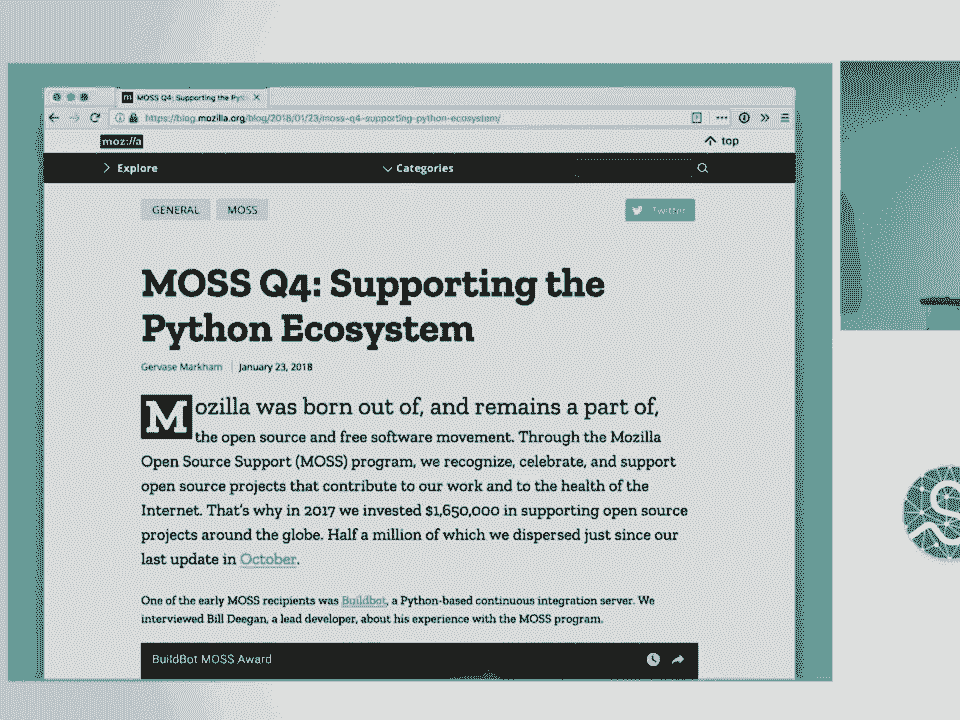

## 现代化基础设施：重写 PyPI

随着 PyPI 上的包从不到 3000 个增长到超过 13 万个，它从一个获取 Python 包的地方变成了 **唯一** 的地方。PyPI 已经 15 岁了，代码陈旧，几乎没有测试，不使用现代 Web 框架，难以维护和开发。

通常，对于一个被数十万用户依赖的核心基础设施进行全栈重写，我会说不可能成功。但这次，我们做到了。

新项目名为 **Warehouse**，意为“存放包的仓库”。它始于 2011 年，目标包括全面启用 HTTPS、采用现代 Web 开发最佳实践和完备的测试。它在今年四月正式取代旧版成为 PyPI。

这项浩大的工程离不开 Mozilla 开源支持计划和 Python 软件基金会的支持。

## 当前的问题与解决方案

当然，问题永远不会结束。软件的本质就是如此，一旦我们构建了新东西，就会开始意识到它还能做什么，或者真正的需求是什么。

以下是当前正在积极应对的一些问题及其解决方案：

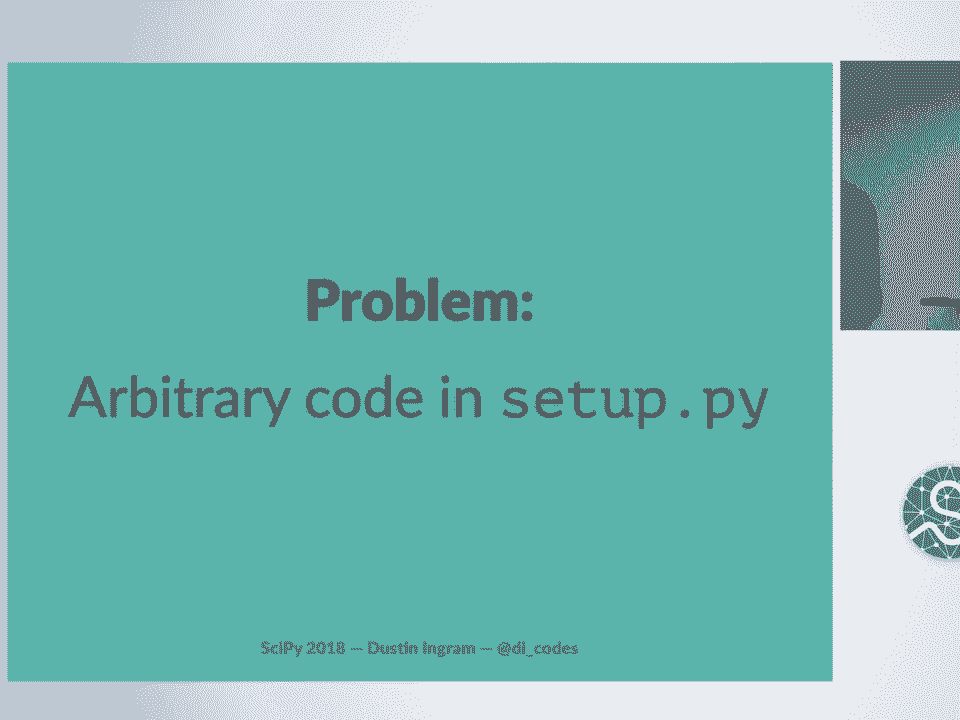

**问题一：打包对新手来说仍然复杂。**
*   **解决方案**：
    *   **Python 打包用户指南**：精心编写和维护的打包指南。
    *   **示例项目**：展示最简单 Python 包最佳实践的项目骨架。
    *   **持续的维护与改进**：让现代项目更规范、更易维护，并重点关注新手的可访问性。

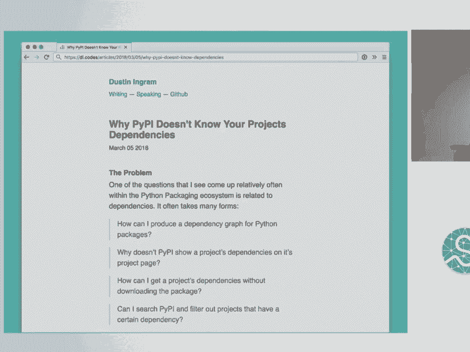

**问题二：打包变得太容易，带来了垃圾包、误植抢注等问题。**
*   **说明**：降低门槛是优先事项，但这也带来了新的挑战，社区正在积极应对。

**问题三：实现完全可复现的环境仍然有挑战。**
*   **解决方案**：**Pipfile 和 Pipfile.lock**。这是一个人类可编辑的文件和一个生成的、包含完全确定性依赖的文件，可以被多个依赖安装工具共享。类似于其他社区的 Gemfile.lock 或 yarn.lock。

**问题四：`setup.py` 是任意 Python 代码，难以静态分析依赖。**
*   **说明**：因为 `setup.py` 可以执行任何代码，所以不实际运行它就无法预测其依赖。这使得推理源码分发变得困难。

**问题五：Distutils/setuptools 代码老旧，难以扩展和维护，但又已是事实标准。**
*   **解决方案**：**PEP 517 和 PEP 518**。
    *   PEP 517 定义了独立于构建系统的源码树接口。
    *   PEP 518 允许项目指定其构建系统的要求。
    *   这催生了 **`pyproject.toml`** 文件。它使我们能够完全脱离 Distutils/setuptools，允许用户为项目指定自己的构建需求（可以是 setuptools，也可以是像 scikit-build 这样的其他工具）。

## 如何参与及获取帮助

Python 打包生态几乎完全由志愿者驱动。如果你愿意帮忙：
*   PyPI 和 pip 的代码仓库都有 `good first issue` 标签。
*   有很多人愿意指导新贡献者。

如果你遇到问题，可以按以下顺序寻求帮助：
1.  **查阅 Python 打包指南**。
2.  **在相应工具的 issue 跟踪器提问**（维护者通常响应迅速）。
3.  **在 `#pypa` IRC 频道交流**。
4.  **在 `packaging-problems` GitHub 仓库提交关于生态系统的大问题**。
5.  **直接联系我**（GitHub: DI, Twitter: @DIcodes, Email: di@python.org）。我很乐意与用户交流。

---

本节课中，我们一起回顾了 Python 打包系统的演进史。从最初简单的代码分享，到 Distutils、PyPI、setuptools、pip、wheel 等一系列工具和标准的出现，再到应对科学计算挑战的 Conda 和现代化改造后的 PyPI。

**总结来说，打包并不糟糕。** 总会有需要解决的新问题出现。我们在一段时间内进行了渐进式的改变，每一次改变都是为了响应不断演变的需求。相比之下，过去的情况要困难得多，我们可能只是忘记了或不知道曾经有多难。

所以，下次当你对 Python 打包感到沮丧时，可以想象一个没有 pip、没有 PyPI、没有 Conda 的世界，并考虑为此提交一个 Pull Request。


谢谢大家。