# 51：NumPy 数值计算入门教程 🧮

在本节课中，我们将要学习 NumPy 的基础知识。NumPy 是 Python 科学计算的核心库，它提供了高性能的多维数组对象和用于处理这些数组的工具。我们将从为什么需要 NumPy 开始，逐步了解数组的创建、索引、切片、运算以及一些核心概念。


---

## 为什么使用 NumPy？🚀

在开始使用 NumPy 之前，我们先看看没有它的情况。假设我们有两个 Python 列表，想要进行逐元素相加。

```python
list_a = [1, 2, 3, 4]
list_b = [5, 6, 7, 8]
```

如果直接使用 `+` 运算符，Python 会将其解释为列表拼接，而不是数学加法。为了实现逐元素相加，我们必须编写一个循环。

```python
result = []
for a, b in zip(list_a, list_b):
    result.append(a + b)
```

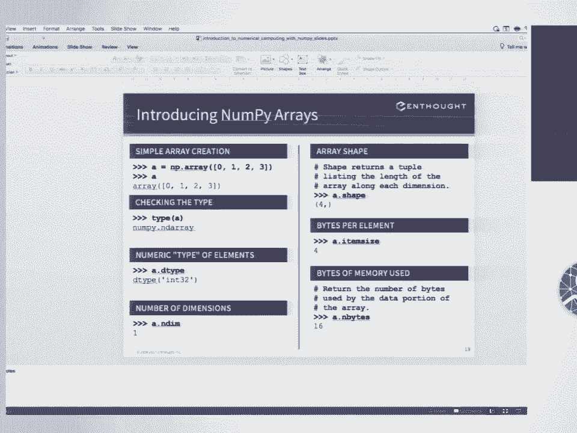

这种方法不仅代码冗长，而且对于大量数据来说速度很慢。接下来，我们将看到 NumPy 如何解决这些问题。

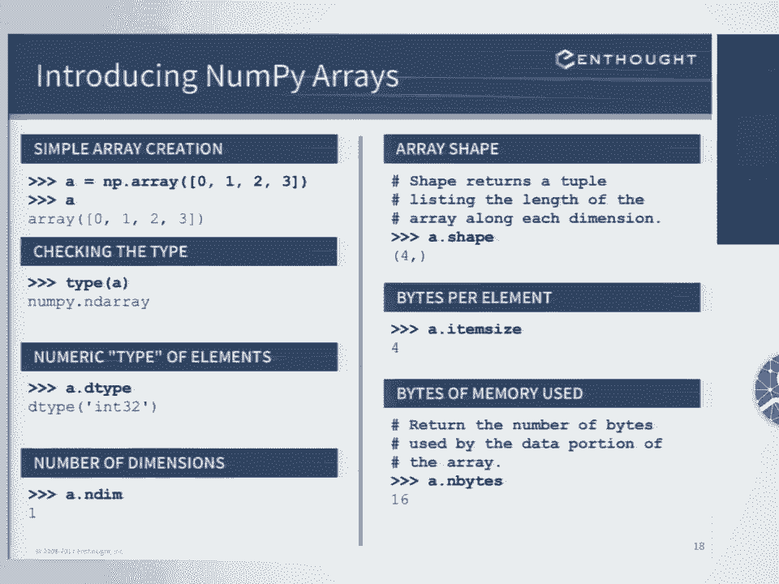

---

## NumPy 数组：核心数据结构 📦

NumPy 的核心是 `ndarray` 对象，即 N 维数组。与 Python 列表不同，NumPy 数组是**同质**的，意味着数组中的所有元素必须是相同的数据类型。这使得数据在内存中连续存储，从而实现了高效的数值运算。

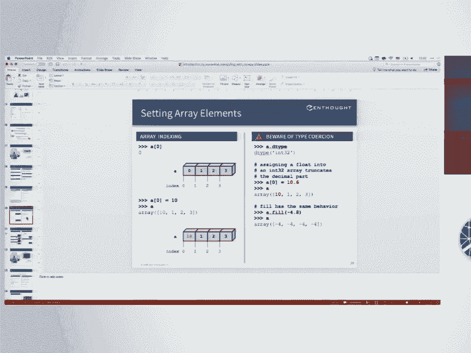


### 创建数组

我们可以使用 `np.array()` 构造函数从 Python 列表创建数组。

```python
import numpy as np

a = np.array([1, 2, 3, 4])
b = np.array([5, 6, 7, 8])
```

现在，我们可以直接对数组进行加法运算，NumPy 会自动执行逐元素操作。

```python
c = a + b  # 结果为 array([6, 8, 10, 12])
```

### 数组属性

每个 NumPy 数组都有几个重要的属性：
*   **`dtype`**: 数组元素的数据类型（例如 `int32`, `float64`）。
*   **`ndim`**: 数组的维数。
*   **`shape`**: 一个元组，表示数组在每个维度上的大小。
*   **`size`**: 数组中元素的总数。

```python
print(a.dtype)   # 例如 int64
print(a.ndim)    # 1
print(a.shape)   # (4,)
print(a.size)    # 4
```

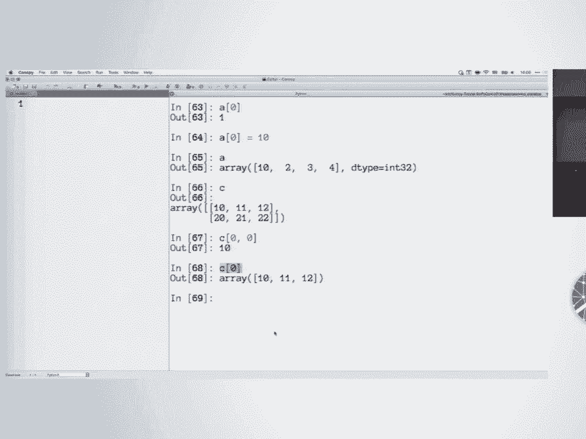

---

## 数组索引与切片 🔪

上一节我们介绍了数组的基本属性，本节中我们来看看如何访问和修改数组中的数据。

### 基础索引

与 Python 列表类似，我们可以使用方括号和从 0 开始的索引来访问元素。

```python
arr_1d = np.array([10, 11, 12, 13, 14])
print(arr_1d[0])  # 10
arr_1d[0] = 100   # 修改第一个元素
```

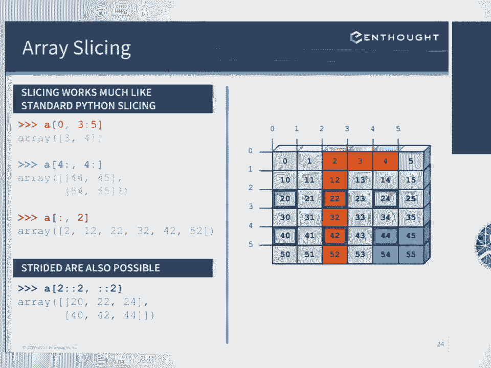


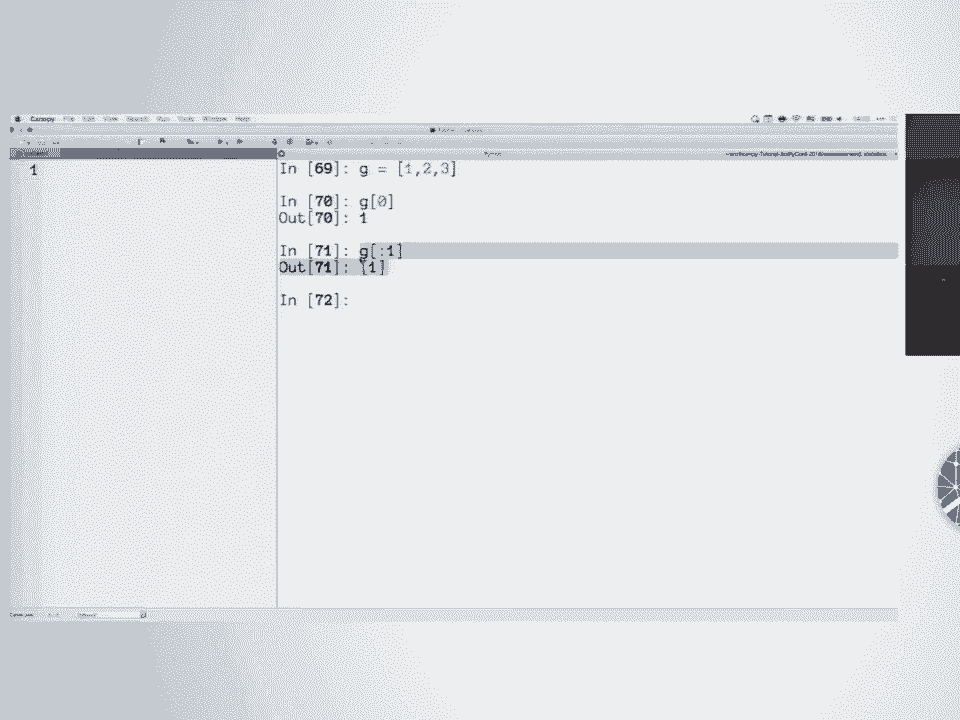

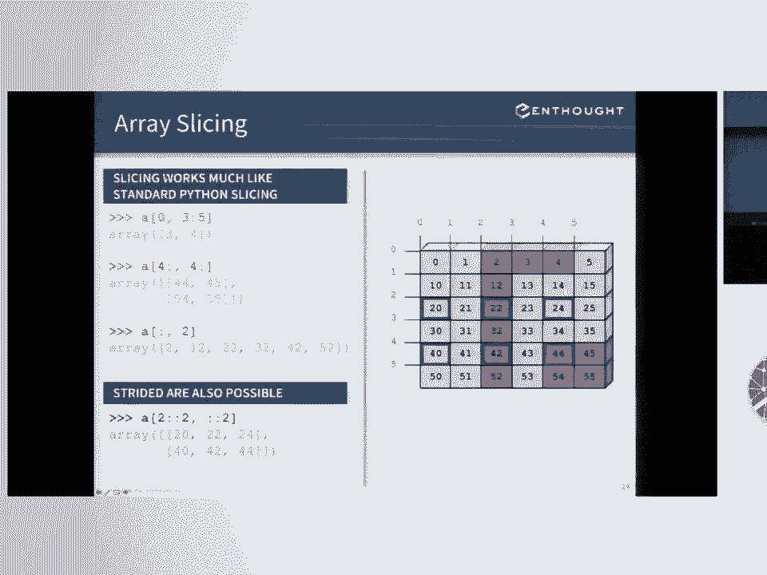

对于多维数组，索引需要放在同一对方括号内，用逗号分隔。

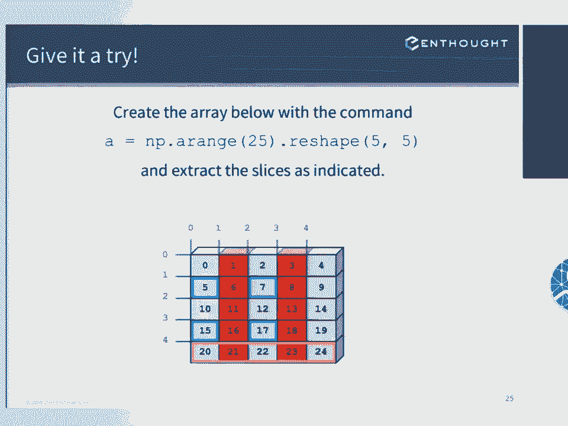

```python
arr_2d = np.array([[10, 11, 12], [20, 21, 22]])
print(arr_2d[0, 1])  # 11，第0行第1列
```

### 切片操作

切片允许我们选择数组的子集。语法是 `start:stop:step`，其中 `stop` 索引不包含在内。

以下是 1D 数组的切片示例：

```python
arr = np.array([10, 11, 12, 13, 14])
print(arr[1:3])    # [11, 12]
print(arr[:3])     # [10, 11, 12] 从头开始
print(arr[::2])    # [10, 12, 14] 每隔一个元素
```

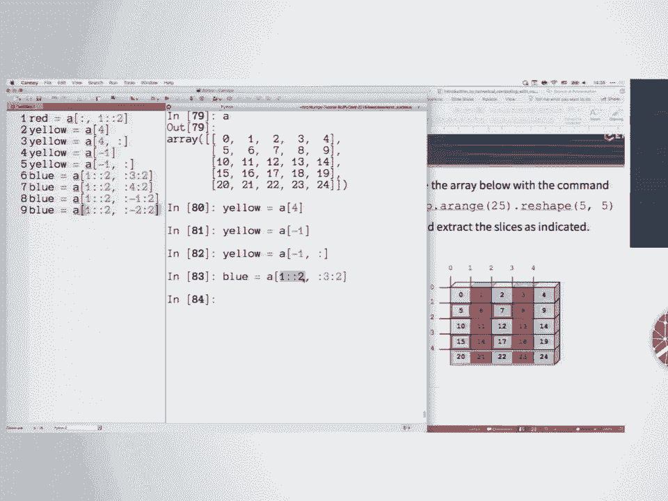

对于 2D 数组，我们可以混合使用索引和切片：

```python
arr_2d = np.array([[ 0,  1,  2,  3],
                   [10, 11, 12, 13],
                   [20, 21, 22, 23],
                   [30, 31, 32, 33]])

print(arr_2d[0, :])     # 第0行所有列 [0, 1, 2, 3]
print(arr_2d[:, 1])     # 所有行第1列 [1, 11, 21, 31]
print(arr_2d[1:3, :2])  # 第1-2行，前2列 [[10, 11], [20, 21]]
```

**重要概念**：在大多数情况下，切片操作返回的是原始数组数据的**视图**，而不是副本。这意味着修改切片会影响到原始数组。如果需要副本，可以使用 `.copy()` 方法。

---

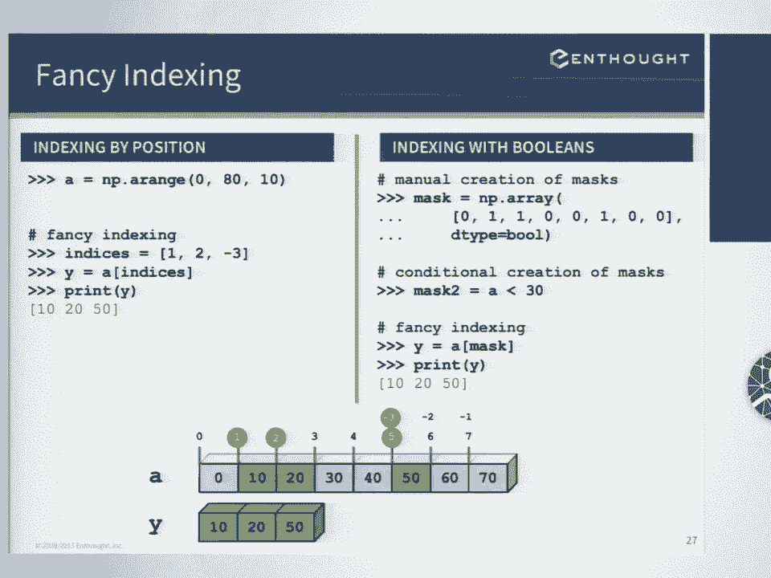

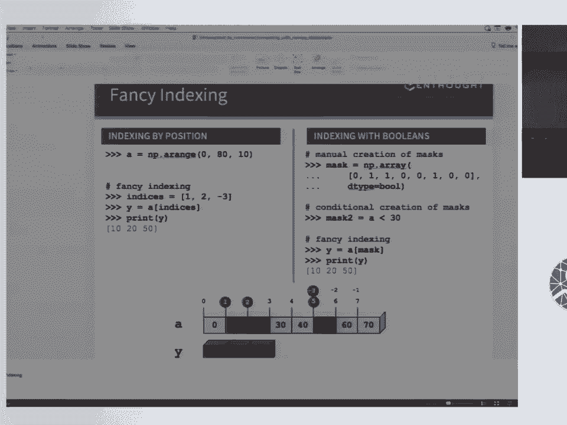

## 布尔索引与花式索引 🎭

除了常规切片，NumPy 提供了更强大的索引方式，用于选择任意位置的数据。

### 布尔索引（掩码）

我们可以通过一个布尔数组（掩码）来选择数据。掩码必须与目标数组形状兼容。

```python
arr = np.array([10, 20, 30, 40, 50])
mask = arr > 30
print(mask)          # [False False False True True]
print(arr[mask])     # [40 50]
```

我们也可以直接使用比较表达式：

```python
print(arr[arr > 30])  # 同样输出 [40 50]
```

### 组合条件

要组合多个布尔条件，不能使用 Python 的关键字 `and`/`or`，而必须使用位运算符 `&` (与)、`|` (或)、`~` (非)。

```python
arr = np.array([1, 2, 3, 4, 5, 6])
mask = (arr > 2) & (arr < 6)
print(arr[mask])  # [3 4 5]
```

### 花式索引


花式索引允许我们使用整数数组来指定要访问的元素的索引。

```python
arr = np.array([10, 20, 30, 40, 50])
indices = [0, 2, 4]
print(arr[indices])  # [10 30 50]
```

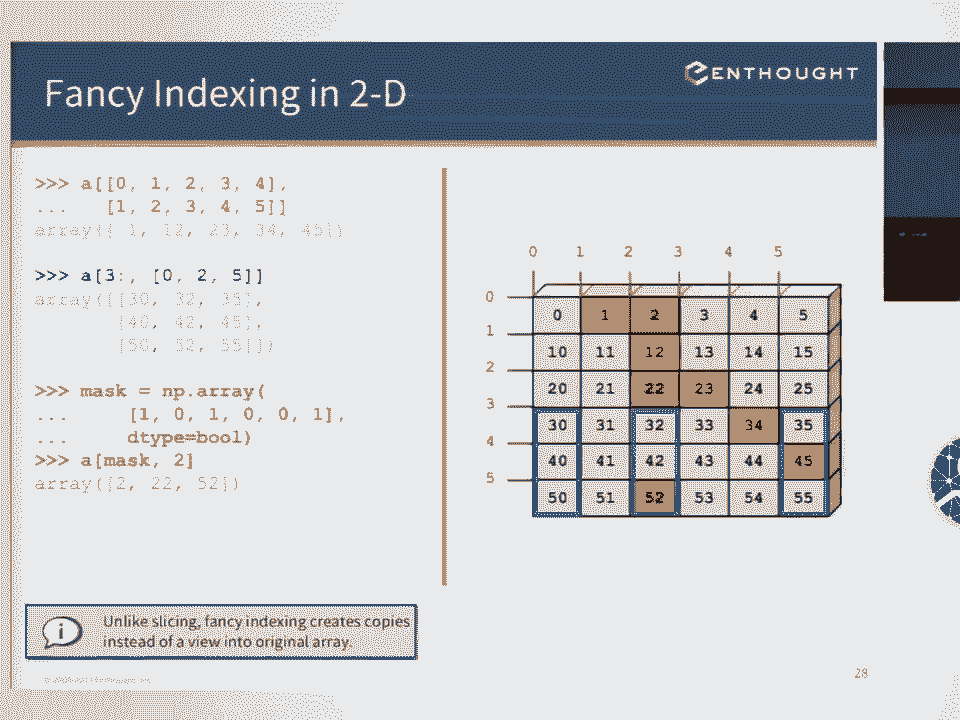

对于多维数组，可以传递多个索引数组来选取特定坐标的点。

```python
arr_2d = np.arange(12).reshape(3, 4)
rows = [0, 1, 2]
cols = [1, 2, 3]
print(arr_2d[rows, cols])  # 选取 (0,1), (1,2), (2,3) 位置的值
```

**重要概念**：与切片不同，花式索引**总是返回数据的副本**。

---

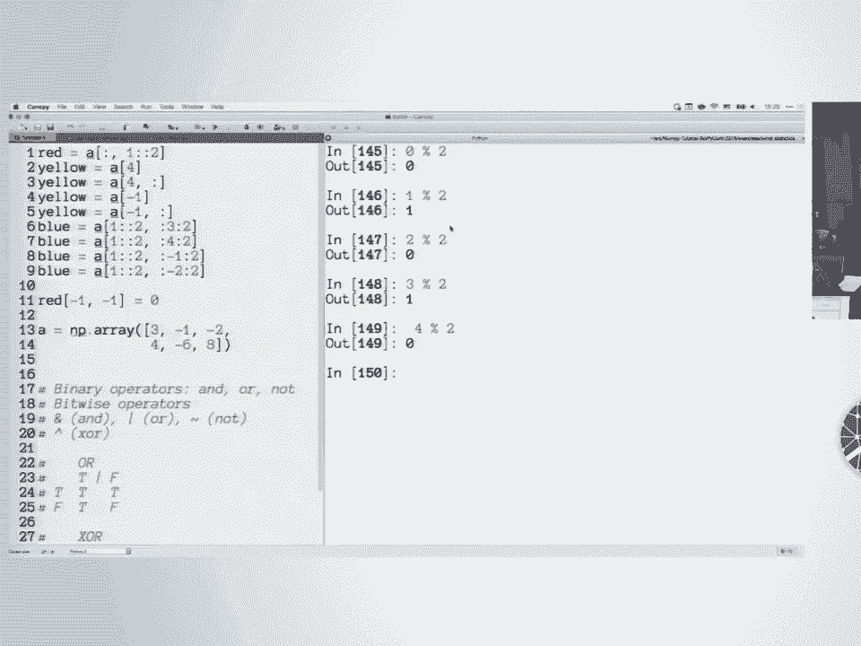

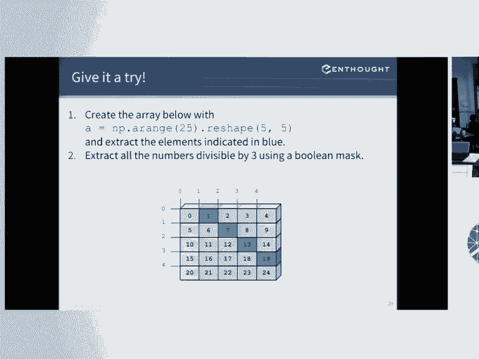

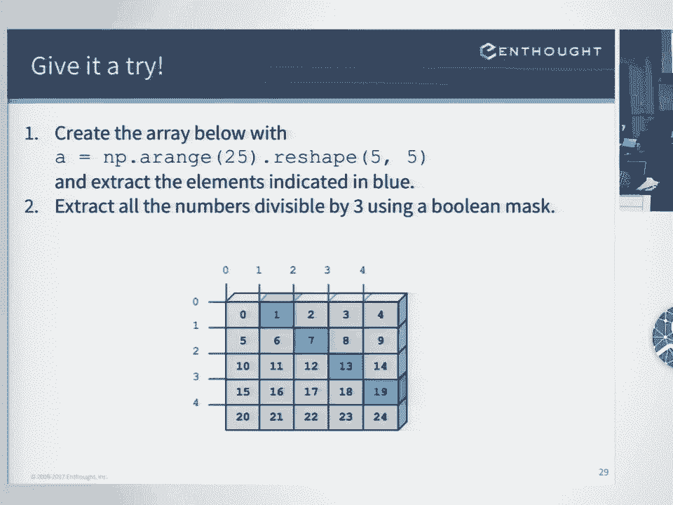

## 数组运算与广播规则 📡

NumPy 的强大之处在于其高效的数组运算能力。运算通常是逐元素进行的。

### 基本运算

```python
a = np.array([1, 2, 3])
b = np.array([4, 5, 6])

print(a + b)   # 加法 [5 7 9]
print(a * b)   # 乘法 [4 10 18]
print(a ** 2)  # 平方 [1 4 9]
```

### 广播

广播是 NumPy 对不同形状数组进行算术运算的一套规则。其核心思想是：**从右向左对齐数组形状，缺失的维度可以自动扩展（大小为1的维度可以复制）**。

以下是广播的几种常见情况：
1.  **标量与数组运算**：标量被广播到数组的每个元素。
    ```python
    a = np.array([1, 2, 3])
    print(a + 5)  # [6 7 8]
    ```
2.  **数组与行/列向量运算**：
    ```python
    # 形状 (3, 2) 与 (2,) 的数组相加
    matrix = np.array([[1, 2], [3, 4], [5, 6]])  # shape (3, 2)
    row_vector = np.array([10, 20])              # shape (2,)
    print(matrix + row_vector)
    # 结果：[[11 22]
    #        [13 24]
    #        [15 26]]
    # 解释：row_vector 被广播到 matrix 的每一行
    ```
3.  **形状完全兼容**：两个数组形状相同，或其中一个数组在某个维度上大小为1。

如果形状不兼容，NumPy 会抛出 `ValueError`。

---

## 聚合函数与轴参数 📊

NumPy 提供了许多聚合函数，用于计算数组的统计信息，如 `sum()`, `mean()`, `std()`, `min()`, `max()` 等。

### 默认行为

默认情况下，聚合函数会对**整个数组**的所有元素进行计算，返回一个标量。

```python
arr = np.array([[1, 2], [3, 4]])
print(np.sum(arr))  # 10
```

### 指定轴（axis）

我们可以通过 `axis` 参数指定沿着哪个维度进行聚合。**指定的轴会在运算后被“折叠”或移除**。

*   `axis=0`：沿着行的方向（垂直），对每**列**进行计算。
*   `axis=1`：沿着列的方向（水平），对每**行**进行计算。

```python
arr = np.array([[1, 2, 3],
                [4, 5, 6]])

print(np.sum(arr, axis=0))  # 对每列求和 [5 7 9]
print(np.sum(arr, axis=1))  # 对每行求和 [6 15]
```

理解 `axis` 的一个技巧：观察运算前后数组的 `shape`。原始 `shape` 是 `(2, 3)`。
*   `sum(axis=0)` 后，第0维（大小为2）被移除，`shape` 变为 `(3,)`。
*   `sum(axis=1)` 后，第1维（大小为3）被移除，`shape` 变为 `(2,)`。

我们也可以使用负索引，`axis=-1` 表示最后一个维度。

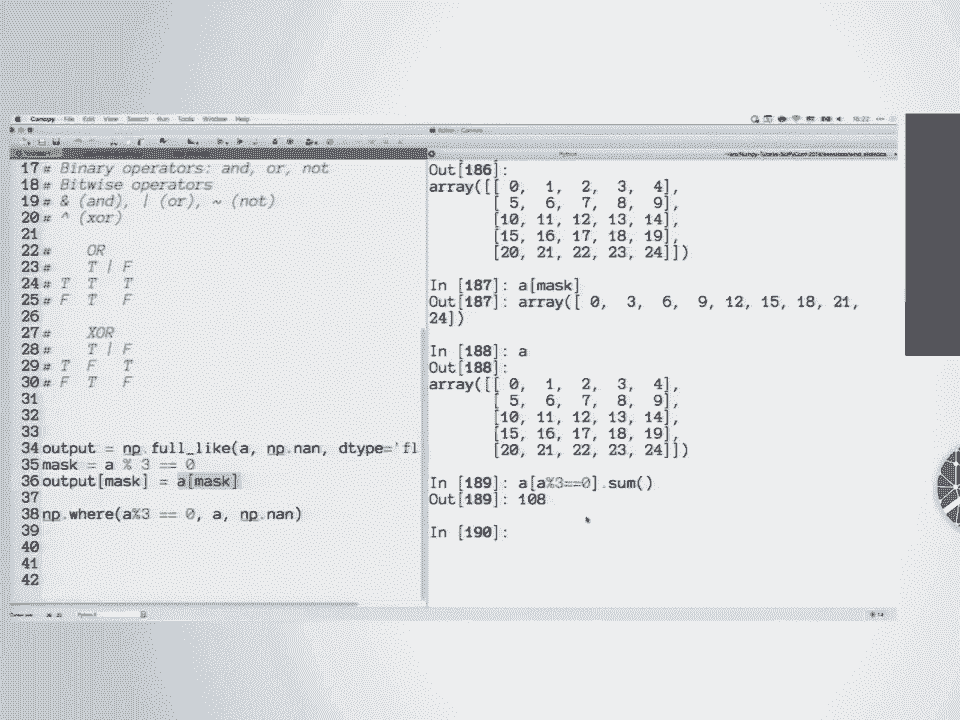


### 查找极值位置

`argmax()` 和 `argmin()` 函数返回数组中最大值或最小值所在的**索引**（扁平化后的索引或沿指定轴的索引）。

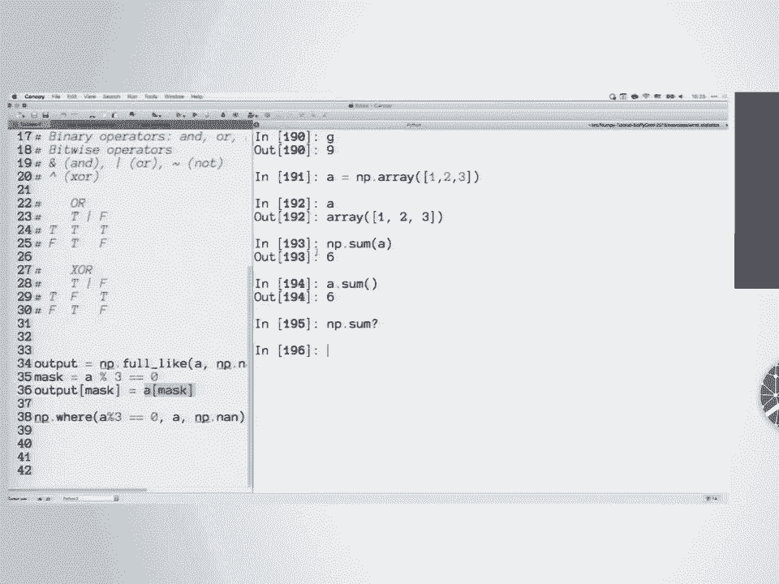

```python
arr = np.array([3, 1, 4, 1, 5, 9])
print(np.argmax(arr))  # 5 (值9的索引)

arr_2d = np.array([[1, 5, 3], [8, 2, 7]])
print(np.argmax(arr_2d, axis=1))  # 每行最大值的列索引 [1 0]
```

要将扁平化索引转换回多维索引，可以使用 `np.unravel_index()` 函数。

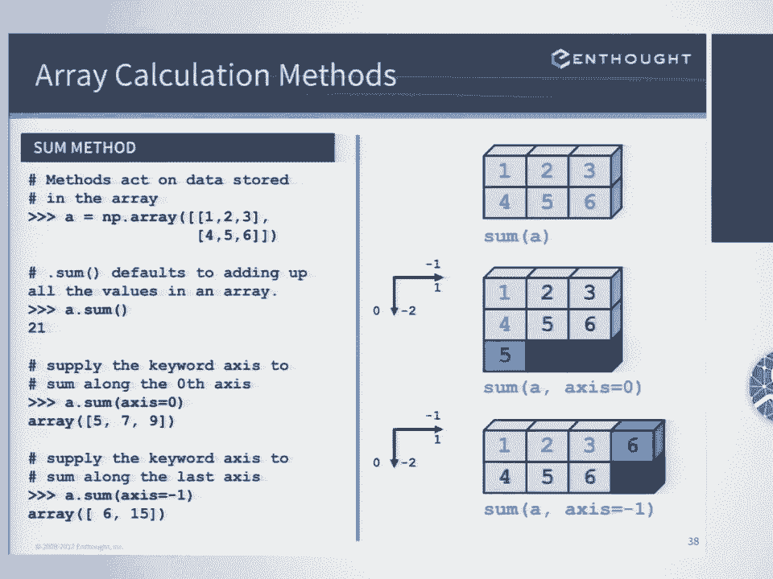

---

## 实战练习：风数据统计分析 🌬️

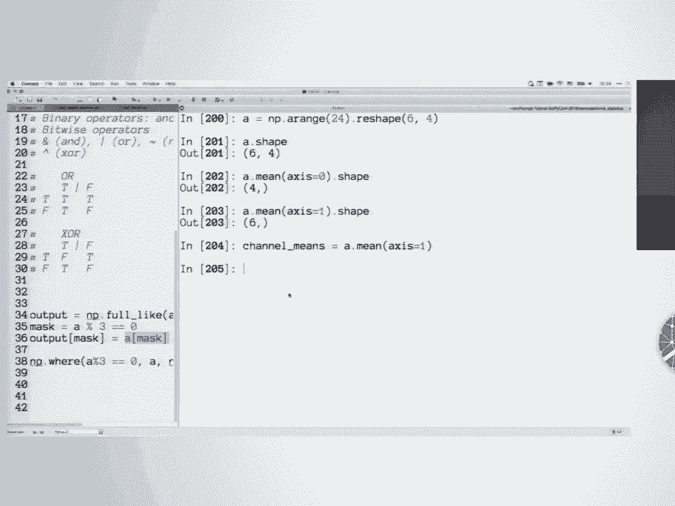

现在，让我们应用所学知识来解决一个实际问题。我们将分析一组爱尔兰多个地点多年的风速数据。

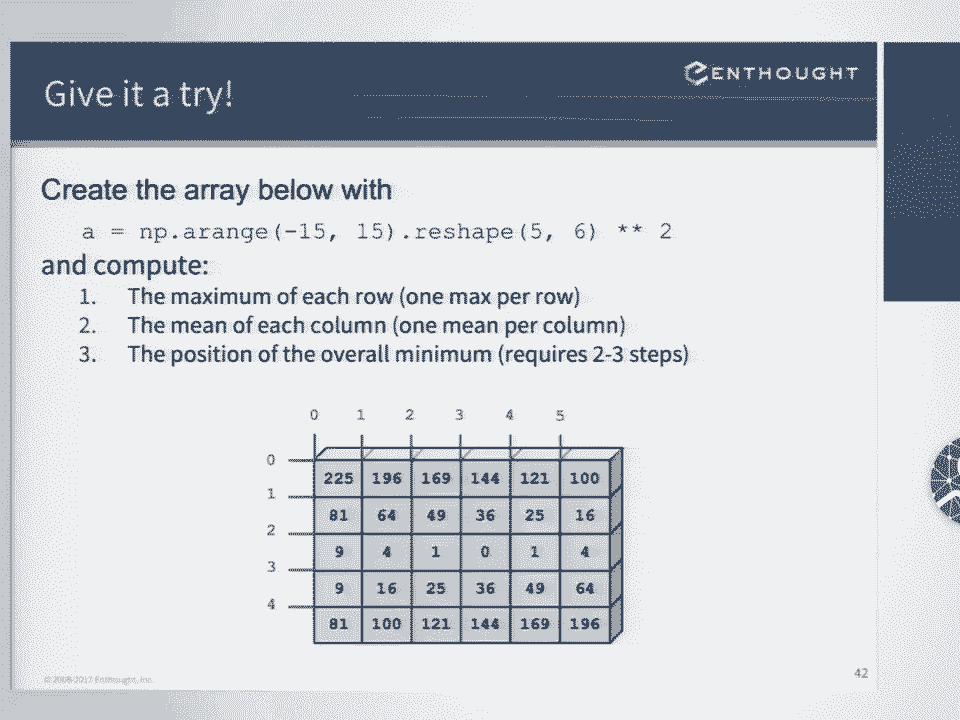


数据文件 `wind.data` 的前三列是年、月、日，后12列是12个地点的风速测量值。

```python
# 1. 加载数据
data = np.loadtxt('wind.data')
dates = data[:, :3]  # 前3列：年、月、日
winds = data[:, 3:]  # 后12列：风速

# 2. 计算所有地点所有时间的整体统计量
print("整体均值:", winds.mean())
print("整体最大值:", winds.max())
print("整体标准差:", winds.std())

# 3. 计算每个地点在所有时间内的平均风速（沿时间轴聚合）
mean_by_location = winds.mean(axis=0)  # axis=0 折叠时间维度
print("每个地点的平均风速:", mean_by_location)

# 4. 计算每天所有地点的平均风速（沿地点轴聚合）
mean_by_day = winds.mean(axis=1)  # axis=1 折叠地点维度
print("每天的平均风速（前5天）:", mean_by_day[:5])

# 5. 找出每天风速最大的地点
location_of_max_each_day = winds.argmax(axis=1)
print("每天风速最大的地点索引（前5天）:", location_of_max_each_day[:5])

# 6. 找出有史以来风速最大的那一天
# 方法一：先找每天的最大值，再找这些最大值中的最大值所在的天
max_wind_each_day = winds.max(axis=1)
day_of_overall_max = max_wind_each_day.argmax()
print(f"风速最大的一天是索引 {day_of_overall_max}: {dates[day_of_overall_max]}")

# 7. 计算每年一月份每个地点的平均风速
# 首先，创建一个布尔掩码，选择月份为1（一月）的行
january_mask = dates[:, 1] == 1  # 月份列是第1列（0-based）
winds_january = winds[january_mask, :]
mean_january_by_location = winds_january.mean(axis=0)
print("一月份每个地点的平均风速:", mean_january_by_location)
```

---

## 总结 🎯

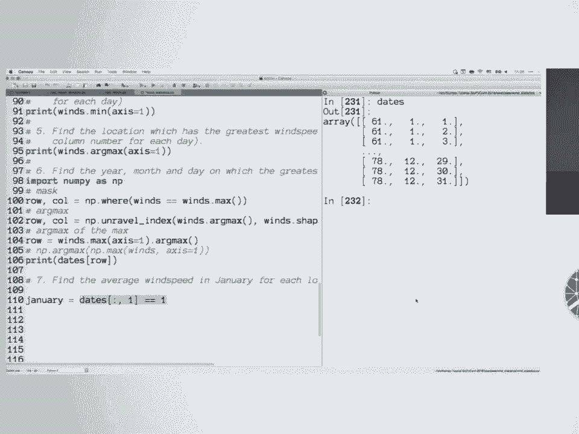

本节课中我们一起学习了 NumPy 数值计算的基础知识。我们从理解 NumPy 数组相比 Python 列表的优势开始，逐步掌握了如何创建和操作数组。我们深入探讨了索引与切片、布尔索引与花式索引这两种强大的数据选择方式。然后，我们学习了 NumPy 的广播规则，它使得不同形状数组间的运算变得简单高效。最后，我们通过聚合函数和轴参数对数据进行统计分析，并完成了一个实际的数据分析练习。

记住这些核心概念：
*   NumPy 数组是**同质的、内存连续的**，因此运算速度快。
*   **切片返回视图**，**花式索引返回副本**。
*   使用 **`axis`** 参数控制聚合操作的方向。
*   **广播**允许对不同形状的数组进行运算。

NumPy 是 Python 科学计算生态的基石，熟练掌握它将为你学习 Pandas、SciPy、Scikit-learn 等更高级的库打下坚实的基础。