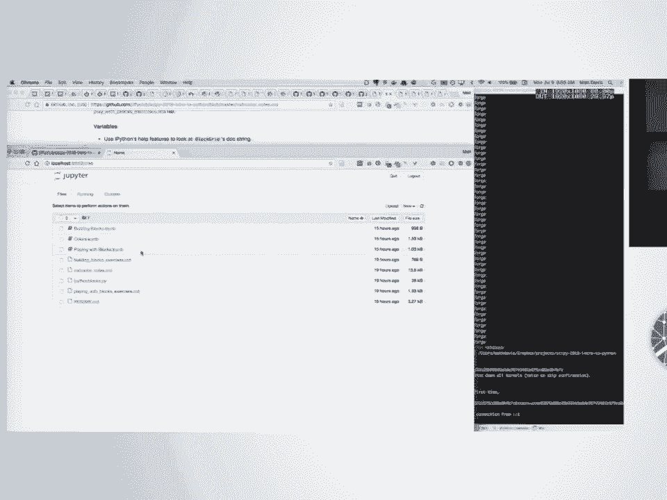
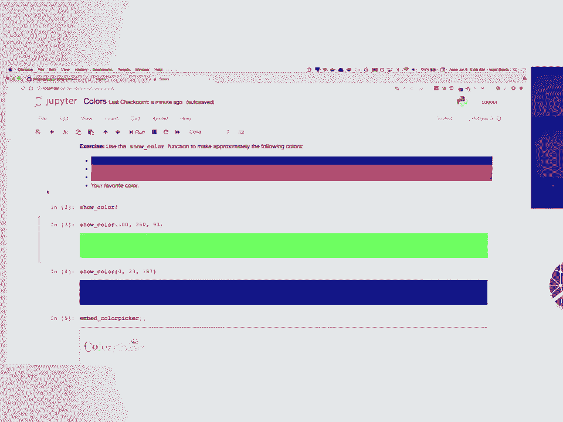
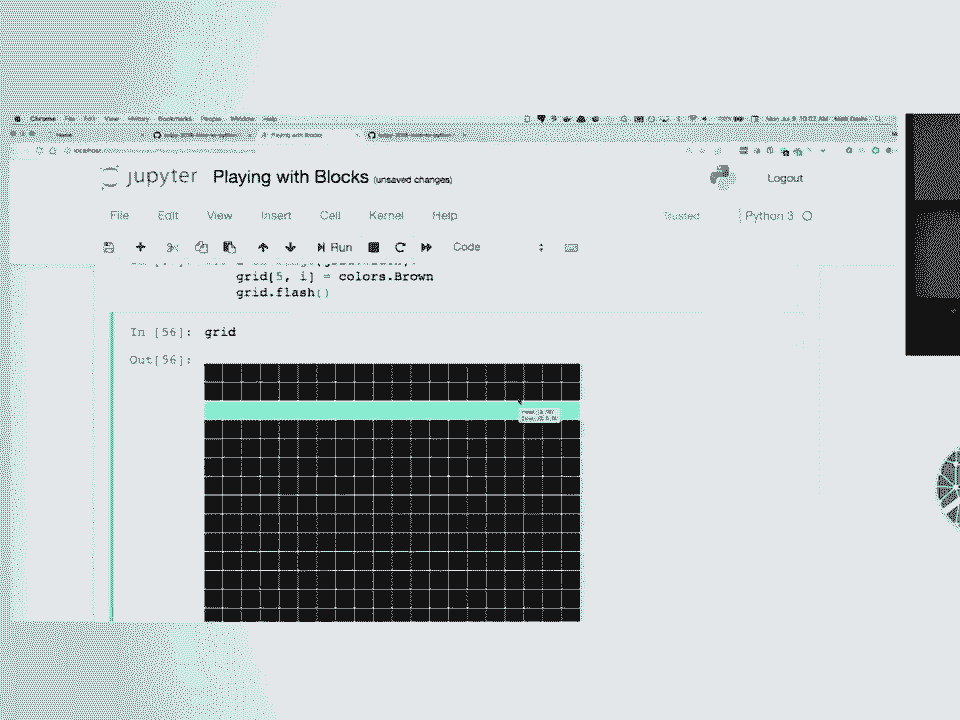
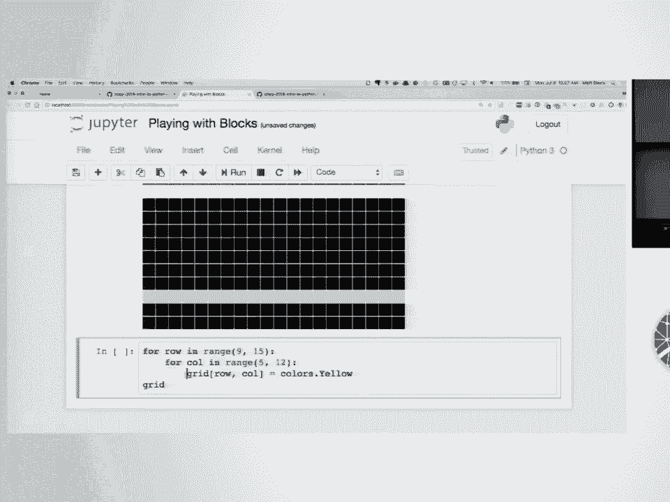
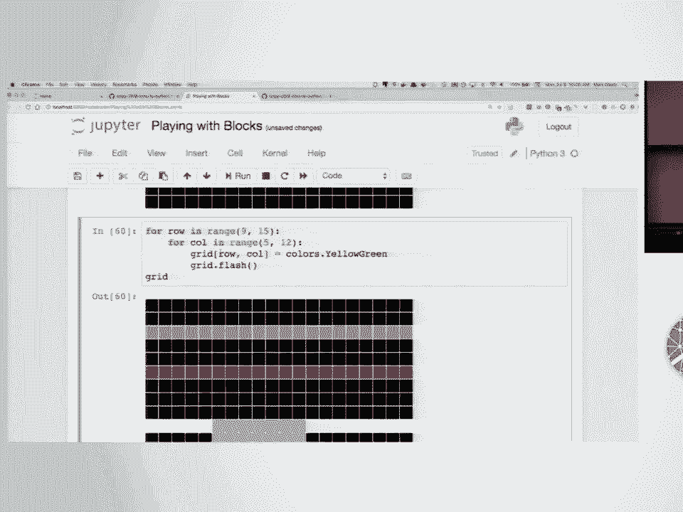
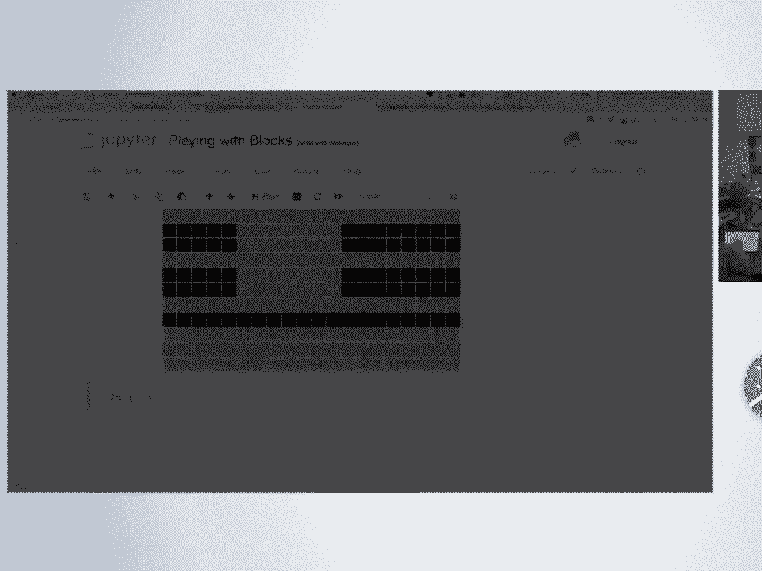

# 53：Python编程入门教程 🐍




## 概述


在本节课中，我们将学习Python编程的基础知识，包括如何设置开发环境、使用Jupyter Notebook、理解变量、索引、循环、条件语句、函数以及Python的核心数据结构。课程将通过一个名为`ipython blocks`的视觉化库进行实践，帮助你直观地理解编程概念。

---

## 1. 环境设置与Jupyter Notebook入门 🛠️

首先，我们需要设置工作环境。请确保你已经安装了Anaconda，它包含了Jupyter Notebook。

以下是设置步骤：
1.  加入课程指定的Slack频道，获取包含课程材料的Git仓库压缩包链接。
2.  下载并解压该压缩包。
3.  打开终端或命令提示符，导航到解压后的目录。
4.  输入命令 `jupyter notebook` 来启动Jupyter。
5.  在打开的浏览器页面中，你应该能看到课程文件，例如 `colors.ipynb`。



上一节我们介绍了如何获取课程材料，本节中我们来看看Jupyter Notebook的基本操作。

### Jupyter Notebook基础

Jupyter Notebook包含两种类型的单元格：**Markdown文本单元格**和**代码单元格**。
*   **Markdown单元格**用于编写说明文本。双击可以编辑，按 `Shift + Enter` 执行并渲染。
*   **代码单元格**用于编写和执行Python代码。代码左侧显示 `In [ ]:`，按 `Shift + Enter` 执行单元格。

执行代码单元格后，左侧会显示一个序号（如 `In [1]:`），表示执行的顺序。如果代码执行成功，通常不会有额外输出，只会更新这个序号。

### 实用功能

Python和Jupyter Notebook提供了一些提高效率的功能：
*   **Tab补全**：输入变量或函数名的前几个字母后按 `Tab` 键，可以自动补全或显示可选列表。
*   **查看帮助**：在函数或变量名后加上 `?`，然后执行单元格，会在底部弹出帮助文档。例如：
    ```python
    show_color?
    ```
*   **快速查看参数**：将光标放在函数括号内，按 `Shift + Tab` 一次会显示简要提示，按两次会展开完整的文档。

现在，请花几分钟时间，在 `colors.ipynb` 笔记本中尝试运行一些代码，熟悉这些操作。

---

## 2. 变量、索引与属性 📦

接下来，我们开始学习Python的核心概念。我们将使用 `ipython blocks` 库创建一个彩色网格来辅助理解。

首先，导入必要的模块并创建一个网格：
```python
from ipython_blocks import BlockGrid
grid = BlockGrid(width=5, height=5)
grid.show()
```
这段代码创建了一个5x5的黑色网格。`BlockGrid` 是一个类，`grid` 是我们创建的一个**实例**，也是一个**变量**。

### 什么是变量？

**变量**是将一个值（如数字、文本、对象）与一个名字关联起来。创建变量的操作称为**赋值**，使用等号 `=`。
```python
red_value = 200
```
现在，名字 `red_value` 就代表了数值 `200`。

### 索引与属性

网格是一个容器，我们可以通过**索引**来获取其中的特定块。Python使用**零基索引**，即第一个位置是0。
```python
# 获取第0行，第0列的块（左上角）
block = grid[0, 0]
```
`block` 现在是一个变量，它指向网格中那个具体的块。我们可以查看或修改这个块的**属性**。属性是附加在变量上的数据，使用点号 `.` 访问。
```python
# 查看块的RGB颜色属性
block.rgb
# 修改块的RGB颜色属性
block.rgb = (255, 0, 0) # 设置为红色
grid.show()
```
**重要概念**：当执行 `block = grid[0, 0]` 时，`block` 并不是那个块的一个新副本，而是指向网格中**同一个块对象**的另一个名字（别名）。因此，通过 `block` 修改颜色，网格 `grid` 中的对应块也会改变。

### 练习

以下是几个练习，帮助你巩固对索引的理解：
1.  **练习一**：创建一个5x5的网格变量。
2.  **练习二**：将网格中第3行、第4列（索引为 `[2, 3]`）的块颜色改为红色。
3.  **练习三**：使用正索引，将网格右下角的块颜色改为蓝色。
4.  **练习四**：使用**负索引**（-1表示最后一个，-2表示倒数第二个），将网格中第2行、第1列的块颜色改为绿色。

---

## 3. 循环与条件语句 🔄

之前我们一次只能操作一个块。要系统性地操作多个块，我们需要**循环**。

### For循环

`for` 循环可以遍历一个序列（如我们的网格）中的每个元素。
```python
for block in grid:
    block.rgb = (0, 255, 0) # 将所有块设为绿色
grid.show()
```
循环结构：
*   `for block in grid:` 声明循环。`block` 是每次循环时用于代表当前块的变量名，可以自定义。行末的冒号 `:` 表示下面是一个代码块。
*   下一行必须**缩进**（通常用4个空格）。所有缩进的代码都属于循环体，会对每个块执行。
*   取消缩进表示退出循环体。

### 条件语句 (if)

我们可以在循环中加入 `if` 语句，根据条件执行不同操作。
```python
for block in grid:
    if block.row == 2: # 双等号 == 用于比较是否相等
        block.rgb = (0, 255, 0) # 只有第2行的块变绿
grid.show()
```
`if` 语句也以冒号 `:` 结尾，其下的代码块需要缩进。`==` 是**比较运算符**，用于判断两边的值是否相等，而单个 `=` 是**赋值运算符**。

### 组合条件

可以使用 `and` (与) 和 `or` (或) 来组合多个条件。
```python
for block in grid:
    # 如果块在第2行且在第2列
    if block.row == 2 and block.col == 2:
        block.rgb = (255, 0, 0)
    # 如果块在第0行或第4行
    elif block.row == 0 or block.row == 4:
        block.rgb = (0, 0, 255)
    # 其他所有情况
    else:
        block.rgb = (200, 200, 200)
grid.show()
```
`elif` 是 `else if` 的缩写，用于检查其他条件。`else` 处理所有未满足上述条件的情况。

---

## 4. range函数与嵌套循环 🔢



有时我们不想遍历所有块，而是想按行号或列号来操作。这时可以使用 `range()` 函数。

### range() 函数



`range()` 生成一个整数序列。
*   `range(5)` 生成 `0, 1, 2, 3, 4`。
*   `range(2, 5)` 生成 `2, 3, 4`。
*   `range(0, 10, 2)` 生成 `0, 2, 4, 6, 8` (第三个参数是步长)。



```python
# 只改变第5行的所有列
for col in range(grid.width):
    grid[5, col].rgb = (255, 165, 0)
grid.show()
```

### 嵌套循环

要操作一个矩形区域，可以使用嵌套循环（一个循环 inside 另一个循环）。
```python
for row in range(5, 10): # 遍历第5到第9行
    for col in range(10, 16): # 遍历第10到第15列
        grid[row, col].rgb = (128, 0, 128)
grid.show()
```
外层循环每执行一次（`row` 取一个值），内层循环会完整地执行一遍（`col` 遍历所有值）。

### 切片

对于连续的行或列，有更简洁的方法——**切片**。切片使用冒号 `:` 来指定范围。
```python
# 选择第5到第9行，第10到第15列的区域
sub_grid = grid[5:10, 10:16]
sub_grid.show()

# 将该区域所有块设为紫色
grid[5:10, 10:16] = (128, 0, 128)
grid.show()
```
切片语法 `start:stop`，包含 `start`，不包含 `stop`。可以省略 `start`（从头开始）或 `stop`（到末尾结束），如 `grid[:3]` 表示前3行，`grid[-3:]` 表示最后3行。

---





## 5. 函数 📞

**函数**是一段可重复使用的代码块，它接受输入（参数），执行操作，并可能返回一个结果。使用函数可以避免代码重复，让程序更清晰。

### 定义函数

使用 `def` 关键字定义函数。
```python
def fahrenheit_to_celsius(f_temp):
    """将华氏温度转换为摄氏温度。"""
    c_temp = (f_temp - 32) * 5 / 9
    return c_temp
```
*   `def`：定义函数。
*   `fahrenheit_to_celsius`：函数名。
*   `(f_temp)`：参数列表。调用函数时需要提供这些参数的值。
*   `:`：冒号表示函数体开始。
*   缩进代码块：函数的具体逻辑。
*   `return`：指定函数的返回值。执行到 `return` 时，函数会立即结束并将结果返回给调用者。

### 调用函数

定义函数后，可以像使用内置函数一样调用它。
```python
today_f = 90
today_c = fahrenheit_to_celsius(today_f)
print(f"华氏{today_f}度等于摄氏{today_c:.1f}度")
```

### 练习：编写颜色反转函数

尝试编写一个函数 `invert_grid`，它接受一个网格作为输入，**返回一个新的网格**，其中所有颜色都是原网格颜色的反色（即每个RGB通道值用255减去原值）。
```python
def invert_grid(input_grid):
    # 1. 创建一个与input_grid同样大小的新网格
    # 2. 遍历input_grid的每一个块
    # 3. 计算反色：new_red = 255 - old_red, 绿色蓝色同理
    # 4. 将反色设置到新网格的对应位置
    # 5. 返回新网格
    pass # `pass` 表示占位，什么都不做
```
**提示**：可以使用 `grid.copy()` 方法快速创建一个具有相同属性和颜色的网格副本，然后修改其颜色。

---

## 6. 核心数据结构：列表、字典与字符串 🗂️

Python内置了多种强大的数据结构来组织数据。

### 列表 (List)

列表是**有序的、可变的**元素序列，用方括号 `[]` 表示。
```python
my_list = [1, "hello", 3.14, grid[0,0]] # 可以包含不同类型
print(my_list[0]) # 索引访问: 输出 1
my_list[1] = "world" # 修改元素
my_list.append("new item") # 在末尾添加元素
```

### 元组 (Tuple)

元组是**有序的、不可变的**元素序列，用圆括号 `()` 表示。不可变意味着创建后不能修改。
```python
my_tuple = (1, 2, 3)
# my_tuple[0] = 4 # 这行会报错，因为元组不可变
```
函数返回多个值时，实际上返回的是一个元组。

### 字典 (Dictionary)

字典是**键值对**的集合，用花括号 `{}` 表示。它通过唯一的**键**来快速查找对应的**值**。
```python
my_dict = {"name": "Alice", "age": 30, "city": "New York"}
print(my_dict["name"]) # 通过键访问值: 输出 "Alice"
my_dict["job"] = "Engineer" # 添加新的键值对
my_dict["age"] = 31 # 修改已有键的值
```

### 字符串 (String)

字符串是字符序列，用单引号 `'` 或双引号 `"` 包围。
```python
my_string = "Hello, Python!"
print(my_string[7]) # 索引访问: 输出 'P'
print(my_string.upper()) # 调用字符串方法: 输出全大写
print(f"My grid has {grid.width} rows.") # 格式化字符串
```

### 综合示例：路径追踪函数

结合列表和字典，我们可以编写一个更有趣的函数，让一个块在网格中按指定路径移动并留下痕迹。
```python
def follow_path(grid, start_pos, path, color):
    """
    在网格上追踪一条路径。
    grid: 目标网格
    start_pos: 起始位置 (row, col) 元组
    path: 路径列表，包含 'up', 'down', 'left', 'right'
    color: 路径颜色
    """
    # 方向到坐标变化的映射
    directions = {
        'up': (-1, 0),
        'down': (1, 0),
        'left': (0, -1),
        'right': (0, 1)
    }
    row, col = start_pos
    grid[row, col].rgb = color # 标记起点
    for step in path:
        dr, dc = directions[step] # 获取行和列的变化量
        row += dr
        col += dc
        grid[row, col].rgb = color # 标记路径点

# 使用函数
my_grid = BlockGrid(10, 10, fill=(200,200,200))
path = ['right', 'right', 'down', 'down', 'left', 'up']
follow_path(my_grid, (3, 3), path, colors.Coral)
my_grid.show()
```

---

## 7. 科学计算Python生态系统简介 🌐

Python之所以在科学计算领域如此流行，得益于其丰富的第三方库生态系统。以下是一些最核心的库：

*   **NumPy**：提供高性能的多维数组对象和数学函数。它是几乎所有其他科学计算库的基础。**核心优势是速度**，因为其底层运算用C语言实现。
*   **SciPy**：建立在NumPy之上，提供更高级的科学计算功能，如数值积分、优化、信号处理、线性代数等。
*   **pandas**：用于数据操作和分析。它提供了类似电子表格的 `DataFrame` 数据结构，非常适合处理表格数据（如CSV文件、SQL查询结果），支持数据清洗、转换、合并、分组等复杂操作。
*   **Matplotlib**：主要的绘图库，可以创建高质量的静态、交互式图表和图形，适用于论文出版和数据可视化。
*   **scikit-learn**：机器学习库，提供了分类、回归、聚类、降维等大量算法，以及数据预处理和模型评估工具。

这些库通常协同工作。例如，你可以用 `pandas` 读取和清洗数据，用 `NumPy`/`SciPy` 进行数值计算，用 `scikit-learn` 构建机器学习模型，最后用 `Matplotlib` 将结果可视化。

---

## 总结

本节课中我们一起学习了Python编程的基础知识：
1.  **环境与工具**：设置了Jupyter Notebook开发环境，并学习了其基本操作和快捷功能。
2.  **核心概念**：理解了**变量**、**索引**、**属性**以及Python中对象引用的特点。
3.  **流程控制**：掌握了使用 **`for` 循环**遍历数据，以及使用 **`if`/`elif`/`else` 条件语句**进行逻辑判断。
4.  **代码复用**：学会了如何定义和调用**函数**来封装可重用的代码逻辑。
5.  **数据结构**：认识了**列表**、**字典**、**元组**和**字符串**这几种核心数据结构及其用途。
6.  **生态概览**：了解了支撑Python科学计算的核心库（NumPy, SciPy, pandas等）及其角色。


这些知识是你进一步学习数据分析、机器学习或任何Python相关领域的坚实基础。继续练习和探索吧！