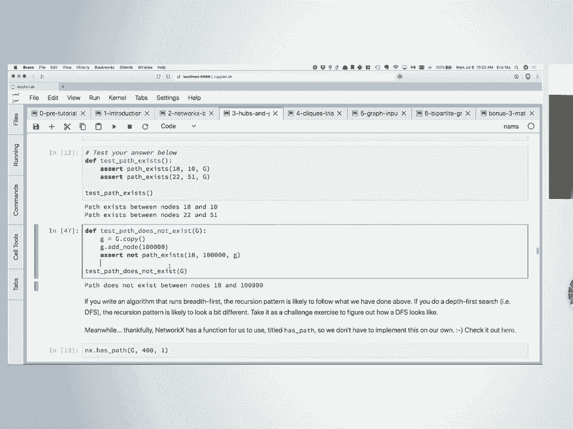
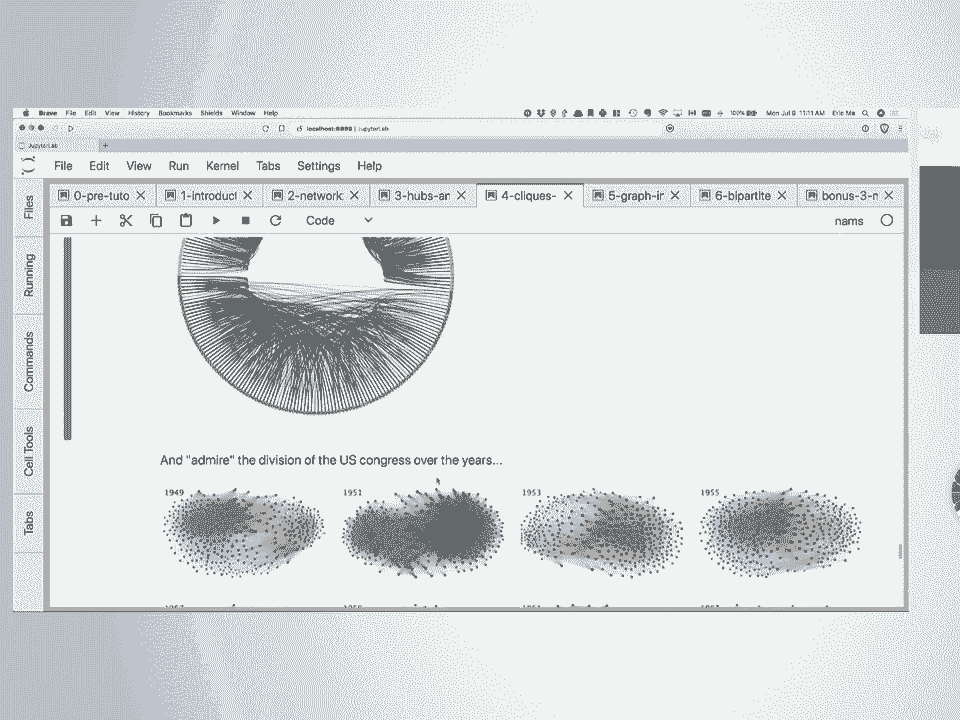
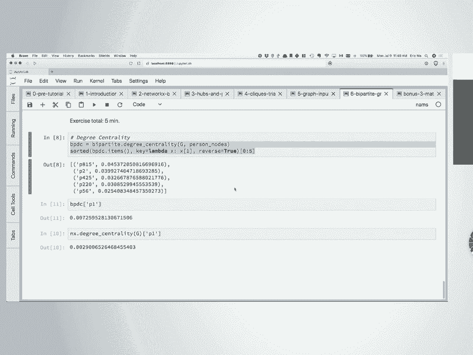
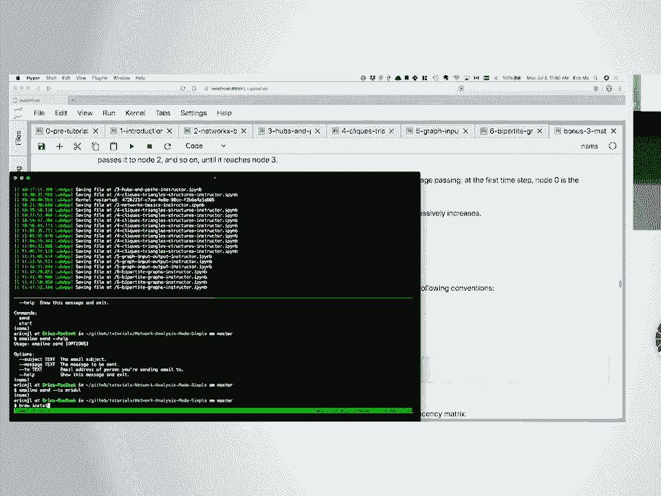
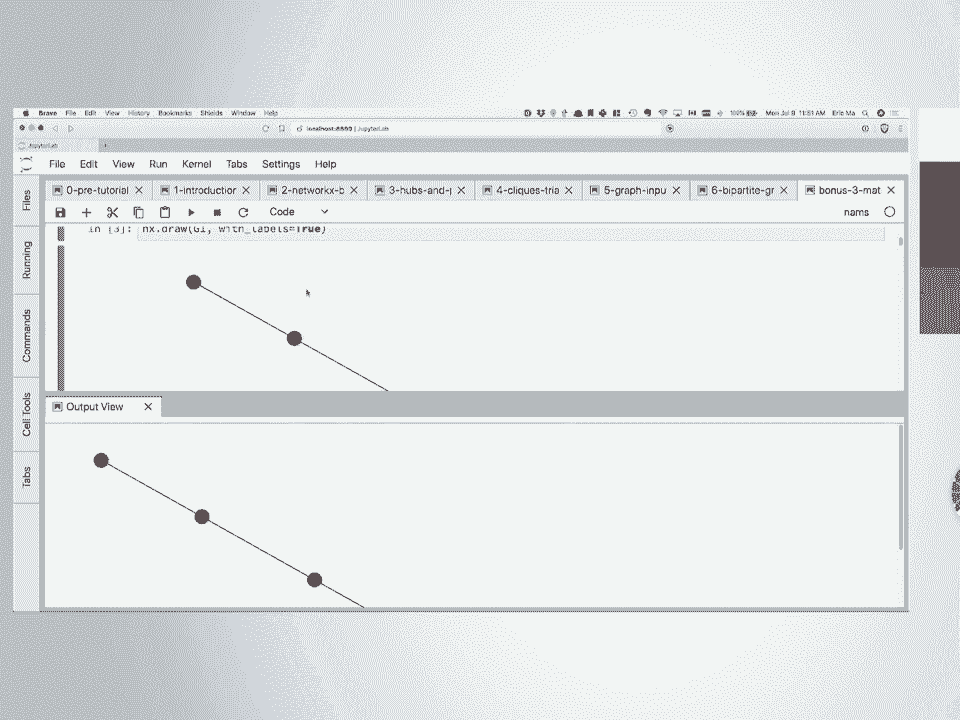
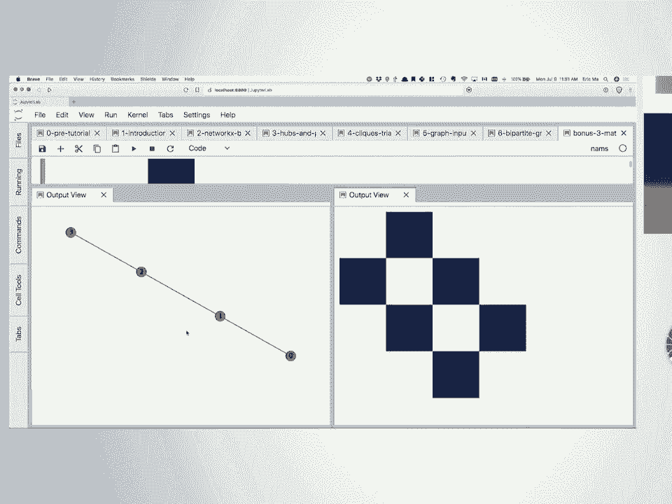
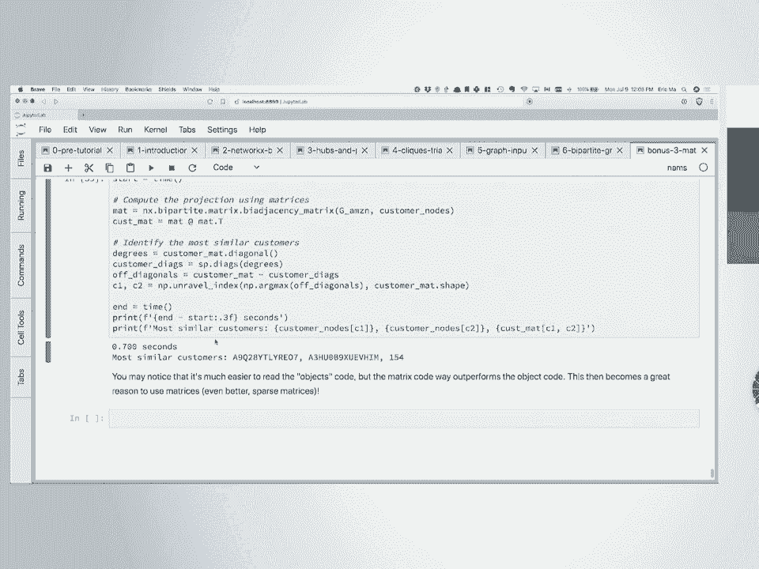

# 58：网络分析入门 - 网络基础 🕸️

## 概述

在本课程中，我们将学习网络分析的基础知识。我们将从网络的基本概念开始，逐步介绍如何使用 Python 的 NetworkX 库进行数据建模、分析和可视化。课程内容设计得简单易懂，特别适合自学者和通过代码学习的人。我们不会涉及复杂的数学公式，而是专注于通过实际代码来理解网络科学的核心概念。

---

## 网络基础概念

### 什么是网络？

网络由两种主要类型的实体组成：节点集和边集。节点是网络中的实体，通常是我们可以计数和测量的物理对象。边是这些实体之间的关系。当我们进行图分析时，我们实际上是在处理关系问题。

> “图的核心在于其边，而非其节点。” —— 这句话强调了边以及它们如何连接节点，才是图有趣之处的根源。

### 有向图与无向图

我们讨论了有向图和无向图。例如，Facebook 是一个无向图，因为一旦我接受好友请求，我们双方就立即建立了连接。相比之下，Twitter 是一个有向图，因为我关注某人，但那个人不一定需要回关我。

---

## 课程目标与期望


在本课程结束时，我希望大家能够：

1.  **熟悉 NetworkX API**：掌握在 Jupyter Notebook 交互式计算环境中使用 NetworkX 进行图建模。
2.  **理解关注点分离**：认识到图建模和图可视化是两个独立的步骤，有多种可视化工具可供选择，应避免使用难以解读的“毛球图”。
3.  **编写基本算法**：能够在图上进行计算，例如遍历、寻找重要节点等。
4.  **计算基本统计量**：能够计算图的基本统计信息，如节点数、边数、节点属性的分布、边属性的分布等。
5.  **建立关系思维**：更广泛地说，我希望大家能够开始不仅从数据点的角度，更从数据点之间关系的角度来思考你的数据。

---

## 开始实践：熟悉 NetworkX API

上一节我们介绍了网络的基本概念，本节中我们来看看如何实际操作。我们将打开 Notebook 2，开始动手实践，逐步熟悉 NetworkX 的 API。

我们使用的数据集是一个七年级学生的社交网络。学生们被问了三次“谁是你最喜欢的朋友？”。通过这个数据集，我们可以分析哪些孩子喜欢一起玩，哪些孩子可能被孤立。

### 图在 NetworkX 中的表示

在 NetworkX 中，图被表示为“字典的字典的字典”。节点作为图 `node` 属性的一部分存储，边作为图 `edge` 属性的一部分存储。在 NetworkX 2.x 版本中，访问特定边的语法是 `g.edge[节点1, 节点2]`。

这意味着，存储在图中的任何节点对象都必须是“可哈希的”对象，它们不能是可变的。字符串和元组是可哈希的，但列表不是，因为列表可以在原地修改。

### 基本查询

以下是进行基本查询的步骤：

1.  **加载数据**：运行单元格加载七年级学生网络数据。
2.  **查询节点数**：使用 `len(g.nodes)` 或 `len(g)` 来获取图中的学生数量。
3.  **查询边数**：使用 `len(g.edges)` 来获取图中的关系数量。
4.  **访问节点和边**：要访问节点或边的具体元素，需要先将 `NodeView` 或 `EdgeView` 对象转换为列表。

### 处理元数据

节点和边都可以附带元数据。

*   **节点元数据**：通过 `g.nodes(data=True)` 访问，返回一个列表，其中每个元素是一个二元组 `(节点ID, 元数据字典)`。
*   **边元数据**：通过 `g.edges(data=True)` 访问，返回一个列表，其中每个元素是一个三元组 `(节点1, 节点2, 元数据字典)`。

我们可以利用这些元数据进行更深入的分析，例如，统计图中男生和女生的数量。以下是一个使用列表推导式的示例：

```python
from collections import Counter
gender = [d[‘gender‘] for n, d in g.nodes(data=True)]
Counter(gender)
```

### 图的修改与测试

我们可以向图中添加新的节点和边。例如，添加两个学生和他们之间的友谊关系。需要注意的是，如果图是有向的，并且我们需要双向关系，就必须显式地添加两个方向的边。

在数据分析中，为数据假设编写自动化测试是一个好习惯。例如，我们可以断言数据中“好友关系”的最大次数不超过3次，以验证数据完整性。

---

## 图的可视化

上一节我们学习了如何查询和修改图，本节中我们来看看如何将图可视化。许多人刚开始使用 NetworkX 时最大的困惑就是：“我创建了一个图对象 G，但我看不到它。” 这引出了“关注点分离”的概念：图可以存在于内存中，但可视化需要单独的布局步骤。

### 避免“毛球图”

使用 NetworkX 内置的 `nx.draw(g)` 函数绘图时，如果节点数稍多（例如超过十几个），很容易得到一团乱麻的“毛球图”，从中很难获取有效信息。

### 合理的可视化方法

1.  **矩阵图**：利用图的矩阵表示。将节点排列在矩阵的行和列上，根据节点间是否存在边来填充矩阵。这种图可以清晰地展示图是否有向（矩阵是否对称）、是否有自环（对角线是否为空）等信息。
2.  **弧线图**：将所有节点排列在一条直线上，可以根据某种标准（如性别）对节点进行分组和着色。弧线表示边。这种图便于观察组内和组间的连接密度。
3.  **环形图**：在弧线图的基础上，将直线的两端连接起来形成环形。这是另一种基于理性布局的可视化方法。
4.  **蜂巢图**：特别适用于可视化组内与组间的连接性。我们将节点按某些标准分组（最多三组），然后在组之间绘制连线。组内的连接则通过克隆坐标轴来绘制。

NXViz 是一个旨在成为“网络可视化领域的 Seaborn”的包，它尝试提供声明式的样式设置，让用户通过指定关键字（如按某个属性着色、分组）来轻松创建合理的可视化。

---

## 重要节点与路径查找

上一节我们探讨了图的可视化，本节中我们来看看如何识别图中的重要节点以及如何查找路径。我们使用一个新的数据集：“社交模式网络”，它记录了画廊展览中访客之间面对面接触（持续至少20秒）的情况。这是一个无向图。

### 衡量节点重要性的方法

1.  **邻居数量**：一个节点连接的其他节点的数量。在 NetworkX 中，可以通过 `len(list(g.neighbors(节点ID)))` 计算。
2.  **度中心性**：节点邻居数除以它可能拥有的最大邻居数。在无自环图中，最大邻居数是总节点数减一。NetworkX 提供了 `nx.degree_centrality(g)` 函数直接计算。
3.  **特征向量中心性**：衡量节点邻居的重要性。如果一个节点连接了许多重要的节点，那么它本身也更重要。
4.  **介数中心性**：经过该节点的最短路径数量除以图中所有最短路径的数量。这可以识别网络中的“信息瓶颈”节点。NetworkX 提供了 `nx.betweenness_centrality(g)` 函数。

**注意**：度中心性（局部属性）和介数中心性（全局属性）不一定相关。例如，在一个连接两个稠密社区的“桥”节点上，它的度可能很低，但介数中心性会很高。

### 使用 ECDF 图理解分布

我们鼓励使用经验累积分布函数图代替直方图来查看中心性等指标的分布。ECDF 图可以无偏差地使用所有数据点，并且可以直接从图中读取中位数、四分位距等信息，而无需担心分箱问题。

### 路径查找算法

路径查找是图论和应用网络科学中的一个核心思想。计算机需要通过算法来找到节点间的路径。




1.  **广度优先搜索**：从起点开始，逐层向外探索邻居，直到找到目标节点。它保证找到的路径是最短的（在无权图中）。
2.  **深度优先搜索**：沿着一条路径一直探索到尽头，然后再回溯尝试其他路径。

我们尝试实现了 BFS 算法来检查两个节点间是否存在路径。这帮助我们以计算机的思维方式来理解图遍历。当然，NetworkX 已经内置了 `nx.has_path(g, 节点A, 节点B)` 和 `nx.shortest_path(g, 节点A, 节点B)` 等函数。

---

## 图中的有趣结构：团与连通分量

上一节我们学习了如何寻找重要节点和路径，本节中我们来看看图中一些有趣的结构。我们使用“医生信任网络”数据集，这是一个无向图，节点是医生，边表示一位医生信任另一位医生的建议。

### 团

团是图中的一个子图，其中该子图中的**每一对节点**都相互连接。

*   **最简单的团**：一条边（两个节点）。
*   **最简单的复杂团**：三角形（三个节点）。
*   **k-团**：包含 k 个节点的团。
*   **极大团**：一个团，无法通过添加图中的其他任何节点来扩展它。

我们可以通过检查一个节点的邻居之间是否也存在边，来判断该节点是否参与了一个三角形。NetworkX 提供了 `nx.triangles(g)` 函数来计数每个节点参与的三角形数量。

**开放三角形**（或称“线”）：三个节点中只有两条边。这构成了社交网络“好友推荐”功能的基础逻辑：如果 A 认识 B，A 认识 C，那么 B 和 C 也可能认识。

NetworkX 的 `nx.find_cliques(g)` 函数可以找出图中所有的极大团。由于任何 k-团都包含其所有子集构成的更小的团，因此找到所有极大团是找出所有团的一种高效方式。

### 连通分量

连通分量子图是指该子图中的任意两个节点之间都存在路径，并且没有连接到该子图之外节点的边。

在我们的医生信任网络中，我们假设并验证了存在四个连通分量，这很可能对应于四个地理上隔离的城镇（1960年代）。通过 NXViz，我们可以绘制环形图，并按连通分量对节点进行着色和排序，直观地展示这一结构。

分析连通分量的数量和演变（例如美国国会社交网络的碎片化）是网络分析的一个重要应用。

---

## 图的输入与输出

上一节我们讨论了图的结构，本节中我们来看看如何将数据导入和导出 NetworkX。我们使用芝加哥 Divvy 自行车共享系统的数据。

### 数据表示

图通常可以用两种表格表示：
1.  **节点表**：每一行是一个节点，列是节点的属性（如车站ID、名称、经纬度）。
2.  **边表**：每一行是一条边，至少包含两列指向节点表的键（如起点站ID、终点站ID），其他列是边的属性（如行程次数、时间）。


### 从 Pandas DataFrame 创建图

NetworkX 2.x 提供了 `nx.from_pandas_edgelist()` 函数，可以方便地从边表 DataFrame 创建图，并指定节点属性和边属性。




对于大型图（很多边），有时需要进行聚合。例如，如果我们只关心车站间的行程数量，可以将多重图（允许重复边）聚合为带权图，边的权重就是行程次数。

### 序列化：使用 Pickle

`nx.write_gpickle(g, ‘文件路径‘)` 和 `nx.read_gpickle(‘文件路径‘)` 可以将图对象序列化到磁盘或从磁盘读取。这是一种保持图对象完整性的便捷方式，但文件可能较大。

---

## 二分图

上一节我们处理了一般的图，本节中我们来看一种特殊的图：二分图。在二分图中，节点被分为两个不相交的集合（例如“用户”和“商品”），并且边只能连接**不同集合**中的节点。

我们使用一个“犯罪网络”二分图数据集，其中包含“人”和“犯罪事件”两类节点，边表示某人以某种角色（嫌疑人、受害者、证人）参与了一起犯罪事件。

在 NetworkX 中构建二分图时，需要为每个节点设置一个 `bipartite` 属性（如 `‘person‘` 或 `‘crime‘`），这是算法识别节点所属分区的关键。

### 投影

二分图的一个强大操作是**投影**。我们可以将二分图投影到其中一个节点集上，得到一个单分图（同质图）。

*   **人物投影**：如果两个人参与了同一桩犯罪事件，则在投影图中他们之间会有一条边。边的权重可以是共同参与的事件数。
*   **犯罪事件投影**：如果两起犯罪事件有共同参与者，则在投影图中它们之间会有一条边。

NetworkX 的 `nx.bipartite.projected_graph` 函数可以计算投影。**注意**：二分图中的度中心性定义与普通图不同，因为一个节点只能与另一个分区中的节点相连，其可能的最大邻居数是另一个分区的节点总数。

### 矩阵运算与性能

二分图的投影可以通过矩阵乘法高效计算。设 `B` 为 `m x n` 的二分图邻接矩阵（m个人，n个事件）。则：
*   人物投影的邻接矩阵 `A_person = B * B.T`（`m x m`），对角线是每个人参与的事件数，非对角线是两个人共同参与的事件数。
*   事件投影的邻接矩阵 `A_event = B.T * B`（`n x n`）。

与 NetworkX 的对象操作相比，使用 NumPy 进行矩阵运算通常能带来巨大的速度提升，尽管代码的直观性可能有所降低。





---






## 矩阵运算与图

最后，我们简要探讨图与矩阵表示之间的深刻联系。图的邻接矩阵 `A` 是一个方阵，其中 `A[i, j] = 1` 表示节点 i 和 j 之间有边。

### 矩阵的幂

邻接矩阵的 `k` 次幂 `A^k` 有一个美妙的性质：`(A^k)[i, j]` 的值等于从节点 `i` 到节点 `j` 的长度为 `k` 的路径数量。特别地，`(A^2)[i, i]` 等于节点 `i` 的度数（在无向图中）。

### 消息传播

我们可以利用矩阵乘法来模拟消息或谣言在网络中的传播。从一个初始消息向量 `v`（例如，`v[0]=1` 表示消息从节点0开始）开始，每次左乘邻接矩阵 `A`：`v_{new} = A * v_{old}`。这个操作模拟了消息在一轮中沿边传递到邻居的过程。重复此操作，可以观察消息随时间在网络中的扩散情况。

---

## 总结

在本课程中，我们一起学习了网络分析的基础知识。我们从网络的基本定义（节点和边）开始，逐步掌握了如何使用 NetworkX 库来：
*   构建和修改图。
*   查询图的基本信息和元数据。
*   使用合理的可视化方法（如矩阵图、弧线图、环形图）来理解图结构，避免无意义的“毛球图”。
*   识别图中的重要节点（通过度中心性、介数中心性等）。
*   实现基本的图遍历算法（如BFS）并理解路径查找。
*   发现图中的有趣结构，如团、三角形和连通分量。
*   将表格数据（如CSV）导入为图，并进行序列化存储。
*   理解并操作特殊的二分图，包括计算其投影。
*   领略了图与矩阵表示之间的强大联系，以及如何利用矩阵运算加速某些计算。



希望这门课能帮助你开始从关系的角度思考数据，并为你进一步探索网络科学领域打下坚实的基础。