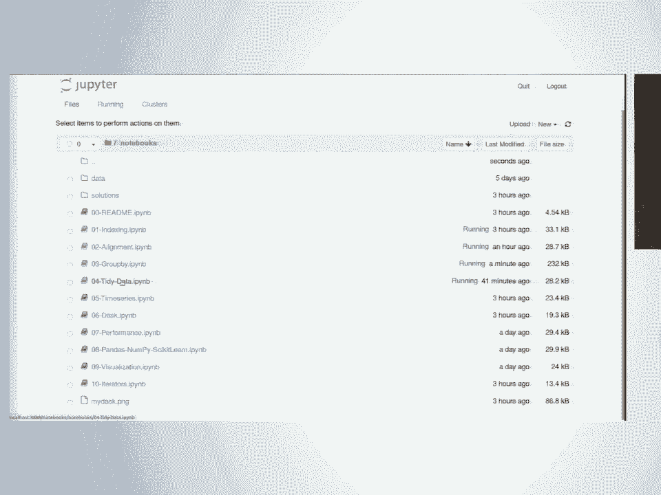
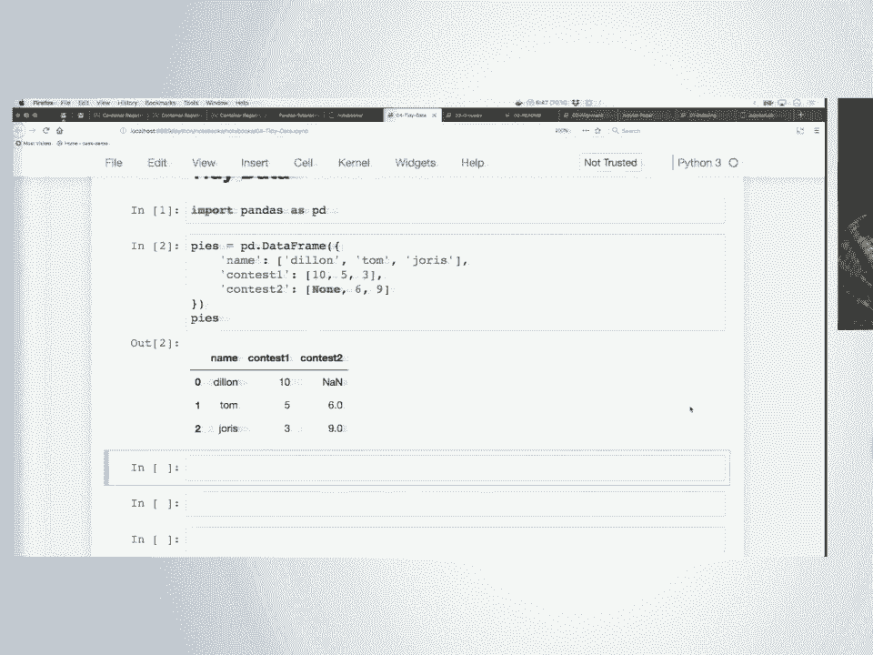
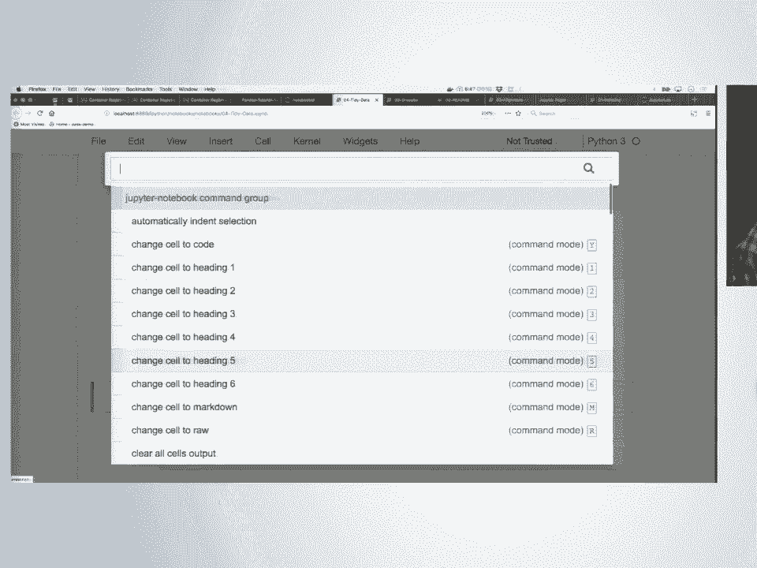
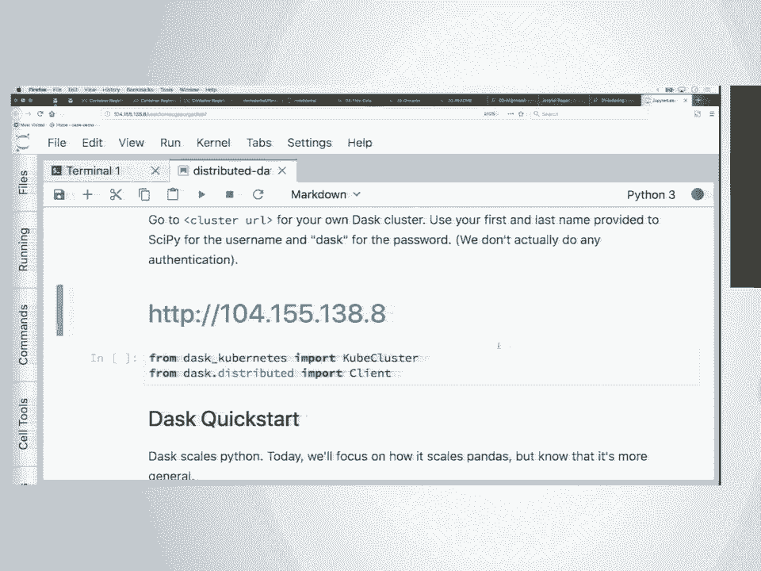
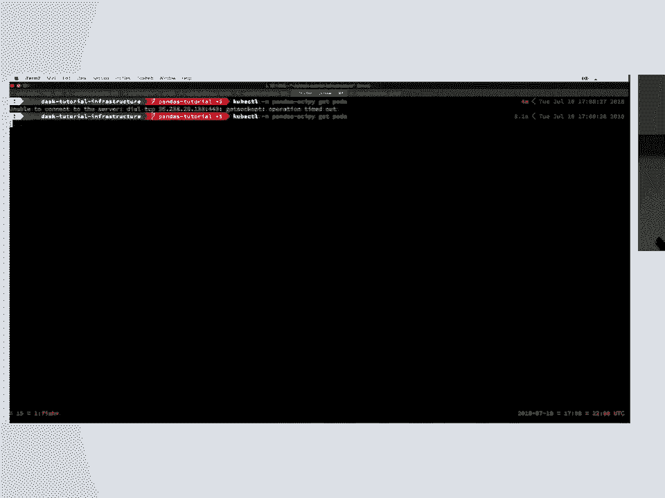
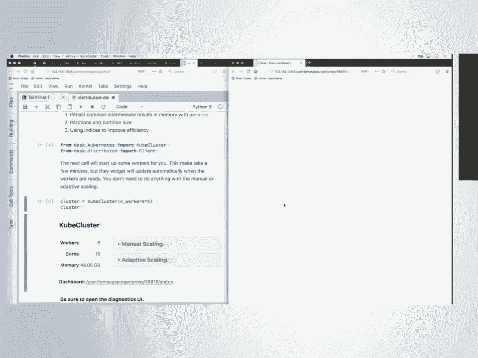

# 60：从 .head() 到 .tail() 的 pandas 入门教程 🐼

在本节课中，我们将学习 Python 数据分析的核心库——pandas。我们将从最基础的数据结构开始，逐步掌握数据索引、分组聚合、数据重塑以及如何利用 Dask 进行大规模数据处理。无论你是数据分析新手，还是希望巩固基础，本教程都将为你提供清晰的指引。

---

## 1. 核心数据结构：Series 与 DataFrame 📊

上一节我们介绍了课程概览，本节中我们来看看 pandas 的基石：Series 和 DataFrame。

pandas 主要使用两种数据结构：**Series** 和 **DataFrame**。DataFrame 由多个 Series 组成，理解它们是使用 pandas 的第一步。

### Series
Series 类似于一维的 NumPy 数组，其内部数据类型是**同质**的。这意味着一个 Series 中只能包含一种数据类型（如全为整数、全为浮点数或全为字符串）。与 NumPy 数组的关键区别在于，Series 拥有一个**索引**，它提供了基于标签的数据访问能力。

**公式/代码描述**：
```python
import pandas as pd
s = pd.Series([10, 5, 3], index=['Dylan', 'Tom', 'Joris'])
# 基于位置访问：s.iloc[0] -> 10
# 基于标签访问：s.loc['Tom'] -> 5
```

### DataFrame
DataFrame 是一个二维表格型数据结构。它的每一列都是一个 Series，因此**同一列内的数据类型是同质的，但不同列之间的数据类型可以不同**。DataFrame 拥有两个索引：**行索引** 和 **列索引**，分别提供对行和列的标签访问。

**公式/代码描述**：
```python
df = pd.DataFrame({
    'name': ['Dylan', 'Tom', 'Joris'],
    'contest1': [10, 5, 3],
    'contest2': [None, 6, 9]
})
# 行索引（默认0,1,2）用于访问行
# 列索引（‘name’， ‘contest1’， ‘contest2’）用于访问列
```

---

## 2. 数据访问的四种主要方式 🔍

理解了数据结构后，我们来看看如何从中获取数据。pandas 提供了多种灵活的数据访问方法。

以下是四种最常用的数据访问方式：

1.  **字典式访问**：使用列名作为“键”。
    ```python
    df['column_name']          # 获取单列，返回 Series
    df[['col1', 'col2']]       # 获取多列，返回 DataFrame
    ```

2.  **属性式访问**：将列名作为属性访问（仅当列名是有效的 Python 标识符且不与 DataFrame 方法名冲突时可用）。
    ```python
    df.column_name             # 获取单列，返回 Series
    ```

3.  **`iloc` 索引器**：基于整数位置的索引，与 NumPy 类似。
    ```python
    df.iloc[0]                 # 获取第一行
    df.iloc[0:5, 1:3]          # 切片：前5行，第2到3列
    ```

4.  **`loc` 索引器**：基于标签的索引。
    ```python
    df.loc['row_label']                 # 获取标签为‘row_label’的行
    df.loc['row1':'row3', 'col1':'col2'] # 切片（注意：标签切片是包含末尾的）
    ```

**重要提示**：pandas 中的索引（Index）与 Python 字典的键不同，索引标签**可以重复**。这更像数据库索引，是一种快速查找数据的机制。

---

## 3. 布尔索引与数据筛选 🎯

上一节我们学习了如何按位置或标签获取数据，本节中我们来看看如何根据条件筛选数据。

布尔索引允许我们根据逻辑条件来筛选数据行。其核心是创建一个布尔掩码（Boolean Mask），即一个与 DataFrame 行数相同、值为 True 或 False 的 Series。

**操作步骤**：
1.  创建条件表达式，生成布尔 Series。
2.  将该布尔 Series 传递给 `.loc[]` 索引器。

**代码示例**：
```python
# 假设有航班数据 flights
# 1. 创建布尔掩码：找出出发机场是‘JFK’或‘LGA’的航班
mask = flights['origin'].isin(['JFK', 'LGA'])

# 2. 使用掩码筛选数据
filtered_flights = flights.loc[mask]

# 也可以组合多个条件（使用位运算符 &, |, ~）
morning_flights = flights.loc[(flights['dep_time'].dt.hour < 6) | (flights['dep_time'].dt.hour > 18)]
```

---

## 4. 数据对齐：让运算更智能 🤝

在 pandas 中，当对两个 Series 或 DataFrame 进行运算时，它会自动根据索引标签对齐数据，然后再进行计算。这是 pandas 一个非常强大且省心的特性。

**核心概念**：运算前，pandas 会先取两个数据集索引的**并集**，然后将数据**重新索引**到这个并集上。缺失的位置会用 `NaN`（Not a Number）填充，然后再执行运算。

**代码示例**：
```python
# 两个具有不同时间索引的序列
gdp = pd.Series(...)  # 季度GDP数据，索引为日期
cpi = pd.Series(...)  # 月度CPI数据，索引为日期

# 直接相除，pandas会自动按日期对齐，缺失日期对应值为NaN
real_gdp = gdp / cpi
```
如果没有自动对齐，我们就需要手动进行类似 SQL JOIN 的操作，繁琐且容易出错。

---

## 5. 分组聚合：GroupBy 的强大功能 📈

数据分析中，我们经常需要“分组-应用-合并”：先将数据按某个键分组，然后在每个组内应用函数（如求和、平均），最后将结果合并。

pandas 的 `groupby` 方法完美实现了这一模式。

**基本语法**：
```python
df.groupby(‘grouping_column’)[‘column_to_aggregate’].aggregation_function()
```

**代码示例**：
```python
# 计算每种啤酒风格的平均评分
avg_review = df.groupby('beer_style')['review_overall'].mean()

# 计算每个机场的平均出发延误时间
avg_delay_by_origin = flights.groupby('origin')['dep_delay'].mean()

# 同时计算多个聚合指标（如数量和均值）
stats = df.groupby('beer_name')['review_overall'].agg(['count', 'mean'])
```




**方法链**：由于每个操作都返回一个新的对象，我们可以将多个操作流畅地连接起来。
```python
(df.groupby('beer_style')['abv'].std()
   .sort_values(ascending=False)
   .head())
```

---

## 6. 数据重塑：理解“整洁数据”理念 ♻️

“整洁数据”是一种高效的数据组织理念，它要求：
1.  每个变量构成一列。
2.  每个观察结果构成一行。
3.  每种观测单位构成一个表格。





我们常遇到“宽格式”数据（一个主题的多项观测放在多列）和“长格式”数据（一个主题的多项观测放在多行）。pandas 提供了在两者间转换的工具。

**从宽变长：`melt`**
```python
long_df = pd.melt(wide_df,
                  id_vars=['name'],        # 保持不变的列
                  value_vars=['contest1', 'contest2'], # 要压缩的列
                  var_name='contest',      # 新列名，存放原列名
                  value_name='pies_eaten') # 新列名，存放原数值
```

**从长变宽：`pivot`**
```python
wide_df_again = long_df.pivot(index='name',
                              columns='contest',
                              values='pies_eaten')
```

另一种方法是使用 `stack`（将列索引转为行索引，变长）和 `unstack`（将行索引转为列索引，变宽）。

---

## 7. 使用 Dask 进行大规模数据处理 🚀

当数据量超出单机内存时，pandas 就力不从心了。这时可以使用 **Dask**。Dask 提供了一个与 pandas API 兼容的 `DataFrame`，它能将大型数据集分割成多个小块（pandas DataFrame），并行或分布式地处理它们。

**核心思想**：惰性计算。Dask 会先构建一个任务执行图，直到调用 `.compute()` 方法时才真正触发并行计算。





**代码示例**：
```python
import dask.dataframe as dd

# 从多个CSV文件读取数据（支持通配符）
df_dask = dd.read_csv('gs://bucket/flights/*.csv')

# 操作语法与 pandas 极其相似
result = (df_dask[df_dask.cancelled == 0]
           .groupby('origin')['dep_delay']
           .mean())



# 触发实际计算
average_delays = result.compute()
```
通过连接到 Dask 集群，我们可以将计算任务分发到多台机器上，处理远超内存大小的数据集。

---

## 总结 📝

本节课中我们一起学习了 pandas 数据分析的核心旅程：
1.  认识了 **Series** 和 **DataFrame** 这两个基础数据结构。
2.  掌握了通过 **字典式、属性式、`iloc`、`loc`** 四种方式灵活访问数据。
3.  学会了使用 **布尔索引** 进行条件筛选。
4.  理解了 **数据对齐** 机制如何让运算更智能。
5.  运用 **GroupBy** 功能轻松实现分组聚合分析。
6.  利用 **`melt` 和 `pivot`** 在“宽格式”与“长格式”数据间转换，遵循“整洁数据”理念。
7.  初步了解了如何使用 **Dask** 来扩展 pandas，处理大规模数据集。

希望本教程为你打开了 pandas 世界的大门。记住，熟练运用这些工具的关键在于不断练习和实践。