# 61：轻松实现数据可视化与探索 🚀

## 课程概述

在本节课中，我们将学习 PyViz 项目，这是一个旨在简化 Python 数据可视化的工具集。我们将了解如何将数据轻松转化为交互式图表，并探索其核心概念和工具。

---

## 1. 课程介绍与安装 🛠️

我是 Jim Bednar，负责管理 PyViz 项目。Jean-Luc 是三位核心开发者之一，他在许多领域都是专家。在教程的第一部分，他将帮助大家解决安装问题。之后，他会解答关于 PyViz 或我们涵盖主题的任何实际问题。

通常，在前 45 分钟左右，我会讲解一些内容，这些内容与你的笔记本电脑是否正常工作无关。在此期间，Jean-Luc 会四处走动，直到所有问题都得到解决。

### 安装说明

要安装 PyViz，请使用以下命令：
```bash
conda install -c pyviz
```
默认的 Anaconda 频道可能包含较旧的版本。PyViz 频道始终包含最新版本。对于本教程，我们只使用默认频道或 PyViz 频道的包，不使用 Condaforge 频道，以避免二进制接口不兼容的问题。

### 环境设置

强烈建议创建一个新的 conda 环境，以确保独立性：
```bash
conda create -n pyviz-tutorial python=3.7
conda activate pyviz-tutorial
conda install -c pyviz pyviz
```

### 状态指示

我们借鉴了 Software Carpentry 的方法，使用便利贴来指示状态：
*   **绿色**：安装并运行成功，一切正常。
*   **红色**：遇到问题。
*   **其他颜色**：正在处理中。

如果没有便利贴，请举手示意。

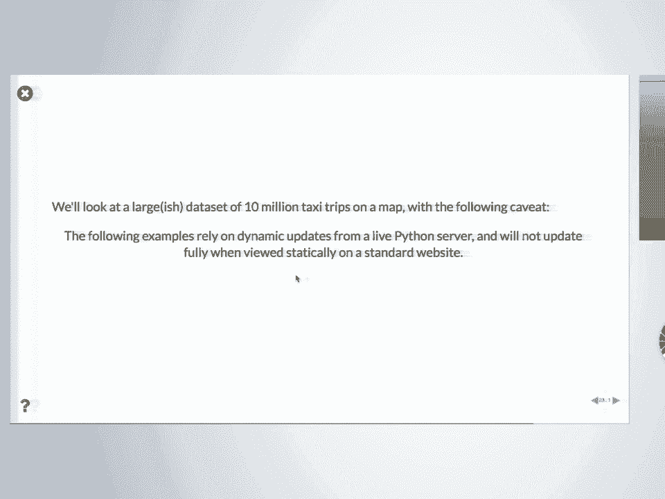

---

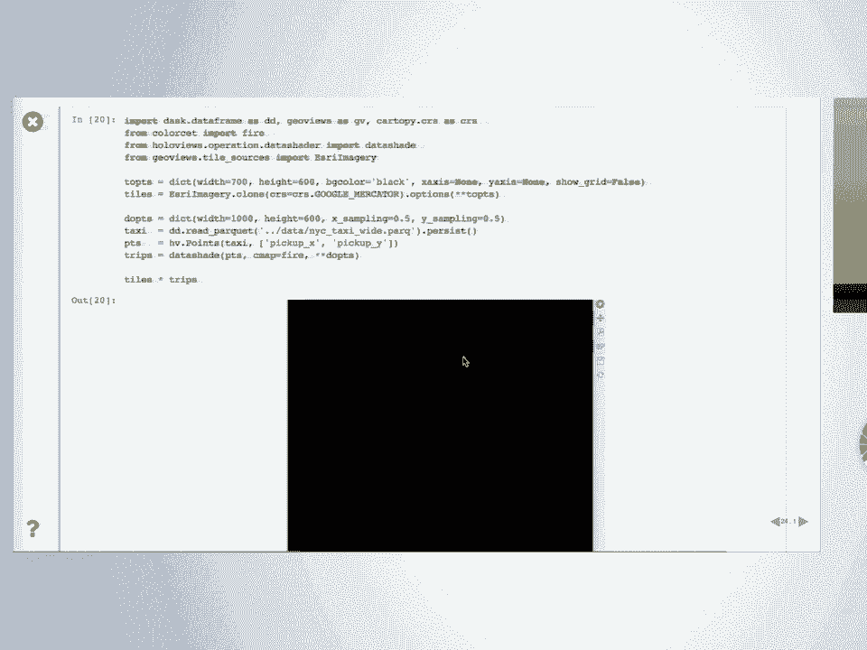

## 2. 开始使用 📖

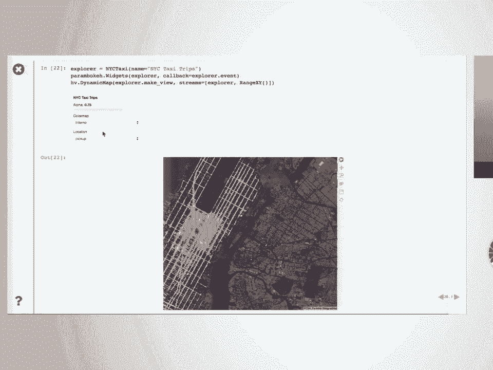

现在，让我们开始介绍部分。为了本教程，你应该从我们为 SciPy 准备的特定索引页开始。启动软件后，你会看到类似这样的页面。

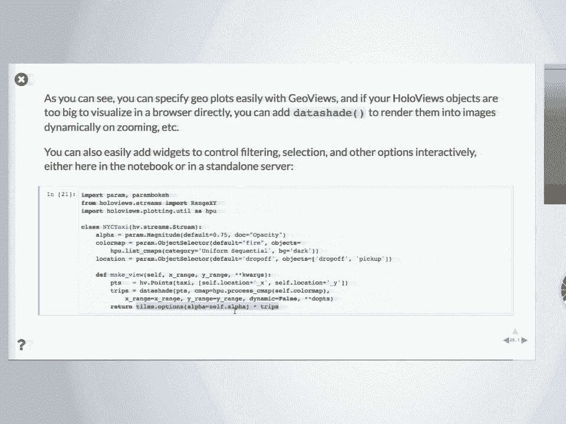

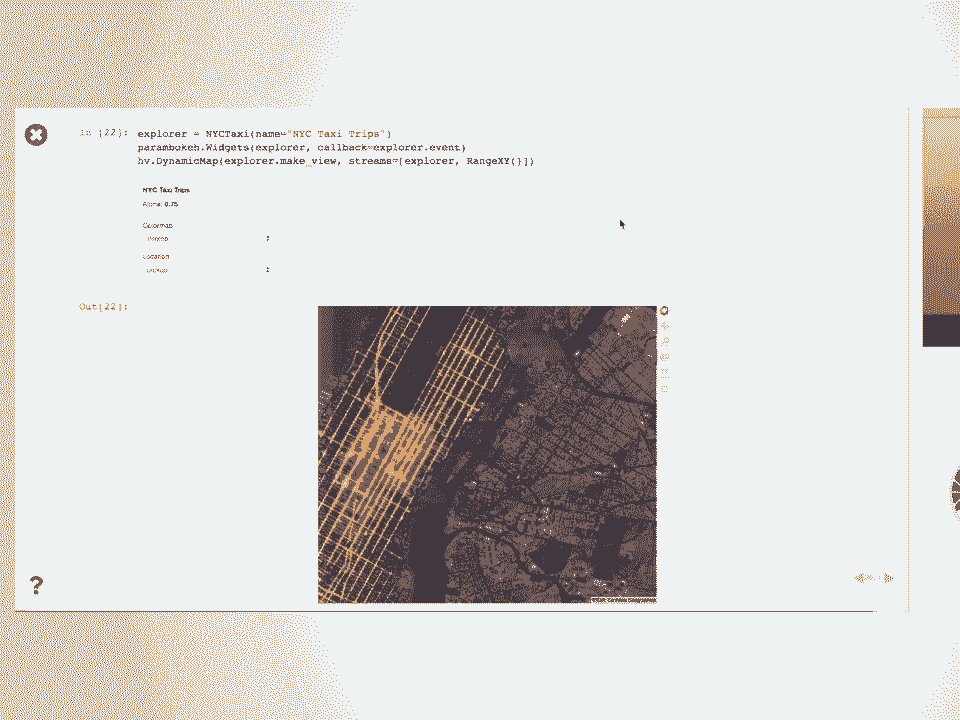

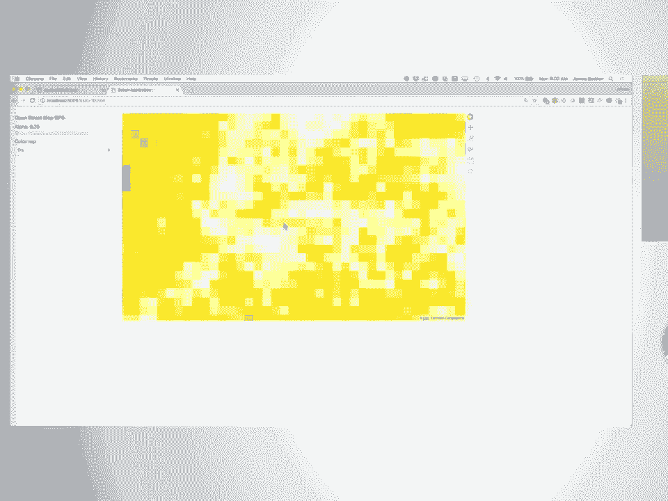

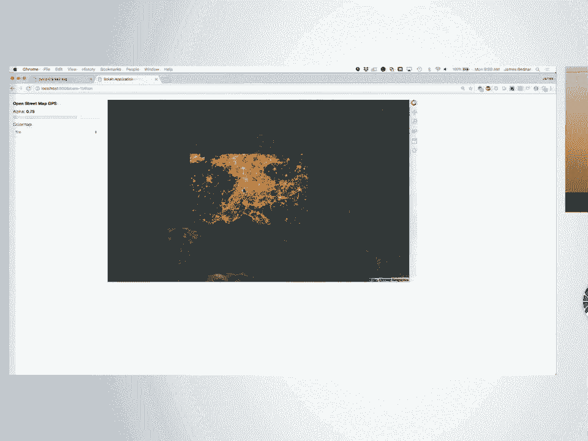

如果你在运行 Jupyter Notebook 后看到类似页面，并且贴上了绿色便利贴，那么说明一切正常。在 Windows 上，如果默认浏览器不是合适的浏览器，你可能需要从启动 Jupyter Notebook 的命令行中复制 URL，然后粘贴到你实际使用的浏览器中。

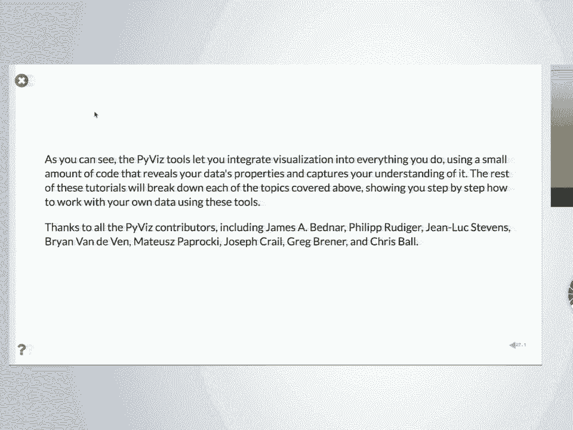

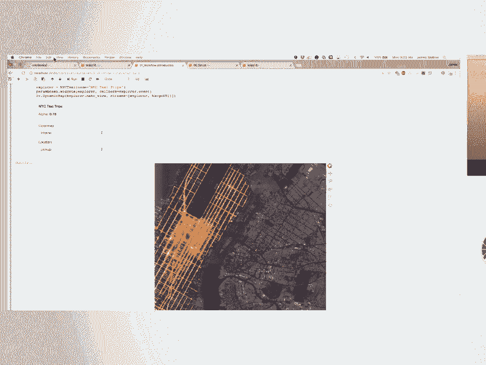

**不建议在 Internet Explorer 上运行任何内容**。建议使用 Firefox、Chrome 或 Safari。

你应该会看到一个友好、有用且神秘的页面。点击 “Notebooks”，然后找到一个名为 “SciPy 18” 的特殊索引，这就是我们在本教程中要遵循的内容。在线也可以访问 SciPy 18 页面，但主索引略有不同。

### 背景调查

让我先了解一下大家的背景：
*   有多少人使用 Python？
*   有多少人使用 Pandas？
*   有多少人使用 Pandas 绘图（`pandas.plot`）？
*   有多少人使用 Matplotlib？
*   有多少人使用 Plotly？
*   有多少人使用其他绘图工具？

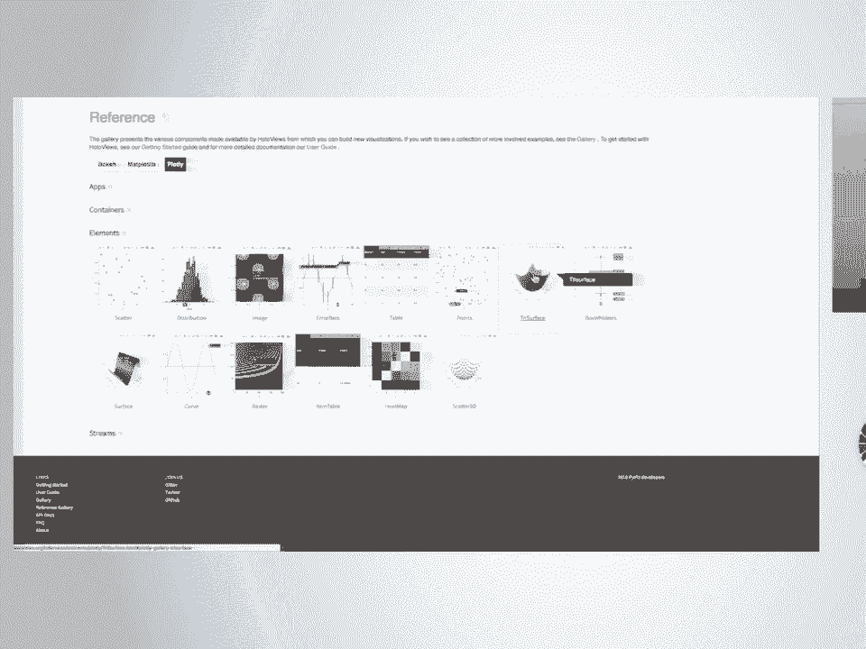

根据回答，只有少数人使用其他工具，这很有趣。

---

## 3. PyViz 概述与动机 🎯

PyViz 的目标是提供一套包，并告诉你如何使用它们。我们先回到时间表，但首先，所有已经成功运行的人应该运行 “tutorial zero set up” 部分，以获得绿色贴纸。如果一切正常，它会告诉你版本号。有人运行后发现版本是 1.9.5，但这个版本无法运行本教程的材料，因为我们展示了一些最近添加的功能。这些设置步骤会确保你安装了所需的数据集。

在本教程的第一部分，我将概述和介绍一些基本概念，展示可能实现的功能。在后面的部分，我们将深入某些主题，展示具体操作方法。在这一部分，如果你没有完全跟上，不用担心。这是一个概述，你会对整个内容有一个完整的了解，然后我们会逐步讲解各个部分。

PyViz 的整个动机是试图让可视化不再是一场噩梦。网上有很多帖子，如果你搜索 “Python visualization nightmare”，你会找到相关帖子。但如果你搜索 “Python visualization”，你会找到很多不满的人。

在我看来，在科学和分析中取得进展，可视化应该很容易，不应该很难，它本身并没有什么固有的难度。我们专注于这样一个理念：你有一些数据，最终你需要做点什么。你可能从一个问题开始，也可能从数据开始。无论如何，我们将专注于探索数据，这是一个高度可视化的过程。然后可能需要对数据进行建模，这时你需要可视化模型的输出。最后，你需要能够与他人分享，这通常也是可视化的。因此，基本上最后三个阶段都高度依赖可视化。

但很多人因为可视化困难、繁琐而推迟它。在 Anaconda，我们与企业和政府客户合作，他们带着问题来找我们，希望用 Python 解决。通常他们设想了一个解决方案，但因为我们作为可视化专家，每次与他们合作时，答案往往是可视化。他们可能认为有机器学习问题，但实际上没有，因为我们可以展示决策边界就在那里，一目了然。或者，bug 就在那里，你不需要做任何复杂的事情。

显然，如果你带着不同的背景，试图让问题适应你的背景，也会有类似的情况。但无论如何，这是我们的背景。因此，我们努力让所有操作都超级容易可视化。目前对我们来说是这样，对你们也可以是这样。

但现状是，有很多工具，几乎所有工具都是为了弥补 Matplotlib 的某些不足而设计的。Matplotlib 做了它该做的事，并且已经做了很长时间。Matplotlib 是我使用 Python 的原因。早在 2002 年，我们试图决定使用哪种语言，当时没有好的绘图库。突然出现了 Matplotlib，我们决定使用 Python，而不是 Scheme。Matplotlib 的存在对于 Python 被认真视为数据分析平台至关重要。

但它做了它该做的事，有很多其他方法来做它不做的事情，比如深度交互性或 3D 可视化。有些工具基于 JavaScript 库，要么是用 JavaScript 自己构建的，要么是基于 Python 之外的现有 JavaScript 库构建的。当然，还有一些工具构建在 Matplotlib 之上，以添加新功能并使其更易于使用。

但如果你是一个用户，你看着这一切，只会想：“我不知道该做什么。我要用 Matplotlib，因为网上都这么说。” 你可以找到 Matplotlib 可能遇到的每一个问题，因为有人已经遇到过。所以，世界可以挣扎和痛苦，但这没关系。但我们不希望这样，我们希望它变得容易、有趣和美好。所以我们正在努力改变这一点。

我们做的是识别出这里的包的一个子集，并说我们无法做所有事情。首先，我们不擅长 3D，几乎不做 3D，这排除了很多东西。我们还希望能在网络浏览器中良好工作的工具，因此它们具有高度交互性，但 Python 不是二等公民。很多围绕现有 JavaScript 库构建的工具看起来很棒，但不够深入，因为 JavaScript 开发发生在那边，你只有一些部分的粗略暴露到 Python 中，不够全面和深入。如果你在 Python 中工作，你就是二等公民，不是该库的真正用户。

因此，我们专注于那些不是这样的工具。特别是 Bokeh，它是从头开始用 JavaScript 编写的，但 JavaScript 是为 Python 服务的，而不是 JavaScript 被包装起来。我们识别出这个子集，并说我们将尝试让 Matplotlib 易于使用。通常，“易于使用” 和 “Matplotlib” 这两个词永远不会出现在同一个句子里，但我们将提供这一点。我们试图让地理数据和非地理数据之间的差异不大。地理绘图社区几十年来一直在使用相同的工具，这些遗留工具用许多不同的语言拼凑在一起，形成了一个处理地理数据的处理框架，很难让它们全部协同工作。但这很重要，因为数据通常位于现实世界中，你想展示这一点，所以我们希望让它变得容易。

DataShader 允许你处理这样一个事实：如果它是 JavaScript，它在你的浏览器中运行；如果在浏览器中运行，内存非常有限，因此无法处理非常大的数据集。DataShader 解决了这个问题，因为我们希望一切都在浏览器中，因为我们专注于沟通的最后一步。我们希望确保一旦你看到可视化，就可以立即分享，没有任何问题。

这就是我们的目标。我们得到了 Anaconda 的支持，但主要来自与我们签订合同的外部公司和政府机构的支持。大部分预算，我猜每年大约一百万美元，来自一系列不同的资助者。这些人说：“这几乎解决了我们的问题，但我需要这个。” 好吧，那是免费的，你为此付费，然后你对每个人都说同样的话。因此，我们有一系列不同的机构和公司付费让我们为他们整合这些工具。这也解释了一些空白，比如 3D。没有人愿意为我们支付 3D 的费用，我们不需要 3D，所以没有 3D。就这么简单。没有根本原因我们不能有它，只是历史上处理 3D 和非 3D 的是不同的工具集。

---

## 4. 从 Pandas 开始 📊

大多数人都说他们尝试过 Pandas，所以让我们假设你从那里开始。假设你读取了一个 Pandas DataFrame，这个例子包含疾病事件的数据，即每十万人中患各种疾病的人数。如你所见，这是一个表格数据集，数据按列排列，不是一个非常整洁的数据集。它有 1928 年第一周、第二周等，结构有点奇怪，但都是按列排列的，所以我们可以处理它。

立即按照 Pandas 的建议，做 `dataframe.plot()`，绘图应该很容易。让我们看看当你使用简单的东西时会发生什么。你得到这个图，这个图表明数据是从过去的某个范围收集到现在的，并且按文件中的顺序排列。所以这不是一个非常有用的图，你无法用它做任何事情。因此，我们实际上必须使用一些思考，不幸的是，我们不能只是有一个神奇的绘图器。这又回到了这些数据的组织方式。如果数据以支持绘图的方式组织，而这里不是，你可以神奇地绘制它。所以让我们重新组织它。

如果你足够了解 Pandas（为了本教程的这一部分，我假设你了解），例如，按年份分组。你可以看到它有年份和周，基本上是一年中不同周的观察结果。让我们每年汇总这些，不做奇怪的事情。然后绘制所有州麻疹的总体发病率。这个数据是按美国州划分的，让我们忽略州信息，只得到一个单一的图。如果我们按年份分组，你可以看到那是什么。按年份基本上是年份和麻疹发病率，这很有意义。这是设计用于绘图的简洁直接的数据，你可以立即得到一个图。

如果你关心底层数据，这个特定的图显示麻疹是很多人都会得的疾病，直到大约这里。如果你去维基百科，你会发现 1963 年有了麻疹疫苗。那个疫苗似乎起了作用。很好，数据与现实世界相关。

然而，如果你看这个，你得到了什么？你拖动这个，这是一个图像。实际上，你可以保存这个图像，这是一个 PNG。这就是你从 `matplotlib inline` 中得到的东西，它将你的 Matplotlib 图转换为 PNG，允许 Jupyter Notebook 使用其丰富的显示功能立即显示图像。你除了查看或保存到磁盘外，无法对该图像做任何其他操作。

首先，我们说这很容易。我们能否设置我们的工具，使其变得容易，但现在你实际上可以对它做一些事情？这是 PyViz 工具的第一个演示。这是一个新项目，实际上相当新。我还没有完全适应它，因为它基本上是一个名为 `hvplot` 的项目，新近发布。它是 Pandas 绘图 API 的一个实现，但基于 PyViz 工具实现。所以对于这个简单的情况，你可以做完全相同的事情，但对于相当复杂的情况，它也是相当完整的 Pandas 绘图 API 实现。

如果你已经知道那个 API，只需在绘图前输入 `import hvplot.pandas`，然后当你做 `.plot` 时，改为 `.hvplot`。如果你这样做，你会得到一个看起来相同的图，但区别在于，因为这是由 Bokeh 生成的图，它是一个交互式图，这意味着你可以悬停、缩放、查看数据的特定区域等。所以现在，对于相同的 API 成本，你之前得到一个图像，现在你得到一些可以用来探索数据的东西。

这里的优势是，如果你只得到一个图像，如果图像不对，你必须返回编辑你的代码。如果你只关心右下角的区域，想放大看看疫苗引入后发生了什么，你不必返回代码并尝试思考，将你看到的数字与代码联系起来。你总是可以这样做，但这很痛苦。你试图真正探索，希望尽可能减少数据和大脑之间的障碍。你希望能够在不编写代码的情况下进行探索。能够编写代码很好，能够自定义它很好，但每次都必须编写代码通常比其他方式慢得多。

所以这是你得到的第一件事。正如你可能从这个 `.pandas` 猜到的，Pandas 不是 `hvplot` 支持的唯一东西。你也可以导入 `hvplot.xarray`，它将能够使用相同的接口绘制 xarray 中的任何内容。`hvplot.streamz` 将处理来自 streams 库的流数据。还有三四个其他包受支持。所以 `hvplot` 旨在为任何数据包提供丰富的类 Pandas 绘图接口。我认为目前支持六个数据包。

对于本讲座的这一部分，我将专注于 `hvplot`。所以，如果你从讲座中什么也没带走，如果你必须去洗手间然后离开一整天，你至少会看到 `hvplot.pandas`，并且知道只需输入几个字符，你就可以开始在浏览器中交互，做以前无法做的事情。所以你有一些可以带走的东西。

但这远非我们想要达到的目标。让我们在下一节向你展示。但至少这是一种我们设计绘图的方式，不是死胡同。这个图在这里，这个特定的……让我们打印这个。这不是图像或任何形式的图。这是一个声明性对象，当 Jupyter 尝试显示它时，有一种将其显示为图的方式，但这实际上是你的数据。这有点奇怪。

`hvplot` 返回的不是图像，它是一个围绕你的数据的薄包装，声明了关于数据的某些事情，即它应该被绘制为一条曲线，x 轴为年份，y 轴为麻疹。这是一种声明性的方式，表示你的 Pandas DataFrame 中有数据，现在它是可可视化的数据，但它仍然是你的数据。

为什么这很重要？我只想要看到我的图片。给你图片。但关键是，既然这个对象不仅仅是图像，它拥有你的数据，你可以用它做很多事情，不仅仅是缩放和点击。你可以布局、叠加、切片、采样、调整选项直到你喜欢，突出某些东西，减去某些东西等等。我们将向你展示一系列这样的操作。

例如，假设你注意到那天看数据时是 1963 年，你在维基百科上查了一下，不想忘记。因为我有孩子，我的大脑不再工作了，我可以有一次经历，然后第二天有同样的经历。我会看那里是疫苗引入的时间，我可以一直这样做。但有了 HoloViews，因为你保留了数据，你实际上可以构建捕捉你理解的东西并保存它们，最终进行沟通。但首先，它们就在你工作的笔记本中捕捉了你的理解。

在这种情况下，我们刚才看到的不是图像，不是图，它是一个你可以对其做一些事情的对象。这是你可以用它做的事情之一，就是在它上面叠加一条垂直线。在这种情况下，是 1963 年的一条垂直线，那是疫苗引入的时间。我们可以在上面叠加一些文本来说明那是疫苗引入的时间。然后这些小星号表示叠加，意思是把这个和这个和这个叠加起来。结果仍然不是一个图，它仍然只是一个对象。在这种情况下，它是一个具有一些层次结构的声明性对象，我们会回到这一点，但它仍然显示一些东西，它显示的是带有叠加信息的图，这些信息使其有意义。

顺便说一下，我喜欢看到的所有绿色贴纸，这非常令人放心，所以我不必永远在这里讲话。

这里使用的是 Pandas 的绘图 API，所以我们得到了这个对象。但你怎么得到那个对象并不重要。如果它是一个 HoloViews 对象，你可以以其他方式与其他 HoloViews 对象组合。在这种情况下，我们显式地创建 HoloViews 对象。导入 `holoviews as hv`，`hv.VLine` 可以是一条线，我们可以制作一个 `hv.HLine`，等等。你会有任意多的对象，其他数据集，无论你想展示什么。

特别是，这个想法是它捕捉了你的理解。下一张幻灯片试图更雄心勃勃，就是说，好吧，我要按摩这些数据并稍微处理一下。让我们取我们的 DataFrame，按年份和州分组，再次绘制麻疹。基本上，不是跨州聚合并折叠所有州信息，而是保留州信息，因为我们想看看每个州有何不同。

如果我们这样做，如果你做 `.plot`，我不知道会发生什么。它仍然没用。但 `hvplot` 对此做了什么？相反，如果你要求 `hvplot` 绘制年份，你可以告诉它按州分组。一旦你按州分组，你还没有指示州应该发生什么。州不在 x 轴上，不在 y 轴上，没有折叠，什么都没发生。那么这个州维度去哪里？HoloViews 如果你有一个维度，它是一个独立维度，而你没有告诉它用它做什么，它会给出一个小部件，因为用户必须告诉它。基本上，HoloViews 是声明性的，它说明了关于数据集的许多事情。其中一件事是，在绘图之前，它必须知道州。你看到 Pandas 做了什么：它把所有州塞在一起，说好吧，你想要州，州都在一个图里。HoloViews 做的是说，你想要州，哪个州？你知道你可以用州信息做其他事情，默认情况下，如果你没有告诉它用它做什么，你会在右边得到一个小部件，告诉用户你想用它做什么。在这种情况下，你只需选择你想要的任何州，然后它仍然是交互式图，你总是可以拥有。

当你探索数据集时，这非常有用。这个想法是让你很快明白，哦，对了，我没有告诉它用州做什么。或者也许你想要这个小部件。无论哪种方式，都很好。要么它在那里，你知道哦，我想我最好选一个州，也许我想立即跨州折叠，你可以看到你需要这样做。

所以，如果你想，就像我说的，它是可索引、可采样、可切片的。在这种情况下，让我们只提取德克萨斯州并与纽约州比较。`+` 操作符将东西并排放置。当东西并排放置并且具有相同的维度时，它会将它们一起归一化。所以你会看到纽约没有一直延伸到顶部，因为它是相同的维度。它又是声明性的，所以它知道在这个图中，这是麻疹轴，在另一个图中，它也是麻疹轴，因此如果一起显示它们，最好匹配起来，是的，相同的比例，比如 800 和 800，很好。

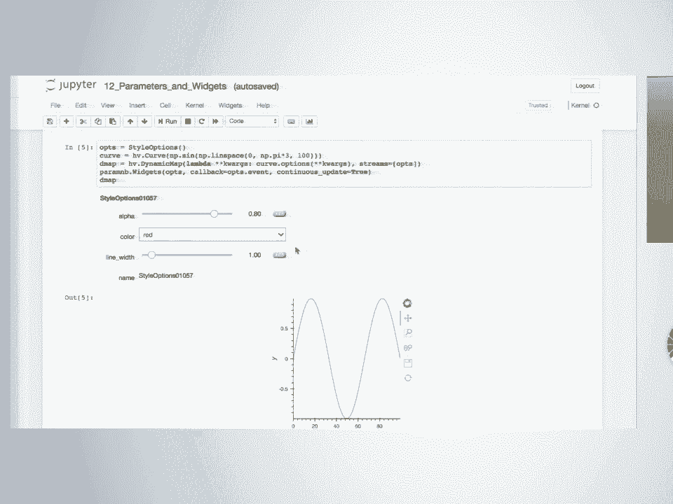

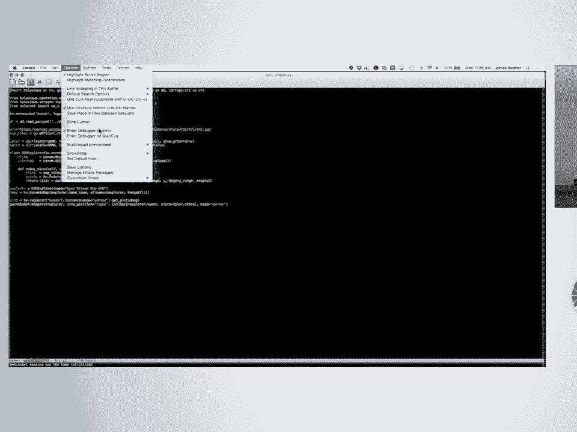

它们在这个例子中是链接的。所以如果我选择……我不知道怎么拼写康涅狄格，罗德岛……它被重新标记为纽约，但你会看到现在比例不同了，所以它都调整到最大值，但它们被归一化到具有相同的范围。这就是我说的，因为它们都是麻疹，如果一个是麻疹，另一个是百日咳，它们不会一起归一化。但因为它们是相同的轴，你可以让它们不一起归一化，但默认情况下，如果你把它们放在同一个图里，HoloViews 假设你打算比较它们。

布局是我们投入大量资金但尚未做任何事情的领域之一。我们将……我们还没有用完钱。但在这种情况下，我们可以这样做。基本上，东西从左到右布局，直到达到一定的列数，你可以告诉它列数，是否想要一列。我们没有的是分层子设置。你可以把三个垂直的东西放在三个垂直的东西旁边。我们展示过，但我们从未对 API 满意，我们无法让每个人都同意。但我们被付费来达成一致，所以我们将就此达成一致。无论如何，`+` 表示并排，而不是重叠。它不表示它们在页面上的确切位置，那将是另一种提示。所以可能有另一个系统控制最终位置的提示。它的意思是它们还没有叠加，它们在同一个图中，这些信息足以知道如何缩放轴。这就是我即将谈论的所有内容的设计。HoloViews 的设计是：我们能得到我们需要的信息吗？我不需要做更多，我知道我要做。所以它旨在利用已声明的信息，不做任何假设，不做任何无根据的假设。但每当声明了某种方式，就有很多含义