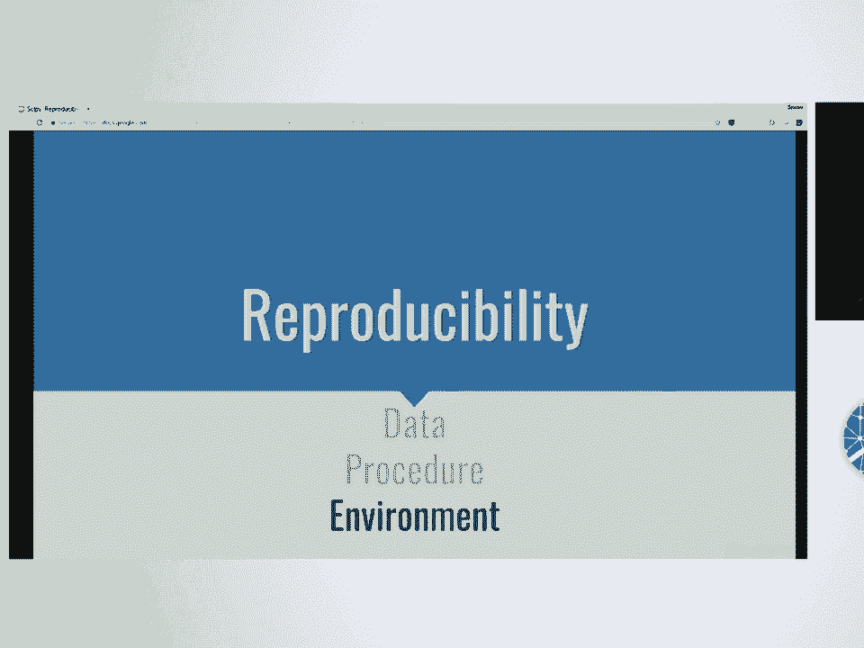
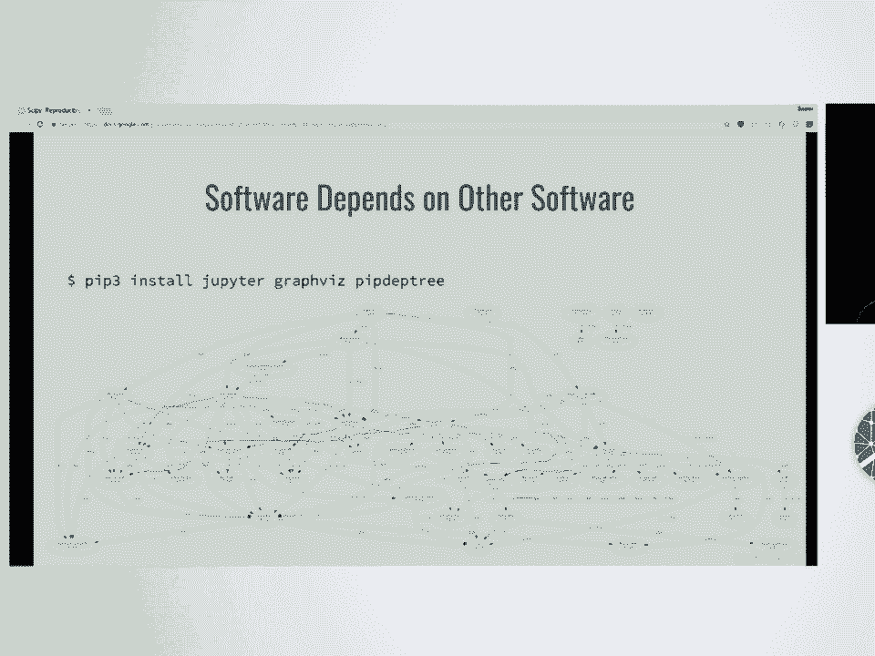
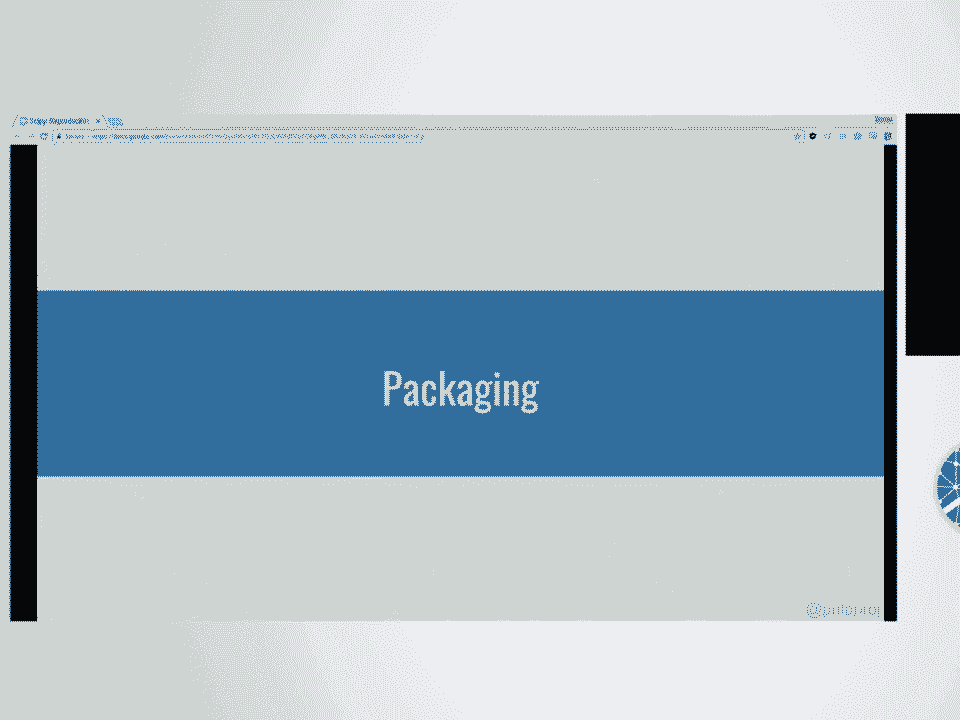
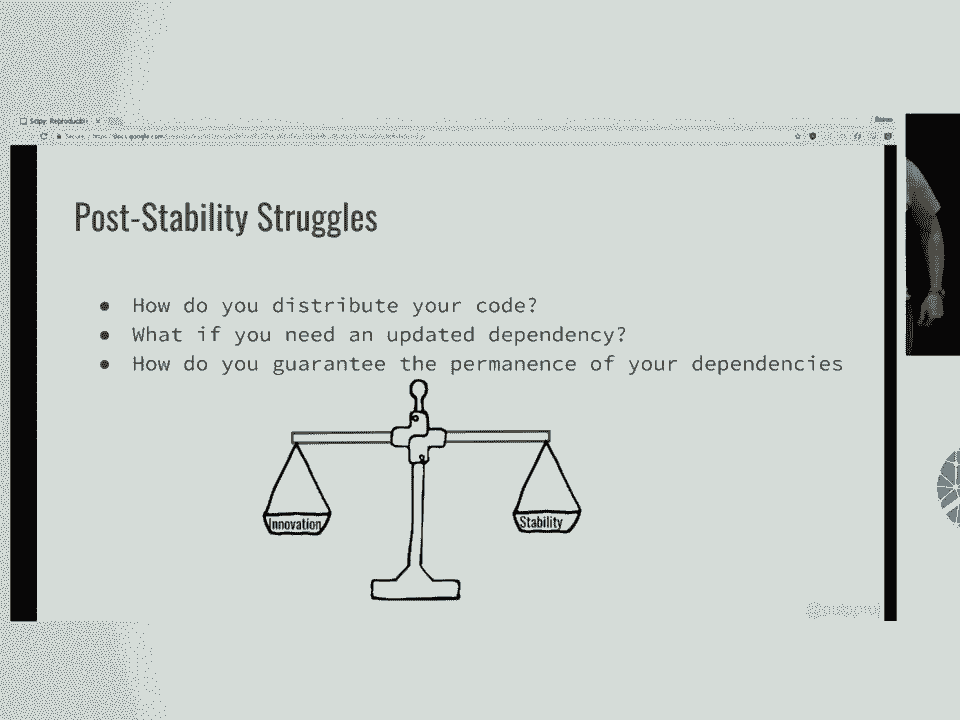
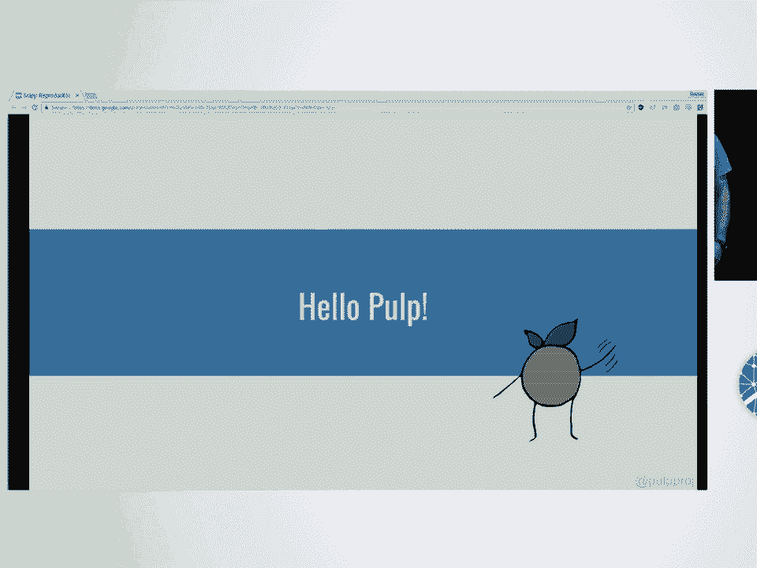
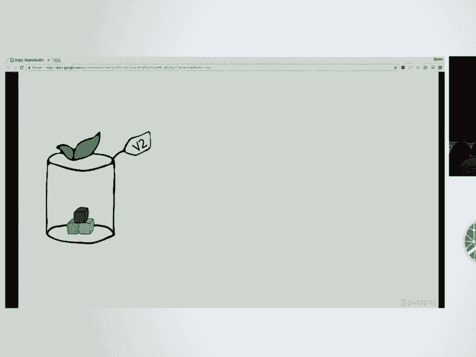

# 62：使用 Pulp 创建可复现的环境 🧪

在本节课中，我们将学习如何创建和维护可复现的科研计算环境。我们将探讨传统方法面临的挑战，并介绍一个名为 **Pulp** 的强大工具，它可以帮助我们更好地管理软件包和依赖，从而确保科学研究的可复现性。

---



## 什么是科学研究的可复现性？ 🔬

科学研究的可复现性是指，其他研究人员能够使用原始研究者提供的材料，重现其研究结果。这非常重要，因为它确保了研究的透明度，并让我们对研究过程的每个细节都充满信心。

可复现性涉及多个方面，例如**数据**、**实验步骤**和**计算环境**。在本课程中，我们将重点讨论如何创建可复现的**计算环境**。




---



## 环境不一致会导致什么问题？ ⚠️

如果没有可复现的环境，即使运行相同的代码，也可能得到不同的结果。这个问题不仅存在于科研领域，在软件工程中也同样常见。

导致结果不一致的原因可能有很多：
*   他们使用了不同版本的依赖包。
*   她使用 Python 3.5，而他使用 Python 3.4，但彼此没有沟通。
*   他们拥有不同的系统配置。

每个系统都存在许多细微的差异。这个问题的难点在于，软件依赖于其他软件。下图展示了 Jupyter 的依赖关系图，其复杂性可见一斑。


那么，当你的代码拥有如此复杂的依赖关系时，该如何打包？在依赖包更新后，又该如何维护你的软件包？

---

## 软件打包的两种基本方法 📦

正如前面提到的，打包是一个固有的难题，因为要解决的是混乱的问题。每个软件生态系统处理方式略有不同，但我们可以从高层次上将其简化为两种基本方法。


### 方法一：单体式打包

在这种模式下，你将软件及其所有依赖项捆绑在一起，作为一个单一的包发布。这在 Windows 和 macOS 中很常见。

**优点：**
*   用户只需安装一个东西，非常方便。
*   易于复现，因为你已经拥有了所有依赖的确切版本。

**缺点：**
*   包体积巨大，包含了许多你可能不关心的内容。
*   作为打包者，每当一个依赖项更新，你都必须重新打包整个软件，这非常耗时。
*   庞大的代码量使得评审者难以审查你的核心代码。

**总结：** 单体式打包有利于可复现性，但迭代速度慢。

### 方法二：模块化打包

这种方法不捆绑依赖项，只打包软件本身，依赖项通过包管理器（如 pip）在安装时解决。这是 Python 和 Linux 等开源世界的常见做法。

**优点：**
*   无需为依赖更新而重建软件包，维护更简单。
*   代码量少，便于评审者审查。

**缺点：**
*   安装时包管理器需要做更多工作，复杂性可能导致问题。
*   更新依赖项可能引入不稳定性，破坏可复现性。
*   依赖项之间可能发生冲突。

---



## Python 生态系统中的工具 🐍



上一节我们介绍了两种打包哲学，本节我们来看看 Python 生态系统提供了哪些具体的工具和技术来创建可复现的环境。

Python 包是模块化的，它们存储在一个名为 **PyPI** 的中央仓库中。PyPI 上的包由社区贡献，质量参差不齐，且不保证彼此兼容。Python 的包管理器是 **pip**，它负责在安装时解析依赖。默认情况下，pip 从 PyPI 安装包。

任何关于 Python 环境的讨论都离不开 **虚拟环境**。虚拟环境是隔离的环境，可以分隔已安装的包和依赖，从而防止许多依赖冲突。

---

## 如何在 Python 中实现可复现性？ 🔒

软件只有一种正确运行的方式，却有无数种出错的方式。随着时间的推移，这自然会导致代码“腐化”，我们称之为 **代码熵**。

我们推荐的方法是：
1.  **开发阶段**：追求**创新**而非稳定。尽可能频繁地更新你的包，这样在发布时就能尽可能领先于代码熵。
2.  **研究/发布阶段**：追求**稳定**和可复现。你需要锁定所有包的版本。

在 Python 中，典型的做法是使用 `requirements.txt` 文件，或者使用更现代的 `Pipfile.lock`（配合 pipenv）。我们建议阅读 Python 打包指南，其中有很多有用的信息。

然而，即使锁定了依赖，我们仍然面临一些问题：
*   如何分发你的代码和依赖？
*   如果某个依赖发布了必须包含的安全补丁，你是否需要从头开始重建一切？（答案是：是的）
*   如何保证你依赖的包明天不会消失？

那么，有没有可能同时平衡**创新**和**稳定**呢？答案是肯定的。

---

## 介绍 Pulp：一个仓库管理器 🚀

我和 Austin 在 Red Hat 的 Pulp 团队工作。我们希望 Pulp 这个工具能帮助你解决上述问题。


Pulp 是一个开源、免费的**仓库管理器**。它可以管理多种类型的软件内容，例如：
*   Python 包
*   通用文件（如配置文件）
*   容器镜像
*   Ansible 角色

Pulp 提供了一个统一的 API 来管理所有这些内容。由于其插件化架构，你可以为任何需要管理的自定义内容编写插件。


Pulp 将内容组织到**仓库**中。每次在仓库中添加、删除或更改内容时，都会创建一个新的**仓库版本**。这些版本是不可变的，可以随时回滚。此外，每个插件都可以为仓库中的内容生成**元数据**，以方便客户端发现和安装。

带有元数据的仓库被称为**发布**，客户端（如 pip）可以直接从 Pulp 发布进行安装。例如：
```bash
pip install --index-url http://your-pulp-server/pulp/content/your-repo/ your-package
```

**关键点在于**：使用 Pulp，代码作者可以灵活地在创新和稳定之间选择自己的平衡点，从而获得两全其美的效果。

---

## Pulp 的核心工作流：管理策展仓库 🗂️

Pulp 为研究人员提供的一个核心概念是**由你管理的、经过策展的仓库**。

回忆一下，之前我们通过锁定 `requirements.txt` 来获得稳定性，但这牺牲了灵活性。在 Pulp 中，你无需锁定需求文件。相反，你通过**策展仓库**来控制依赖。这意味着，作为代码作者，即使在代码发布后，你仍然可以控制所有依赖项。这对于必须包含的安全补丁等情况极其有用。

一旦你在一个已知良好的依赖集合中策展了你的软件包，你就可以在不更改代码的情况下更新依赖。这就是核心理念。

在软件工程中，我们通常有一个漫长的流程来确保代码正确发布。这被称为**生命周期管理**。基本思想是：你获取一个已知良好的集合，发布它，进行测试，只有在测试通过后才将其**提升**到生产环境。这非常强大，因为它允许你同时拥有生产和测试仓库，而无需因为评审而停止工作。

如果出现问题，你可以立即**回滚**到之前可用的版本，在测试仓库中修复问题，然后再次提升。

---

## Pulp 的其他用例 💡

除了管理 Python 环境，Pulp 还有其他用途：

**创建本地镜像**：例如，你可以将整个 PyPI 镜像到本地，以节省带宽（尤其是在偏远的研究站），或者根据安全策略只允许使用经过白名单验证的包。

**分发自有软件**：如果你不想或不能将包上传到 PyPI，Pulp 是内部以 pip 可消费的方式共享包的绝佳途径。

---

## 超越 Python：系统级可复现性 🖥️

现在我们已经讨论了如何复现 Python 环境，让我们谈谈对完全可复现性至关重要的其他方面。因为 Python 环境只是开始，它建立在系统环境之上。

许多 Python 包依赖于系统代码（如 GlibC 或 OpenSSL）的绑定。因此，系统依赖和配置也会影响程序行为。

**虚拟机**：这是终极的单体式包，是系统在某个时间点的快照。虽然它保证了环境的完全一致，但也存在缺点：体积庞大、不透明（难以审查具体更改）、并且由于后台进程（如自动更新器）可能随时间推移而导致环境漂移。

幸运的是，有其他工具可以帮助我们：

**Ansible**：你可以用 Ansible 自动化一切——安装系统依赖、配置系统、安装软件包和 Python 依赖。Ansible 脚本是透明的，评审者可以清楚地看到你的操作。而 Pulp 可以用来管理你的 Ansible 内容仓库，控制其稳定性和灵活性。

**容器化**：容器是**不可变的系统镜像**，但与虚拟机不同，它们更小，并且通常只运行单个进程，减少了环境变量带来的干扰。Dockerfile 是创建 Docker 镜像的透明方式。同样，Pulp 可以用来管理你的 Docker 镜像仓库，实现从测试到生产的工作流。

---

## 总结 📝

在本节课中，我们一起学习了如何创建可复现的科研环境。我们探讨了传统打包方法（单体式 vs 模块化）的优缺点，以及 Python 生态系统中的工具（如虚拟环境和 `requirements.txt`）。

我们重点介绍了一个强大的工具——**Pulp** 仓库管理器。Pulp 的核心价值在于，它允许你通过**策展仓库**和**生命周期管理**，在**创新**和**稳定**之间取得最佳平衡。你可以在不更改代码的情况下更新依赖，可以轻松地回滚和提升版本，并且能管理包括 Python 包、容器镜像和 Ansible 角色在内的多种内容。

通过结合 Pulp、Ansible 和容器化技术，你可以构建一个从系统层到应用层都完全透明、可控且可复现的完整工作流，从而让你的科学研究更加可靠和可信。




Pulp 是一个成熟的开源项目，拥有活跃的社区和开发团队。如果你面临环境可复现性的挑战，Pulp 可能正是你需要的解决方案。