# 63：使用航空与卫星影像进行可扩展的特征提取 🛰️

在本课程中，我们将学习 Mapbox 公司如何构建一个可扩展的深度学习流水线，用于从航空和卫星影像中大规模地检测物体（如转向车道标记）和进行语义分割（如停车场）。我们将了解从数据准备、模型构建、后处理到最终部署的完整流程。

## 概述

Mapbox 是一个面向移动和网络服务的位置数据平台。它为开发者提供构建地图搜索和导航产品的基础模块。计算机视觉是深度学习领域中发展最迅速的方向之一，它驱动着人脸识别、增强现实和自动驾驶汽车等应用。本次课程将重点介绍计算机视觉如何赋能我们的地图搜索和导航产品，特别是我们如何构建深度学习流水线和工具，以大规模地对航空和卫星影像进行物体检测和语义分割。

## 数据准备与标注

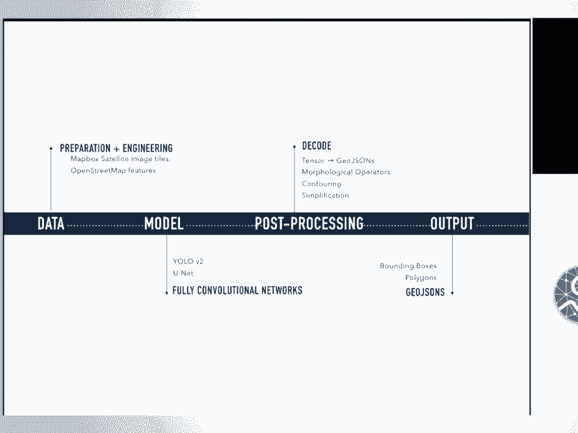

上一节我们介绍了课程的整体目标，本节中我们来看看数据处理的第一步：数据准备与标注。对于任何机器学习项目，第一步都是收集、清理和预处理数据，其结果是生成训练数据集。

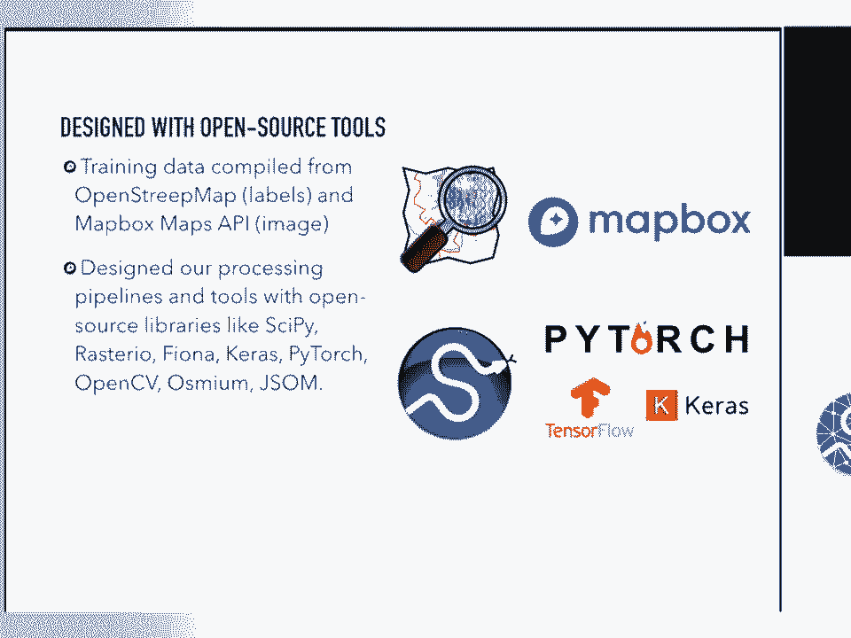

### 物体检测数据准备

对于物体检测任务，训练数据通过结合影像和标签（以边界框格式）来准备。物体检测涉及对图像中数量不定的物体进行分类和定位。

以转向车道标记检测项目为例，我们需要区分“仅左转”和“仅右转”等不同类型的车道标记。我们不仅要对它们进行分类，还要定位它们在图像中的位置。

以下是创建数据集的步骤：
*   我们使用 Overpass Turbo、JOSM 等工具为每个转向车道标记绘制边界框。
*   我们标注了超过 54,000 个转向车道标记。
*   数据集包含了各种形状和大小的车道标记，甚至包括部分被阴影或车辆遮挡的标记。
*   我们排除了在航拍影像中完全被擦除、不可见或被车辆完全覆盖的车道标记。

在寻找这些标记之前，我们会查询 OpenStreetMap 以了解它们的位置、获取方式以及最常见的类别。

### 语义分割数据准备

对于语义分割任务，我们以停车场分割项目为例。分割与物体检测略有不同，它试图在像素级别理解图像中的物体。

其工作原理是使用已标注的像素来学习识别与特定类别相关的局部特征，然后根据每个像素属于哪个类别的概率最高来对其进行分类。

为了创建停车场分割的训练集，我们将影像与覆盖在停车场上的掩膜相结合。

以下是创建数据集的步骤：
*   我们使用 Osmium 工具标注了超过 56,000 张图像用于停车场分割。
*   我们确保了包含航拍和卫星影像中不可见的停车场，例如车库、车棚。
*   创建标签时，我们查询 OpenStreetMap，寻找标记为“停车”的标签；在进行建筑物分割时，则寻找标记为“建筑”的标签。

## 可扩展的数据工程流水线

在准备好标注数据后，我们需要一个可扩展的流水线来处理它们。当我们需要大规模构建系统时，我们建立了一个数据工程流水线来处理所有需要打包、清理和预处理的标签和影像数据。

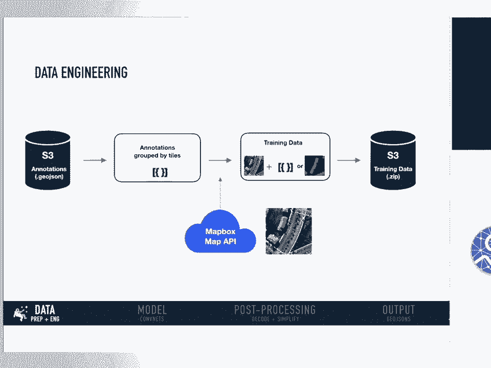

这个数据工程流水线是我们更大的计算机视觉流水线的一部分。它的工作流程如下：
1.  流式读取存储于 Amazon S3 上的、采用世界坐标和 GeoJSON 格式的标签数据。
2.  将这些世界坐标的标签标准化并转换为图像像素坐标。
3.  按照典型的瓦片网络格式（缩放级别及 x, y 坐标）对它们进行分组。
4.  将这些标签与从 Mapbox Satellite 图层获取的影像进行连接。Mapbox Satellite 是一个包含最新且经过色彩校正的全球航拍和卫星影像的底图。

在此步骤中：
*   对于物体检测任务（如转向车道标记），标签是 GeoJSON 对象格式，我们将其作为元数据保存在 GeoJSON 格式中。
*   对于语义分割任务（如停车场分割），标签实际上是掩膜或多边形。我们不是将它们存储为单独的多边形，而是创建一个单通道掩膜覆盖在 RGB 影像之上。

一旦训练数据准备就绪，我们将其上传回 Amazon S3 存储。当模型准备就绪时，可以直接从 S3 位置获取数据。

我们通过以下方式实现扩展：
*   首先编写 Python 库和命令行工具来处理每个步骤。
*   然后在 Amazon Elastic Container Service 上扩展规模，通常一次处理多个城市。

## 模型构建与训练

在准备好训练数据后，下一步是建模。在 Mapbox，我们发现全卷积神经网络在我们的物体检测和分割任务中表现都非常出色。

### 全卷积神经网络的优势

这种网络完全由卷积层构成，不包含通常在神经网络末端出现的全连接层。这种架构有几个优点：
1.  **可变输入图像尺寸**：由于没有全连接层对输入尺寸的限制，网络可以接受任意尺寸的输入图像。
2.  **保留空间信息**：全连接层通常会导致空间信息的丢失。在分割任务中，全连接层会对物体类别和视觉变化施加许多限制。
3.  **计算成本优势**：以著名的 AlexNet 为例，90% 的权重（表征能力）位于卷积层，但只消耗 10% 的计算量。相反，全连接层消耗高达 90% 的计算能力，却只包含 10% 的表征能力。因此，近年来研究人员在计算机视觉领域更多地转向全卷积神经网络。

### 转向车道标记检测模型

对于转向车道标记检测，我们采用了名为 **YOLO V2** 的架构。主要原因是我们发现许多应用需要并依赖物体检测算法的低延迟预测。

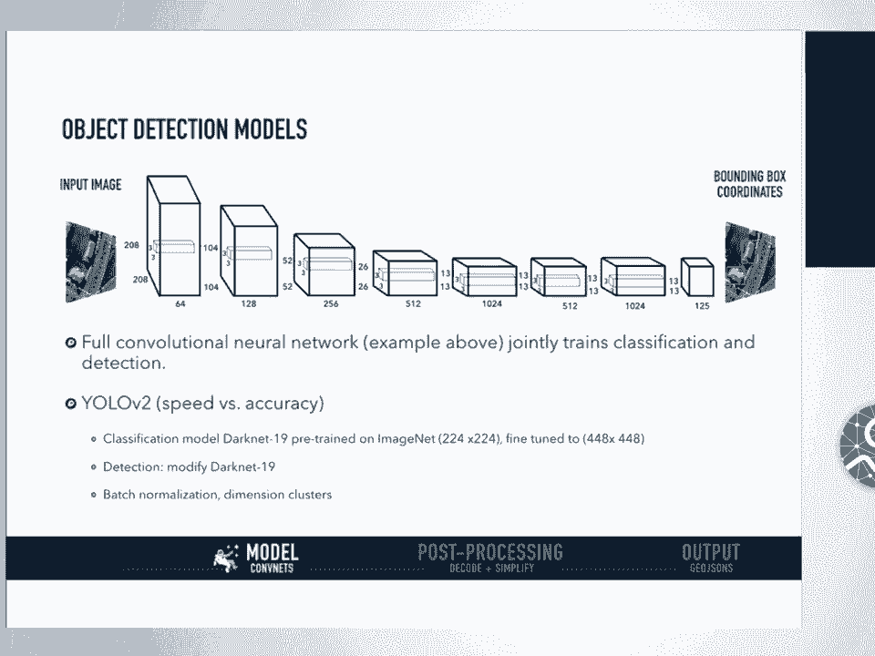

YOLO V2 在速度和准确性之间取得了良好的平衡，在 416x416 的图像上能达到约 60 mAP 和 90 FPS。

YOLO V2 的工作方式：
*   它有一个名为 DarkNet-19 的分类器模型，包含 19 个卷积层，并在 ImageNet 数据集上进行了预训练。
*   对于检测任务，它修改并移除了 DarkNet-19 的最后一个卷积层，添加了几个 3x3 卷积层，然后是 1x1 卷积层，最后输出我们需要的数量（在我们的案例中是 6 类转向车道标记）。

关于 YOLO V2 架构的两个要点：
1.  **批量归一化**：显著帮助我们稳定训练、加速收敛并正则化模型。
2.  **锚框**：我们对真实标签（边界框）进行聚类分析，发现大多数边界框遵循特定的宽高比。我们使用这些聚类结果作为模型的锚框（先验框），而不是让模型直接预测各种形状的边界框。这显著加快了训练速度并稳定了网络。

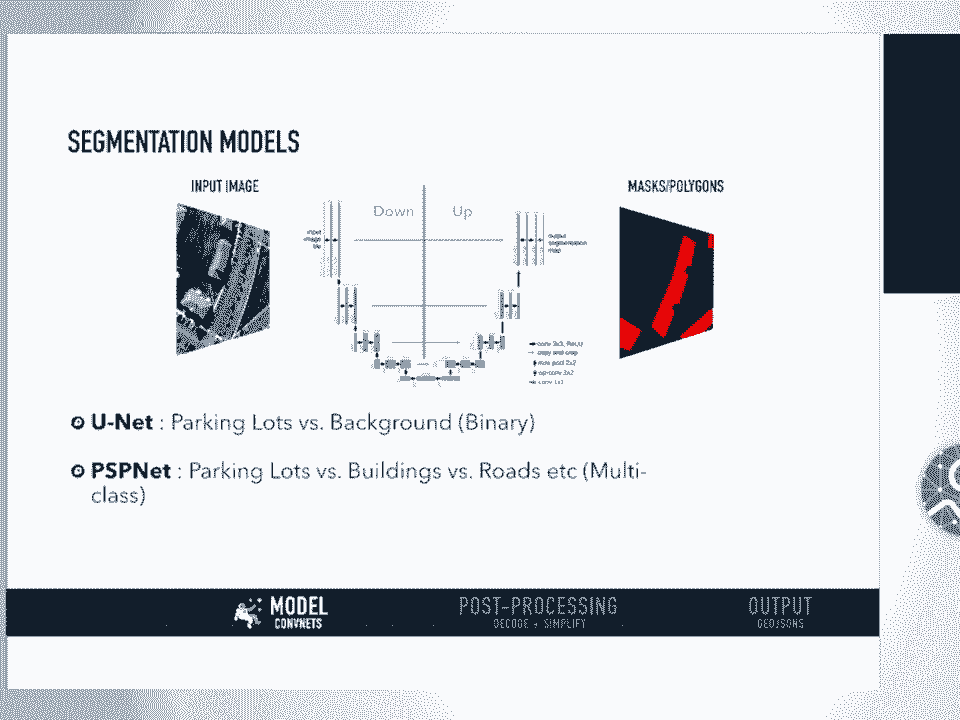

### 停车场分割模型

对于停车场分割，我们实现了一个名为 **U-Net** 的架构。它能够用很少的图像进行端到端的分类、检测和定位。我们发现它比滑动窗口卷积神经网络等先进方法能产生更精确的分割结果。

U-Net 架构由一个用于捕捉上下文的收缩路径和一个能够实现精确定位的对称扩展路径组成。

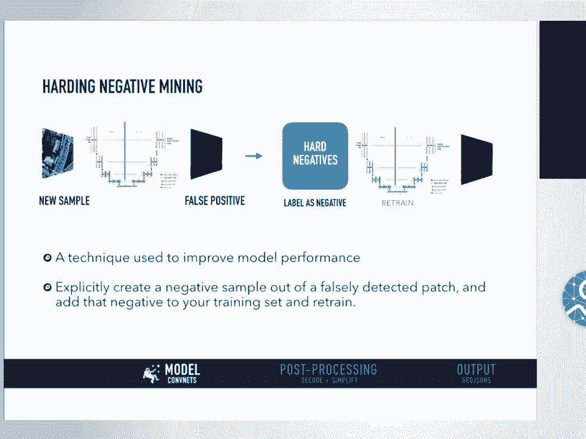

在我们的案例中，我们进行的是二值分割，区分停车场和非停车场（背景）。

我们还尝试了另一种名为 **PSPNet** 的架构，我们发现当场景复杂（需要同时分割道路、建筑、桥梁等多个类别）且数据集视觉多样性很大时，它表现很好。但将其应用于我们的二值分割案例时，显然是杀鸡用牛刀，其效果不如 U-Net。

## 模型优化：难负样本挖掘

在构建好物体检测或分割模型后，我们有一个改进模型的流程，称为**难负样本挖掘**。

在我们的训练集中，我们标注了二值情况下的正例和负例。正例是停车场，负例是非停车场或背景。

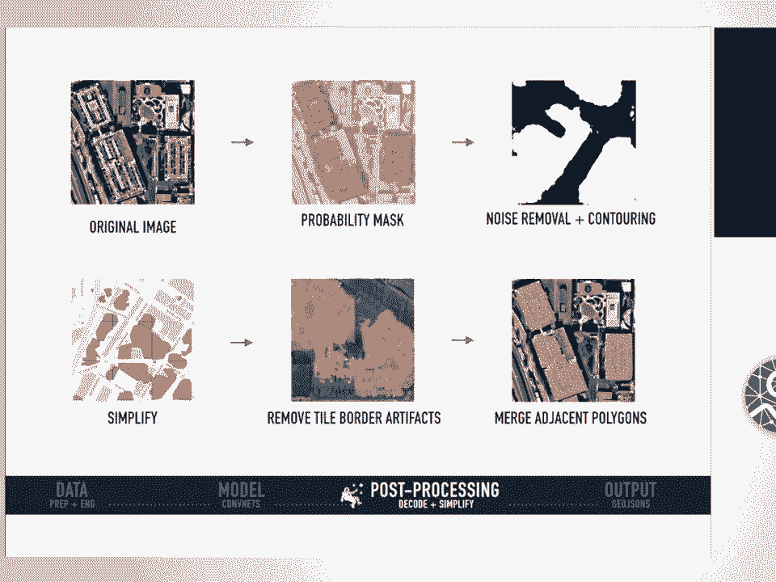

训练完第一轮模型后，模型可能表现不佳，可能会产生许多假正例（将背景像素错误分类为停车场）。

难负样本挖掘是指，我们取一组被错误检测的像素，明确地从中创建一个负样本，然后将这个负样本添加回训练集中。当我们用这些额外的知识重新训练模型时，模型应该能表现得更好，并理解第一轮所犯的错误。

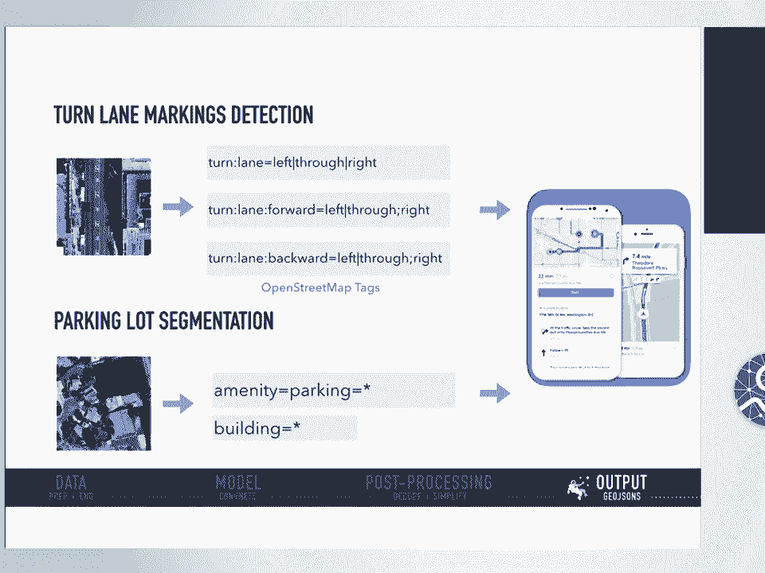

这是一个昂贵的过程，但我们发现它显著改善了我们的分割和物体检测模型。

## 结果可视化与后处理

在模型输出结果后，我们并非直接将其上传到 OpenStreetMap。我们进行一系列后处理步骤。

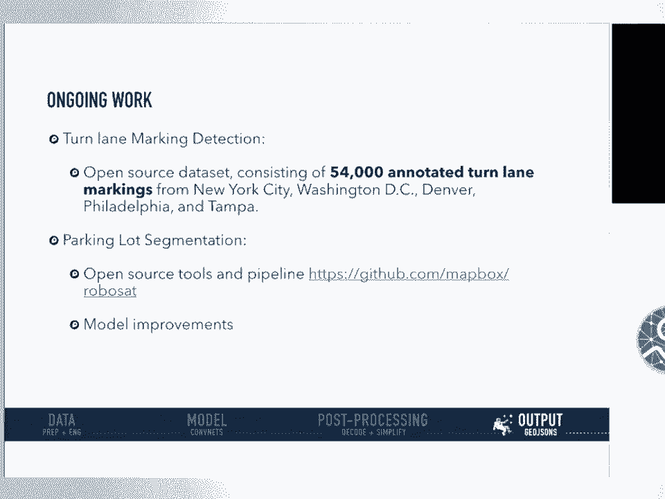

### 后处理步骤

1.  **形态学操作**：我们从原始图像得到概率掩膜后，实施一些形态学操作，如通过膨胀进行噪声去除、通过膨胀进行腐蚀，以及通过先膨胀后腐蚀来填充掩膜内的孔洞。
2.  **轮廓查找**：连接所有具有相似颜色或强度的连续点。
3.  **道格拉斯-普克简化**：对由线段组成的曲线进行处理，找到用更少点表示的相似曲线。这一步为我们提供了更干净、更简单、更易于 OpenStreetMap 接收的掩膜或多边形。
4.  **处理相邻瓦片**：大规模运行时，我们发现存在明显的边界伪影。我们查询并匹配相邻瓦片，然后合并、添加扩展掩膜，从而消除伪影。
5.  **合并相邻多边形**：确保一个 OpenStreetMap 要素对应一个单一的掩膜。

### 可视化工具

我们的团队构建了一些前端可视化工具来帮助我们理解模型结果：
*   一个用于转向车道标记检测的工具，允许用户平移地图并进行即时预测。
*   一个用于语义分割的可视化工具，帮助我们理解模型输出的概率，便于调试和进行难负样本挖掘。该工具构建在 Mapbox Satellite 图层之上，可以在我们处理过的整个区域上进行即时预测。

## 大规模部署与数据上传

一旦我们构建并设置好所有工具，我们就在 AWS ECS 上大规模运行所有流程。我们从批量预测开始，然后进行批量后处理，并逐城市扩展规模。

我们模型的最终输出仍然在像素空间中。在上传到 OpenStreetMap 之前，我们需要经过两个步骤：
1.  将模型输出从像素空间转换回世界坐标的 GeoJSON 格式。
2.  确保不会向由社区维护的 OpenStreetMap 中倾倒大量重复数据。我们查询 OpenStreetMap 上现有的要素，然后进行去重步骤。

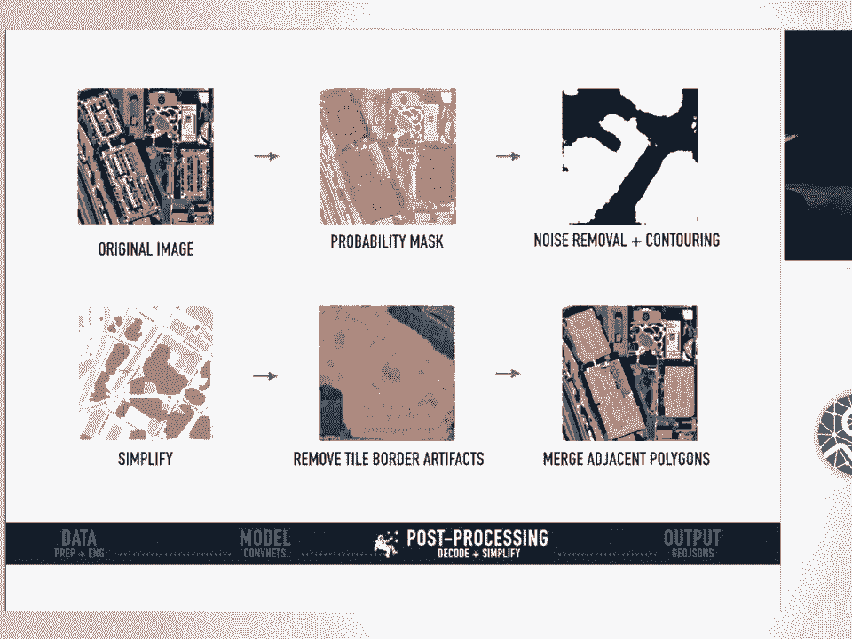

## 总结与未来工作

本节课中我们一起学习了 Mapbox 如何通过结合 OpenStreetMap 标签（用作标签）和从 Mapbox Satellite 获取的影像，构建大规模深度学习流水线。我们运行大规模分析，并能够在 Mapbox Satellite 影像上可视化最终模型输出。

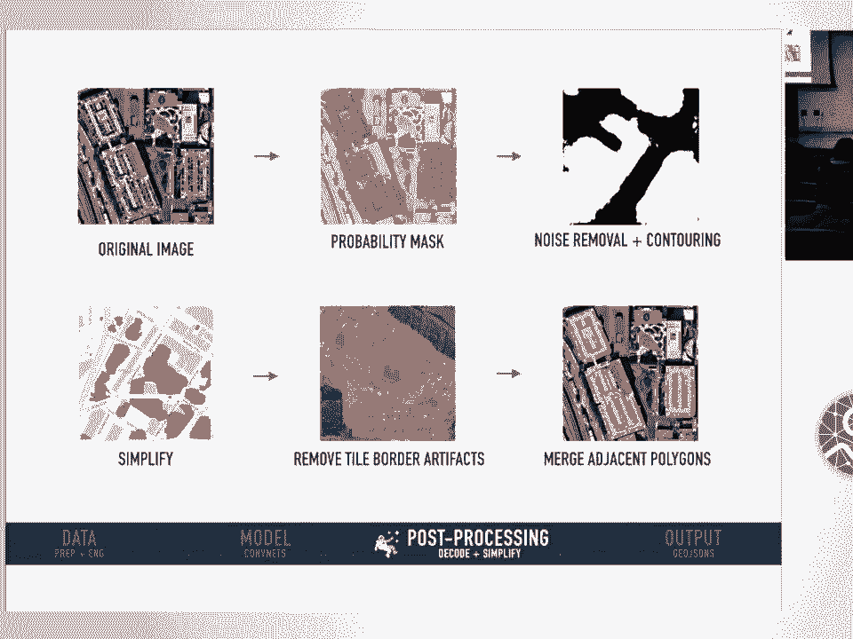

### 正在进行的工作

1.  **开源数据集**：我们计划开源包含 54,000 个转向车道标记的数据集（包含标签和图像），涵盖纽约、华盛顿特区、丹佛、费城和坦帕五个城市。
2.  **开源工具库**：我们已于上个月开源了名为 **RoboSat** 的整个分割流水线及相关必要工具。利用这个库，你可以使用自己的数据和网络架构，并可以直接从 Mapbox Maps API 查询影像。
3.  **模型改进**：我们正在尝试用预训练的 ResNet 编码器替换 U-Net 的编码器，并用最近邻上采样加卷积替换学习的反卷积操作。我们预计这将显著加快训练和预测速度，同时降低内存使用量，并可能得到更准确的结果。

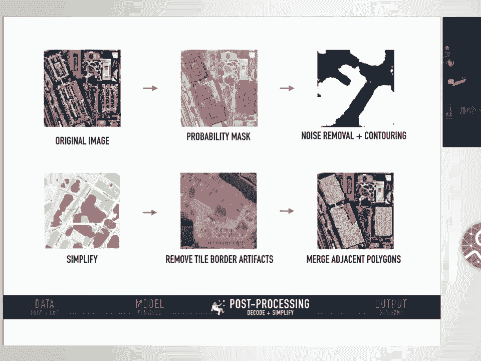

---
*注：本教程根据 SciPy 2018 会议演讲内容整理，保留了原演讲的核心技术流程与细节，并按照要求进行了结构化、简化和格式优化。*