# 64：使用 Scikit-build 打包 Python 二进制扩展模块 🛠️

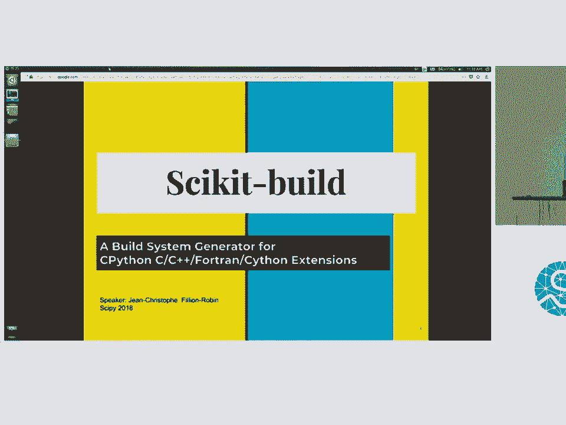

在本节课中，我们将学习如何为 Python 打包包含 C/C++/Fortran 代码的二进制扩展模块。我们将了解现有方法的局限性，并介绍一个名为 Scikit-build 的解决方案，它能简化构建流程并与 Python 生态系统无缝集成。

## 概述：Python 打包生命周期 🔄

首先，我们来回顾一下 Python 的打包生命周期。理解这个过程有助于我们定位二进制扩展打包所处的位置。

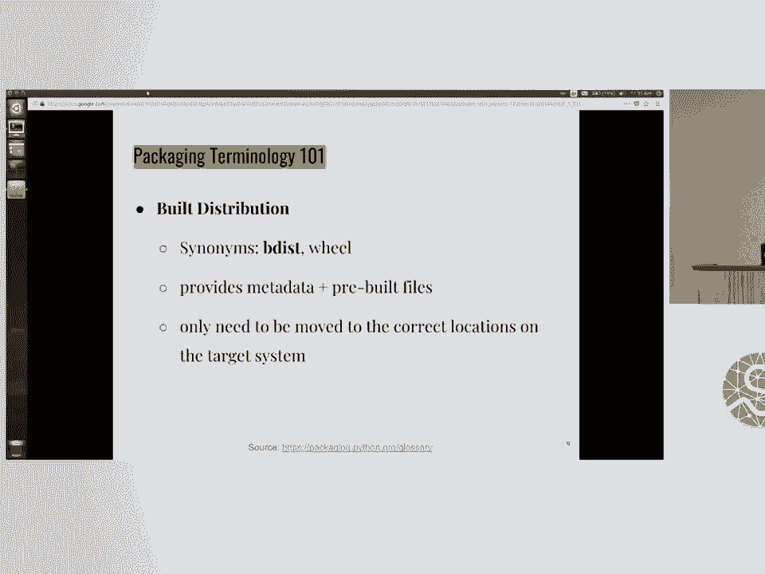

下图展示了从源代码到分发给用户的完整流程：

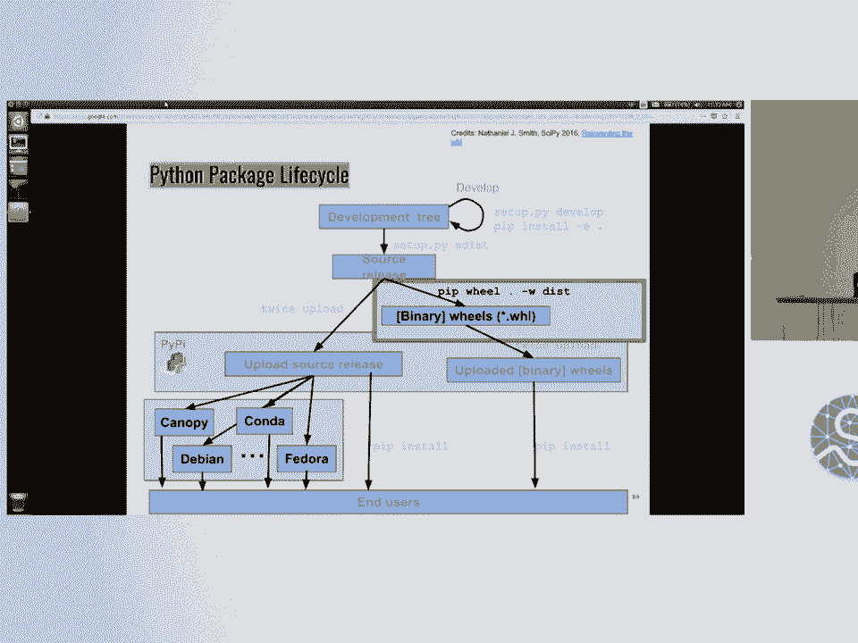


开发者在开发树中管理源代码。从这里，可以生成**源码分发**。源码分发包含元数据和源代码文件，是 `pip` 等工具安装或生成**构建分发**的基础。

构建分发，也称为二进制分发或 Wheel 文件，它包含元数据和预构建的文件。用户安装时只需解压文件到目标系统，无需再次编译。

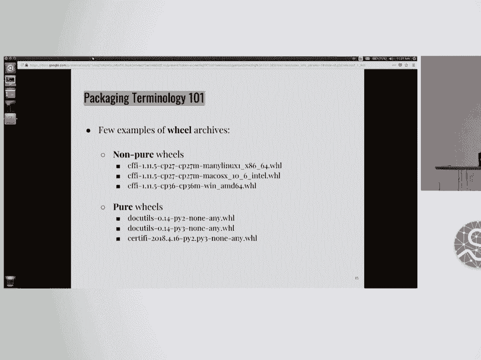

## 什么是二进制分发与 Wheel？📦

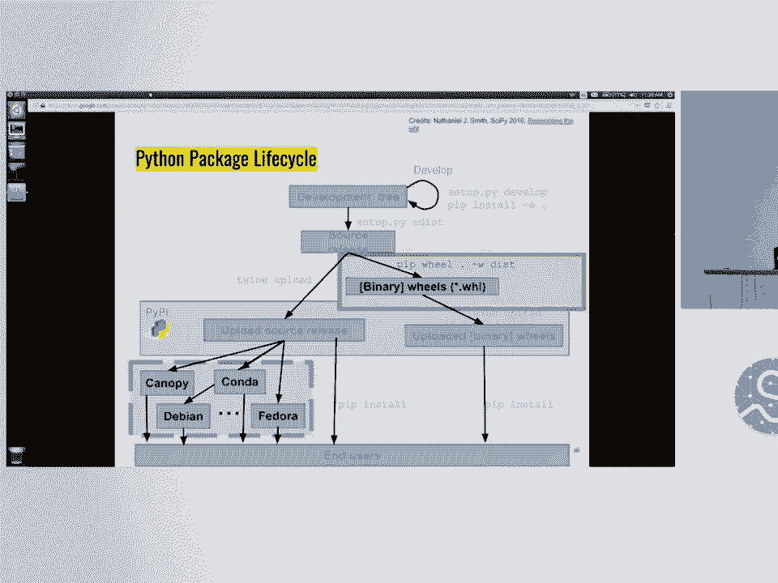

要理解二进制扩展，我们需要先明确几个核心概念：ABI、纯分发、非纯分发和 Wheel 格式。

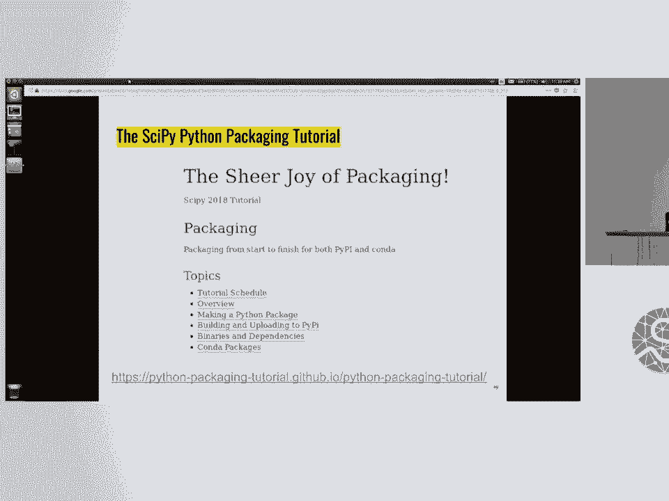

**ABI** 是应用程序二进制接口，它定义了二进制程序模块之间的交互方式。确保模块间 ABI 兼容是编译器和包维护者的工作。

Python 分发可以是**纯的**或**非纯的**：
*   **纯分发**：只包含 `.py` 文件，不针对特定 CPU 架构，没有 ABI 要求。
*   **非纯分发**：包含编译后的扩展模块（如 `.so`, `.pyd` 文件），是平台相关的。

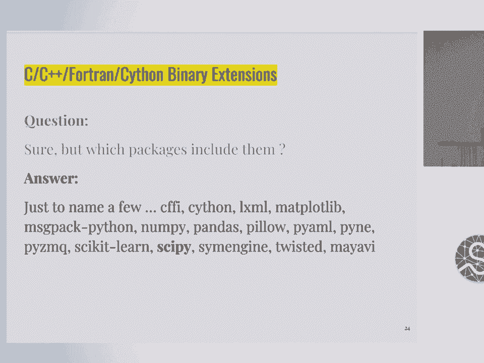

**二进制分发**就是一种非纯的、平台特定的构建分发，它包含编译后的扩展。而 **Wheel** 是一种文件格式，它规定了如何将构建或二进制分发中的文件组织起来。本质上，它是一个带有 `.whl` 扩展名的 zip 文件，由 PEP 427 定义。

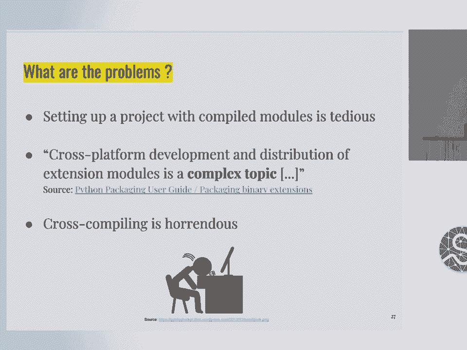

Wheel 文件的命名通常包含平台信息，例如：
*   `cp27-cp27m-manylinux1_x86_64.whl` （针对 Linux 的 Python 2.7）
*   `py3-none-any.whl` （纯 Python，兼容 Python 3 且无平台限制）

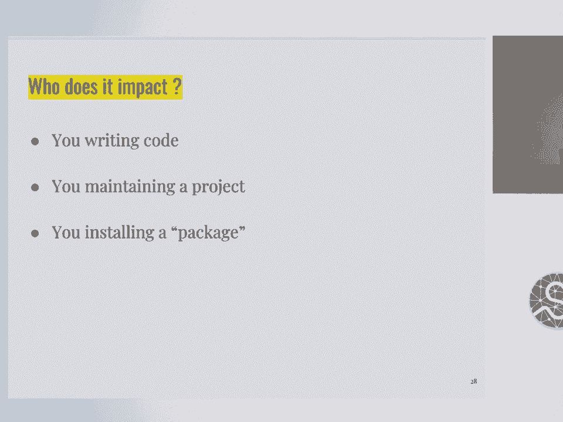

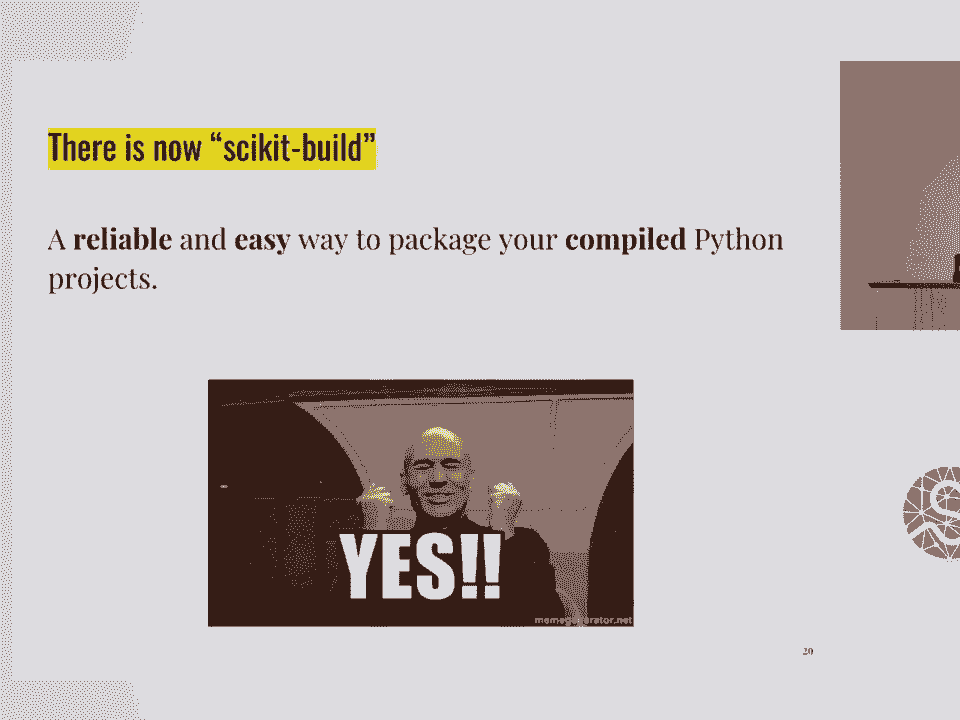

那么，Wheel 在打包生命周期中处于什么位置呢？


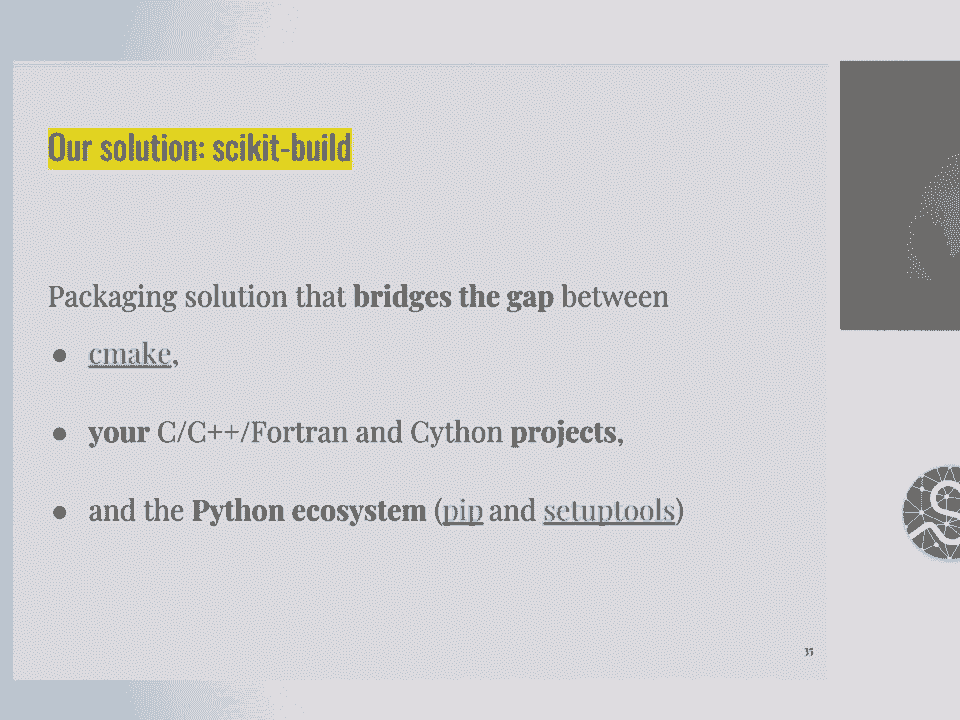

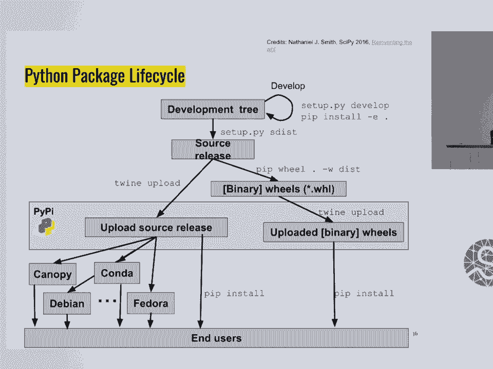

从图中可以看到，我们可以使用 `bdist_wheel` 命令从源码分发生成 Wheel 文件。这些 Wheel 可以是纯的或非纯的。此外，像 Conda、Debian 这样的系统包管理器，在生成其专属包时，通常也会先构建 Wheel，然后重新打包。

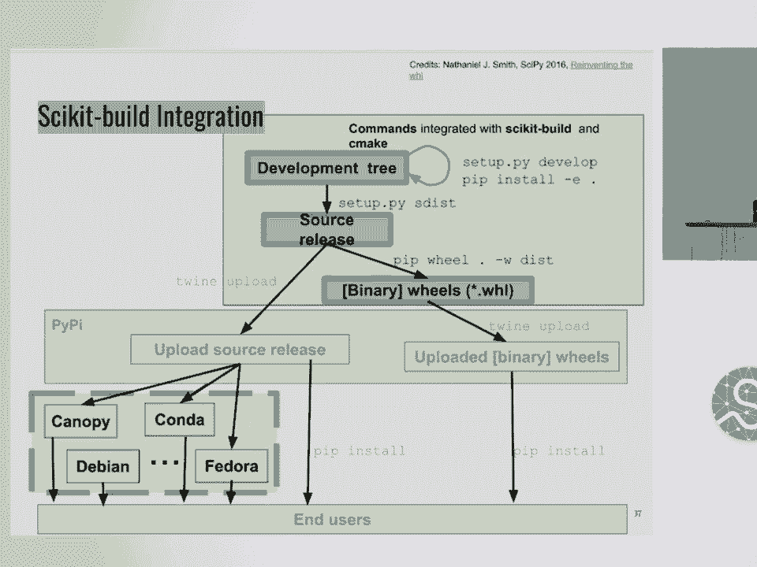

## 为什么需要二进制扩展？⚡

二进制扩展对科学计算等领域至关重要。它们能带来以下优势：
*   **加速计算**：执行计算密集型代码。
*   **创建包装器**：为现有的 C/C++/Fortran 科学计算库提供 Python 接口。
*   **访问底层功能**：直接操作系统或硬件特性。
*   **利用多核/GPU**：绕过 Python 的全局解释器锁，实现并行计算。
*   **精细内存管理**：进行更精确和可控的内存操作。

许多知名的科学计算包都依赖二进制扩展，例如：SciPy、scikit-learn、CMake、VTK、Matplotlib、PyZMQ 等。

## 当前构建工具的问题与挑战 😫

尽管需求明确，但使用现有工具（主要是 `setuptools`）构建二进制扩展存在诸多挑战：
*   **配置复杂**：指定正确的编译器和链接器标志容易出错。
*   **依赖管理困难**：查找构建时的依赖项很麻烦。
*   **构建工具受限**：无法充分利用 Make 或 Ninja 等高效构建工具。
*   **并行构建困难**：难以实现多个扩展模块的并行编译。
*   **开发体验不佳**：难以在 Visual Studio、Qt Creator 等 IDE 中顺畅地开发 C/C++ 代码。
*   **跨平台复杂**：跨平台开发和分发扩展模块是一个复杂的话题。
*   **交叉编译**：几乎是一个“玄学”领域。

这些问题影响着每一个编写、维护或安装包含二进制扩展的 Python 包的开发者。

## 解决方案的需求与 Scikit-build 介绍 🎯

我们需要一个满足以下要求的构建工具：
1.  **可靠地构建原生代码**。
2.  **一流的系统自省支持**。
3.  **支持创建 Python 扩展模块**。
4.  **支持动态和静态链接**。
5.  **集成编译、打包和发布流程**。
6.  **与 Python 生态系统（pip, setuptools）深度集成**。
7.  **一流的跨平台支持**，包括交叉编译能力。

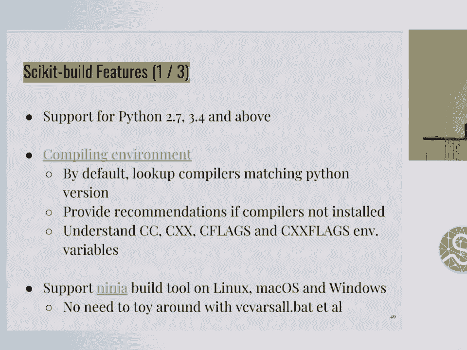

我们的解决方案是 **Scikit-build**。它是一座桥梁，连接了 CMake（用于管理 C/C++/Fortran 项目）和 Python 生态系统（`pip` 和 `setuptools`）。


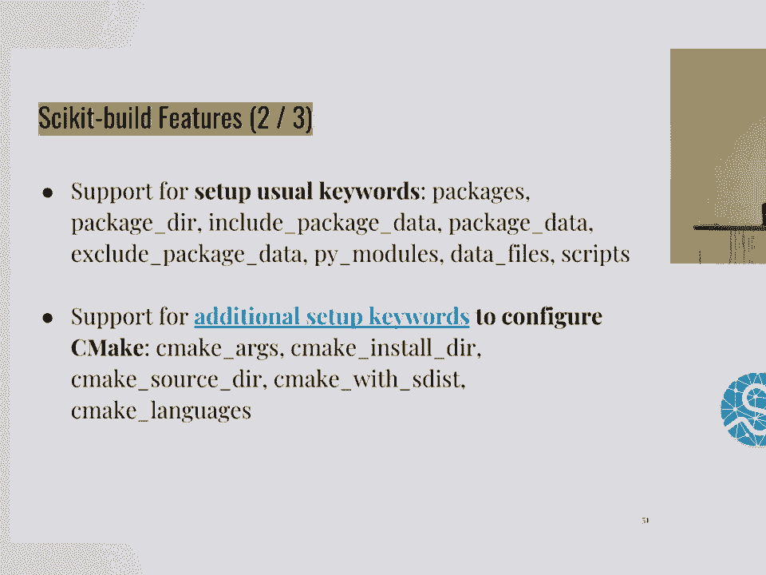

那么，Scikit-build 在打包生命周期中扮演什么角色？

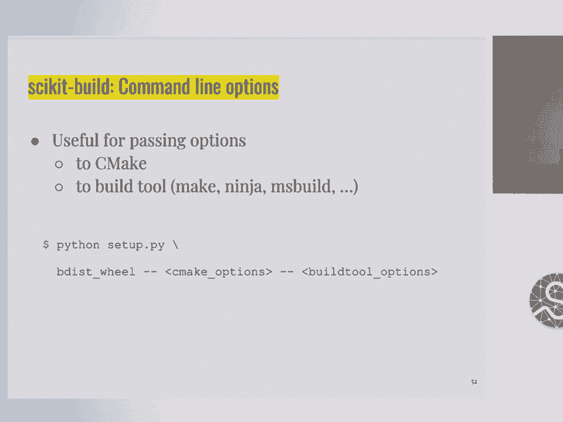


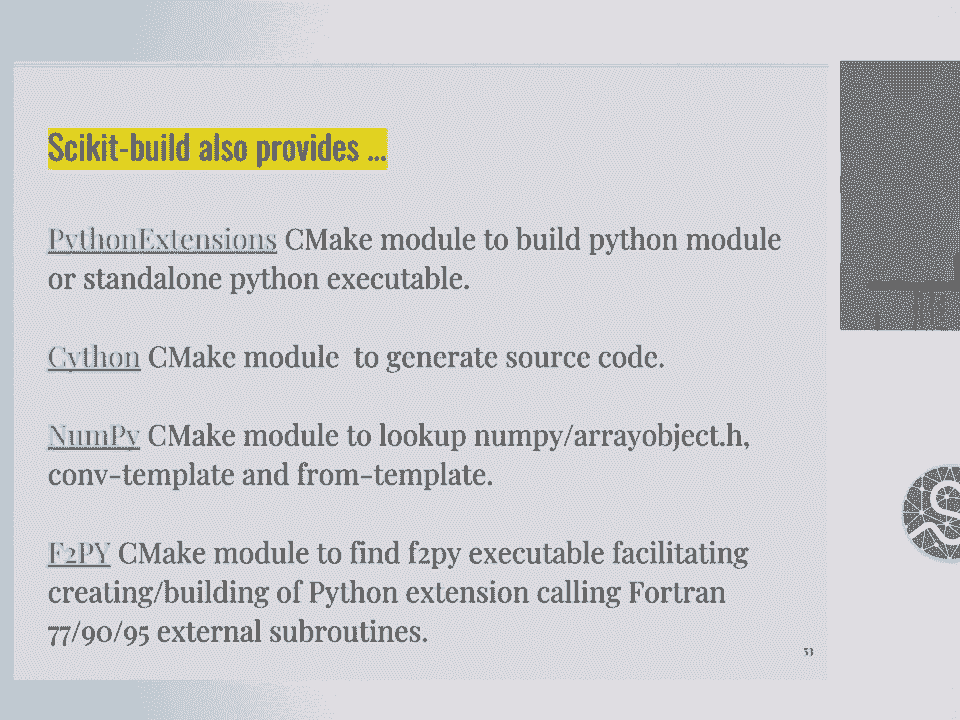

如图所示，Scikit-build 与现有工具无缝集成。无论是使用 `pip install -e .` 进行开发，还是用 `bdist_wheel` 生成 Wheel，Scikit-build 都能与 `setuptools` 协作。它引入了专门用于生成构建系统和编译代码的 CMake，并且同样支持生成 Conda、Debian 等系统包，因为这些过程也需要编译代码。

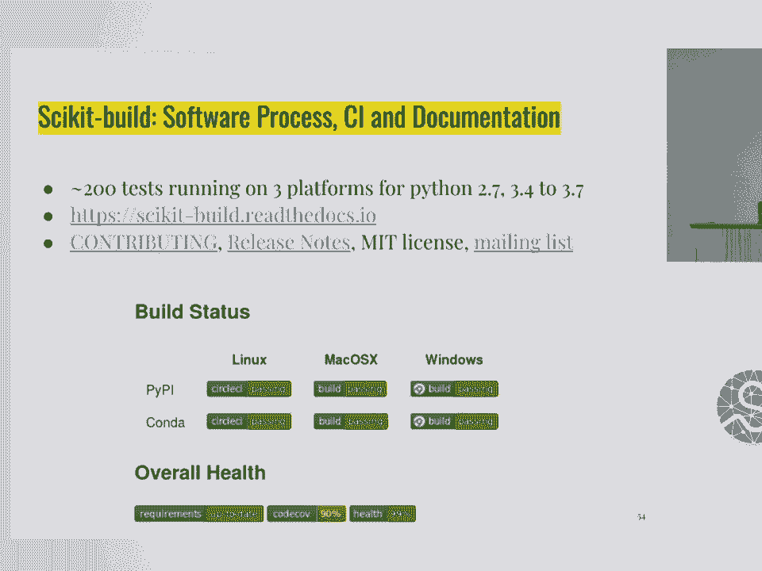

## 为什么选择 CMake？📈

CMake 是一个开源、维护良好且支持广泛的工具。它的优势包括：
*   **跨平台构建**，对交叉编译有一流支持。
*   **强大的系统自省能力**。
*   **支持原生构建系统**，能生成 Visual Studio、Xcode、Ninja、Makefile 等工程文件。
*   **提供 Python 扩展模块支持**。
*   **独立不依赖**，可在超级计算机上编译，并且能通过 `pip` 或 `conda` 轻松安装二进制版本。

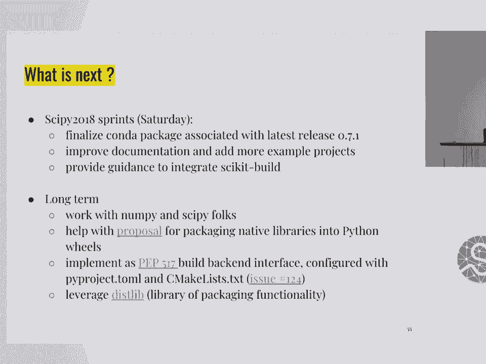


从构建工具的趋势来看，CMake 在过去15年中越来越受欢迎，被众多项目所采用。

## Scikit-build 的核心用法 🚀

Scikit-build 并非重造轮子，它不引入新范式，而是集成现有工具。它不是 `setuptools` 扩展的替代品，但可以单独使用。它不管理包依赖，只让构建包变得更简单。它不是一个魔法黑盒，你仍然在编译扩展模块，只是减少了大量的猜测工作。

Scikit-build 基本上是一个“即插即用”的替代方案。你只需将 `from setuptools import setup` 改为 `from skbuild import setup`，然后编写一个 `CMakeLists.txt` 文件来描述构建什么以及如何构建。

以下是一个简单 C++ 扩展项目的文件结构示例：
```
my_project/
├── CMakeLists.txt
├── my_module.cpp
├── setup.py
└── pyproject.toml
```

`setup.py` 文件变得非常简单：
```python
from skbuild import setup
setup(
    name="my_project",
    packages=["my_project"],
)
```

构建逻辑转移到 `CMakeLists.txt` 中：
```cmake
cmake_minimum_required(VERSION 3.10)
project(my_project)

find_package(PythonExtensions REQUIRED)
add_library(my_module MODULE my_module.cpp)
python_extension_module(my_module)
target_link_libraries(my_module PRIVATE Python::Python)
install(TARGETS my_module LIBRARY DESTINATION my_project)
```

还需要一个 `pyproject.toml` 文件来确保构建依赖（如 `scikit-build`、`cmake`）在构建前被自动安装：
```toml
[build-system]
requires = ["setuptools", "wheel", "scikit-build", "cmake", "ninja"]
build-backend = "setuptools.build_meta"
```

构建命令和传统方式一样：
```bash
pip install -e .  # 开发模式安装
python setup.py bdist_wheel  # 生成 Wheel 文件
```

## Scikit-build 的主要特性 ✨

*   **支持 Python 2.7 及 3.4+**。
*   **智能编译器选择**：默认匹配当前 Python 版本所需的编译器（如 VS2008 for Py2.7， VS2015 for Py3.5），并可覆盖。
*   **友好的错误提示**：如果缺少编译器（如 Xcode、VS），会给出明确的安装指导。
*   **环境变量继承**：理解 `CC`、`CXX`、`CFLAGS` 等标准环境变量。
*   **支持 Ninja**：在 Unix 和 Windows 上使用 Ninja 进行高效、并行的构建。
*   **简化 Windows 开发**：无需手动运行 `vcvarsall.bat`，自动设置环境。
*   **开发者模式**：`pip install -e .` 或 `setup.py develop` 会将编译库复制到源码树，方便开发调试。
*   **自动包含源码**：默认利用 Git 自动将源码打包进源码分发。
*   **增量构建**：在相关文件未改变时跳过重新配置，加速构建。
*   **扩展的 setup 参数**：支持通过 `cmake_args`、`cmake_install_dir` 等参数精细控制 CMake。
*   **命令行接口**：可传递选项给 CMake (`--cmake-args`) 和底层构建工具 (`--build-args`)。
*   **专用 CMake 模块**：提供 `FindPythonExtensions`、`Python` 等模块，简化扩展模块的查找和配置。
*   **完善的生态**：拥有大量的测试（覆盖4个平台，Python 2.7/3.4-3.7）、文档、采用 MIT 许可，并通过 Conda 分发。

## 未来展望与总结 🚀

Scikit-build 的未来计划包括：
1.  发布新版本并完善 Conda 包。
2.  改进文档，增加更多示例项目。
3.  提供将 Scikit-build 集成到现有项目的指南。
4.  长期目标包括帮助推进 **PEP 提案**，以更好地在 Wheel 中打包原生共享库。
5.  实现 **PEP 517**，作为独立的构建后端，与 `setuptools` 解耦。

**总结**：本节课我们一起学习了 Python 二进制扩展打包的挑战。我们介绍了现有 `setuptools` 方法的局限性，并深入了解了 **Scikit-build** 如何作为 CMake 与 Python 打包生态系统之间的桥梁，提供了一个更可靠、更强大、更易于跨平台的解决方案来构建和分发包含 C/C++/Fortran 代码的 Python 包。对于涉及复杂原生代码的新项目，Scikit-build 是一个值得考虑的强力工具。

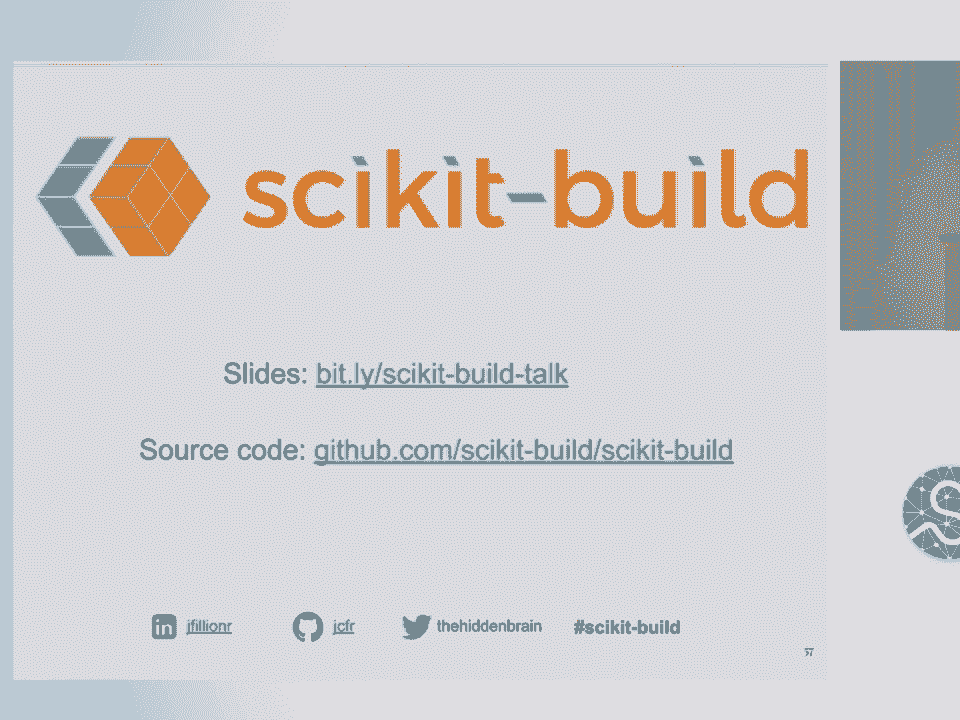

---
*   演讲链接：https://bit.ly/scikit-build-talk
*   项目源码：https://github.com/scikit-build/scikit-build