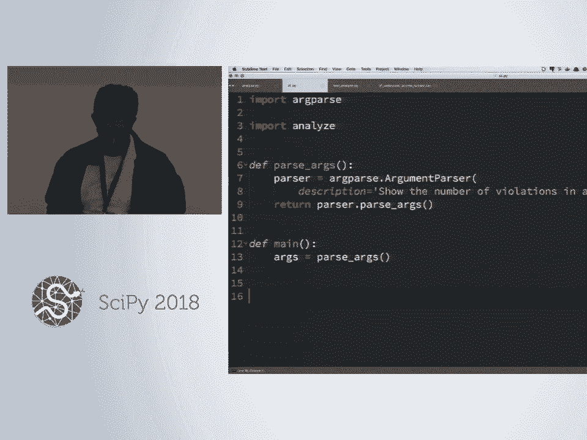
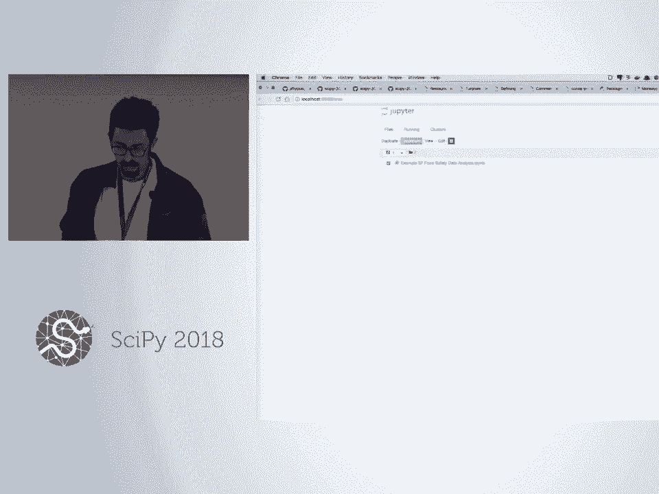
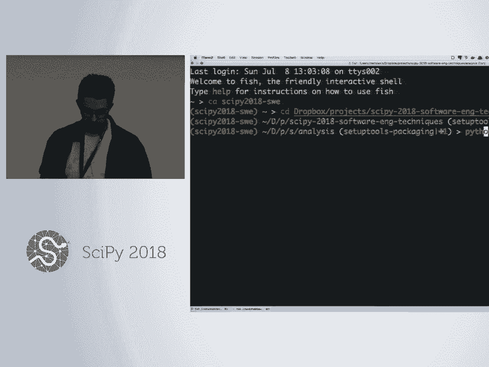
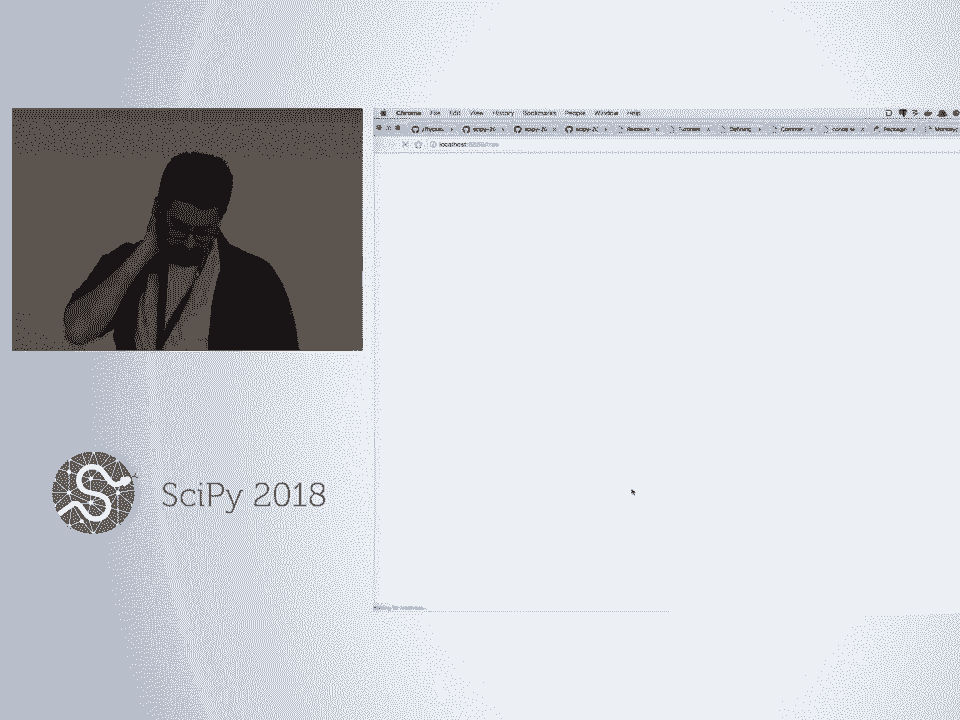
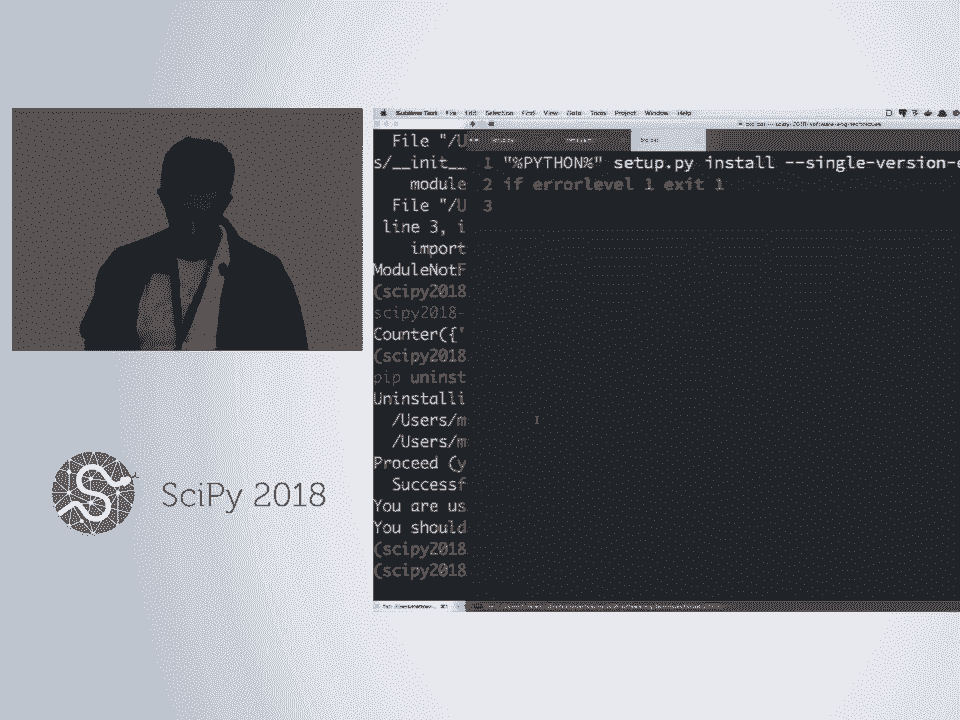
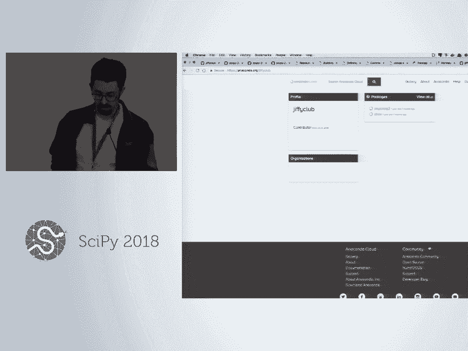
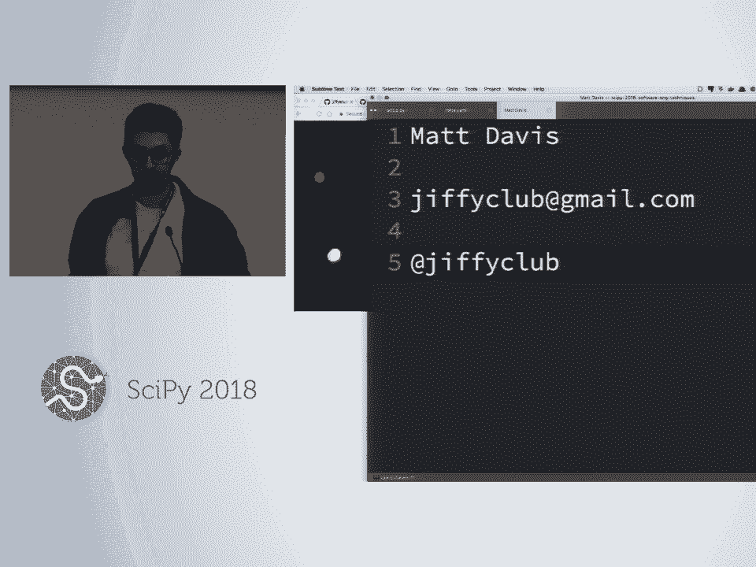

# 66：软件工程基础入门 🛠️

在本课程中，我们将跟随 Matt Davis 和 Alyssa 的讲解，学习如何编写易于分享、能在生产环境中稳定运行的高质量代码。我们将通过一个分析餐厅检查数据的实际项目，涵盖代码设计、测试、调试、性能分析和打包等核心软件工程概念。

---

## 概述

我们将编写一个命令行工具，用于分析旧金山市的餐厅检查数据。该工具接收一个月份作为输入，并输出该月份内不同风险等级（如高风险、低风险）的检查次数统计。虽然实际工作中可能只需几行 pandas 代码，但为了深入理解软件工程流程，我们将使用纯 Python 从头构建。

我们的项目目录中包含两个数据文件：一个完整的原始数据集和一个用于测试的小型子集。使用子集可以方便我们通过肉眼观察来验证代码结果。

---

## 第一步：规划与设计 📝

在开始编码之前，我们需要规划代码的结构和 API（应用程序接口）。这有助于我们清晰地思考各个功能模块。

首先，在文本编辑器中创建一个名为 `analyze.py` 的文件。在文件顶部，我们使用文档字符串来描述模块的功能。文档字符串是使用三引号 (`"""`) 括起来的注释，许多库（如 Pandas、NumPy）的官方文档就是由这些字符串自动生成的。

接下来，我们思考需要哪些函数。根据问题描述，我们需要：
1.  读取 CSV 文件。
2.  按检查类型过滤数据。
3.  按月份过滤数据。
4.  统计风险类别的数量。
5.  一个整合以上功能的主函数。

我们先将这些函数的签名（名称和参数）写下来，暂时不写具体实现。这有助于我们提前思考 API 的设计。

```python
def read_file(filepath):
    """读取 CSV 文件，返回一个字典列表，每个字典代表一行数据。"""

def filter_inspection_type(data, inspection_type):
    """根据检查类型过滤数据行。"""

def filter_month(data, month, year):
    """根据年份和月份过滤数据行。"""

def count_risk_categories(data):
    """统计数据中各类风险类别的出现次数。"""

def count_risk_categories_by_month(data, month, year):
    """整合以上功能，计算指定月份的风险类别统计。"""
```

设计 API 时没有绝对正确的答案，关键在于权衡。例如，`read_file` 函数可以返回列表的列表、字典的列表或文件对象。我们选择返回字典列表，其中每个字典的键是列名，这样便于后续通过列名访问数据。

---

## 第二步：实现与测试基础功能 ✅

上一节我们规划了代码结构，本节中我们来看看如何实现这些基础功能，并为其编写测试。

### 1. 实现 `read_file` 函数

我们将使用 Python 内置的 `csv` 模块来读取文件。`csv.DictReader` 非常方便，它会自动将 CSV 文件的第一行作为标题行，并允许我们迭代获取每一行作为一个字典。

```python
import csv

def read_file(filepath):
    """读取 CSV 文件，返回一个字典列表，每个字典代表一行数据。"""
    with open(filepath, 'r') as f:
        reader = csv.DictReader(f)
        return list(reader)
```
`list(reader)` 会迭代整个读取器，将所有数据加载到一个列表中。

### 2. 为 `read_file` 编写测试

测试是确保代码按预期工作的关键。我们创建一个名为 `test_analyze.py` 的测试文件。我们将使用 `pytest` 框架，它允许我们编写简单的测试函数。

测试文件的命名和测试函数的命名有约定：测试文件应以 `test_` 开头或结尾，测试函数也应以 `test_` 开头。

```python
# test_analyze.py
import analyze

def test_read_file():
    """测试 read_file 函数是否正确读取了测试数据文件。"""
    data = analyze.read_file('data/test_subset.csv')
    # 测试文件有10行数据（不含标题行）
    assert len(data) == 10
    # 测试每行数据都有正确的列数（例如17列）
    assert len(data[0]) == 17
```
运行测试：在命令行中执行 `pytest test_analyze.py`。如果测试通过，你会看到一个绿色的点或“PASSED”提示。如果失败，`pytest` 会输出详细的错误信息，帮助你定位问题。

### 3. 测试驱动开发：先写测试，再写代码

对于 `filter_inspection_type` 函数，我们可以采用测试驱动开发：先编写测试，再实现功能。这样，当我们实现代码时，可以立即通过测试验证其正确性。

```python
# 在 test_analyze.py 中
def test_filter_inspection_type():
    """测试按检查类型过滤数据。"""
    test_data = [
        {'inspection_type': 'Routine - Unscheduled'},
        {'inspection_type': 'New Ownership'},
        {'inspection_type': 'Routine - Unscheduled'}
    ]
    result = analyze.filter_inspection_type(test_data, 'Routine - Unscheduled')
    expected = [
        {'inspection_type': 'Routine - Unscheduled'},
        {'inspection_type': 'Routine - Unscheduled'}
    ]
    assert result == expected
```
此时运行测试会失败，因为函数还未实现。接着我们实现该函数：
```python
# 在 analyze.py 中
def filter_inspection_type(data, inspection_type):
    """根据检查类型过滤数据行。"""
    return [row for row in data if row['inspection_type'] == inspection_type]
```
再次运行测试，看到它通过，会带来巨大的成就感！我们还应考虑边界情况，例如传入空列表或不存在于数据中的检查类型时，函数应如何表现，并为此添加测试。

### 4. 使用 `pytest` 夹具共享测试数据

对于需要多次使用的测试数据（如从文件加载的数据），我们可以使用 `pytest` 的夹具功能，避免重复加载。

```python
# test_analyze.py
import pytest
import analyze

@pytest.fixture(scope='module')
def data():
    """夹具：加载测试数据，供多个测试函数使用。"""
    return analyze.read_file('data/test_subset.csv')

def test_filter_month(data): # `data` 参数会自动注入夹具的返回值
    """测试按月份过滤数据。"""
    result = analyze.filter_month(data, 12, 2017)
    # 根据对测试数据的观察，断言预期结果
    assert len(result) == 3
    result_none = analyze.filter_month(data, 1, 400)
    assert result_none == []
```



---

## 第三步：调试与集成 🐛

上一节我们实现了独立的功能单元并进行了测试，本节中我们来看看如何将它们组合起来，并学习使用调试工具排查问题。

### 1. 实现计数功能

统计风险类别时，我们可以利用 Python 标准库中的 `collections.Counter` 工具。

```python
from collections import Counter

def count_risk_categories(data):
    """统计数据中各类风险类别的出现次数。"""
    risk_vals = [row.get('risk_category', '') for row in data]
    counts = Counter(risk_vals)
    # 处理空字符串键（代表无违规的完美检查）
    if '' in counts:
        counts['No Violation'] = counts['']
        del counts['']
    return counts
```
同样，我们应为这个函数编写测试。

### 2. 集成所有功能

现在，我们可以将各个函数组合到主函数中。
```python
def count_risk_categories_by_month(data, month, year):
    """整合以上功能，计算指定月份的风险类别统计。"""
    filtered_by_type = filter_inspection_type(data, 'Routine - Unscheduled')
    filtered_by_month = filter_month(filtered_by_type, month, year)
    return count_risk_categories(filtered_by_month)
```
运行测试来验证集成后的功能是否正常。

### 3. 使用 Python 调试器

当测试失败或代码行为异常时，Python 调试器是一个强大的工具。我们可以在代码中插入 `import pdb; pdb.set_trace()` 来启动调试器，或者在运行 `pytest` 时加上 `--pdb` 标志，使其在遇到错误时自动进入调试模式。

在调试器提示符下，你可以：
*   `print(variable)` 或 `pp variable`：打印或美化打印变量值。
*   `list`：显示当前执行点附近的代码。
*   `next`：执行下一行代码。
*   `step`：进入函数调用内部。
*   `up`/`down`：在调用栈中上下移动。
*   `where`：显示完整的调用栈。
*   `c`：继续执行程序。
*   `q`：退出调试器。

例如，如果 `count_risk_categories_by_month` 的结果不符合预期，我们可以设置断点，逐步检查每一步过滤后的数据，从而定位问题所在。

---

## 第四步：创建命令行界面 🖥️

我们的代码逻辑已经完成，现在为其创建一个方便使用的命令行界面。我们将使用 Python 内置的 `argparse` 模块。

创建一个新文件 `cli.py`：
```python
# cli.py
import argparse
import analyze



def main(args=None):
    parser = argparse.ArgumentParser(description='分析餐厅检查数据，统计指定月份的风险类别。')
    parser.add_argument('filepath', help='数据文件路径')
    parser.add_argument('month', type=int, help='月份 (1-12)')
    parser.add_argument('year', type=int, help='年份')

    if args is None:
        args = parser.parse_args() # 从命令行解析参数
    else:
        args = parser.parse_args(args) # 允许传入参数列表，便于测试

    data = analyze.read_file(args.filepath)
    result = analyze.count_risk_categories_by_month(data, args.month, args.year)
    print(result)

if __name__ == '__main__':
    main()
```
现在，用户可以通过命令行使用这个工具：
```bash
python cli.py data/full_dataset.csv 5 2018
```
`argparse` 还会自动生成帮助信息：
```bash
python cli.py --help
```

---

## 第五步：性能分析 ⚡


当处理大型数据集（如完整的 5 万行数据）时，代码性能变得重要。我们可以使用 `cProfile` 模块来分析代码的运行时间。

在命令行中运行：
```bash
python -m cProfile -o profile_output.prof cli.py data/full_dataset.csv 5 2018
```
这会将性能分析数据保存到 `profile_output.prof` 文件中。为了直观地查看结果，我们可以使用 `snakeviz` 工具（需提前安装：`pip install snakeviz`）：
```bash
snakeviz profile_output.prof
```
这会在浏览器中打开一个可视化界面，以火焰图或冰柱图的形式展示各个函数消耗的时间比例。通过分析，我们可能会发现大部分时间花在了 `read_file` 函数上。对于纯 Python 的 CSV 读取，优化空间有限，但了解性能瓶颈对于后续改进（例如考虑使用 Pandas）至关重要。

**注意**：`cProfile` 只能分析 Python 代码的执行时间，如果代码调用了编译后的 C 扩展库（如 NumPy），这部分时间将无法深入分析。

---





## 第六步：打包与分发 📦

最后，我们希望将代码打包成一个库，以便在其他项目或环境中轻松复用，例如在 Jupyter Notebook 中。

### 1. 使用 `setuptools` 打包

首先，我们需要重新组织项目结构，并将代码放入一个专门的目录（例如 `scipy2018/`）中。然后，在项目根目录创建 `setup.py` 文件：

```python
# setup.py
from setuptools import setup, find_packages

setup(
    name='scipy2018-analyzer',
    version='0.1.0',
    description='一个用于分析餐厅检查数据的工具。',
    packages=find_packages(), # 自动查找包目录
    install_requires=[], # 列出依赖项
    entry_points={
        'console_scripts': [
            'analyze-data=scipy2018.cli:main', # 创建命令行命令
        ],
    },
)
```
在开发模式下安装包（`-e` 表示可编辑模式，代码修改会直接生效）：
```bash
pip install -e .
```
安装后，就可以在任何地方通过 `import scipy2018.analyze` 来使用我们的模块，或者直接在命令行使用 `analyze-data` 命令。

### 2. 构建分发文件

我们可以构建源代码分发包和 wheel 分发包：
```bash
# 构建源代码包
python setup.py sdist --format=zip
# 构建 wheel 包
python setup.py bdist_wheel
```
生成的文件位于 `dist/` 目录。这些包可以上传到 PyPI（Python 包索引）或私下分享给他人使用。

### 3. Conda 打包简介

对于 Conda 环境，则需要创建 `meta.yaml` 文件来定义包的元数据、依赖和构建指令。通过 `conda build` 命令可以构建 Conda 包，并可以上传到 Anaconda.org 的个人频道进行分享。对于跨平台分发，尤其是包含编译代码的项目，`conda-forge` 社区提供了强大的自动化构建支持。




---



## 总结

在本课程中，我们一起学习了软件工程的基础流程。我们从**规划与设计** API 开始，然后**实现**各个功能模块，并采用**测试驱动开发**和单元测试来保证代码质量。当遇到问题时，我们使用 **Python 调试器** 进行排查。接着，我们为代码创建了**命令行界面**，使其易于使用。为了了解代码性能，我们使用了 **cProfile 和 snakeviz** 进行性能分析。最后，我们学习了如何使用 **setuptools** 将项目打包，以便于分发和在不同环境中复用。



记住，编写可维护、可共享的代码的关键在于：良好的设计、全面的测试、清晰的文档和适当的工具使用。希望这些技巧能帮助你在未来的项目中写出更棒的代码！