# 68：社会经济邻里的时空分析 🏙️📊

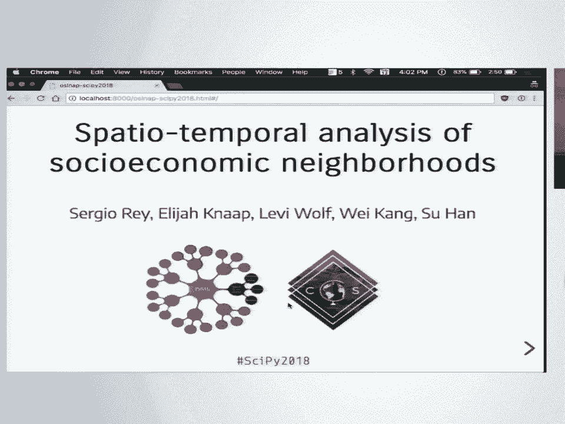

在本课程中，我们将学习一个由美国国家科学基金会资助的大型三年期项目的中期报告。该项目旨在开发用于分析社会经济邻里的开源、可复现工具。我们将探讨邻里的重要性、现有研究的挑战，以及项目团队如何利用Python生态系统构建工具来整合“邻里效应”和“邻里动态”这两个研究领域。

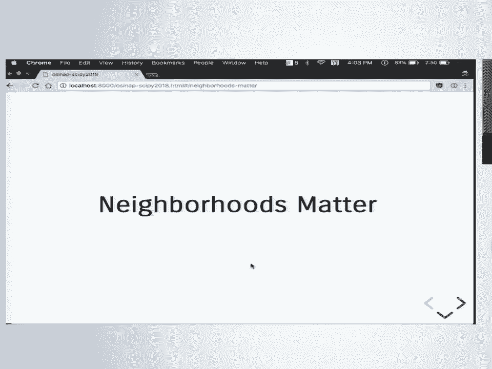

## 项目概述与动机

邻里在社会科学中至关重要。大量研究表明，一个人的居住地对其行为、经济机会和健康结果有显著影响。

例如，“机会迁移”研究曾探讨家庭从贫困社区迁往条件更好社区的影响。后续研究发现，被迫迁出公共住房的家庭，其子女在收入和教育成果上与留在原地的家庭存在显著差异。这证明了邻里环境的重要性。

近期关于代际收入流动性的研究也表明，即使家庭收入水平相同，居住在不同社区也会导致未来经济机会的巨大差异。

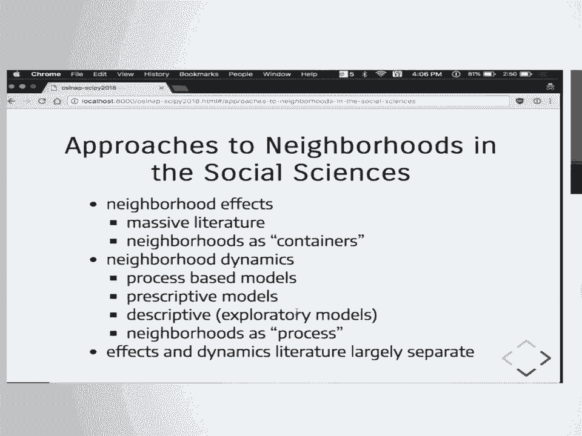

## 现有研究的两大分支

上一节我们介绍了邻里的重要性，本节中我们来看看社会科学中研究邻里的两大主要方向。

*   **邻里效应文献**：将邻里视为固定的“容器”，研究不同容器中人群的社会经济结果差异。例如，研究社区社会失序与犯罪率的关系，或建筑环境对儿童健康的影响。
*   **邻里动态文献**：将邻里本身作为研究对象，关注其随时间的变化。这包括社会经济构成的变化（如士绅化），以及物理边界的变化（如行政区划合并）。

我们的项目目标是将这两个文献体系整合起来，以更全面的视角研究城市。

## 定义邻里的挑战与项目目标

既然邻里如此重要，那么我们如何定义它呢？这是一个核心挑战。邻里在本质上是一种社会建构，不同个体的感知可能不同。

从宏观研究的角度，虽然存在多种客观定义方式（如空间范围、人口构成、社会经济同质性），但学界并未达成共识。更重要的是，现有研究大多忽略了邻里的动态性，常常假设其边界是固定不变的。

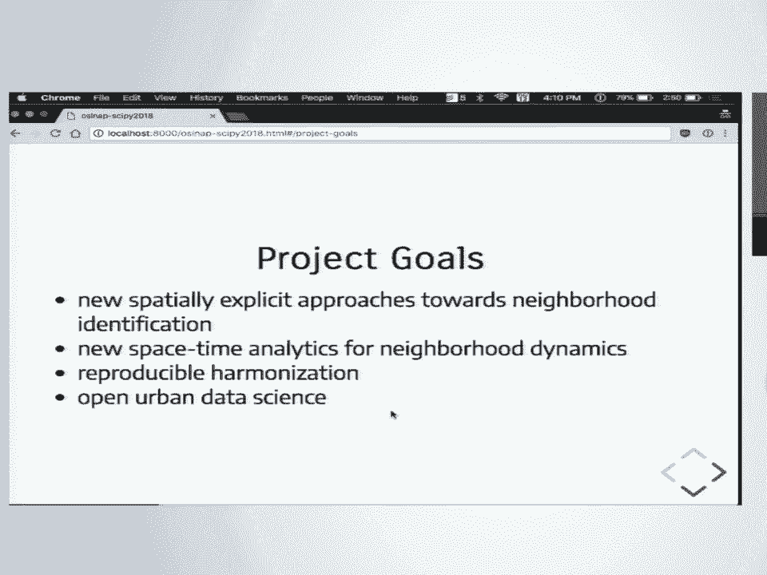

为了应对这些挑战，我们的NSF项目设立了四个主要目标：

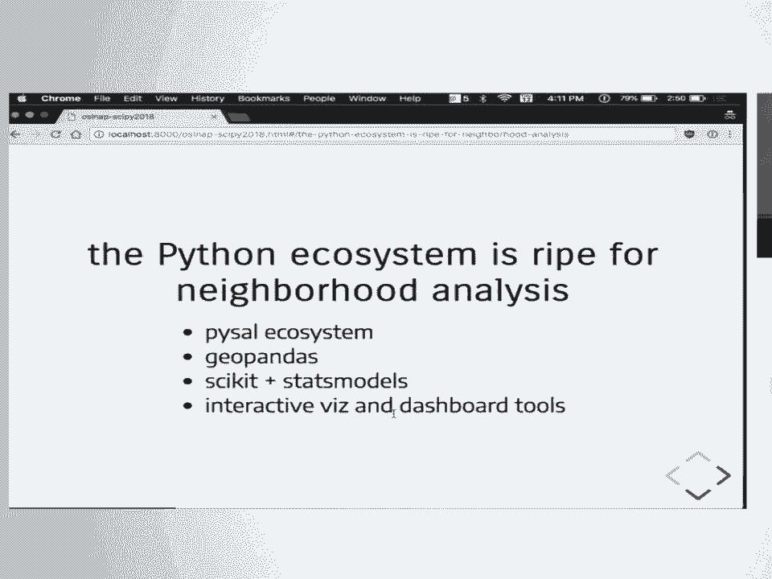

1.  **开发新方法**：创建能够体现时空动态的、空间明确的邻里定义方法。
2.  **构建新指标**：一旦定义了邻里，开发新的度量指标来丰富描绘城市环境中的空间动态。
3.  **解决数据难题**：处理美国人口普查数据中因边界十年一变而带来的数据协调与整合问题。
4.  **促进研究可复现性**：当前许多研究无法复现。我们希望通过开源工具解决这一问题，确保研究发现的稳健性，因为这些发现常常影响政策制定。

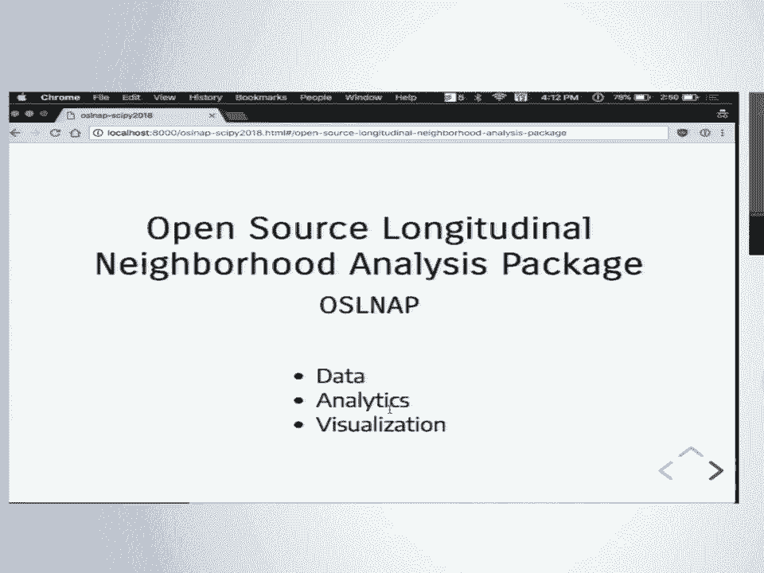

## 技术栈与工具介绍：OSLNAP

幸运的是，我们正置身于Python生态系统之中。我们计划利用一系列强大的Python库来应对上述挑战。

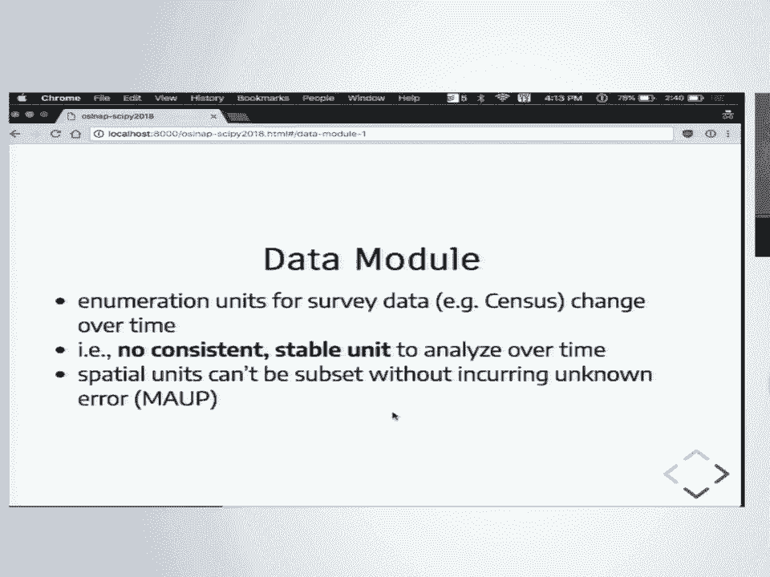

我们将主要依赖以下工具：
*   **PySAL**：用于空间分析的核心库。
*   **GeoPandas**：处理地理空间数据。
*   **scikit-learn** 和 **statsmodels**：用于统计建模与机器学习。

基于这些工具，我们正在开发一个名为“开源纵向邻里分析包”的软件包，简称 **OSLNAP**。它包含数据处理、分析和可视化等多个层次。

## 核心模块详解：数据与邻里识别

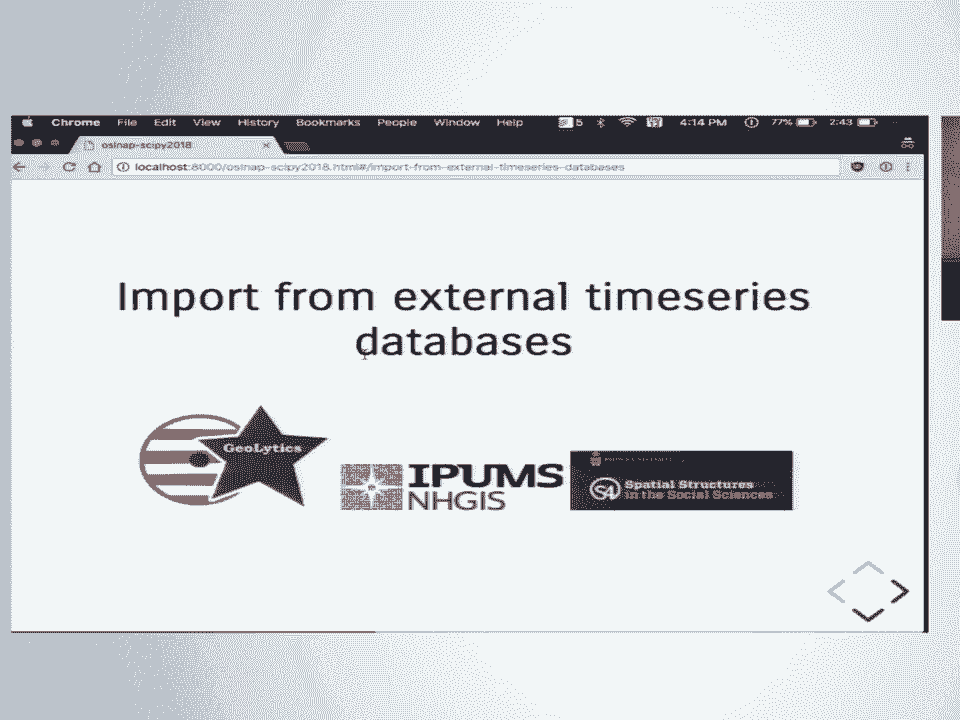

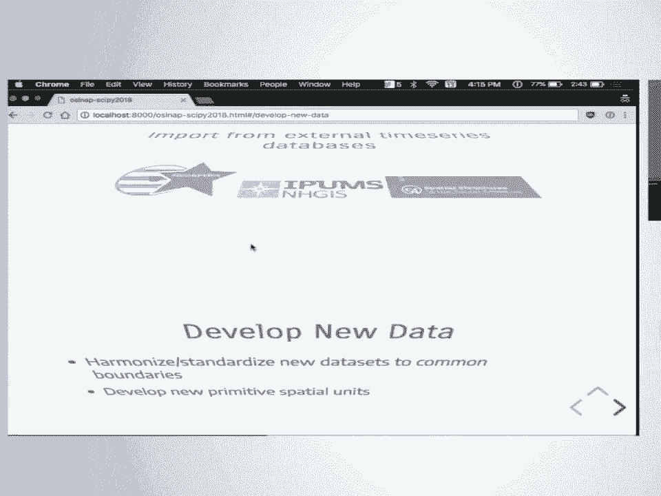

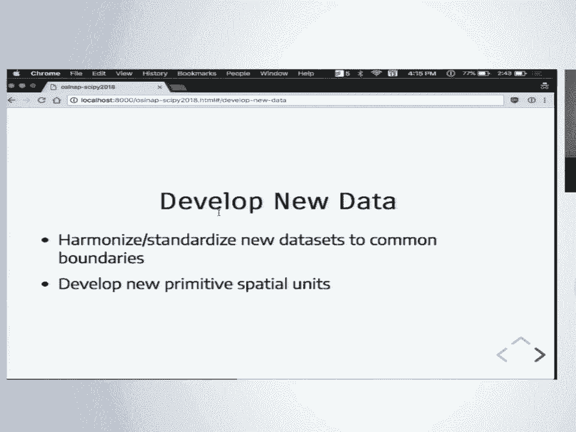

接下来，我们将深入探讨OSLNAP中的两个核心模块。

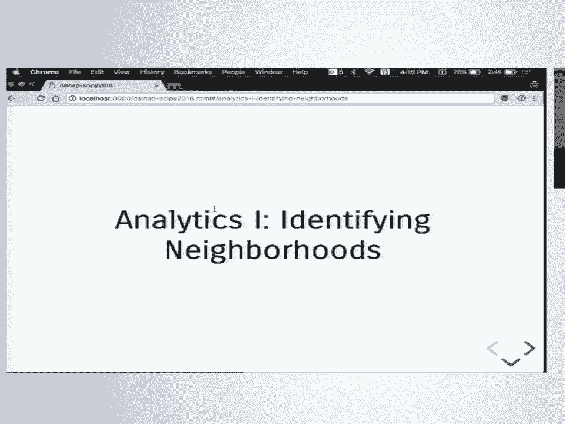

### 数据处理模块


大部分数据来源于美国人口普查，而普查边界每十年会重新划定。如果我们想进行时间序列分析，就需要一致的地理单元。否则，当边界变化时，我们将无法区分变化是源于真实的社会经济变动，还是仅仅因为边界改变了。

以下是一个简单的代码逻辑，说明在边界变化时，如何避免简单地按面积比例分配数据（这可能产生巨大误差）：
```python
# 伪代码：说明按面积分配与按辅助数据（如人口分布）分配的区别
# 假设 old_tract 是1990年的普查区数据，它在2000年被分割成 new_tracts
# 错误方法：按面积等分变量（如贫困人口）
for new_tract in new_tracts:
    area_ratio = new_tract.area / old_tract.area
    new_tract.poverty = old_tract.poverty * area_ratio # 可能严重失真

# 更好方法：使用辅助数据（如地块级人口）进行加权分配
for new_tract in new_tracts:
    # 假设有精细的人口分布数据 auxiliary_pop
    pop_in_new = auxiliary_pop.within(new_tract).sum()
    pop_ratio = pop_in_new / old_tract.total_population
    new_tract.poverty = old_tract.poverty * pop_ratio # 更准确
```
我们的数据模块旨在让用户不仅能使用他人处理好的数据产品，还能利用辅助数据创建自己的、方法透明的一致数据集。

### 邻里识别与分析模块

“什么是邻里？”这是一个至少已有百年历史的问题。早期社会学家通过观察种族、阶级和族裔的聚集来手工划分邻里区域。

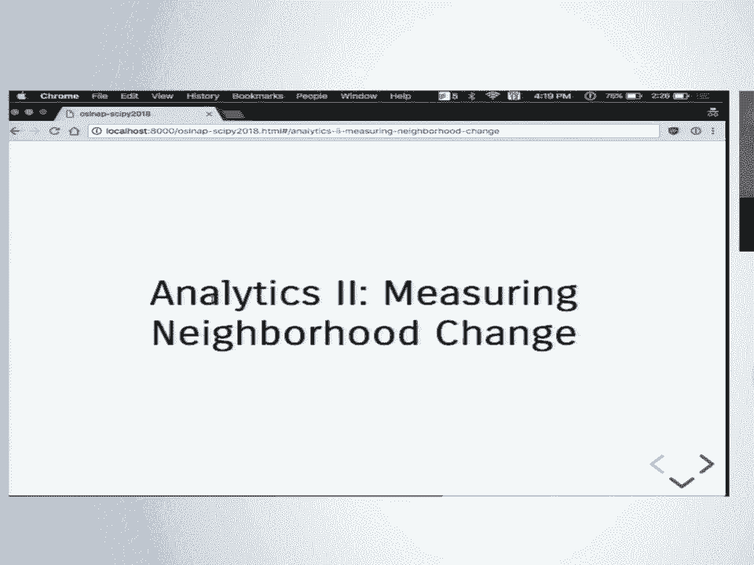

如今，我们常使用**地理人口统计**方法，通过聚类算法（如K-means）根据社会经济特征定义区域。但这种方法通常忽略空间连续性，结果可能像“泼洒的颜料”一样分散。

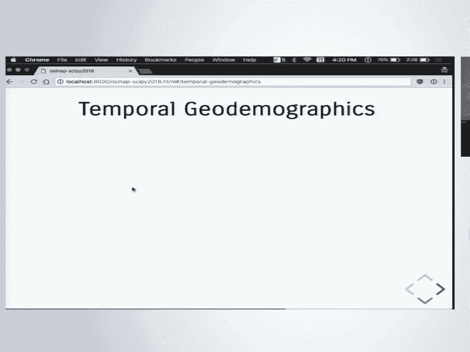

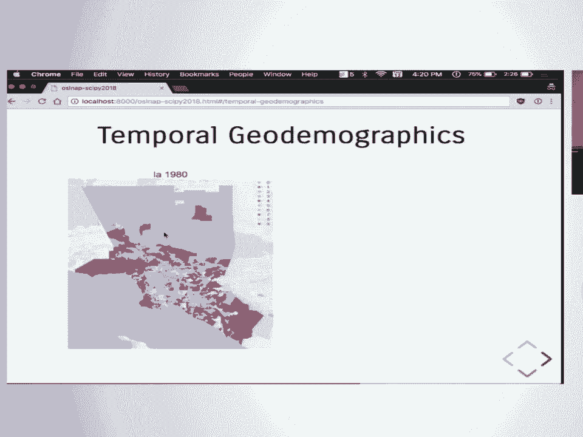

在OSLNAP中，我们开发的聚类算法力求在**属性同质性**和**空间连续性**之间取得平衡。这意味着生成的邻里区域不仅在特征上相似，在地理上也彼此相连，更符合人们对邻里的日常认知。

## 测量邻里动态变化

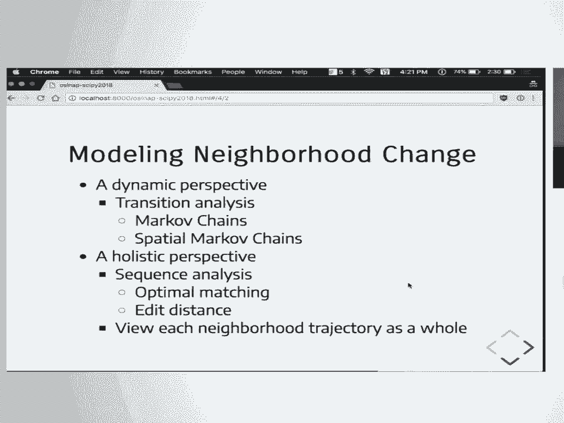

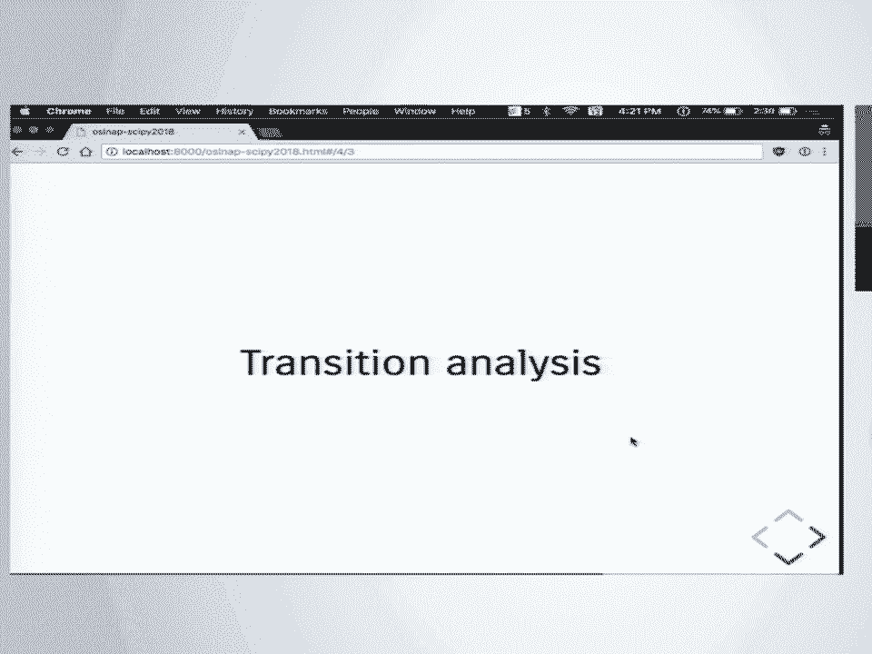

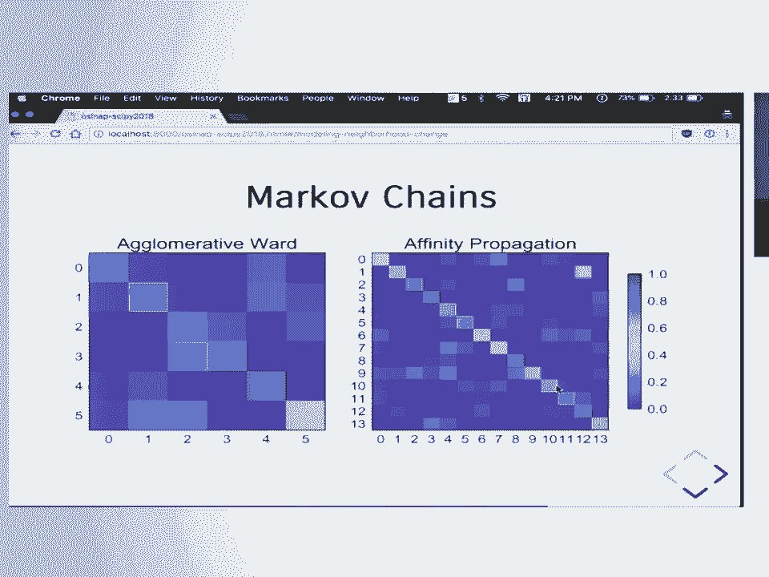

在识别出邻里之后，如何度量其随时间的变化呢？我们引入了**时序地理人口统计**的概念。

具体做法是，将所有时间点的普查区数据合并，并对整个面板数据集进行聚类分析。这样，同一个普查区在不同年份可能被归入不同的邻里类型。通过可视化，我们可以清晰看到哪些区域保持稳定，哪些区域发生了士绅化或贫困集聚等变化。


为了建模这种变化，我们探索了两种视角：
1.  **动态视角**：使用空间马尔可夫链，分析邻里类型转换的概率，并考虑其周边邻居类型的影响。公式可以表示为：
    `P(类型_t+1 | 类型_t, 邻居类型_t)`
    这有助于理解空间依赖性是否重要。
2.  **整体视角**：借鉴基因组学中的序列分析方法，将每个邻里的类型变化视为一个序列，通过计算序列间的距离来比较不同邻里的整体演变轨迹。


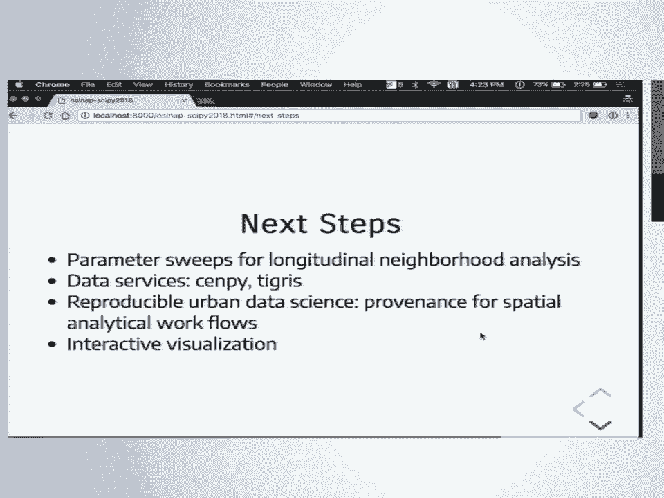

## 总结与展望

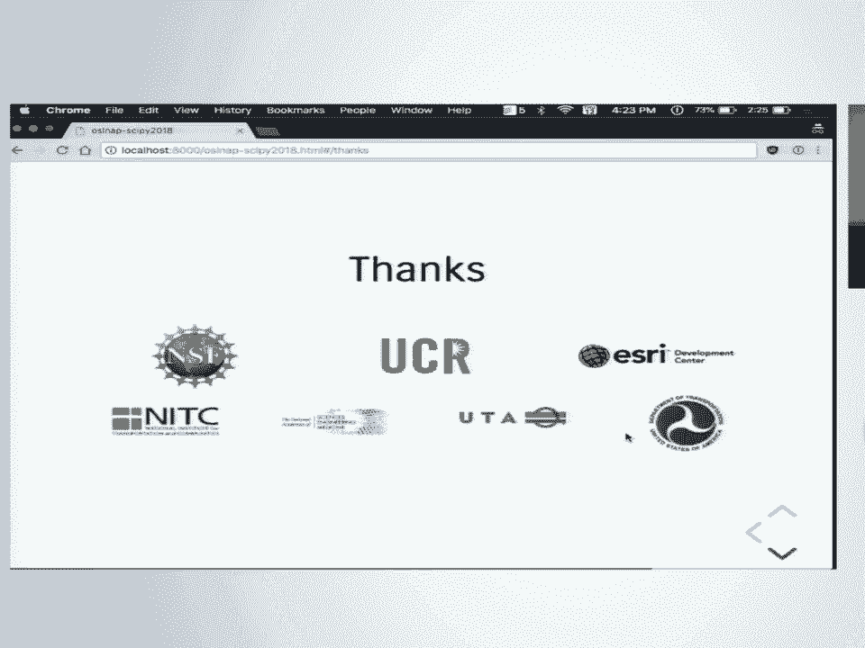

本节课中，我们一起学习了“社会经济邻里的时空分析”项目。我们探讨了邻里研究的重要性与现有挑战，介绍了旨在整合“效应”与“动态”文献的OSLNAP工具包。我们了解了其利用PySAL、GeoPandas等Python库构建的技术栈，并详细讲解了其在处理时空数据、定义连续性邻里以及度量动态变化方面的核心模块与方法。

该项目最终目标是建立一个开源、可复现的研究基础设施，供社会科学研究者及对区位分析感兴趣的人士使用。我们欢迎更多人加入，共同推进这一领域的发展。

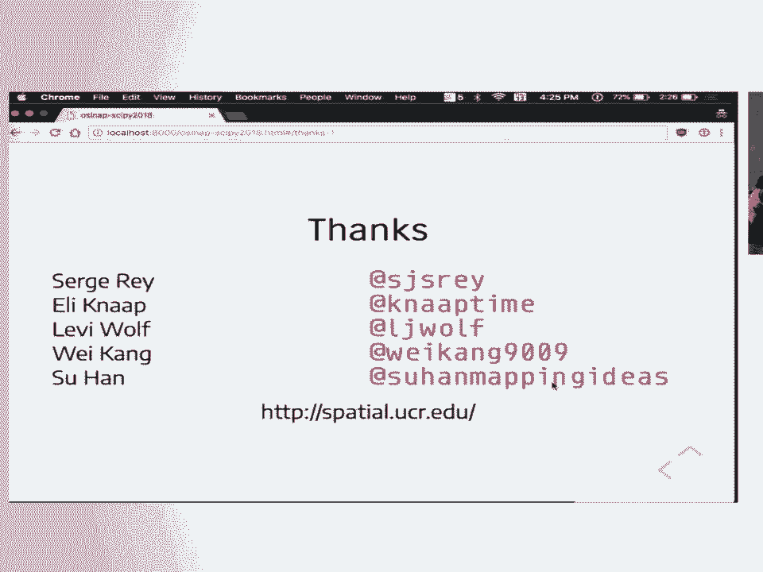

---
**项目信息**：
*   **名称**：开源纵向邻里分析包 (OSLNAP)
*   **团队**：Serge Rey, Eli Knapp, Wei Kang, Su Han, Eli Wolf
*   **资助**：美国国家科学基金会 (NSF)