# 69：Jupyter交互式小部件生态系统教程 🎛️

在本课程中，我们将学习如何使用Jupyter交互式小部件（IPyWidgets）来创建动态、可交互的数据界面。我们将从基础概念开始，逐步深入到高级应用，包括自定义小部件、事件处理、布局样式化，以及如何将小部件与其他强大的可视化库（如BQPlot、ipyvolume）结合使用。

---

## 概述 📋

Jupyter小部件是一个强大的框架，它允许你在Jupyter笔记本或JupyterLab中创建交互式用户界面。通过将Python代码与浏览器中的JavaScript前端连接起来，你可以构建滑块、按钮、下拉菜单等控件，并实时响应用户的交互来更新计算和可视化结果。

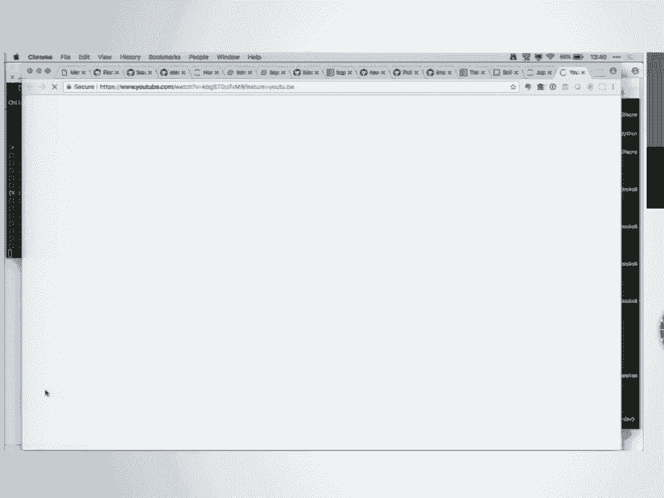

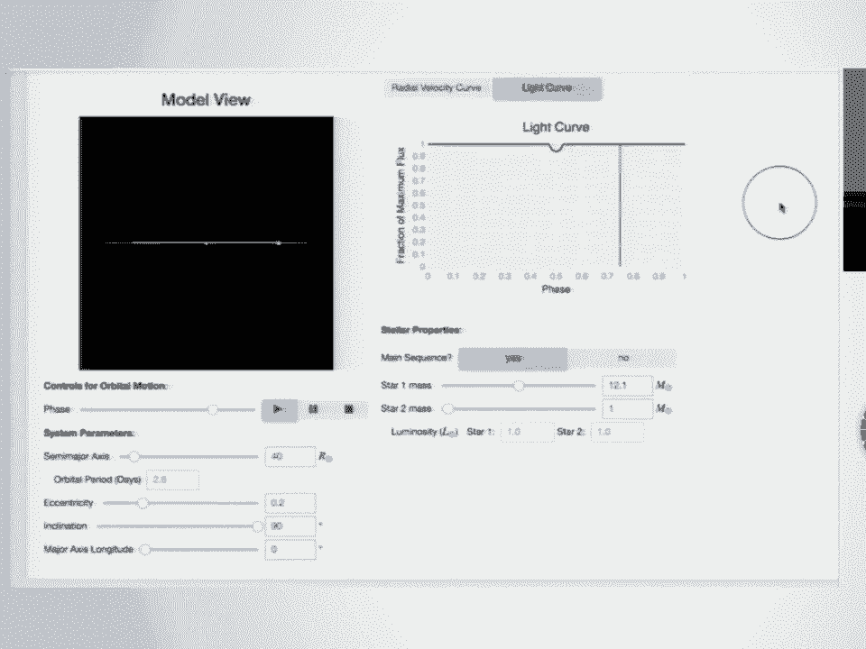

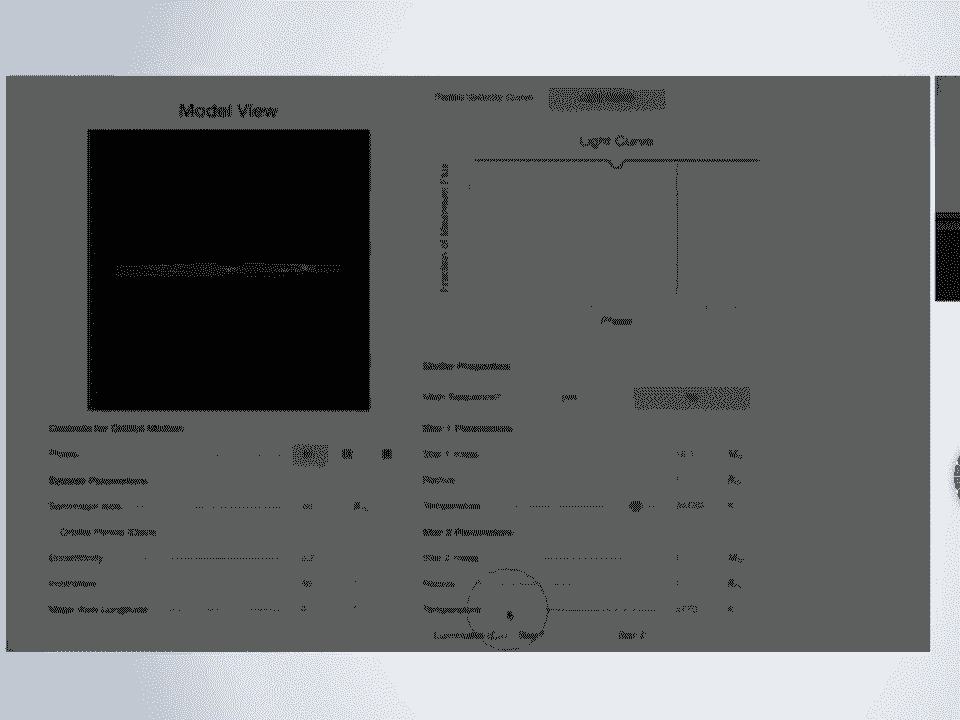

本节课我们将首先介绍`interact`和`interactive`这两个快速创建界面的工具，然后深入了解构成这些界面的基础小部件。我们将学习如何获取和设置小部件的值，如何链接小部件，以及如何处理小部件的事件。最后，我们会探索如何利用布局和样式来自定义小部件的外观，并了解一些基于IPyWidgets构建的高级库。

---

## 1. 快速入门：使用 `interact` 函数 🚀

上一节我们概述了小部件的强大功能，本节中我们来看看如何快速创建一个交互式界面。

`interact` 函数是IPyWidgets中最简单的工具。你只需要提供一个Python函数和一些关于函数参数的提示，它就会自动生成相应的图形用户界面控件。

```python
from ipywidgets import interact

def square(x):
    return x * x

interact(square, x=10)
```

在上面的代码中，`interact` 检测到参数 `x` 的默认值是整数 `10`，因此它自动创建了一个整数滑块。当你拖动滑块时，函数 `square` 会被调用，结果会实时显示在下方。

`interact` 也可以用作装饰器：

```python
@interact(x=10)
def square(x):
    return x * x
```

以下是 `interact` 的一些高级用法：

*   **固定参数**：使用 `fixed` 关键字来锁定某个参数的值。
*   **指定范围**：通过传递元组 `(min, max)` 或 `(min, max, step)` 来定义滑块的范围和步长。
*   **下拉菜单**：提供一个列表来创建下拉菜单。你甚至可以设置显示标签与实际传递值不同的选项。

```python
@interact(choice=[(‘选项一‘, 10), (‘选项二‘, 20)])
def f(choice):
    return choice * 3 # 选择“选项一”返回30，选择“选项二”返回60
```

`interact` 非常适合快速原型设计和教学演示，让你能专注于函数逻辑而非界面构建。

---

## 2. 基础小部件详解 🧱

上一节我们使用 `interact` 快速生成了界面，本节中我们来看看构成这些界面的基础小部件对象。

`interact` 在幕后创建了小部件。我们可以直接使用这些小部件类来获得更精细的控制。每个小部件（如滑块、文本框）都是一个Python对象，拥有属性和方法。

### 小部件的显示与状态
有两种方式显示小部件：
1.  在单元格的最后一行输入小部件变量名。
2.  使用 `display()` 函数。

```python
from ipywidgets import IntSlider, display

slider = IntSlider(value=5, min=0, max=10)
display(slider)
# 或者直接在单元格最后写：slider
```

你可以创建同一个小部件的多个“视图”，它们会同步更新：

```python
display(slider) # 视图1
display(slider) # 视图2
# 移动任意一个滑块，另一个也会移动
```

你可以通过Python代码获取或设置小部件的值：

```python
print(slider.value) # 获取当前值
slider.value = 7    # 设置新值
```

### 小部件的类型
IPyWidgets提供了丰富的小部件类型。以下是一些常用类别：

*   **数值输入**：`IntSlider`, `FloatSlider`, `IntRangeSlider`, `FloatText`
*   **布尔值**：`Checkbox`, `ToggleButton`
*   **文本**：`Text` (单行), `Textarea` (多行), `Label` (只读标签), `HTML` (显示HTML)
*   **选择器**：`Dropdown`, `RadioButtons`, `SelectMultiple`
*   **动作**：`Button`
*   **输出**：`Output` (用于捕获和显示输出)
*   **布局容器**：`HBox` (水平排列), `VBox` (垂直排列), `Tab`, `Accordion`

### 链接小部件
你可以将两个小部件的属性链接在一起，使它们保持同步。

*   `link`：在Python内核端建立双向链接。
*   `jslink`：在浏览器JavaScript端建立双向链接（无需内核往返，适合静态展示）。
*   `dlink` 和 `jsdlink`：建立单向链接。

```python
from ipywidgets import IntSlider, IntText, link

slider = IntSlider()
text = IntText()
# 将滑块的’value‘属性与文本框的’value‘属性链接
link_slider_text = link((slider, ‘value‘), (text, ‘value‘))
```

---

## 3. 处理小部件事件与交互 ⚡

上一节我们学会了创建和链接静态小部件，本节中我们来看看如何让它们“动起来”，即响应用户交互。

小部件的核心是**状态**和**状态变化**。我们可以监听小部件状态（如`value`）的变化，并触发相应的函数。

### 观察（Observe）模式
对于大多数小部件，使用 `observe` 方法来监听其属性的变化。

```python
from ipywidgets import IntSlider, Output
from IPython.display import display

slider = IntSlider()
out = Output()

def on_value_change(change):
    # change 是一个字典，包含 ‘new‘, ‘old‘, ‘name‘, ‘owner‘ 等信息
    with out:
        print(f“值从 {change[‘old‘]} 变为 {change[‘new‘]}“)

# 监听 ‘value‘ 属性的 ‘change‘ 事件
slider.observe(on_value_change, names=‘value‘)

display(slider, out)
```

当你拖动滑块时，每次值的变化都会触发 `on_value_change` 函数，并在输出区域打印信息。

### 按钮的点击事件
按钮 (`Button`) 是一个特例，它有一个专门的 `on_click` 方法。

```python
from ipywidgets import Button, Output

button = Button(description=“点击我“)
out = Output()

def on_button_clicked(b):
    with out:
        print(“按钮被点击了！“)

button.on_click(on_button_clicked)
display(button, out)
```

**重要提示**：在JupyterLab中，回调函数内的 `print` 输出默认不会显示在笔记本中，必须使用 `Output` 小部件来捕获。`@out.capture()` 装饰器可以简化这个过程。

### 控制更新频率
对于滑块等控件，默认是“连续更新”模式，即拖动过程中每帧都触发回调。对于计算量大的函数，这可能导致卡顿。你可以通过以下方式控制：

1.  **设置 `continuous_update=False`**：只在释放鼠标时才触发更新。
2.  **使用 `interact_manual`**：生成一个“运行”按钮，点击后才执行函数。

---

## 4. 自定义小部件外观：布局与样式 🎨

上一节我们实现了小部件的交互逻辑，本节中我们来看看如何美化界面，控制小部件的排列和外观。

每个小部件都有两个重要属性用于控制外观：`layout` 和 `style`。

### 布局 (`layout`)
`layout` 属性控制小部件外部的“容器框”，例如尺寸、边距、边框等。它本质上暴露了CSS的Flexbox和Grid布局模型。

你可以直接传递一个字典来设置布局：

```python
from ipywidgets import Button, Layout

layout = Layout(width=‘50%‘, height=‘80px‘, border=‘2px dotted blue‘)
button = Button(description=“带样式的按钮“, layout=layout)
display(button)
```

**Flexbox布局**：通过设置 `display=‘flex‘`、`flex_flow=‘row‘`（或 `’column‘`）以及 `justify_content`、`align_items` 等属性，可以创建灵活、自适应的布局。例如，让一组按钮按比例分配剩余空间：

```python
from ipywidgets import HBox, Button, Layout

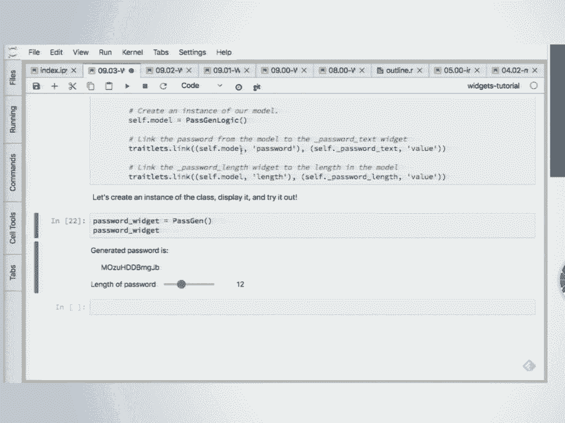


# 按钮1占1份，按钮2占3份，按钮3占1份
layout = Layout(display=‘flex‘, flex_flow=‘row‘, justify_content=‘space-between‘)
buttons = [Button(layout=Layout(flex=‘1‘)), Button(layout=Layout(flex=‘3‘)), Button(layout=Layout(flex=‘1‘))]
HBox(buttons, layout=layout)
```

### 样式 (`style`)
`style` 属性控制小部件内部元素的样式，这些样式因小部件类型而异。例如，对于有描述文本的控件，可以调整描述宽度；对于按钮，可以改变颜色。

```python
from ipywidgets import IntSlider

slider = IntSlider(description=“一个很长的描述文本可能会被截断“)
# 将描述宽度设置为 ‘initial‘，让浏览器根据文本自动决定宽度
slider.style.description_width = ‘initial‘
display(slider)
```

你可以通过 `widget.style.keys` 查看该小部件支持的所有样式属性。

---

## 5. 构建应用：密码生成器示例 🔐

上一节我们学习了布局和样式，本节中我们将综合运用所学知识，构建一个完整的简单应用——密码生成器。

我们将遵循“模型-视图”分离的设计模式，使代码更清晰、易于测试。

1.  **模型 (Model)**：负责核心逻辑（生成密码）。它使用 `traitlets` 库来定义可观察、可验证的属性。
2.  **视图 (View/GUI)**：负责用户界面（滑块、文本框等）。它继承自 `VBox` 等容器小部件。
3.  **控制器 (Controller)**：将模型和视图连接起来，通常使用 `link` 或 `observe` 来同步状态。

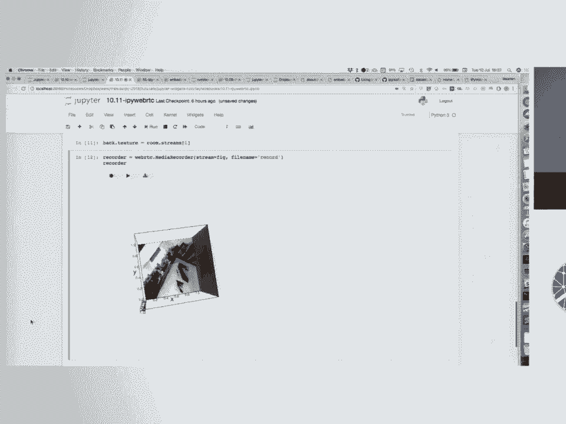


**核心代码结构示例**：

```python
from ipywidgets import VBox, IntSlider, Text, Label, link
import traitlets
import secrets
import string

# 1. 模型
class PasswordModel(traitlets.HasTraits):
    length = traitlets.Int(default_value=8, min=1, max=50).tag(sync=True)
    password = traitlets.Unicode().tag(sync=True)

    @traitlets.observe(‘length‘)
    def _generate_password(self, change):
        alphabet = string.ascii_letters + string.digits + string.punctuation
        self.password = ‘‘.join(secrets.choice(alphabet) for _ in range(self.length))

# 2. 视图
class PasswordGUI(VBox):
    def __init__(self):
        super().__init__()
        self.label = Label(value=“密码长度：“)
        self.slider = IntSlider(value=8, min=1, max=50)
        self.output = Text(value=‘‘, description=‘密码：‘, disabled=True)
        self.children = [self.label, self.slider, self.output]

# 3. 连接
model = PasswordModel()
gui = PasswordGUI()

# 将视图滑块与模型长度属性链接
link((gui.slider, ‘value‘), (model, ‘length‘))
# 将模型密码属性与视图文本框链接
link((model, ‘password‘), (gui.output, ‘value‘))

display(gui)
```

这个例子展示了如何构建一个结构清晰、可维护的小部件应用。当用户拖动滑块时，模型中的 `length` 属性变化，触发密码生成，新密码再同步回GUI的文本框中。

---

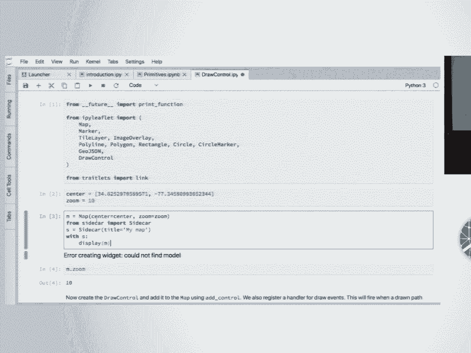

## 6. 高级扩展：生态系统的力量 🌐

Jupyter小部件不仅限于内置的基础控件，其真正的力量在于丰富的生态系统。许多强大的可视化库都基于IPyWidgets框架构建，提供了可直接在笔记本中使用的交互式组件。

### BQPlot 📊
一个基于D3.js的交互式绘图库，采用“图形语法”理念。它提供了类似Matplotlib的高级API，但生成的是可交互的图表（缩放、平移、选择数据点）。


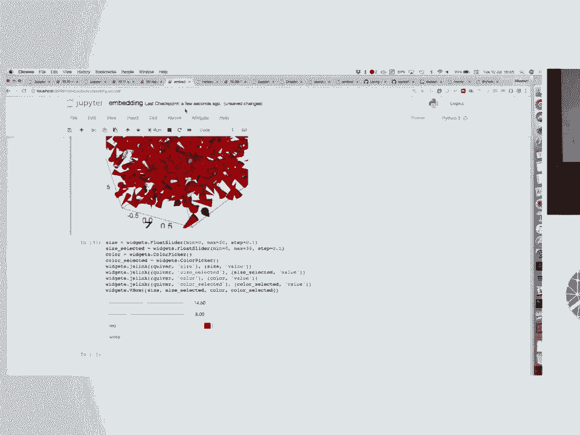

```python
import bqplot.pyplot as plt
import numpy as np

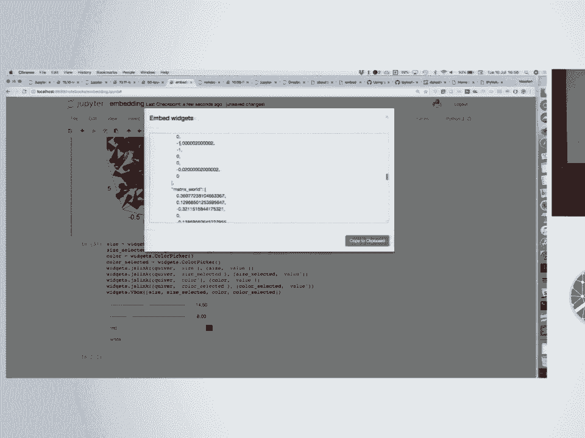

x = np.linspace(-10, 10, 100)
y = np.sin(x)
fig = plt.figure(title=‘交互式正弦波‘)
plt.plot(x, y)
fig
```

### ipyvolume 🌌
一个用于在Jupyter中实现3D可视化的库，支持WebGL，性能出色。可以绘制散点图、曲面图、体绘制等，并支持与控件交互。

```python
import ipyvolume as ipv
import numpy as np

x, y, z = np.random.random((3, 1000))
fig = ipv.figure()
scatter = ipv.scatter(x, y, z, size=5, marker=‘sphere‘)
ipv.show()
```

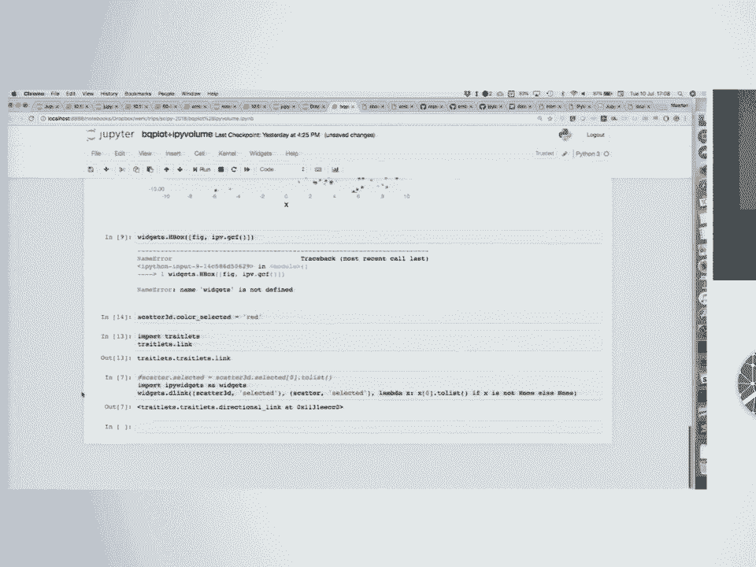

### ipyleaflet 🗺️
一个交互式地图库，基于Leaflet.js。可以添加图层、标记、绘制形状，并轻松获取地理坐标信息。

```python
from ipyleaflet import Map, Marker

m = Map(center=(52.204793, 360.121558), zoom=4)
marker = Marker(location=(52.204793, 360.121558))
m.add_layer(marker)
m
```

### 部署与分享
你创建的小部件应用可以脱离笔记本环境运行：
*   **嵌入HTML**：使用 `widgets.embed` 将小部件状态嵌入静态HTML文件。
*   **使用 `ipywidgets-server`**：这是一个轻量级服务器，可以单独运行你的小部件应用，并提供一个安全的、无完整笔记本界面的访问方式。


这些库都共享IPyWidgets的通信框架，意味着你可以轻松地将它们组合在一起，例如用一个BQPlot图表的选择区域来控制一个ipyvolume 3D视图的显示，创造出复杂而连贯的数据探索体验。

---

## 总结 🎉

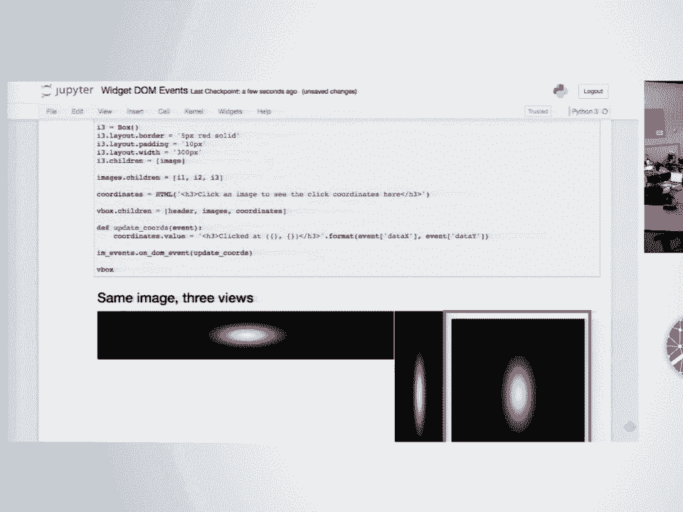

在本节课中，我们一起学习了Jupyter交互式小部件生态系统的核心内容：

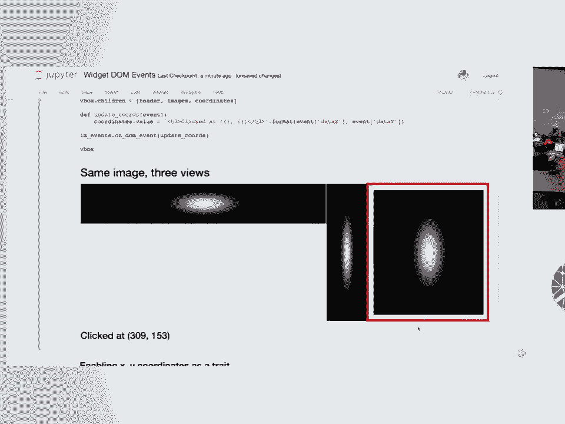

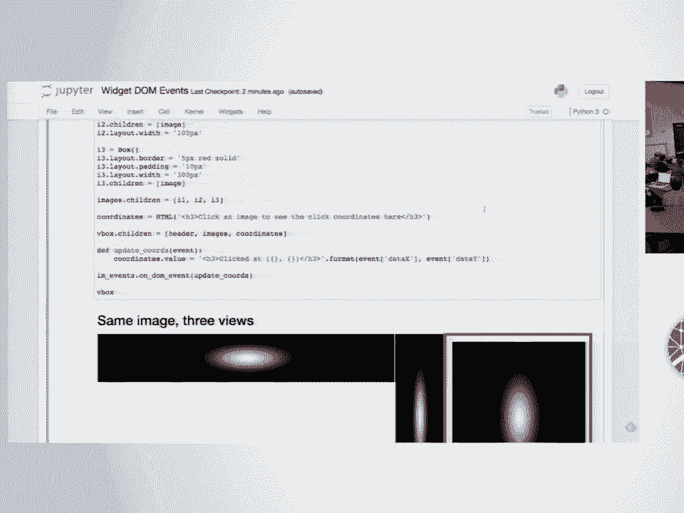

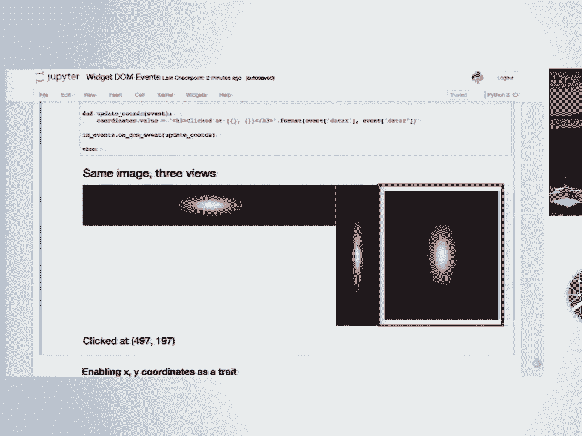

1.  **快速启动**：使用 `interact` 和 `interactive` 函数，无需深入细节即可创建交互界面。
2.  **基础构建**：认识了各种基础小部件，学会了如何显示、获取/设置值以及链接它们。
3.  **交互逻辑**：掌握了通过 `observe` 和 `on_click` 监听小部件事件，并执行自定义回调函数。
4.  **界面美化**：使用 `layout` 和 `style` 属性来控制小部件的排列、尺寸和视觉样式。
5.  **应用架构**：实践了构建一个结构清晰的密码生成器应用，理解了模型-视图分离的思想。
6.  **生态扩展**：了解了BQPlot、ipyvolume、ipyleaflet等基于IPyWidgets的强大库，以及如何部署和分享小部件应用。

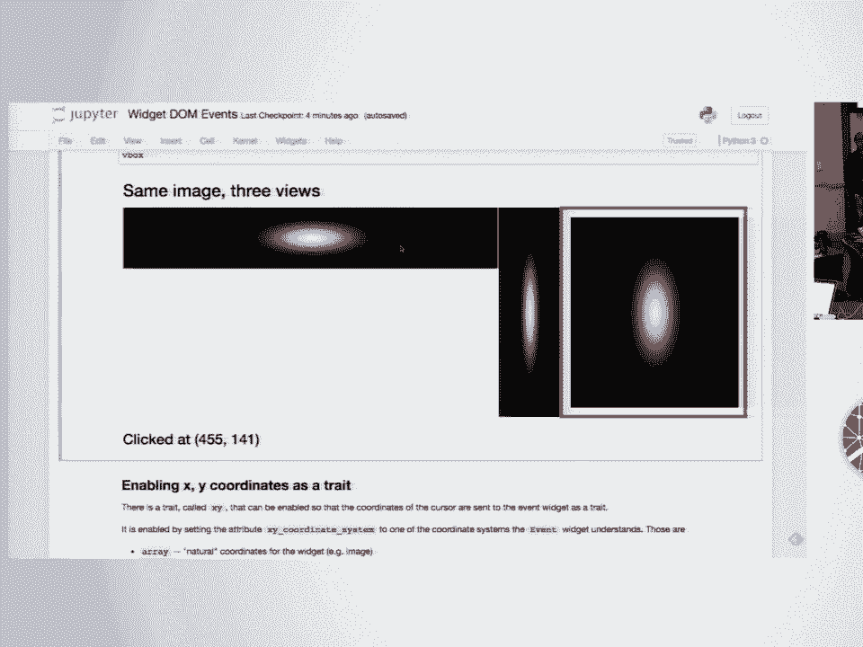

通过小部件，你可以将静态的Jupyter笔记本转变为动态的、探索性的计算环境，极大地增强了数据分析和科学交流的能力。现在，你可以开始构建自己的交互式工具了！