# 71：UMAP 降维算法详解 🧠

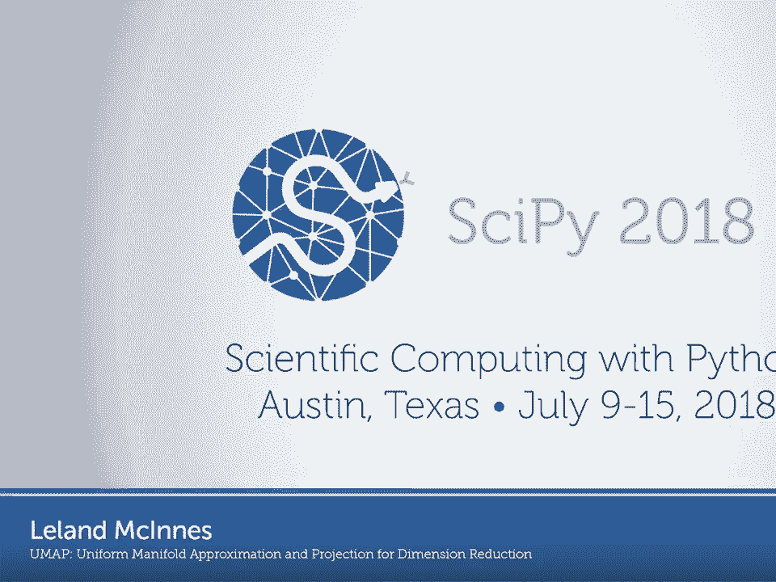

在本节课中，我们将学习一种名为 UMAP（均匀流形逼近与投影）的降维技术。我们将从降维的基本概念出发，逐步探讨 UMAP 背后的数学原理、其与现有方法的对比，以及它的实际应用和优势。

---

## 什么是降维？

降维的目标是发现数据中的潜在特征。这很重要，原因有三：特征工程是关键；可视化很重要，如果能将数据降至二维或三维，就能直观地观察数据；数据中的许多维度往往是冗余的，剔除冗余可以改善包括后续机器学习算法在内的许多方面。

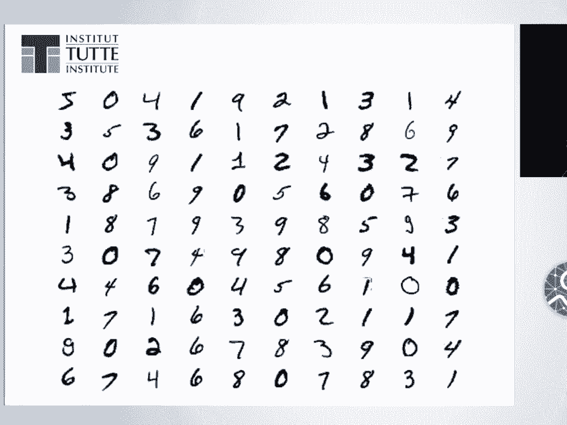

例如，MNIST 手写数字数据集是 784 维的，但我们并不需要这么多维度来描述其中的一个数据点。应该存在一种更紧凑的表示方式。同样，Fashion MNIST 数据集也是 784 维的，虽然比 MNIST 更具挑战性，但我们仍然应该能够将其压缩到更少的维度，同时保留有意义的特征。

---

## 降维的两种主要技术

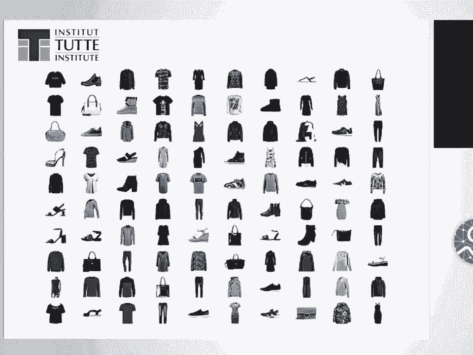

降维技术主要分为两类：矩阵分解和近邻图方法。

矩阵分解方法包括主成分分析（PCA）、Word2Vec 和潜在狄利克雷分配等。这些方法的具体实现取决于分解的矩阵和损失函数的定义。

近邻图方法则衍生出 Isomap、t-SNE 等一系列算法。它们都建立在相同的基础架构之上。

上一节我们介绍了降维的目标，本节中我们来看看两种主流的技术路径。

---

### 矩阵分解的代表：PCA

PCA 是典型的矩阵分解算法。在 MNIST 数字上运行 PCA，并按数字类别为点着色，可以看到它捕捉了大量的全局结构。零和一被分离开，中间是不同数字的平滑过渡。全局结构保留得很好，并且主成分具有可解释性，它们代表了数据中方差最大的方向。

在 Fashion MNIST 上运行 PCA，也能得到类似的结果，它捕捉了大量的全局结构，并在一定程度上分离出了一些组别。

---

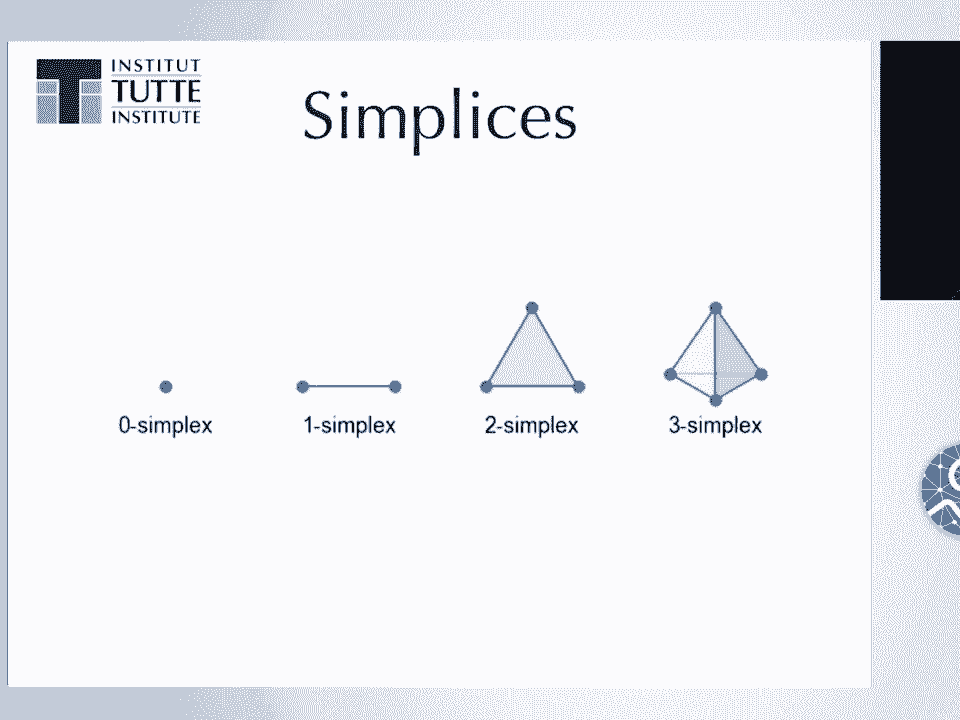

### 近邻图方法的代表：t-SNE

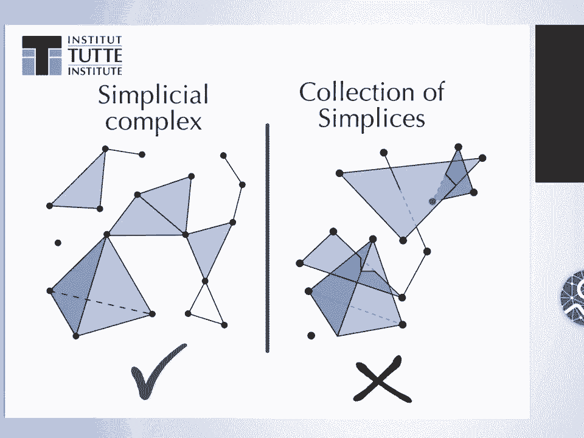

t-SNE 是基于近邻图的算法中的先进代表。它在 MNIST 上产生的结果与 PCA 截然不同。t-SNE 捕捉的是局部结构而非全局结构，这意味着它将所有数字清晰地分离成一个个独立的组。

在 Fashion MNIST 上使用 t-SNE，同样能出色地通过构建局部近邻图来分离不同类别。

---

## UMAP：为近邻图方法奠定数学基础

UMAP 是我尝试将基于近邻图的方法置于坚实数学基础之上的成果。我对数学方面很感兴趣，因此 UMAP 在背后构建了一些数学理论来真正证明这些基于图的方法的合理性。

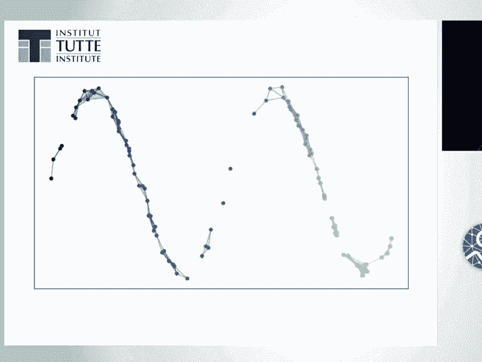

我将略过一些复杂的数学细节，主要提供直观的描述。如果你对数学细节感兴趣，可以在课后找我深入讨论。

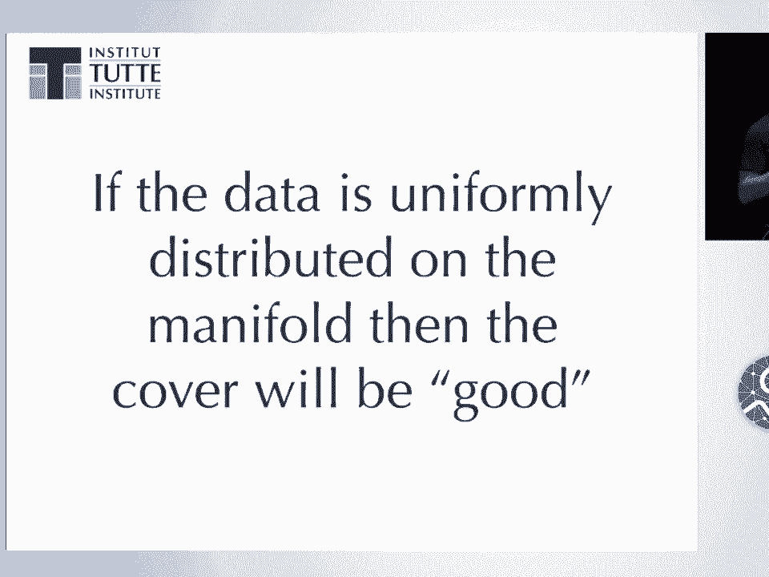

---

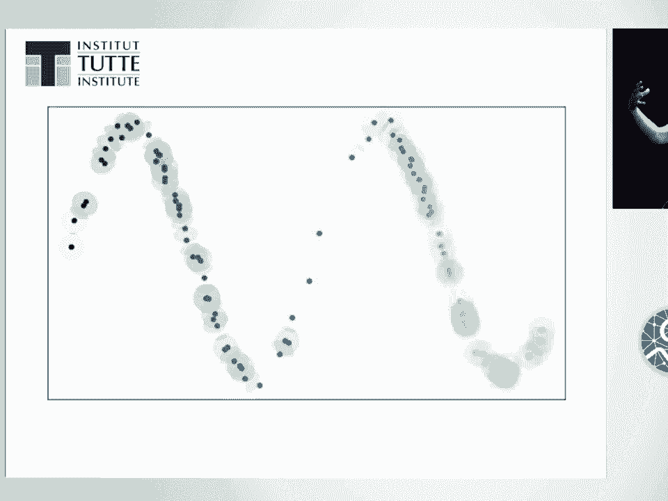

### 拓扑数据分析简介

首先，我们需要了解一点拓扑数据分析。拓扑学的目标之一是使用单纯形这种简单组合结构来表示拓扑空间的一部分。关键在于，我们可以将它们粘合成复形，从而构建出几乎所有在数据分析中会遇到的拓扑空间。

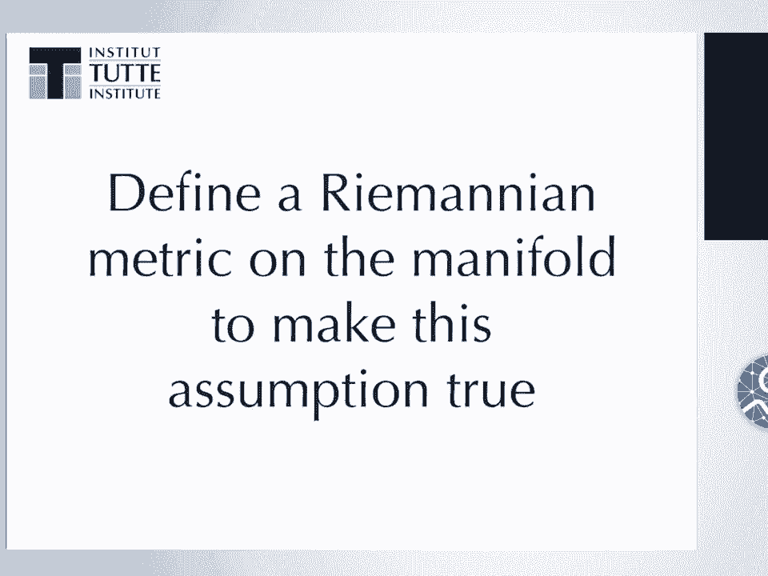

这意味着，我们可以将连续且复杂的拓扑对象，转化为简单、可组合的对象，同时保留所有重要的拓扑信息。

---

### 从数据构建单纯复形

让我们看一个数据示例。假设数据分布在一个流形上。我们的目标是从数据点构建一个单纯复形。

我们从构建一个覆盖开始：在每个数据点上放置一个开球，覆盖整个流形。然后，取这个覆盖的神经，得到一个单纯复形。具体来说，如果覆盖中的两个开集有重叠，就形成一个 1-单纯形（边）；如果三个开集有重叠，就形成一个 2-单纯形（面），依此类推。

理论上，这应该能很好地恢复流形的拓扑结构。但在实践中，如果数据在流形上不是均匀分布的，这个覆盖就不够好，会导致复形中出现间隙和团块。

---

### 关键假设：均匀分布

为了使数学理论完美工作，我们需要假设数据在流形上是均匀分布的。但真实数据很少如此规整。不过，作为数学家，我们可以先假设这是成立的。

这个均匀分布假设对流形本身有实际影响。这意味着我们需要在流形上定义一个黎曼度量，使得这个假设神奇地成立。本质上，我们将在流形的不同区域改变距离的概念，使得每个点处的单位球在流形度量下大小相同，尽管在外部欧几里得空间中看起来大小不同。

---

### 从固定半径到模糊覆盖

为什么选择固定半径？我们其实可以让半径根据我们对数据点置信度的模糊概念而变化。这可以通过模糊拓扑来实现，构建一个模糊覆盖。

有一系列数学定理（涉及经典代数拓扑和范畴论）可以严谨地定义如何做到这一点。最终，我们会得到一个模糊的覆盖，其中集合的隶属度随着距离增加而衰减。

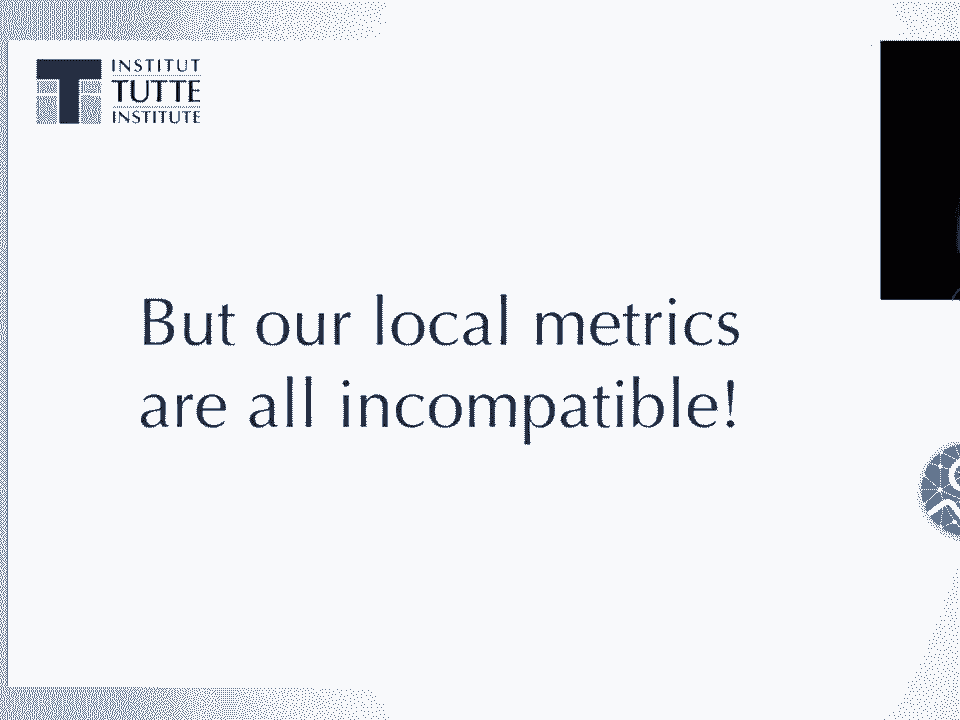

---

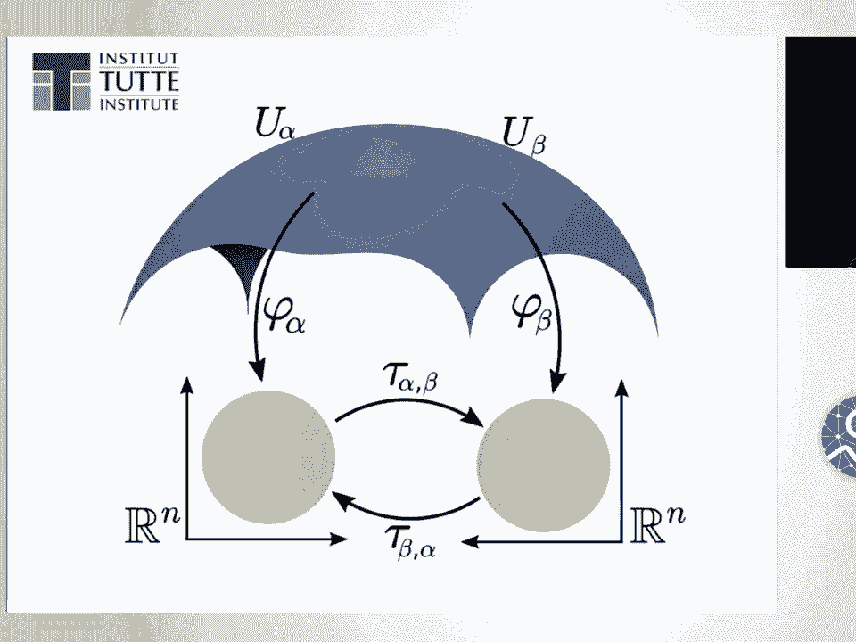

### 局部连通性假设

我们还需要一个假设：流形是局部连通的。这意味着流形不能有完全孤立的点，这是一个从拓扑角度看非常合理的假设。

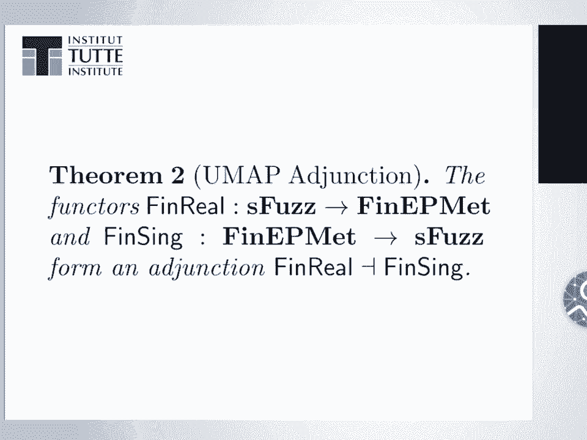

在实践中，这意味着我们应该对到第一个最近邻的距离有完全的信心，然后从那里开始模糊衰减。这个假设还有一个额外的好处：它有助于缓解“维度灾难”问题。

在高维空间中，所有点之间的距离都大致相同，距离分布非常集中。但如果我们应用局部连通性假设并进行归一化，距离分布就会变得像低维情况一样平滑。

---

### 整合不一致的局部度量

我们面临一个新问题：所有局部度量可能互不兼容。在理想的流形理论中，我们有重叠区域之间的映射。但在实践中，我们只有有限数据，缺少这些映射信息。

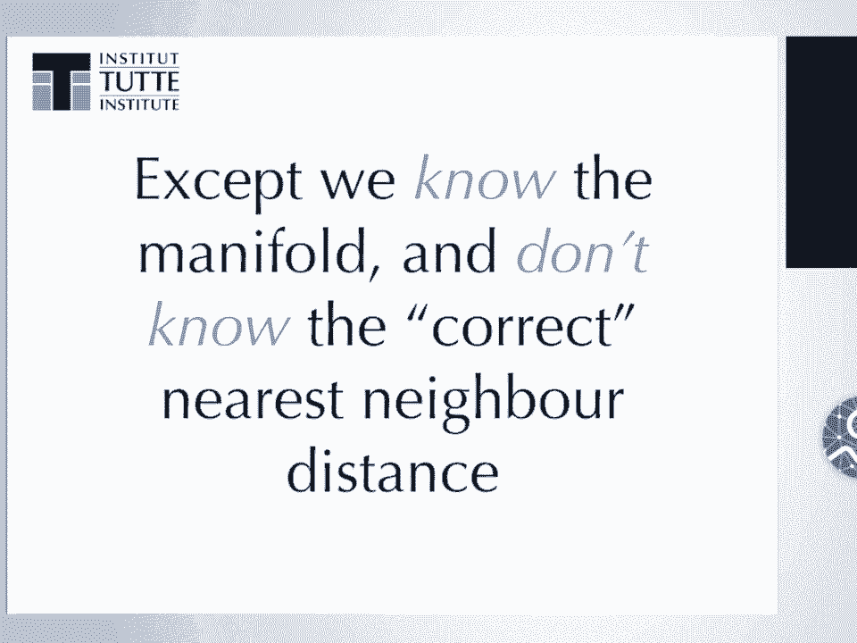

这导致在构建图时，任意两点之间可能存在多条具有不同权重的边。如何将所有不同的度量空间粘合起来，形成一个一致的整体？

数学再次提供了解决方案。有一个定理证明，我们可以将所有东西转化为模糊单纯集（每个数据点一个），然后通过取模糊并集将它们粘合起来。

在实践中，对于图中的边权重，我们使用以下公式进行组合：
`combined_weight = weight_a + weight_b - weight_a * weight_b`
这看起来很奇特，但如果我们把边的权重视为该边存在的概率，那么这个公式表示的是“边A存在或边B存在”的联合概率，这在概率意义上是合理的。

经过所有这些步骤，我们得到了一个理论上论证充分的图。

---

### 寻找低维表示

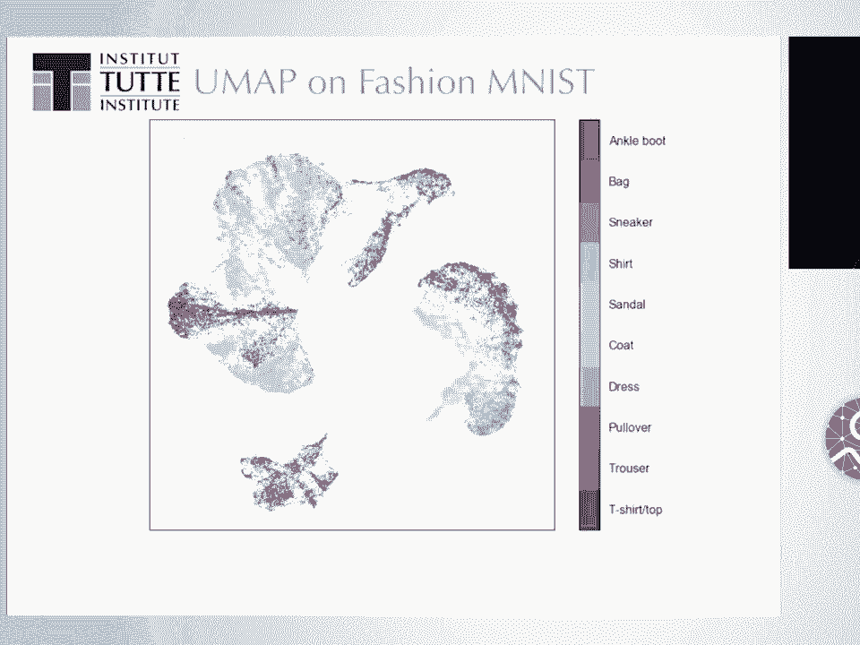

现在，我们需要这个图的低维表示。假设我们有一个数据的低维表示，我们可以对其应用相同的过程，得到一个模糊图。但这次情况不同：因为我们知道目标流形（例如二维空间 R²），但我们不知道用于局部连通性的正确最近邻距离，这需要作为一个超参数传入。

这样，我们得到了两个模糊图（高维和低维）。我们可以使用交叉熵来衡量两个图之间的距离，然后通过优化来获得低维布局。

交叉熵损失函数包含两项：一项确保“团块”正确（类似于 t-SNE 中的吸引力项），另一项确保“间隙”正确（类似于排斥力项）。这本质上是一种特定形式的力导向图布局算法。

---

### UMAP 的实际效果

在 MNIST 数字上应用 UMAP，可以看到它像 t-SNE 一样清晰地区分了不同的数字类别，同时也因为“确保间隙正确”的项而具有 PCA 的一些精神，能够根据更全局的结构展开数据团块。

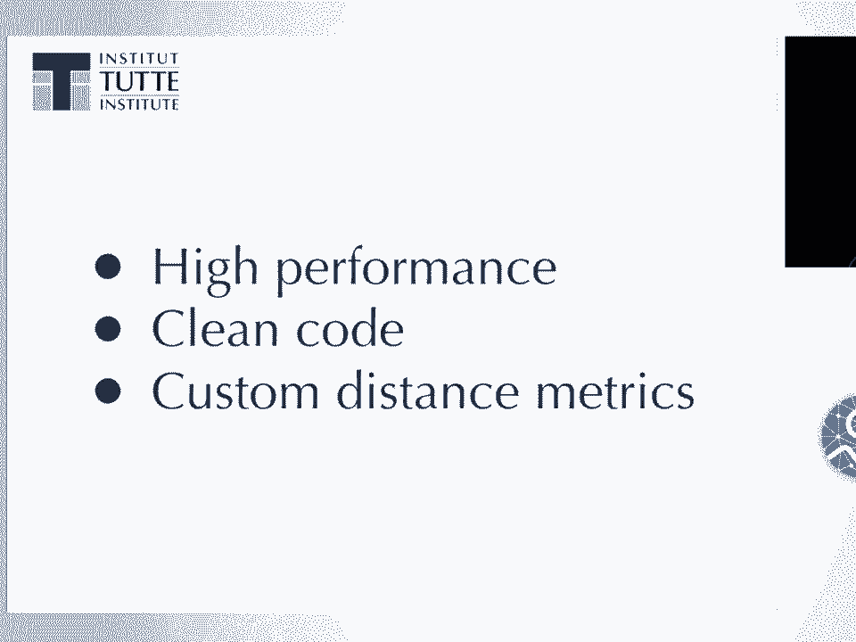

在 Fashion MNIST 上，UMAP 同样出色地识别出不同类别，并且对类别之间的差异有更好的理解，例如鞋类都被清晰地分离出来。

---

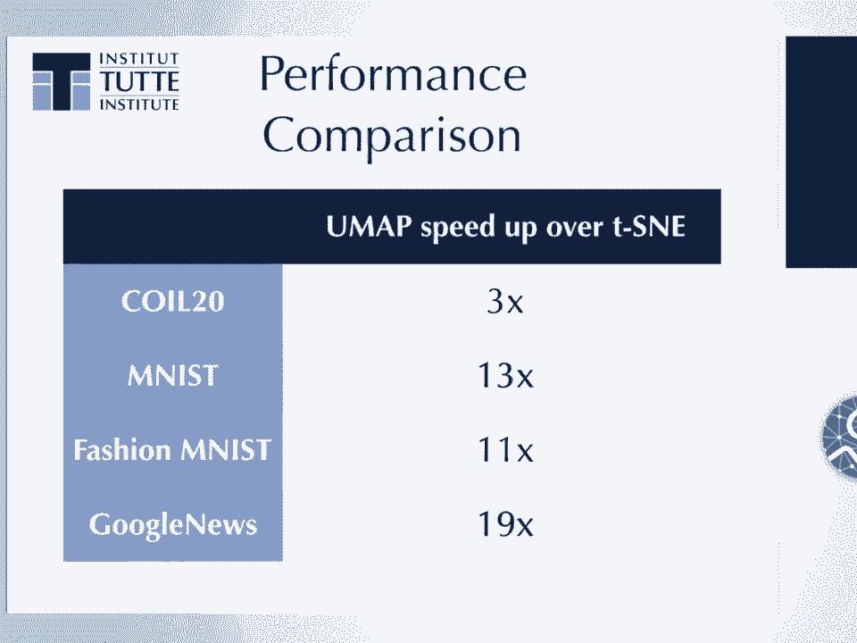

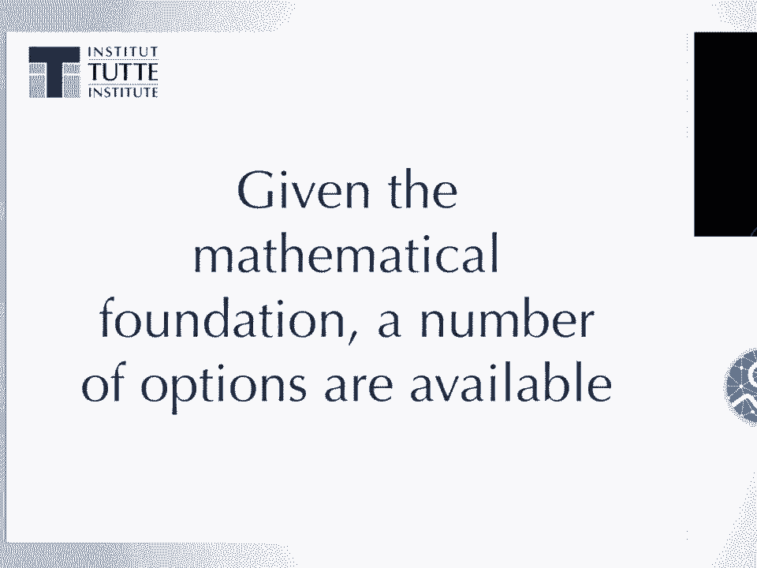

## 实现细节与性能

复杂的数学理论能转化为实用的算法吗？答案是肯定的。

我们需要快速找到高维空间中的近似最近邻。这可以通过随机投影树和最近邻下降等高效算法实现。

我们需要快速优化低维布局。这可以通过随机梯度下降以及借鉴 Word2Vec 和 LargeVis 的负采样技巧来实现，使其非常高效。一个额外的好处是，这允许我们将数据嵌入到任意维度的空间中，而 t-SNE 主要适用于二维或三维。

为了实现高性能，UMAP 的实现使用了 Numba（一个将 Python 代码实时编译到 LLVM 的编译器）。这使得数值计算部分非常快，同时代码保持简洁。用户甚至可以自定义距离函数，只要该函数能被 Numba 编译，就可以传入并使用，且性能无损。

以下是 UMAP 与 t-SNE（多核）在运行时间上的对比。随着数据量增大，UMAP 的速度优势越来越明显。对于包含 300 万个词向量的 Google News 数据集，UMAP 只需几小时，而 t-SNE 则需要许多天。

---

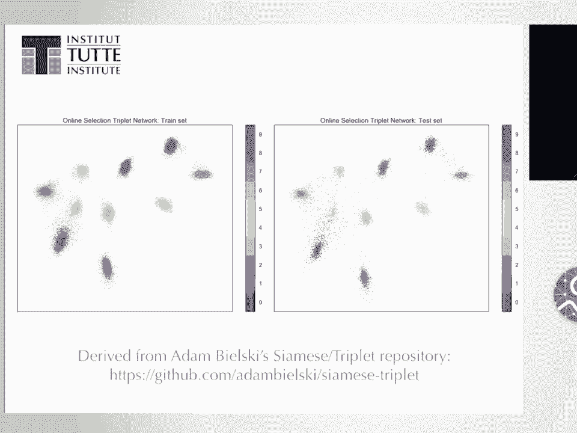

## UMAP 的扩展与应用

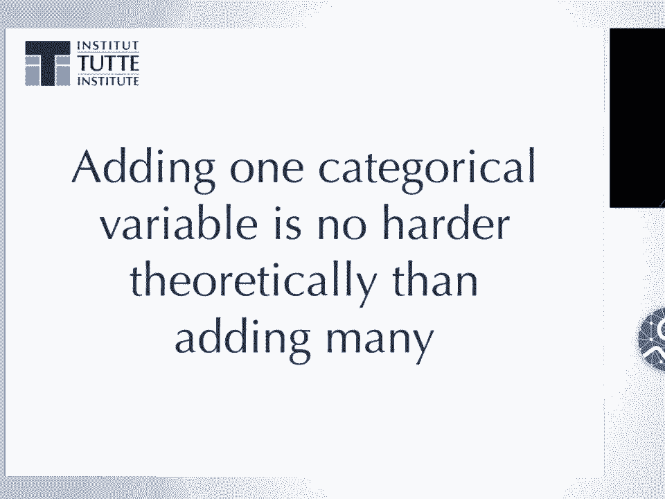

坚实的数学基础为 UMAP 带来了许多泛化和扩展的机会。

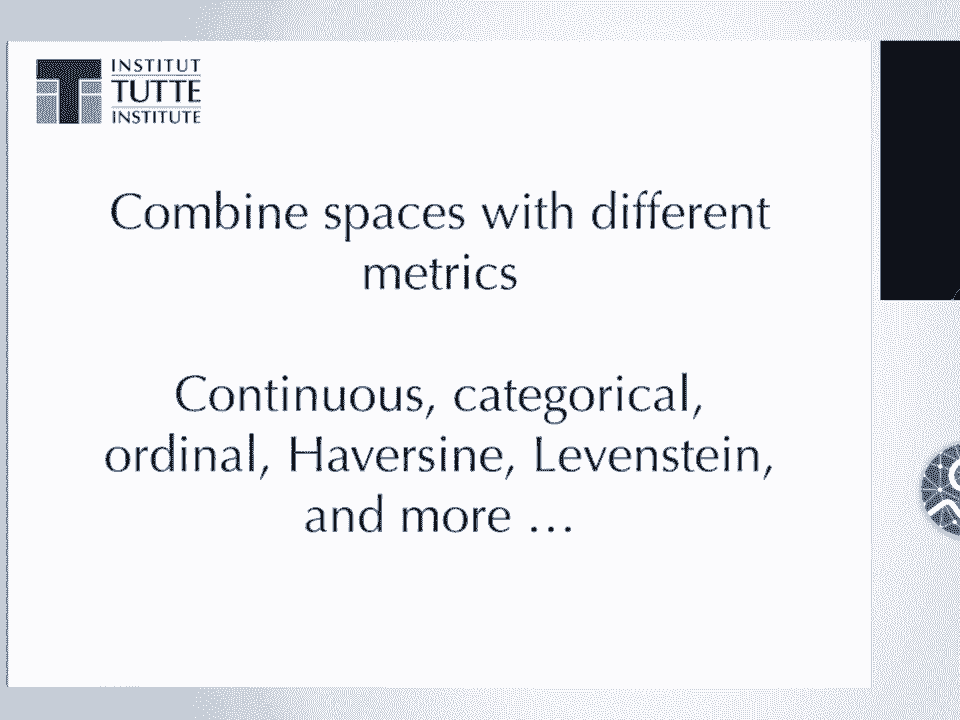

**1. 嵌入新数据点**
我们可以将新的、未见过的数据点嵌入到现有的 UMAP 嵌入中。这使得 UMAP 可以与标准的 Scikit-learn 管道兼容，只需使用 `transform` 方法即可。

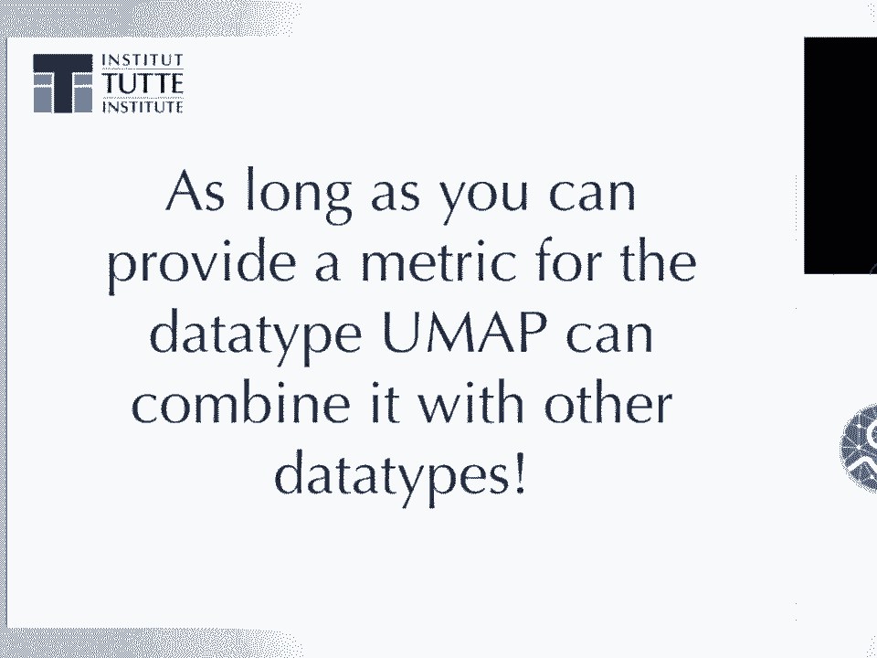

**2. 监督降维**
我们可以利用标签信息进行监督降维。在提供标签信息后，UMAP 能够更清晰地区分类别，同时保留每个类别内部的精细结构以及全局结构。

**3. 度量学习**
结合以上两点，可以进行一种形式的度量学习。UMAP 在监督模式下可以从训练集学习一个度量空间，并将新的测试数据干净地嵌入其中，同时保留簇内结构和全局结构。与三元组网络等方法相比，UMAP 在保留簇内结构方面可能具有优势。

**4. 处理混合数据类型**
从理论上讲，添加一个分类变量（如标签）与添加多个变量没有本质区别。我们可以为任何不同类型的数据集构建模糊单纯集。这意味着我们可以组合具有不同度量的空间：连续数据、分类数据、序数数据、使用半正矢公式度量的经纬度数据、使用莱文斯坦距离度量的稀疏数据等。只要能为某种数据类型提供一个度量，UMAP 就可以在原则上将其与其他数据类型结合起来。这意味着，理论上 UMAP 可以处理通用的 Pandas DataFrame。

---

## 总结

本节课中，我们一起学习了 UMAP 降维算法。我们从降维的基本概念出发，对比了矩阵分解（如 PCA）和近邻图方法（如 t-SNE）的差异。然后，我们深入探讨了 UMAP 的核心思想：通过拓扑数据分析的理论，假设数据在流形上均匀分布并局部连通，从而构建一个理论上严谨的模糊单纯复形来表示高维数据结构，并通过优化交叉熵损失将其投影到低维空间。

UMAP 不仅继承了 t-SNE 捕捉局部结构的优点，还能更好地保留全局结构，并且具有更快的计算速度和更强的可扩展性。其坚实的数学基础还支持嵌入新数据、监督降维、度量学习以及处理混合数据类型等强大功能。

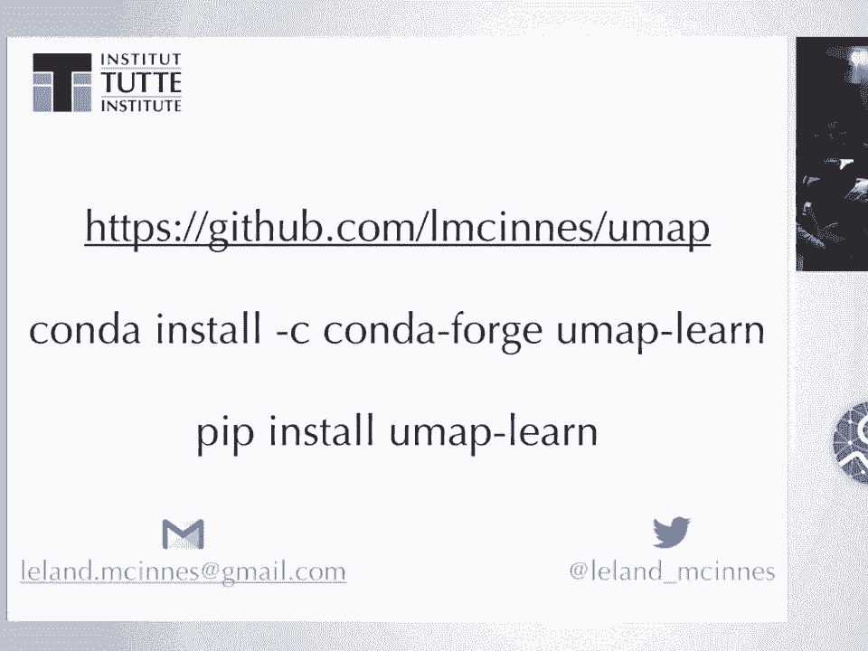

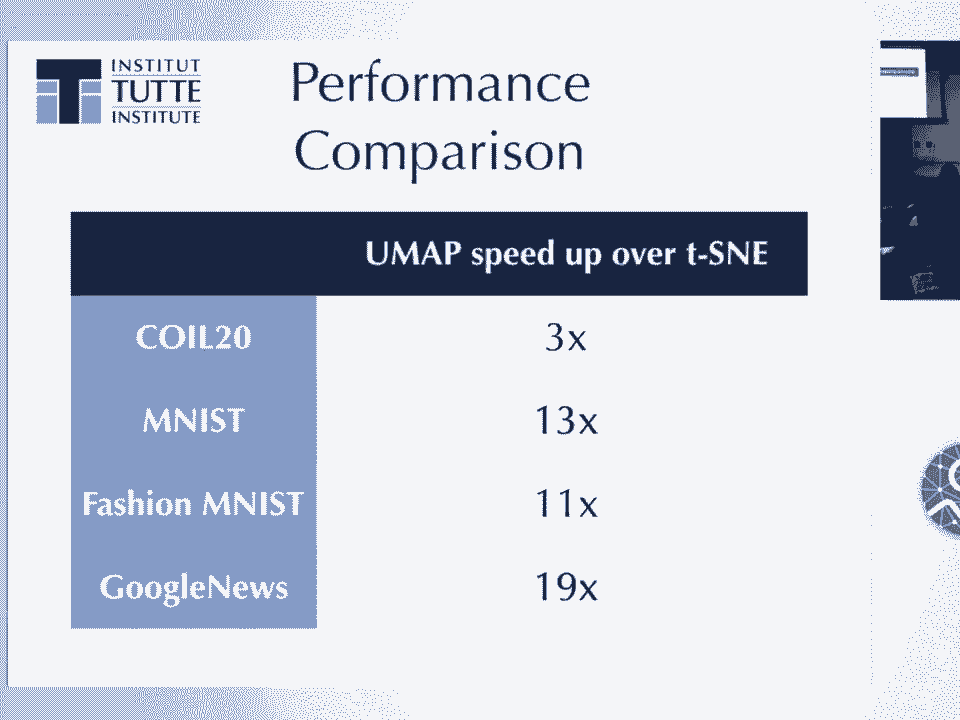

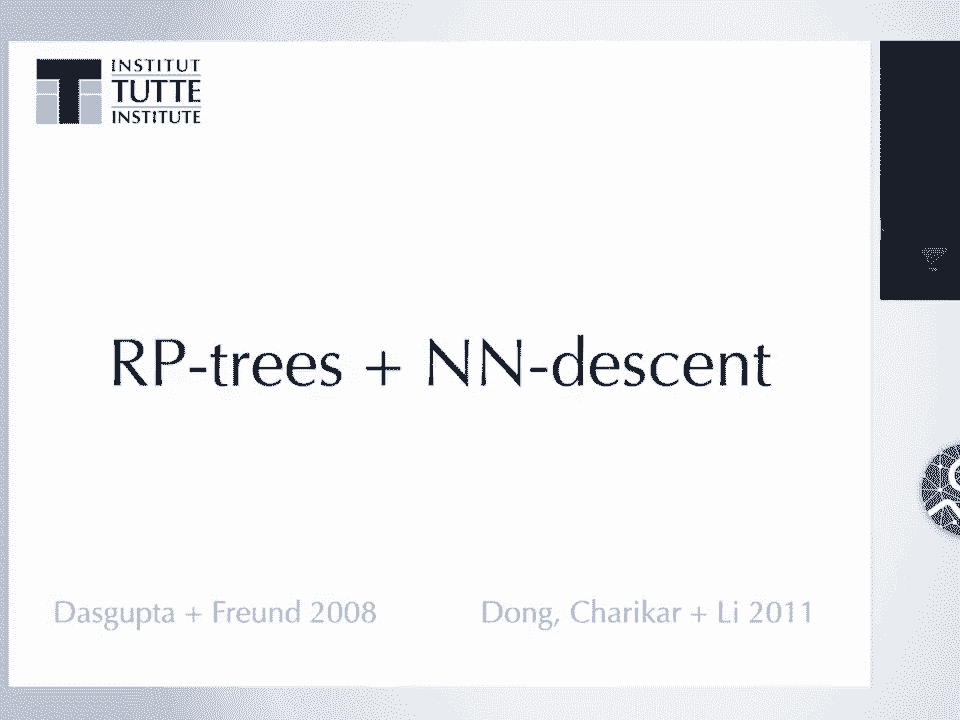

UMAP 的代码已在 GitHub 上开源，可通过 Conda 或 pip 安装。这项工作仍在持续进行中，欢迎感兴趣的朋友参与贡献。