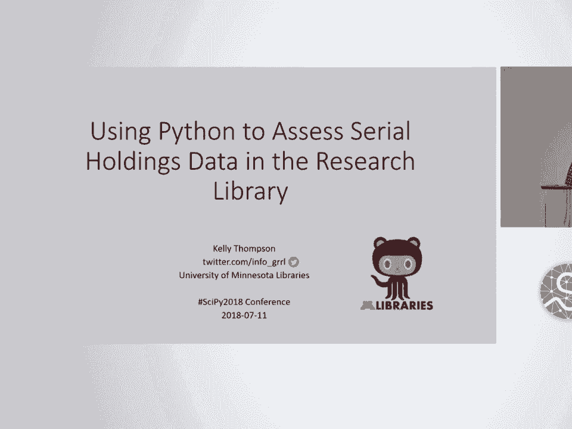
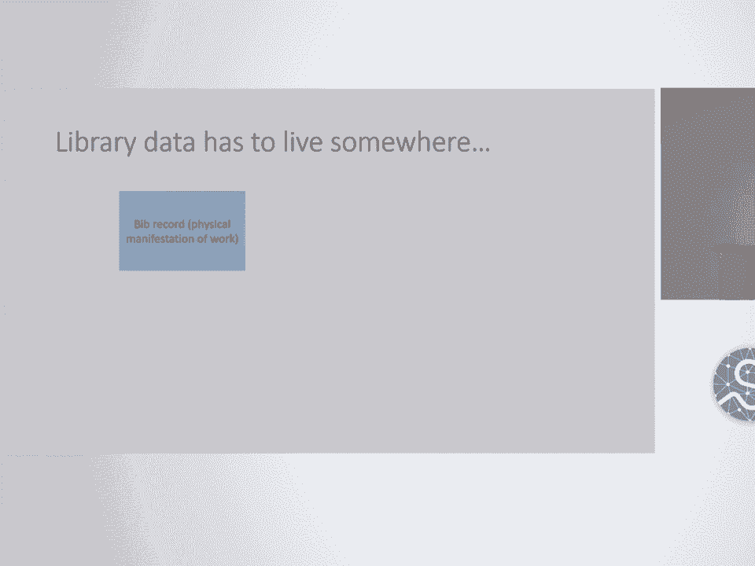
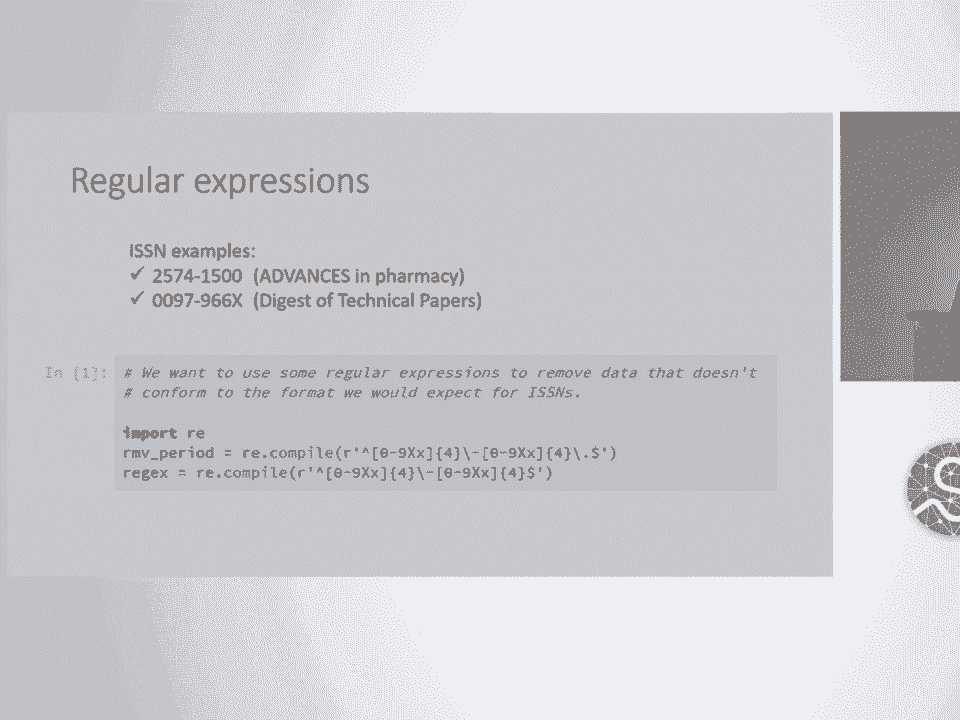
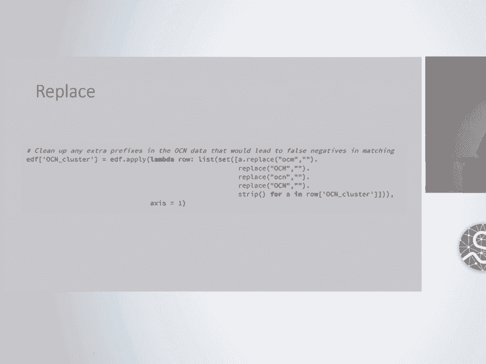
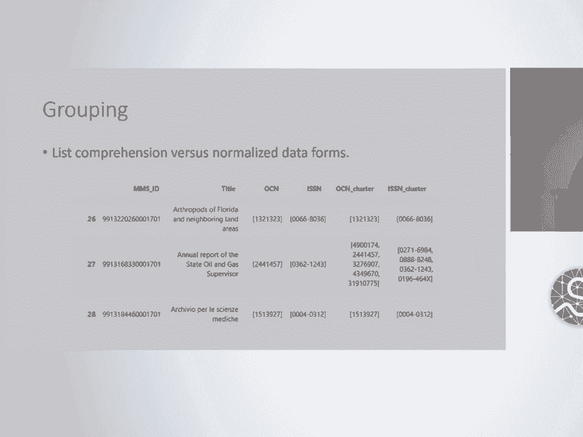
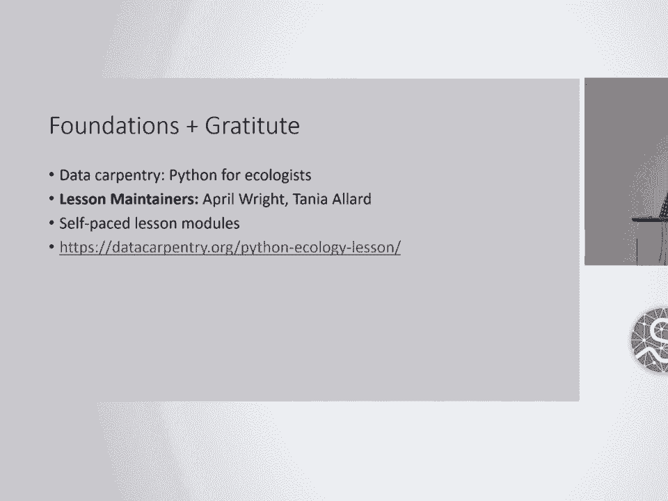

# 72：使用 Python 评估研究图书馆的连续出版物馆藏数据 📚🔍



在本课程中，我们将学习如何利用 Python 及其科学计算库（特别是 Pandas）来处理和分析大型研究图书馆中的连续出版物馆藏数据。我们将探讨如何将复杂的、历史遗留的图书馆元数据转换为可用于决策分析的结构化数据，并实现物理馆藏与电子资源的比对、筛选等一系列自动化工作流程。

---

## 背景与挑战

上一节我们介绍了课程的整体目标，本节中我们来看看项目所处的具体背景和面临的挑战。

我（Kelly Thompson）在明尼苏达大学图书馆工作。我的职位是数据与系统分析师，但我的专业背景是元数据馆员。近年来，我越来越多地使用 Python 进行工作流程的脚本化和自动化。

图书馆数十年来乃至数百年来一直在收集、管理和提供信息资源的访问。我们的馆藏时间跨度极大，从公元前3000-2000年的楔形文字泥板，到最近收录在 PubMed 中的电子医学期刊文章。我们不仅是物理资源的保管者，也越来越成为数字格式信息和学术服务的促进者。

然而，尽管我们拥有庞大的物理空间（例如俯瞰密西西比河的宏伟书库），我们的物理存储容量也已达到极限。与此同时，校园空间需要变得更加灵活，以支持新的教学模式、咖啡馆、小组学习空间和数据可视化实验室等。因此，在物理资源体量最大的时候，我们却需要它缩小。

对于我们服务的大多数学科而言，电子资源已成为首选格式。这些资源大多以连续出版物的形式存在。连续出版物是一个广义的图书馆术语，涵盖期刊、学会及会议论文集、定期发布的政府文件、丛书等。

由营利性出版商出版的连续出版物价格持续上涨，涨幅远高于通货膨胀率，而我们的预算却停滞不前或减少。能够提供这些资源的出版商和供应商数量已缩减至不到五家，常被称为“四大”。这种环境促使我们更严格地审视这方面的实践。

---

## 核心问题与目标

上一节我们了解了图书馆面临的空间和预算压力，本节中我们来看看由此产生的具体数据问题以及我们的分析目标。

我们需要处理的核心问题之一是馆藏管理。如果我们决定停止购买某刊，我们还能保留多少已授权内容的访问权？答案可能从“完全没有”到“未知”。这引出了数字保存和长期访问的问题。

幸运的是，现在也是跨校园合作兴起的时期。图书馆联盟和会员组织正越来越多地共同清点分散的资源，并创建共享目录或国家联盟馆藏的元集合。通过这些共享安排，我们代表更大的图书馆社区承诺保留特定的出版物。

因此，我们需要：
1.  清除非独有、非珍稀、未被使用的资源，为支持新教学方式的图书馆空间腾出地方。
2.  了解哪些出版物我们同时拥有物理格式和电子格式。
3.  了解如果我们取消订阅，是否还能持续访问。
4.  了解该出版物是否保存在可信的数字存储库中。
5.  遵守我们对联盟的保留承诺。
6.  理想情况下，获得一些度量指标（例如卷数或书架空间长度）。

我们的数据分析目标具体如下：
以下是实现上述需求的具体数据处理步骤：
*   **比对物理与电子资源**：比较资源的物理馆藏记录与电子资源记录。
*   **筛选持续访问权**：根据电子资源馆员维护的“取消订阅后访问”列表进行筛选。
*   **筛选可信存储库**：筛选出保存在我们政策认可的可信存储库（如 Portico、BTAA SPR）中的资源。
*   **排除保留承诺项**：排除我们已经做出保留承诺的出版物（主要通过 HathiTrust 共享印本库和政府文件）。
*   **跟踪处理过程**：跟踪所有剔除、撤回或去重项目的处理过程，特别是与 Google 图书扫描项目相关的记录。

---

## 数据的复杂性


上一节我们明确了分析目标，本节中我们来看看实现这些目标所依赖的数据本身有多么复杂。


我们讨论的不是专著（书籍），而是连续出版物。连续出版物会产生我认为图书馆系统中最复杂的书目库存数据。

连续出版物是复杂的作品。它们诞生、合并、拆分、每期封面名称略有变化、衍生出子系列、有时停刊、有时只是悄然消失。它们有卷、期，出版频率变化，编辑退休等。这意味着连续出版物彼此之间存在复杂的关系，用数据表示具有挑战性。

此外，当我们想查看一个出版物并比较其印刷版和在线版时，通常需要查看一个记录簇或家族。印刷型连续出版物通常每个主要题名变更就有一个新记录，而电子连续出版物通常供应商提供的记录较少，通常将整个刊期归在一个题名下（通常是最新的形式），而忽略题名变化。

我们的记录中可能有所谓的连接字段（如 76X-78X 字段），用于描述记录所描述的题名与另一个题名之间的关系。这些字段中最重要的数据是标识符。

我们还有每种连续出版物馆藏的卷期编号和年代数据，包括期号、卷号、出版日期等。这些数据正如你所预料的那样混乱。

图书馆数据是遗留数据，历史悠久且持续维护。大多数图书馆使用一个称为集成图书馆系统的大型数据系统来管理馆藏数据。我们使用的系统具有一种分层继承的数据模型。

---


## 数据格式：MARC

上一节我们探讨了数据的复杂性，本节中我们来了解一下存储这些数据的特定格式。

图书馆数据存储在一种称为 MARC 的格式中，MARC 是“机器可读编目”的缩写。它由美国国会图书馆的一位系统分析师在 20 世纪 60 年代开发，旨在促进从纸质卡片目录向早期计算机目录的过渡。这个系统已经使用了 50 多年。

MARC 标准规定了记录结构：记录头标、目次区、定长字段和变长字段数据。标准规定了哪些内容应放入哪个字段，每个字段有两个指示符承载编码数据，以及子字段。这些数据元素的内容遵循另一套内容标准。

生成的记录可以序列化为多种格式，二进制格式、助记格式和 XML 格式是最常见的。连续出版物通常注册有 ISSN。

---



## Python 解决方案概述

现在进入 Python 部分。需要说明的是，我是图书馆数据领域的专家，但并非 Python 万事通。这不是关于我们创造了最先进、最天才解决方案的演讲，而是关于我们如何在特定环境中应用这些开源的科学 Python 工具，从而节省大量时间，并帮助我们获得否则无法及时获得的答案。

大多数进行此类分析的图书馆都不得不进行大量手工工作。我们的目录目前有超过 400 万条书目记录和超过 700 万条单件记录。这对 Excel 来说太大了。我们需要新工具。

对图书馆数据进行 Python 分析的第一步，必须是将数据转换为适合分析的形式。在这项工作中，我一直将数据提取到 Pandas DataFrame 中。

---

## 数据提取与解析

上一节我们概述了使用 Python 和 Pandas 的解决方案，本节中我们来看看如何具体实现数据提取。

为了将 MARC 记录转换成 DataFrame，我们可以手动使用一个叫做 `pymarc` 的程序从我们需要的字段中提取制表符分隔的值，然后读取文本文件。虽然这种方法非常快，并提供了方便的用户界面，但它无法提供像以编程方式解析记录那样的控制力，在编程解析中我们可以实现条件循环和预过滤数据。

`pymarc` 有一个活跃的 Google 群组，人们乐于回答问题。`pymarc` 的作者包括 Ed Summers 等人。


以下是我用来解析连续出版物数据的脚本中某个函数的开头示例代码：

```python
# 示例：解析 MARC 记录中的 OCLC 号
for record in batch_of_records:
    # 提取记录标识符
    record_id = record['001'].data()
    # 查找 035 字段（OCLC 号所在字段）
    oclc_fields = record.get_fields('035')
    for field in oclc_fields:
        # 获取子字段 $a（通常是实际的 OCLC 号）
        oclc_number = field.get('a', '')
        if oclc_number:
            # 处理 OCLC 号...
            pass
        # 也可能需要捕获其他子字段中的相关标识符
        related_identifiers = [sf for sf in field.subfields if sf[0] in ['z', 'd']] # 例如 $z（已取消的号），$d（其他号）
```

从这段代码可以看出，我们需要在数据中查找很多条件。很多记录有多个标识符。如果你刚接触 Python 和 Pandas，那么你将享受到它的强大功能。它就像拥有魔法力量的电子表格，又像数据库表，你可以在上面执行数据库风格的连接操作，同时还有许多内置方法让工作变得轻松。


---

## 数据清洗与分组

上一节我们看到了如何解析原始数据，本节中我们来看看如何处理数据中的不一致性并进行有效分组。

我经常使用的另一个工具是正则表达式。例如，我们寻找 ISSN，但很多时候数据老旧混乱，所以在进行任何匹配之前，我想清除可能导致误报匹配的内容。

我们的数据库大约有 50 年历史，不同知识水平和经验水平的人都输入过数据。因此，在进行任何分组之前，我总是要对数据进行这些检查。



我也使用替换函数来清理数据，然后进行分组工作。这同样是一个关于代码重构的故事。我最初尝试使用列表推导式来做这件事，因为数据是以列表形式存在的（每条记录有多个标识符）。这非常慢。



后来我了解了 Pandas 的 `groupby` 函数，我想使用它，但不能直接用于多值数据。你需要整洁的数据。我做了很多研究，遇到了关于“拆分-应用-合并”模式的资料，并从理论上思考了它。



我筛选出我知道有匹配的记录，并尝试那样做，但仍然太慢。不过，我有了一个可行的方案，并且需要给我的上司提供一个可交付成果，以便提交给委员会。正如我的同事所说：**专业建议：先获得可工作的软件，再担心优化**。

我采纳了他们的建议，完成了需要做的工作，但我对这个解决方案并不满意，因为我知道我们将继续需要进行这类匹配和聚类。最终，我在 Stack Overflow 上找到了一个帖子，使用了一个叫做 `explode` 的函数，将多值数据点拆分成单独的行。

```python
# 使用 explode 将列表形式的标识符拆分成多行
df_exploded = df_with_lists.explode('identifier_column')
```


这样我就能够重新格式化我的数据，以便使用内置函数，这比手动尝试聚类算法要快得多。这有点像数据库设计中的规范化过程。这也与“整洁数据”的概念相关：每个单元格一个观测值，必要时重复。

我使用索引作为临时记录标识符。这些记录确实有实际的标识符，但它们很长且笨重，这样做更方便。一旦数据格式符合要求，我就调用 Pandas 的 `groupby` 函数，解析分组对象以获取组号，并将它们放入一个包含记录 ID 的 DataFrame 中。

由于我们已经拆分出多个标识符，这将导致每个记录 ID 对应多个组号。我们又回到了多值单元格的问题。因此，我们需要将多个组号缩减为单个组号，然后进行“碎片整理”（我自己的说法），例如将组号 `[0, 4, 12]` 映射为 `[0, 1, 2]`，然后按组号排序以便显示。

我知道这可能非常基础，但这个思考过程花了我很多时间。不过，我认为这对我理清思路很有帮助。

---

## 整合分析与输出

上一节我们完成了数据清洗和初步分组，本节中我们来看看如何整合其他数据源并生成最终的分析结果。

我对数据多次运行此聚类算法，分别按 ISSN 和 OCLC 号进行聚类。理论上之后还可以做其他事情。聚类后，我加入其他数据，并按照目标电子表格中提到的那些筛选条件进行过滤。

其他数据存在于完全不同的系统中，通常以制表符分隔值、逗号分隔值或电子表格的形式提供给我们。Pandas 同样非常适合处理这些。

```python
# 读取其他 CSV 数据并进行合并
other_data_df = pd.read_csv('other_data.csv')
merged_df = main_df.merge(other_data_df, on='identifier', how='left')
```

然后，我可以读取这些 CSV 文件，进行必要的处理，获取所需的标识符，然后在我的数据上执行数据库风格的连接操作。我还使用 Pandas 进行切片，以筛选不同的指标。

我想提到的另一点是，我们需要的很多输出结果将是供人阅读的电子表格。这也是我选择将大量数据以列表形式放在 DataFrame 中的另一个原因，因为我知道最终决定是否保留某个出版物的人会希望看到所有这些数据，并且会有大量的验证和检查工作。这是一个独特的场景，我们的“消费者”实际上希望查看电子表格数据，而不是将其输入可视化工具。

到目前为止，我处理的卷期年代数据主要是将日期作为年份来处理。标准的 `datetime` 库无法处理连续出版物卷期年代数据的混乱情况，但我构建了一套正则表达式来处理。下一步，我正尝试处理期号和卷号，灵感来自今年在 Code4Lib 会议上介绍的 `pycallnumber` 包。

---

## 未来计划与总结

上一节我们整合了所有分析步骤，本节中我们来看看项目的下一步计划，并对整个课程进行总结。


**下一步计划**：
以下是几个关键的改进方向：
*   **计算覆盖率百分比**：我的电子资源馆员要求输出能显示百分比重叠的数据，例如“物理卷册中有百分之多少有电子访问权限”、“有百分之多少有取消订阅后访问权限”等。这非常复杂，但我正在努力实现，以提供更精细的覆盖范围数据。
*   **实时查询数据源**：我正在研究实时查询这些数据源，因为目前我们是提取所有数据然后进行处理。这些都是动态系统，每天都有资源增加或撤消。能够获得非即时过时的数据将是一个优势。
*   **创建 Python 包**：我想将其中一些功能打包成一个 Python 包，供其他处理连续出版物数据的人使用。这可能是 `pymarc` 的一个扩展。
*   **尝试不同数据结构**：也许可以尝试不必将所有东西都放入 DataFrame。
*   **利用高性能计算**：我们校园通过超级计算研究所的高性能集群有一个 Jupyter Hub。我有兴趣看看能否在该集群上获得一些空间来尝试运行这些脚本，以提高速度。



**优势与挑战**：
这种方法的优势在于工作流程可重复、可扩展，并且使用了积极维护的工具。挑战在于处理那些大型数据集和数据源本身。

当我最初尝试使用列表推导式进行分组时，需要运行一整夜。现在，运行所有的清洗、分组和重新索引只需要几个小时。

**致谢与资源**：
感谢 Sean 和 Gabriela 在我研究生时期引导我进入 Python 处理元数据的领域。Gabriela 还举办了一个名为“用 Python 衡量你的元数据”的精彩研讨会，这是我第一次接触 Pandas，如果你想入门，那是一个很好的起点。感谢我的数据库教授和研究生导师。我也经常使用 Data Carpentry 的 Python 课程来学习，特别是在数据库风格连接方面。感谢我的同事 Stacy 和 Sunshine，他们也参与这些连续出版物项目。

---

在本课程中，我们一起学习了如何利用 Python 和 Pandas 处理研究图书馆中复杂且历史悠久的连续出版物馆藏数据。我们从理解图书馆面临的空间、预算和访问权挑战开始，逐步深入到 MARC 数据格式的复杂性，并详细探讨了使用 `pymarc` 解析数据、用 Pandas 进行数据清洗、分组、合并以及最终生成决策支持报告的全过程。通过这个案例，我们看到了即使面对非传统的“大数据”领域，科学 Python 工具也能通过自动化、可重复的工作流程，极大地提升效率并赋能基于数据的决策。