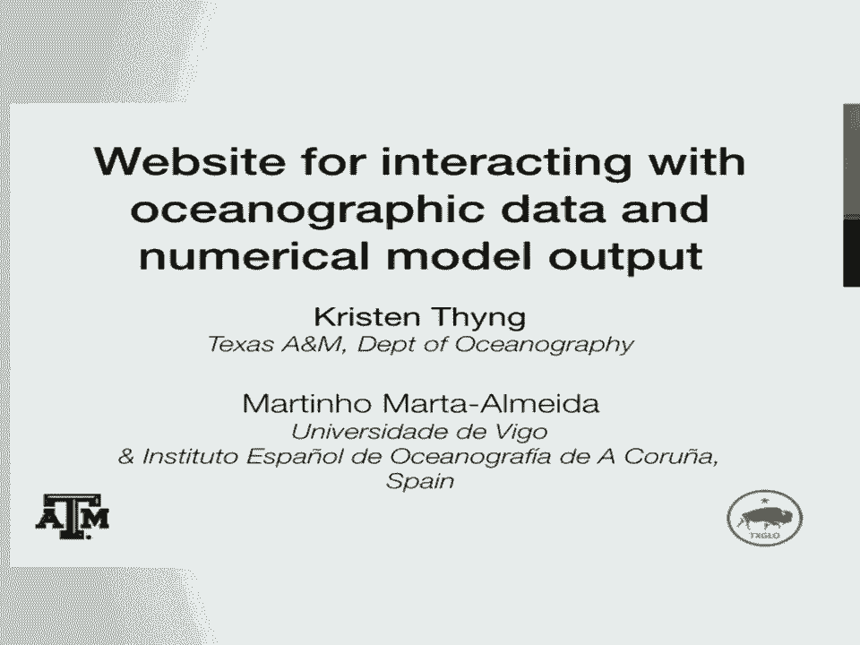
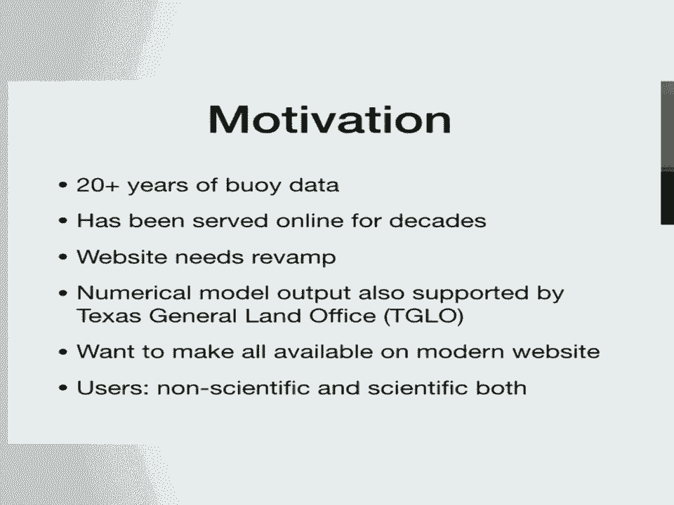
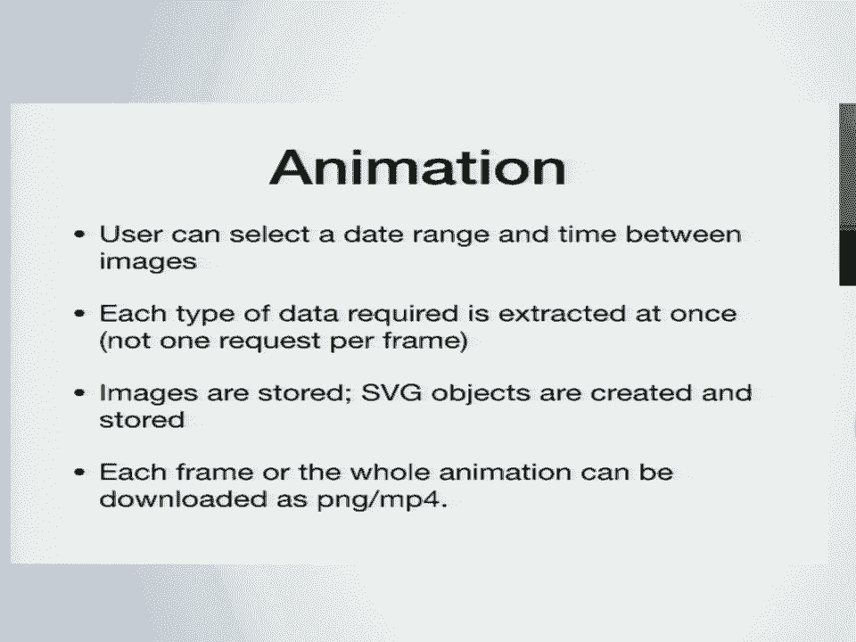
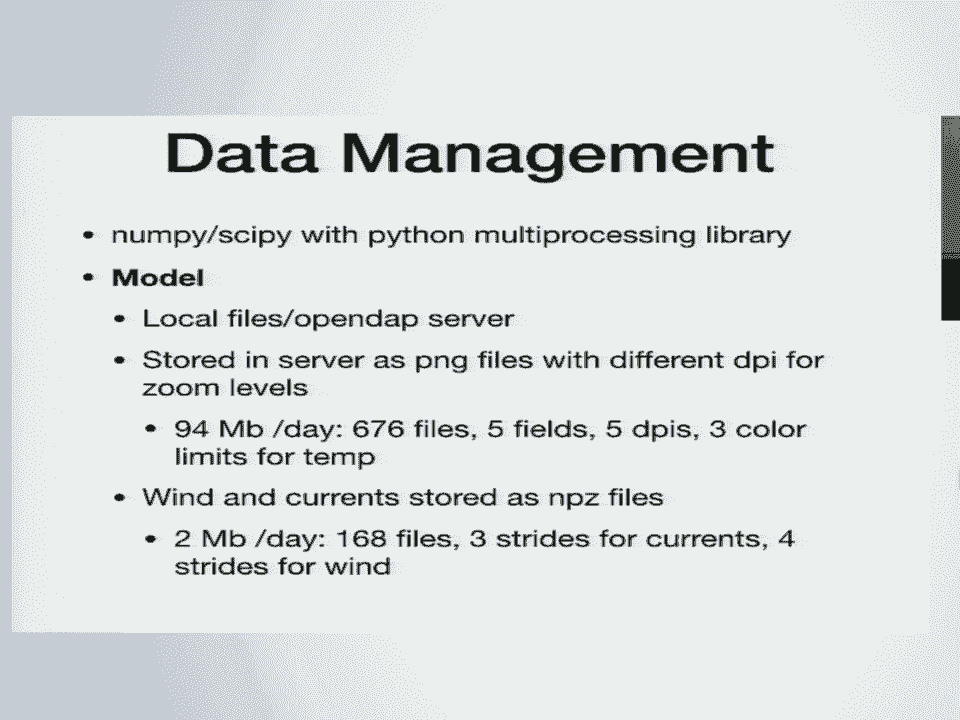
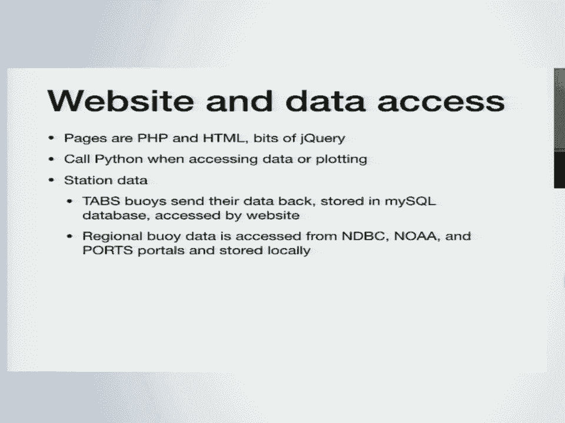
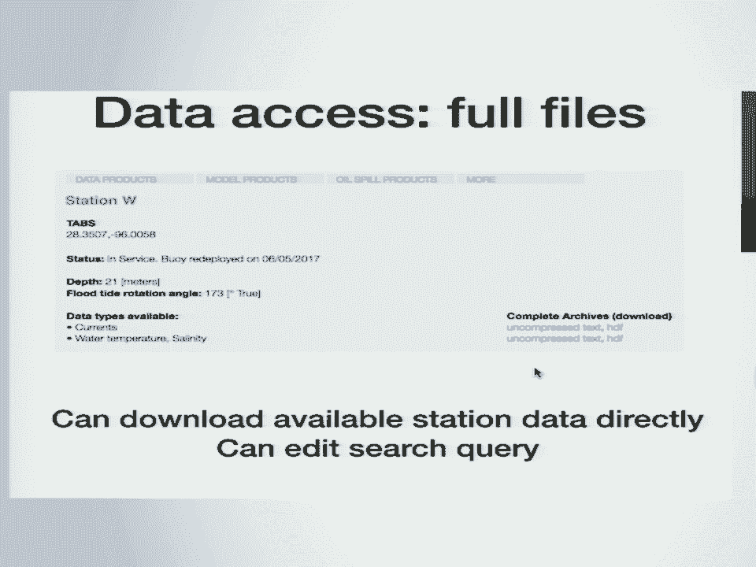
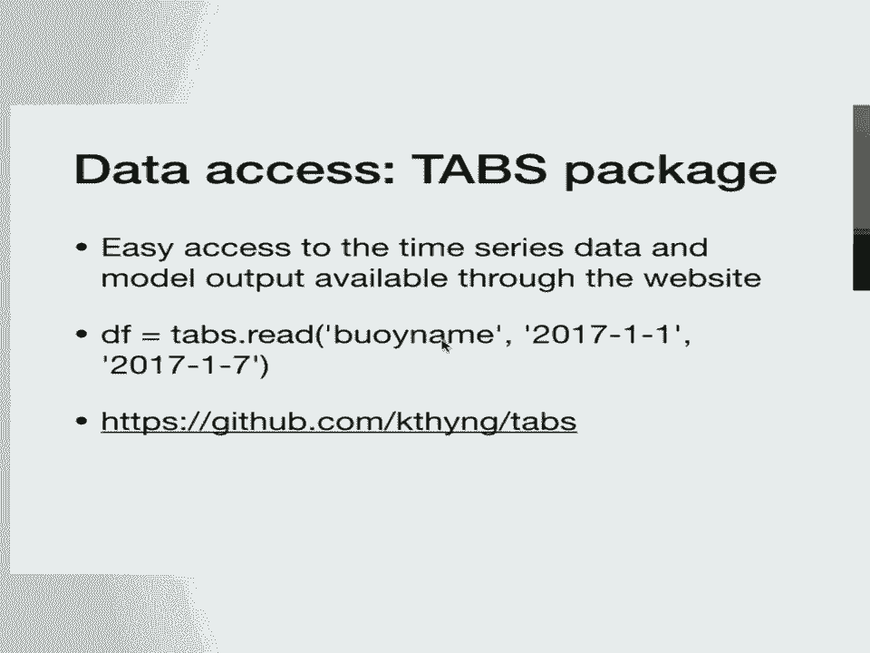
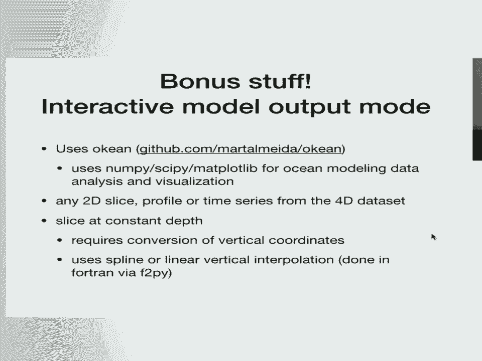
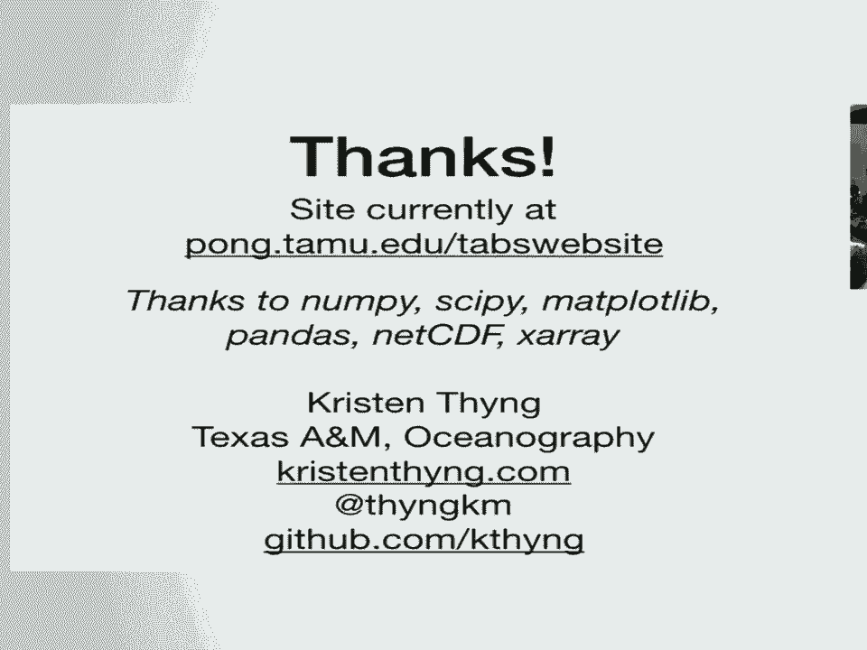
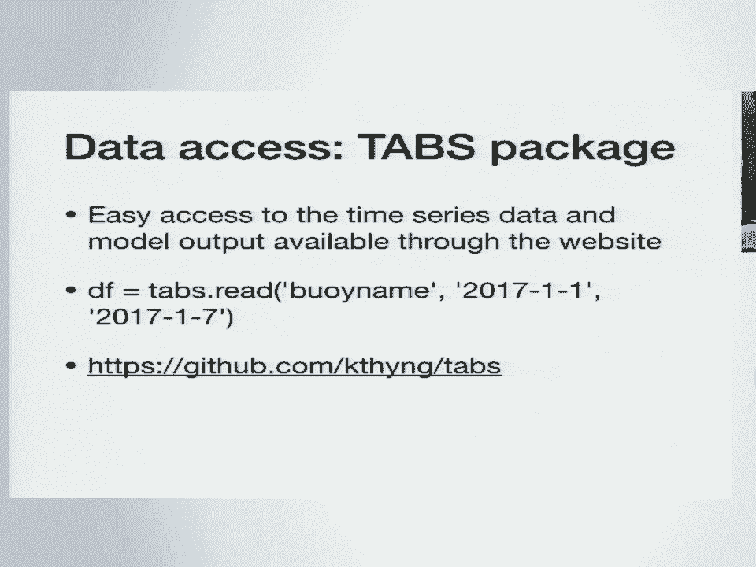

# 73：海洋数据交互网站开发教程 🌊



在本节课中，我们将学习如何构建一个用于交互式展示海洋观测数据和数值模型结果的现代网站。课程内容基于Kristen Thyng在SciPy 2018上的演讲，她来自德克萨斯农工大学海洋学系，主要研究方向是数值模拟和数据整理。



## 项目背景与动机 🎯

上一节我们介绍了课程的整体目标，本节中我们来看看项目的具体背景。

该项目旨在整合德克萨斯通用土地办公室资助了超过20年的浮标数据，以及用于支持溢油响应的数值模型输出。原有的数据服务网站已运行多年，急需现代化改造。

新网站的目标用户群体广泛，包括负责溢油响应的政府人员、渔民、休闲活动者以及科研人员。网站需要将不同来源的信息集成在一起，并以现代网页的形式呈现。

## 现有网站分析 📊

上一节我们了解了项目背景，本节中我们来看看原有网站的情况。

原有网站的核心是一个静态地图，上面用箭头显示最新的浮标数据（水流和风向）。其优点是访问速度快，界面直接。但也存在明显缺点：难以一次性获取超过60天的历史数据，无法显示模型输出，且界面风格陈旧。

## 新网站功能概览 🖥️

上一节我们分析了旧网站的不足，本节中我们来看看新网站的核心功能。

新网站将旧网站的链接整合到下拉菜单中，右侧栏列出了所有浮标站点的最新数据。





以下是新网站地图交互区域的主要功能：
*   **数据悬停预览**：将鼠标悬停在右侧浮标列表上，可以查看该站点各变量的最新时间序列图。数据以黑线显示，对应的模型输出以蓝线显示，未来时段的预报模型用虚线表示。
*   **交互式地图**：地图可以拖动、缩放。用户可以选择显示或隐藏不同的数据图层。
*   **多层信息叠加**：可显示的图层包括数值模型输出（如表面盐度、温度、流速、底层溶解氧、海面高度）、各类浮标和站点标记、模型预测的表面流箭头、岸基高频雷达测量的表面流以及模型风场。
*   **时间控制**：用户可以向前或向后跳转时间，也可以播放一段时间内的动画。
*   **数据下载**：用户可以下载静态图片或动画文件。

## 地图可视化模块的技术实现 🗺️


上一节我们浏览了新网站的功能，本节中我们深入探讨地图模块的技术细节。



地图模块由Martino开发，作为一个独立的组件，通过`<iframe>`嵌入到PHP主页面中。技术挑战在于如何在数据量和交互性之间取得平衡。

Martino采用的方案是：对复杂的模型输出结果，服务器预生成不同分辨率的静态PNG图片；对于叠加在上层的简单图形元素（如箭头、圆圈），则将其作为数据发送给客户端浏览器，由浏览器动态绘制为SVG图形。

这种方法的好处是传输效率高，且易于添加新的信息图层，无需为每种图层组合重新生成图片。



以下是数据处理和服务器端的关键技术点：
*   **工具库**：主要使用`NumPy`和`SciPy`，必要时使用`Python`的多进程库。
*   **模型数据访问**：通过本地文件或`OPeNDAP`服务器获取数值模型数据。
*   **图片生成**：服务器生成不同DPI的PNG图片以适应不同缩放级别。仅模型输出图片每天就需要约94MB存储空间。
*   **矢量数据**：风、流、雷达、浮标位置等数据以`NPZ`文件格式本地存储，供客户端调用。
*   **服务器框架**：使用`Flask`（`Python`）编写，并易于与`Apache`集成。





## 网站外围功能与数据管理 🔧

上一节我们介绍了地图可视化，本节中我们来看看网站的其他功能和数据管理。

网站的主框架由`PHP`和`HTML`构建。当需要访问、处理数据或绘图时，`PHP`会调用`Python`脚本。

以下是不同类型数据的访问方式：
*   **TABS浮标数据**：存储在合作机构`GERG`的`MySQL`服务器中，由网站直接访问。
*   **其他站点数据**：由网站进行聚合和本地整理。
*   **数值模型数据**：来自德克萨斯农工大学`Rob Hetland`教授的`ROMS`模型，通过`THREDDS`服务器公开提供。为了快速生成时间序列图，网站额外维护了一个文件，专门在约75个站点位置保存模型输出数据。

时间序列图通过`pandas`管理数据框，并使用`matplotlib`绘制。服务器每30分钟预生成一次各站点的最新数据和模型预报图，以实现快速访问。用户也可以通过数据库查询页面，自定义选择浮标、时间范围、变量等，并下载数据或图表。

此外，为了方便科研使用，还开发了一个`Python`数据访问包。用户可以通过简单的代码直接获取数据：
```python
import gulfdata
data = gulfdata.read('station_name', start_date, end_date)
```

## 高级研究功能与挑战 🧪

上一节我们介绍了主要的数据访问功能，本节中我们来看看一些高级功能和开发中遇到的挑战。



Martino集成了一个隐藏的“研究模式”，基于其开发的`Okean`工具包（使用`NumPy`、`SciPy`、`Matplotlib`）。该模式允许用户交互式地探索数值模型的全维度数据，例如：
*   查看固定深度层的切片图。
*   绘制等值面（如等温面）。
*   进行变量间的运算并可视化。

开发过程中面临的主要挑战包括：
1.  **交互性与性能的权衡**：始终需要在用户交互的丰富性和网页加载速度之间找到平衡点。
2.  **多数据源管理**：网站依赖多个外部数据源，需要建立完善的容错机制，防止单一数据源故障导致整个网站瘫痪。
3.  **预报模型的可靠性**：用于业务化运行的模型必须保持稳定，这需要额外的监控和应急方案。
4.  **时间序列图的通用性**：为所有可能的变量和选项组合编写通用的绘图脚本非常困难。
5.  **技术细节**：例如，在使用`pandas`的`datetime`索引作为X轴时，`matplotlib`的`quiver`（箭头）函数无法直接识别，需要进行单位转换，增加了代码复杂度。

## 总结与致谢 🙏



本节课中，我们一起学习了如何构建一个现代化的海洋数据交互网站。

我们从项目背景和旧网站分析出发，详细探讨了新网站的核心交互功能，特别是地图可视化模块在平衡性能与交互性方面的技术方案。我们还了解了网站外围的数据管理、查询下载功能以及为科研人员准备的高级工具。最后，我们回顾了开发过程中遇到的主要挑战和解决方案。

该项目大量使用了开源科学计算工具，包括`NumPy`、`SciPy`、`Matplotlib`、`Pandas`、`NetCDF`和`Xarray`，在此表示感谢。

新网站目前已上线测试，未来将迁移至正式地址，为各类用户提供德州海域全面、直观的海洋环境数据服务。