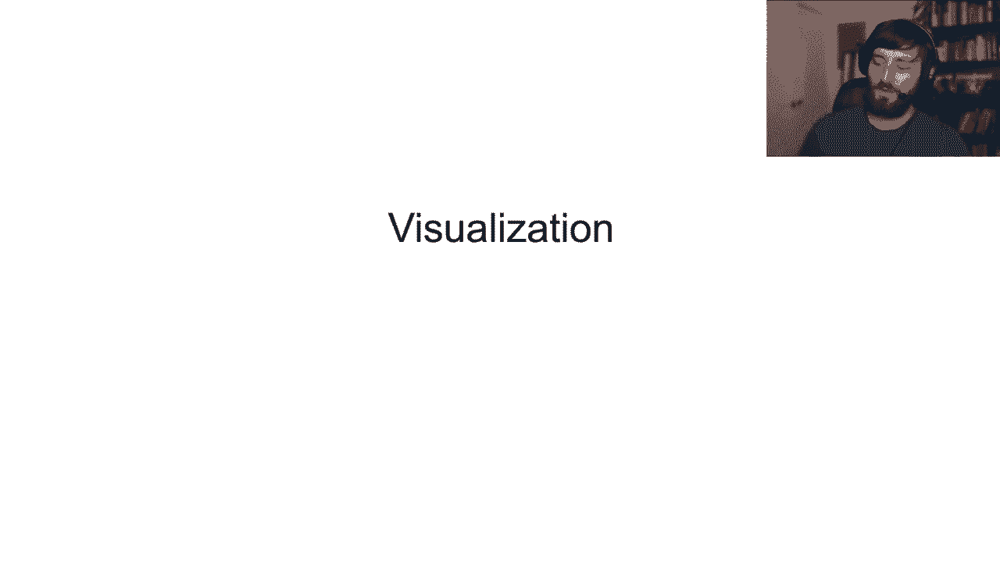
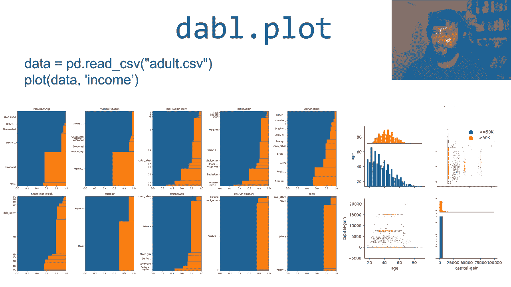
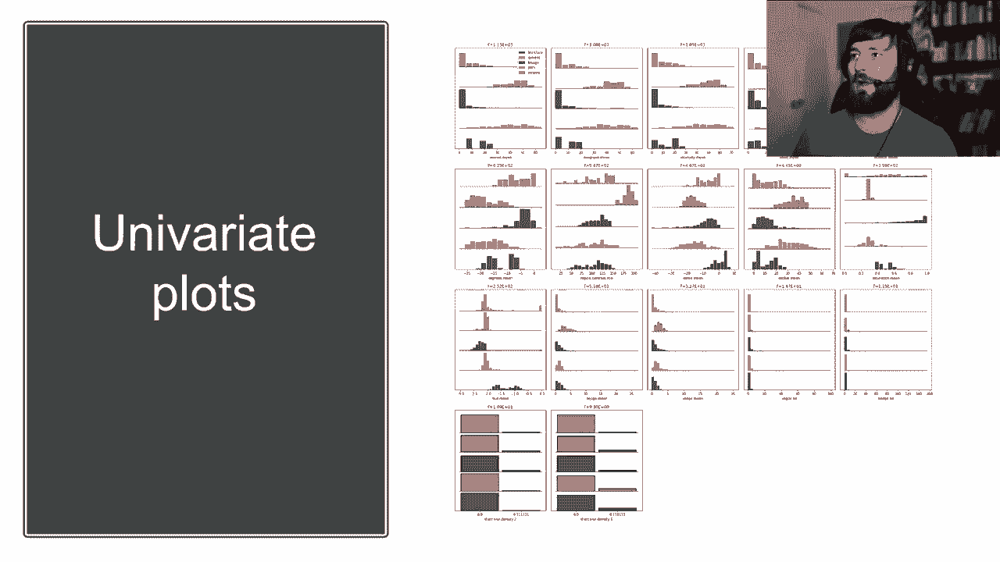
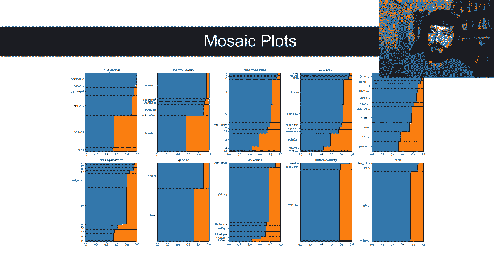
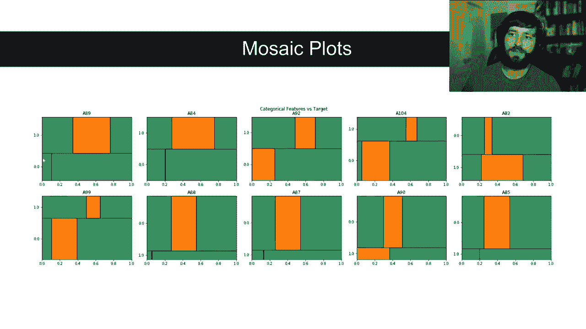
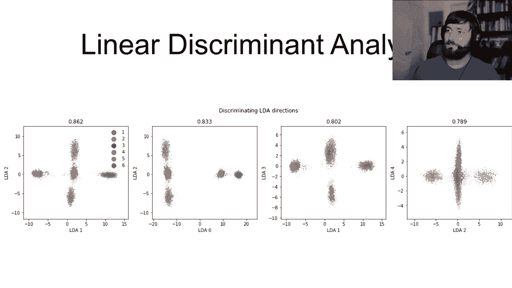
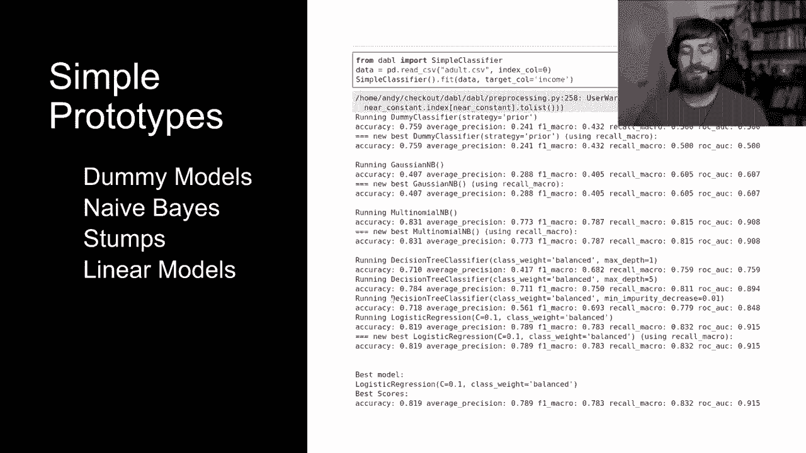
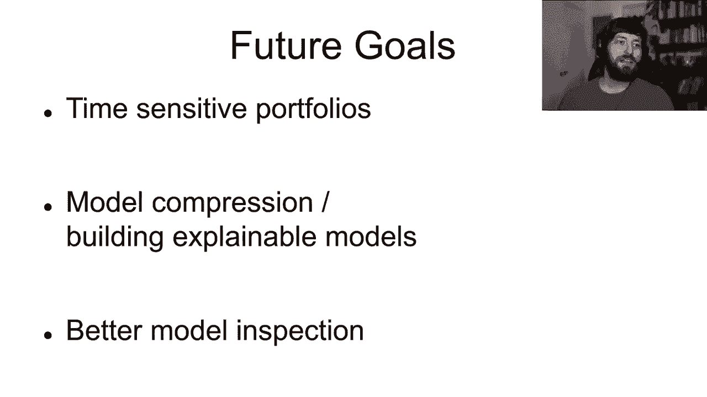

# 1：dabl - 人机协同的自动化机器学习 🚀

在本课程中，我们将学习一个名为 **dabl** 的 Python 库。它的全称是“数据分析基线库”，旨在简化机器学习工作流程，帮助数据科学家和初学者快速构建稳健的原型模型。我们将重点了解 dabl 如何通过自动化数据清洗、可视化、模型构建和解释等步骤，让人能够更高效地参与到整个机器学习循环中。

---

## 工作流程概览

机器学习通常始于任务定义，这是一个关键步骤，决定了如何将问题转化为机器学习问题。之后，流程包括数据收集、数据清洗、探索性分析与可视化、模型构建、离线模型评估，以及最终的在线评估或业务逻辑内评估。

然而，这并非一个线性流程，而是一个反馈循环。在完成任何一步后，都可能需要返回之前的步骤进行调整。例如，在可视化阶段发现数据质量问题后，可能需要返回修改数据收集方式；或者在模型构建后发现模型无法处理某些数据特性，从而需要重新清洗数据。

许多数据科学家倾向于将大量精力集中在模型构建和超参数调优上。虽然现有工具使这一过程充满乐趣，但本课程将探讨如何让整个流程更加顺畅。真正的提升往往来自于对整个流程的迭代优化，而不仅仅是模型本身。

---

## 现有工具的挑战

目前，数据探索、可视化和模型构建等步骤仍不够简便。以使用 `seaborn` 绘制标准分类数据集的可视化图表为例，即使对于非常标准的绘图任务，也需要编写多行涉及数据类型选择、数据重塑等操作的代码，过程略显复杂。

同样，使用 `scikit-learn` 构建一个包含缺失值处理、分类变量编码和超参数调优的逻辑回归模型，也需要编写相当多的样板代码。这增加了快速迭代的难度。

另一方面，虽然存在如 `auto-sklearn` 这样的优秀自动化机器学习框架，但它们的目标通常是在较大的计算预算下寻找最佳模型。例如，在一个小型数据集上运行可能需要一小时。这对于需要快速验证想法、迭代整个工作流的初期阶段来说，时间成本可能过高。

---

## dabl 的解决方案

为了给每个步骤提供易于使用的解决方案，我开发了 **dabl** 库。它的目标是让用户能够轻松、快速地获得一个良好且稳健的机器学习问题原型，从而可以便捷地在数据清洗、收集、模型评估和解释等环节进行迭代。

dabl 为工作流中的每个步骤提供了工具函数：
*   **数据收集**：由用户负责，dabl 假设数据已加载到 `pandas DataFrame` 中。
*   **`dabl.clean`**：执行基础的机器学习数据清洗。
*   **`dabl.plot`**：提供可视化和探索性分析。
*   **`dabl.SimpleClassifier` / `dabl.AnyClassifier`**：执行快速、高效的自动化机器学习。
*   **`dabl.explain`**：尝试解释已构建的模型。

最重要的是，dabl 帮助你思考模型如何融入实际用例，这是数据科学家常常投入不足的环节。

---

## 数据清洗与预处理

dabl 提供了两种数据清洗与预处理的使用方式。

第一种是使用 `dabl.clean` 函数。以一个相对标准但有些“脏”的回归数据集（Ames 房价数据集）为例，它包含82列，有分类变量、连续变量、ID和缺失值等。调用 `dabl.clean` 会创建一个新的 `DataFrame`，并报告连续型、分类型列的数量，检测并处理奇怪的字符串或缺失值编码，以及识别近乎恒定或类似索引的无用列。你可以覆盖某些类型检测，并获得一个干净的 `DataFrame` 以供后续使用。

第二种是使用 `dabl.detect_types` 和 `dabl.Preprocessor` 类。`Preprocessor` 类提供了一个 `scikit-learn` 转换器，能自动组装一个进行所有预处理的 `ColumnTransformer` 和 `Pipeline`。这大大减少了需要编写的样板代码，同时让你能完全控制想要使用的模型类型，从而轻松创建 `scikit-learn` 管道而无需担心预处理细节。

---

## 可视化与探索性分析

dabl 的可视化工具主要通过一个函数 `dabl.plot` 来提供。

以下是如何使用 `dabl.plot` 进行可视化的步骤：
1.  加载数据到 `DataFrame`。
2.  将 `DataFrame` 传递给 `plot` 函数。
3.  指定目标列的名称。

dabl 支持两种接口：一种是 `scikit-learn` 风格的 `(X, y)`，其中 `y` 是单独的数组或 `pandas Series`；另一种是单个 `DataFrame` 加上目标列名。调用 `plot` 函数后，它会自动为分类变量和连续变量绘图。

对于分类特征，dabl 使用**马赛克图**进行展示。图中条形的高度表示每个类别中的样本数量，宽度则表示不同类别之间的平衡。例如，在一个二分类数据集中，可以清晰看到每个类别内两个类别的比例。

对于多分类数据集，dabl 提供**类别直方图**，可以在一个子图矩阵中展示某个特征在所有类别上的单变量分布，使图表更加紧凑。dabl 会自动限制绘图数量，并按其统计显著性进行排序。

dabl 还能绘制**成对关系图**。当特征数量较多时，它不会展示所有成对组合（那样会过于繁杂），而是尝试找出最有趣的成对图。其原理是评估一个浅层决策树分类器仅基于这两个特征对数据集进行分类的效果，效果越好，通常意味着特征组合的区分度越明显。默认会显示信息量最大的四对特征。

此外，dabl 还会进行**主成分分析**绘图，显示解释方差，以及使用**线性判别分析**进行监督降维并可视化。LDA 有时能发现原始数据中不明显的、能很好区分类别的线性投影。

---

## 快速原型与模型搜索

在模型构建方面，dabl 提供了两种主要方式。

首先是 **`SimpleClassifier`**，它包含一系列几乎能瞬时运行的模型。以下是这些模型的列表：
*   **虚拟模型**：预测最常见类别，作为基准线。
*   **高斯朴素贝叶斯**
*   **决策树桩**
*   **线性模型（如逻辑回归）**

这些模型按运行时间排序，首先尝试最快的。运行后，你就能立即获得一个合理的基线模型，并可以继续进行模型解释。

如果需要更复杂的模型，可以使用 **`AnyClassifier`**。它会在一个预设的**模型组合**上进行搜索，包括：
*   更多线性模型
*   随机森林
*   梯度提升
*   一些核方法

目前不包含神经网络，以避免引入深度学习库依赖。`AnyClassifier` 使用**连续减半法**来高效搜索这个组合。该方法首先在数据子集上评估所有候选模型，淘汰表现最差的一半，然后对剩余模型增加训练数据量，重复此过程，直到使用全部数据。这比随机搜索或网格搜索更高效。

这个模型组合本身是通过在大量基准数据集（如 OpenML CC18）上进行超参数优化后，选取一组既多样又高性能的模型构建而成的。研究表明，即使使用很少的候选模型，这种组合方法也能取得很好的效果。

---

## 模型评估与解释

构建模型后（无论是 `SimpleClassifier` 还是 `AnyClassifier`），可以调用 `dabl.explain` 进行模型评估与解释。

`dabl.explain` 首先提供一系列标准评估指标，包括：
*   `scikit-learn` 风格的分类报告（精确度、召回率、F1分数）
*   混淆矩阵
*   ROC 曲线与精确率-召回率曲线

接着，它会提供模型解释：
*   对于**线性模型**，展示最重要的系数。
*   对于**树模型**，提供基于不纯度的特征重要性（在训练集上计算）。
*   同时，也会提供**基于排列的特征重要性**（在测试集上计算），这通常更稳健。
*   最后，还会生成**部分依赖图**，以展示特征对预测结果的影响。

---

## 未来展望与使用方式

dabl 库未来的目标包括创建更省时、更快的模型组合，支持设定时间预算，进行模型压缩，在复杂模型之上构建更易解释的模型，以及改进模型检查功能。

如果你想尝试 dabl，可以通过 `pip install dabl` 进行安装，并查阅其网站获取文档和教程。如果你在使用中遇到任何问题或有反馈，非常欢迎通过社交媒体、电子邮件或项目问题追踪器与我联系。

---

## 课程总结

在本课程中，我们一起学习了 **dabl** 这个旨在简化机器学习工作流程的 Python 库。我们了解了它如何通过 `dabl.clean` 简化数据清洗，通过 `dabl.plot` 进行自动化探索性可视化，通过 `SimpleClassifier` 和 `AnyClassifier` 快速构建模型原型并进行高效搜索，以及通过 `dabl.explain` 对模型进行评估和解释。dabl 的核心思想是降低每个步骤的复杂度，让数据科学家能够更快速地在整个“人机协同”的循环中迭代，从而更早地关注模型如何融入实际业务与科学问题。