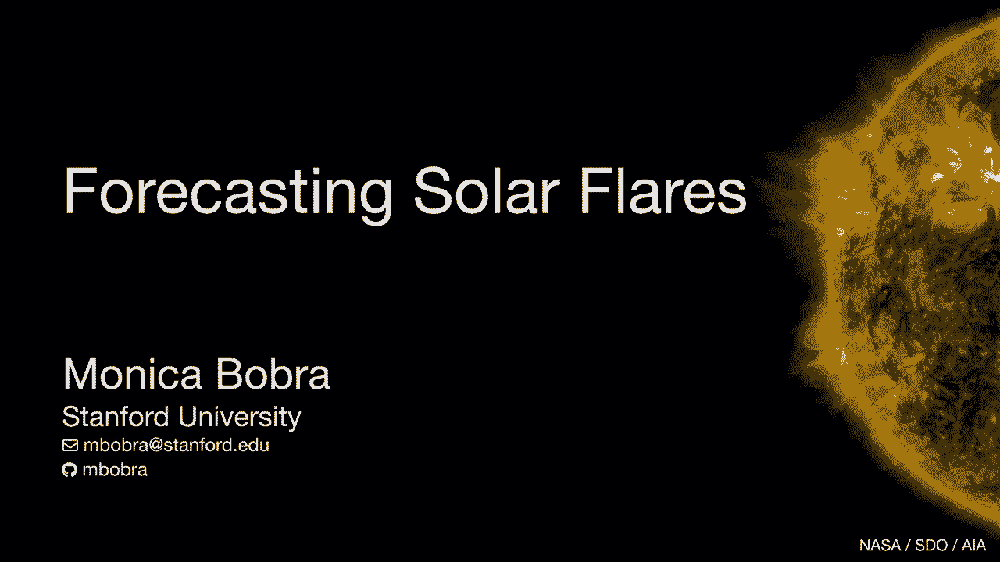
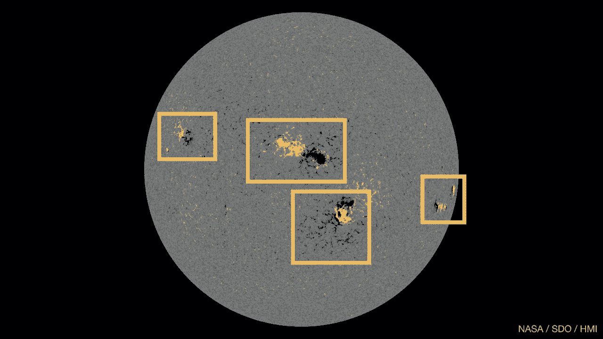
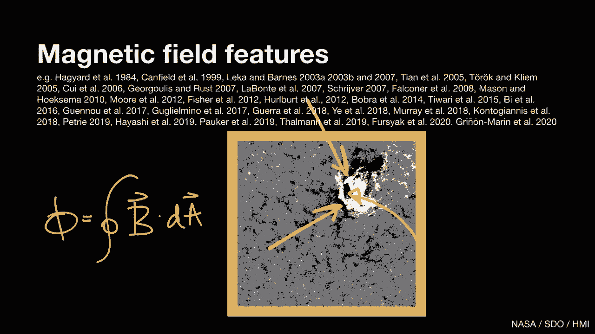
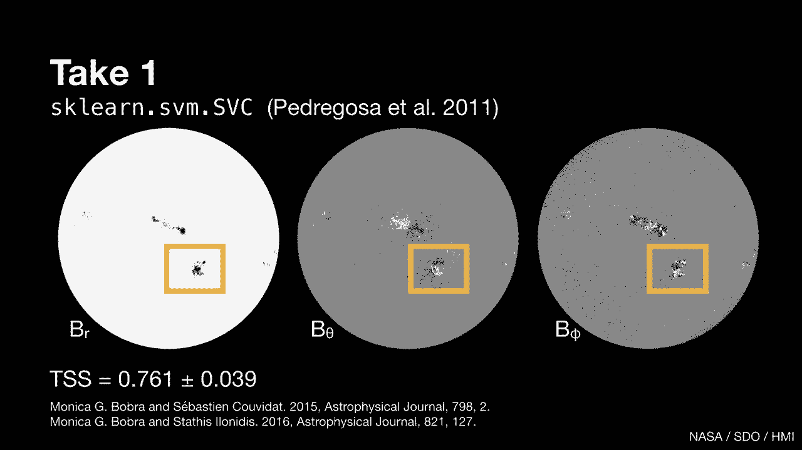
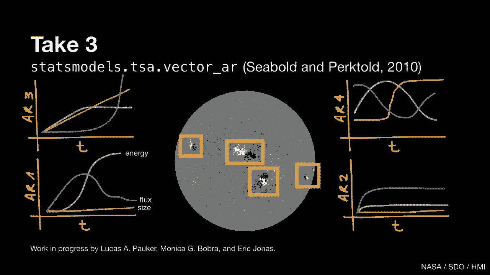

# 2：太阳耀斑预测 🌞

在本课程中，我们将学习如何利用机器学习技术预测太阳耀斑。课程内容将涵盖太阳耀斑的基本概念、传统预测方法、机器学习带来的变革以及该领域的未来展望。

***

## 什么是太阳耀斑？⚡

首先，我们来了解太阳耀斑。太阳耀斑是太阳大气中剧烈的能量释放现象。

以下是太阳耀斑的三个基本属性。

***

### 属性一：频繁性与稀有性

太阳一直在发生耀斑。小耀斑很常见，而像2017年9月6日那样的大耀斑则非常罕见。这是过去15年中最大的耀斑。

***

### 属性二：发生在活动区

耀斑发生在太阳活动区。活动区是太阳表面磁场强、结构复杂且快速演变的区域。下图展示了2017年9月大耀斑发生前几天太阳表面（光球层）的磁场图像。

图中，白色区域表示磁场穿出页面，黑色区域表示磁场穿入页面，灰色表示零磁场。

***

### 属性三：能量释放模式

耀斑释放能量的方式类似于地震：应力缓慢积累，然后迅速释放。下图显示了太阳的累积X射线辐射。

X轴是时间，Y轴是通量（单位：瓦特/平方米，对数刻度）。两种颜色代表两个不同的波长波段。可以看到，太阳持续输出一个基线水平的X射线辐射，然后在9月6日，这个输出增加了两个数量级，这就是耀斑。

***

## 传统的太阳耀斑预测方法 🔍

上一节我们介绍了太阳耀斑的基本属性，本节我们来看看人们传统上如何预测太阳耀斑。

我们可以将预测太阳耀斑类比为预测地球天气。就像我们利用地球上的云图模式来预报今天或明天是否会下雨一样，我们可以利用太阳上的磁场模式来判断今天或明天是否会发生耀斑。

以下是如何从太阳图像数据中识别磁场模式或特征的一个例子。

让我们回到太阳表面的磁场图像，并只关注一个活动区。观察这个区域时，我们注意到图像中白色和黑色部分之间存在一些边界，例如这里和这个圆形区域。在这些地方，磁场线方向几乎相反，穿出页面的磁场线紧邻着穿入页面的磁场线。耀斑通常起源于这些区域。

因此，我们可以做的一件事是：隔离位于这些边界区域上或非常接近的像素，并对它们的值求和。这样，我们就计算出了这个特定活动区在特定时刻通过特定区域的磁场，或者说磁通量。这就是一个特征。

有许多优秀的研究描述了活动区的许多不同特征。

***

### 传统预测方法

那么，人们传统上如何使用这些特征来预测太阳耀斑呢？

传统上，大多数研究只使用一两个特征，并结合简单的统计技术。虽然存在一些例外，但很多文献都是如此。

***

## 机器学习如何改变格局？🤖

上一节我们了解了传统方法的局限性，本节我们将探讨机器学习带来的变革。

机器学习使我们能够以有意义且最优的方式将大量特征组合起来。现在，我们不再只使用一两个特征，而是可以使用数十个甚至数百个特征。同时，机器学习也让我们能够充分利用像太阳动力学天文台产生的超大型数据集。

接下来，我将介绍我与许多同事合作完成的四个利用机器学习预测太阳耀斑的项目。

***

### 项目一：首次尝试（最简单的方法）

这是我们的第一个也是最简单的方法。

在这项研究中，我们获取太阳磁场图像，只关注活动区，并计算了25个特征，例如磁通量或磁场中储存的能量。我们对每一个活动区在每一个时间点都进行了计算。

最终，我们得到了描述2100个活动区的3800万个特征。我们将此问题构建为一个二元分类问题：这个活动区会产生大耀斑吗？是或否？

对于学习算法，我们使用了Scikit Learn中的SVM分类器。我们得到了一些相当不错的结果。

衡量模型性能的方法有很多。我们的准确率为0.92，这看起来不错。但对于稀有事件预测，高准确率可能具有误导性，因为你可以通过总是预测“否”来获得很高的准确率。

因此，我们还计算了一个称为TSS的技能分数，它量化了你比总是预测“否”好多少。这个特定的技能分数范围从-1到1，其中-1是最差的预测（总是预测错），+1意味着总是预测对，0则等同于随机猜测。

我们这项研究的TSS是0.76。从科学角度，我们了解到磁场极度扭曲、卷曲的活动区最有可能发生耀斑。

***

### 项目二：直接利用图像数据

在第一次尝试之后，我们想：好吧，我们把所有这些图像数据压缩成了一个数字，而且我们只看了太阳的表面。那么，为什么不直接看图像数据呢？为什么不同时看看太阳的大气层，而不仅仅是表面呢？

这一次，我们在360万张太阳表面和太阳大气各层的图像上使用了卷积核网络。我们最终得到的技能分数是0.81。

但这个技能分数在前一个项目的误差范围内，所以尚不清楚这种方法是否带来了真正的改进。这让我们陷入了思考：如果我们使用了所有这些额外的数据却没有得到显著更好的结果，那问题出在哪里？

首先，我们的太阳表面图像描绘的是矢量场（磁场），而不是像强度那样的标量场。我们的大气层图像在动态范围上跨越了五个数量级。这些数据与我们用手机拍摄的日常图像非常不同。也许CKN并不完全适合处理这些数据。

其次，我们在做后续预测时没有考虑之前的预测。所以，也许我们可以给模型增加一个自回归成分。

最后，我们独立地看待所有活动区。但也许在任何给定时间，日面上的所有活动区都在相互影响。这个概念并不新鲜，它被称为“交感耀斑”，即一个活动区的耀斑会触发另一个活动区的耀斑。也许我们可以研究这一点。

***

### 项目三：研究交感耀斑

基于项目二的思考，我们开始了第三次尝试，目前正在进行中，我们开始研究交感耀斑。

以下是我们如何构建问题：假设我们计算了活动区的一个特定特征，比如之前讨论的磁通量。再假设我们跟踪这个特征随时间的变化。那么现在我们有了一个时间序列。由于我们有很多特征，我们就有了很多时间序列。所有这些时间序列只描述一个活动区。

但是，假设我们也同时观察太阳上所有其他活动区的时间序列。当我们使用所有这些活动区的时间序列数据时，我们是否能更好地预测耀斑？还是当我们单独观察每个活动区时，能更好地预测耀斑？

为了进行这项分析，我们使用了statsmodels中的向量自回归模型。我们的初步结果表明，一个活动区的耀斑确实会触发另一个活动区的耀斑。目前我们正在评估这种影响到底有多大。

***

### 项目四：着眼于整个日地系统

最后是第四次尝试。这是一个着眼于整个日地系统的大型项目。

在前三种方法中，我们只关注太阳。但太阳是一颗活跃的恒星。它不断以每秒约500公里的速度向太空喷射等离子体，我们称之为太阳风。太阳风与包括地球在内的所有行星相互作用，并塑造了一个太阳系存在于其中的磁泡，称为日球层。

有许多太空任务在日球层的不同位置采集数据。因此，我们不仅有太阳的图像数据，还有大量直接测量数据，用于采样太阳风、地球磁场和地球大气层。

除了所有这些观测数据，我们还有数值模型，可以从磁流体动力学方程的第一性原理出发，预测太阳风如何从太阳传播到地球。

我是由密歇根大学牵头的一个大型50人团队（名为Solstice）的成员。Solstice项目旨在利用机器学习来预测太阳上的爆发事件最终将如何影响地球。这是一个相当困难的问题。

这个问题最困难的部分之一是弄清楚太阳风如何与地球磁场耦合，特别是在地球磁场的向阳面以及地球磁极附近。这个项目几个月前刚刚启动。

***

## 我们从中学到了什么？📚

回顾这四种方法以及其他许多利用机器学习进行耀斑预测的优秀研究，我们学到了一些东西。

首先，我们了解到机器学习算法相比传统方法提供了巨大优势。开源科学软件对太阳耀斑预测领域产生了极其积极的影响。

其次，我们了解到增加机器学习模型的复杂性并不一定会提高预测能力。预测能力最大的提升来自于使用越来越多物理意义明确、信息丰富的输入数据，这不等同于简单地使用“更多数据”。

因此，你在识别具有物理意义和信息丰富的特征方面投入的前端工作越多，在预测能力上的回报就越大。

***

## 该领域的未来是什么？🚀

在本节中，我确定了三个我认为如果得到解决，可能在该领域带来突破的问题。

以下是这三个关键问题：

1.  **解决类别不平衡问题**：这是许多科学领域的一个大问题。相对于有事件发生（如耀斑、地震、超新星），我们总是有更多无事发生的例子。这是一个非常难以解决的问题，目前没有明确的解决方案。一个潜在的解决方案是使用像生成对抗网络这样的工具来创建逼真的事件合成观测数据。
2.  **迁移学习**：我们都在使用不同的数据集，并从每个数据集中学到不同的东西。例如，有人可以使用2000年代初运行的卫星的历史数据来预测耀斑，而我则可以使用太阳动力学天文台的数据来预测耀斑。但我们如何能够捕获从一个数据集训练中获得的知识，并将其迁移到另一个相关问题上？迁移学习是另一个大的研究领域。我在日球层物理学中看到的一个解决方案是创建大型的、经过相互校准的统一数据集。
3.  **可解释性问题**：机器学习的实际成功并不总是与可解释性的成功齐头并进。可解释性对于科学研究非常重要，因为仅仅说“我能预测耀斑”是不够的。真正的科学问题是：“我们在这里学到了什么物理？” 可解释性元素才是真正的科学成果。我认为前进的方向之一是使用与模型无关的可解释性工具。

我认为，我们作为一个科学共同体，可以通过致力于解决这三个问题来取得重大进展。

***

## 总结

在本课程中，我们一起学习了太阳耀斑的基本概念，了解了传统的预测方法及其局限性。我们重点探讨了机器学习如何通过整合大量特征和利用大数据集来变革这一领域，并回顾了四个具体的机器学习应用项目。最后，我们展望了该领域未来面临的挑战，包括类别不平衡、迁移学习和模型可解释性等关键问题。通过持续的研究和创新，我们有望更准确地预测太阳活动，并深化对太阳物理的理解。