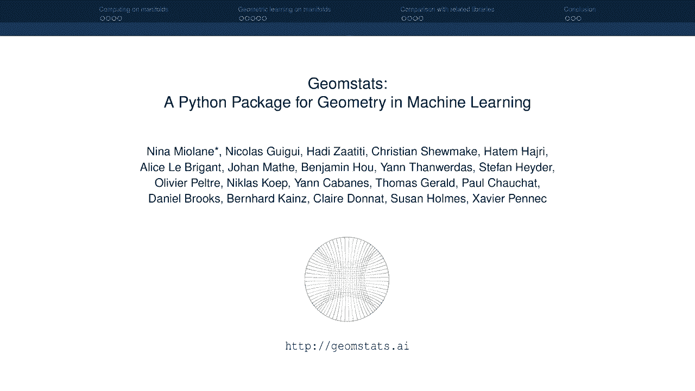
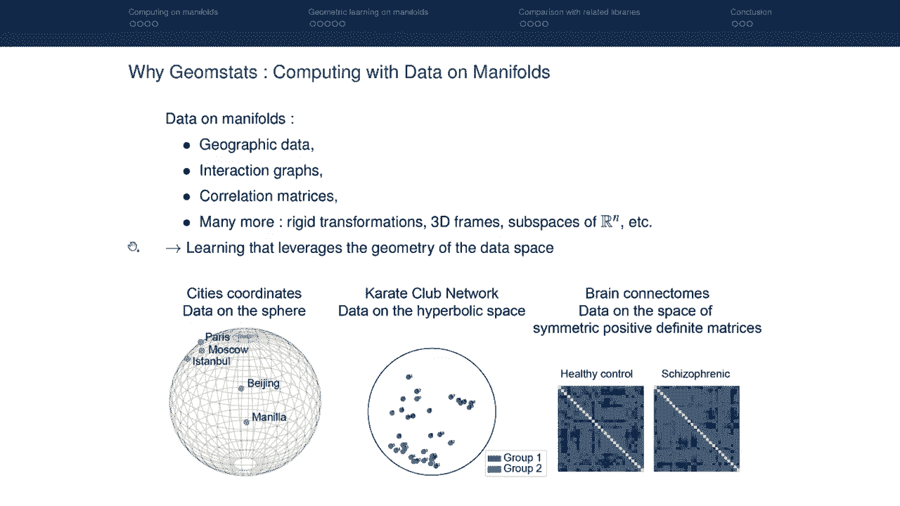
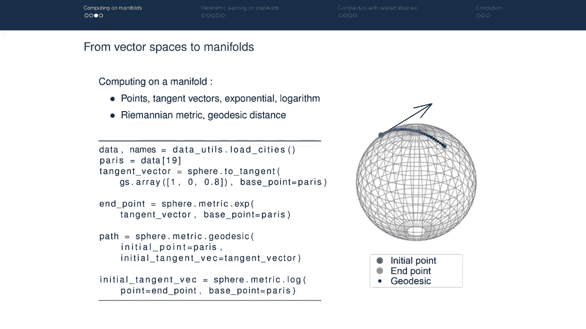
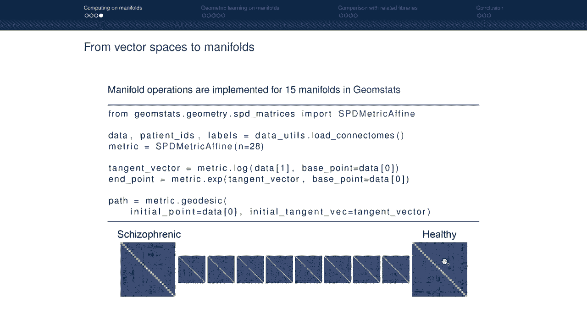
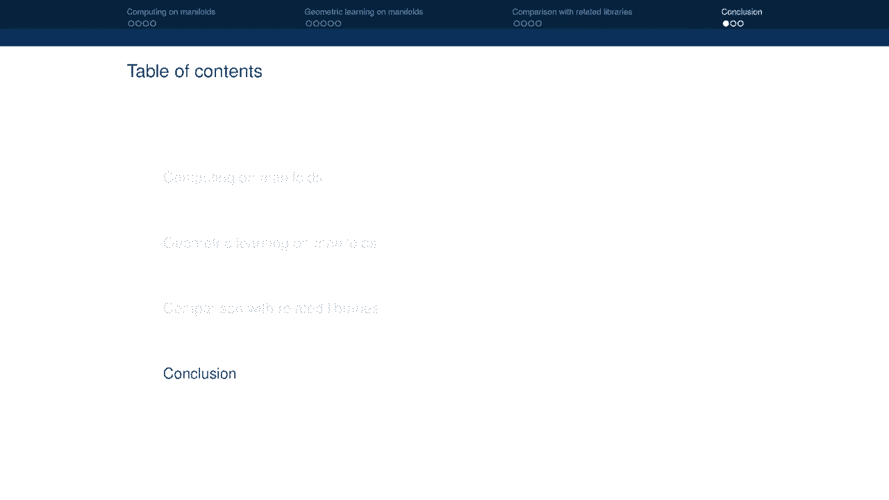
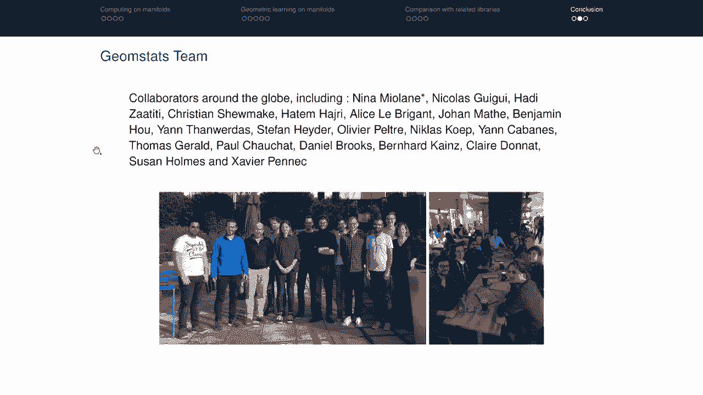
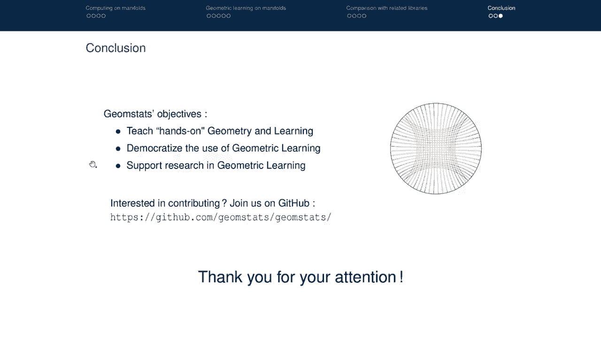

# 3：Geomstats - 机器学习中的黎曼几何 Python 包 🧮



在本节课中，我们将要学习 Geomstats，一个用于机器学习中几何计算的 Python 包。我们将了解其设计动机、核心概念、基本操作、学习算法，并与其他相关库进行比较。

## 概述：为什么需要 Geomstats？ 🎯

Geomstats 被设计用于在流形上进行数据计算。流形可以粗略地定义为可以弯曲的空间，因此本质上是非线性的。许多数据天然存在于流形上，例如地球上的城市坐标、网络中的交互图或大脑连接组的相关矩阵。为了在这些数据上应用机器学习算法，我们需要考虑数据空间的几何结构，即流形的几何结构。



## 流形上的数据示例 🌍

以下是数据存在于流形上的几个例子：

*   **地理数据**：例如地球上的城市坐标。数据所在的流形是球面。
*   **交互网络图**：例如一个混沌实验室中不同成员之间的交互图。数据所在的流形是李群空间。
*   **相关矩阵**：例如大脑连接组，即不同脑区激活之间的相关性。数据所在的流形是对称正定矩阵空间。

还有许多其他例子，如刚性变换、3D 框架、RN 的子空间等。因此，Geomstats 旨在提供能够考虑数据空间几何结构（即流形的几何结构）的学习算法。

## 考虑几何结构的必要性：以均值为例 📊

上一节我们看到了流形上数据的例子，本节中我们来看看为什么需要考虑几何结构。让我们以一个非常简单的学习算法——均值计算为例。

在向量空间中，均值 `X_bar` 的定义是数据点 `X_i` 的线性组合。然而，流形是非线性的。如果我们在线性算法（如均值）应用于非线性流形（如球面）上的数据，会发生什么？

线性均值可能不属于该流形。例如，在球面上随机采样两个点，它们的线性均值会落在球体内部，而不是球面上。

因此，我们需要为流形上的数据生成学习算法，甚至是均值这样的简单计算。这通过一个称为 **弗雷歇均值** 的广义定义来实现。弗雷歇均值计算流形上使到所有数据点平方距离之和最小的点。使用这个定义，流形上数据点的弗雷歇均值属于该流形。

在 Geomstats 中，这可以通过 `FrechetMean` 类轻松计算。该估计器依赖于流形上的距离（即球面上的度量）。拟合数据点后，我们得到的估计值就是弗雷歇均值，它确实位于流形上。

但这只是一个非常简单的学习算法。问题在于，其他学习算法如何推广到流形？如果我们需要推广均值，肯定也需要推广其他学习算法。这就是 Geomstats 的设计目的。

## Geomstats 简介 🐍

Geomstats 是一个 Python 包，提供几何统计和几何学习工具，用于在流形上进行数据计算。它被组织成四个主要模块：

*   **`geometry` 模块**：包含在流形上计算所需的所有必要操作。
*   **`learning` 模块**：包含用于流形上数据的学习算法。
*   **`datasets` 模块**：允许加载流形上的开源数据集。
*   **`visualization` 模块**：允许我们获取关于流形上这些计算的可视化信息。

Geomstats 还在三个后端实现：NumPy、TensorFlow 和 PyTorch，从而支持 GPU 计算。

Geomstats 有三个主要目标：

1.  **实践教学**：旨在填补许多教科书只教授微分几何理论而很少提供代码或编码练习的空白。
2.  **普及使用**：由于代码被封装在对象中，您可以使用 Geomstats 的几何学习算法，而无需研究算法的所有复杂数学细节。
3.  **支持研究**：通过邀请研究人员提供他们的几何学习代码并将其纳入库中，来支持几何学习领域的研究。

## 在流形上计算：基本构建块 🧱

我们知道如何在向量空间上计算。在向量空间中，有两个基本元素：点和向量。我们可以将一个向量加到一个点上得到另一个点，也可以减去两个点得到一个向量。我们还可以定义内积（例如欧几里得内积），从而得到向量空间上点之间的距离概念。这些是任何在向量空间上计算的算法的基本构建块。

如果希望算法在流形上工作，我们需要推广这些构建块。因为如果取一个向量并将其加到流形上的一个点上，会得到另一个点，但这个点可能不在流形上。

它们被推广如下：

*   **点**：我们仍然有流形上的点。
*   **切向量**：我们不再有普通的向量，而是在流形上某点处有**切向量**。
*   **指数映射**：我们不能简单地将向量加到点上，需要使用称为**指数映射**的加法推广。指数映射接收一个点和切向量，并提供流形上的另一个点。在视觉上，指数映射会从初始点沿着属于流形的路径（测地线）“发射”到终点。
*   **对数映射**：在向量空间中，我们可以减去两个点得到一个向量。在流形上，这个操作通过**对数映射**的概念进行推广。我们取两个点，通过“相减”得到一个切向量，这个切向量是从第一个点到第二个点所需的切向量。

以下是一个在 Geomstats 中如何实现这些操作的代码片段：



```python
# 加载流形上的数据，例如地球上的城市坐标
# 取流形上的一个点，例如巴黎
# 通过在巴黎的切空间中定义并投影一个向量，来定义巴黎处的一个切向量
# 使用指数映射（广义加法）尝试将此切向量加到点上
# 计算从基点沿切向量“发射”时在流形上定义的路径（测地线）
# 使用对数映射（广义减法）将一个点减去另一个点以获得切向量
```

这些操作在球面上进行了说明，因为它易于可视化。但实际上，Geomstats 为 15 种不同的流形实现了这些流形操作，包括不一定易于可视化的流形（例如高维流形）。

## 流形学习算法示例 🤖

既然我们已经有了在流形上计算的所有构建块，现在让我们看看可以在 Geomstats 中使用哪些几何学习算法。



在向量空间中，我们知道许多学习算法，可以分为两大类：**监督学习算法**（如逻辑回归）和**无监督学习算法**（如主成分分析或 K 均值）。现在我们有了推广它们的构建块，我们可以在流形上拥有类似的算法。

### 监督学习：切空间逻辑回归

在 Geomstats 中，这被实现为**切空间逻辑回归**。其思想是，即使流形是弯曲的，如果我们站在流形的一个点上，我们可以查看该数据点处的切空间，这现在定义了一个向量空间。因此，常见的做法是将流形上的所有数据点“运输”到切空间，特别是数据的弗雷歇均值处的切空间。现在，流形上的所有点都在切空间上，它们属于一个向量空间，我们可以使用通常的学习算法，例如 scikit-learn 库提供的算法。

假设我们想在 SPD 矩阵流形上设计逻辑回归。具体来说，对于每个连接组，我们希望预测它是精神分裂症患者还是健康对照者的连接组。

以下是实现步骤：

```python
# 从 geomstats 导入预处理模块和切空间对象
# 从 scikit-learn 导入逻辑回归和管道
# 加载连接组数据（流形上的数据）
# 将数据拆分为训练集和测试集
# 在 SPD 流形上定义度量
# 定义管道：首先将所有数据投影到切空间，然后应用逻辑回归
# 像通常在 scikit-learn 管道中一样进行拟合和预测
# 为 SPD 流形上的每个连接组获取标签
```

### 无监督学习：切空间主成分分析

在向量空间中，我们可以使用主成分分析来查看数据集内的主要变化。在 Geomstats 中，我们可以使用**切空间 PCA**。

假设我们想在超球面流形上使用它：

```python
# 导入切空间 PCA
# 实例化球面流形
# 生成该球面上具有随机分布的数据
# 计算数据的弗雷歇均值作为估计
# 在该弗雷歇均值处计算切空间 PCA（即在均值的切空间中进行 PCA）
# Geomstats 将提供沿流形的数据集主要变化分量
```

### 无监督学习：黎曼 K 均值

在向量空间中，我们可以使用 K 均值来查找数据簇。让我们看看这在 Geomstats 中如何工作。

假设我们有一个动力学实验室网络，其中每个点代表一个成员，如果成员之间有大量社交互动，则点靠得更近。我们希望看看是否可以将这个成员数据集分成两个互动组。该交互图可以嵌入到双曲空间中。

问题是如何在双曲空间中执行 K=2 的 K 均值。这在 Geomstats 中通过**黎曼 K 均值**实现。

```python
# 实例化流形（庞加莱圆盘，二维双曲空间的一种特殊情况）
# 加载数据集（空手道图，二维双曲空间上的数据集）
# 将图嵌入此双曲空间
# 使用黎曼 K 均值算法（双曲空间数据的 K 均值推广）
# 指定簇的数量和双曲空间的度量
# 进行拟合和预测，为每个成员分配一个标签（所属的子组）
# 同时计算这两个子组的中心
```

这些学习算法在特定流形上进行了说明，但您可以将这些学习算法与 Geomstats 中实现的 15 种流形中的任何一种一起使用。

## 与其他库的比较 ⚖️

现在我们将看看 Geomstats 与其他也执行流形计算的库的比较。这些是执行流形计算的主要库，它们有不同的目标：

*   **PyRiemann 和 PyQuaternion**：专用于特定流形。例如，PyRiemann 计算 SPD 空间上的数据，PyQuaternion 计算旋转流形上的数据。而 Geomstats 实现了许多不同的流形。
*   **Pymanopt**：在流形上执行优化。流形上的优化对于学习算法非常有用。Pymanopt 可以从 Geomstats 调用以实现学习算法本身。相比之下，Geomstats 提供微分几何的基本数学运算和学习算法的封装。
*   **VTK Geometry**：提供流形的非线性统计。它们将自己限制在计算解剖学领域有用的特定流形集。这个包实现得很好，但缺乏持续集成和单元测试。
*   **McTorch 和 GeoOpt**：旨在用于深度学习应用，并专门实现随机自适应优化。相比之下，Geomstats 实现了低层几何操作（而非优化），然后是流形上的学习算法。

我们可以从多个维度比较这些包：

*   **实现的流形**：Pymanopt 实现了非常多的流形。
*   **实现的微分几何操作**：各包支持的操作不同。
*   **可用后端**：Geomstats 和 Pymanopt 提供更广泛的后端支持（NumPy, TensorFlow, PyTorch），而其他一些库专注于单一后端。
*   **工程实践**：在持续集成和代码覆盖率方面，Geomstats 等库具有良好的单元测试和覆盖率。

## 总结与社区 👥

本节课中，我们一起学习了 Geomstats 库。让我们再次强调 Geomstats 的目标：



1.  **实践教学**：提供动手实践的几何与学习体验。
2.  **普及使用**：使几何学习算法的使用民主化。
3.  **支持研究**：支持几何学习领域的研究。



Geomstats 库由 Geomstats 团队创建，该团队是围绕核心贡献者的合作者团队。他们经常组织黑客马拉松来为这个库做贡献。



如果您有兴趣为库做贡献并加入社区，可以在 GitHub 上加入他们。