# 4：使用 Rapids 进行 GPU 加速的 Python 数据分析 🚀

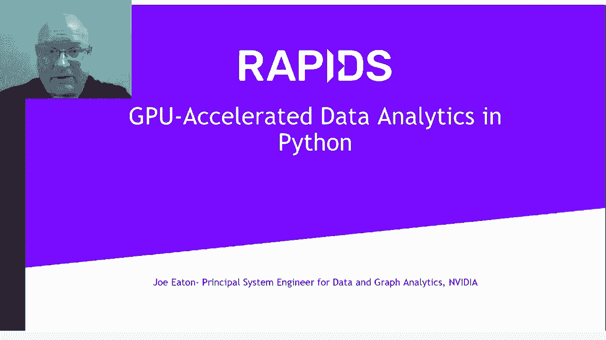

在本节课中，我们将学习 Rapids，一个用于 GPU 加速数据分析和机器学习的开源库。我们将了解其核心组件、设计理念以及如何利用它来显著提升数据处理和模型训练的速度。

## 数据处理技术的演进 📈

上一节我们介绍了课程主题，本节中我们来看看数据处理技术的演进历程。

许多开发者可能已经使用过 Hadoop、Spark 等工具，甚至尝试过 GPU 处理。总体而言，我们能够在更短的时间内处理更多数据，但一直存在一个巨大的瓶颈。

这个瓶颈并非计算本身。GPU 的计算速度非常快。真正的瓶颈在于，当连接两个应用程序时，它们有时不共享相同的数据格式。这需要一个**复制和转换**的步骤。

每次进行复制和转换，我们都在移动大量数据，执行大量额外的计算，而这些计算无助于完成我们的核心任务。因此，通过消除这些复制和转换步骤，我们可以真正释放 GPU 的更多潜力。

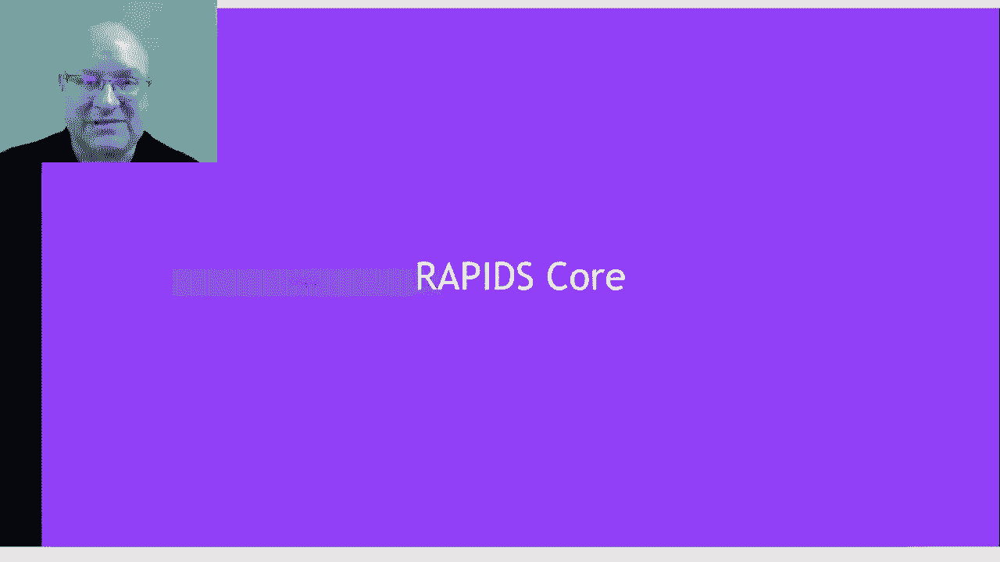

我们采用的方法是 **Apache Arrow**。我们将其内存二进制格式采纳为标准。这样，每个应用程序都能就**浮点数数组在内存布局、位序等方面**的外观达成一致。

现在我们有了一个通用的交换格式，所有应用程序和数据格式都能认同它。这直接解锁了大量新能力。

## Rapids 的愿景与动机 💡

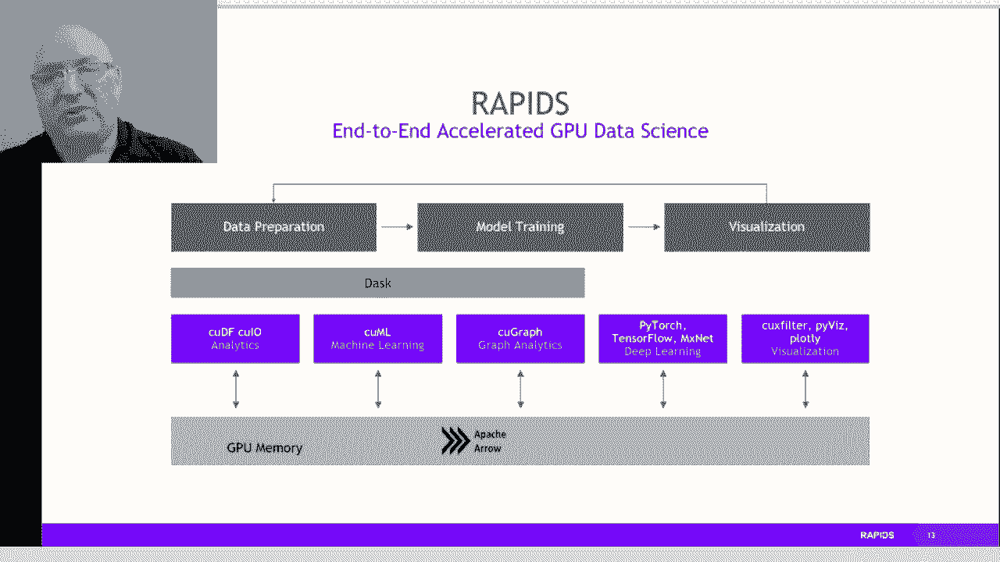

上一节我们讨论了数据交换的瓶颈，本节中我们来看看 Rapids 如何实现其愿景。

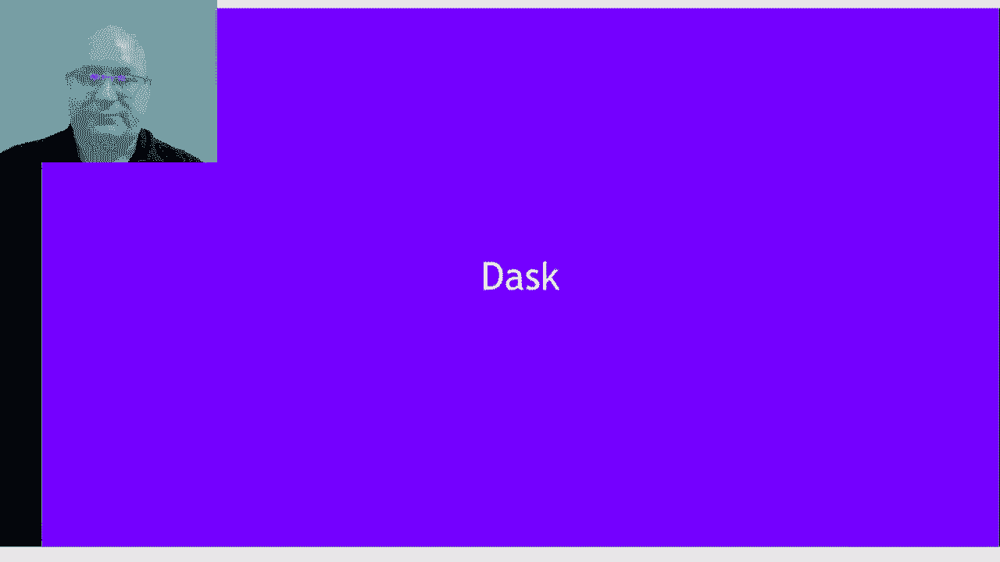

Rapids 正是这一理念的实现，同时还包含了许多其他我们将详细探讨的功能。当所有部分协同工作时，我们能够在这些大型数据处理任务上实现**几个数量级的加速**。

我们的主要动机源于 Kaggle 竞赛和开发新数据科学工作流程的过程，这是一个迭代的过程。你需要不断循环，更新特征集，重新加载数据，选取不同的数据切片。迭代速度越快，进展就越快。这正是推动我们将所有这些组件整合在一起的动力。

## Rapids 的核心：加速 Python 数据栈 ⚙️

上一节我们了解了 Rapids 的动机，本节中我们来看看它的核心架构。

我们以开源的 Python 数据栈为起点，这包括用于数据操作的 **pandas**、用于机器学习的 **scikit-learn**、用于图分析的 **networkX**，以及用于分布式计算的 **dask**。我们的目标是对整个栈进行 GPU 加速。

Rapids 旨在成为 pandas、scikit-learn 和 networkX 的**直接替代品**。它继承了 PyTorch、TensorFlow 和 MXNet 中已有的优势，并通过为 plotly、PyViz 或 datashader 等工具添加 GPU 能力来加速数据集的可视化。

## Dask：通往分布式计算的桥梁 🌉

上一节我们介绍了 Rapids 的整体架构，本节中我们重点看看 Dask 的关键作用。

Dask 是连接单台桌面/笔记本电脑与更大资源池的桥梁。我们可以将 Dask 部署到大型集群或云端，也可以与 Hadoop 或 Spark 结合使用。它是原生 Python，易于连接现有包，拥有相同的训练 API、庞大的开发者社区，易于扩展且非常流行。因此，我们选择与 Dask 合作。

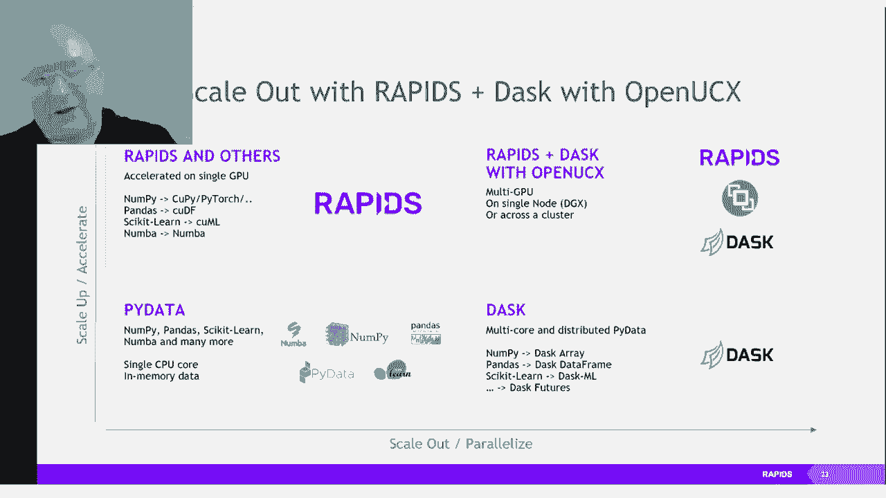

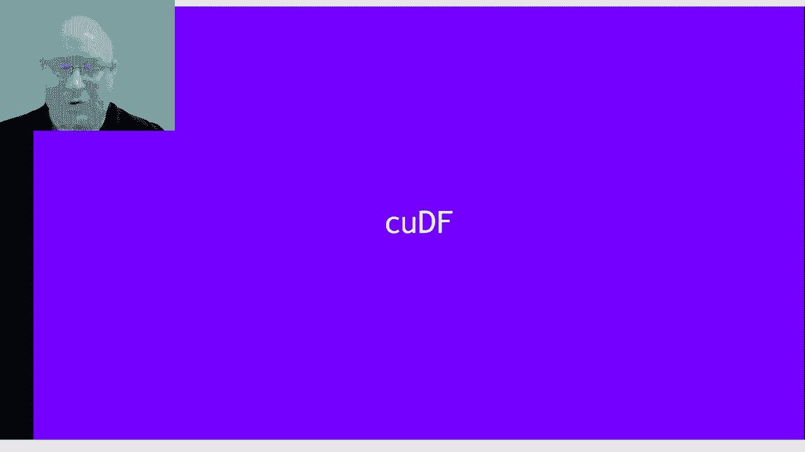

以下是一个示例：你可以向现有代码库添加一些提示给 Dask，告诉它任务定义在哪里以及依赖关系是什么，Dask 将构建任务图，并负责执行该图，确保所有任务尽可能快地完成。

这使得你可以连接所有使用笔记本电脑或台式机编码的用户，将他们的工作放在 Dask 之上，Dask 将扩展资源池，而无需他们大幅更改代码，并涵盖更广泛的计算机类别。例如，集群和大型超级计算机今天就可以运行 Dask。通过处理任务调度、图管理、故障转移处理、节点间数据复制等所有工作，Dask 承担了这一切。你只需专注于编写成功的机器学习算法，Dask 让你能够将其扩展到更大的数据集。

我们还引入了 **OpenUCX**。这使我们能够利用新的硬件能力。TCP 套接字很好，但速度慢。因此，我们允许用户在可用时连接更好的硬件。现在，Infiniband、共享内存能力甚至 NVLink 都可以用于 Dask 内部的传输。

这意味着，从 TCP 到使用 UCX，我们在合并两个数据帧时达到了约 2 GB/s 的起点。使用 UCX 和 NVLink 处理相同数据，我们立即获得了几乎两倍的性能。我们还可以引入 Infiniband。如果你的节点上有 Infiniband，现在可以将它们连接起来，达到节点间近 12 GB/s 的速度。你可以叠加这些优势，将 NVLink 与 Infiniband 结合使用。NVLink 处理节点内、工作进程内的通信，而 Infiniband 则连接跨节点。最终，在一个完全专用的节点（如拥有 16 个 GPU 的 DGX2）上，使用 UCX 可以达到 37 GB/s 的速度。

这就是我们实现这一愿景的方式：一个易于使用的 Python 数据栈，通过 Rapids 在单节点上加速。一旦完成调试并准备扩展到非常大的数据集，你可以使用带有 UCX 的 Dask，在数百个节点上获得相同的加速，以应对最大的问题。

## cuDF：GPU 加速的数据帧操作 🗃️

上一节我们探讨了分布式计算框架，本节中我们深入 Rapids 的数据处理核心组件：cuDF。

cuDF 代表 CUDA DataFrame，其目标是成为 pandas DataFrame 的等效物。它还与一个名为 **cuIO** 的 I/O 包结合，用于读取数据集、解析数据集和执行数据转换。这里的真正动机是 **ETL（提取、转换、加载）**。许多数据科学家花费 90% 的时间来了解数据。因此，我们创建 cuDF 是为了减少 ETL 时间，让人们能够专注于数据科学工作流程中更有趣的部分。

以下是我们的技术栈：CUDA 位于底层，CUDA 库位于 CUDA 语言之上。我们在 C++ 中有一组核心原语，连接到 CUDA 库。这通过 Cython 进行包装，最终用户看到的是一个 Python 包。这是一种常见模式，在介绍 Rapids 组件时我们会多次看到。

最终，cuDF 是一个 Python 库。它看起来非常像 pandas，有许多相同的命令，你可以使用相同熟悉的模式来操作数据帧。但与它结合的是一个非常快速的数据 I/O 包。现在，你可以使用 GPU 加速的 CSV 读取器，以快 10 倍的速度将数据加载到内存中。你可以更快地排序数据、采样数据、进行数据清理和插补。你甚至可以使用 Numba 编写自己的自定义用户定义函数，以满足特定需求。

以下是 cuDF 的一些性能基准，展示了其显著的加速效果：

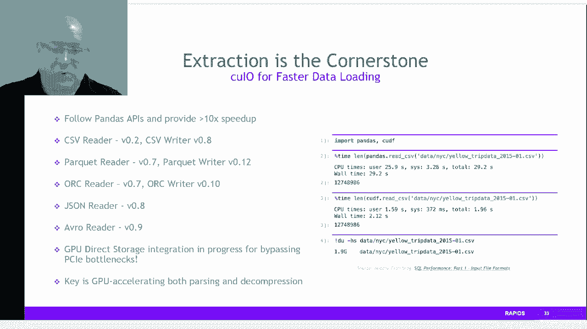

*   **数据帧连接**：速度提升高达 300 倍。
*   **数据帧排序**：速度提升高达 300 倍。
*   **大数据集分组聚合**：在 1000 万或 1 亿行的数据集上，速度提升显著。

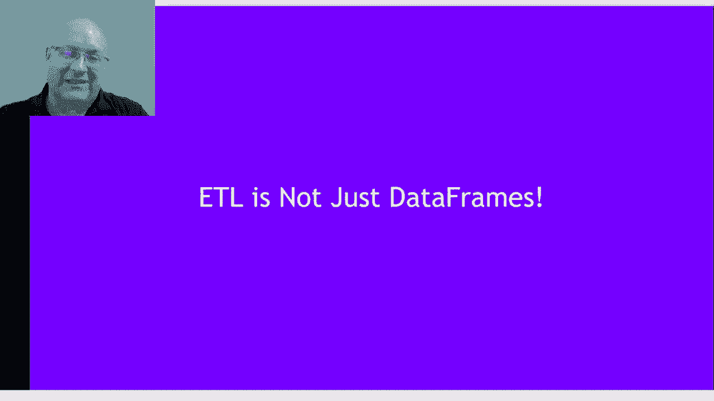

这些基准假设我们使用了内存池来减少内存分配的开销，并且是在单个 GPU 上进行的。

但数据帧并不是全部。过去，GPU 上的字符串支持并不理想。我们努力改变了这一点。现在，cuDF 原生支持字符串列，包括正则表达式和许多字符串操作，速度提升达 20 到 30 倍。分类列、字典编码等功能现在在 cuDF 中也得到了很好的支持。

我们提到了数据格式读取器和解析器。CSV 是我们首先实现的，速度提升达 10 倍。我们现在还可以处理 Parquet、ORC、JSON、JSON Lines、Avro 等格式，并且一直在增加更多支持。

## 超越 ETL：与深度学习框架集成 🔗

上一节我们专注于数据操作，本节中我们看看 Rapids 如何与深度学习生态集成。

ETL 不仅仅是数据帧。如果你的数据是图像或音频呢？我们可以连接这些数据。你可以使用 cuDF 或通用数组格式加载数据，然后通过**零拷贝**直接传递给 PyTorch、TensorFlow 或 MXNet。这是因为我们采用了用于数组/张量的 **DLPack 接口**和 **CUDA 数组接口**。通过使用这些 API，我们能够在无需移动数据的情况下，与深度学习包进行零拷贝数据交换。

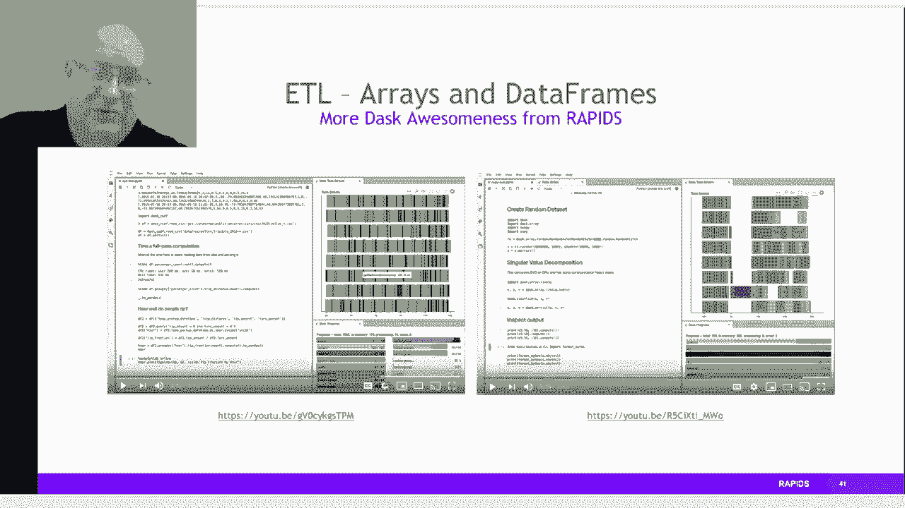

我们还展示了在 Dask 中直接替代 NumPy 数组的能力。现在，我们可以用 **cuPy** 替换 Dask 中作为大型分布式数组块依赖的 NumPy。这些块现在位于 GPU 内存中。这意味着，由于数据在更快的 GPU 内存中，你可以更快地移动和操作数据，在千兆字节大小的数据上获得 100 倍的加速。

对于像 **SVD（奇异值分解）** 这样的密集计算操作，高效分布并获得良好的加速仍然具有挑战性。Dask 和 cuPy 的结合能够在不到一分钟的时间内对 2000 万行、1000 列的数据执行 SVD。对于最大的数据集，我们已经能够使用 Dask 和 cuPy 运行总计达 **3.2 PB** 的数组。

## cuML：GPU 加速的机器学习 🤖

上一节我们讨论了数据集成，本节中我们转向机器学习的核心组件：cuML。

cuML 是一个类似于 scikit-learn 的库，旨在填补 Python 数据栈中 scikit-learn 的位置。它试图解决这样一个问题：我们拥有大量数据，并且数据集越来越大，但我们如何在固定时间内高效组织数据、清理数据并从中获取洞察？cuML 就是我们的答案。

这是一个熟悉的故事：我们从 CUDA 开始，构建 CUDA 库，从这些库中构建原语，使用这些原语编写新的机器学习算法，然后用 Cython 包装。最终用户看到的是 Python。

以下是一个使用 Moons 数据集进行聚类的示例，这是 scikit-learn 中使用 pandas 的标准示例。你可以采用完全相同的代码，只需将 import 语句中的 pandas 替换为 cuDF，将 scikit-learn 替换为 cuML，就能获得相同的结果，只是速度更快。

以下是 cuML 中模仿 scikit-learn 的一些算法列表：

*   **回归算法**
*   **分类算法**
*   **推断算法**
*   **聚类算法**
*   **分解算法**
*   **降维算法**
*   **时间序列算法**
*   **超参数调优算法**

我们一直在寻求增加更多算法。

以下是一些基准测试，比较了单 GPU cuML 与运行在 220 核 CPU 上的 scikit-learn。加速效果因算法和数据大小而异。一般来说，输入 GPU 的数据量越大，看到的加速比就越高，直到达到 GPU 能处理的最大极限。这是因为 GPU 喜欢满载运行，这为它们提供了更多的并行化和数据重用机会。在许多情况下，加速比达到 10 到 20 倍，有些情况下甚至达到 50 到 100 倍。这些加速是真实的，并且它们是 scikit-learn 的直接替代品。

让我们谈谈**推断**。推断是指获取训练好的模型（无论是神经网络还是随机森林），并尽可能快地运行它以进行预测。我们添加了一个**森林推断库**。如果你训练了一个随机森林模型或提升树模型，我们可以将其压缩到最基本要素，并在 GPU 上并行运行。现在，我们可以用这个库每秒进行 1 亿次推断，并显示出相对于仅 CPU 推断 20 到 30 倍的加速。

**XGBoost** 可能是我们集成到 Rapids 中最重要的机器学习包。我们从一开始就拥有它。现在，XGBoost 与 Rapids 建立了非常紧密的连接，能够从 cuDF、cuPy、Numba 或 PyTorch 进行零拷贝数据导入。它已经过重写和改进，我们能够使用比以前少三分之二的内存，并且现在支持 GPU 上的学习排序等新功能。

如果你对使用云服务感兴趣，Rapids 与 Amazon SageMaker、Azure ML 和 Google AI Platform 集成，它们都可以与 Rapids 和 Dask 开箱即用。我们还使用 **Ray Tune** 在超参数优化方面做了一些出色的工作。如果你有一个需要超参数调优的任务（这在机器学习中很常见），你需要进行扫描，运行几十到几百个任务来寻找最佳参数。这通常需要大量时间。现在，我们能够使用 Dask 在 GPU 上加速这一过程。因为在云端，你按使用时间付费，这直接转化为降低工作成本。对于相同的调优任务，使用 Rapids 与仅使用 CPU 相比，我们能看到成本降低 7 倍。

## cuGraph：GPU 加速的图分析 🕸️

上一节我们介绍了机器学习库，本节中我们看看用于图分析的组件：cuGraph。

cuGraph 是 networkX 的类似物，用于图分析。我们一直试图为 networkX 中熟悉的算法提供开箱即用的突破性性能和规模。我们可以采用熟悉易用的 networkX API，添加属性图支持，扩展到数十亿条边，保持 Python 特性，在底层使用 C++ 和 CUDA 运行，并不断添加新功能。

技术栈看起来很熟悉：底层是 CUDA，之上是 CUDA 库，我们有自已的原语，有使用这些原语的算法，用 Cython 包装，然后用户看到顶层的 Python 接口。

以下是 cuGraph 支持的算法列表：

*   **社区检测**
*   **连通分量分析**
*   **链接分析**
*   **链接预测**
*   **图重编号**（将非整数 ID 转换为方便计算的整数 ID）
*   **图布局可视化**（使用 GPU 加速的力导向布局算法）
*   **图遍历**
*   **最短路径算法**
*   **中介中心性**（包括边和顶点）

以下是一些基准测试，展示了 cuGraph 的速度。在常见数据集上，对于 Louvain 模块度、PageRank、广度优先搜索和单源最短路径等算法，与 networkX 相比，我们看到了高达 **200 倍** 的加速。如果你有非常大的数据集，我们对 PageRank 等算法提供了多 GPU 支持，未来会有更多算法，使你能在这些大数据集上实现每秒数百 GTEPS 的性能。

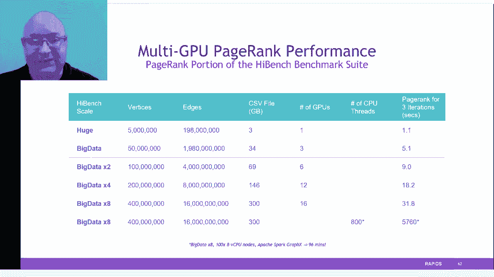

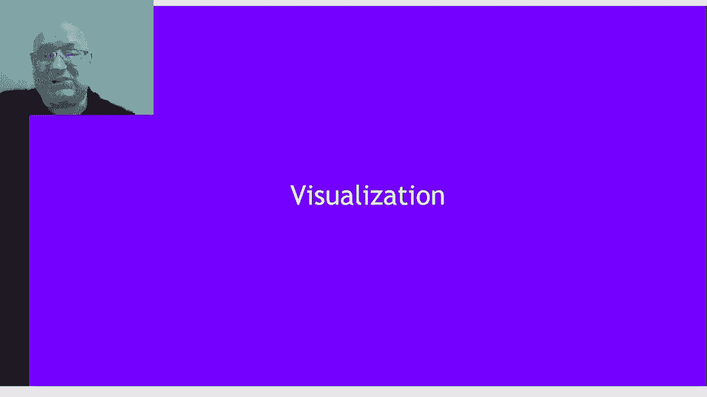

## 可视化：洞察大规模数据 👁️

上一节我们探讨了图分析，本节中我们看看 Rapids 如何帮助可视化大规模数据。

通常，数据集如此之大，以至于在概念上理解它们都很困难，而可视化是发现数据中隐藏有趣部分的关键。我们长期以来一直拥有 **cuCrossfilter**，用于数据帧中任何数据的 GPU 加速交叉过滤。这允许你构建仪表板来查看数据，开销很低，只需编写很少几行代码，你就能快速可视化和理解数据集。

**PyViz** 允许你导入大型数据集并快速在屏幕上渲染，以便查看并更快获得洞察。由于与 cuDF 的集成以及零拷贝能力，我们能够在这些大型数据集上实现 10 倍到 100 倍的加速。

**Plotly Dash** 是另一个例子，它使用 Bokeh 并通过与 Rapids 的连接，能够展示一个包含 2010 年人口普查中每个人（即 3 亿个数据点）的演示，我们可以可视化、交互、切片、进行地理查询等，所有操作都在一个高度交互的 UI 中完成。

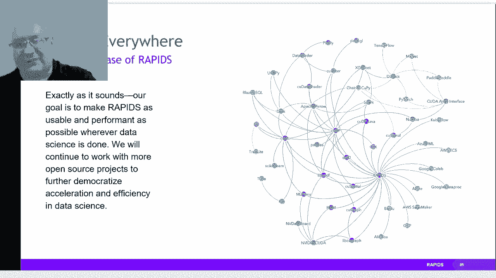

## 总结与生态系统 🌍

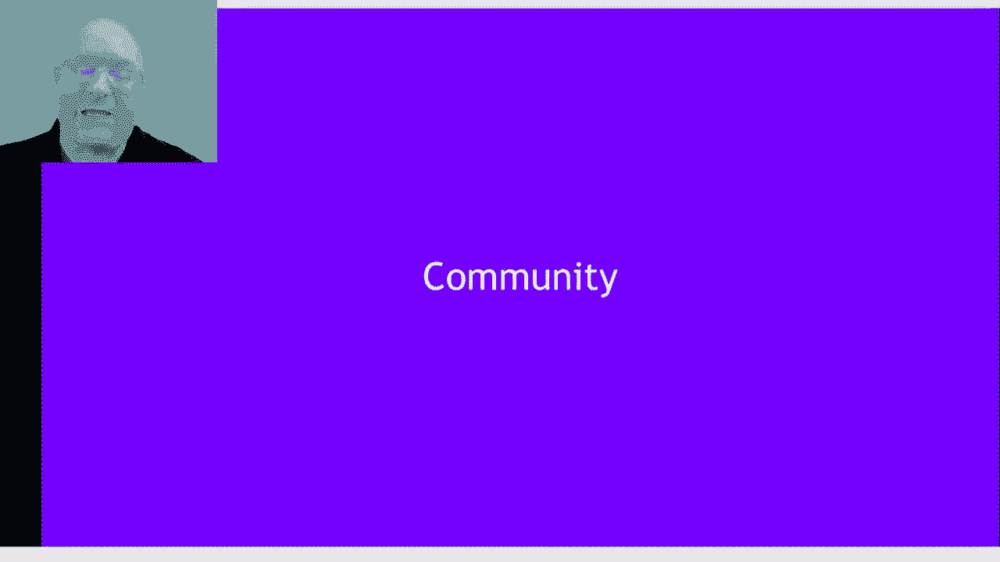

在本节课中，我们一起学习了 Rapids，一个旨在成为机器学习一切事务中心的 GPU 加速开源库。

Rapids 连接到 I/O、可视化、分析、特征工程和数据分区。它既能向上扩展（单节点多 GPU），也能向外扩展（多节点）。我们正努力让 Rapids 可用，帮助每个人将更多时间花在实际工作上，减少在 ETL 上的时间。

我们并非独自完成这项工作。我们有一个优秀的社区与我们合作，贡献代码，保持这是一个开源项目，供所有人使用。我们在工业界有许多采用者，将其用于自己的工作流程，并从这个开源软件中获得了巨大价值。

我们还提到了 **BlazingSQL**，这是一个基于 cuDF 构建的 GPU 加速 SQL 引擎，可以运行完整的 TPCH 查询集，例如直接从 Amazon S3 存储桶加载数据，无需任何特殊的数据准备。

如果你想开始使用 Rapids，有以下几种方式：

*   **Docker 容器**
*   **Conda 源下载**
*   **Google Colab**
*   **GitHub**（获取最新夜间构建版）
*   **教程 Notebook** 和端到端数据分析示例工作流
*   **安装助手**（交互式界面）
*   **详细文档**、**Slack 频道**、**Google 网上论坛**和 **Stack Overflow** 支持

主要代码获取途径包括 GitHub、Anaconda Cloud 和 NVIDIA GPU Cloud（NGC）上的预构建容器。

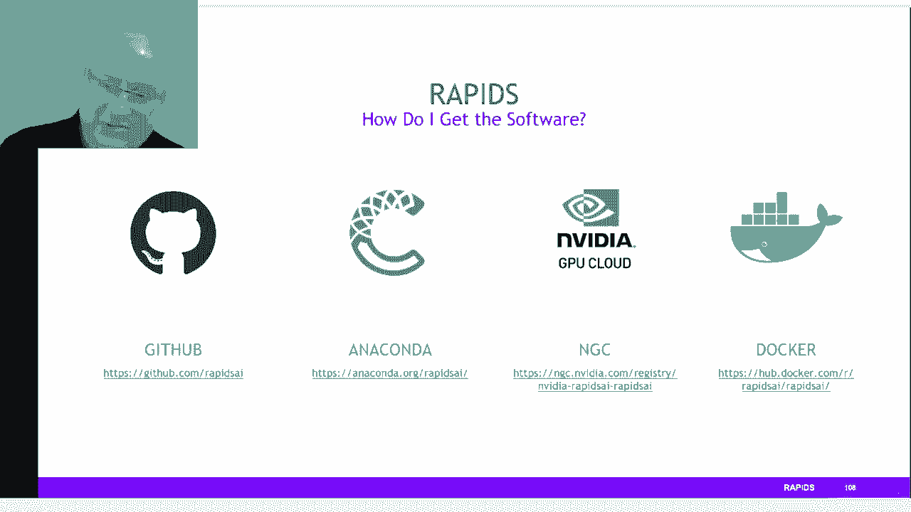

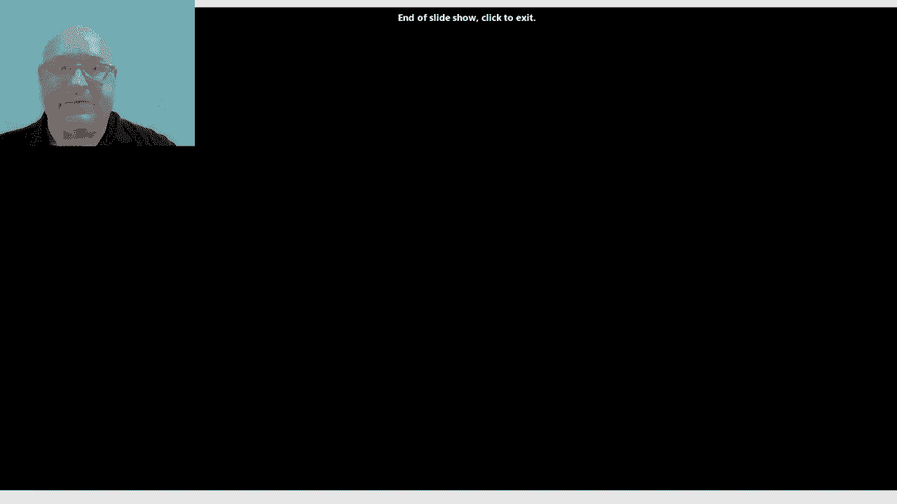

希望你能享受使用 Rapids 的过程！