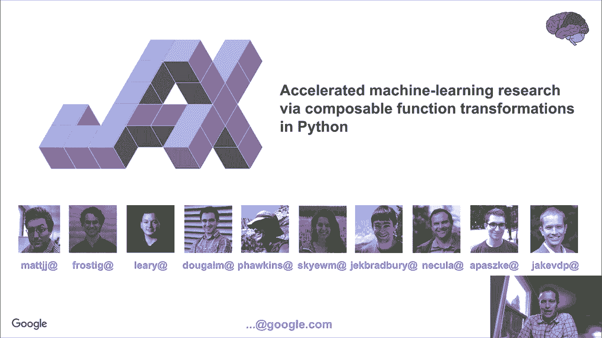
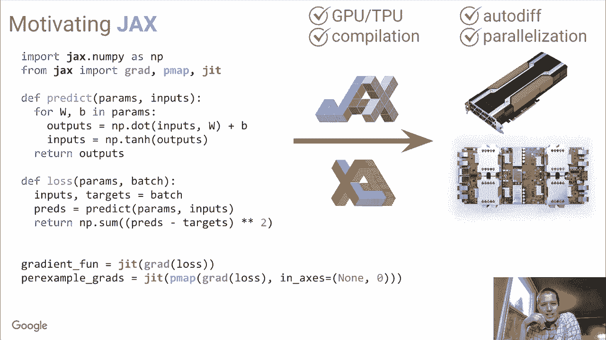
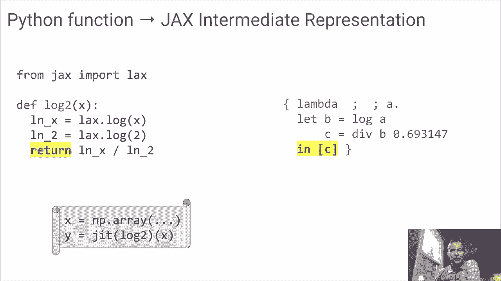
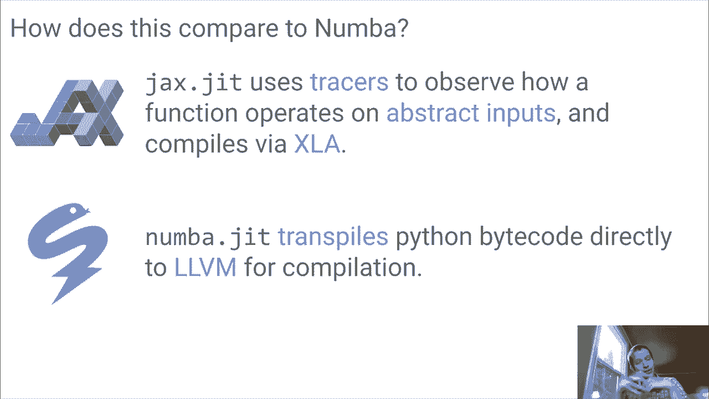

# 5：JAX - 加速机器学习研究 🚀



在本节课中，我们将学习 JAX 项目。JAX 是 Google Research 推出的一个工具，旨在为 Python 提供可组合的函数变换，以加速机器学习研究。

## 什么是 JAX？ 🤔

JAX 是一个来自 Google Research 的项目。它提供了一个工具，用于加速机器学习研究。这个工具应该是一个可组合的函数变换系统，基于 Python。

## 动机：为何需要 JAX？ 💡

为了理解 JAX 的价值，可以设想一个场景：你想在 Python 中从头实现一个深度神经网络。虽然市面上有许多专为神经网络设计的工具，但如果你想以一种高性能且可扩展的方式从头实现，会有些困难。

例如，你可以使用 NumPy 来实现神经网络的核心功能。下面是一个简单的全连接神经网络及其预测函数：

```python
def predict(params, inputs):
    for W, b in params:
        outputs = np.dot(inputs, W) + b
        inputs = np.tanh(outputs)
    return outputs
```

这个模型需要一个损失函数来进行优化。损失函数可能如下所示：

```python
def loss(params, inputs, targets):
    preds = predict(params, inputs)
    return np.sum((preds - targets) ** 2)
```

这就是深度学习。但要真正实现“深度”，将其扩展到大量数据和非常大的模型，你需要比单纯使用 NumPy 更高效的方法。

## NumPy 的局限性 🚧

为了获得高性能，深度学习通常需要在 GPU 和 TPU 等加速硬件上运行。这对于标准的 NumPy 来说很困难。
其次，由于参数数量通常很大，我们需要某种自动微分来进行梯度下降等优化。这在 NumPy 中同样困难。
此外，还有操作融合或编译的需求。例如，在计算预测值与目标值的平方差之和时，NumPy 会创建差值数组、平方差值数组，最后再求和。如果能将这些操作融合成一个，避免实例化所有中间数组，效率会更高。
最后，能够并行化计算，在不同计算节点间分发数据也是理想的功能。

## JAX 的解决方案 ⚙️

JAX 的理念是提供一个类似 NumPy 的 API，但附带了进行大规模深度学习所需的所有附加功能。



关键区别在于，我们将导入语句从 `import numpy as np` 改为 `import jax.numpy as jnp`。`jax.numpy` 不是 NumPy，但它提供了一个与 NumPy 具有相同抽象集的 API。

运行此代码时，JAX 可以将其编译为 XLA（加速线性代数库，也是 TensorFlow 的底层技术之一），并在 GPU 和 TPU 等芯片上运行。仅仅通过导入 `jax.numpy` 而不是 `numpy`，我们就获得了在加速硬件上运行的第一步能力。

但 JAX 的功能不止于此。

## JAX 的核心功能 ✨

上一节我们介绍了 JAX 的基本理念，本节中我们来看看它的几个核心功能。

以下是 JAX 提供的一些高阶函数示例：

*   **自动微分**：使用 JAX 中的 `grad` 函数，我们可以计算一个新函数来评估损失函数的梯度。JAX 了解损失函数和预测函数中的所有操作，并知道如何解析地计算其梯度。
    ```python
    from jax import grad
    grad_loss = grad(loss)
    ```
*   **向量化**：如果我们想将梯度函数映射到多个输入上，可以使用 `vmap`。
    ```python
    from jax import vmap
    batched_grad = vmap(grad_loss)
    ```
*   **即时编译**：我们可以使用 `jit` 编译函数，它接收一个输入并返回一个包装了已编译 XLA 代码的函数。编译会将诸如平方差等操作融合在一起，使它们一次性完成。
    ```python
    from jax import jit
    compiled_loss = jit(loss)
    ```
*   **并行化**：如果你想跨多个芯片并行化，可以将 `vmap` 改为 `pmap`，以跨并行架构进行映射，并使用分布式数据和计算。
    ```python
    from jax import pmap
    parallel_batched_grad = pmap(grad_loss)
    ```

本质上，JAX 可以被视为一个可扩展的系统，用于对 Python 和 NumPy 代码进行可组合的函数变换。你编写看起来像 NumPy 的代码，然后添加一些高阶函数来编译或计算梯度等。通过这种方式，你可以从这些可组合的构建块中创建高效的程序，而无需依赖专门构建的系统来获得高效计算。

## 演示：JAX 实战 🎬

让我们通过一个演示来看看 JAX 的实际应用。

### 类似 NumPy 的 API

如果你习惯使用 NumPy 库，可以这样做：

```python
import numpy as np
x = np.random.randn(2000, 2000)
```

JAX 基本上可以做同样的事情。我们导入 `jax.numpy` 并创建一个 JAX 数组：

```python
import jax.numpy as jnp
y = jnp.array(x)  # 创建一个设备数组 (Device Array)
```

这个设备数组将原本在 CPU 内存中的数组转移到了 GPU 内存中，以便 GPU 进行操作。就像我们使用 NumPy 一样，我们可以用 JAX 做所有相同的事情：元素级运算、广播运算、线性代数等。所有这些操作都在 GPU 上计算，因此速度更快。

### 即时编译 (JIT)

即时编译是一种将你编写的 JAX NumPy 代码转换为 GPU 上更高效的融合代码的方法。

考虑一个函数：

```python
def f(x):
    for _ in range(10):
        x = x - 0.1 * x
    return x
```

直接计算 `f(y)` 时，所有操作都是顺序执行的，相对较慢。JAX 提供了 `jit` 操作符：

```python
from jax import jit
g = jit(f)
```

`jit` 操作会评估函数内部的代码，并返回其编译版本。计算 `g(y)` 会得到与 `f(y)` 相同的结果，但速度要快得多（例如，从 6.9 毫秒减少到 282 微秒）。这非常强大，因为它允许你使用 NumPy 原语来表达函数，甚至无需考虑内存管理、操作顺序和操作融合等问题。你只需编写有意义的代码，然后 JAX 的 JIT 会负责将这些操作融合在一起并进行编译，使其高效运行。

### 自动微分 (Autograd)

自动微分是深度学习中快速优化模型的关键。假设有一个函数：

```python
def f(x):
    return x * jnp.sin(x)
```

手动计算其梯度需要应用链式法则。但对于复杂的机器学习模型，手动计算不切实际。JAX 提供了 `grad` 对象：

```python
from jax import grad
grad_f_jax = grad(f)
```

`grad` 接收一个函数 `f`，并返回一个计算其梯度的函数。JAX 不是通过有限差分法，而是通过查看函数及其组成的操作，本质上自动应用链式法则来解析地计算梯度。这意味着对于神经网络预测和损失函数，你可以快速计算整个过程的梯度，从而优化模型。

### 向量化 (Vectorization)

向量化允许你将为单个输入编写的代码快速转换为处理多个输入的代码。

假设有一个函数：

```python
def square(x):
    return jnp.sum(x ** 2)
```

要在向量序列上应用此函数，在 Python 中可以使用列表推导式，但这相对低效。JAX 提供了 `vmap`：

```python
from jax import vmap
map_square = vmap(square)
```

`vmap` 会查看这个操作，并创建编译代码，使得原本需要多次函数调用的计算，变成一次批处理函数调用。这可以更快地完成，无需在用户和 GPU 之间进行任何数据往返。

`vmap`、`grad` 和 `jit` 是 JAX 提供的一些函数，它们让你能够用这个库做出非常惊人的事情。

## JAX 的工作原理 🛠️

上一节我们体验了 JAX 的强大功能，本节中我们来探讨一下其底层原理。JAX 是如何在传递任意函数时进行 JIT 编译的？这与其他 JIT 库（如 Numba）有所不同。

关键在于，JAX 利用 Python 的动态特性。它向函数传递一个**抽象值**（追踪器，Tracer），这个值本身不是数组，但知道数组在特定操作下的行为。JAX 使用这个数组来表征函数的行为，并获取一个操作列表，然后将其发送给 XLA 进行编译。



例如，对于一个用 JAX 知道如何变换的底层原语构建的函数 `log2`，JAX 会传入一个代表数组的追踪器。追踪器不会实际计算任何值，而是记录对该值执行了何种操作（如对数运算）。通过这种方式，JAX 构建了一个函数实际操作的紧凑中间表示（IR），然后将其编译为 XLA。这就是 JAX 能够编译你编写的任何黑盒函数的原因。

与 Numba 等直接对 Python 字节码进行更复杂转换的工具相比，JAX 的 JIT 编译范围有限，但它对于数值计算和机器学习研究来说非常有用且高效。



## 总结 📝


本节课中，我们一起学习了 JAX 项目。我们了解到 JAX 是一个用于加速机器学习研究的 Python 库，它通过提供类似 NumPy 的 API 以及可组合的函数变换（如 `jit`、`grad`、`vmap`、`pmap`），使得代码能够高效运行在 GPU/TPU 等加速硬件上。JAX 的工作原理是通过追踪抽象值来构建计算图并编译到 XLA。尽管其 JIT 范围有限，但它已被广泛应用于从分子动力学到机器人控制等各种研究项目中，是进行高效科学计算的强大工具。