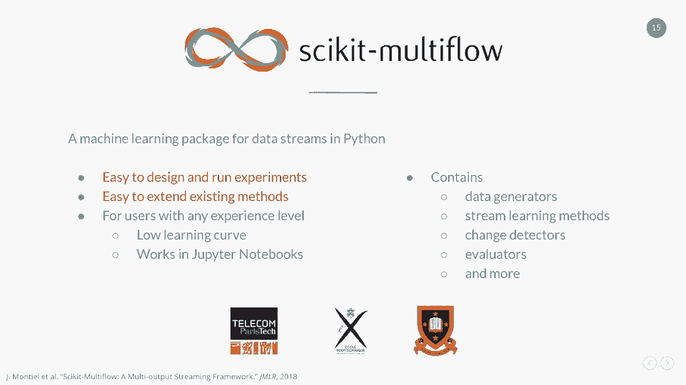
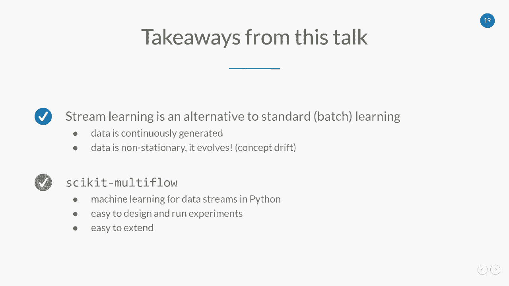

# 6：从演化数据流中学习 🚀


在本课程中，我们将学习一种不同于传统批量学习的机器学习范式——**流学习**。我们将探讨其核心概念、面临的挑战、关键算法以及如何利用工具进行实践。

---

## 概述：什么是标准机器学习？🤔

标准机器学习通常基于**批量数据**，因此也被称为**批量学习**。其流程是：首先收集并存储一段时间内的数据，然后利用这些数据训练一个数学模型，最后部署该模型以对新的未知数据进行预测。

这种方法在许多应用中表现出色。然而，在某些现实场景中，它可能面临挑战。

---

## 流学习的挑战与需求 ⚡

当数据**持续生成**而非一次性可用，或者数据**随时间变化**时，批量学习方法可能难以应对。例如，在新冠疫情期间，消费者的在线搜索行为在短时间内发生剧变，导致许多基于历史数据训练的自动供应链系统无法适应，从而引发混乱。

为了处理这类情况，我们引入了**流学习**作为替代方案。在流学习中，我们假设数据是**无限的**，并且必须以**在线方式**维护模型。这意味着我们需要：
*   处理**单样本**训练集。
*   即时地**增量式**整合数据。
*   保持**资源高效**，因为数据量是无限的。
*   能够**检测变化**并**适应**它们。

流学习通常基于以下四个要求进行：
1.  **单样本处理与单次检查**：由于存储海量数据不可行，我们通常一次只处理一个数据样本，并且只检查它一次。
2.  **有限的内存使用**：面对无限的数据流，必须严格控制内存占用。
3.  **有限的处理时间**：必须能够在新数据生成时快速处理，以免丢失信息。
4.  **随时可预测**：模型必须始终保持就绪状态，能够随时进行预测，这与批量学习有显著区别。

流学习的流程可以可视化如下：模型始终处于就绪状态，从流中接收数据。当收到带标签的数据时，它用其来训练或更新自身内部状态；当需要预测时，它接收数据并返回预测结果，然后继续等待更多数据。

---

## 核心算法：从决策树到霍夫丁树 🌳

为了具体说明流学习如何工作，我们以**决策树分类器**为例。在批量学习中，决策树通过递归归纳构建：查看所有数据，选择最重要的属性进行分割，最终形成树结构。其关键在于需要**看到所有数据**。

然而，在流学习中，我们无法一次性获得所有数据，只能一次看到一个样本。那么如何构建决策树呢？

解决方案是 **VFDT（Very Fast Decision Tree）**，也称为**霍夫丁树**。其核心思想是**增量式地扩展或分割节点**。算法从一个根节点开始，随着数据样本的流入，它会在该节点积累数据。在某个时刻，根据积累的信息决定是否进行分割。

这里的关键技巧在于：如何判断何时积累了足够的数据以做出正确的分割决策？**霍夫丁界** 为此提供了理论保证。它帮助我们确定进行节点扩展所需的正确样本量，确保在拥有足够统计信心时才进行分割。

霍夫丁树保留了批量决策树的许多优点：低方差、低过拟合。更重要的是，它是**渐近接近**于批量模型的——当数据量足够大时，流学习模型将非常接近在全部数据上训练的批量模型，而这在流学习场景中（数据量巨大）是常见的。

---

## 应对变化：概念漂移与检测 🎯

在动态且不断演化的环境中，数据分布可能随时间改变，这种现象称为**概念漂移**。我们的目标是**在发生分布变化时发出警报**。漂移检测的一个重要应用是监测模型性能的变化。

以下是几种常见的漂移类型：
*   **突然漂移**：从一个概念突然切换到另一个概念。
*   **渐进漂移**：在过渡期间，两个概念会同时存在并交互。
*   **增量漂移**：在从一个概念过渡到另一个概念的过程中，存在一些中间概念。
*   **重复性漂移**：概念发生变化后又回到原来的概念。

在漂移检测中，一个重要挑战是避免将**异常值**误判为概念漂移。

一个流行的漂移检测方法是 **ADWIN（Adaptive Windowing）**。它维护一个自适应窗口，该窗口包含两个子窗口。ADWIN 会持续监测这两个子窗口内数据的平均值。随着新数据的到来，它会寻找一个分割点，使得两个子窗口的平均值尽可能相似。如果发现两个子窗口的平均值出现显著差异，就意味着检测到了分布变化，从而触发警报。

这个过程是完全在线的，并且能以**对数级的内存和更新时间复杂度**运行，这对于需要恒定内存和亚线性处理时间的流学习应用来说非常高效。

---

## 流学习方法 vs. 批量方法：一个对比实验 📊

本节我们通过一个实验来展示在特定场景下使用流学习方法的优势。实验使用一个包含三次突然漂移的合成数据集，并比较两种算法：
*   **XGBoost**：一种基于批量学习的集成方法（树的集合）。
*   **自适应随机森林**：随机森林的流学习版本，也是一种集成方法。

在实验中，批量模型 XGBoost 使用部分数据预先训练，然后部署到数据流上。可以看到：
1.  在初始概念与训练数据一致时，XGBoost 表现良好。
2.  第一次漂移发生后，性能急剧下降，因为模型无法识别新数据。
3.  第二次漂移后，性能有所回升，可能因为新概念与旧概念有相似之处。
4.  第三次漂移后，性能再次变差。

另一方面，流学习模型自适应随机森林的表现是：
1.  开始时需要学习，但很快达到良好性能。
2.  遇到第一次漂移时，性能下降，但**能快速恢复**。
3.  后续遇到漂移时，表现出相同的行为模式。

这个对比凸显了**适应性和快速反应能力**的重要性。在批量学习模型部署中，一旦出现性能下降，往往需要人工干预并重新触发整个批量学习流程，步骤繁琐。而流学习模型则能自动、持续地适应变化。




---

## 流学习模型的评估方法 📈

评估流学习方法时，我们需要考虑一些特殊因素。主要有两种评估方法：

1.  **留出法**：类似于批量学习，保留一个独立的测试集。我们从数据流中存储一部分数据作为测试集，并定期用它对模型进行测试。
2.  **预检验评估**：也称为“测试再训练”法，这是流学习中非常流行的方法。其关键在于**顺序很重要**：我们依次处理每个样本，先用它进行**测试**，然后再用它进行**训练**。这种方法利用了数据流中的所有数据。

---

## 实践工具：Scikit-Multiflow 🛠️

为了简化流学习的实验设计和实现，我们引入 **Scikit-Multiflow**，这是一个用于 Python 数据流的机器学习库。

Scikit-Multiflow 的目标是：
*   易于设计和运行实验。
*   易于扩展现有方法。
*   面向有经验的用户，学习曲线平缓，兼容 Jupyter Notebook。

其当前版本包含多种功能，如数据生成器、流学习方法、变化检测器、评估器等。

以下是使用 Scikit-Multiflow 的两个简单演示：

**演示一：分类任务与预检验评估**
我们使用一个合成数据流和一个朴素贝叶斯分类器。预检验评估可以通过一个简单的循环实现：
```python
while 有数据且样本数 < 2000:
    # 1. 从流中获取一个样本（特征X, 标签y）
    # 2. 使用当前模型对X进行预测（测试阶段）
    # 3. 将预测结果与真实y比较，计算指标（如准确率）
    # 4. 用该样本(X, y)增量训练模型（训练阶段）
```
Scikit-Multiflow 将这个过程封装成了 `PrequentialEvaluator` 类，可以方便地比较多个模型（如朴素贝叶斯 vs. SGD分类器）的性能，并动态绘制准确率、运行时间、模型大小等指标。

**演示二：概念漂移检测与性能影响**
我们生成一个包含三个不同分布阶段的数据流。使用 ADWIN 检测器在循环中处理每个样本，它能成功在分布变化的边界点（第1000和第2000个样本附近）发出警报。

接着，我们比较两种树模型在真实漂移数据集上的表现：
*   **霍夫丁树**：基础版本。
*   **自适应霍夫丁树**：改进版本，它在树的节点中使用 ADWIN 来检测局部变化。如果发现某个节点的性能发生变化，它会创建替代分支，并在其表现更好时最终替换原分支。

实验结果显示，自适应霍夫丁树在漂移发生后恢复更快，整体性能更优。有趣的是，它的最终模型内存占用也更小，这表明模型内部结构根据变化进行了动态调整和优化。

---

## 总结与要点 ✅

本节课我们一起学习了以下核心内容：

1.  **流学习是标准批量学习的重要替代方案**，尤其适用于数据持续生成且非平稳（即存在概念漂移）的场景。
2.  **Scikit-Multiflow** 是一个强大的 Python 库，用于数据流上的机器学习。它的两大优点是易于设计运行实验以及易于扩展。

流学习使我们能够构建出能够持续学习、适应变化并随时提供预测的智能系统，是处理现代动态数据的关键技术。

---




**Scikit-Multiflow** 是一个开源项目，可通过 GitHub、PIP、Conda 获取，也提供 Docker 镜像，支持 Linux、Mac OS 和 Windows。我们欢迎社区的贡献和合作。