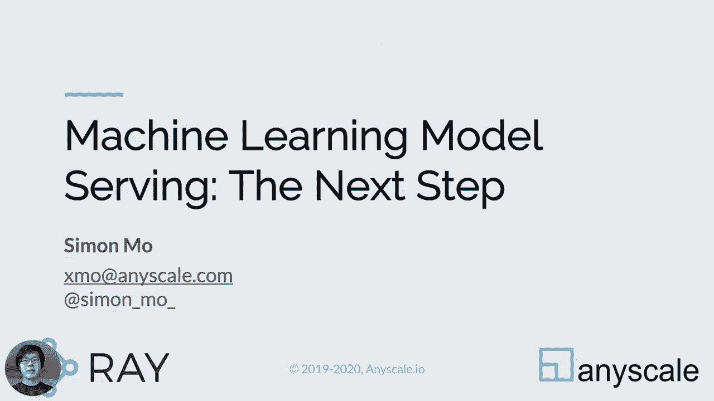
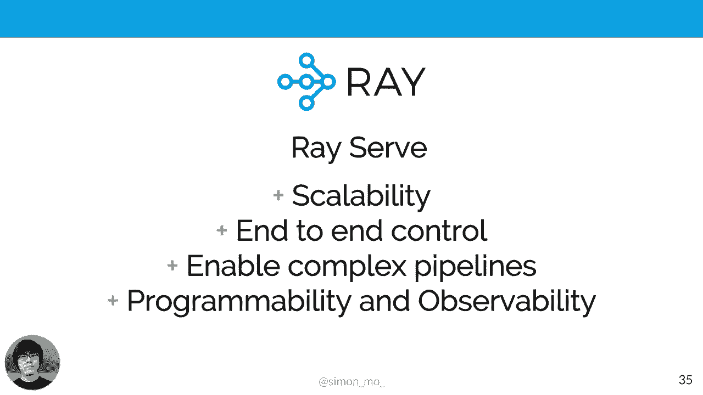
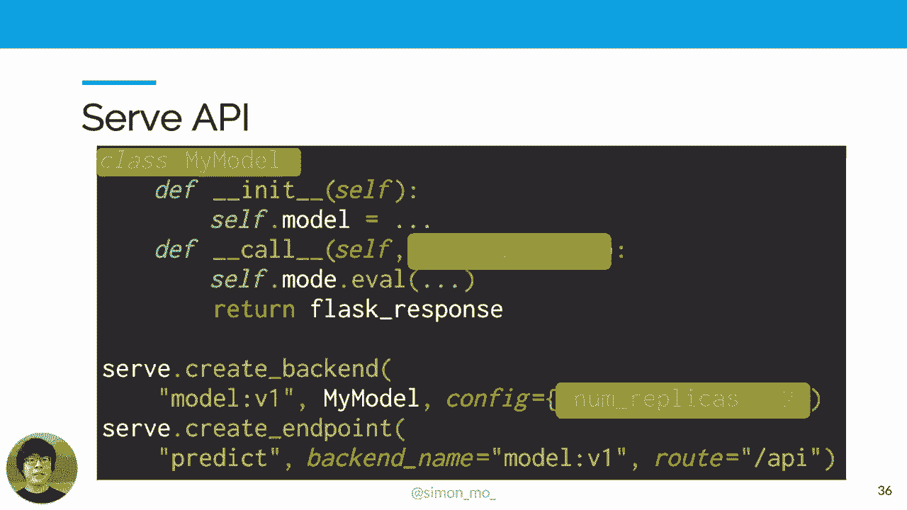
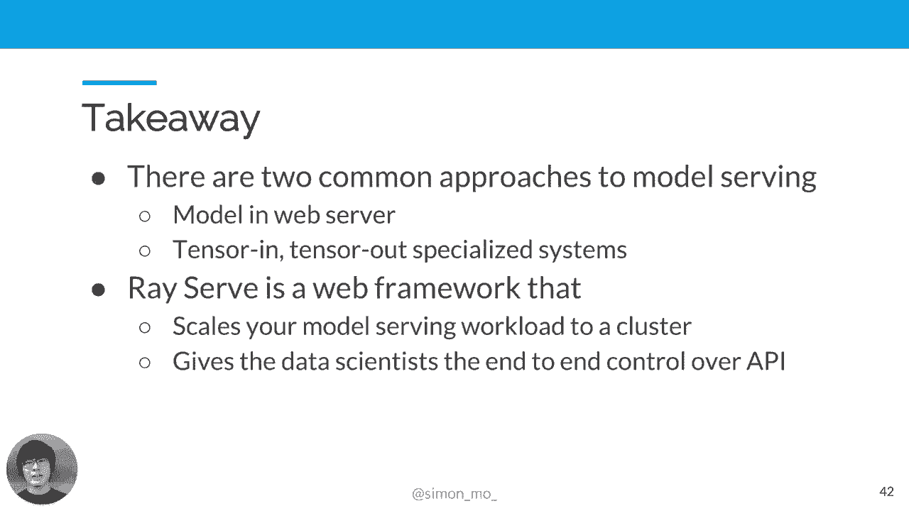

# 7：机器学习模型部署与服务化 🚀



在本教程中，我们将学习机器学习模型部署与服务化的核心概念、常见方法及其挑战，并介绍一个名为 **Ray Serve** 的新框架，它旨在解决现有方案的痛点。

## 什么是模型服务化？🤔

模型服务化，也称为模型推理或预测服务，是机器学习生命周期中的一个关键阶段。构建和部署机器学习驱动的应用通常包含三个主要步骤：
1.  **模型开发**：收集和分析数据，迭代改进模型。
2.  **模型训练**：将模型投入训练管道，从生产数据中学习。
3.  **模型推理**：将训练好的模型部署到预测服务中，供用户应用调用。

我们本次讨论的重点是最后一个阶段——**模型推理与服务化**。

## 模型服务化的核心需求 📋

一个典型的模型服务系统需要满足一系列独特的需求。以下是七个基本要求：

**1. 支持多模型复用**
在实际应用中，我们通常需要同时服务多种模型。这些模型可能版本不同、算法不同，甚至架构也不同。模型服务器应能处理不同模型间的复用。

**2. 支持透明扩展与负载均衡**
机器学习模型通常计算密集且耗时。为了避免请求堆积，服务系统应能透明地将模型扩展到多个副本，并通过负载均衡实现请求的并行处理。

**3. 支持批处理以提高效率**
尽管模型计算量大，但它们可以利用硬件并行性（如向量化指令、多线程）来高效处理批量输入。对一批图像进行推理的成本，通常远低于对单个图像进行多次独立推理。

**4. 支持版本管理与无缝部署**
在生产中，我们经常需要基于新数据重新训练模型或尝试不同超参数。因此，服务系统需要支持零停机部署、渐进式发布、回滚以及A/B测试等功能。

**5. 集成预处理与后处理逻辑**
模型通常接收和输出数值张量，但这并非用户期望的格式。输入需要验证和转换，输出需要解释。因此，预处理和后处理逻辑对模型服务至关重要。

**6. 优化性能与成本**
由于模型计算成本高、吞吐量相对较低，为了处理大量数据，我们需要在成本、性能、延迟和吞吐量之间进行权衡。服务系统应允许调整这些参数，并帮助优化成本效益。

**7. 高可用性与可观测性**
系统需要具备监控和可观测性工具，确保服务稳定运行，并在出现故障时能够快速恢复。

## 当前常见的模型服务化方法 🔧

目前主要有两种部署模型的方法，它们各有优劣。

### 方法一：嵌入到传统Web服务器中

这种方法通常将模型包装在传统的Web服务器（如使用Python的Flask框架）中。

**工作原理简述：**
1.  HTTP请求到达Flask服务器。
2.  服务器将请求分发到不同的API端点。
3.  其中一个端点处理器负责处理模型评估。
4.  输入数据被转换后，送入模型进行评估。
5.  输出结果被封装并返回。

**优点：**
*   **简单直观**：易于构建和理解，适合演示或概念验证。
*   **控制力强**：开发者对请求处理和模型服务方式有完全的控制权。

**缺点与挑战：**
*   **扩展性差**：难以处理并发请求或多个模型同时服务。
*   **生命周期管理难**：模型通常作为全局变量加载，缺乏对启动、初始化和生命周期的精细控制。
*   **稳定性风险**：一个模型崩溃可能导致整个Web服务器宕机。
*   **内存问题**：在多进程部署中，多个模型副本会迅速消耗大量内存。
*   **难以构建复杂流水线**：现实应用往往涉及预处理、后处理、多模型组合（如集成学习、级联推理）等复杂逻辑，在简单Web服务器中实现这些非常困难。

### 方法二：卸载到外部专用服务

当简单Web服务器无法满足需求时，人们转向第二种方法：将预测任务卸载到外部专用服务。

**工作原理简述：**
1.  Web服务器接收HTTP请求。
2.  服务器执行部分预处理（如验证、解析、特定业务逻辑转换）。
3.  将处理后的中间数据（如数值张量）通过RPC发送给外部推理服务（如TensorFlow Serving）。
4.  外部服务执行核心模型推理。
5.  推理结果返回给Web服务器。
6.  Web服务器执行后处理，并将最终结果封装为HTTP响应。

**代表服务：** TensorFlow Serving, ONNX Runtime, NVIDIA TensorRT, AWS SageMaker。

**优点：**
*   **关注点分离**：将计算密集的推理任务与业务逻辑分离。
*   **专业化**：专用服务通常针对性能进行了高度优化。

**缺点与挑战：**
*   **操作复杂性高**：需要单独管理和调优多个服务。
*   **逻辑割裂**：模型推理逻辑与核心业务逻辑分离，一方的变更需要同步到另一方，增加了维护成本。
*   **学习曲线陡峭**：需要学习新的API和定制系统。
*   **调试困难**：问题排查涉及多个进程和服务，不再是一个简单的单进程应用。
*   **配置繁琐**：需要处理RPC、外部服务配置、编解码甚至加密等问题。

## 新一代解决方案：Ray Serve 框架 🎯

为了克服上述方法的缺点，我们开发了 **Ray Serve**。它是一个基于分布式运行时 **Ray** 构建的框架，旨在简化机器学习模型服务化。

**Ray Serve 的核心优势：**

1.  **轻松扩展**：利用Ray系统，可以轻松、透明地将模型扩展到数百个核心。
2.  **端到端控制**：像Web服务器一样，给予开发者对请求处理的完全控制权。
3.  **独立隔离与扩展**：将每个模型作为独立组件进行隔离，并可以独立扩展每个模型。Ray Serve负责负载均衡和管理不同的模型副本。
4.  **原生流水线支持**：允许用户轻松组合多个模型，在Python中构建和连接复杂的处理流水线。
5.  **可编程性**：作为一个可编程的服务系统，允许在运行时修改其行为。
6.  **开箱即用的监控**：提供内置的监控和可观测性工具。

### Ray Serve API 简介

**定义模型**
模型可以通过简单的Python类来定义。在 `__init__` 方法中加载模型，在 `__call__` 方法中定义请求处理逻辑。Ray Serve暴露了类似Flask的请求接口，易于理解和使用。

```python
import ray
from ray import serve



@serve.deployment
class MyModel:
    def __init__(self):
        # 在此加载你的模型
        self.model = load_your_model()

    async def __call__(self, request):
        # 获取请求数据
        data = await request.json()
        # 预处理、推理、后处理
        result = self.model.predict(data["input"])
        return {"prediction": result}
```

**核心概念：后端与端点**
*   **后端**：与模型实现相关联，是版本化的、可扩展的单元。你可以指定副本数量。
    ```python
    MyModel.deploy() # 创建后端并部署
    ```
*   **端点**：用户可调用的逻辑服务，与HTTP路由关联，并且可以连接到多个后端。端点可以将流量按比例分配到不同的后端（用于A/B测试），或者将请求串联到不同后端（用于流水线处理）。



**配置即代码**
在Ray Serve中，配置语言就是Python。你使用熟悉的Python代码来配置整个运行系统，而不是复杂的YAML文件。

**部署与容错**
由于构建在Ray之上，Ray Serve可以部署在从笔记本电脑到Kubernetes集群的任何环境。Ray的分布式运行时确保了系统的高可用性和容错性，组件故障会自动重启和重连。

## 总结 📝

本节课我们一起学习了机器学习模型服务化的核心内容：

1.  **模型服务化**是ML生命周期中将训练好的模型投入生产使用的关键阶段。
2.  服务化系统需满足**多模型支持、扩展性、批处理、版本管理、预处理/后处理集成以及成本优化**等独特需求。
3.  当前两种主流方法各有局限：**嵌入Web服务器**简单但难以扩展和构建复杂流水线；**卸载到外部服务**功能强大但引入了操作复杂性和逻辑割裂。
4.  **Ray Serve** 作为一个新兴框架，试图融合两者的优点：它提供了类似Web服务器的开发体验和端到端控制能力，同时具备了分布式系统轻松扩展和专业化管理的优势。通过Python API，它让构建、组合和部署生产级模型服务变得更加简单。

你可以通过 `pip install ray[serve]` 来尝试Ray Serve，并查阅其文档和社区资源以了解更多。



希望本教程能帮助你理解机器学习模型服务化的挑战与解决方案。