# 8：优化人与机器以推动科学 🧠⚙️

在本教程中，我们将学习机器学习中的特征选择。特征选择是构建高效、准确且易于解释模型的关键步骤。我们将探讨三种主要方法，并了解如何根据具体问题选择合适的方法。

## 动机：为什么需要特征选择？🤔

机器学习遵循一个核心原则：**垃圾进，垃圾出**。高性能模型的关键往往不在于复杂的算法，而在于一个精心构建的特征空间。从初始数据集中剔除无关特征，同时保留相关特征，并非易事。目前尚无系统的方法，但如果不进行选择，直接使用大量特征训练模型会导致两个问题：一是计算成本高昂，二是可能导致过拟合，使模型学到虚假的、随机的规律。

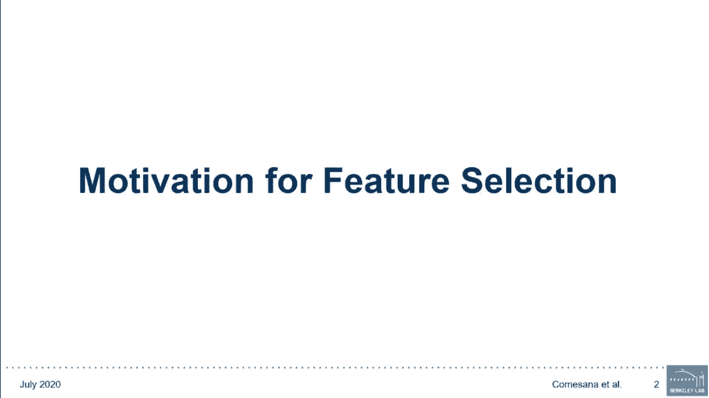

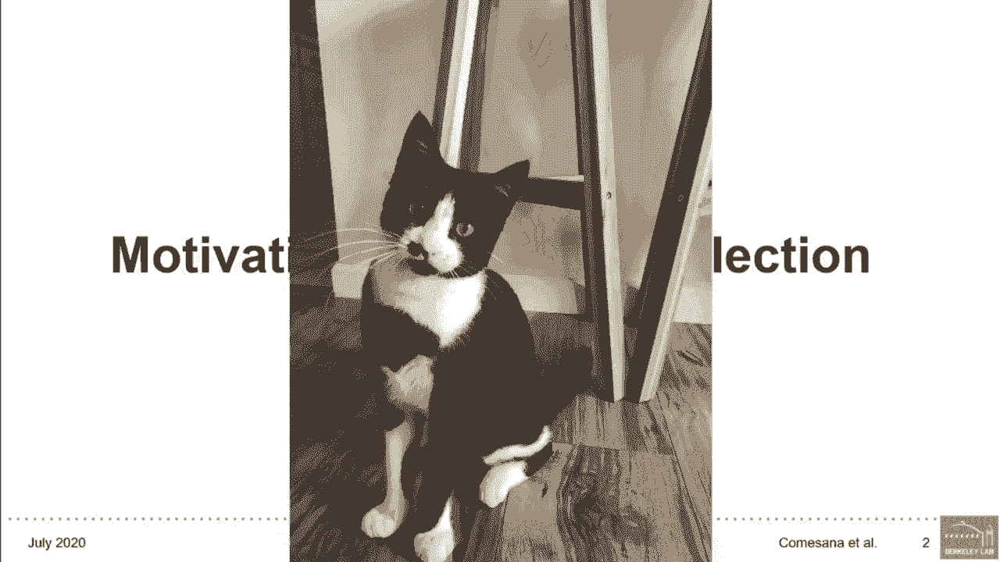


## 特征选择的目标与益处 🎯

特征选择是主动减少特征空间的过程，其思想类似于奥卡姆剃刀原理：简单的解决方案比复杂的更可能是正确的。我们的目标是用比现有更少的特征来寻找数据的表示和关系。

这带来三大益处：
1.  **模型训练更快**，得到更具成本效益的预测器。
2.  **过拟合风险更低**，从而提升预测器性能。
3.  **模型更易于解释**，有助于更好地理解数据中蕴含的关系。

## 特征选择的两种视角 👓

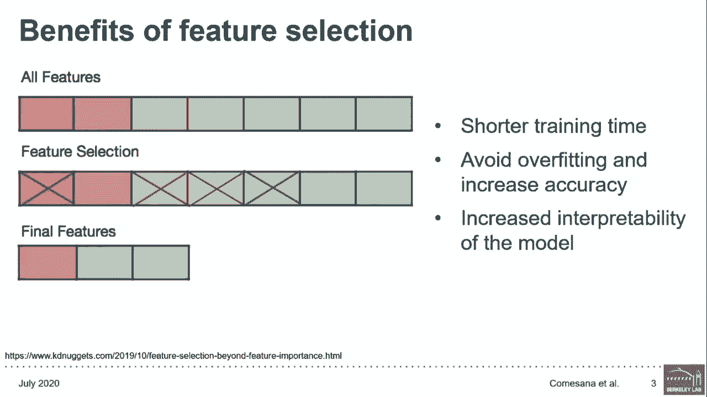

进行特征选择主要有两种动机：

1.  **以模型性能为唯一目标**：目标是构建一个优秀的预测器，不关心模型如何做出区分。
2.  **以模型可解释性为目标**：目标是基于找到的相关特征获得洞察，例如了解疾病的成因。

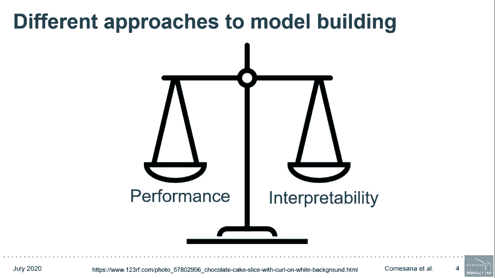

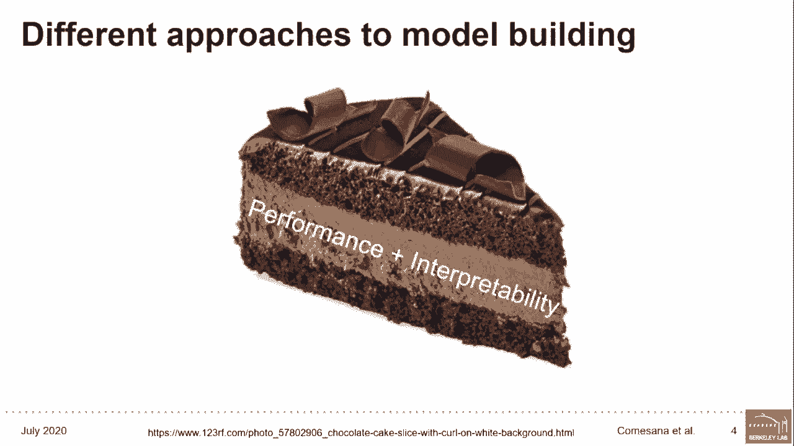

这两种方法并非必须取舍。有些特征选择方法既能保证良好的准确性，又具有可解释性，并能帮助生成关于目标与特征关系的假设。本教程将聚焦于这类方法。

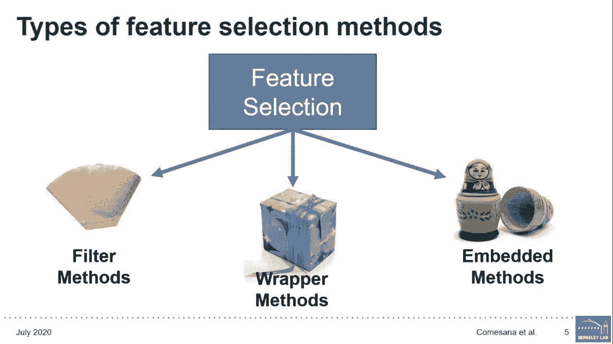

## 特征选择的三种主要方法 🗂️

上一节我们介绍了特征选择的动机和目标，本节中我们来看看实现这些目标的具体方法。主要有三种类型的特征选择方法：

### 1. 过滤法 (Filter Methods) 🧹

过滤法在不进行任何学习的情况下，直接从数据中提取特征。它通常作为数据预处理步骤，其核心思想是为每个特征分配一个启发式分数，以过滤掉无用的特征。驱动这些方法的问题是：**这个特征是否包含足够的信息？**

以下是过滤法的两种主要类别：

*   **单变量方法**：根据某些标准（如方差）对单个特征进行排名，然后选择排名前 N 的特征。这种方法擅长移除恒定或近似恒定的特征，但可能留下冗余变量，因为它不考虑特征之间的相互关系。
*   **多变量方法**：考察变量之间的相互关系，因此擅长移除重复的、高度相关的特征。衡量相关性的方法有很多，例如皮尔逊相关系数（衡量线性关系强度）或斯皮尔曼相关系数（衡量单调关联程度）。

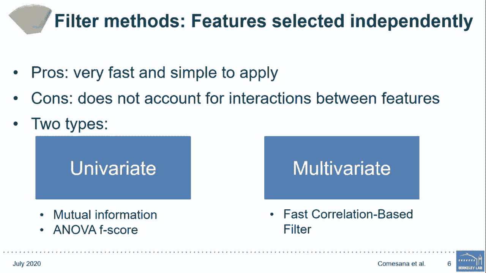

**何时使用**：过滤法适合作为高效的初始步骤，快速过滤数据，特别是在算法运行时间是瓶颈时。由于这些方法独立于模型，因此选出的特征可用于任何机器学习模型或其他特征选择方法。

**代码示例**：
```python
# 单变量过滤：选择K个最佳特征（基于互信息）
from sklearn.feature_selection import SelectKBest, mutual_info_regression
selector = SelectKBest(score_func=mutual_info_regression, k=10)
X_new = selector.fit_transform(X, y)

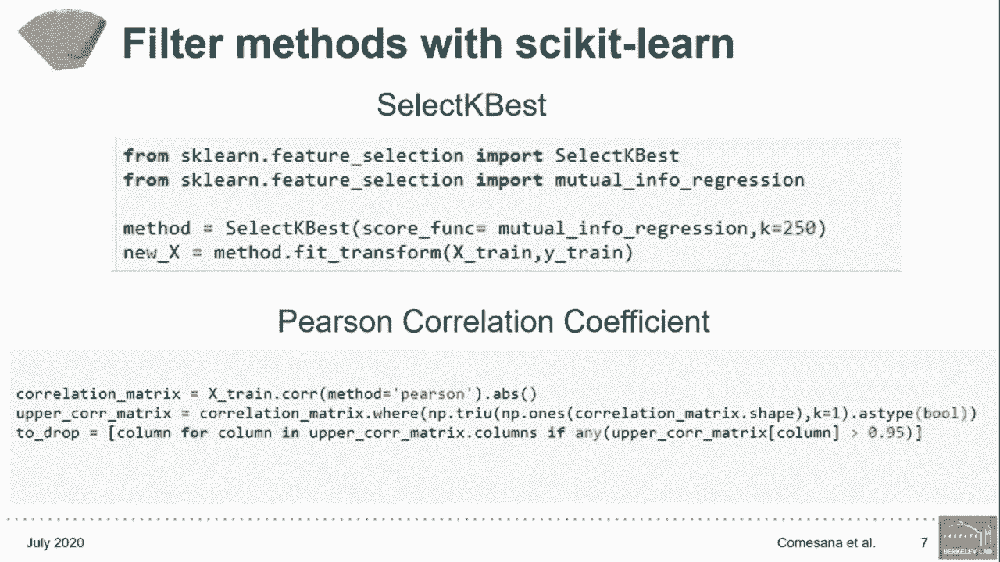

# 多变量过滤：基于皮尔逊相关系数移除高相关特征
import pandas as pd
corr_matrix = X.corr().abs()
upper_tri = corr_matrix.where(np.triu(np.ones(corr_matrix.shape), k=1).astype(bool))
to_drop = [column for column in upper_tri.columns if any(upper_tri[column] > 0.95)]
X_reduced = X.drop(to_drop, axis=1)
```

### 2. 包装法 (Wrapper Methods) 🎁

包装法基于给定算法的性能质量来评估每个特征子集，旨在找到最佳的可能特征子集。由于它们能检测变量间的交互作用并直接优化预测性能，因此在特征选择上往往表现更好，但随着特征空间增长，计算成本会变得非常高昂。

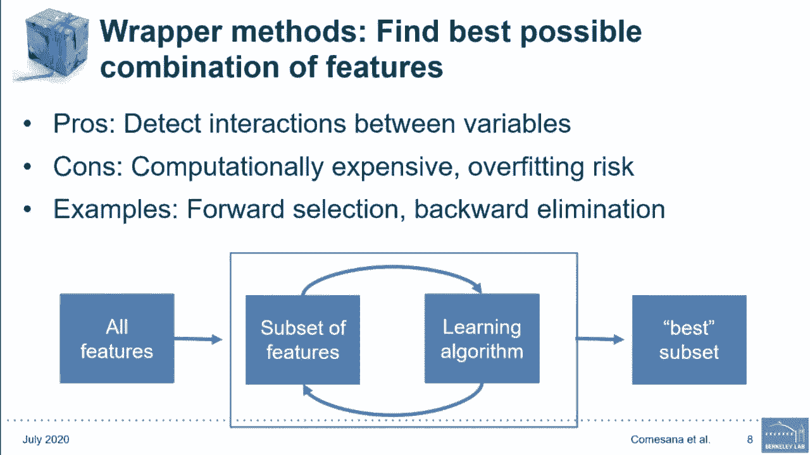

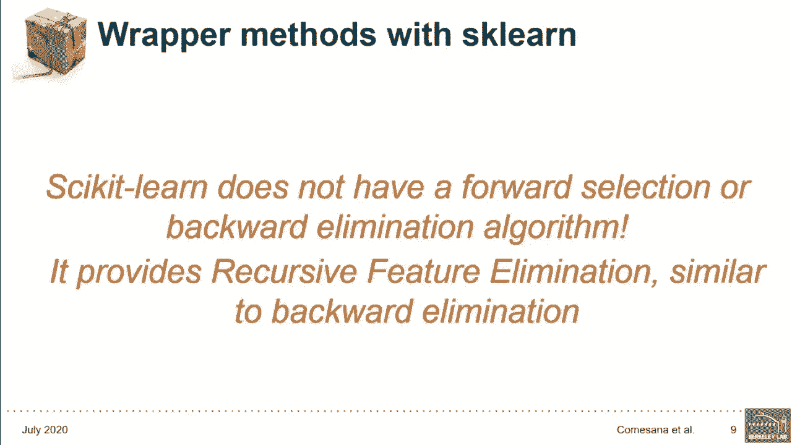

以下是两种常见的包装法策略：

*   **前向选择**：从零特征开始，每次迭代添加一个最能改进模型的特征，直到添加特征不再提升性能为止。
*   **后向消除**：从所有特征开始，每次迭代移除最不重要的特征，直到移除特征不再提升性能为止。

**局限性**：除了计算成本高，前向选择可能添加一个初始有用但加入其他特征后变得无用的特征；后向消除则可能发生相反的情况。Scikit-learn 没有直接提供前向选择或后向消除算法，但提供了类似的**递归特征消除**算法。

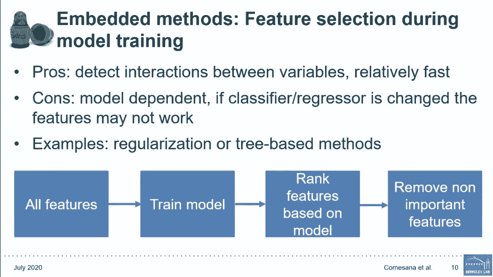

### 3. 嵌入法 (Embedded Methods) 🔧

嵌入法的动机是：**能否将特征选择过程作为模型训练过程本身的一部分？** 这些方法不将学习与特征选择分开，而是在训练模型的同时进行特征选择和特征排名。

**优势**：
1.  类似包装法，会考虑特征间的交互作用。
2.  相对较快（至少比包装法快）。
3.  通常比单纯的过滤法更准确，且不易过拟合。

**注意**：由于它们依赖于特定分类器或回归器进行选择，因此产生的特征子集如果更换模型可能不再有效。基于树的算法（如随机森林）是嵌入法的典型例子，它们会迭代地丢弃重要性最低的数据部分。

**代码示例**：
```python
from sklearn.ensemble import RandomForestRegressor
rf = RandomForestRegressor()
rf.fit(X_train, y_train)
# 获取特征重要性排名
importances = rf.feature_importances_
```

## 混合方法与递归特征消除 (RFE) 🥗

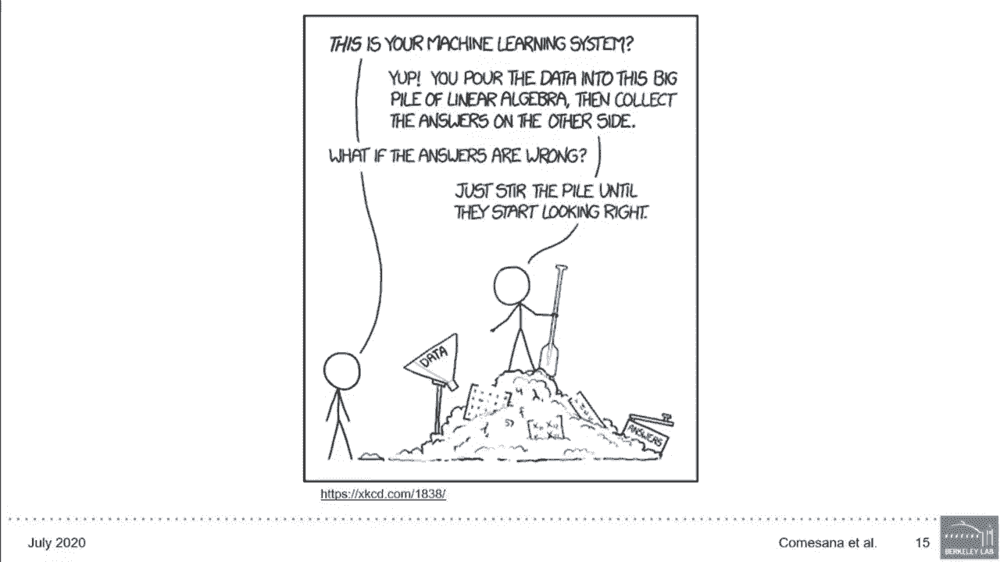

了解了三种基本方法后，我们可以将它们组合成混合方法，以获取最佳的特征子集。组合方式由工程师决定，例如可以先使用过滤法消除恒定和重复特征，然后对剩余特征使用包装法。混合方法的优势在于取长补短，从而可能实现更高的性能、更低的计算成本和更稳健的模型。

**递归特征消除 (RFE)** 是一个典型的混合方法示例。其工作流程如下：
1.  在所有特征上训练模型并评估其性能。
2.  获取特征重要性，删除最不重要的特征，在剩余特征上重新训练模型。
3.  使用评估指标计算新模型的性能，测试指标下降是否超过某个阈值。如果下降未超过阈值，则认为该特征不重要，可以移除。
4.  算法持续删除最不重要的特征，直到所有特征被移除。特征的排名与其被消除的顺序相反。

RFE 看起来有点像后向消除，但主要区别在于：后向消除首先消除所有特征以确定重要性，而 RFE 则从机器学习模型推导出的重要性中获取信息。

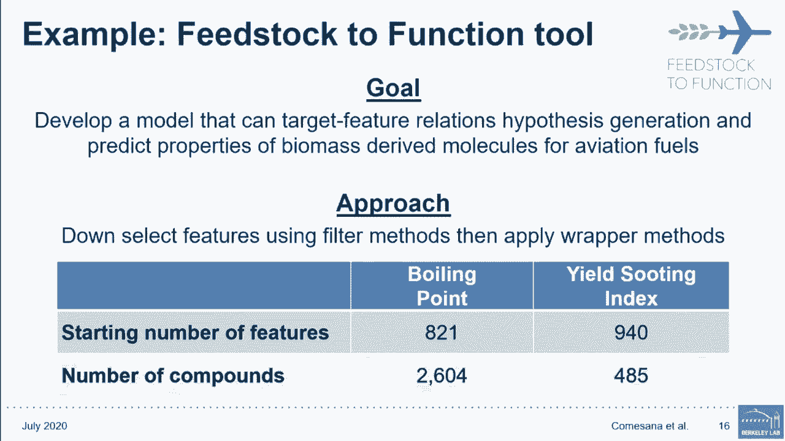

## 如何选择特征选择方法？❓

现在我们已经了解了所有可用的方法，你可能会问：**如何选择？** 最终，没有“最佳”的特征选择方法，你必须尝试不同的模型和不同的特征子集，以找出最适合你数据的方法。

以下因素可以帮助缩小搜索范围：
1.  **模型拟合过程的计算成本**：如果成本高，应避免计算密集的包装法。
2.  **你试图学习的模型的复杂度**：如果关系非常复杂（非线性），简单的过滤或目标相关性分析可能无法捕捉。
3.  **你的回归或分类方法是否允许嵌入式特征选择**：如果不允许，则无法使用嵌入法。

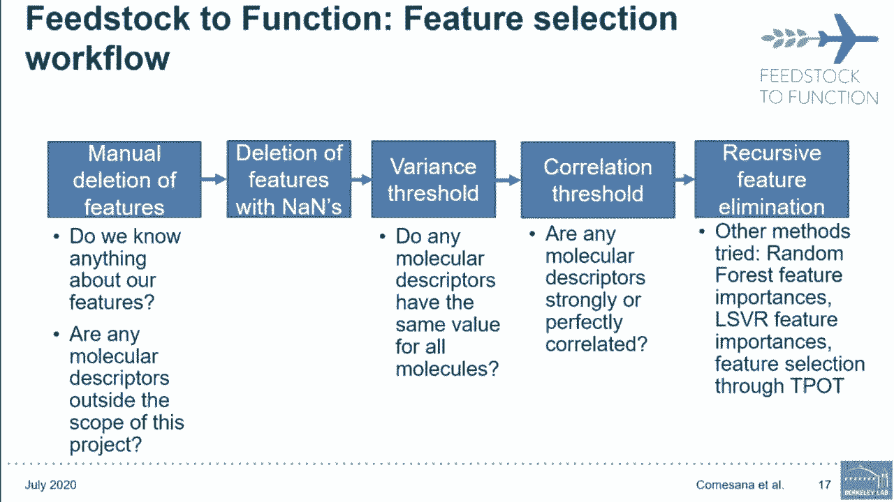

最终，这仍将归结为尝试不同的算法，找到最适合你和你的数据的那一个。

## 实战案例：从原料到功能 (Feedstock to Function) 🔬

为了演示一个完整的工作流程，我们来看一个名为“从原料到功能”的项目。该项目旨在生物衍生航空燃料开发的早期阶段预测其特性。我们试图预测的两个特性是沸点和产烟指数。

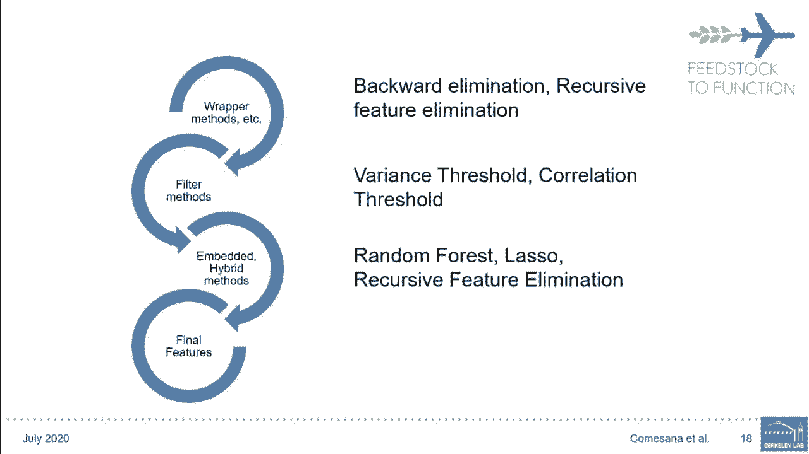

**特征**：我们使用分子描述符，即对分子化学结构进行数学编码的方式（如碳原子数、环数等）。初始通过 Mordred 软件生成了 1800 个描述符，我们手动将其筛选至 821 个（沸点）和 940 个（产烟指数）。

**目标**：由于我们的目标包括生成关于分子结构与这些特性之间潜在关系的假设，因此我们在整个过程中都注重保持可解释性。

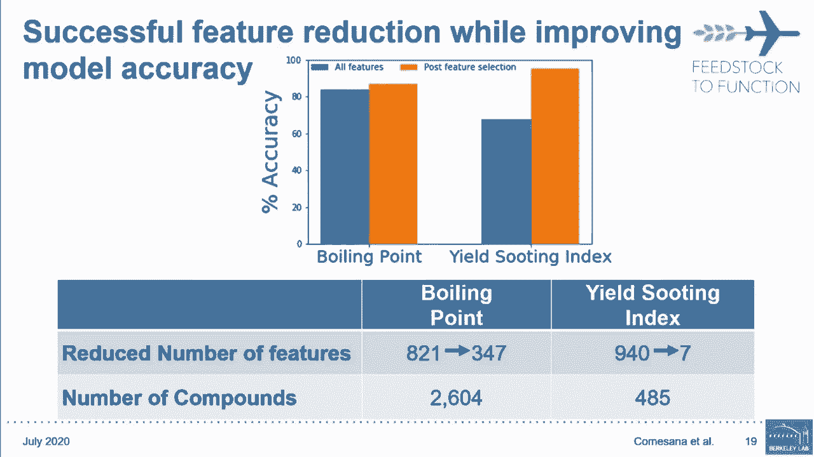

**工作流程**：
1.  **手动检查**：删除与项目范围明显不符的描述符（如用于制药应用的）。
2.  **数据预处理与过滤**：
    *   移除对所有化合物具有相同值的描述符。
    *   移除相关系数高于某个阈值的描述符（消除高度共线性）。
3.  **尝试多种方法进行精细筛选**（针对剩余的 500-700 个描述符）：
    *   尝试了后向消除和 RFE，但计算成本太高。
    *   转而使用更严格的相关性阈值分析（皮尔逊和斯皮尔曼）。
    *   尝试了随机森林特征重要性、LASSO 回归，最后再次尝试 RFE（此时特征已减少，计算可行）。
4.  **确定最佳特征数**：绘制特征数量与模型性能的关系图，观察随着添加排名较低的特征，性能如何变化。这帮助我们决定最终纳入特征集的特征数量。

**结果**：
*   **沸点**：描述符从 821 个减少到约 300 个，准确率有小幅提升。虽然提升不大，但意义重大，因为我们需要分析的关系维度大大降低。
*   **产烟指数**：描述符从 940 个锐减到 **7 个**，同时准确率大幅提升。这已经为我们理解驱动产烟指数估计的因素提供了重要见解。

## 总结 📝

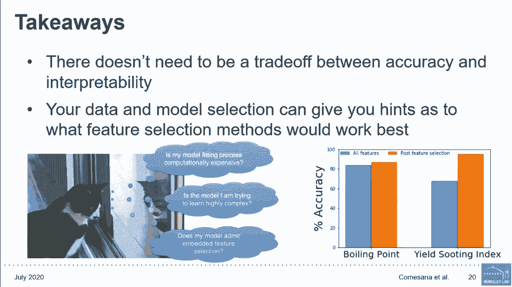

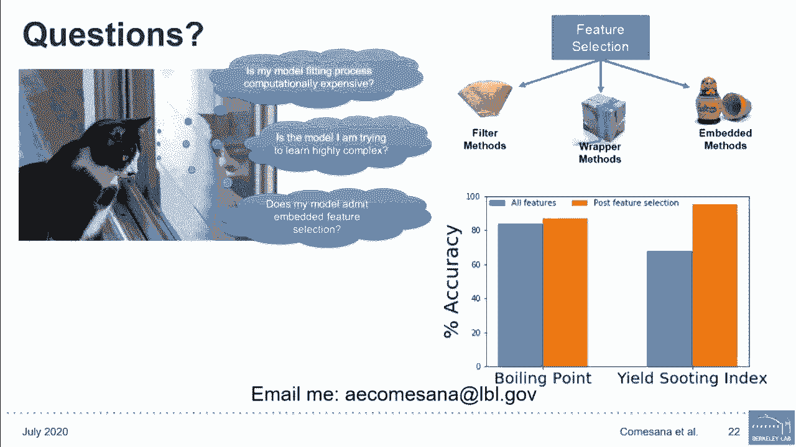

本节课中，我们一起学习了机器学习中的特征选择。
*   我们探讨了三种主要方法：**过滤法**、**包装法**和**嵌入法**，以及结合它们优点的**混合方法**。
*   我们了解到，在**准确性和可解释性之间不一定需要取舍**。通过案例看到，我们可以将超过 900 个特征减少到 7 个，同时提高准确性并更好地解释模型。
*   记住，你的数据可以暗示哪种特征选择方法可能最有效。同时，考虑计算成本、试图建模的关系复杂度以及所使用的模型类型，也能为你优化特征选择搜索提供线索。
*   尽管你的数据或模型可能与我们示例中的不同，但这个案例可以指导你如何处理类似的特征选择问题。优化不仅在于机器本身，也在于作为机器学习工程师的你，从而更好地推动你所从事的领域前进。