# 9：Pandera - Pandas DataFrame 的统计式数据验证 🧪

在本课程中，我们将学习如何使用 Pandera 库对 Pandas DataFrame 进行统计式数据验证。我们将探讨数据验证的理论基础、Pandera 的核心概念，并通过一个真实世界的数据集案例来演示其应用。

---

## 概述

数据验证是数据科学和机器学习工作流中至关重要的一环。它确保数据在处理和分析前满足特定的假设和质量要求。Pandas 是 Python 中处理表格数据的标准工具，而 Pandera 则是一个专门为 Pandas DataFrame 设计的数据验证库。

数据验证的核心是定义一个验证函数 **V**，它接收数据 **X** 作为输入，并输出 **True** 或 **False**。为了使验证有意义，函数 **V** 必须是满射的，即至少存在一个 **X** 值映射到 **True**，另一个映射到 **False**。

**公式**：`V: X -> {True, False}`，且 `∃ x1, x2 ∈ X` 使得 `V(x1) = True` 和 `V(x2) = False`。

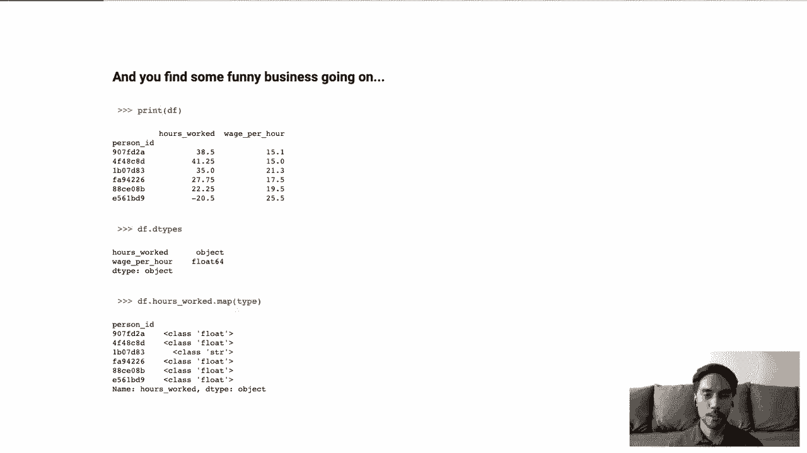

---

## 为什么需要数据验证？

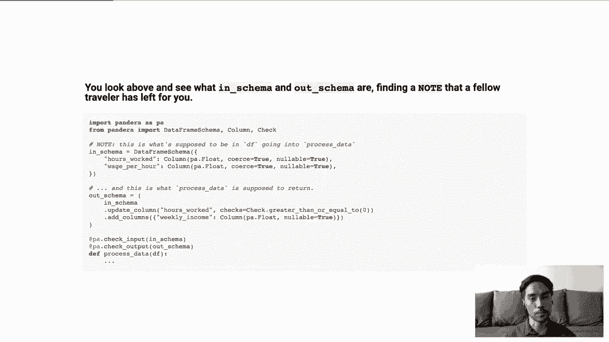

上一节我们介绍了数据验证的基本概念，本节中我们来看看为什么在实际工作中需要它。

数据验证有以下几个实际好处：

*   **提高可调试性**：复杂的数据处理管道难以推理和调试。明确的验证规则可以帮助快速定位问题。
*   **保障数据质量**：高质量的数据对于支持业务决策、科学发现和生产环境中的预测至关重要。
*   **提升代码可维护性**：清晰的验证规则可以作为代码的文档，帮助未来的你或其他开发者理解数据管道的预期行为。

---

## 数据验证的类型

了解了数据验证的必要性后，我们可以从不同角度对验证规则进行分类。

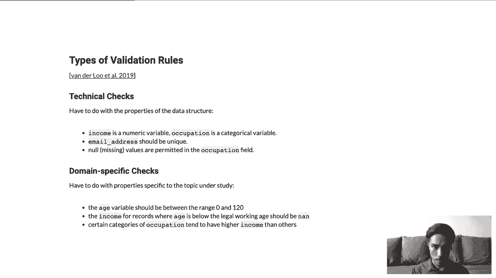

一种分类方式是将其分为**技术性检查**和**领域特定检查**。

*   **技术性检查**：关注数据结构本身的属性。例如，检查“收入”列是否为数值型。
*   **领域特定检查**：关注所研究主题的特定属性。例如，检查“年龄”变量是否在 0 到 120 岁之间。

另一种分类方式是从统计学的角度，分为**确定性检查**和**概率性检查**。

*   **确定性检查**：表达硬编码的逻辑规则。例如，`mean(age) > 30`。
*   **概率性检查**：明确地结合了随机性和分布变异性。例如，`mean(age)` 的 95% 置信区间在 30 到 40 岁之间。

这引出了**统计类型安全**的概念，它类似于逻辑类型安全，但应用于数据的分布属性，以确保对这些数据进行的统计操作是有效的。例如，检查训练样本是否独立同分布，或检查训练集和测试集是否来自同一分布。

---

## Pandera 简介

现在，我们来看看 Pandera 如何将上述理论付诸实践。Pandera 是一个“契约式设计”的数据验证库，它提供了一个直观的 API 来表达 DataFrame 的模式（Schema）。

其核心设计是模式函数 **S**，它接收一个验证函数和数据作为输入，如果验证通过则返回数据本身，否则抛出一个异常。

**代码示例**：
```python
import pandera as pa

# 定义一个简单的模式
schema = pa.DataFrameSchema({
    “column_a”: pa.Column(int, checks=pa.Check.gt(0)),
})

# 验证数据
valid_data = pd.DataFrame({“column_a”: [1, 2, 3]})
schema.validate(valid_data) # 返回 valid_data

# 无效数据会抛出异常
invalid_data = pd.DataFrame({“column_a”: [-1, 0, 1]})
# schema.validate(invalid_data) # 会抛出 SchemaError
```

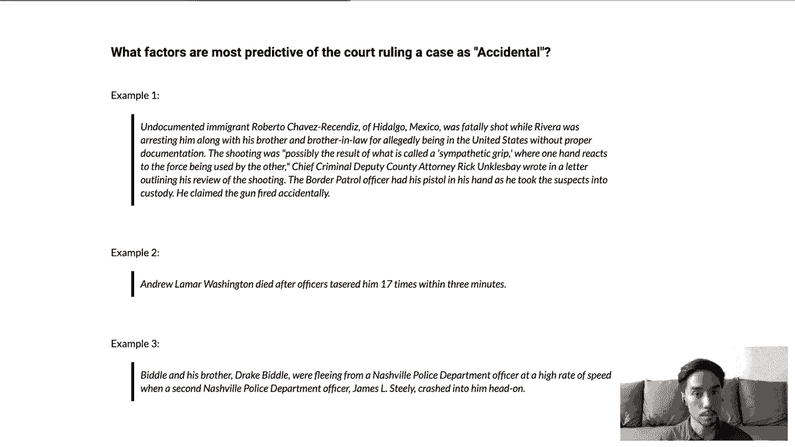

这种设计支持组合性。对于一个数据处理函数 **F**，我们可以用多种方式将模式验证组合进去：在 **F** 处理前验证原始数据，验证 **F** 的输出，或者在处理前后都进行验证（“数据验证三明治”模式）。

---

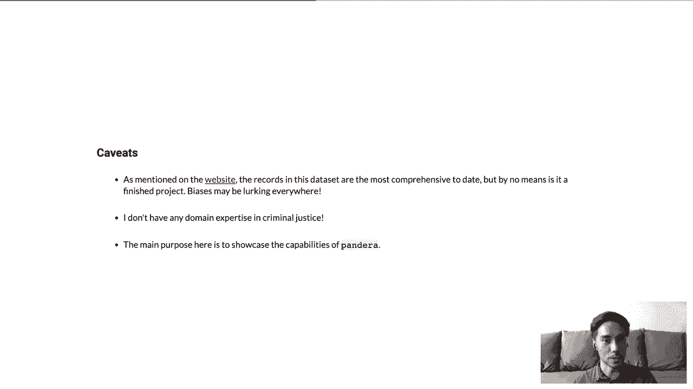


## 案例研究：分析“致命遭遇”数据集


理论部分介绍完毕，让我们通过一个真实案例来具体学习 Pandera 的应用。我们将使用“致命遭遇”（Fatal Encounters）数据集，这是一个记录美国执法过程中导致死亡的遭遇的数据库。

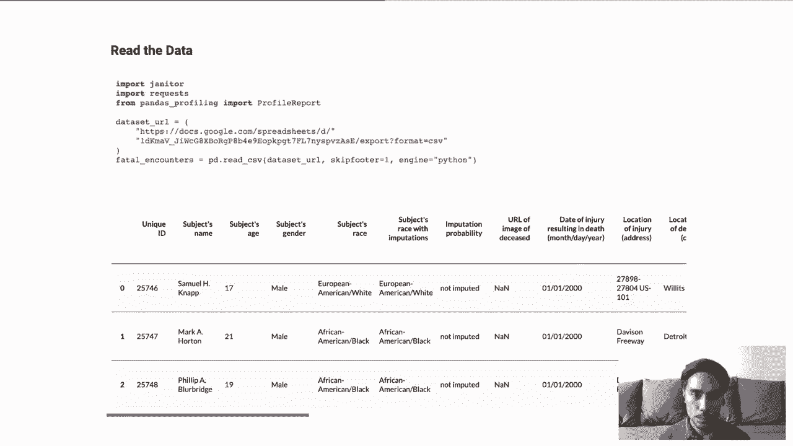

本分析的核心问题是：**哪些因素最能预测法院将案件裁定为“意外”？**

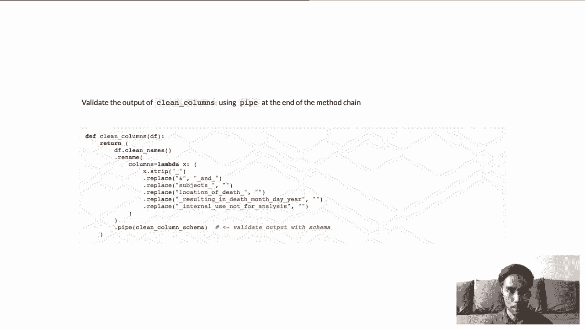

以下是分析的主要步骤：

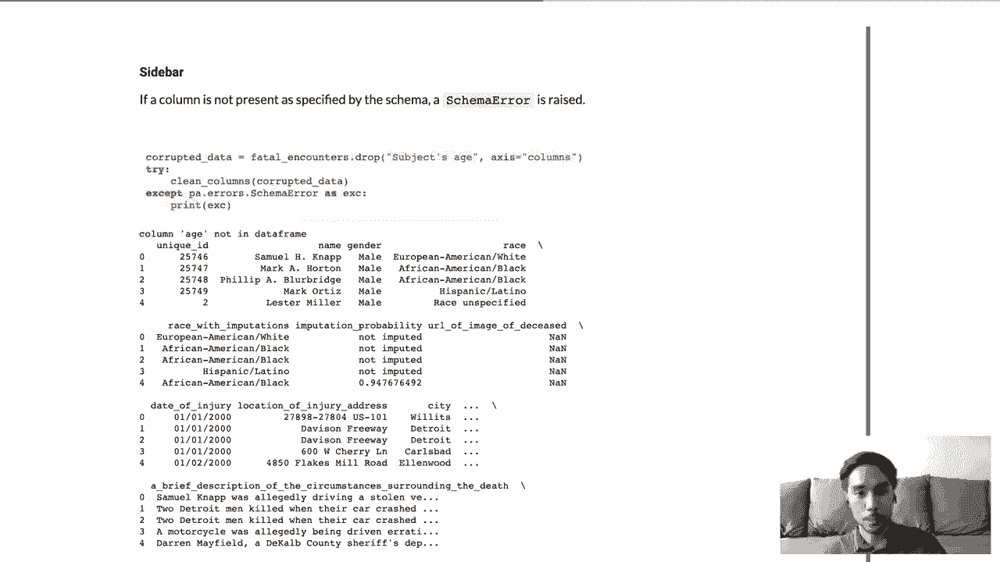

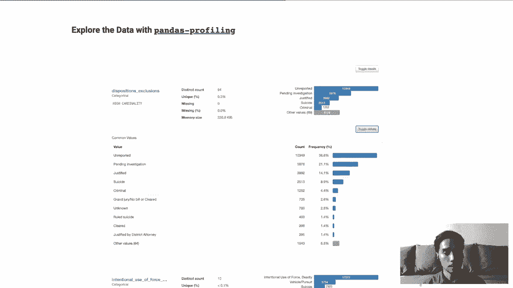

### 1. 数据读取与初步探索

首先，我们读取数据并查看其结构。

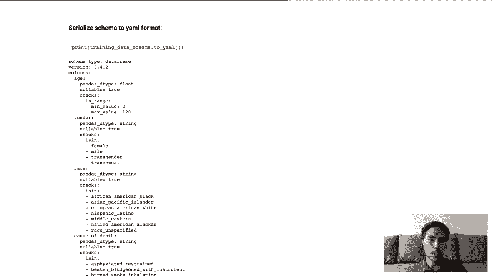

**代码示例**：
```python
import pandas as pd
url = “https://raw.githubusercontent.com/.../fatal_encounters.csv”
df_raw = pd.read_csv(url)
print(df_raw.head())
```

### 2. 定义基础模式并清理列名

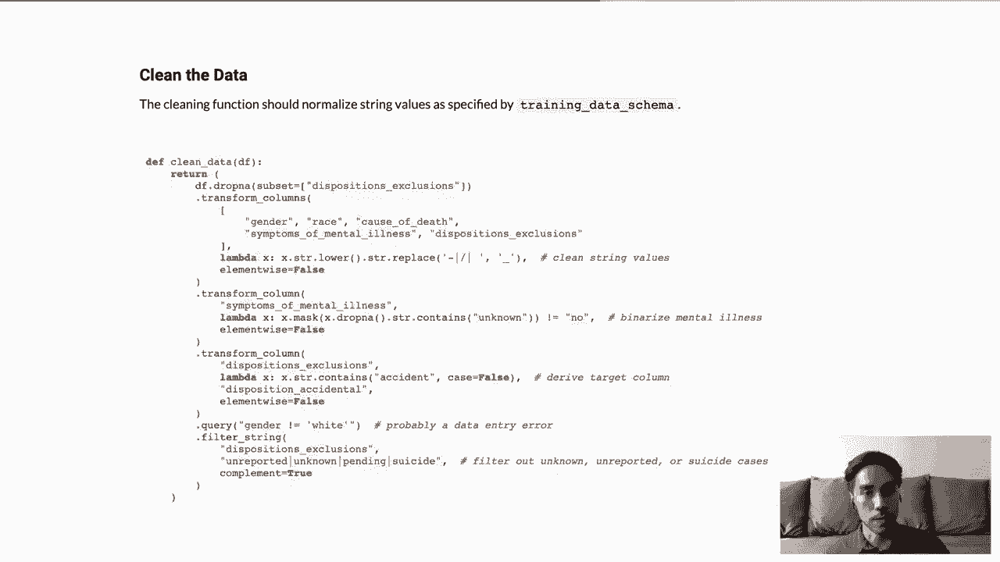

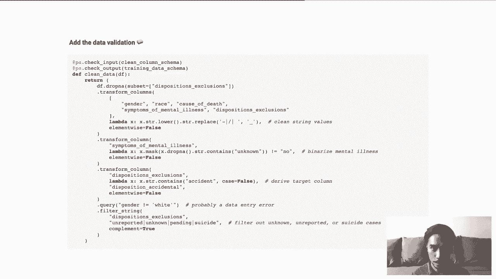

在进一步分析前，我们先清理列名，并定义一个最小化的模式来确保我们关心的列存在。

**代码示例**：
```python
import pandera as pa

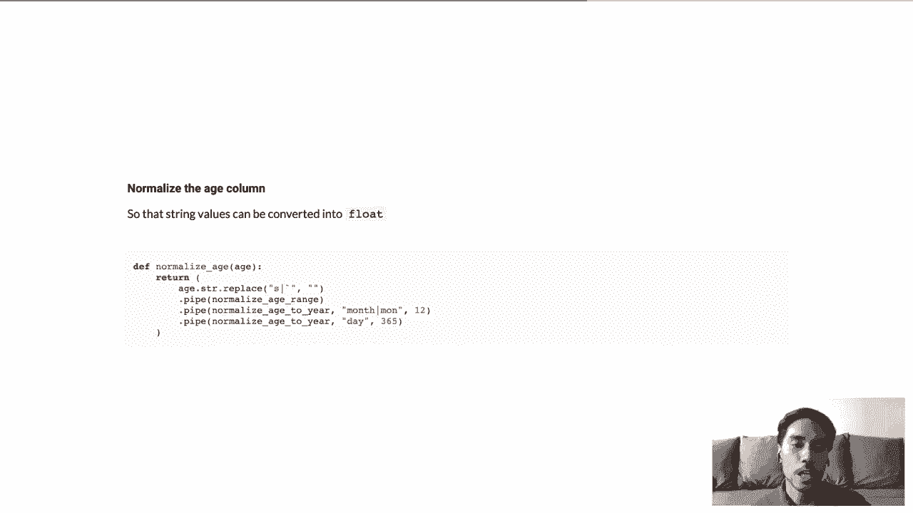

# 定义我们感兴趣的列
minimal_schema = pa.DataFrameSchema({
    “Dispositions/Exclusions”: pa.Column(str, nullable=False),
    “Age”: pa.Column(str),
    “Gender”: pa.Column(str),
    “Race”: pa.Column(str),
    “Cause of death”: pa.Column(str),
})

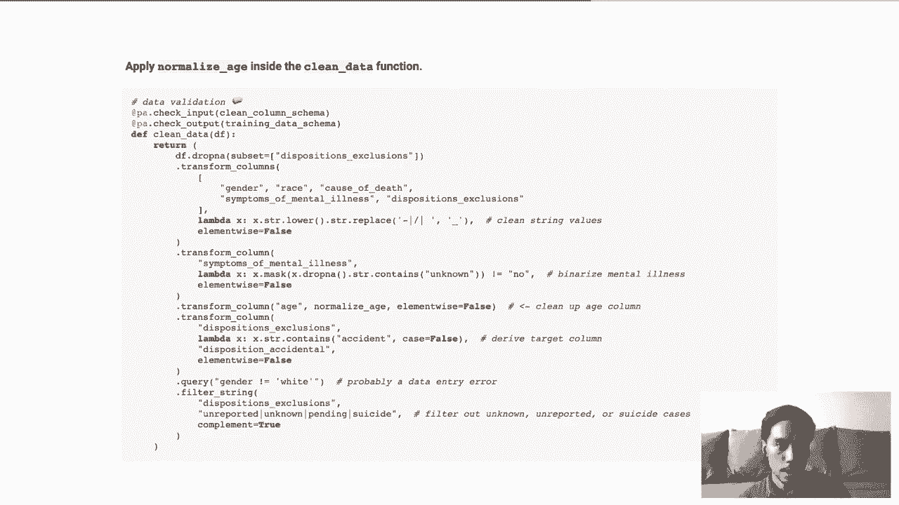

def clean_columns(df: pd.DataFrame) -> pd.DataFrame:
    df_clean = (df
                .rename(columns=lambda x: x.strip().replace(“ “, “_”).replace(“/”, “_”))
                .pipe(minimal_schema.validate) # 在方法链末尾验证
               )
    return df_clean
```

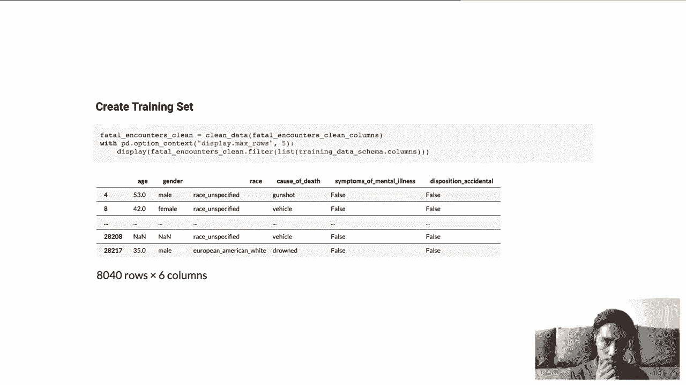

### 3. 探索数据并定义详细模式

使用 `pandas-profiling` 等工具进行探索性数据分析后，我们可以定义一个更丰富的训练数据模式。

**代码示例**：
```python
training_schema = pa.DataFrameSchema({
    “age”: pa.Column(float, checks=pa.Check.in_range(0, 120), coerce=True),
    “gender”: pa.Column(str, checks=pa.Check.isin([“Male”, “Female”, “Unknown”])),
    “race”: pa.Column(str, checks=pa.Check.isin([“White”, “Black”, “Hispanic”, …])),
    “cause_of_death”: pa.Column(str, checks=pa.Check.isin([“Gunshot”, “Vehicle”, …])),
    “dispositions_exclusions”: pa.Column(str, nullable=False),
})
# 可以将模式保存为 YAML 以便检查
training_schema.to_yaml(“training_schema.yaml”)
```

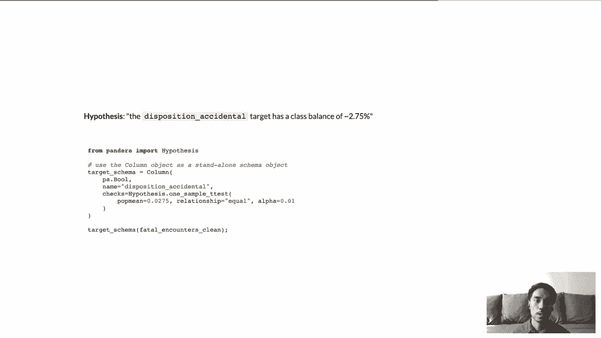

### 4. 数据清洗与“验证三明治”

接下来，我们清洗数据（如规范化字符串、转换类型、派生目标变量）。我们使用 `check_input` 和 `check_output` 装饰器来确保清洗函数的输入和输出符合模式，形成“验证三明治”。

**代码示例**：
```python
from pandera import check_input, check_output

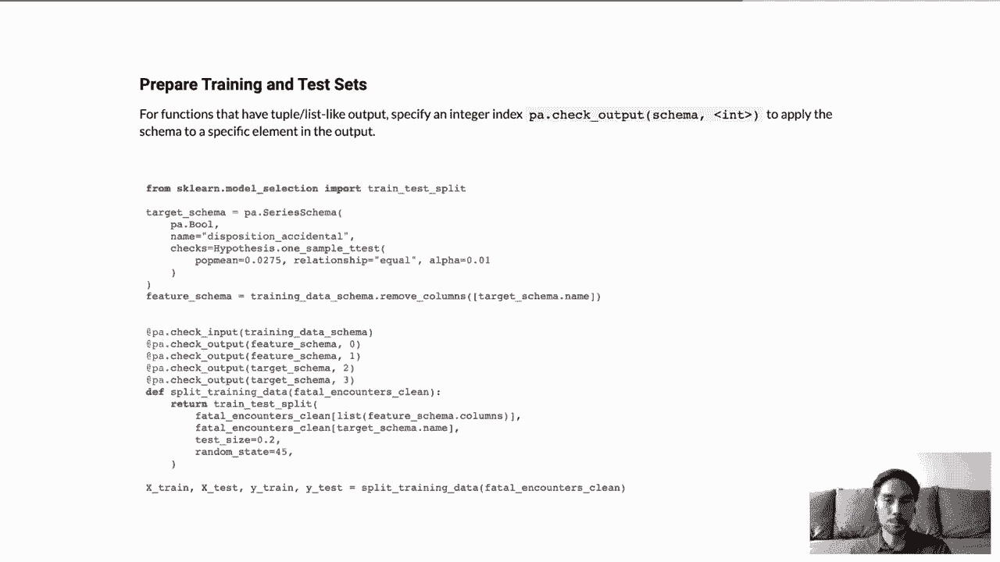

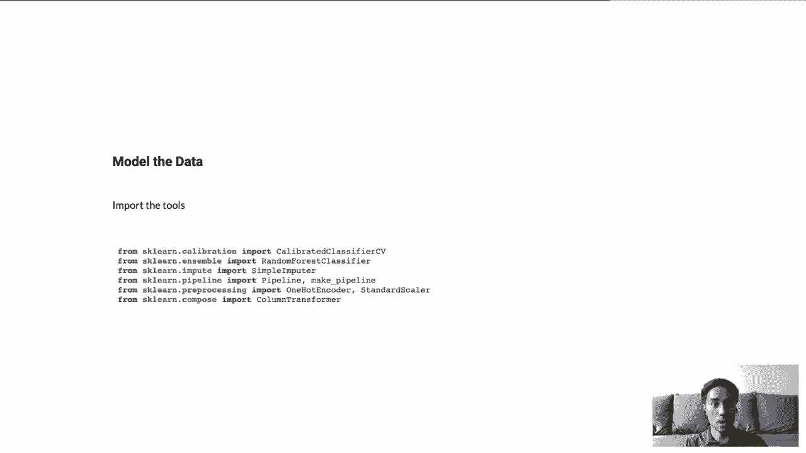

@check_input(training_schema)
@check_output(training_schema.remove_columns([“dispositions_exclusions”]))
def clean_data(df: pd.DataFrame) -> pd.DataFrame:
    # … 数据清洗逻辑，例如：
    # - 清理字符串
    # - 规范化年龄（将“25 years”转为 25.0）
    # - 从 dispositions_exclusions 列派生目标列 `disposition_accidental`
    # - 过滤掉“未报告”、“未知”、“待定”或“自杀”的记录
    return df_cleaned
```

### 5. 数据拆分与模型构建

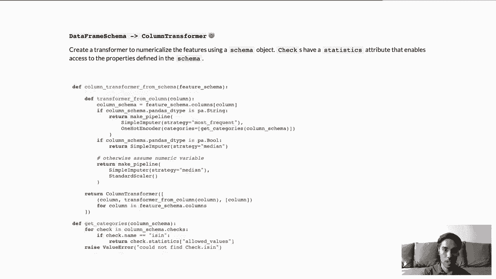

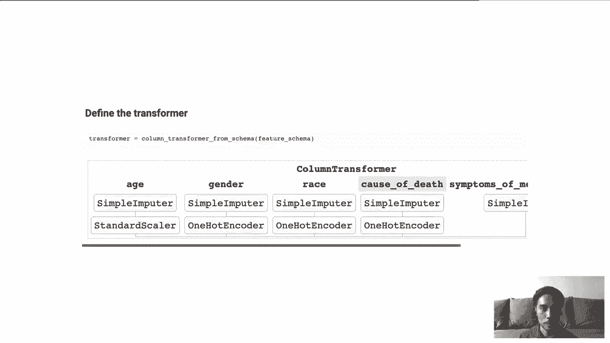

将数据拆分为训练集和测试集，并构建一个机器学习模型（例如随机森林分类器）。Pandera 的 `SeriesSchema` 和模式修改方法（如 `remove_columns`）在这里非常有用。

**代码示例**：
```python
target_schema = pa.SeriesSchema(int, checks=pa.Check.isin([0, 1]))

feature_schema = training_schema.remove_columns([“dispositions_exclusions”, “disposition_accidental”])

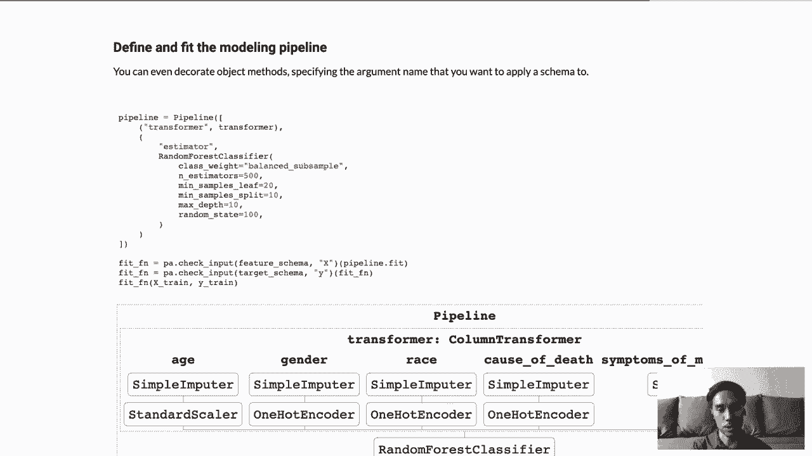

@check_output((feature_schema, target_schema, feature_schema, target_schema), [0, 1, 2, 3])
def split_training_data(df):
    from sklearn.model_selection import train_test_split
    X = df.drop(“disposition_accidental”, axis=1)
    y = df[“disposition_accidental”]
    return train_test_split(X, y, test_size=0.2)
```

我们甚至可以利用定义好的 `feature_schema` 来帮助构建 `sklearn` 的 `ColumnTransformer`。

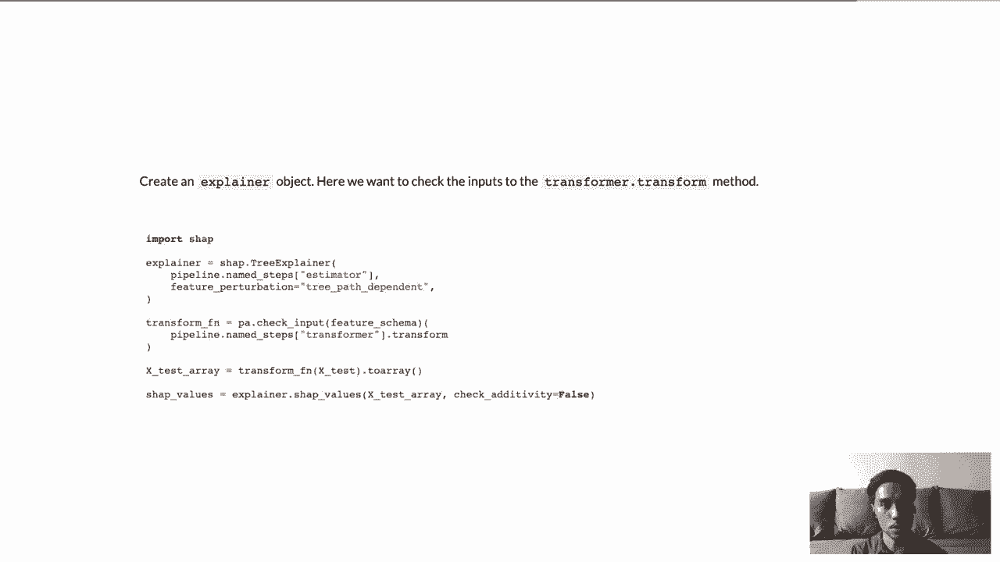

### 6. 模型评估与解释

训练模型后，我们使用 SHAP 值来解释哪些特征对预测“意外”裁定最重要。然后，我们可以基于这些解释创建**模型审计模式**，以验证模型行为是否符合我们的假设（例如，通过 t 检验验证某个二元特征是否显著影响 SHAP 值）。

**代码示例**：
```python
# 创建模型审计模式（示例）
model_audit_schema = pa.DataFrameSchema({
    “feature_gunshot”: pa.Column(float, checks=pa.Check.less_than(0)), # 假设枪击导致更低概率
    “feature_vehicle”: pa.Column(float, checks=pa.Check.greater_than(0)), # 假设车辆导致更高概率
})
# 对模型解释结果进行验证
# model_audit_schema.validate(shap_values_df)
```

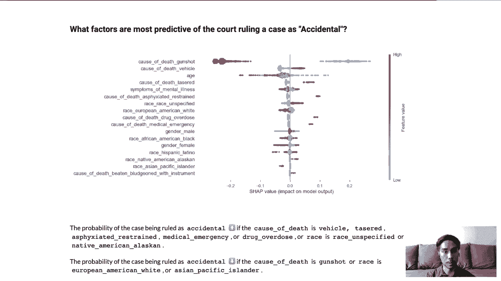

---

## Pandera 的高级功能与未来展望

在案例中我们体验了 Pandera 的核心功能，本节简要介绍一些实验性功能和未来规划。

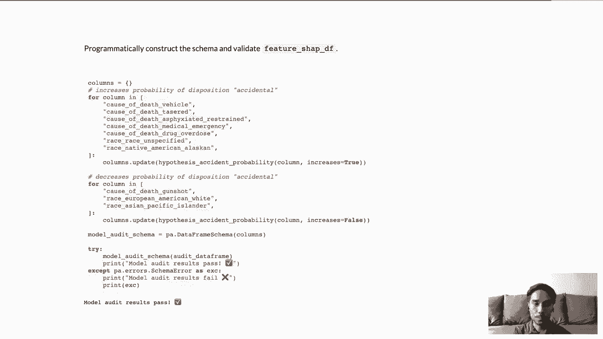

*   **模式推断**：可以从一个现有的 DataFrame 自动推断出一个模式。
    ```python
    inferred_schema = pa.infer_schema(df)
    ```
*   **模式序列化**：可以将模式写入 YAML 文件或 Python 脚本，便于共享和版本控制。
*   **未来方向**：计划开发面向机器学习领域的模式，能够区分目标变量和特征变量，并可能用于生成测试数据。

---

## 总结与要点

本节课中，我们一起学习了使用 Pandera 进行 Pandas DataFrame 统计式数据验证的全过程。

以下是四个关键要点：

1.  **数据验证是达到多种目的的手段**：包括可重复性、可读性、可维护性和统计类型安全。
2.  **数据验证是一个迭代过程**：需要在数据探索、领域知识获取和编写验证代码之间不断循环。
3.  **Pandera 模式是可执行的契约**：它们在运行时强制执行 DataFrame 的统计属性，并能灵活地与数据处理和分析逻辑交织在一起。
4.  **Pandera 不是完全自动化的**：用户仍需负责识别管道中需要测试的关键部分，并定义数据被视为有效的契约条件。


通过将明确的验证规则融入你的数据工作流，你可以更快地调试问题，更自信地构建模型，并创建出更健壮、更易于协作的代码。