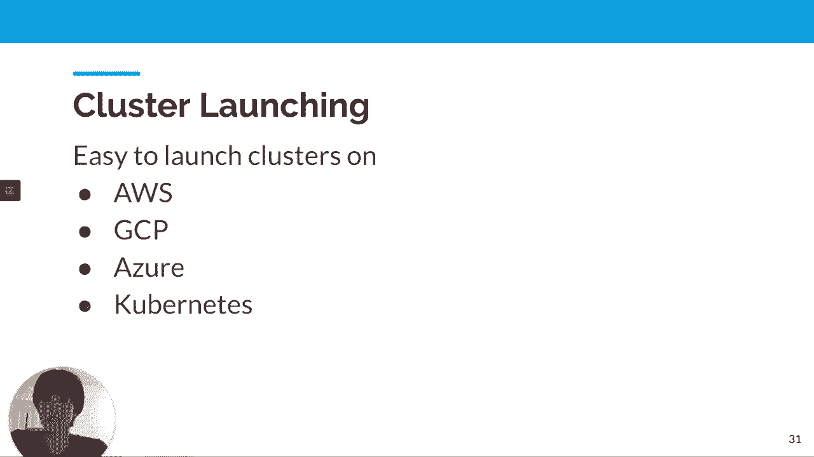
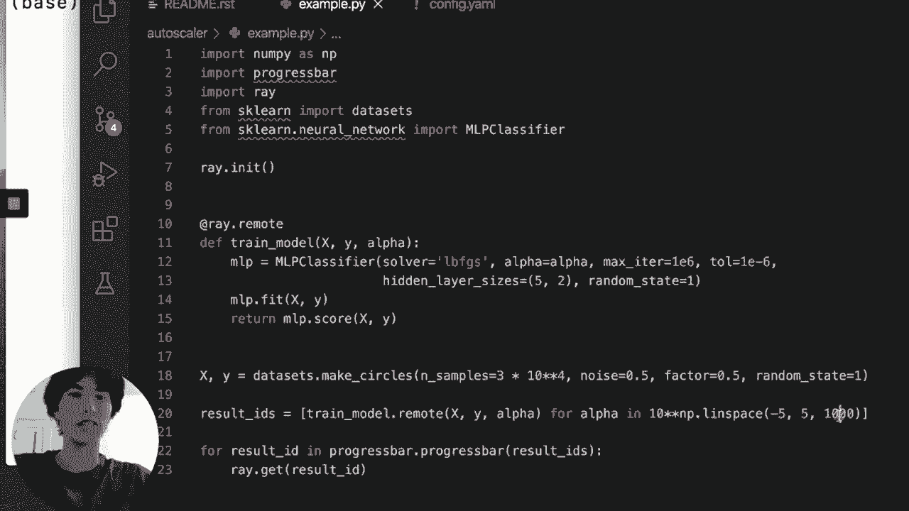
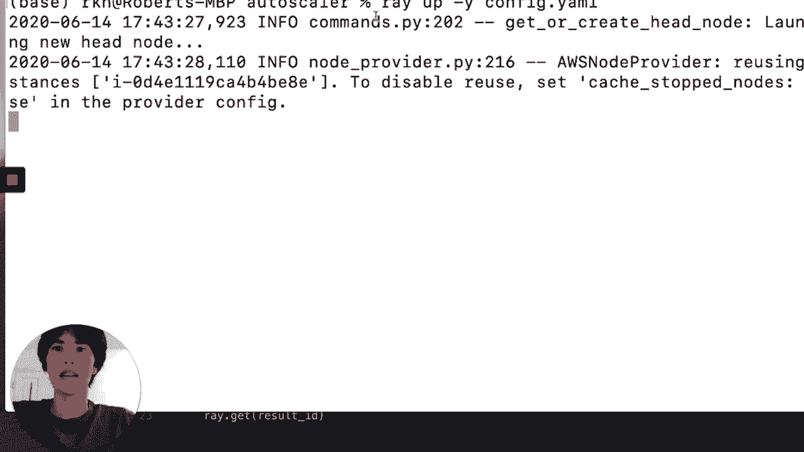
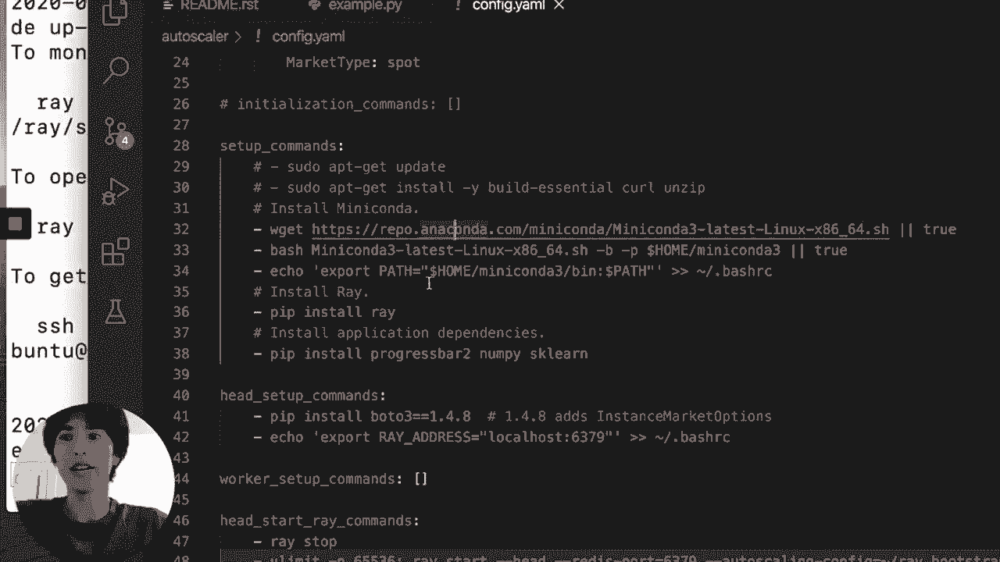
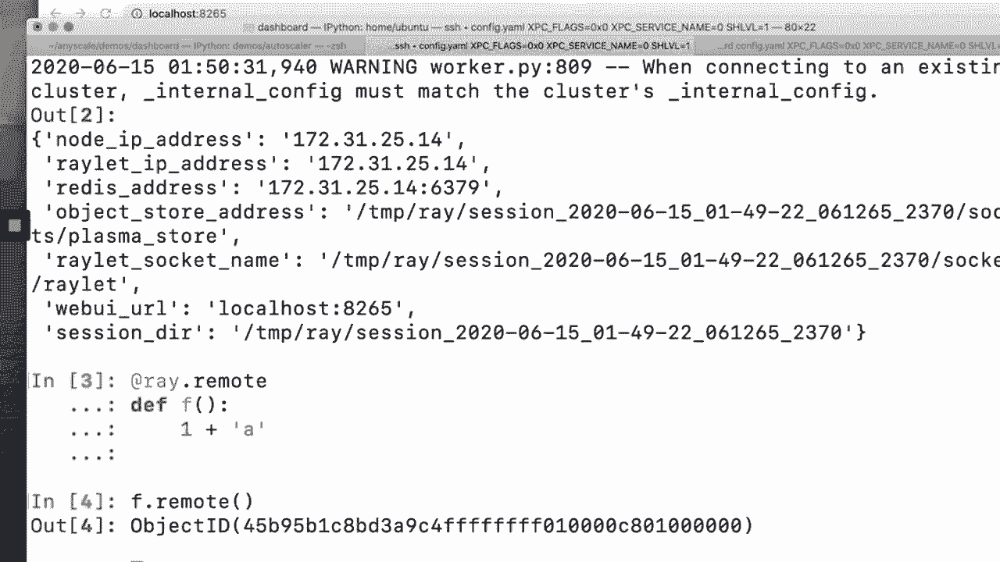
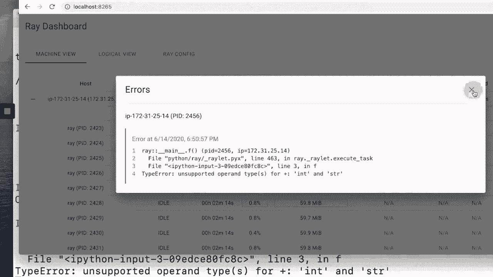
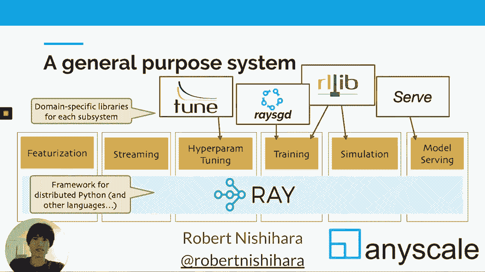

# 10：Ray - 一个可扩展的Python与机器学习系统 🚀

在本节课中，我们将学习 Ray，这是一个用于扩展 Python 应用和机器学习应用的开源分布式系统。我们将了解 Ray 的核心概念、API 以及它如何简化分布式计算。

Ray 是一个由加州大学伯克利分校的 AMP 实验室和 RISE 实验室孵化的项目，它继承了 Spark、Mesos 等知名系统的传统。Ray 主要包含三个部分：一个用于分布式计算的简单库、一个构建在其上的高级库生态系统，以及一套用于在各种平台上启动集群的工具。

## Ray 的定位与生态系统

上一节我们介绍了 Ray 的基本概念，本节中我们来看看 Ray 在整个技术栈中的位置以及它的生态系统。

Ray 在本质上类似于 Dask、PySpark 等工具。它不是一个像 Kubernetes 那样的集群编排工具，而是可以运行在 Kubernetes、AWS 等平台之上。Ray 也不是 NumPy、Pandas 或 TensorFlow 的替代品，而是一个可以用来扩展这些库应用的工具。

Ray 的生态系统如下图所示：



在底层（蓝色部分）是 Ray 的核心 API，它提供了将 Python 函数和类转化为分布式任务的能力。在此之上，构建了用于超参数调优、训练、强化学习等的高级库，如 Tune 和 RLlib。

## 为什么需要新的分布式系统？🤔

分布式系统并非新事物，从高性能计算到大数据，再到深度学习，已有许多专用工具。然而，当前的应用趋势是这些原本独立的工作负载开始重叠。

例如，强化学习结合了深度学习与高性能模拟；在线学习需要应用持续与环境交互并学习。这些复合型应用需要一个能够同时支持多种工作负载的通用分布式系统，这正是 Ray 的设计目标。

## Ray 核心 API 详解

理解了 Ray 的定位后，我们来看看它的核心 API 是如何工作的。Ray API 非常简单，核心思想是通过装饰器将普通的 Python 函数和类转化为分布式组件。

### 分布式函数

以下是两个普通的 Python 函数：

```python
def read_data(filename):
    # 读取文件并返回数组
    return data

def add_two_arrays(arr1, arr2):
    # 将两个数组相加
    return arr1 + arr2
```

通过添加 `@ray.remote` 装饰器，我们可以将它们转化为远程任务：

```python
import ray
ray.init()

@ray.remote
def read_data(filename):
    return data

@ray.remote
def add_two_arrays(arr1, arr2):
    return arr1 + arr2
```

调用时使用 `.remote()` 方法，它会立即返回一个“未来对象”（Future），而不会阻塞程序：

```python
future1 = read_data.remote("file1.txt")
future2 = read_data.remote("file2.txt")
# 两个任务会并行执行

future3 = add_two_arrays.remote(future1, future2)
# 此任务依赖于前两个任务的结果

result = ray.get(future3)
# 使用 ray.get() 获取实际结果
```

### 分布式类（Actor）

除了函数，Ray 还能将类转化为“Actor”，即运行在集群中的有状态服务。

以下是一个简单的计数器类：


```python
class Counter:
    def __init__(self):
        self.value = 0

    def increment(self):
        self.value += 1
        return self.value
```



通过装饰器将其转化为 Actor：



```python
@ray.remote
class Counter:
    def __init__(self):
        self.value = 0

    def increment(self):
        self.value += 1
        return self.value
```

创建实例和调用方法：



```python
counter = Counter.remote()  # 在集群中创建一个 Actor 实例
future1 = counter.increment.remote()  # 调用方法，返回 Future
future2 = counter.increment.remote()
print(ray.get(future1), ray.get(future2))  # 输出 1, 2
```

你还可以为任务或 Actor 指定资源需求，例如 GPU 或更多内存。

## Ray 的最新进展与性能优化

我们已经了解了 Ray 的基本用法，本节将介绍 Ray 在性能和工具方面的最新进展。

Ray 团队在从 0.7 版本升级到 0.8 版本时进行了重新架构，主要目标是提升性能和可靠性。性能提升意味着 Ray 可以像 GRPC 一样快，满足苛刻应用的需求。可靠性方面，通过引入分布式引用计数和垃圾回收，解决了常见的内存溢出问题。



重新架构的核心思想是将控制状态从全局存储转移到工作进程内部。这简化了设计，并实现了“直接调用”，允许进程间直接通信，绕过了调度器，从而大幅提升了性能。

以下是性能对比的一些数据：



*   **任务吞吐量**：在某些微基准测试中，0.8 版相比 0.7 版有数量级的提升。
*   **扩展性**：在一个 256 CPU 核心的集群上，0.8 版可以达到每秒 25 万个任务，而 0.7 版在较大集群上每秒只能处理约 5 千到 1 万个任务。

## 集群启动与部署工具 🛠️

开发完应用后，我们需要将其部署到集群上运行。Ray 提供了一套工具，可以轻松在 AWS、GCP、Azure 或 Kubernetes 上启动集群。

以下是一个简单的示例，展示如何将一个在本地运行缓慢的 Scikit-learn 模型训练任务，快速部署到云集群上执行。

1.  **本地运行（缓慢）**：
    ```bash
    python example.py
    ```
    即使使用本地所有核心（如16核），训练1000个模型仍然非常耗时。

2.  **启动 AWS 集群**：
    ```bash
    ray up config.yaml
    ```
    命令会读取 `config.yaml` 文件中的配置（如实例类型、区域、自动伸缩策略）来创建集群。

3.  **提交任务到集群**：
    ```bash
    ray submit config.yaml example.py
    ```
    该命令会将脚本和文件复制到集群并执行。原本需要极长时间的任务，在一个10节点的集群上可能仅需几秒钟即可完成。

## Ray 仪表板：调试分布式应用的利器 🔍

仅仅能开发分布式应用是不够的，调试往往更加耗时。Ray 仪表板旨在让调试分布式应用像调试本地应用一样简单。

仪表板提供了以下关键功能：

*   **错误聚合**：当集群中某个任务抛出异常时，你无需 SSH 到各个机器查看日志。异常信息会聚合在仪表板的统一视图中，并清晰地显示出来。
*   **日志流**：任务的标准输出和标准错误也会被流式传输到仪表板和控制台。
*   **逻辑视图与性能剖析**：仪表板提供“逻辑视图”，以应用为中心（而非机器为中心）展示集群状态。你可以直接对运行中的 Actor 进行性能剖析，生成火焰图，直观地看到时间消耗在哪些函数上，而无需预先对代码进行任何插桩或修改。

## 未来展望

Ray 的未来发展集中在以下几个方向：

*   **持续的性能优化**：性能是通用性的关键，更好的性能意味着能支持更多样化的工作负载。
*   **多语言支持**：目前主要支持 Python 和 Java，未来会考虑增加更多语言绑定。
*   **智能自动伸缩**：目标是让用户只需关注应用逻辑，系统自动管理集群资源的伸缩。
*   **增强的仪表板与监控**：进一步简化分布式应用的调试和生产环境监控体验。
*   **完善 Windows 支持**：持续改进对 Windows 系统的支持。

## 总结



本节课中我们一起学习了 Ray 分布式系统。我们了解到 Ray 通过简单的装饰器 API，能将 Python 函数和类轻松转化为分布式任务和 Actor。它拥有丰富的上层库生态，支持超参数调优、训练、强化学习等多种机器学习任务。同时，Ray 提供了强大的集群部署工具和可视化仪表板，极大地简化了分布式应用的开发、部署和调试流程。Ray 的目标是成为一个高性能、通用且易于使用的分布式计算基础框架。