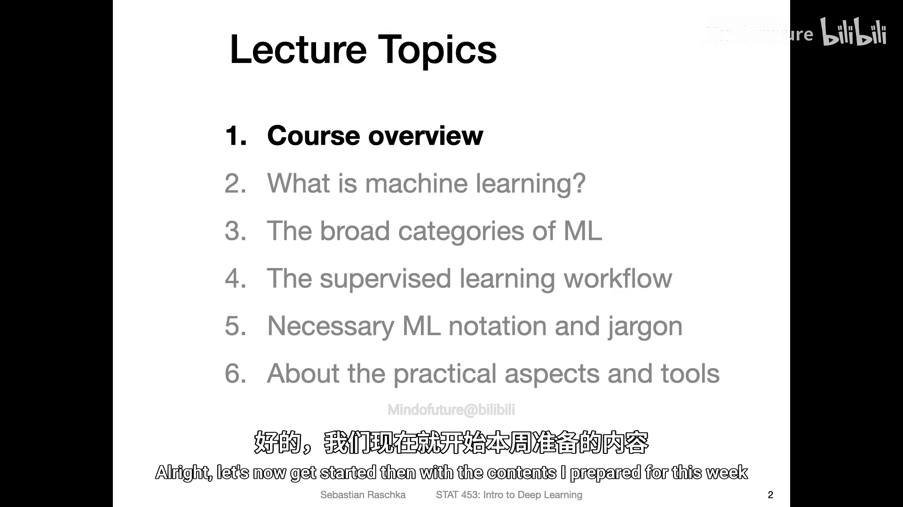
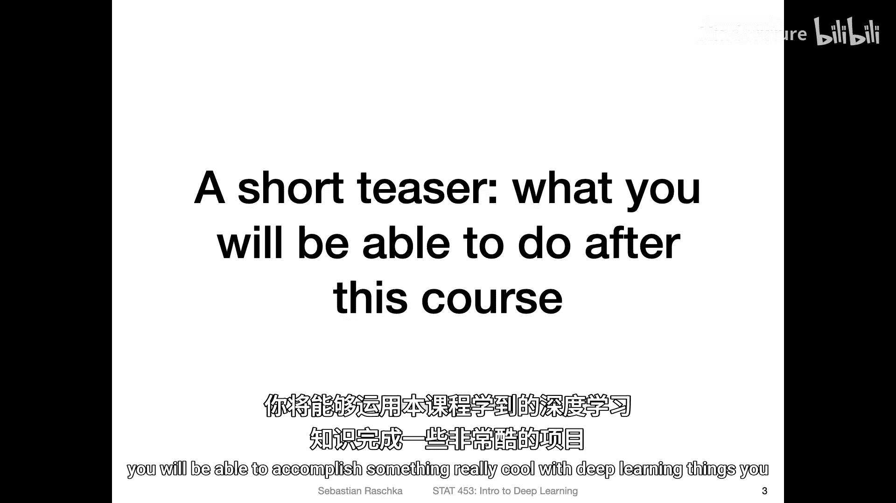
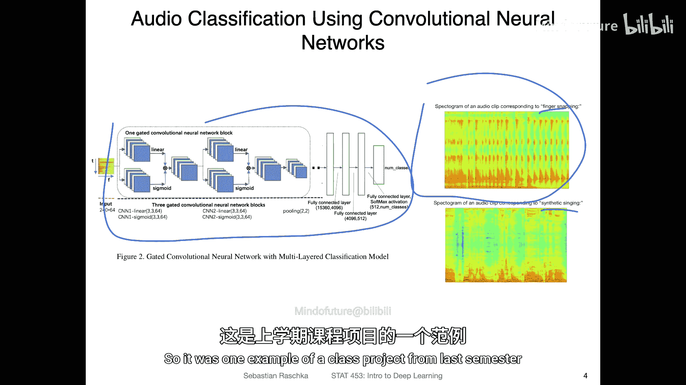
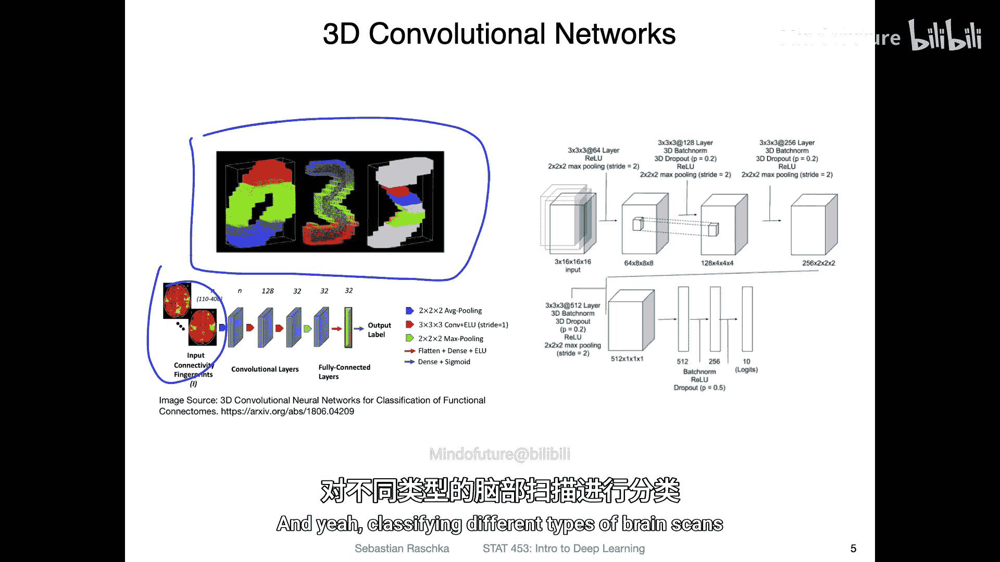
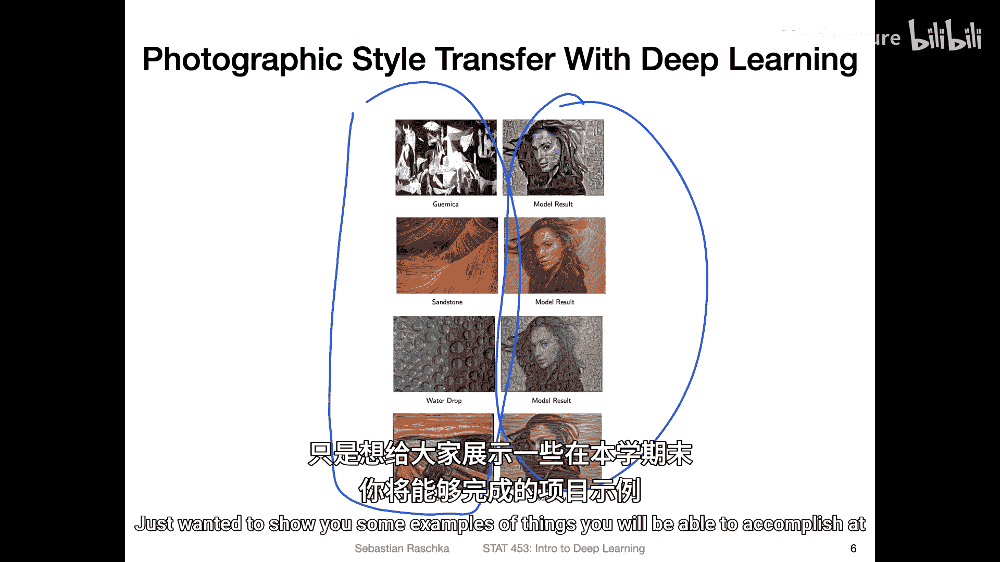
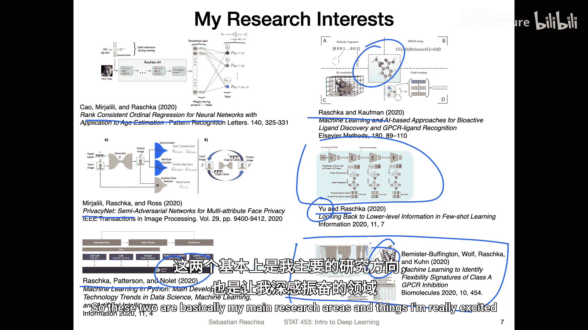
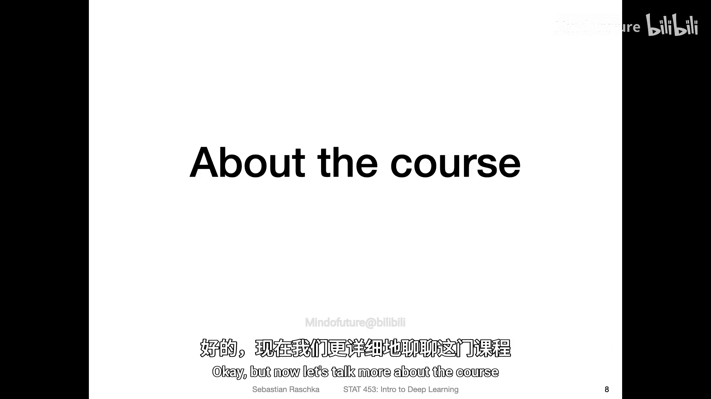
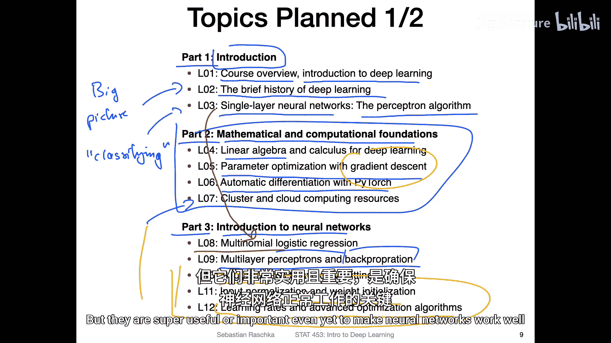
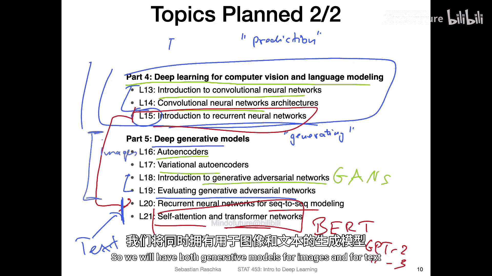

# 002：动机与主题 🎯

在本节课中，我们将学习本课程的整体结构、涵盖的主题，并通过一些学生项目示例了解学习深度学习后能够实现的目标。

---

现在，我们开始介绍本周准备的内容。

首先，通过一个简短的预告，展示完成本课程后你将能够实现的目标。当然，这是一个漫长的旅程，需要15周的时间。但在某个阶段，你将能够运用在本课程中学到的深度学习知识，完成一些非常酷的项目。

以下是上学期学生完成的一些课程项目示例。

例如，在这个项目中，学生将音频信号转换为频谱图，例如语音文本。

然后，他们应用卷积神经网络对不同的文本进行分类，并从音频片段中提取语言信息。在这个案例中，处理的并非语言，而是识别不同的音频输入，例如区分打响指和唱歌的声音。这是上学期一个课程项目的例子。

另一个项目涉及使用3D卷积网络。这是所谓的MNIST数据集的3D版本，在本课程中你会经常看到它，至少在入门讲座中，因为它是一个用于开始学习神经网络的简单数据集。在这个项目中，学生处理了功能性磁共振成像数据，例如脑部扫描，并对不同类型的脑部扫描进行分类。这是另一个有趣的项目。

此外，学生也使用了不同类型的生成对抗网络，这将在课程后期涉及。届时你将能够生成新数据或混合来自不同数据源的数据。例如，在这个项目中：

学生将艺术绘画或照片等艺术输入与模特肖像照片混合，输出结果如右侧所示，即融合了不同风格的人物肖像。这是风格迁移的一个例子。

选择这三个项目有些随意，主要是为了展示上学期学生项目的成果，并挑选了视觉效果较好的案例。当然，你可以自由选择任何你感兴趣的主题作为课程项目，稍后我会详细讨论。在课程开始时，我不想用太多信息让你感到不知所措，只是想展示一些在本学期结束时你将能够完成的项目示例。

如果你对我的研究感兴趣，我主要从事机器学习和深度学习相关的工作。这里整理了我参与过的一些项目概述，以便介绍我自己和我的兴趣所在。例如，去年我研究了秩一致自回归网络，我们称之为CORAL方法，用于有序输入的分类。如果你有有序的类别标签，我们想要对它们排序或预测标签的正确顺序及其相关的数值。我们将此网络应用于年龄分类。

我们还研究了面部隐私，开发了名为Privacy-Net的方法，可以从输入图像中隐藏面部属性，例如年龄、性别和种族，以保护个人隐私。

此外，我与英伟达的人员合作，撰写了一篇关于Python机器学习和深度学习领域最新趋势的综述文章，特别关注GPU内存。这将在我们讨论本课程将使用的工具时进一步探讨。

我与我的学生合写了另一篇关于基于机器学习和人工智能的生物活性配体发现方法的综述文章。我的一个学生正在研究小分子配体的发现与合成，也使用生成模型和生成式深度学习模型进行分子合成与设计。

我的另一个学生正在研究小样本学习。小样本学习是深度学习的一个分支，关注从小数据集中学习。大多数时候，人们使用元学习或迁移学习。我们将在本课程后期讨论迁移学习，但不会涵盖小样本学习。不过，我可能会邀请我的学生在本学期晚些时候做一次小型客座讲座，如果他有时间的话。Zhongji也参与了这篇论文的工作，他同时也是本学期的助教。如果你对小样本学习方法感兴趣，可以在办公时间向他提问，他会很乐意与你深入讨论。

最后，我也在研究一些传统的机器学习方法。这是一项合作研究，我们使用了非深度学习的传统机器学习方法，具体是最近邻方法，用于与计算生物学相关的预测。这涉及GPCR的结构分析，GPCR是一种G蛋白偶联受体，是人类体内结合小分子的重要蛋白质受体。大多数药物靶点实际上都是针对GPCR的。但这更多是基础计算生物学研究，分析这些蛋白质的结构组成。这只是关于我的一点介绍。

你可能会发现，我喜欢研究深度学习，并对计算生物学应用有浓厚兴趣。这两个基本上是我的主要研究领域，也是我非常热衷的方向。

---

上一节我们看了一些项目示例和我的研究方向，现在让我们更多地谈谈课程本身。

对于本课程，我计划了许多主题，主要是深度学习和生成对抗网络，正如课程标题所示。

我将本课程结构分为五个部分。这里是第1、2、3部分，下一页幻灯片将展示剩余的两个部分。

首先，在引言部分，也就是我们现在所处的位置，我将简要概述本课程，并介绍机器学习和深度学习。这是我们本周要做的事情。

然后，我想简要谈谈深度学习的历史。我认为这很有趣，因为它有助于你理解事物和动机的来源。深度学习这个术语相对较新，大约在10年前出现，但它有着悠久的历史。你可以将深度学习视为神经网络的一个花哨术语，而神经网络已经存在了至少60到70年。早期出现的一些想法激发了后来不同思想的发展，我们将涵盖许多与神经网络相关的内容。因此，你可以将这次讲座视为一个宏观概述。

我们将简要介绍历史，然后在后续讲座中逐步介绍不同的主题，并将其与历史联系起来，同时解释为什么我们要学习它们以及它们为何有用。

接着，我们将讨论一种早期的机器学习方法：单层神经网络，即感知器算法。这是一种非常传统的算法，如今已不常用，但我认为它是分类问题的一个简单入门。分类是将事物归入不同类别。我认为这将是一个很好的主题入门。

然后，我们将进入第二部分，关注数学和计算基础。这意味着介绍一些必要的数学知识，如线性代数。在深度学习中，线性代数通常用于更紧凑地表达事物。从技术上讲，我们可以不使用线性代数进行深度学习，但那样会很难书写，并且实现起来很慢，因为我们在实践中使用的计算库依赖线性代数计算例程，这些例程帮助我们比使用Python循环更高效地执行某些计算。因此，线性代数对深度学习非常重要。我们不需要任何高级的线性代数概念，只需要简单的向量点积和矩阵乘法。但我认为仍然值得在单独的讲座中涵盖这些内容，因为为后续讲座打下坚实的基础会使后面的学习更容易一些。

然后，我们将讨论梯度下降。这是一个微积分主题。梯度下降是训练神经网络的主要方法。

在涵盖这个主题之后，我们将讨论使用PyTorch进行自动微分。自动微分可以看作是计算机上的微积分。我们将使用一个名为PyTorch的工具，它是一个用于线性代数、自动微分以及神经网络训练或深度学习的库。它还允许我们在GPU上实现计算以提高效率。因此，我将在第7讲中解释如何使用集群和云计算资源，但这部分会相对简短，因为本课程的主要主题是深度学习。

当然，计算方面是必要的，但对于这门入门课程，你不必一定是专家程序员或计算机高级用户。你应该熟悉计算机上的某些操作和编程方面，但我们这里更侧重于概念概述，而不是机器学习工程。你将能够使用我将在此讲座中介绍的一些免费资源。当然，如果你感兴趣，也可以使用更高级的资源，例如我们校园的HTC集群等，但这门课程不要求。

在数学和计算基础之后，我们将最终讨论神经网络。在第三部分中，我将为深度学习奠定基础。我们将从逻辑回归开始，你可以将其视为单层神经网络。这基本上是对之前讨论的单层网络的扩展，但现在它是可微分的。

以逻辑回归为起点，我们将添加额外的隐藏层，使其成为一个深度网络，也称为多层感知机。然后，我们将学习如何使用反向传播算法训练这样的多层感知机。

第10到12部分更像是训练深度神经网络的技巧，例如避免过拟合的正则化技术、输入归一化和权重初始化。这些技巧使神经网络的训练更加稳健和快速。我们还将讨论学习率以及一些高级优化算法，这些本质上是梯度下降的更高级版本。这些主题对于使神经网络在实践中良好工作非常重要。特别是第10和11部分，这些主题可能听起来不那么令人兴奋，但它们非常有用，甚至至关重要。

---

上一节我们介绍了课程的前三个部分，现在让我们看看课程中更有趣或更高级的部分。

在第四部分中，我们将讨论用于计算机视觉和语言建模的深度学习。我们将花大量时间在卷积网络上，这是一个重要的主题。

我们还将讨论循环神经网络，它们用于语言建模。卷积网络更多用于图像建模，尽管你也可以使用一维卷积网络处理文本。但文本将更多在第15讲中重点介绍。这些内容也将为我们稍后讨论的深度生成模型奠定基础。

在深度生成模型方面，我们将讨论自编码器，即所谓的变分自编码器。然后，我们将讨论生成对抗网络，你可能已经听说过它们被称为GANs。这是生成对抗网络的完整形式，这也是一个非常大的主题，我们将有两讲内容。一讲是介绍，另一讲是关于一些更高级的GANs，例如Wasserstein GAN，以及如何评估和比较不同的GANs。因为在这一部分，我们专注于预测，而在第二部分，我们专注于生成事物，这有点不同，评估这些模型也更具挑战性。因此，我们将有一讲专门讨论这个。

我还计划涵盖循环神经网络在建模方面的一些内容，例如在序列到序列的上下文中生成新文本。在第15讲中，我将首先尝试只关注预测部分，但我们也会重新讨论这个主题，用于生成新的文本数据，并深入一个更高级的主题：为RNN添加所谓的注意力机制，并在Transformer的背景下解释自注意力。Transformer是你可能在媒体上听说过的模型的基础，例如BERT或GPT-2和GPT-3。这些是这些模型的构建模块，我们也会讨论它们。

我不想让这里显得太拥挤，但这一部分基本上将针对图像，而最后这两个部分将针对文本。因此，我们将同时涵盖图像和文本的生成模型。

---

本节课中，我们一起学习了本课程的整体结构和涵盖的主题。我们通过学生项目示例了解了学习深度学习后能够实现的目标，并简要介绍了课程的历史背景和各个部分的内容安排。从基础数学到神经网络，再到计算机视觉、语言建模和生成式模型，本课程将带你逐步深入深度学习的核心领域。