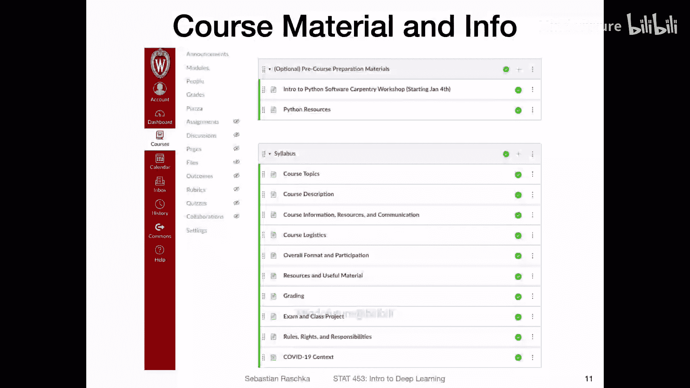
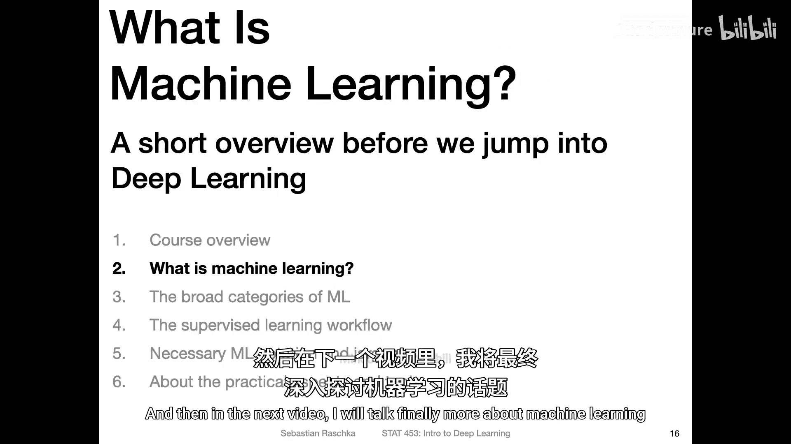

# 003：课程概述（第二部分）- 组织与安排 📚

在本节课中，我们将了解本课程的组织结构、学习平台、评分方式以及沟通渠道。我们将详细介绍每周的学习流程、作业与项目安排，并说明如何有效地参与课程互动。

---

## 课程平台与材料 📁

我们将使用 Canvas 作为本学期的主要学习平台。将所有材料集中在一个平台上，能让我和你的工作都更轻松。所有通知、成绩以及 Piazza 论坛链接都将在此发布。

当然，我们也会使用其他技术，如 GitHub。但我会在 Canvas 上发布相关链接。你无需自行在不同地方搜索资料，所有内容都会集中在 Canvas 的模块中。

下图是你可能已经看到的 Canvas 界面截图，其中包含了一些可选的预备材料。

## 预备知识与要求 🐍

在寒假期间，我为那些有编程背景但未使用过 Python 的同学分享了一些可选的预备材料。本课程要求你曾修读过编程课程，不一定是 Python，但本课程将使用 Python。

你无需成为 Python 专家，我们只会使用 Python 非常基础的功能。然而，提前了解 Python 的基本工作原理将对你大有裨益。我在此分享了一些资源，学习这些基础内容不会花费太多精力，但能让你的课程学习更轻松。

我们不会在最初几周立即使用 Python，预计从第三周开始。因此，你无需今天就急着学习，但如果你没有任何 Python 经验，最好在未来几天内浏览这些资源。

## 课程大纲与信息 📋

几天前，我发布了大量关于课程大纲的信息。在此我不再赘述所有细节，建议你直接阅读我已发布的内容，这样更高效。内容主要包括我之前几分钟讨论过的课程主题、课程信息的主要位置（主要在 Canvas 上）、可能对你有帮助的可选教材，以及本课程的沟通方式。我将在接下来的几张幻灯片中进一步说明。

## 课程后勤与期望 ⏰

接下来是课程的后勤安排和一些期望，包括我如何发布内容以及你应如何参与。

内容方面，我将在每周二和周四上传视频。选择周二和周四是因为在以往的线下学期中，我就是这样安排的，同时这对我来说也更方便。周一开学后，我开始录制周二的视频，周二处理邮件和工作，周三录制周四的课程，以此类推。这对我来说是一个良好的节奏。

我还在此发布了一些其他资源和有用材料，关于评分的信息（我将在稍后讨论）、课程项目和考试，以及重要的规则、权利和责任。此外，还有关于 COVID-19 背景的简要说明，以及在哪里可以找到相关信息及其对校园的影响。我链接了校园指南，如果你还不熟悉，也应该看看。

## 每周内容安排 📅

如前所述，我将在周二和周四上传视频。更准确地说，我会在周一晚上和周三晚上上传，以便它们在周二上午和周四上午可用。这是我本学期尽最大努力的计划。

一个典型的星期可能如下所示。下图展示了一个典型周的样子（录制时尚未上传，但你观看此视频时可能已经上传）。

以下是每周的具体安排：

*   **办公时间**：我们将通过 Zoom 进行办公时间。我和助教都有安排。我的办公时间是周二晚上 6 点到 7 点，助教是 7 点到 8 点。我们将办公时间安排在晚上，是为了方便不同时区的同学。例如，有些同学在中国，这里的晚上 6 点可能是那里的早上 9 点或 8 点，时间更合理。上学期我们在下午安排办公时间，有些同学不得不凌晨 3 点设闹钟参加，或者我们总是需要寻找额外的时间段。这次安排在晚上可能更方便。晚上 6 点对在美国中西部的同学来说也可能比较合适，这是一个比较好的时间点。
*   **课程内容发布**：我将在周二和周四发布内容。Canvas 上会有专门的页面嵌入所有视频，周四也是如此。我还会发布一些额外材料，如补充阅读资料，或链接到相关资源。如果你想获得视频内容之外的更多信息，我也会尝试在这些页面发布与讲座相关的有趣论文或补充阅读材料。
*   **每周自测测验**：我计划在每周结束时进行一次自测测验。这个测验包含 3 到 5 个简单的选择题，目的是帮助你跟上学习进度。测验会有少量分数，会计入最终成绩。虽然权重不大，但建议你完成，因为它能促使你观看学习材料以完成测验。当然，你也可以不看视频就做测验，但那样你可能只能靠猜测，因为问题与视频内容相关。我会在周末发布测验，但截止日期是一周后。这样，如果你在周末还没看完视频，仍然可以在下周初观看并完成测验。你大约有 7 天时间来完成自测测验。我认为这有助于你保持进度，避免过多拖延学习内容。

## 评分构成 📊

评分方式可能是你关心的问题。本学期我是这样安排的：

*   **作业与测验（30%）**：30% 的分数来自习题集（即家庭作业）和每周的自测测验。关于家庭作业，我还不确定具体有多少次，但大约每两周会有一次新的作业。这些作业比测验长一些，不是选择题，通常涉及一些自由回答或少量编码。本学期大约会有 5 到 7 次作业。每周的自测测验也会计入这部分。
*   **期中考试（20%）**：20% 的分数来自期中考试。我已在大纲中发布了考试日期，稍后会再发通知确认。我现在记不清具体日期了，大概在三月下旬，所以暂时不用担心。
*   **课程项目（50%）**：50% 的分数来自课程项目。我认为这是课程中最有趣的部分，因为你可以发挥创造力。首先，你需要提出一个与机器学习或深度学习相关的项目主题。你将组成三人小组进行团队合作。我们会等待几天或一两周，直到选课名单稳定后再组建团队。然后，你和你的团队将 brainstorming 一个深度学习相关的项目。我会发布一些你可以考虑的数据集、数据资源、网站和项目想法，也会分享以前学期的例子，让你大致了解期望是什么。我现在不想详细展开，因为目前可能有很多事情要处理，但在接下来的几天里，我会分享更多信息。项目提案的截止日期也在三月左右。提案的目标是什么？这实际上是一份两页的报告。同样，我稍后会分享更多信息。在这份报告中，你需要告诉我你感兴趣的研究方向，然后我可以给你反馈，告诉你这个想法是否可行，或者给你一些关于项目的更多建议和资源。这部分评分只占总成绩的 5%，所以更重要的是确保你在本学期剩余时间有一个可以努力的好想法。
*   **项目展示与报告**：在学期末，将有一个项目展示（口头报告）和项目报告。由于本学期是虚拟授课，展示将以视频形式录制。你需要录制一个 8 到 10 分钟的演示视频，并与班上其他同学分享。我们都会观看这些展示。此外，学期末还需要提交一份项目报告。这是一份 8 页的书面报告，格式类似于会议论文，我会提供一个模板。在这里，你需要以论文的形式更正式地撰写你的项目。我认为这将为你提供进行深度学习项目、通过演示进行沟通以及撰写论文的真实体验。如果你对学术道路感兴趣，这将是练习发表论文的绝佳机会；即使在工业界，如今也有很多深度学习从业者发表论文。无论如何，我认为这对你来说都是非常有用的练习，对你的简历也很有好处。你可以选择将项目分享到 GitHub 等平台，例如在申请实习时，展示你完成过一个有创意的个人项目总是个好主意。
*   **同行评审**：还有一个我想提及的小方面是，本学期将引入一个同行评审阶段，这是我以前学期没有做过的，我认为这可能也是个好主意。每个学生将评审另外三位学生的报告和项目演示，并给出反馈。这样，为其他同学的展示和报告提供反馈也是一件很酷的事情。当然，我也会提供反馈，但这更像是你们之间的互评，我认为这也不错。

## 课程沟通渠道 💬

接下来，我们看看在本课程中如何提问和进行讨论。

首先，我们将有 Zoom 办公时间，这是一种面对面的实时交流。

此外，我们将使用 Canvas 进行异步沟通。Piazza 是一个集成在 Canvas 中的在线论坛，只有本课程的学生可以访问。你可以在上面发帖提问，可以选择向其他同学显示你的名字，也可以匿名发布。如果你选择匿名，只有我能看到发帖人。当然，我们鼓励你显示姓名发帖，例如，如果你想寻找团队成员等。Piazza 适用于关于本课程、讲座内容以及一切相关问题的讨论。

它的好处在于，所有内容都集中在一个地方。在 Piazza 上，我可以清楚地看到哪些问题已回答，哪些未回答。与电子邮件相比，我更喜欢这种方式，因为每天有很多非本课程的人给我发邮件，比如同事、论文审稿等，处理邮件有时更困难。如果你有问题，对我来说，直接去 Piazza 查看所有与本课程相关的问题并更快地回答它们更容易。与可能被淹没的收件箱相比，在 Piazza 上遗漏问题的风险也更小。Piazza 更有条理。你也可以在 Piazza 上向我发送私人问题，有一个选项可以设置只有我能看到问题。如果你有一些私人问题，比如因医生预约或其他原因无法完成作业，你也可以通过 Piazza 的私人选项向我提问。这也是一个询问私人问题的好地方，无需担心他人看到。

总之，我们将使用 Piazza 和 Zoom 进行本课程的沟通。我希望这能顺利进行。如果需要，我们也可以调整。例如，对于办公时间，我们会提供链接。但如果你因为其他课程时间冲突而永远无法参加这些办公时间，我们也可以寻找额外的可选时间。

最后一件重要的事情是，我强烈建议你在 Canvas 上启用通知。我知道这可能会有点烦人，但这样当有新内容时，你会通过电子邮件收到通知。你无需总是刷新页面，如果有新的截止日期或新内容上传，你会自动收到消息。建议你激活这些通知。操作方法是点击这个小符号，然后进入“通知”，在那里你应该可以看到这些偏好设置，勾选即可。

---

## 总结 ✨

本节课中，我们一起学习了本课程的组织架构。我们明确了将使用 Canvas 作为核心学习平台，并了解了每周视频发布、办公时间安排以及自测测验的流程。我们详细分析了课程的评分构成，包括作业测验（30%）、期中考试（20%）和课程项目（50%）。此外，我们还介绍了课程的主要沟通渠道：Zoom 办公时间和 Canvas 集成的 Piazza 论坛。请务必在 Canvas 上启用通知，以便及时获取课程更新。如果你有任何问题，欢迎在办公时间或 Piazza 上提出。