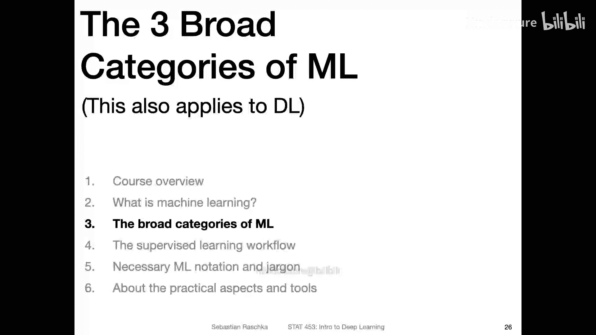
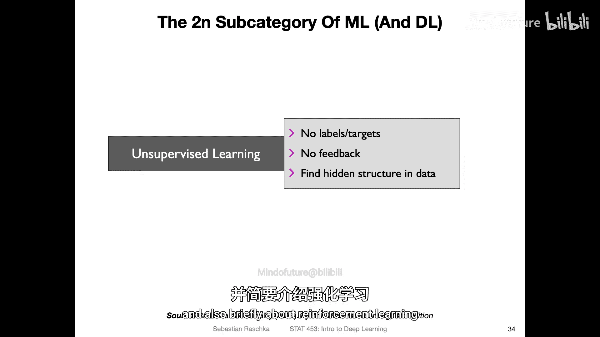

# 005：机器学习的主要类别（第一部分）-监督学习 📚



在本节课程中，我们将学习机器学习的三大主要类别之一：监督学习。我们将了解其核心概念、常见任务类型，并通过简单的例子来理解其工作原理。

---

机器学习主要分为三大类：**监督学习**、**无监督学习**和**强化学习**。监督学习是其中最常见、应用最广泛的形式。

## 什么是监督学习？🤔

监督学习涉及使用带有标签的数据进行训练。标签是指数据点对应的正确答案或目标值。模型通过学习输入特征与输出标签之间的关系，来对新的、未见过的数据进行预测。

一个典型的例子是垃圾邮件分类。我们拥有许多已被标记为“垃圾邮件”或“非垃圾邮件”的电子邮件。模型通过学习这些带标签的示例，来预测新邮件是否为垃圾邮件。在这个过程中，模型可以获得直接的反馈：我们可以判断它的预测是否正确。

上一节我们介绍了监督学习的定义，本节中我们来看看它的主要任务类型。

## 监督学习的任务类型 📊

监督学习主要包含两种核心任务：**回归**和**分类**。此外，还有一种更特殊的任务称为**序数回归**。

### 1. 回归

回归任务的目标是预测一个连续的数值。这类似于统计学中的线性回归。

**核心概念**：模型学习从输入特征（X）到连续目标值（Y）的映射关系。

**公式示例（简单线性回归）**：
`y = w * x + b`
其中，`y`是预测值，`x`是输入特征，`w`是权重，`b`是偏置项。

例如，根据房屋面积（特征）来预测其价格（连续目标值）。在训练时，我们使用许多已知面积和价格的房屋数据。训练完成后，给定一个新房屋的面积，模型就可以预测其价格。

### 2. 分类

分类任务的目标是预测一个离散的类别标签。这是深度学习中更常见的任务。

**核心概念**：模型学习一个“决策边界”，将不同类别的数据点分开。

**代码示例（概念描述）**：
```python
# 伪代码：模型对输入数据点进行分类决策
if 数据点在决策边界左侧:
    预测为“类别A”（例如“非垃圾邮件”）
else:
    预测为“类别B”（例如“垃圾邮件”）
```

例如，识别图像中的动物是猫还是狗，或者识别手写数字是0到9中的哪一个。在二元分类中，只有两个可能的标签（如“垃圾邮件/非垃圾邮件”）。模型的目标就是学会区分这两类数据的边界。

### 3. 序数回归（或序数分类）

这是介于回归和分类之间的一种任务。其预测的目标是有序的类别，类别之间存在等级顺序，但类别之间的“距离”不一定相等。

**核心概念**：预测具有内在顺序的标签。

例如，电影评分（如“糟糕”、“一般”、“好”、“很好”、“优秀”）或年龄组（如“儿童”、“青年”、“中年”、“老年”）。知道“优秀”优于“很好”这个顺序信息很重要，但“优秀”和“很好”之间的差距，与“很好”和“好”之间的差距可能并不相同。这与标准的回归（假设等距数值）和分类（忽略顺序）都有所不同。

---

## 本节总结 📝

本节课中我们一起学习了机器学习的第一大类别——监督学习。
*   监督学习使用**带标签的数据**进行训练，目标是让模型学习从输入特征到输出标签的映射关系。
*   它主要包括两大任务：预测连续值的**回归**和预测离散类别的**分类**。
*   此外，我们还简要了解了**序数回归**，它用于预测具有顺序关系的类别。



在接下来的视频中，我们将继续探讨机器学习的另外两个主要类别：无监督学习和强化学习。