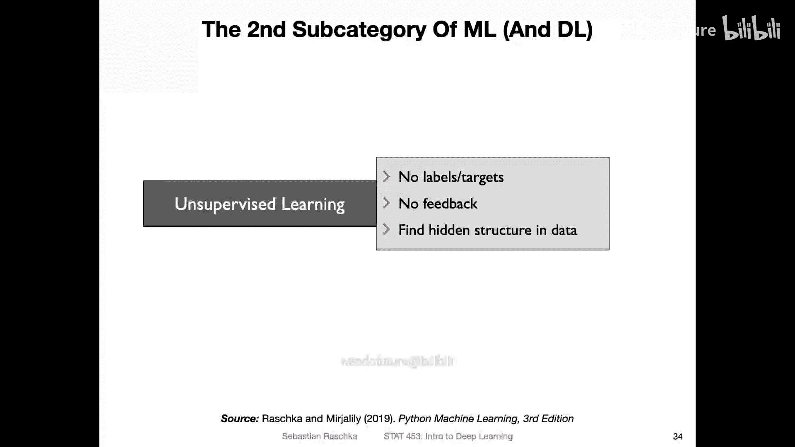
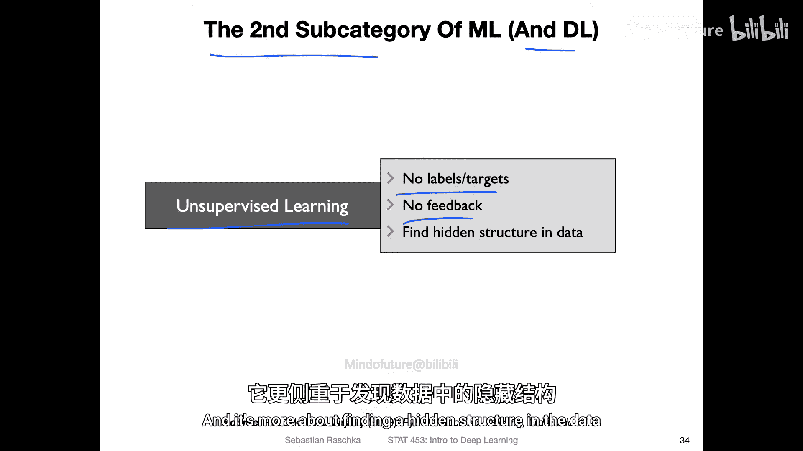
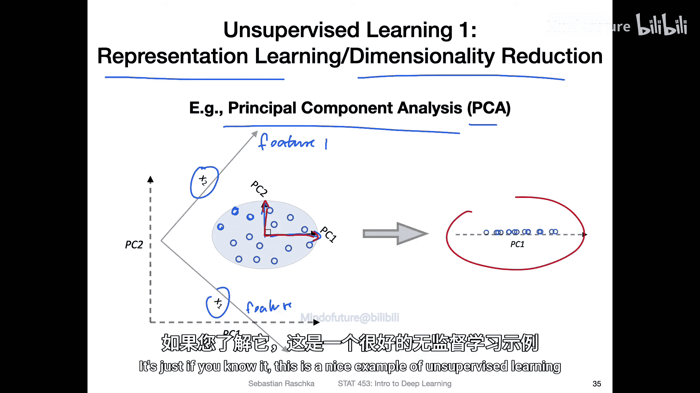
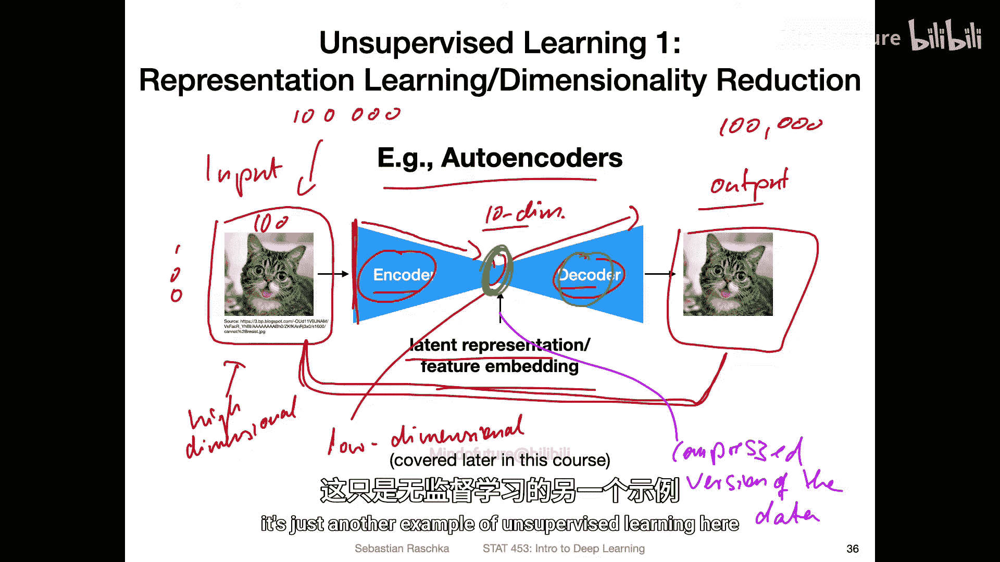
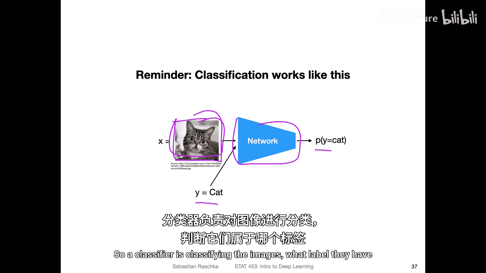
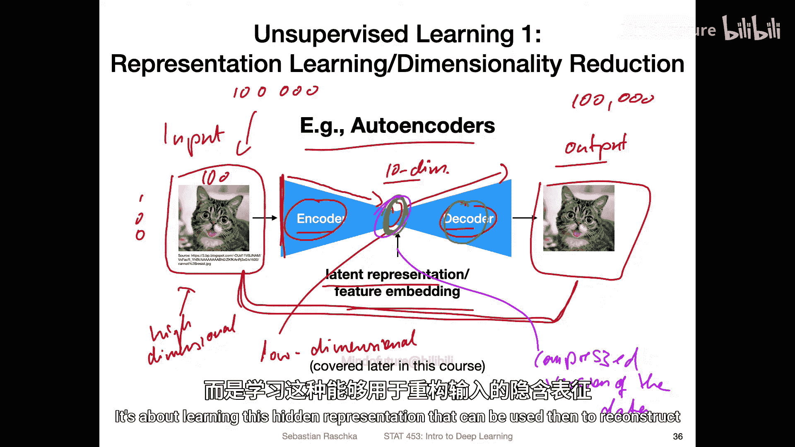
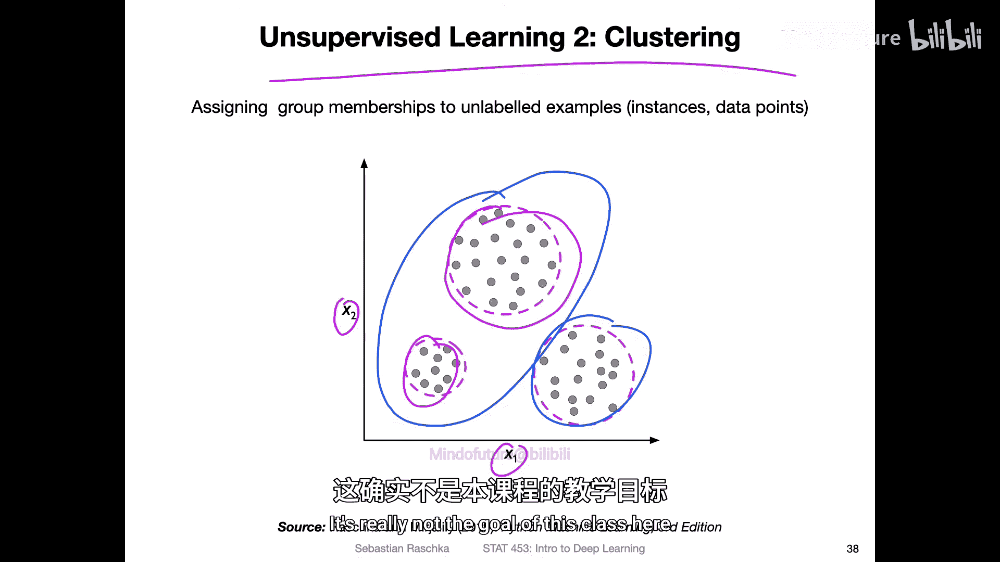
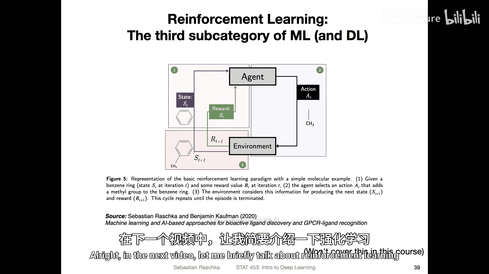

# 006：机器学习的主要类别 - 无监督学习 🧠

在本节课中，我们将要学习机器学习的第二个主要子类别——无监督学习。与上一节介绍的有监督学习不同，无监督学习不依赖于任何标签或目标值，其核心在于从数据中发现隐藏的结构或模式。

## 什么是无监督学习？

无监督学习不使用任何标签或目标值，因此没有明确的反馈信号。它的核心任务是发现数据中隐藏的结构。从这个意义上说，我们也可以将无监督学习视为**表示学习**。

无监督学习的一个常见应用是**降维**，尽管其应用远不止于此。

## 降维与表示学习示例

以下是两种典型的无监督学习方法。

### 主成分分析

你可能在统计学课程中听说过**主成分分析**，简称 **PCA**。它是一种线性变换技术，通过旋转数据并提取输入的线性组合来工作。

考虑一个具有两个特征（特征1和特征2）的数据集，图中的圆圈代表数据点。PCA 会找到数据集的**特征向量**（即主成分），并使用它们来旋转数据。主成分通常按其对应的**特征值**大小降序排列。在实践中，我们可能保留特征值较大的主成分，以获得数据的压缩表示。

**公式**：PCA 的核心是求解协方差矩阵的特征值和特征向量。

### 自编码器

**自编码器**是深度学习中无监督学习的另一个重要例子，我们将在本课程的第5部分深入讨论。

自编码器的结构非常简单：
*   **输入数据**：通常是高维数据（例如，一张100x100像素的图片有10,000个特征）。
*   **编码器**：一个神经网络，将高维输入压缩成一个低维的**潜在表示**或**嵌入**。
*   **解码器**：另一个神经网络，试图从低维潜在表示中重建出原始的高维输入。

**目标**：最小化输入与重建输出之间的差异。

那么，仅仅学习重建输入有什么意义呢？关键在于这个**低维潜在表示**。如果解码器能够从这个小维度的表示中成功重建原始图像，那就证明这个表示足以编码数据中的重要信息。因此，它可以被视为数据的一个**压缩版本**，同样实现了降维的目的。

有趣的是，如果自编码器使用线性激活函数，它与 PCA 有着密切的关系。

## 与有监督学习的对比

为了更清晰地理解无监督学习，让我们回顾一下有监督学习中的分类任务。

在**图像分类**中：
*   **输入**：一张图片（例如猫的图片）。
*   **训练**：使用带有标签（例如“猫”）的数据。
*   **网络输出**：图片属于“猫”类别的概率。
*   **目标**：预测新图像的标签。

而**无监督学习**（如自编码器）则完全不同：
*   **不预测任何标签**。
*   **目标**：学习一个能用于重建输入的隐藏表示。

## 无监督学习的另一示例：聚类

除了降维，无监督学习的另一个典型例子是**聚类**。

聚类旨在为未标记的样本分配组别（集群）成员资格。例如，在一个由特征X1和X2构成的数据集中，虽然没有真实的类别标签，但算法会根据数据点之间的相似性（如距离远近）将它们分组。

与分类的关键区别在于，我们**不知道真实的标签**。聚类结果的质量可以通过一些内部指标来衡量，但没有绝对意义上的“正确答案”。聚类更像是数据挖掘领域的主题，在本课程中不会重点涉及。

## 总结

本节课中，我们一起学习了机器学习的第二个主要类别——**无监督学习**。我们了解到：
1.  无监督学习**不使用标签**，专注于发现数据中的**隐藏结构**。
2.  它常被用于**降维**和**表示学习**，例如主成分分析和自编码器。
3.  自编码器通过编码器-解码器结构学习数据的压缩表示，其核心价值在于得到的**低维潜在特征**。
4.  无监督学习与有监督学习（如分类）的目标有本质不同，前者不进行预测，而是学习数据的内在表达。
5.  聚类是另一个无监督学习例子，它根据相似性对数据进行分组。

下一节，我们将简要介绍机器学习的第三个类别：强化学习。