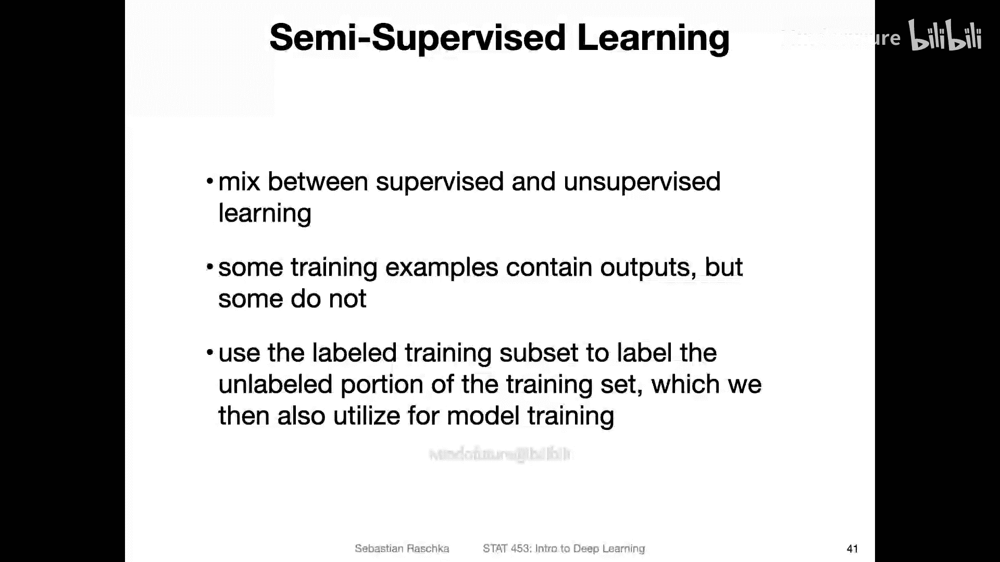
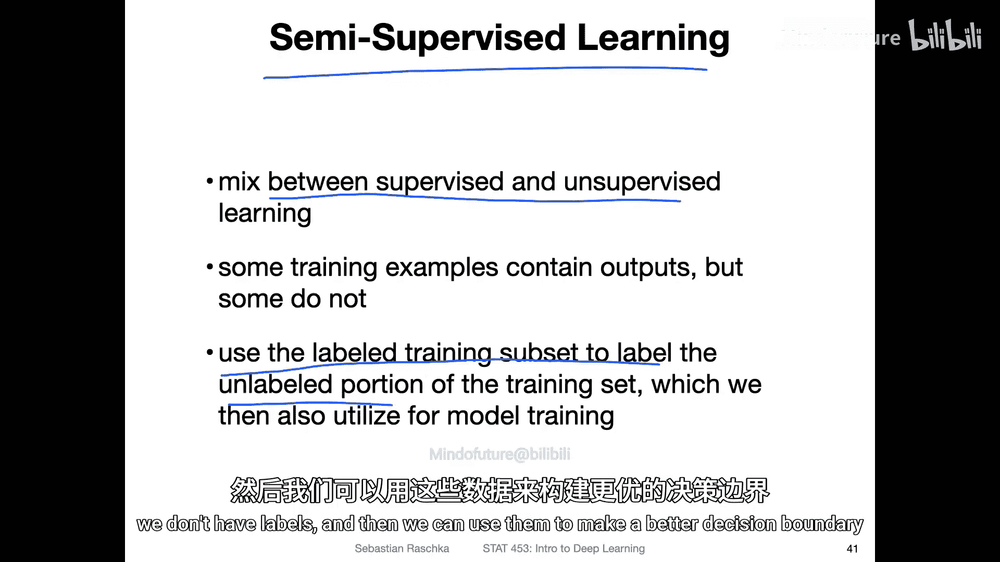
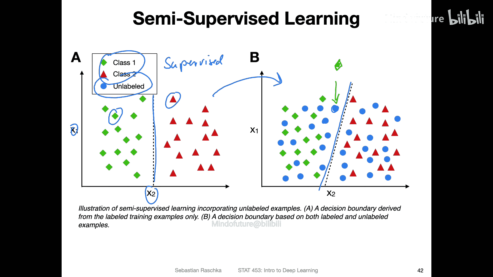
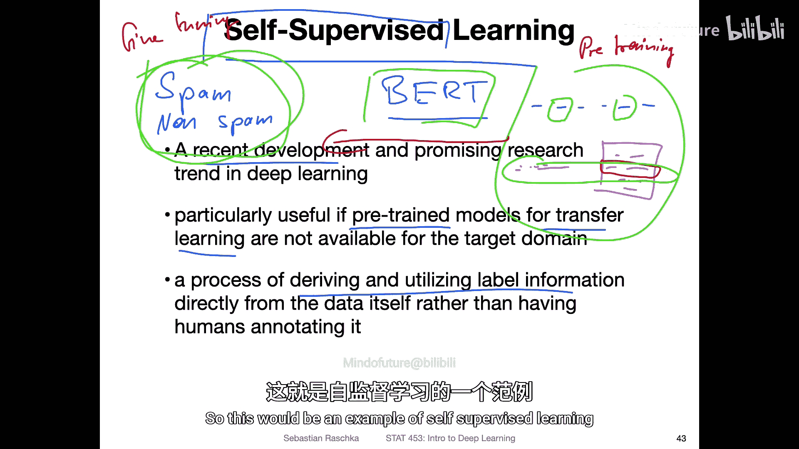
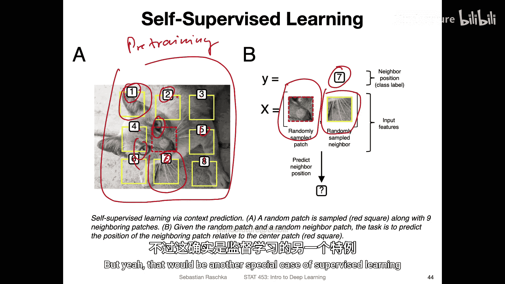
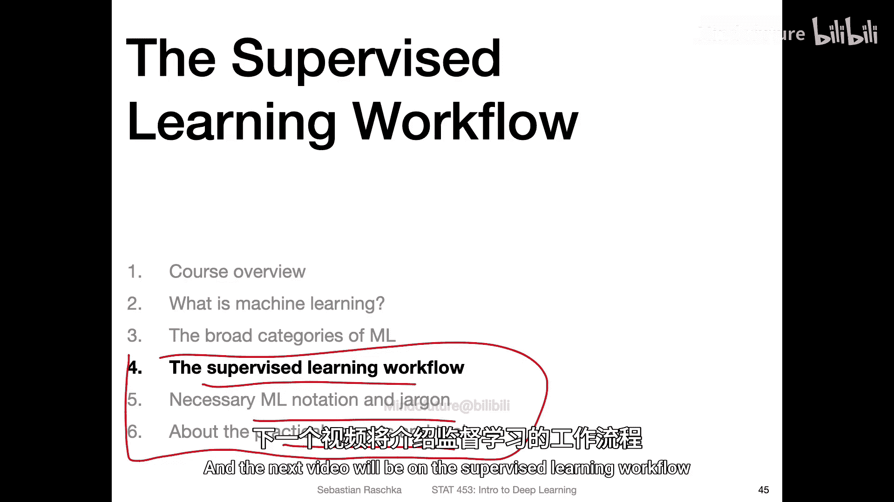

# 008：监督学习的特殊情形 🧠



在本节课中，我们将探讨监督学习中的两种特殊情形：半监督学习和自监督学习。这两种方法在数据标注有限的情况下，为构建更强大的模型提供了巧妙的解决方案。

上一节我们介绍了机器学习的三大主要类别。本节中，我们来看看监督学习框架下的两种特殊且重要的变体。



## 半监督学习 🤝

半监督学习是监督学习和无监督学习的混合体。在这种场景下，我们拥有部分训练样本的标签，但并非所有样本都有标签。

半监督学习的核心思想是：利用已标注的训练数据子集，来为未标注的训练数据部分生成标签，从而帮助我们推导出更优的决策边界。

以下是其工作原理的一个简单示例：




*   在左侧的**纯监督学习**场景中，我们只有两个类别的数据（例如类别1和类别2），并据此绘制了一条决策边界。
*   在右侧，我们引入了大量**未标注**的数据点（蓝色圆点）。
*   一个半监督学习系统可能会利用这些未标注的数据点，将决策边界从原来的位置（虚线）调整到新的位置（实线）。系统会假设这些蓝色数据点属于已有的某个类别（例如菱形类别），并利用这种假设来优化边界。

虽然这些假设可能不完全正确，但利用这些额外的未标注数据，模型有可能学习到更好的数据分布，从而提升性能。

## 自监督学习 🔄

自监督学习是当前深度学习研究中一个非常热门和前沿的领域。它特别适用于需要海量数据训练的大型模型，而我们又无法获得如此多人工标注数据的情况。

自监督学习的核心在于：**直接从数据本身生成或利用标签信息**，而无需人工进行标注。这通常涉及一个“预训练”阶段，模型在一个大型数据集上通过解决“自制”的任务来学习，然后再“微调”到我们真正关心的、数据量较小的目标任务上。这个过程也常被称为**迁移学习**。

### 自然语言处理示例：BERT模型

以著名的BERT语言模型为例。训练一个拥有数十亿参数的大型模型需要海量数据，但我们很难获得数百万份带有分类标签的文档。

**自监督预训练任务示例：**

1.  **掩码语言建模**：研究人员将输入文本中15%的单词遮盖（Mask）掉，然后让模型预测这些被遮盖的单词。模型的任务公式可以表示为：
    `预测 P(被遮盖的词 | 上下文词)`

2.  **下一句预测**：给定两个句子，让模型判断第二个句子是否是原文中紧接着第一个句子的下一句。



通过解决这些从数据本身“创造”出来的任务，模型学会了理解语言的结构和语义。之后，我们可以将这个**预训练**好的模型，**迁移**并**微调**到一个较小的、标注好的数据集上（例如垃圾邮件分类任务），使其适应新的具体任务。

### 计算机视觉示例：图像块预测

在图像领域，假设我们想训练一个猫狗分类器，但标注好的猫狗图片很少。

**一种自监督预训练方法如下：**


1.  将一张未标注的图片分割成3x3的网格（共9块）。
2.  随机遮盖（或取出）其中一块（例如第9块）。
3.  向模型展示被遮盖块的相邻图像块（例如位置7的块），然后让模型从所有可能的位置（1-8）中预测被遮盖块的正确位置。

```python
# 概念性代码，描述任务
image_patches = split_image(image, grid=(3,3)) # 将图像分割成9块
masked_patch_index = 8 # 假设遮盖第9块（索引8）
context_patch = image_patches[6] # 提供相邻块（例如位置7，索引6）
predicted_position = model(context_patch) # 模型预测被遮盖块的位置
# 真实标签 `masked_patch_index` 是已知的，因为分割是我们自己做的。
```

为了让模型能正确拼图，它必须学习理解图像中物体的结构和组成部分（例如猫的耳朵、眼睛应该出现在什么相对位置）。通过这种预训练，模型学会了有用的图像特征表示，之后可以更高效地微调到具体的猫狗分类任务上。



自监督学习是一个丰富且快速发展的领域，我们将在课程后期涉及Transformer等内容时再次简要回顾它。

---

本节课中我们一起学习了监督学习的两种特殊情形：**半监督学习**通过结合少量标注数据和大量未标注数据来提升模型；**自监督学习**则通过从数据本身构造预训练任务，让模型在无人工标注的大数据上先学习通用表示，再迁移到下游任务。这两种方法都是解决“数据标注瓶颈”的强大工具。



在接下来的内容中，我们将深入监督学习的工作流程，介绍其中涉及的数学符号和术语，并简要了解我们将要使用的主要工具PyTorch。