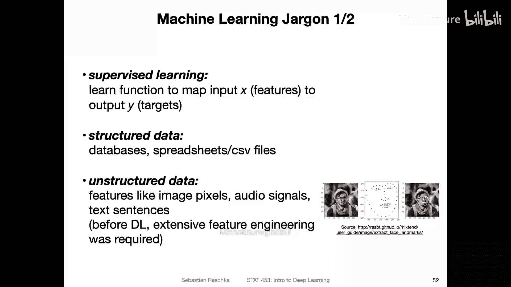
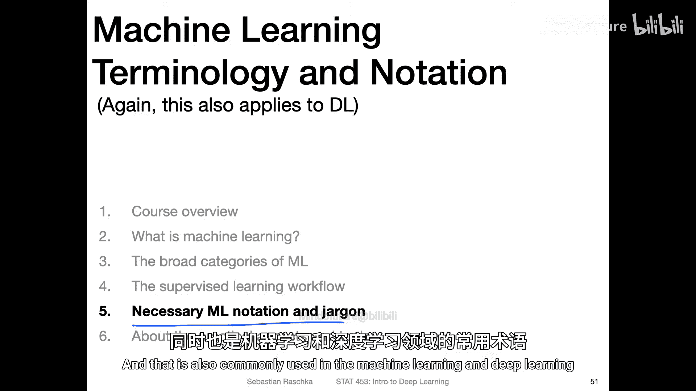
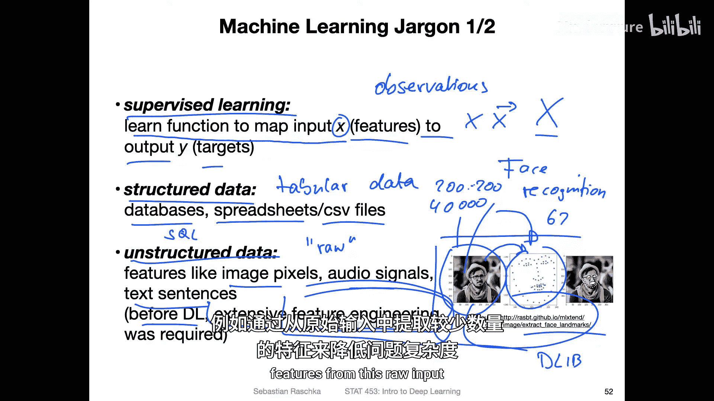
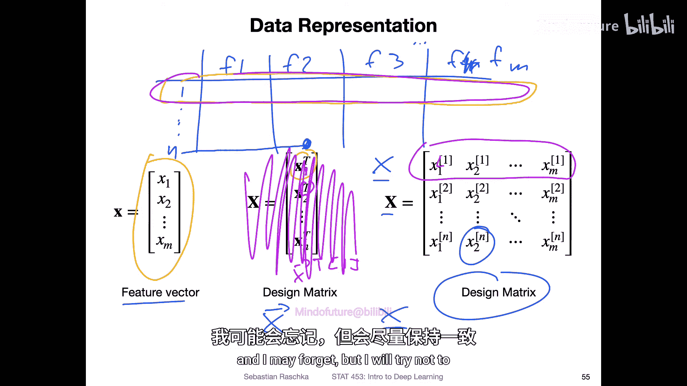
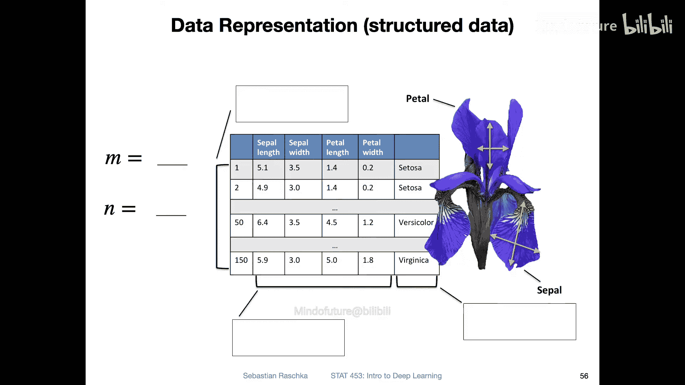
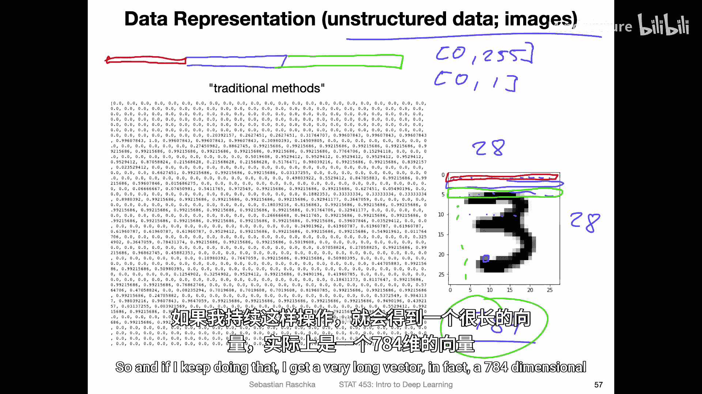
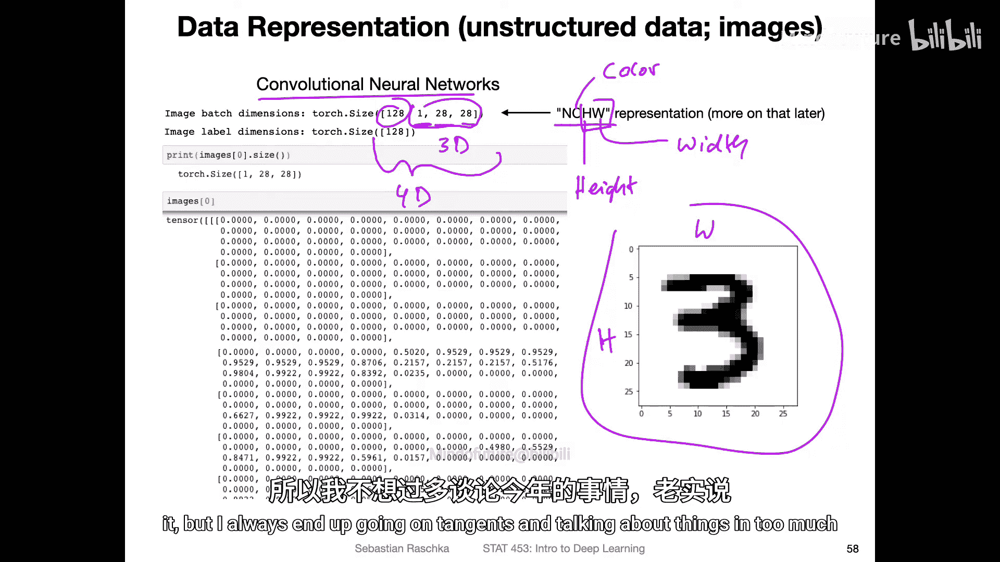
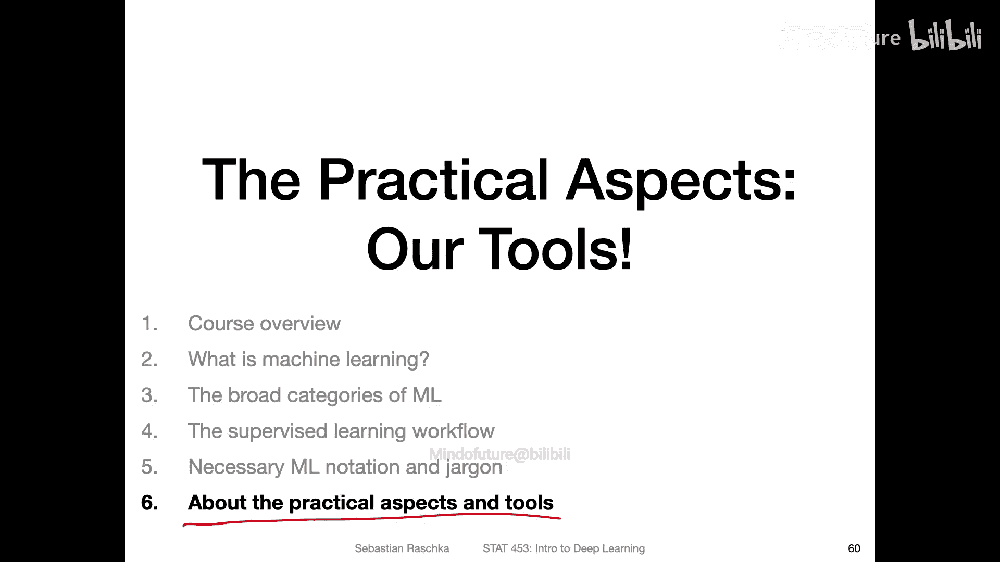

# 010：必要的机器学习符号与术语 📚

在本节课中，我们将学习机器学习中一些必要的符号和术语。这些概念将在本课程及整个机器学习与深度学习社区中反复使用。

## 监督学习回顾

上一节我们介绍了监督学习的基本概念。本节中，我们来具体看看其定义和相关术语。

监督学习旨在学习一个函数，该函数将输入 **X** 映射到输出 **Y**。其中，**X** 是特征，**Y** 是目标。

*   **特征**：也称为观测值，通常是向量。例如，花的尺寸（萼片长度、萼片宽度、花瓣长度、花瓣宽度）或图像的像素值。
*   **向量表示**：手写时，我们使用 `x⃗` 表示向量。在幻灯片或代码中，我们使用粗体 **x** 表示向量。标量则使用普通字体 `x` 表示。
*   **矩阵表示**：手写时，我们使用 `X̲` 表示矩阵。在幻灯片或代码中，我们使用粗体大写 **X** 表示矩阵。

## 结构化数据与非结构化数据

接下来，我们区分两种主要的数据类型。

*   **结构化数据**：通常指表格形式的数据，例如数据库（如SQL）、Excel电子表格或CSV文件。
*   **非结构化数据**：通常指原始数据，例如图像像素、音频信号或文本句子。深度学习通常处理此类数据。

在深度学习广泛应用之前，我们通常需要对非结构化数据进行大量的**特征工程**，即从原始数据中手动提取特征。

以下是特征工程的一个例子：
假设任务是面部识别。传统方法会从原始人像图像中提取面部关键点（或称面部标志点）。这样，我们将一个可能包含数万个像素（特征）的高维图像，简化为仅包含几十个关键点坐标的特征集，从而降低了问题的复杂度。

## 数据集与符号

现在，我们来看看如何用数学符号表示一个数据集。

*   **训练集**：通常用 **D** 表示。
*   **训练样本**：训练集由成对的观测值（特征）和目标标签组成，每一对称为一个训练样本。
*   **样本数量**：训练集包含 **n** 个训练样本。
*   **索引表示**：我们使用上标方括号表示训练样本的索引。例如，**x^[i]** 表示第 `i` 个训练样本的特征向量。
*   **特征维度**：每个特征向量是 **m** 维的。我们使用下标表示特征索引。例如，**x_j^[i]** 表示第 `i` 个样本的第 `j` 个特征值。

在Python中，索引从0开始，因此需要稍作转换。

## 设计矩阵

在实践中，我们通常有多个特征向量。我们可以将整个训练集表示为一个**设计矩阵**。

假设我们有 **n** 个训练样本，每个样本有 **m** 个特征。我们可以构建一个 **n × m** 的矩阵 **X**，其中每一行代表一个样本的特征向量（转置后以行向量形式存放）。同时，我们有一个 **n × 1** 的向量 **y** 存放所有样本的目标标签。

总结一下：
*   **m**：特征的数量（矩阵的列数）。
*   **n**：训练样本的数量（矩阵的行数）。

## 图像数据的表示

图像是非结构化数据，但我们也可以将其转换为结构化形式，以便用于传统机器学习方法。

以一张28x28像素的灰度图像为例：
1.  我们可以将图像的每一行像素连接起来，形成一个长的特征向量。这样，一个28x28的图像就变成了一个784维的向量。
2.  像素值通常在0到255之间，但常被归一化到0到1的范围。

在深度学习中，特别是使用卷积神经网络时，我们更倾向于直接使用图像的多维结构：
*   一张彩色图像通常表示为三维张量：**高度 (H) × 宽度 (W) × 颜色通道 (C)**。
*   在训练时，我们通常将多张图像打包成一个批次输入网络，形成一个四维张量：**批次大小 (N) × 通道 (C) × 高度 (H) × 宽度 (W)**（NCHW格式）或其它格式。

## 常用术语对照表

最后，我们整理一份机器学习常用术语的对照表，方便大家参考。

以下是机器学习中一些常见术语的同义词：

*   **训练模型**：拟合模型、参数化模型、从数据中学习。
*   **训练样本**：训练记录、训练实例。（注意：在深度学习中，“训练样本”通常明确指单个数据点，而“样本”一词可能产生歧义。）
*   **特征**：观测值、预测变量、自变量、输入、属性、协变量。
*   **目标**：结果、真实值、输出、响应变量、因变量。在分类任务中，也称作类别标签或标签。
*   **输出/预测**：模型产生的结果。注意，这是模型给出的预测值，与我们希望模型去匹配的“目标”（真实值）是不同的。

## 总结

本节课中，我们一起学习了机器学习中必要的符号和术语。我们回顾了监督学习的定义，区分了结构化与非结构化数据，学习了如何用数学符号表示数据集和设计矩阵，并了解了图像数据的不同表示方法。最后，我们整理了一份术语对照表，以帮助大家理解课程和文献中可能出现的各种表述。掌握这些基础概念和符号，将为后续深入学习机器学习和深度学习模型打下坚实的基础。