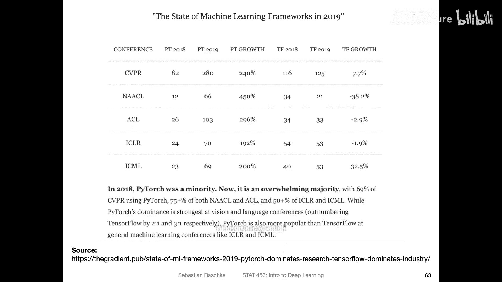
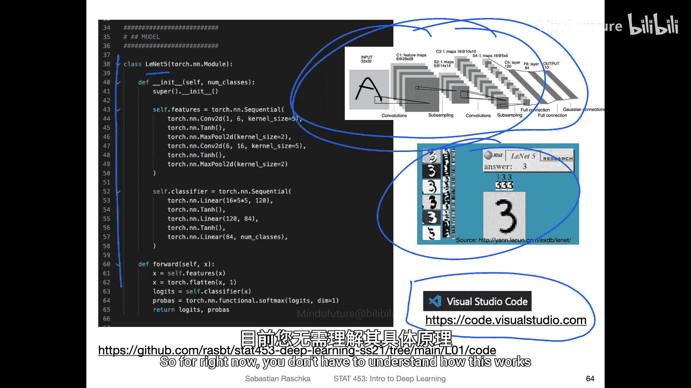
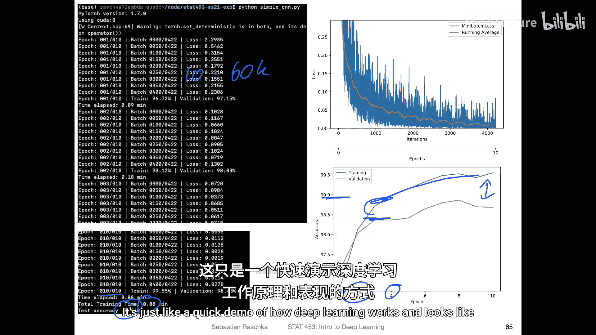
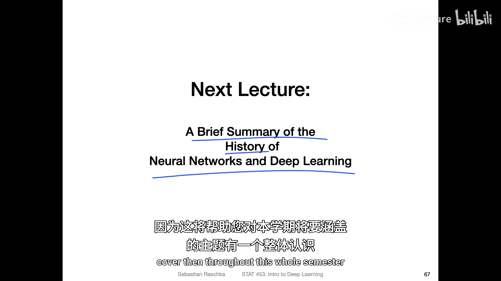

# 011：课程实践工具概述 🛠️

在本节课中，我们将介绍本课程将使用的编程语言、核心库以及开发环境。了解这些工具是开始深度学习实践的第一步。

## 概述

我们将主要使用 **Python** 作为编程语言，并重点使用 **PyTorch** 深度学习框架。课程中也会少量涉及 NumPy 和 Matplotlib 等库。本节将解释选择这些工具的原因，并对比其他可选方案。

## Python 科学计算生态

Python 拥有一个层次分明的科学计算生态系统。以下是其核心组成部分的简要介绍：

以下是 Jake VanderPlas 在 2015 年总结的 Python 科学计算生态层次图，它清晰地展示了从基础到专业的库依赖关系。

*   **基础层：Python**。这是所有上层库运行的基石。
*   **通用计算库**：例如 **IPython**（交互式计算环境）、**NumPy**（数值计算与线性代数库）。
*   **扩展与工具**：例如 **Cython**（用于在 Python 中集成 C 代码以提升性能），但本课程不会涉及。**Jupyter** 生态系统提供了 Jupyter Notebook，我们稍后会详细讨论。
*   **高级科学库**：例如 **SciPy**（在 NumPy 基础上提供更多科学算法）、**Matplotlib**（可视化库）、**Pandas**（数据分析库）。
*   **机器学习库**：例如 **scikit-learn**（传统机器学习库，在 STAT 451 课程中使用过）和 **MLxtend**（补充算法库）。**本课程将完全不涉及这些传统机器学习库，与 STAT 451 课程几乎没有重叠，因此学习 451 课程对本课程没有先修优势。**

## 本课程核心工具

上一节我们介绍了 Python 的广阔生态，本节中我们来看看本课程将聚焦的核心工具。

在本次课程中，我们将主要使用：

1.  **Python**：核心编程语言。
2.  **PyTorch**：基于 Python 构建的深度学习框架。
3.  **NumPy**：主要用于前几讲，以平缓地引入概念，例如在讲解感知机时。
4.  **Matplotlib**：偶尔用于数据可视化。

课程的重点将真正放在 **PyTorch** 上。

## 关于开发环境：Jupyter Notebook 与脚本

现在我们已经确定了核心库，接下来需要考虑编写代码的环境。这里有两种主要选择。

关于 Jupyter Notebook，我个人非常喜欢它，并经常将其用于数据分析。然而，根据我的经验，在处理深度学习代码时，我最近开始更倾向于使用常规的 Python 脚本文件。

以下是主要原因：

*   **代码复杂度与运行时间**：深度学习代码有时非常冗长，且运行时间可能很长。我有时需要通过终端在其他计算机上运行代码，脚本文件在这些方面处理起来更方便。
*   **调试便利性**：脚本文件在集成开发环境（IDE）或高级文本编辑器中，有更好的代码提示、语法高亮和调试工具支持。

当然，我仍然大量使用 Jupyter Notebook，例如今天在撰写论文、制作可视化图表时。对于数据分析和探索性工作，Jupyter Notebook 非常出色。但对于编写像神经网络这样较长的代码结构，我个人认为文本编辑器更方便。

我推荐使用诸如 **Visual Studio Code** 这样的文本编辑器。它免费、快速，支持 Windows、Linux 和 macOS 等所有主流操作系统，并对 Python 和调试提供了出色的支持。

## 为什么选择 PyTorch？

既然我们决定主要使用 PyTorch，那么有必要了解一下选择它的理由。

我个人的使用历程如下：我在 2013/14 年左右开始使用名为 **Theano** 的库进行神经网络工作。2015年，谷歌发布了 **TensorFlow**，我开始像当时的大多数人一样使用它，并在过去几年中大量使用。

2017年，**PyTorch** 发布，它在某些方面带来了极大的便利。我个人感觉该库更有条理，支持动态计算图，更接近 NumPy 的用法。如今，PyTorch 和 TensorFlow 的功能已经非常相似，都支持静态和动态图。但在 2017-2019 年间，从我个人观点看，PyTorch 比 TensorFlow 友好得多。

此外，深度学习社区也非常青睐 PyTorch。根据下图所示的顶级机器学习会议数据，从 2017 年到 2019 年中，PyTorch 的使用量呈现急剧增长（图中实线），而 TensorFlow 的增长则相对平缓甚至下降。

如今，当你查找一篇新论文的代码时，在 GitHub 上最常找到的是 PyTorch 实现。当然也有 TensorFlow 代码，但 PyTorch 的普及度确实增长巨大。

选择一个流行的库很重要，原因在于：当你想要实现更复杂的模型时，更容易找到教程、示例代码或与论文对应的实现。对于本课程，我仍然认为 PyTorch 比 TensorFlow 更有条理、更易用，并且更类似于 NumPy，这将有助于降低学习曲线。

## PyTorch 代码示例

为了直观感受 PyTorch 的简洁性，这里有一个简短的代码演示。

我实现了一个之前讨论过的 **LeNet-5** 卷积神经网络。正如之前所说，对于深度学习，我现在更喜欢使用文本编辑器。原因在于，例如如果我在这里打错了字，编辑器会立即标记，而且深度学习代码可能很长，在文本编辑器中开发我感觉更高效。

这段代码用于手写数字识别。可以看到，用 PyTorch 实现这个相当复杂的卷积网络只需要寥寥数行。当然，训练模型还需要更多代码，但实际上并不复杂。我们将在课程后续逐步详细讲解。现在，你无需完全理解其工作原理，只需感受代码并非那么复杂。

这里我正在运行代码。我使用的计算机配备了 GPU。在这个例子中，我训练了 **10 个周期**（epoch），即对整个训练集（约 60000 张图像）进行了 10 轮迭代。训练过程仅用了不到一分钟，速度非常快。训练后，模型在验证集上达到了接近 **99% 的准确率**。

从可视化结果中可以看到，早在第 2 或第 4 个周期后，准确率就已接近 99%，这令人印象深刻。同时，你也能观察到验证集和训练集准确率之间存在差距，这暗示了**过拟合**现象，我们后续也会详细讨论这一点。这只是一个展示深度学习工作流程和效果的快速演示。

## 补充资料与课程总结

如果本节介绍的某些细节尚不清晰，请不要过于担心，这只是一个概述性介绍。我注意到我在此处或彼处涉及了过多细节。

实际上，我为此撰写了一篇博客文章，因为我曾计划基于我的讲义编写一本小教科书（这是一个进行中的项目，不确定何时能完成）。我已将第一章作为博客文章发布，你可以通过阅读它以书面形式回顾我所讲的全部内容。

此外，对于那些对传统机器学习概述感兴趣的同学，可以查阅 STAT 451 课程的讲义。当然，这不是必须的。

另一个可能有帮助的资料是我所著《Python 机器学习》书籍的**第一章**。它可以看作是那篇博客文章的一个更简短版本，当然写法不同，视角也略有差异，是我较早之前撰写的。

## 总结

本节课中，我们一起学习了本课程将使用的核心实践工具。我们明确了以 **Python** 和 **PyTorch** 作为主力，了解了选择 PyTorch 的原因及其社区优势，并讨论了 **Jupyter Notebook** 与 **脚本文件** 在不同场景下的适用性。最后，我们通过一个 LeNet-5 的 PyTorch 实现示例，直观感受了深度学习代码的样貌。

在下一讲中，我们将回顾神经网络与深度学习的简史，概述其主要架构，从而为大家提供一个关于本学期将要涵盖主题的宏观图景。

