# 012：深度学习新闻 #1 📰

在本节课中，我们将一起回顾2021年1月27日这一周内，深度学习领域的一些有趣新闻和应用。这些内容涵盖了从医疗健康到社交数据分析等多个方面，旨在帮助你了解深度学习技术的最新进展和实际应用。

---

## 深度学习在COVID-19资源需求预测中的应用 🏥

上一节我们介绍了本周的新闻概览，本节中我们来看看一个具体的应用：使用深度学习预测COVID-19患者的资源需求。

Facebook AI Research与纽约大学的医学专家合作，开发了一个利用胸部X光片序列预测患者病情恶化和资源需求（如氧气）的模型。这个项目强调了与领域专家合作的重要性，尤其是在医疗等关键应用中。

研究人员训练了三个模型：
*   第一个模型仅根据单张X光片预测患者病情恶化。
*   第二个模型根据一系列X光片（视为时间序列问题）完成同样的预测任务。
*   第三个模型基于单张X光片预测患者所需的氧气供应量。

他们的方法采用了**自监督学习**。首先，在一个大型的非COVID胸部X光数据库上进行预训练（**预训练任务**），然后在一个较小的、包含5000名患者27000张X光片的COVID-19数据集上进行**微调**。有趣的是，在某些指标上，这些模型的表现超过了人类专家。这并非要取代医生，而是为了在医疗资源紧张时，为医生提供辅助，帮助减少可能的失误。

你可以在arXiv上找到完整的论文，相关预训练模型也已开源在GitHub上。

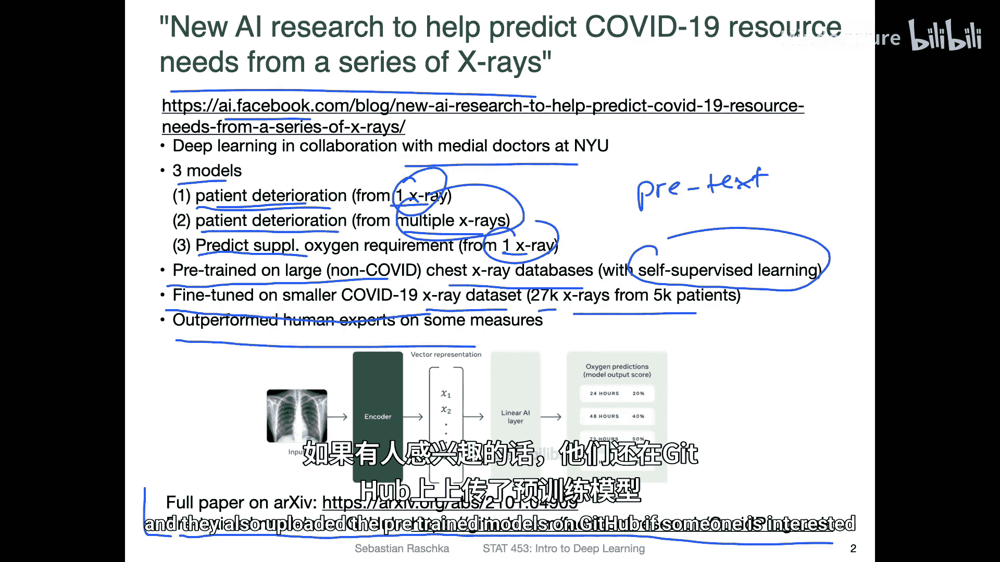

---

## 探索arXiv上的COVID-19研究 📄

上一节我们介绍了一个具体的COVID-19研究案例，本节中我们来看看如何发现更多相关研究。

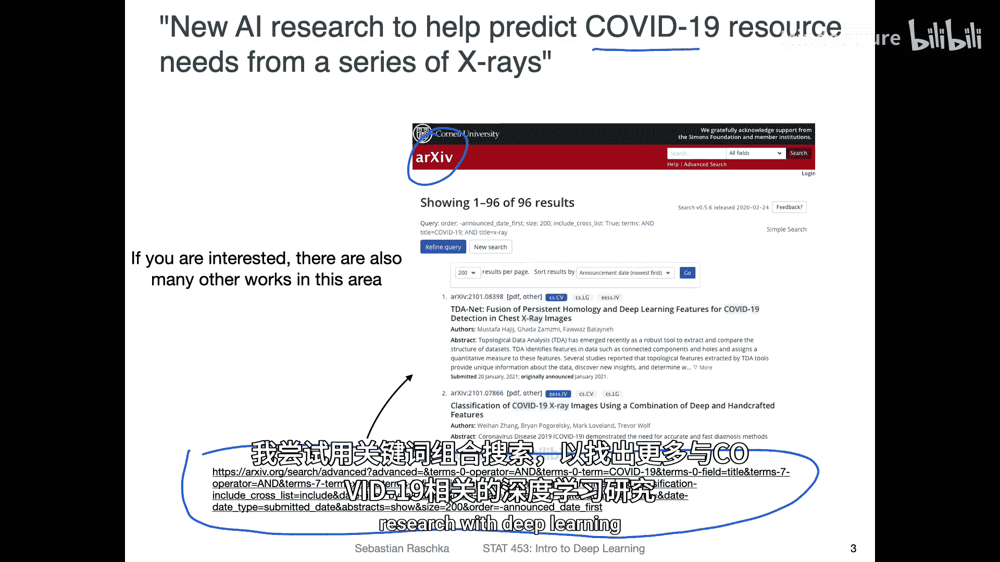

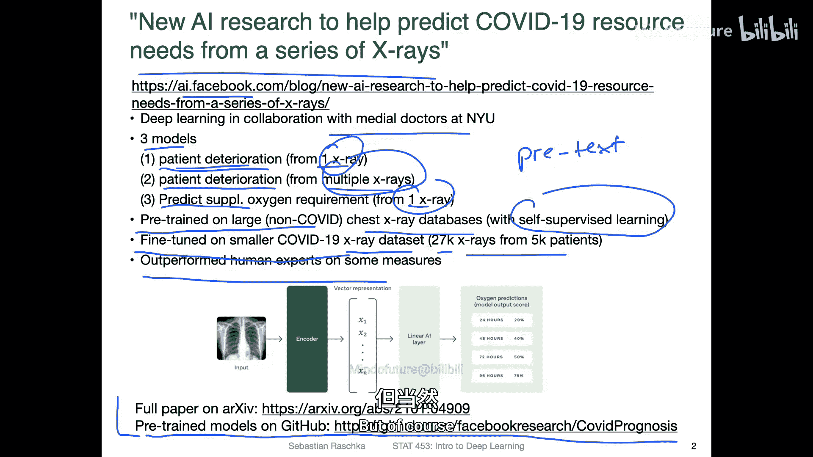

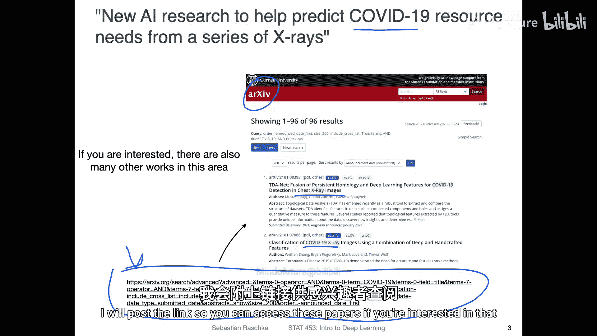

arXiv是一个涵盖多个研究领域的预印本服务器，每天都会新增大量机器学习论文。你可以使用其搜索功能来查找特定的深度学习与COVID-19相关的研究。

例如，使用组合关键词进行搜索，可以找到许多利用胸部X光片进行COVID预测的研究。但需要注意的是，arXiv上的论文尚未经过同行评审，因此对其发现应持审慎态度。这些资源对于课程项目可能很有帮助。

---

## 学习病毒进化的“语言” 🧬

除了医学影像分析，深度学习在理解病毒本身方面也有应用。本节我们将探讨一项关于病毒进化的有趣研究。

一项研究训练了一个**双向长短期记忆网络**来学习病毒进化的“语言”。**LSTM**是循环神经网络的一种，擅长处理序列数据。**双向**意味着模型会同时从序列的开头和结尾处理信息。

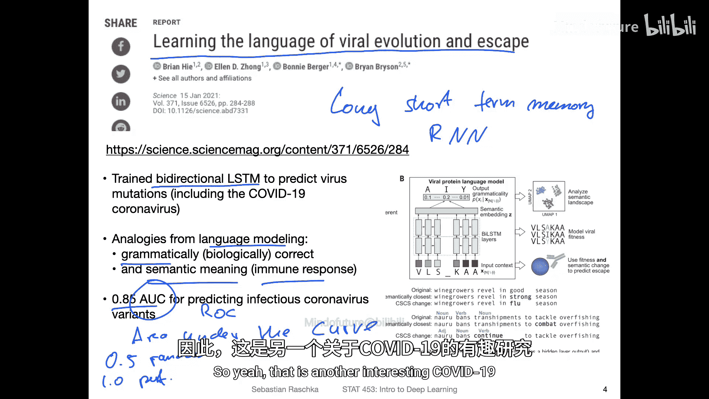

研究人员将病毒对应的氨基酸序列视为一种“语言”进行建模。他们将“语法正确”类比为生物学上的序列合理性，将“语义含义”类比为序列是否会引起免疫反应。该模型取得了0.85的**AUC**值。**AUC**通常指**ROC曲线下面积**，用于衡量分类器性能，0.5表示随机猜测，1.0表示完美预测。因此，0.85是一个相当不错的结果。

---

## 商业AI动态与数据获取 🏢

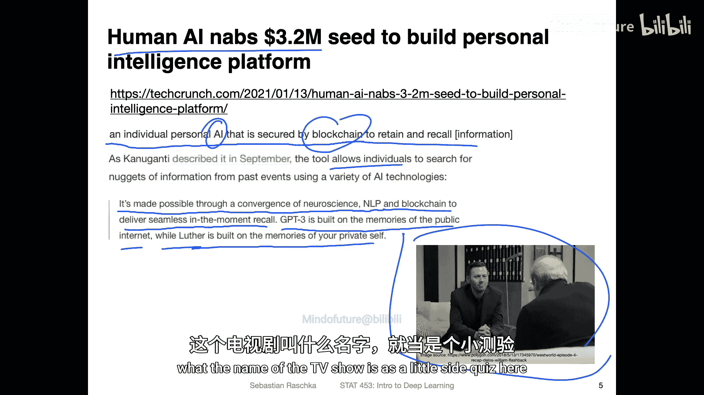

上一节我们探讨了学术研究，本节转向商业和基础设施方面的一些新闻。

一个名为“Human AI”的项目获得了320万美元融资，旨在构建一个基于区块链技术的个人智能平台。其概念是创建一个安全的、属于个人的“第二大脑”或数字知识库，这让人联想到某些科幻影视作品中的场景。

另一方面，Twitter宣布向学术研究人员免费开放其完整的推文存档，并大幅提高了API的月度调用上限，还提供了更精确的数据过滤功能。这使得基于社交媒体数据的研究更加便利。

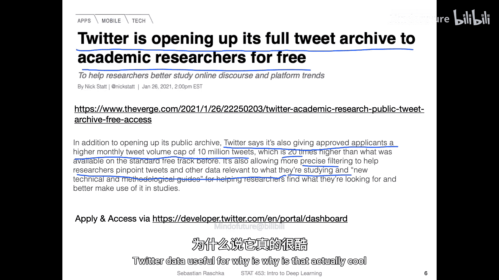

这类数据用途广泛，例如，有研究利用深度学习分析推文，开发噪音过滤机制，以在洪水、暴风雪等极端天气事件中更有效地定位和管理危机区域。

---

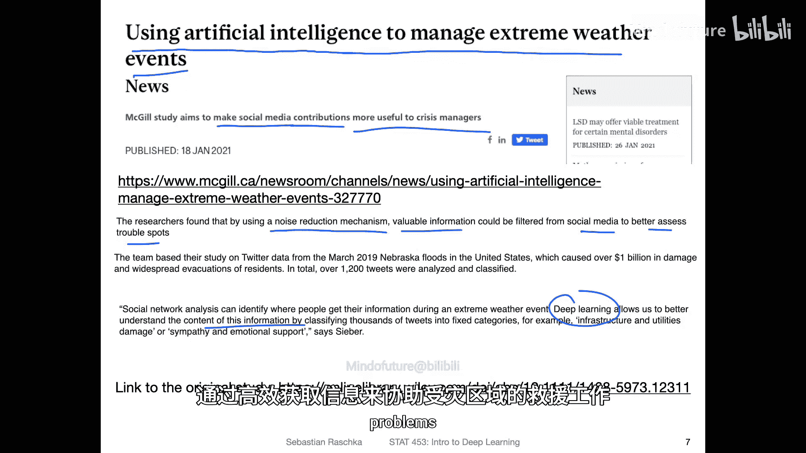

## 数据集的演进：重新标注ImageNet 🖼️

高质量的数据集对深度学习至关重要。本节我们关注一个经典数据集的更新。

ImageNet是深度学习社区中一个非常常用的基准数据集，包含约1400万张图像。但它也存在标签错误或不完整的问题（例如一张图中包含多个物体，但只标注了一个）。

为此，研究人员启动了一个重新标注ImageNet的项目，为图像添加多标签。他们利用从Instagram获取的10亿张图像训练了一个模型（作为“机器标注员”），通过将ImageNet中的图像裁剪成多个区域并对每个区域进行分类，来获得更全面的多标签上下文信息。这为解决“先有数据还是先有模型”的循环依赖问题提供了一个有趣的思路。

---

## 利用AI改善视障人士体验 👁️

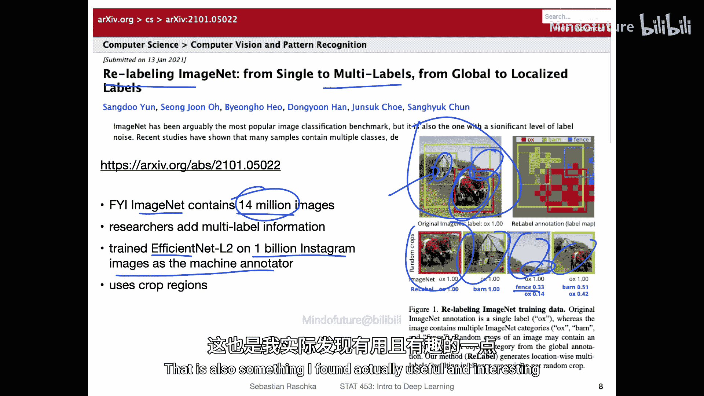

最后，我们来看一个体现技术人文关怀的应用。Facebook AI Research利用人工智能改进照片描述，以帮助盲人或视障人士。

他们开发了一款智能手机应用，用户可以拍摄照片，应用会生成音频描述来讲述图片内容。该系统通过在一个包含35亿张Instagram照片及其对应标签的数据集上训练**ResNeXt**模型，并结合**Faster R-CNN**目标检测器来描述图像中的不同元素，从而提高了描述的准确性。例如，一张图片可能被描述为“可能是一张一个人站在马丘比丘的照片”。

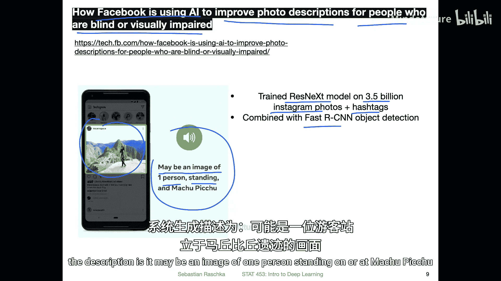

---

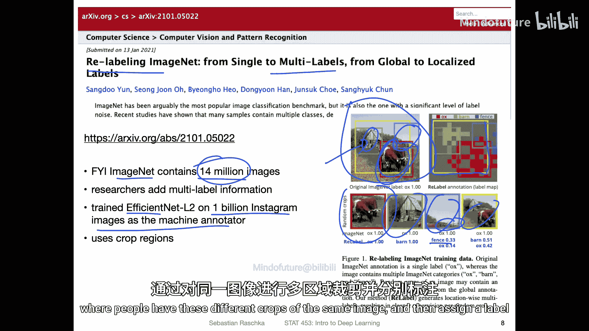

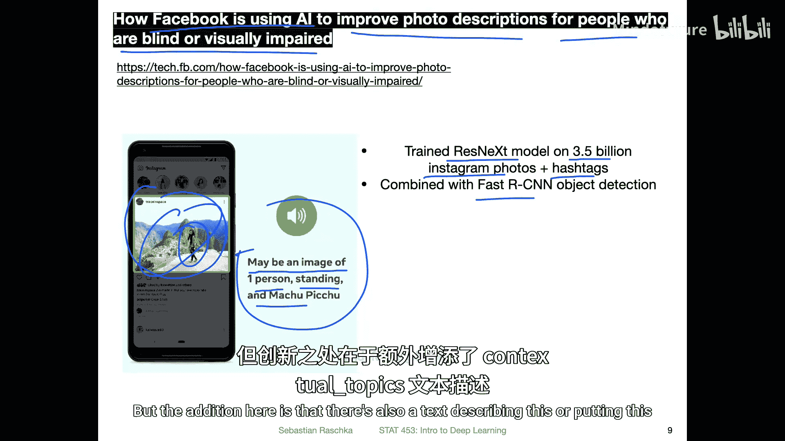

本节课中我们一起学习了深度学习在多个领域的最新动态：从预测COVID-19医疗需求、分析病毒序列，到商业AI项目、社交媒体数据开放，再到改进经典数据集和创造辅助技术。这些例子展示了深度学习技术的广泛应用和持续发展。希望这些新闻能帮助你保持对领域前沿的了解。