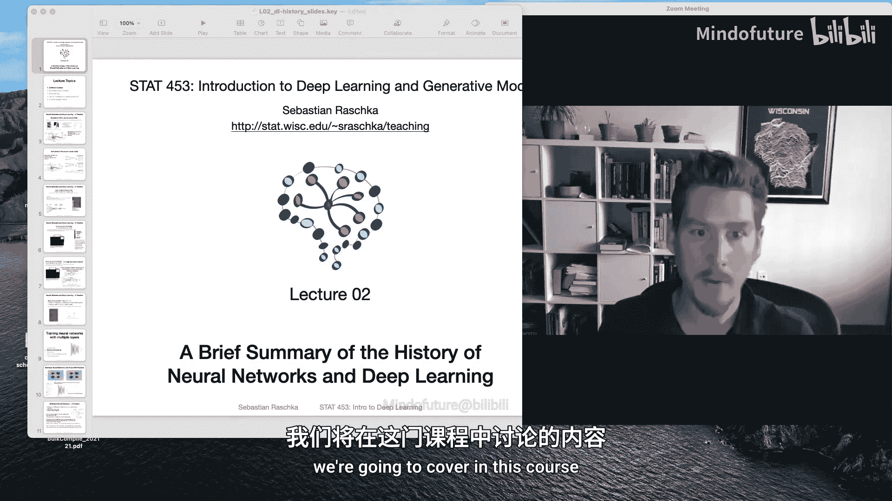
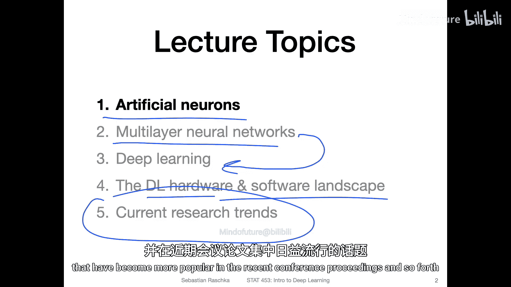

# 013：深度学习简史 📜

在本节课中，我们将一起回顾神经网络与深度学习的发展历程。这段历史不仅有趣，更能帮助我们构建一个宏观的知识框架，理解从简单神经元到复杂深度模型的演进逻辑。通过了解关键的技术突破与思想变迁，我们能为后续深入学习各个具体主题打下坚实的基础。

上一节我们完成了第一讲内容的学习。本节中，我们来看看神经网络与深度学习的简要发展史。

## 人工神经元 🧠

一切始于对生物神经元进行数学建模的尝试。人工神经元是神经网络最基本的构建单元，其设计灵感来源于人类大脑中神经细胞的工作方式。

以下是人工神经元的核心计算步骤：

1.  **输入与权重**：神经元接收多个输入信号（\(x_1, x_2, ..., x_n\)），每个输入都对应一个权重（\(w_1, w_2, ..., w_n\)），权重代表了该输入的重要性。
2.  **加权求和**：计算所有输入与其对应权重的乘积之和，并加上一个偏置项（\(b\)）。这形成了神经元的净输入（\(z\)）。
    ```python
    z = (x1 * w1) + (x2 * w2) + ... + (xn * wn) + b
    ```
3.  **激活函数**：将净输入 \(z\) 通过一个非线性激活函数（如阶跃函数、Sigmoid函数），产生神经元的最终输出（\(a\)）。
    ```python
    a = activation_function(z)
    ```

然而，这种单层结构（感知机）存在根本性局限，例如它无法解决“异或”（XOR）这类简单的非线性可分问题。这促使研究者们寻找更强大的模型。

## 多层神经网络 🏗️

为了克服单层神经网络的局限性，研究人员引入了隐藏层，从而诞生了多层神经网络（也称为多层感知机，MLP）。隐藏层的加入使得网络能够学习输入数据中更复杂、更抽象的特征表示。

从单层网络到多层网络的演变，核心在于解决复杂问题的需求。多层结构通过组合多个简单的非线性变换，理论上可以拟合任何复杂的函数。然而，在实践初期，训练深层网络面临梯度消失或爆炸等挑战，直到反向传播算法得到有效应用和改进后，多层神经网络才真正展现出其潜力。



## 从多层网络到深度学习 🚀

“深度学习”本质上是指使用多层（“深”层）神经网络的机器学习方法。虽然多层网络的概念早已存在，但“深度学习”这一术语的兴起与21世纪初算力（GPU）、大数据以及算法改进（如ReLU激活函数、Dropout正则化）的突破密切相关。

这一阶段的发展使神经网络的能力产生了质的飞跃。模型不仅层数更深，还演化出了针对特定数据类型的专用架构，例如：
*   **卷积神经网络（CNN）**：专门为处理图像等网格状数据而设计，能高效提取空间特征。
*   **循环神经网络（RNN）**：专为处理文本、语音等序列数据而设计，具有记忆先前信息的能力。

这些专用架构的出现，使得深度学习在计算机视觉、自然语言处理等领域取得了革命性的成功。

## 硬件与软件的发展 💻

深度学习近年来的爆炸式增长，离不开计算硬件和软件开发工具的飞速进步。

以下是推动深度学习发展的关键基础设施：

1.  **图形处理器（GPU）**：GPU最初为图形渲染设计，但其高度并行的计算特性非常适合深度学习中的大规模矩阵运算，极大地加速了模型训练。
2.  **专用芯片（如TPU）**：谷歌等公司开发的张量处理单元（TPU）是专门为神经网络计算定制的芯片，能效和速度更高。
3.  **深度学习框架**：诸如TensorFlow、PyTorch等开源框架的出现，降低了构建和训练复杂模型的难度。它们提供了自动微分、GPU加速和预构建模型组件等功能。

这些工具共同作用，使得研究人员和工程师能够更快速地将想法转化为实际可运行的深度模型。

## 当前研究趋势 🔮

深度学习领域仍在快速演进。了解当前趋势有助于把握其未来方向。

近期受到广泛关注的研究方向包括：

*   **注意力机制与Transformer架构**：彻底改变了自然语言处理领域，并在计算机视觉等领域得到广泛应用，其核心是让模型能够动态地关注输入中最相关的部分。
*   **生成式模型**：如生成对抗网络（GAN）和扩散模型，能够生成高度逼真的图像、文本、音频等内容。
*   **自监督学习**：旨在从未标注的数据中自动学习有效表示，减少对昂贵人工标注数据的依赖。
*   **大语言模型（LLM）与多模态模型**：参数量巨大的模型，展现出强大的通用理解和生成能力，并能处理文本、图像、声音等多种类型的数据。



本节课中，我们一起学习了深度学习从单个人工神经元到当前复杂模型的发展简史。我们了解了多层网络如何解决单层模型的局限，以及硬件、软件的进步如何共同催生了深度学习革命。最后，我们概览了当前最前沿的研究趋势。这段历史表明，深度学习是一个持续迭代、快速发展的领域，理解其演进脉络将帮助我们更好地学习后续的具体技术与模型。