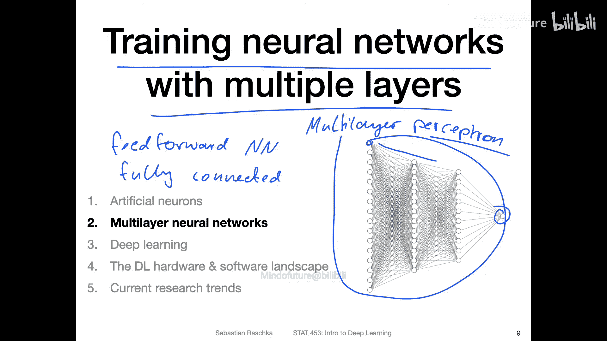
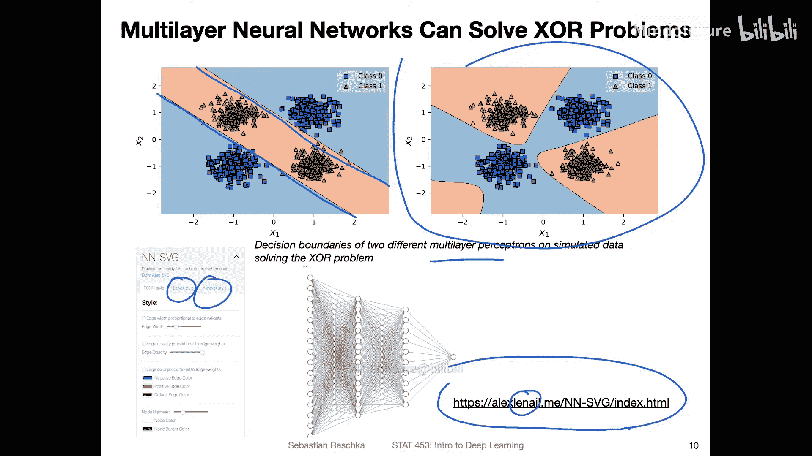
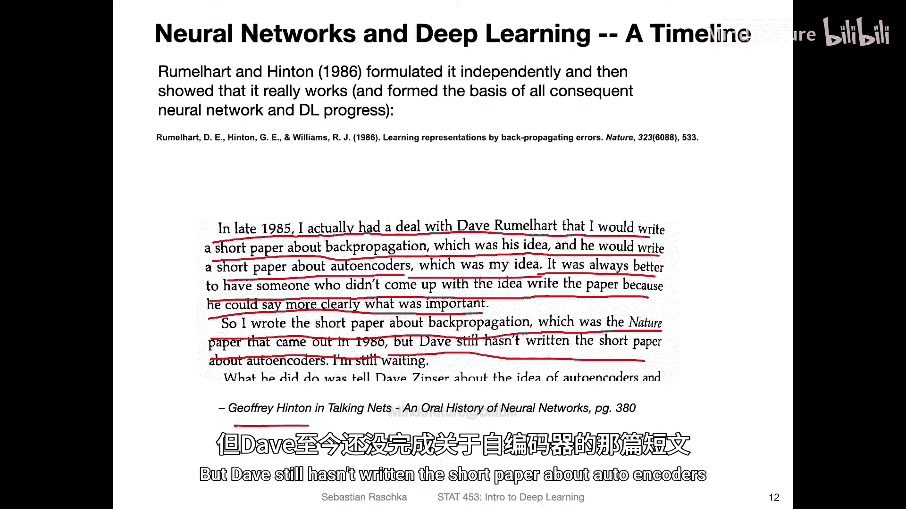
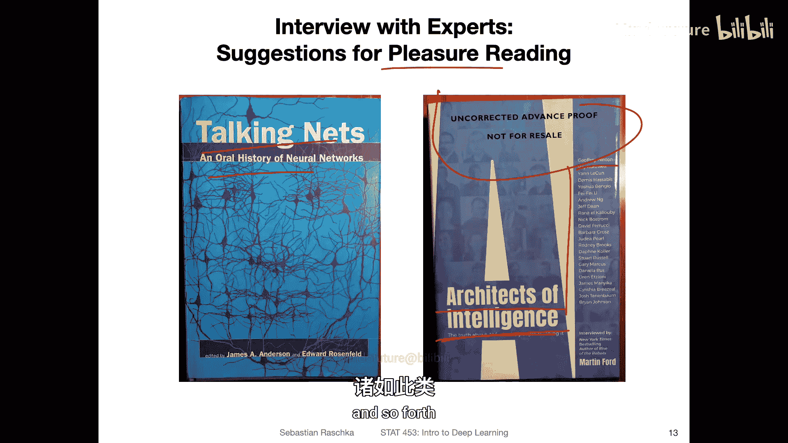
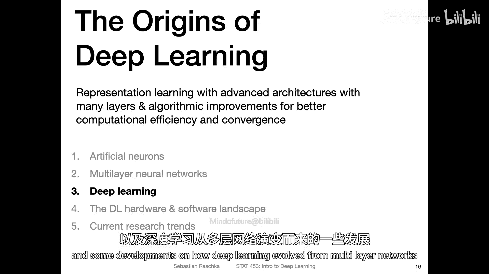

# 015：多层神经网络 🧠

在本节课中，我们将要学习多层神经网络。我们将了解其基本架构、它如何解决单层网络无法处理的问题（如异或问题），以及训练这类网络的关键算法——反向传播。

## 多层感知机架构

上一节我们介绍了单层感知机及其局限性。本节中我们来看看多层感知机，它有时也被称为前馈神经网络或全连接神经网络。

这种网络有两个关键特性：
*   **前馈**：数据流仅沿一个方向（从输入到输出）传播。
*   **全连接**：每一层的每个神经元都与下一层的所有神经元相连。

请注意“感知机”这个词，虽然这种网络与原始的感知机模型关系并不紧密，因为它引入了**非线性激活函数**。我们将在后续课程中详细讨论激活函数。

## 解决异或问题

正是**多层结构**和**非线性激活函数**这两个方面，使得多层感知机能够解决单层感知机无法解决的异或问题。

以下是使用多层感知机在异或数据上训练得到的两种决策边界示例：

*   **左图**：网络通过学习两条平行的线性边界来解决问题。
*   **右图**：仅略微改变隐藏层神经元数量，网络找到了另一种截然不同的解决方案。

使用多层神经网络，对于此类问题存在无限多种解决方案。

> **工具推荐**：如果你需要绘制神经网络架构图，Alex Lenail 开发了一个非常便捷的在线工具，可以快速绘制包括 LeNet、AlexNet 等经典网络在内的示意图。

## 训练挑战与反向传播

虽然多层网络架构解决了异或问题，但它也带来了新的挑战：**训练困难**。最初并没有高效的训练算法。

解决方案是**反向传播算法**。该算法被独立提出多次，但真正使其流行并证明其在实际中有效的，是 Rumelhart 和 Hinton 于 1986 年发表的论文。

反向传播的核心思想是，通过计算预测误差，并将误差从输出层向输入层反向传播，来高效地更新网络中的权重参数，从而最小化误差。其更新规则可以概括为以下公式：

`权重更新量 = 学习率 * 误差信号 * 输入值`

一个有趣的事实是，Hinton 在访谈中提到，他与 Rumelhart 约定互相撰写对方提出的想法的短文，他撰写了关于反向传播的短文（即 1986 年的《自然》论文），但仍在等待 Rumelhart 撰写关于自编码器的短文。

反向传播至今仍是训练神经网络最有效、最流行的算法，经受住了时间的考验。

## 其他学习算法简介

反向传播并非训练神经网络的唯一算法。以下是其他几种学习算法的简要概述：

*   **赫布学习**：基于“一起激发的神经元连在一起”的原则。连接强度随使用频率增加而增强，**不依赖于误差反馈**。这可能导致重复错误行为而无法纠正。
*   **扰动学习**：随机扰动权重，如果性能变好则保留，否则丢弃。这种方法**效率非常低下**。
*   **目标传播等**：存在一些类似反向传播但使用辅助网络的算法。然而，就**最小化误差的效率**而言，反向传播目前仍是最优的。

尽管人脑可能并非使用完全相同的反向传播机制，但在构建计算机预测模型时，我们追求高精度和低误差，因此反向传播仍是首选。

## 不同架构的归纳偏置

神经网络的设计隐含了对数据结构的假设，这称为“归纳偏置”。下图展示了常见架构及其偏置：

以下是不同架构的核心假设：

*   **多层感知机**：假设输入特征之间**相互独立**，没有顺序或空间关系。适用于表格数据（如鸢尾花数据集）。理论上，只要隐藏层足够大，它可以近似任何函数，是**通用函数逼近器**。
*   **卷积神经网络**：假设数据具有**局部相关性**（如图像中相邻像素相关）。通过卷积核捕捉局部特征，非常适合图像分析。
*   **循环神经网络**：假设数据具有**序列依赖性**（如文本中单词的顺序）。它按顺序处理输入，并保持内部状态以记忆历史信息，非常适合时序或文本数据。
*   **特定图网络/手工编码**：显式编码实体间的关系。虽然强大，但**手工设计非常繁琐**，在深度学习中不常作为基础架构使用。

利用这些先验假设（如局部性、序列性）可以使学习任务变得更简单，这也是深度学习成功的关键思想之一。

## 总结

本节课中我们一起学习了：
1.  **多层感知机**的架构及其通过引入隐藏层和非线性激活函数解决复杂问题（如异或）的能力。
2.  训练多层网络的核心算法——**反向传播**的历史、原理及其重要性。
3.  除了反向传播外，还存在其他学习算法（如赫布学习、扰动学习），但在最小化误差方面效率较低。
4.  不同神经网络架构（MLP、CNN、RNN）内置了不同的**归纳偏置**，适用于不同类型的数据（表格、图像、序列），合理利用这些偏置能更有效地进行学习。

下一讲，我们将探讨“深度学习”这一名称的由来，以及它如何从多层神经网络发展演变而来。