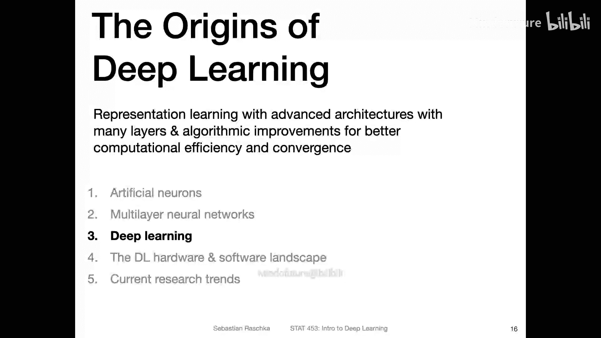
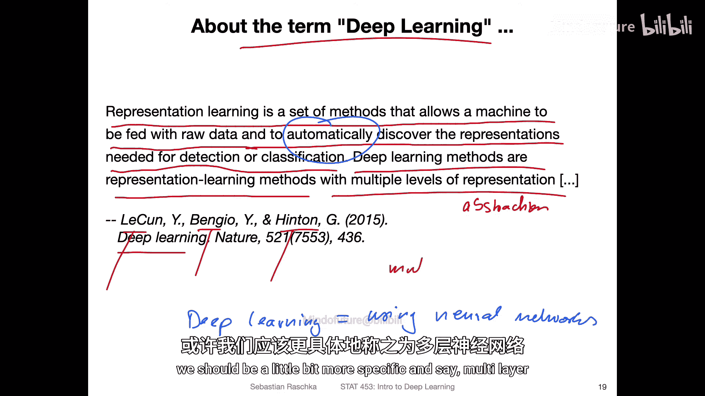
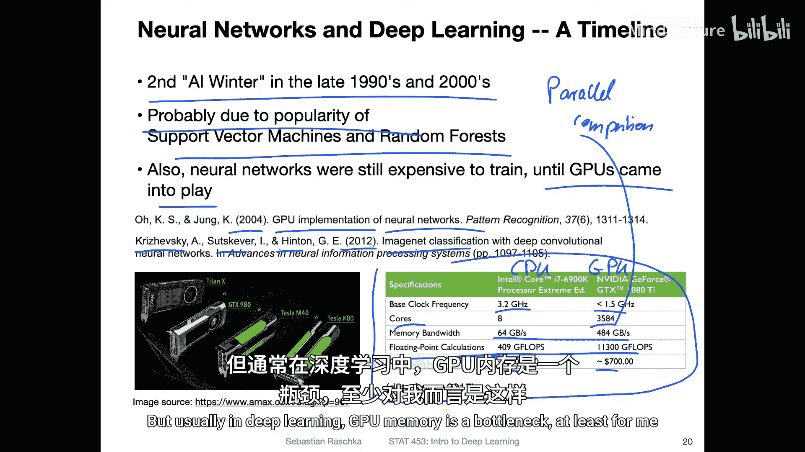
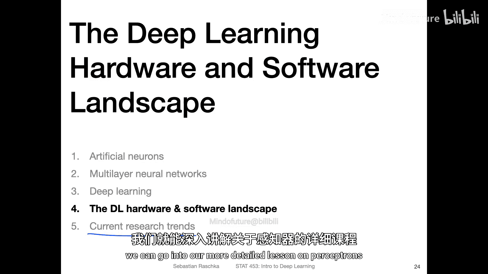

# 016：深度学习的起源 🧠

在本节课中，我们将探讨深度学习的起源，了解它如何从多层感知机等早期神经网络发展而来，并理解其核心概念——表示学习。

## 从多层感知机到深度学习

上一节我们介绍了多层感知机。本节中我们来看看深度学习的概念是如何产生的。

深度学习是一个相对较新的术语，大约在10到15年前被提出。而多层感知机已经存在了至少30到40年。从技术上讲，深度学习最初指的是**使用具有许多层的先进架构进行表示学习**。因此，拥有多层结构本身并不是多层感知机与深度学习的主要区别，关键在于其**表示学习的能力**。

如今，在较新的论文中，人们使用多层感知机时也常称之为深度学习。这可能是因为现在所有神经网络都被自动归入深度学习的范畴，为了避免混淆。

## 表示学习与卷积神经网络

让我们更深入地探讨刚才提到的表示学习概念。这可以追溯到大约1990年代，甚至在“深度学习”这个词出现之前。

卷积神经网络是这一概念的重要体现。你可以将其视为多层感知机的一个专门化版本，它引入了**局部性**概念。这使得训练更高效，并能提取局部特征，从而更好地捕捉特征间的依赖关系。

回想一下，多层感知机处理的是特征独立的表格数据。而卷积网络可以利用**关系归纳偏置**的先验知识，它专门为图像识别和图像数据设计。

以下是卷积神经网络工作原理的简要概述：
*   **卷积部分**：包含卷积层，运用了**权重共享**的概念，并涉及池化操作。这使训练更高效。你可以粗略地将其视为**特征学习层**，这些层能够从数据中提取抽象特征。
*   **全连接部分**：这些本质上是**多层感知机**，可以将其视为一个分类器。

因此，整个架构可以看作：下半部分用于**特征学习**，上半部分用于**对提取出的特征进行分类**。这使得手工设计特征变得过时。网络以最优于分类器的方式学习特征，因为所有部分都是连接在一起的，它们共同学习。这是神经网络在处理图像数据时的一个显著优势。

尽管卷积神经网络在1990年代就已出现，但如今它无疑是深度学习最流行的形式之一。当然，深度学习还有另一个重要分支——循环神经网络。

## 循环神经网络与长期挑战

循环神经网络也可以看作是多层感知机的一个高级版本。其新颖之处在于引入了**循环**结构。多层感知机是前馈网络，而循环神经网络可以“重温”先前的信息。

其核心思想是使用了一种改进的反向传播算法，称为**通过时间的反向传播**，因为它包含时间成分。这对于存在特征间序列依赖关系的**序列数据**特别有用。

然而，当训练具有许多层（尤其是处理长序列的循环）的神经网络时，会面临**梯度消失和爆炸**的挑战。针对这个问题有多种解决方案，其中至今仍常用的之一是**长短期记忆网络**。这也是深度学习的一种流行形式。

## 深度学习的核心定义

那么，最初“深度学习”一词究竟指什么呢？LeCun、Bengio和Hinton在深度学习综述中有一句很好的总结：

> 表示学习是一组方法，允许机器被输入原始数据，并自动发现检测或分类所需的表示。深度学习方法是具有多个表示（或抽象）层次的表示学习方法。

这里的重点确实是深度学习所进行的**隐式特征提取**，这是传统机器学习所不具备的能力。我们上周讨论过手工特征与自动特征提取的区别，这里的重点就在于“自动”部分。

但如今，深度学习基本上就等同于使用神经网络。

## 深度学习的复兴：硬件与数据的推动

从1990年代发明的这些架构到现代深度学习研究时代，中间不幸地经历了另一个“AI寒冬”（1990年代末至21世纪初）。这可能是因为支持向量机和随机森林的流行。当时神经网络虽然有能力，但训练成本非常高，需要巨大的计算硬件和很长的训练时间。相比之下，支持向量机和随机森林更容易训练且效果不错。

后来，人们发现了如何使用**图形处理器**来更高效地训练神经网络，这真正帮助神经网络变得流行和可行。GPU实现神经网络的研究可以追溯到2004年，但其真正流行起来是在2012年。

2012年，Krizhevsky、Sutskever和Hinton在ImageNet图像分类挑战赛中使用了在GPU上训练的深度神经网络，其性能大幅超越了传统的计算机视觉方法。这成为了深度学习的突破性时刻。

以下是CPU与GPU的一些关键对比，说明了GPU为何适合深度学习：
*   **并行核心**：GPU拥有大量核心，虽然每个核心的时钟频率低于CPU，但数量众多，擅长并行计算。
*   **线性代数运算**：GPU特别擅长向量和矩阵运算，这是深度学习的核心。
*   **高内存带宽**：GPU自带显存，更接近计算单元，因此速度更快。

当然，使用GPU也有不便之处，例如需要将数据传送到GPU显存，且显存容量可能成为瓶颈。

## ImageNet竞赛与深度学习的突破

关于深度学习何时真正流行起来，这里有一个有趣的引述，来自对Geoffrey Hinton的采访，谈及2012年的ImageNet竞赛：

当时，学术会议被传统的计算机视觉方法（如手动特征工程）主导，深度学习并不受青睐。评审们认为神经网络是“错误的方法”。然而，当年提交的AlexNet模型在Top-5分类错误率上达到了15.4%，而第二好的方法错误率为26.2%。他们的方法比任何传统计算机视觉系统都要好大约一倍。人们对其卓越性能感到惊讶。此后两年内，所有人都转向了神经网络。对于像物体分类这样的任务，现在没人会梦想不使用神经网络来完成。

## 常用数据集与评估

以下是深度学习发展中一些常用的基准数据集：
*   **MNIST**：包含60,000个示例，10个类别，是非常低分辨率的灰度手写数字图像。它仍然是调试网络代码的好数据集，因为训练速度很快。
*   **CIFAR-10 / CIFAR-100**：包含60,000个示例，分别是10个或100个类别。图像分辨率较低（32x32），但是彩色图像（3个通道），包含不同的物体进行分类。
*   **ImageNet**：包含约1400万张图像，分辨率较高。其挑战性在于一张图像中可能包含多个物体，评估时通常使用**Top-5准确率/错误率**。即，模型预测概率最高的前五个标签中，只要有一个与图像的真实标签匹配，即算预测正确。

## 后续发展与总结

自2012年以来，深度学习领域出现了许多推动其性能提升的进展，例如：
*   **ReLU**：修正线性单元，一种简单但非常有效的激活函数。
*   **批量归一化**
*   **Dropout**
*   **对抗网络**

这些技术（有些已有6、7年历史）以及更多的新进展共同作用，使得深度学习的效果越来越好。

---

**本节课中我们一起学习了**：
1.  深度学习起源于**表示学习**的概念，强调从数据中自动学习多层次的特征表示。
2.  **卷积神经网络**和**循环神经网络**是早期深度学习架构的代表，分别擅长处理图像和序列数据。
3.  深度学习的复兴得益于**GPU硬件**的普及和**大规模数据集**的出现，2012年ImageNet竞赛是一个关键转折点。
4.  深度学习的核心在于其**自动特征提取**的能力，这与传统机器学习的手工特征工程形成对比。

在接下来的课程中，我们将更深入地探讨这些架构和技术的细节。