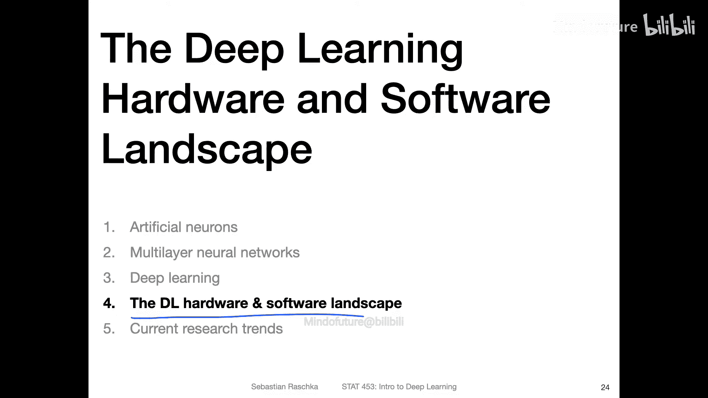
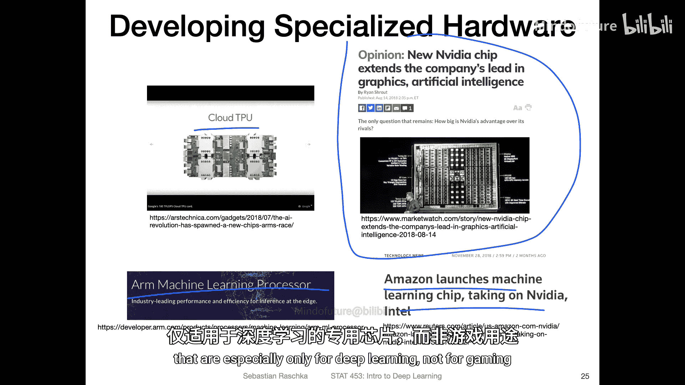
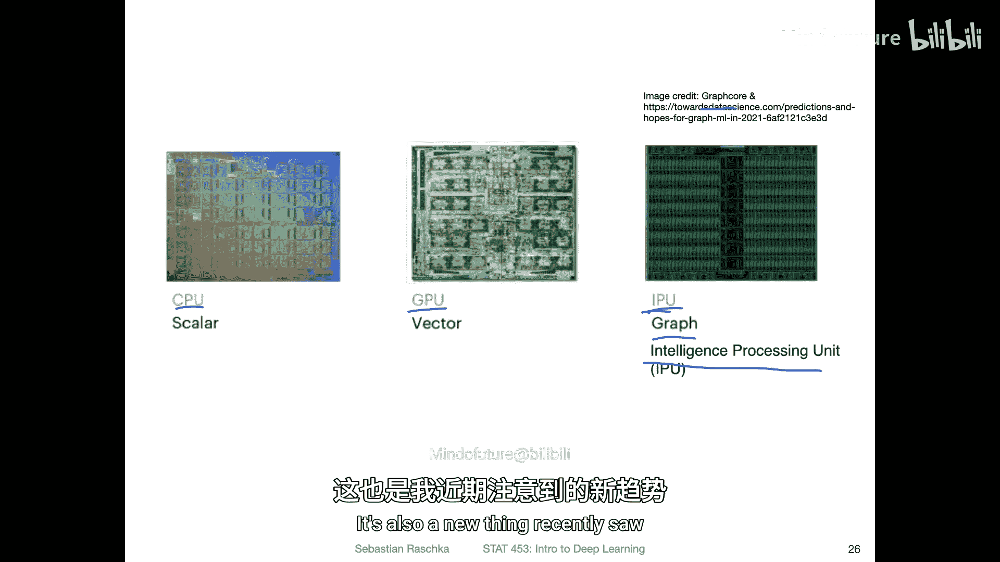
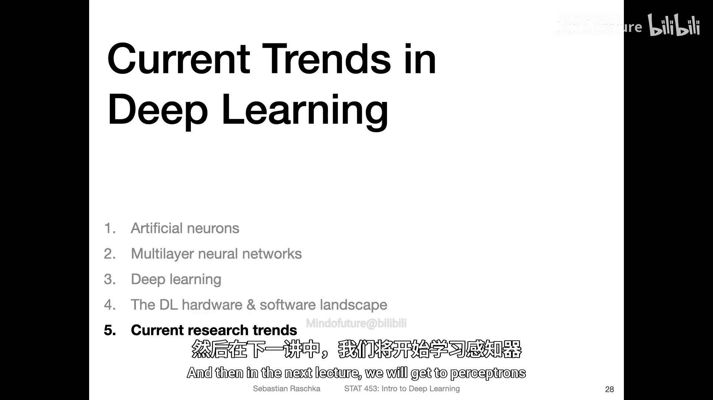

# 017：深度学习硬件与软件生态 🖥️

在本节课中，我们将简要概述深度学习领域的硬件与软件生态。了解这些背景知识有助于你理解当前技术发展的脉络和主流工具的选择。

## 硬件生态概览

上一节我们介绍了深度学习的基本概念，本节中我们来看看支撑这些模型运行的硬件基础。深度学习对计算能力有极高要求，因此专用硬件的发展至关重要。

目前，深度学习任务主要依赖于图形处理器。

以下是当前主要的深度学习硬件类型：

*   **GPU**：由英伟达公司主导。GPU最初为游戏行业设计，但其并行计算能力非常适合深度学习中的矩阵运算。如今，英伟达也推出了专为深度学习设计的芯片。
*   **TPU**：谷歌公司开发的张量处理单元。这是一种专为特定任务优化的硬件，通常在谷歌云服务器上使用。单个TPU可能不如GPU强大，但其优势在于可以大规模集群使用。
*   **其他专用芯片**：包括基于ARM架构的机器学习处理器（例如新款MacBook中的芯片，更擅长预测而非训练），以及Graphcore公司推出的**IPU**。IPU专为处理图结构数据设计，在图神经网络任务中表现出色。

总而言之，GPU目前仍是深度学习硬件的绝对主流，但面向AI计算优化的各类专用芯片正在不断涌现。

## 软件生态发展

了解硬件之后，我们转向软件层面。深度学习框架的演变历史丰富，它们让研究者能够更高效地构建和训练模型。

下图展示了主要深度学习框架的发展历程：

以下是几个关键发展阶段和框架的简要说明：

*   **早期阶段**：在2015年之前，Theano是主流的研究框架。为了降低使用门槛，出现了Lasagna和Keras等高级封装库。
*   **TensorFlow时代**：2015年，谷歌推出TensorFlow并逐渐成为主流。Keras后被整合为TensorFlow的高级API。TensorFlow 2.0版本引入了即时执行模式，使其更易用。
*   **PyTorch的崛起**：PyTorch因其动态计算图和直观的接口受到研究人员青睐。它后来整合了专注于部署的Caffe2，并增加了图模式以提升性能，现已兼顾研究与生产部署。
*   **新兴框架**：谷歌内部开发的JAX是一个较新的底层库，支持自动微分和GPU加速，但生态和功能完备性尚不及PyTorch。

目前，PyTorch因其易用性、活跃的社区和全面的功能，已成为学术界和工业界广泛使用的成熟框架，尤其适合初学者入门。

## 总结

本节课中我们一起学习了深度学习的硬件与软件生态。我们了解到GPU是当前训练模型的核心硬件，同时TPU、IPU等专用芯片也在不断发展。在软件方面，我们回顾了从Theano、TensorFlow到PyTorch的框架演进史，并认识到PyTorch因其出色的设计已成为当下的主流选择。理解这个生态背景，将帮助你在未来的学习和项目中做出更合适的技术选型。