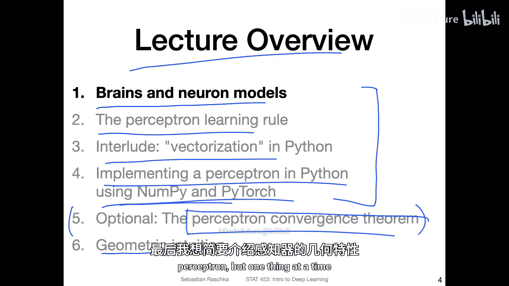
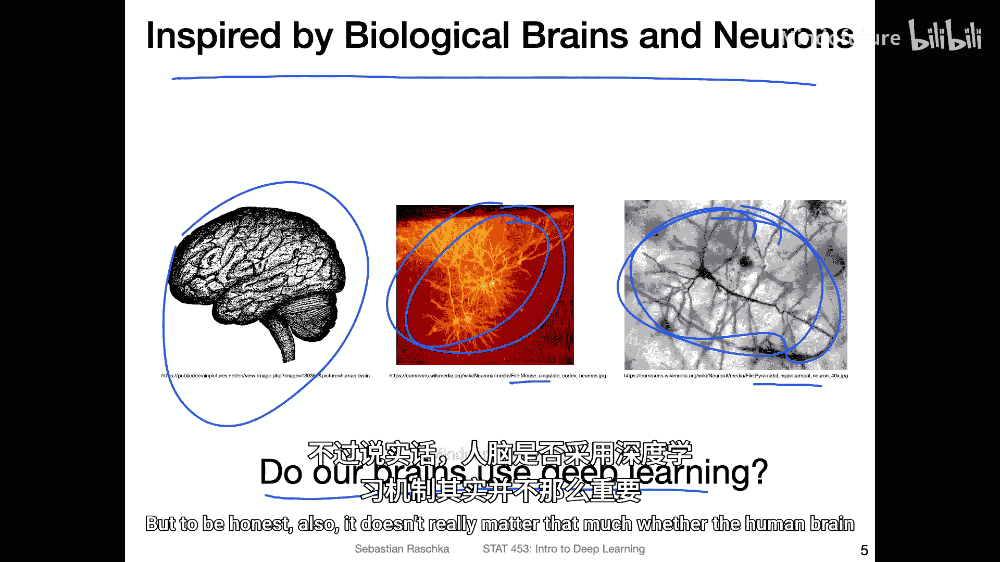
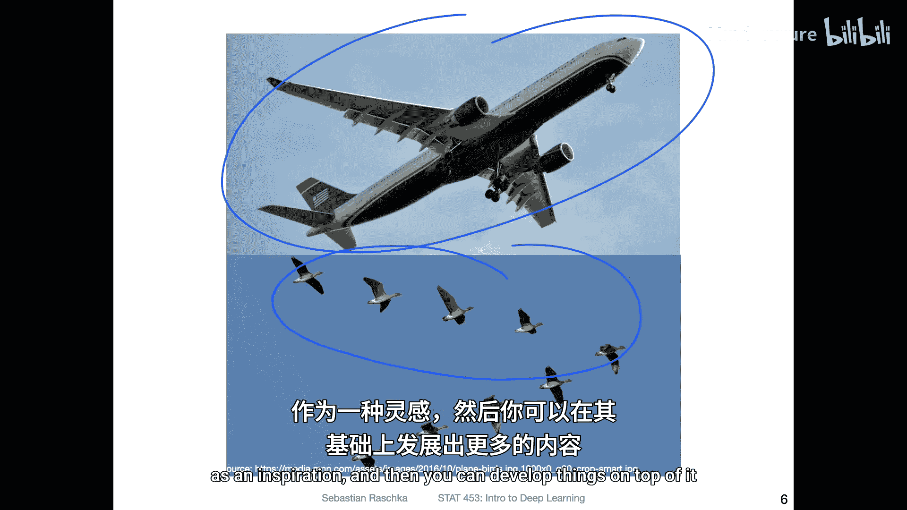
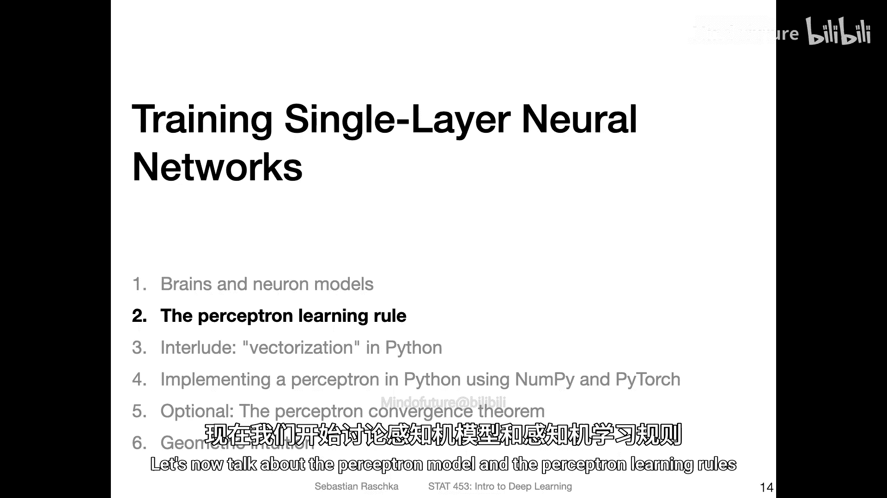

# 020：关于大脑与神经元 🧠

在本节课中，我们将学习深度学习的生物学灵感来源，并介绍最早的神经元数学模型。我们将从大脑和神经元的基本概念开始，然后探讨感知机模型及其学习规则。

## 大脑与神经模型

上一节我们回顾了深度学习的历史，了解到其灵感来源于生物大脑和神经元的工作原理。本节中，我们来看看大脑和神经元的基本结构。

上图展示了一个大脑的图片，以及放大的神经元结构。这张图来自维基百科，展示的是小鼠海马体中的一种特定神经元——锥体神经元。大脑中有许多不同类型的神经元，这只是其中一种。

一个常见的问题是：我们的大脑是否真的在使用深度学习算法？目前我们无法完全确定，因为人类大脑的工作机制仍有许多未解之谜。然而，我们可以有把握地说，大脑的运行方式可能与深度学习不同。深度学习在物体检测等特定任务上表现良好，但人类大脑的能力与神经网络仍有很大差异，我们尚未实现通用人工智能。

回顾上一讲提到的由Lily Krepp和Geoffrey Hinton等人发表的论文，其核心观点是大脑可能使用一种与反向传播相关的算法，但这仍未完全明确。不过，大脑是否进行深度学习并不那么重要，因为深度学习本身对于某些我们关心的任务（如图像中的物体分类）已经相当高效。

这类似于飞机与鸟类的类比。飞机的设计灵感来源于鸟类飞行，但飞机并不需要完全模仿鸟类拍打翅膀的动作。有时，从某事物中获得灵感，并在此基础上发展出不同的、更高效的技术就足够了。

出于兴趣，我们查阅了维基百科上关于神经元数量的数据。人脑大约有160亿到340亿个神经元，而虎鲸则有430亿个。如果仅凭神经元数量，虎鲸似乎应该更“聪明”，但事实并非如此。同样，在深度学习历史讲座中提到的大型语言模型（如GPT-3），其参数量可能达到1700亿或8000亿。如果将一个参数类比为一个神经元，这些模型在计算规模上甚至超过了人脑。然而，这些模型虽然在记忆信息方面表现出色，但在理解能力上仍远不及人类。这表明，智能不仅仅取决于参数数量，还有其他尚未被发现的因素。

在本讲座中，我们实际上并不讨论庞大的神经网络，而是从简单的单层神经网络或单个神经元模型开始。

## 生物神经元与数学模型

现在，我们来具体看看生物神经元及其最早的数学模型。

一个神经元是一个神经细胞。它包含细胞核（处理中心）、树突（接收其他神经元信号的部位）和轴突（传输信号的部位）。信号从树突传入，在细胞核处进行整合处理，如果神经元被激活，信号则通过轴突末梢传递到其他神经元的树突。

最早的数学模型是McCulloch-Pitts模型。其结构大致如下：有多个输入（x），每个输入对应一个权重（w）。信号在“细胞核”处进行加权求和，这个加权和通常被称为**净输入**或**预激活值**，在数学上常用字母 **z** 表示。

**公式：** `z = w1*x1 + w2*x2 + ... + wm*xm`

然后，这个 **z** 值被送入一个**阈值函数**。如果 **z** 超过某个阈值，神经元就输出1（表示激活）；否则输出0（表示未激活）。

## 逻辑门实现示例

使用McCulloch-Pitts神经元模型可以实现基本的逻辑门功能。以下是两个例子：

**与门 (AND Gate):**
*   **设置：** 权重 w1 = 1, w2 = 1，阈值 = 1.5。
*   **计算：** z = x1*1 + x2*1。
*   **规则：** 仅当 x1 和 x2 同时为1时，z = 2 > 1.5，输出1；其他情况输出0。

**或门 (OR Gate):**
*   **设置：** 权重 w1 = 1, w2 = 1，阈值 = 0.5。
*   **计算：** z = x1*1 + x2*1。
*   **规则：** 只要 x1 或 x2 中有一个为1，z >= 1 > 0.5，输出1；仅当两者都为0时输出0。

你还可以尝试实现非门（NOT Gate）。此外，作为一个课后练习，请思考：**能否找到一组权重和阈值，让这个简单的McCulloch-Pitts神经元模型实现异或门（XOR Gate）的功能？** 你可以稍后在课程论坛上分享和讨论你的答案。

## 过渡到感知机

以上是对McCulloch-Pitts模型的简要回顾。接下来，我们将进入更核心的内容：**感知机模型及其学习规则**。

## 总结

本节课中，我们一起学习了：
1.  深度学习的灵感来源于生物大脑，但两者的工作机制并不完全相同。
2.  介绍了生物神经元的基本结构：细胞核、树突和轴突。
3.  学习了最早的神经元数学模型——McCulloch-Pitts模型，它通过加权求和与阈值函数来模拟神经元的激活。
4.  了解了如何使用该模型实现基本的逻辑门（如与门、或门）。
5.  提出了一个思考题：如何用该模型实现异或门功能。

下一节，我们将详细探讨感知机学习规则，这是构建更复杂神经网络的重要基础。