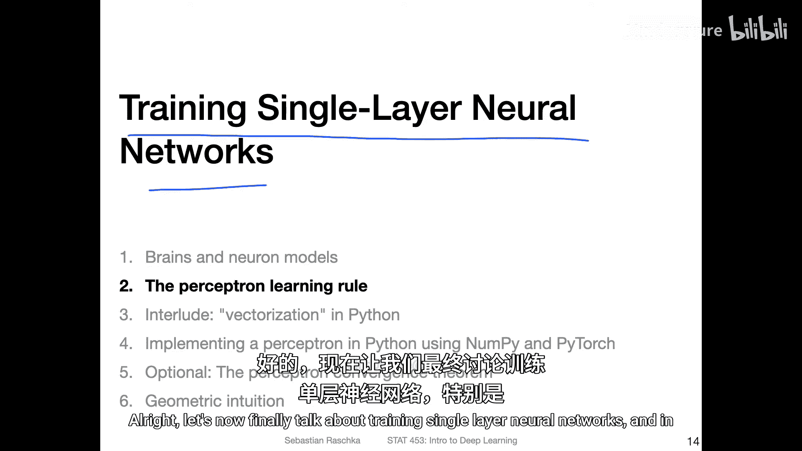
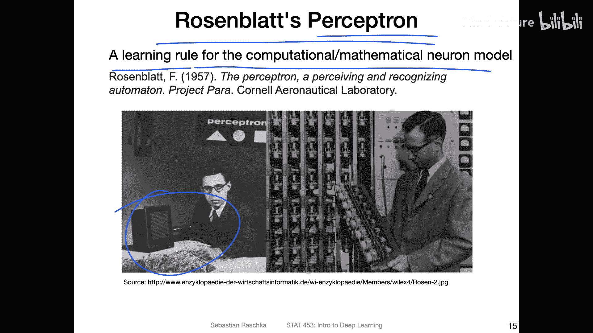
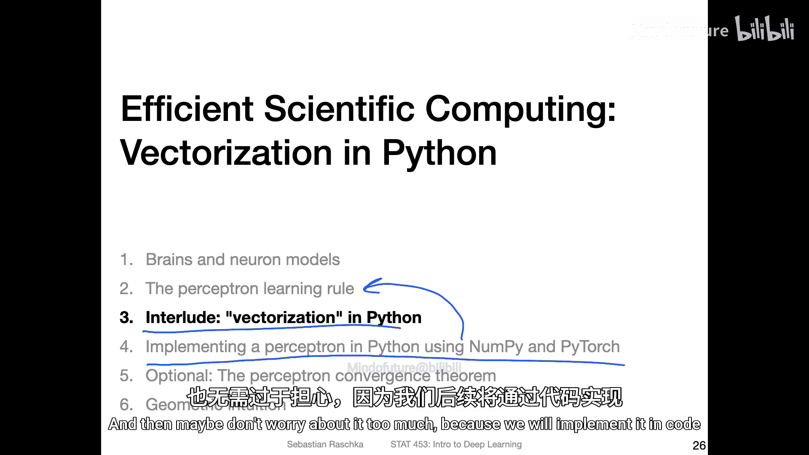

# 021：感知机学习规则 🧠

在本节课中，我们将学习如何训练单层神经网络，特别是**感知机学习规则**。感知机是深度学习发展史上的一个重要里程碑，它提供了一种自动寻找权重参数的方法，用于解决分类问题。我们将从感知机的基本模型开始，逐步理解其学习规则和更新过程。

---

## 感知机模型简介

上一节我们回顾了深度学习的历史，其中提到了罗森布拉特提出的感知机。感知机本质上是一种学习规则，用于自动寻找人工神经元模型中的权重参数。

感知机模型是对生物神经元的数学抽象。其核心思想是：给定一组输入特征，通过计算加权和（即净输入），再通过一个阈值函数输出分类结果（例如0或1）。

以下是感知机的基本计算流程：

1.  **计算净输入**：将输入特征与对应的权重相乘并求和，再加上一个偏置项。
    *   公式：`z = w1*x1 + w2*x2 + ... + wm*xm + b`
    *   其中，`z` 代表净输入，`w` 代表权重，`x` 代表输入特征，`b` 代表偏置（可视为负的阈值 `-θ`）。
2.  **应用阈值函数**：根据净输入 `z` 的值，输出最终的类别标签。
    *   如果 `z > 0`，则输出 `y_hat = 1`。
    *   如果 `z <= 0`，则输出 `y_hat = 0`。

这种将阈值 `θ` 转化为偏置 `b` 的表示方法，是现代神经网络中常见的写法，它使得模型的参数化表示和后续的权重更新更加方便。

---

## 感知机学习规则

理解了感知机如何做出预测后，本节我们来看看它如何**学习**，即如何自动调整权重 `w` 和偏置 `b`。

感知机学习规则是一个迭代过程，它要求数据是**线性可分**的。这意味着存在一条直线（在二维空间中）或一个超平面（在高维空间中），能够完美地将两类数据点分开。

感知机的学习过程遵循一个简单的原则：**仅在预测错误时更新权重**。其权重更新规则可以总结为以下三种情况：

以下是感知机权重更新的三种情况：

*   **预测正确**：如果预测标签 `y_hat` 等于真实标签 `y`，则权重保持不变。
*   **预测为0，真实为1**：这意味着净输入 `z` 太小（<=0），导致模型过于“保守”。为了纠正这个错误，我们需要**增加**净输入。做法是将输入向量 `x` **加到**当前的权重向量 `w` 上。
    *   更新公式：`w_new = w_old + x`
*   **预测为1，真实为0**：这意味着净输入 `z` 太大（>0），导致模型过于“激进”。为了纠正这个错误，我们需要**减少**净输入。做法是将输入向量 `x` **从**当前的权重向量 `w` 中**减去**。
    *   更新公式：`w_new = w_old - x`

我们可以将上述规则统一写成一个紧凑的数学公式。假设对于第 `i` 个训练样本 `(x_i, y_i)`：

1.  计算预测值：`y_hat = step_function(w · x_i + b)`，其中 `step_function` 是阶跃函数。
2.  计算误差：`error = y_i - y_hat`。误差值只能是 -1， 0， 或 1。
3.  更新权重：`w_new = w_old + error * x_i`， `b_new = b_old + error`。

这个公式完美地涵盖了上述三种情况：当 `error=0` 时不更新；当 `error=1` 时执行加法；当 `error=-1` 时执行减法。

---

## 算法流程与收敛性

感知机学习算法遵循一个标准的迭代流程。它逐个检查训练样本，并根据上述规则决定是否更新权重。

以下是感知机学习算法的具体步骤：

1.  **初始化**：将所有权重 `w` 和偏置 `b` 初始化为0（或小的随机数）。
2.  **迭代训练**：
    *   对数据集进行多次完整遍历，每次遍历称为一个**周期**。
    *   在每个周期内，遍历数据集中的每一个训练样本 `(x_i, y_i)`。
    *   对于每个样本，执行预测、计算误差、并根据误差更新权重。
3.  **停止条件**：当在一个完整的周期内，所有样本都被正确分类（即没有权重再被更新）时，算法收敛并停止。

**重要提示**：感知机收敛定理保证，**如果训练数据是线性可分的**，那么感知机算法一定会在有限步内收敛，找到一个能够完美分类所有训练样本的决策边界。然而，如果数据不是线性可分的，感知机将无法收敛，权重会持续振荡。这是经典感知机的一个主要局限性，我们将在后续课程中学习更强大的算法（如逻辑回归、支持向量机）来解决这个问题。

---

## 总结

本节课中，我们一起学习了单层神经网络的核心——**感知机**。我们首先了解了感知机作为生物神经元数学模型的基本结构，包括净输入的计算和阈值函数的应用。接着，我们深入探讨了**感知机学习规则**，理解了它如何通过“犯错即修正”的原则来更新权重，并掌握了其统一的数学更新公式。最后，我们回顾了感知机的完整算法流程，并明确了其收敛的前提条件（线性可分性）和主要局限。

感知机虽然简单，但它奠定了神经网络学习算法的基础。理解感知机的工作机制，是迈向理解更复杂深度学习模型的重要一步。在接下来的课程中，我们将用代码实现感知机，并直观地观察其学习过程。