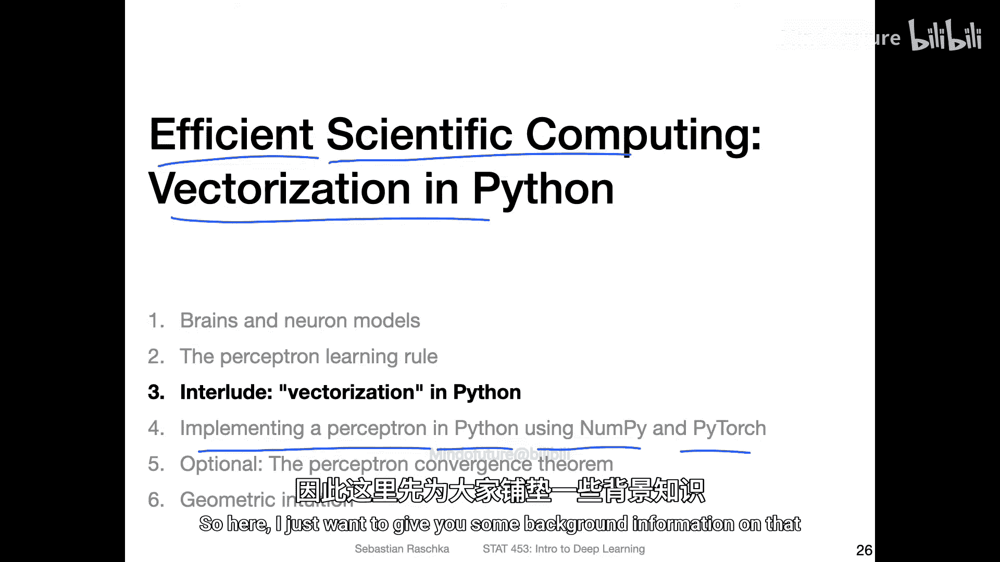
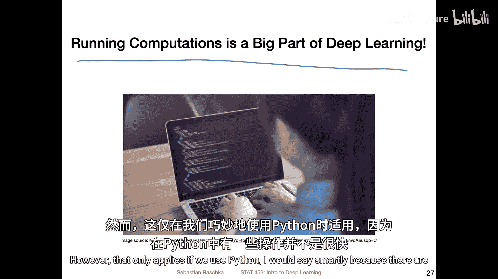
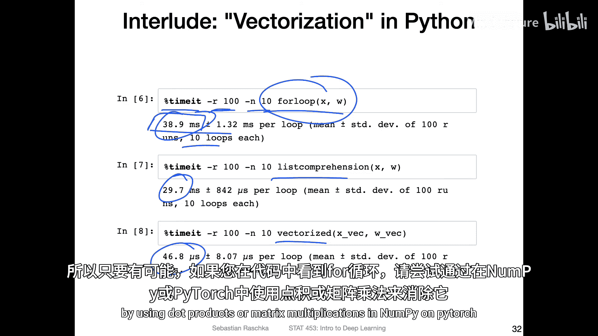
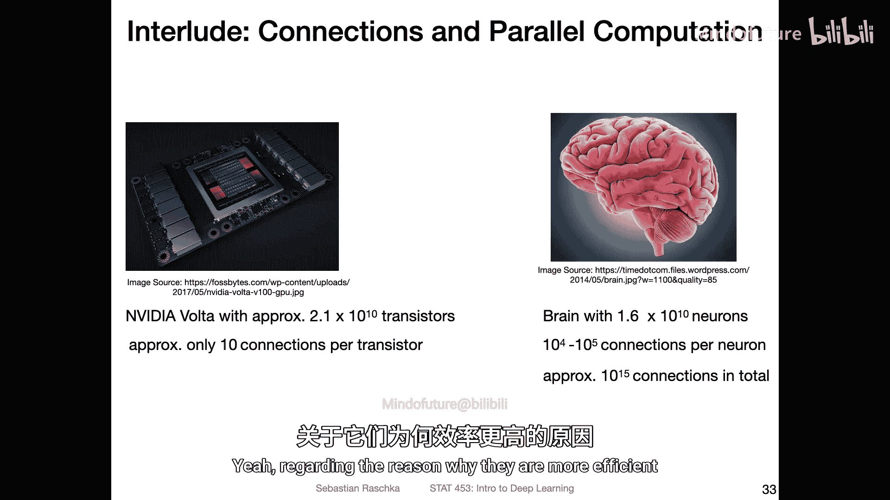
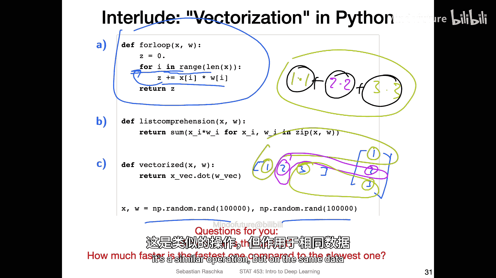
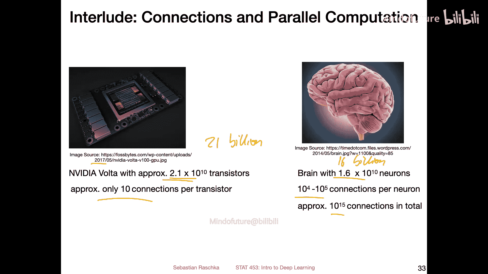
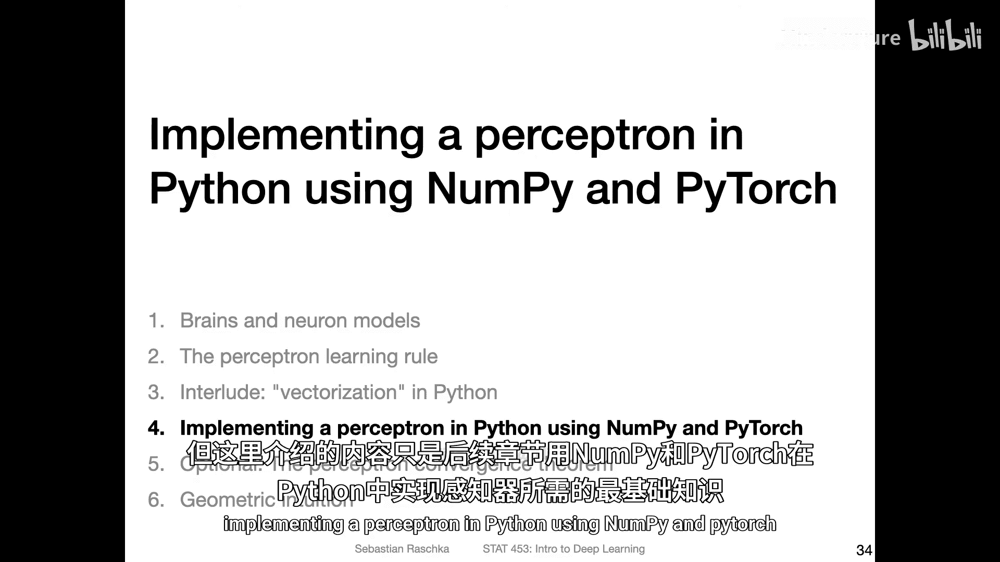

# 022：Python中的向量化 🚀



在本节课中，我们将学习一个在科学计算中提升效率的重要概念：**向量化**。我们将了解为什么在深度学习中应避免使用Python原生循环，以及如何利用NumPy和PyTorch等库进行高效的向量化计算。

## 概述

在深度学习中，大量的计算是核心任务。虽然Python本身并非以速度著称，但通过使用高效的底层库（如NumPy和PyTorch），我们可以绕过其性能瓶颈。向量化是实现这一目标的关键技术，它允许我们利用现代CPU和GPU的并行计算能力，从而大幅提升代码执行速度。



## 向量化的重要性

上一节我们介绍了感知机的基本概念。本节中，我们来看看如何高效地计算感知机的净输入（加权和）。我们将对比几种不同的实现方式，并理解为何向量化方法在性能上具有压倒性优势。

### 计算净输入的几种方法

以下是计算感知机净输入 `z` 的几种常见方法，其中 `x` 是输入向量，`w` 是权重向量（包含偏置项 `w0`）。

**1. 使用For循环**
这是最直观的方法，但效率最低。
```python
z = 0
for i in range(len(x)):
    z += x[i] * w[i]
```

**2. 使用生成器表达式或列表推导式**
这种方法比for循环稍快，语法更紧凑。
```python
z = sum(x_i * w_i for x_i, w_i in zip(x, w))
```

**3. 使用NumPy进行向量化计算**
这是最高效的方法，利用了底层的优化线性代数运算。
```python
import numpy as np
z = np.dot(x, w)  # 或 x @ w
```

### 性能对比

为了直观展示不同方法的性能差异，我们使用 `timeit` 模块对上述三种方法进行计时测试（假设 `x` 和 `w` 是大型向量）。以下是典型结果：

*   **For循环**：约 40 毫秒
*   **生成器表达式**：约 30 毫秒
*   **NumPy向量化**：约 40 **微秒**

可以看到，向量化实现比for循环快了近**1000倍**。这正是深度学习代码中极力避免显式循环的原因。

## 为什么向量化如此高效？



上一节我们看到了性能的巨大差异，本节我们来探讨其背后的原理。关键在于**并行计算**。

*   **For循环（串行计算）**：代码按顺序依次计算每一对 `x[i] * w[i]` 的乘积，然后累加。CPU必须等待前一个计算完成才能开始下一个。
*   **向量化点积（并行计算）**：像 `np.dot(x, w)` 这样的操作，可以分解为多个独立的乘法任务（`x[0]*w[0]`, `x[1]*w[1]`, ...）。现代CPU的SIMD（单指令多数据）指令集和GPU的大量核心可以**同时**执行所有这些乘法运算，最后再将结果求和。这极大地利用了硬件潜力。



这种并行能力使得GPU特别擅长处理大规模的矩阵和向量运算，这也是深度学习严重依赖GPU加速的原因。

## 与硬件架构的类比



一个有趣的对比是GPU与人脑。以2017年的某款GPU为例，它拥有约210亿个晶体管，而人脑约有160亿个神经元。从数量上看，GPU的“基础单元”更多。然而，人脑的每个神经元平均有1万到10万个连接（突触），而一个晶体管通常只有约10个连接。人脑总计拥有约100万亿个连接。这种极高的连接复杂度，可能是生物智能在能效和某些认知任务上远超当前人工智能的原因之一。但这从另一个角度说明了，通过向量化和并行化（模仿某种程度上的“同时处理”），我们可以让计算机更高效地运行神经网络。

## 总结

本节课中我们一起学习了Python中的**向量化**技术。我们了解到：
1.  在深度学习中，应尽量避免使用Python原生的 `for` 循环进行计算。
2.  使用NumPy、PyTorch等库的向量化操作（如点积、矩阵乘法）可以带来数百至数千倍的性能提升。
3.  性能提升的核心在于向量化操作能够底层实现**并行计算**，充分利用现代CPU和GPU的硬件优势。
4.  在接下来的课程中，我们将使用向量化方法来实现感知机算法，这是编写高效深度学习代码的基础。





掌握向量化思维，是迈向高效深度学习编程的关键一步。