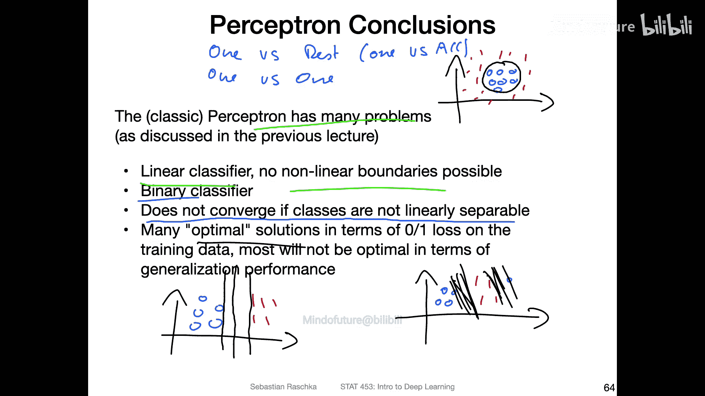
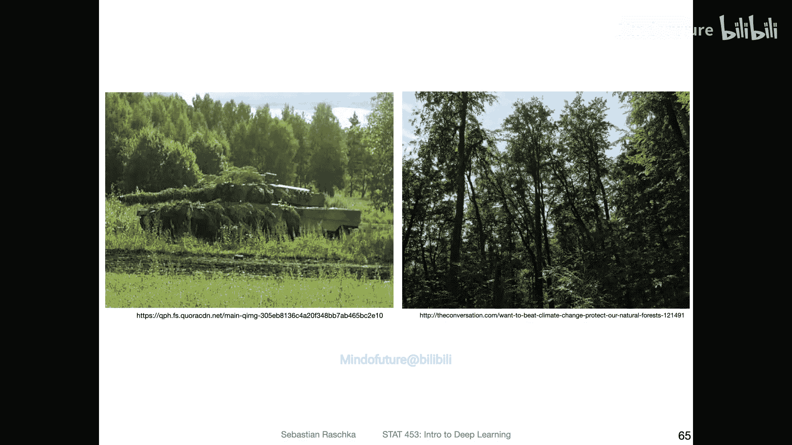
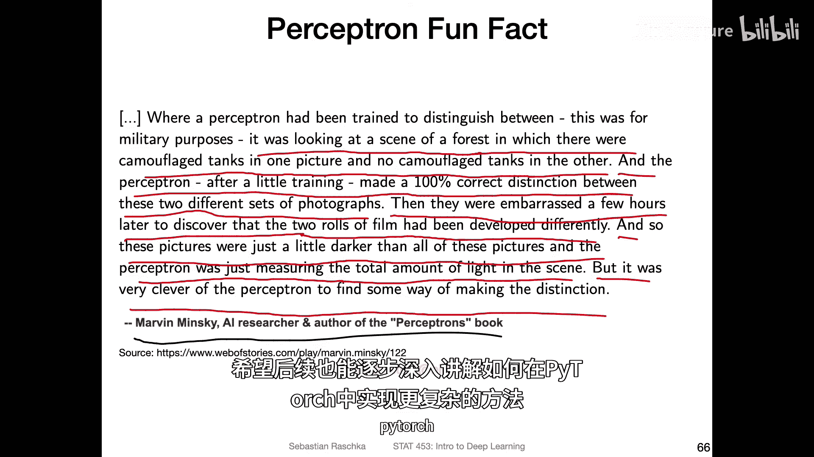
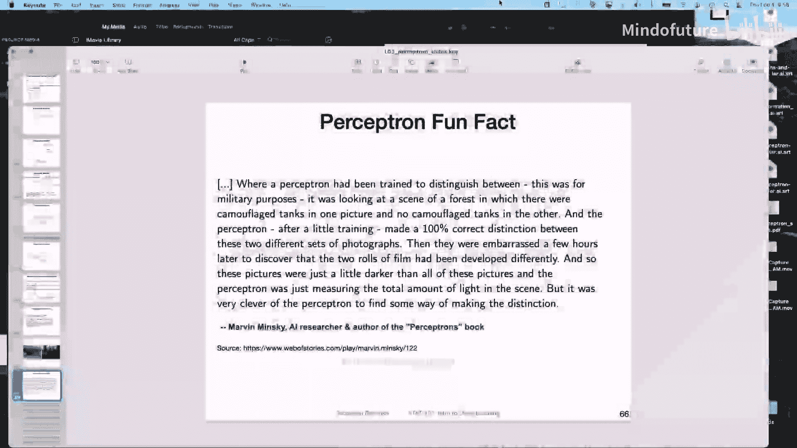

# 024：感知机背后的几何直觉 🧠

在本节课中，我们将探讨感知机学习算法背后的几何原理。理解这些原理有助于我们明白为什么一个看似简单的规则能够有效工作。

---

## 感知机算法回顾

上一节我们介绍了感知机的基本概念，本节中我们来看看其背后的几何直觉。首先，我们快速回顾一下感知机学习算法。

感知机算法的核心步骤如下：
1.  初始化权重向量（例如，全零或小随机数）。
2.  遍历每个训练样本。
3.  计算预测值。
4.  如果预测错误，则更新权重。

具体更新规则如下：
*   **场景A**：当预测为0，但真实标签为1时，我们将输入向量**加**到权重向量上。
    *   `w = w + x`
*   **场景B**：当预测为1，但真实标签为0时，我们将输入向量**减**去。
    *   `w = w - x`

一个关键问题是：为什么通过加上或减去输入向量就能修正决策边界？接下来我们将从几何角度进行解释。

---

## 权重向量与决策边界的关系

为了理解感知机的工作原理，我们需要先了解权重向量与决策边界在空间中的几何关系。

想象一个二维空间中有两类数据点（类别0和类别1）。决策边界是一条直线（在高维空间中是超平面），用于分隔这两类数据。

一个重要的几何事实是：**权重向量与决策边界垂直**（即呈90度角）。原因如下：

感知机的决策基于净输入 `z`（忽略偏置项）：
`z = w · x = |w| * |x| * cos(θ)`

其中，`θ` 是权重向量 `w` 和输入向量 `x` 之间的夹角。我们的分类规则是：
*   如果 `z > 0`，则预测为类别1。
*   如果 `z <= 0`，则预测为类别0。

决策边界正是由 `z = 0` 的点构成。要使点积为零，在向量长度不为零的情况下，必须满足 `cos(θ) = 0`。而 `cos(θ) = 0` 意味着夹角 `θ` 为90度。因此，在决策边界上的点，其输入向量与权重向量的夹角为90度。

---

## 夹角与分类正确性

理解了90度角的意义后，我们可以进一步分析分类的正确与否。

*   **正确分类（类别1）**：对于属于类别1的样本，我们希望 `z > 0`。根据公式 `z = |w|*|x|*cos(θ)`，这要求 `cos(θ) > 0`，即夹角 `θ` **小于90度**。因此，所有被正确分类为类别1的样本，其输入向量都位于与权重向量夹角小于90度的一侧。
*   **错误分类**：反之，如果一个类别1的样本被错误分类为0，则意味着 `z <= 0`，即 `cos(θ) <= 0`，夹角 `θ` **大于或等于90度**。此时，样本点落在了决策边界的“错误”一侧。

---

## 权重更新如何修正错误

现在，我们来看感知机如何通过更新权重来纠正错误。以**场景A**（预测0，真实1）为例：

1.  **错误状态**：当前权重向量 `w` 与输入向量 `x` 的夹角大于90度，导致 `z <= 0`，做出了错误预测。
2.  **更新操作**：算法执行 `w_new = w_old + x`。
3.  **几何效果**：在向量加法中，将输入向量 `x` 加到旧的权重向量 `w_old` 上，得到的新权重向量 `w_new` 会向 `x` 的方向旋转。
4.  **结果**：`w_new` 与 `x` 之间的夹角会**减小**（变得小于90度）。当下次遇到相同或相似的输入 `x` 时，计算出的 `z` 将大于0，从而做出正确的预测（类别1）。

这个过程直观地“拉动”决策边界，使其更靠近被误分类的样本点，从而在下一次将其划分到正确的一侧。对于**场景B**，减去输入向量的操作具有相反的效果，同样是为了减小夹角，修正决策边界。

---

## 感知机的局限性

尽管感知机有其理论基础和几何美感，但它存在几个显著的局限性，这也是其在复杂问题上被更高级算法取代的原因。

以下是感知机的主要缺点：

1.  **线性分类器**：感知机只能学习线性的决策边界。它无法解决非线性可分问题，例如经典的“异或”问题或同心圆分布的数据。
2.  **二元分类**：单个感知机只能进行二分类。虽然可以通过组合多个感知机（如一对其余、一对一策略）实现多类分类，但这增加了复杂性。
3.  **数据需线性可分**：感知机收敛定理要求训练数据必须是**线性可分**的。如果数据不是线性可分的，算法将无法收敛，权重会持续振荡，无法得到一个稳定的模型。
4.  **解不唯一**：即使对于线性可分的数据，感知机也可能找到多个可行的决策边界。最终的解依赖于权重的初始值和训练样本的顺序，而它无法找到“最优”或“最具泛化能力”的那个边界（如最大间隔边界）。

---

## 一个有趣的历史案例

感知机的局限性在历史上一个著名的实验中暴露无遗。研究人员曾尝试用感知机从照片中识别坦克。

*   **实验设置**：一组照片有坦克，另一组没有（仅为森林）。
*   **结果**：感知机经过训练后，达到了100%的准确率。
*   **问题发现**：后来他们尴尬地发现，所有有坦克的照片都是在晴天拍摄的（较亮），而所有没有坦克的照片都是在阴天拍摄的（较暗）。
*   **结论**：感知机并没有学会识别坦克，而是简单地学会了区分照片的**整体亮度**。它只是计算了像素的平均亮度，亮度高则判为有坦克，亮度低则判为无坦克。

这个案例生动地说明了，如果特征处理不当或数据存在隐含偏差，即使一个简单的模型也能“完美”拟合数据，但其学到的规律毫无实际意义，泛化能力极差。

---

## 总结

本节课中我们一起学习了感知机背后的几何直觉：
*   感知机的权重向量与决策边界垂直。
*   分类的正确性取决于输入向量与权重向量之间的夹角是否小于90度。
*   通过向权重向量加上或减去误分类样本的输入向量，可以调整该夹角，从而修正决策边界。
*   感知机虽然简单有效，但受限于其线性本质，无法处理非线性问题，且要求数据线性可分。

理解这些原理为我们后续学习更强大的非线性模型（如神经网络）奠定了基础。下一周，我们将介绍一些必要的线性代数基础，并开始使用PyTorch实现更复杂的方法。