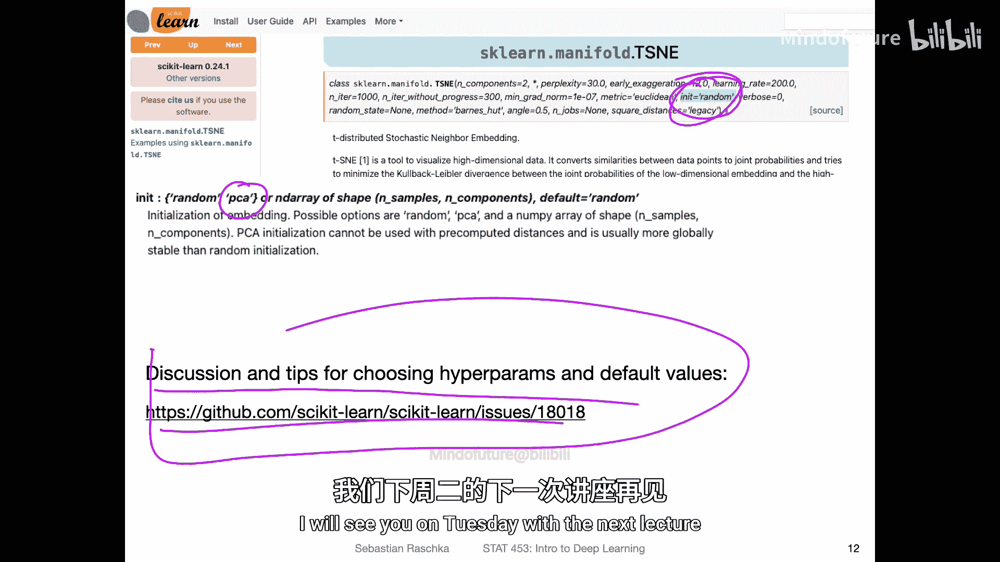

# 025：深度学习新闻 #2


在本节课中，我们将回顾2021年2月初深度学习与人工智能领域的一些重要新闻和研究进展。我们将探讨自动化论文评审、新型生成模型、零样本学习、编程语言趋势、机器人学习以及数据可视化技术等多个主题。

---

## 自动化AI论文评审的探索

上一节我们介绍了本周的新闻概览，本节中我们来看看一项关于自动化AI论文评审的研究。这项研究旨在解决顶级学术会议（如ICML和NeurIPS）面临的评审挑战。这些会议每年收到约10,000篇论文投稿，确保高质量评审变得非常困难。

研究人员探索使用AI（特别是基于BERT和BART的模型）来辅助论文评审流程。BART是一个去噪自编码器，属于序列到序列模型。这类模型的输入和输出都是序列，例如在机器翻译中，将一种语言的句子（序列）转换为另一种语言的句子（序列）。

以下是该研究提出的一些优秀评审应具备的品质，这些也可作为我们课程项目同行评审的参考标准：
*   **决断性**：评审意见应明确。
*   **全面性**：评审应涵盖论文的各个方面。
*   **论证性**：观点需要有依据支撑。
*   **准确性**：评价应准确无误。
*   **友善性**：评审态度应友好、建设性。

该方法的流程大致如下：首先由人类标注员为论文打上各种标签（如动机、实质内容等），然后训练一个模型来自动生成这些标签，最后再进行后处理并由人类评估结果。虽然完全用AI做出录用决定可能为时过早，但这项工作在自然语言理解方面展现了深度学习的进展。

---

## 生成模型DALL·E与CLIP

上一节我们讨论了AI在文本分析中的应用，本节中我们来看看其在多模态（图像与文本）生成和理解方面的突破。一个名为DALL·E的模型引起了广泛关注，它能够根据文本描述生成全新的图像。

DALL·E基于一个拥有120亿参数的GPT-3模型进行训练。其核心思想是让模型学习图像及其文本描述之间的关系。例如，当输入“用意大利面做的夜晚”时，模型能够生成融合了“夜晚”和“意大利面”概念的新图像。这些图像是模型合成出来的，在现实中并不存在。

虽然DALL·E的论文和代码尚未公开，但其一个重要组成部分——CLIP模型已经可用。CLIP代表**对比语言-图像预训练**，它采用了一种“零样本学习”的方法。

**零样本学习**是指模型能够识别它在训练阶段从未见过的类别。这比**小样本学习**更具挑战性。在小样本学习中，每个类别可能有几个（例如5个）示例，而在零样本学习中，示例数量为零。

CLIP通过**多模态学习**和**自然语言监督**来实现这一点。它在训练时同时使用图像和文本数据。模型学会将图像和正确的文本描述关联起来。在预测时，对于一张新图像，模型会计算其与一系列文本描述（如“一张狗的照片”、“一张汽车的照片”）的匹配度，并选择匹配度最高的描述作为预测类别。这使得CLIP能够在未经专门训练的数据集上也能取得良好性能，展示了强大的泛化能力。

---

## 开源大型语言模型与编程语言趋势

上一节我们介绍了需要巨大计算资源的尖端模型，本节中我们来看看让这些技术更易获取的努力以及行业工具趋势。由于训练GPT-3这类超大规模模型的成本极高（可能高达数百万美元），普通研究者难以触及。

为此，出现了一项旨在训练并开源GPT-3规模模型的项目。他们计划使用一个名为“The Pile”的825GB数据集进行训练，并免费向公众开放。这有助于促进更广泛的研究和创新。

另一方面，从O‘Reilly基于其平台搜索和资源使用情况的分析来看，**Python**在编程语言中的领先地位依然稳固且持续增长。这对于深度学习领域的学习者和从业者来说是一个明确的信号。相比之下，曾一度被看好的Scala语言热度则有所下降。这提醒我们，在追求前沿技术与高效产出之间需要找到平衡。

---

## 基于视觉演示的机器人学习

上一节我们关注了软件和算法，本节中我们来看看AI在物理世界中的应用——机器人学习。训练机器人执行任务通常采用**强化学习**，即智能体通过试错来学习。另一种方法是**逆强化学习**，即通过观察示范来学习。

Facebook AI Research提出了一种新方法：**基于模型的视觉演示逆强化学习**。传统方法需要在虚拟环境中模拟示范行为，而新方法允许机器人直接通过观看人类执行任务的视频（视觉演示）来学习。例如，通过观看人类抓取并移动瓶子的视频，机器人能够学习并模仿这一行为。这种方法降低了对复杂模拟环境的需求，使机器人学习更加灵活。

---

## 数据可视化技术t-SNE及其改进

在课程的最后，我们转向一个非常实用的工具——数据可视化。当我们处理像MNIST手写数字数据集这样的高维数据时（每个图像有28x28=784个像素），很难直接观察其结构。**t-SNE**是一种流行的非线性降维技术，能将高维数据映射到二维或三维空间，同时尽可能保持数据点之间的原始关系。

以下是t-SNE将MNIST数据降至2维后的可视化结果，可以看到相同数字的样本聚集在一起：
```python
# 示例：使用scikit-learn进行t-SNE降维
from sklearn.manifold import TSNE
tsne = TSNE(n_components=2, random_state=42, init='pca') # 使用PCA初始化
X_reduced = tsne.fit_transform(X_high_dimensional)
```

与线性方法（如**主成分分析PCA**）不同，t-SNE能够捕捉复杂的非线性结构。然而，t-SNE的效果对超参数（如初始化方式）比较敏感。最近的研究指出，使用**PCA初始化**而非默认的随机初始化，能显著提升t-SNE在保持全局数据结构方面的性能。此外，另一种称为UMAP的方法也日益流行，有时能提供更好的效果。在实践中，t-SNE不仅用于可视化原始数据，也常用于分析深度神经网络中间层的表征，以理解网络学到了什么。

---

## 总结



本节课中我们一起回顾了多篇深度学习领域的新闻与研究。我们探讨了使用AI辅助学术评审的潜力，了解了DALL·E和CLIP模型在图像生成与零样本理解方面的突破，看到了开源大型模型的努力和Python的持续主导地位，介绍了机器人通过观看视频学习的新方法，并深入了解了t-SNE数据可视化技术及其使用技巧。这些进展共同描绘了深度学习领域快速发展和多元应用的生动图景。