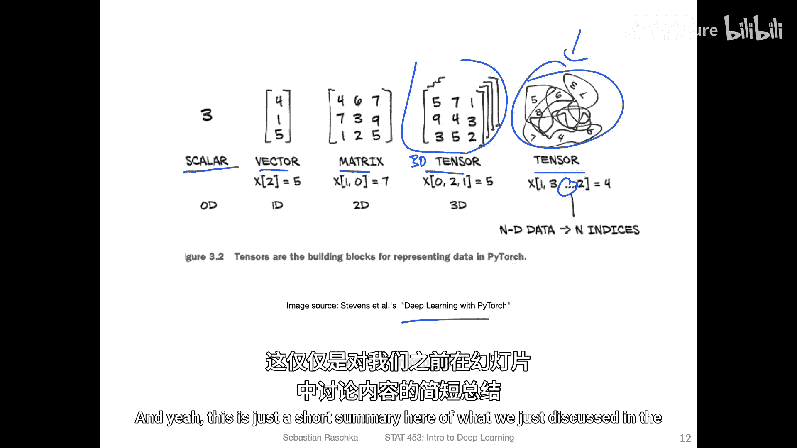
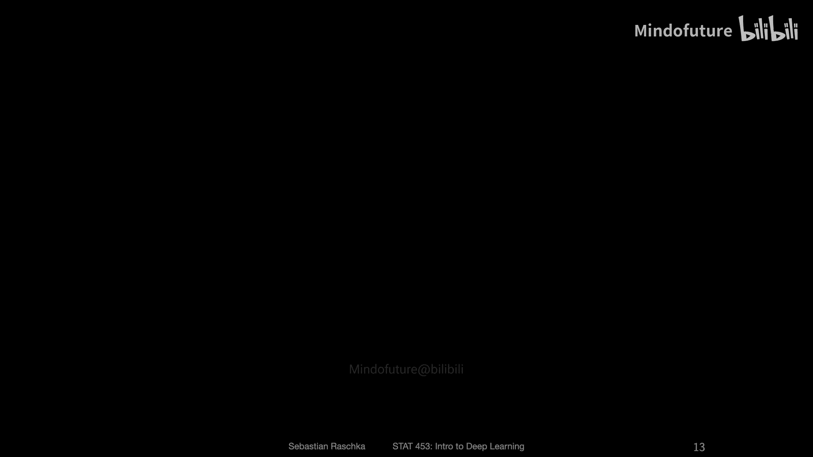
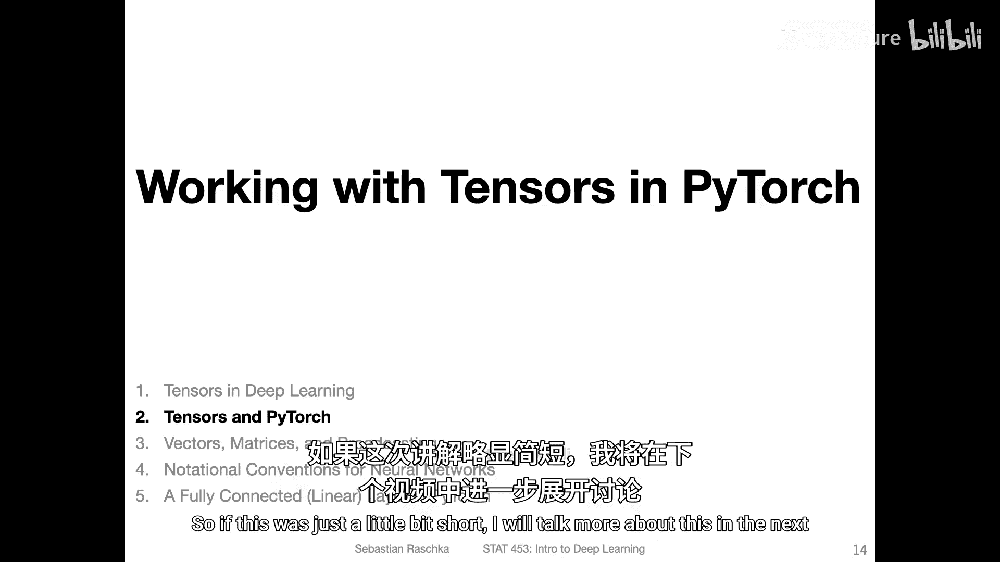

# 027：深度学习中的张量 🧮

在本节课中，我们将学习深度学习的核心数据结构——张量。我们将从数学概念出发，理解其定义，并探讨其在深度学习框架（如PyTorch）中的具体实现和应用。

## 张量的定义

上一节我们介绍了课程背景，本节中我们来看看什么是张量。张量是向量、矩阵和标量等概念的泛化。

*   **标量** 是一个单一的数字，例如 `1.23`。在深度学习中，我们通常处理实数，但类别标签可能是整数。标量也被称为**秩为0的张量**。
*   **向量** 是**秩为1的张量**。在线性代数中，向量是包含n个值的数据容器。在机器学习和深度学习的上下文中，我们通常将向量视为 `n x 1` 维的列向量，这可以看作是一个只有一列的“瘦”矩阵。为了计算方便，我们默认使用列向量，但有时也会使用其转置形式，即行向量。
*   **矩阵** 是**秩为2的张量**。一个矩阵的维度是 `m x n`，其中 `m` 是行数，`n` 是列数。如果 `n` 为1，那么矩阵就退化成了列向量。

## 深度学习中的设计矩阵

在机器学习和深度学习的实践中，我们通常使用一种称为**设计矩阵**的特殊矩阵来表示数据。

我们通常用字母 `X` 来表示设计矩阵，它是一个 `n x m` 维的矩阵。这里的惯例是：
*   `n` 代表**训练样本的数量**。
*   `m` 代表**特征的数量**。

我们使用下标来表示特征索引，使用上标来表示训练样本索引。例如，在鸢尾花数据集中，我们有150个训练样本（n=150）和4个特征（m=4）。

## 更高维的张量

对于秩为3或更高的张量，没有特定的名称，我们通常直接称之为**3D张量**或**更高维张量**。

*   **3D张量** 可以看作是一堆矩阵的堆叠。例如，在图像处理中，一张彩色图片通常表示为一个3D张量，其维度为 `[高度， 宽度， 颜色通道数]`。对于RGB图像，颜色通道数为3（红、绿、蓝），每个通道都是一个由像素值组成的矩阵。
*   **4D张量** 在深度学习中非常常见，尤其是在处理批量图像数据时。它可以看作是一批3D张量的堆叠。其维度通常表示为 `[批量大小， 通道数， 高度， 宽度]`。
    *   **批量大小** 是训练样本的数量。
    *   **通道数** 是颜色通道的数量（例如，RGB为3）。
    *   **高度** 和 **宽度** 是图像的尺寸。

如果不使用深度学习，我们通常会将这个4D张量**重塑**为一个二维的设计矩阵，其维度为 `[n, m]`，其中 `m = 通道数 × 高度 × 宽度`。

## 编程框架中的张量

在编程实践中，张量通过**多维数组**这一数据结构来实现。

*   在 **TensorFlow** 和 **PyTorch** 中，这个数据结构直接被称为 `Tensor`。
*   在 **NumPy** 中，它被称为 `ndarray`（N维数组）。

它们本质上是同一个概念。以下是一个在PyTorch中创建和查看张量形状的例子：

```python
import torch

# 创建一个 2x3 的矩阵（2维张量）
t = torch.tensor([[1, 2, 3], [4, 5, 6]])

# 获取张量的形状（维度）
print(t.shape)  # 输出: torch.Size([2, 3])

# 获取张量的维数（秩）
print(t.ndim)   # 输出: 2
# ndim 是 len(t.shape) 的快捷方式
```

## 总结







本节课中我们一起学习了张量的核心概念。我们从标量、向量和矩阵这些基础数学对象出发，理解了张量是它们的泛化。我们探讨了在深度学习中如何用设计矩阵表示数据，以及如何处理更高维的数据（如图像）——即使用3D和4D张量。最后，我们了解到在PyTorch、TensorFlow和NumPy等编程框架中，张量是通过多维数组来实现的，并掌握了查看张量形状和维度的基本方法。理解张量是构建和操作深度学习模型的基础。