# 029：向量、矩阵与广播机制 📚

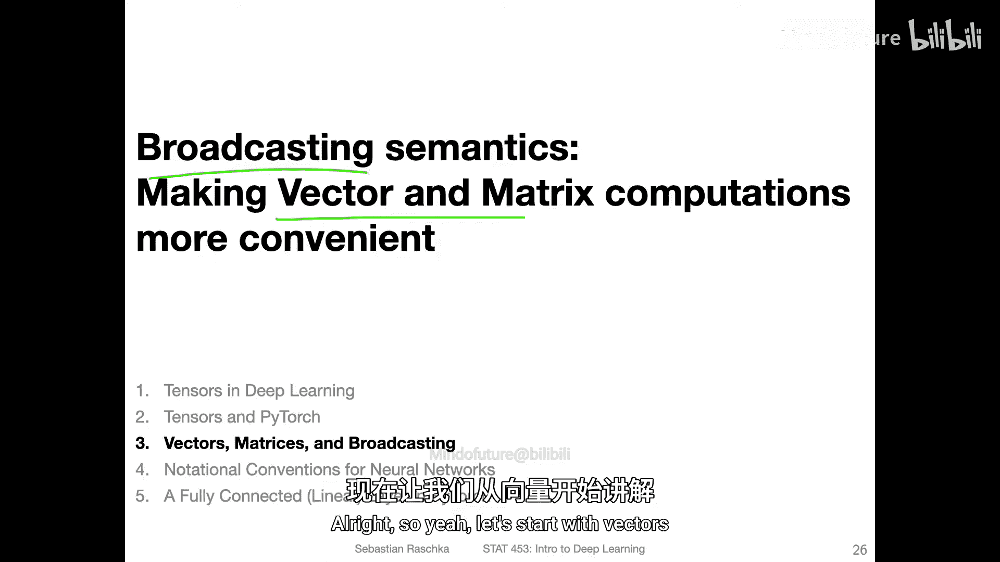

在本节课中，我们将学习向量和矩阵在计算机科学中的运算，特别是“广播”机制。这一概念使得在计算机上进行向量和矩阵计算比传统的纸笔线性代数运算更加方便。

## 向量运算回顾

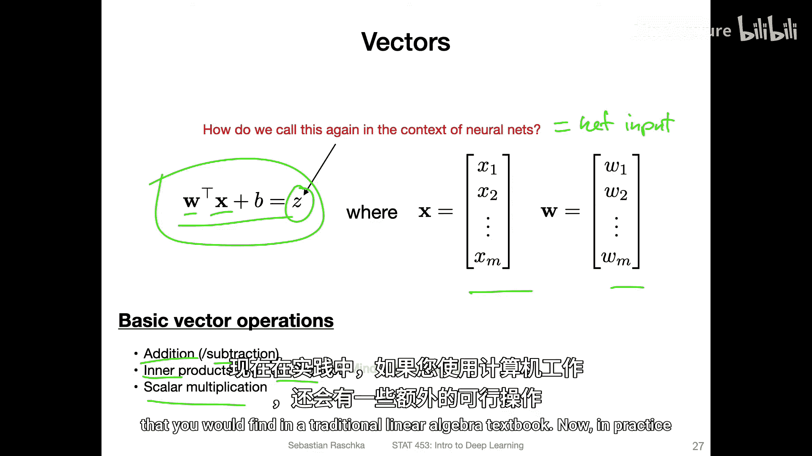

上一节我们介绍了感知机的基本概念。现在，我们从一个简单的公式开始回顾：**净输入**的计算公式为：

**Z = Wᵀx + b**

其中，`x` 和 `W` 是向量，`b` 是标量（偏置项）。在传统线性代数中，向量支持的基本运算包括：
*   向量加法（或减法）
*   内积（点积）
*   标量乘法

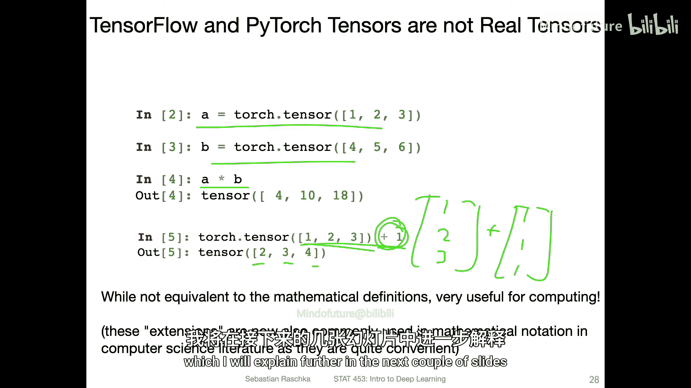

这些是线性代数教科书中的标准操作。

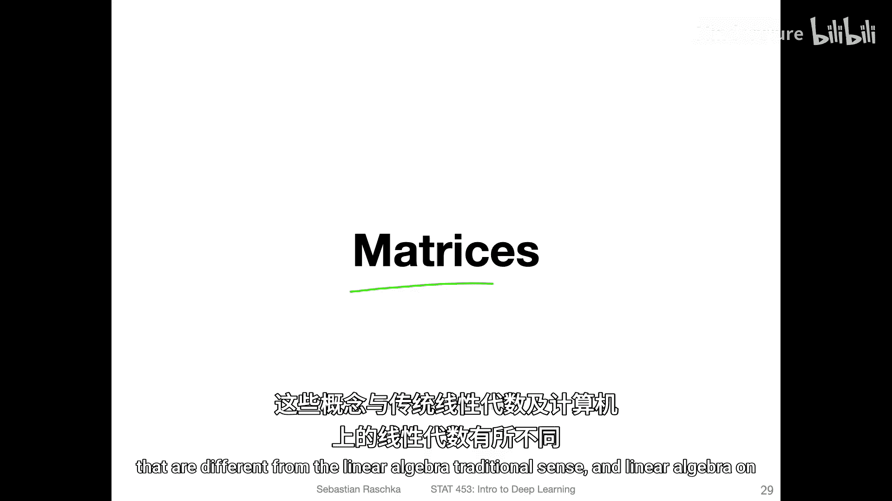

## 计算机上的便捷运算

然而，在实际的计算机编程中，为了便利性，我们常常使用一些在传统线性代数意义上“无效”的操作。以下是两个例子：

以下是使用PyTorch张量进行的便捷运算示例：

1.  **逐元素向量乘法**：可以直接将两个一维张量（向量）相乘，结果是一个新的向量，其元素是原向量对应位置的乘积。这在传统线性代数中并不常见。
2.  **标量与向量相加**：可以将一个标量直接加到一个向量上，计算机会自动将该标量加到向量的每一个元素上。这避免了手动创建一个由标量值组成的向量再进行相加的步骤。

这些便利功能与“广播”概念相关，我们将在后续详细解释。

## 矩阵运算与并行化优势

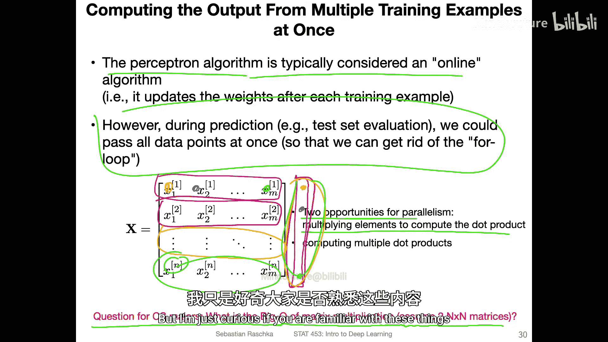

接下来，我们看看矩阵运算。回想一下感知机算法，它通常被视为一种**在线算法**，即一次处理一个训练数据点。

但是，在模型训练完成后进行预测时，我们可以一次性处理所有测试样本。我们可以将`N`个样本的特征堆叠成一个巨大的**设计矩阵** `X`（维度为 `N × M`，`M`是特征数），然后通过一次矩阵乘法计算出所有样本的净输入。

这样做效率更高，因为计算机可以利用底层例程进行并行计算。主要有两种并行化机会：
*   **单个点积内的并行**：计算一个特征向量 `x` 和权重向量 `W` 的点积时，各个元素的乘法可以同时进行。
*   **多个点积间的并行**：计算矩阵 `X` 中不同行（不同样本）与权重向量 `W` 的点积时，这些独立的点积计算可以同时进行。

因此，净输入 `Z` 可以通过以下方式批量计算：
**Z = XW + b**

这里，`X` 是 `N × M` 矩阵，`W` 是 `M × 1` 矩阵（列向量），`b` 是标量。结果 `Z` 是一个 `N × 1` 的向量，包含了所有样本的净输入。需要注意的是，为了符合矩阵乘法的规则，权重 `W` 在这里被视为列向量。

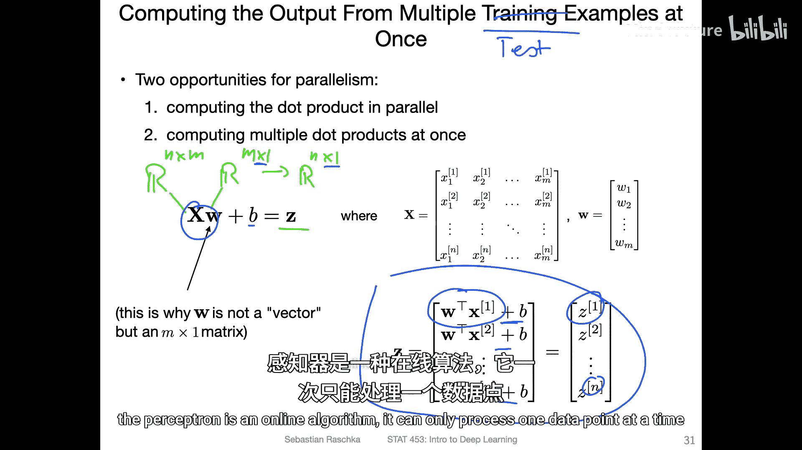

## PyTorch中的灵活性

在PyTorch（和NumPy）中，对于维度的要求并不像传统线性代数那样严格。

例如，我们可以用一个 `2×3` 的矩阵 `X` 直接乘以一个一维张量（向量）`W`（元素为`[1, 2, 3]`），PyTorch会自动执行正确的运算。我们也可以使用`.view()`函数（类似于NumPy的`reshape`）将 `W` 显式地转换为一个 `3×1` 的列向量，两种方式都能得到正确结果，只是输出张量的形状略有不同（一维数组 vs 二维列向量）。

## 广播机制详解

现在，我们来深入讲解本节的核心概念——**广播**。

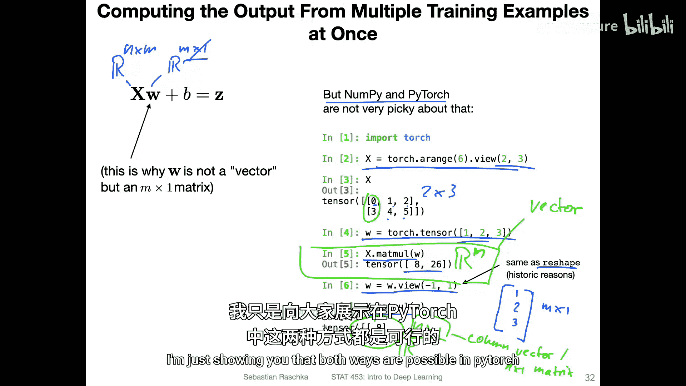

在传统线性代数中，你不能直接将一个标量 `b` 加到向量 `Z` 上。但在深度学习和科学计算中，我们经常这样写：`Z + b`。计算机会通过广播机制，隐式地将标量 `b` 扩展成一个与 `Z` 形状相同的向量，然后再执行加法。

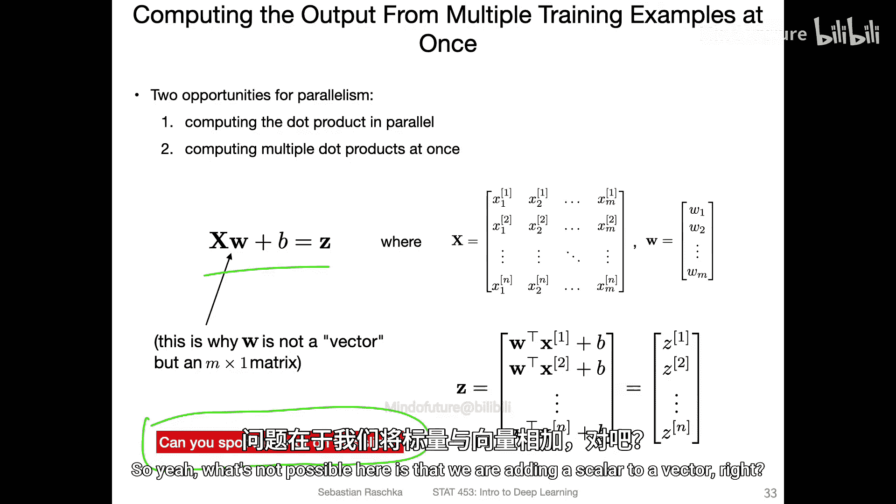

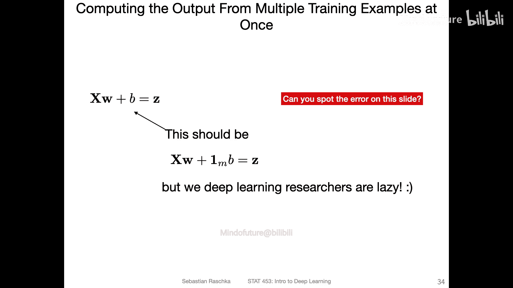

广播不仅适用于标量与向量的运算，也适用于向量与矩阵等不同维度数组之间的运算。

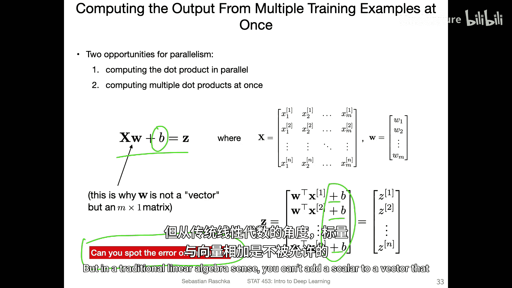

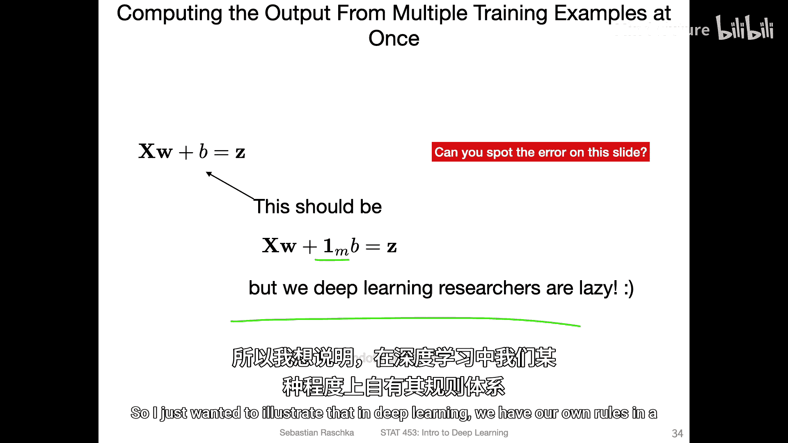

例如，我们有一个 `2×3` 的矩阵，和一个包含3个元素的一维张量（向量）。当我们执行加法时，PyTorch会通过广播机制，隐式地将这个向量复制成 `2×3` 的矩阵（每一行都是该向量），然后再进行逐元素相加。

**广播机制的本质是：当两个数组进行运算时，NumPy/PyTorch会从它们的形状的最右侧维度开始向左比较，如果维度大小相等或其中一个为1，则认为这两个维度是兼容的。数组会在缺失的维度或大小为1的维度上进行扩展（复制数据），以匹配另一个数组的形状，从而执行逐元素运算。**

这种机制极大地简化了代码，使我们无需手动进行繁琐的维度扩展操作。

## 总结

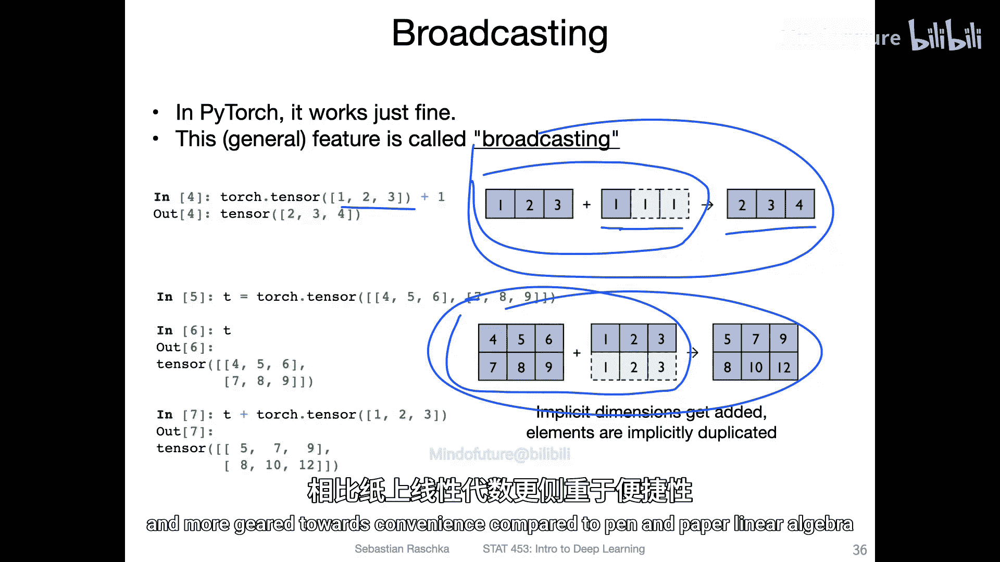

本节课我们一起学习了向量和矩阵在计算机科学计算中的特殊之处。我们了解到，为了编程的便利性，像PyTorch这样的框架放宽了传统线性代数的严格规则，允许标量与向量相加、不同形状数组间运算等。这些功能的核心是**广播机制**，它能自动扩展数组维度以进行逐元素运算。此外，我们还看到了使用矩阵一次性处理多个数据样本可以充分利用硬件并行能力，提升计算效率。这些概念是理解后续多层神经网络运算的重要基础。

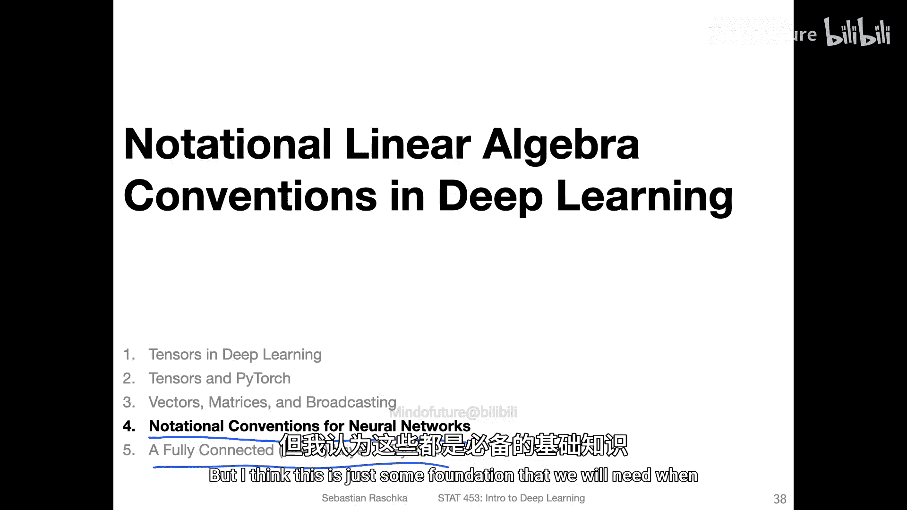

在下一节课中，我们将介绍神经网络的一些符号约定，并初步了解全连接层在PyTorch中的实现及相关概念。