# 030：神经网络的符号约定 🧮

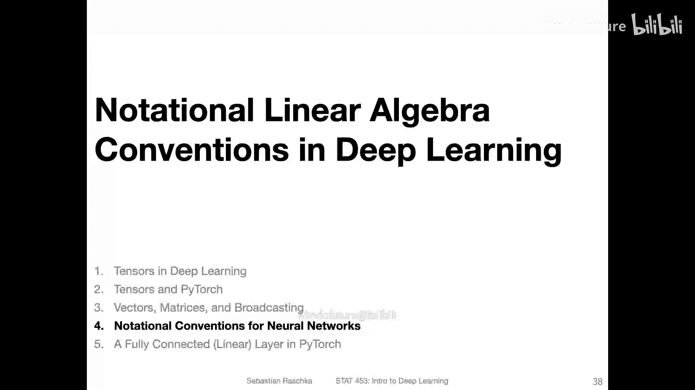

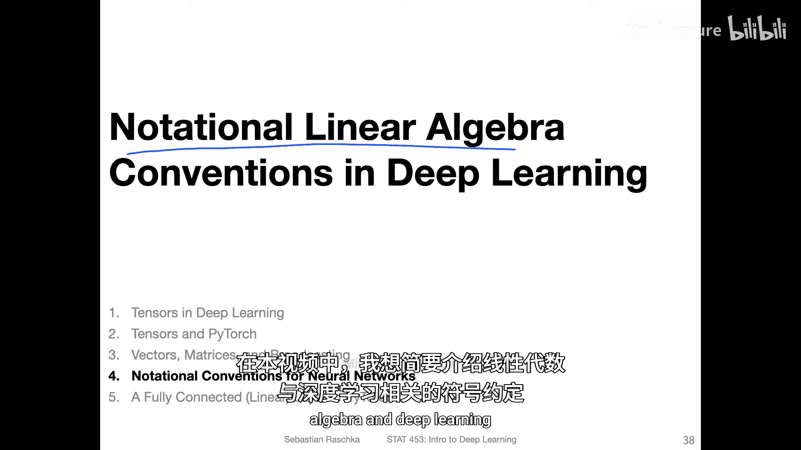

在本节课中，我们将学习深度学习中关于线性代数的符号约定。理解这些约定对于后续学习神经网络的计算至关重要。

## 概述

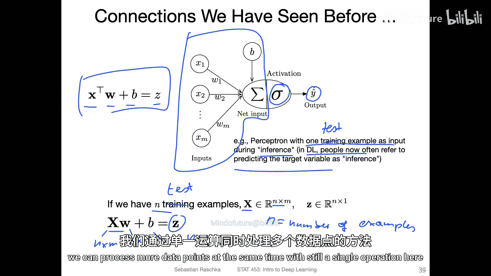

我们将从感知机的线性代数表示开始，逐步扩展到处理多个数据点和多个输出的情况，并解释在深度学习中常见的矩阵表示方法及其背后的几何直觉。

## 从感知机到矩阵表示

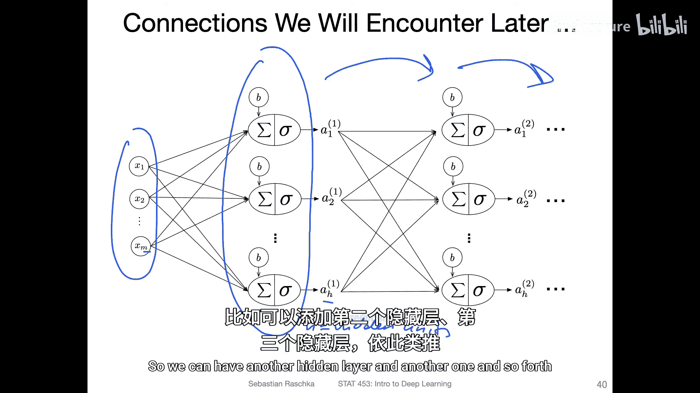

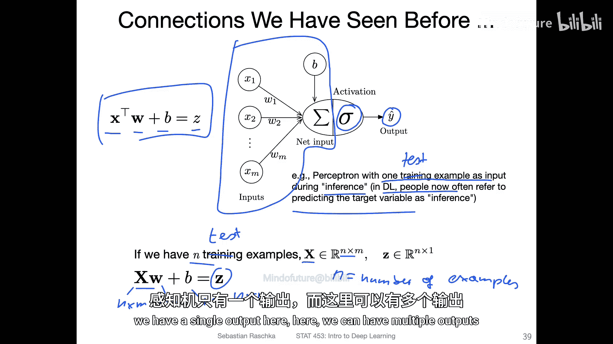

上一节我们介绍了感知机的基本原理。本节中我们来看看如何用线性代数表示感知机的计算。

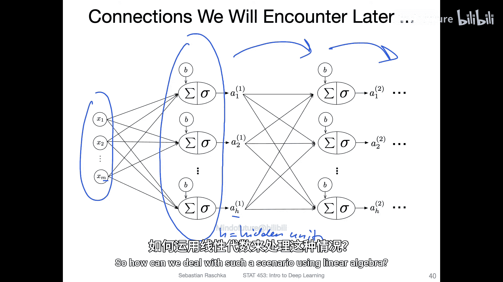

在感知机中，对一个数据点进行预测（即推理）的公式为：
`z = x^T * w + b`
其中，`x` 是输入特征向量，`w` 是权重向量，`b` 是偏置标量，`z` 是净输入，随后会通过激活函数（如阈值函数）得到预测结果。

当我们需要同时处理多个数据点时，可以使用设计矩阵来表示数据。以下是处理多个数据点的方法：
*   `X` 是一个 `n x m` 维的设计矩阵，其中 `n` 是样本数量，`m` 是特征数量。
*   `w` 是 `m x 1` 维的权重向量。
*   `b` 是一个标量。
*   输出 `Z = X * w + b` 是一个 `n x 1` 维的向量，其中每个元素对应一个样本的净输入。

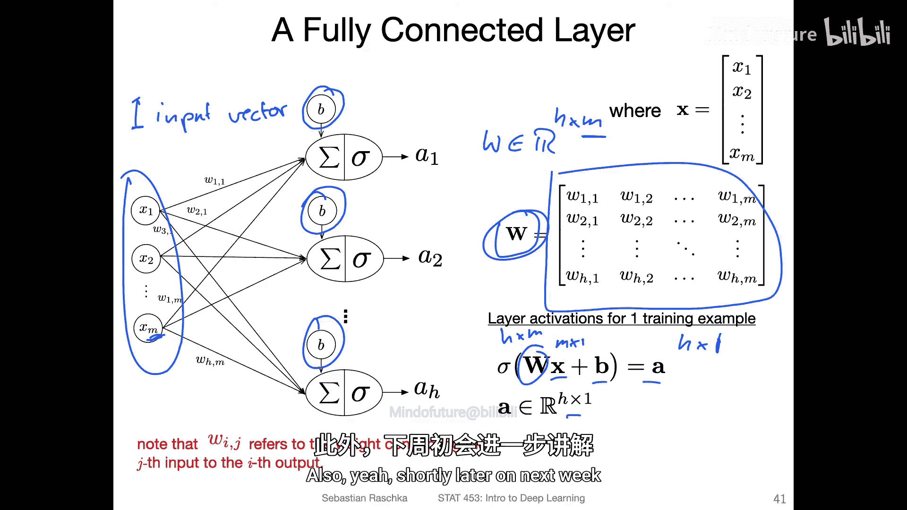

## 处理多个输出

在深度学习中，神经网络通常包含具有多个神经元的隐藏层，这意味着会有多个输出。以下是处理单个数据点但具有多个输出的方法：
*   输入 `x` 是一个 `m x 1` 维的特征向量。
*   权重 `W` 是一个 `h x m` 维的矩阵，其中 `h` 是隐藏层神经元数量。
*   偏置 `b` 是一个 `h x 1` 维的向量。
*   输出 `z = W * x + b` 是一个 `h x 1` 维的向量。

这可以看作是对原始 `m` 维特征进行线性变换，得到新的 `h` 维特征表示。

## 结合多个样本与多个输出

现在，让我们将前两个概念结合起来，处理同时具有多个训练样本和多个输出的情况。以下是具体方法：
*   输入 `X` 是 `n x m` 维的设计矩阵。
*   权重 `W` 是 `h x m` 维的矩阵。
*   为了进行矩阵乘法，我们需要对 `X` 进行转置，使得维度匹配：`(h x m) * (m x n) = h x n`。
*   偏置 `b` 是 `h x 1` 维的向量，通过广播机制与结果相加。
*   最终输出 `Z = W * X^T + b` 的维度是 `h x n`。

然而，为了保持层与层之间传递数据时“样本数作为行”的一致性，我们通常会对结果再次转置，得到 `n x h` 维的输出矩阵，作为下一层的输入。

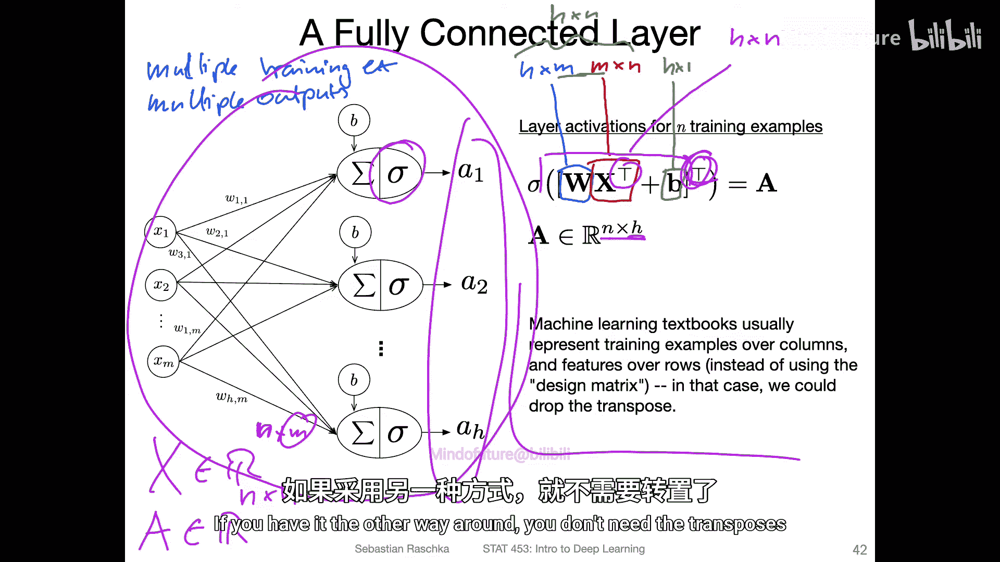

关于符号约定，需要注意：在一些较早的教材中，设计矩阵可能表示为 `m x n`（特征为行，样本为列），这样在公式中就不需要转置。但现代深度学习框架更常使用 `n x m` 的表示法。

## 符号约定的几何直觉

你可能会问，为什么采用 `W * x` 而不是 `x * W` 的写法？实际上，在下一讲的PyTorch中我们会看到另一种方式。传统上，`W * x` 的写法源于线性代数中的几何直觉。

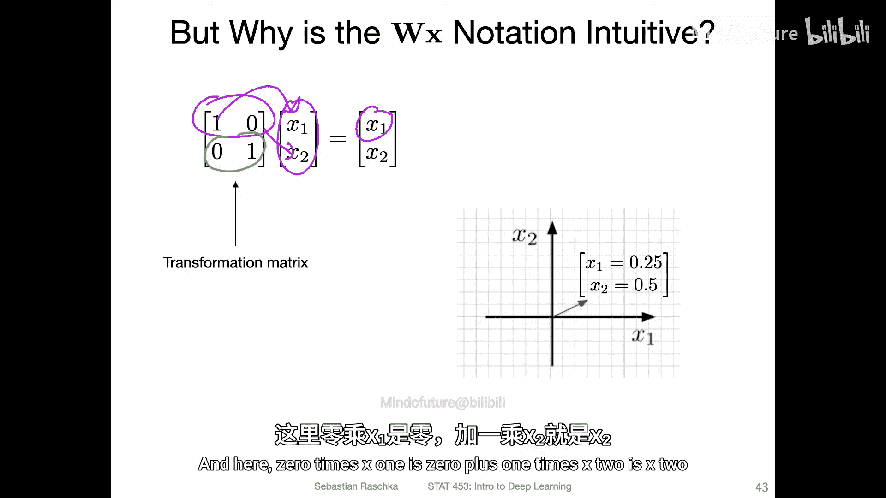

我们可以将权重矩阵 `W` 视为一个线性变换。例如，一个单位矩阵不会改变输入向量。更一般地，矩阵中的元素可以控制缩放和平移等变换：
*   矩阵对角线上的元素主要负责对向量的各个维度进行缩放。
*   矩阵其他位置的元素可以组合实现旋转、剪切等变换。
*   偏置向量 `b` 则实现了平移操作。

在深度学习中，使用线性代数的主要目的是使表示更加紧凑，并便于利用硬件进行高效计算。在接下来的视频中，我们将看到如何在PyTorch中实现这些计算。

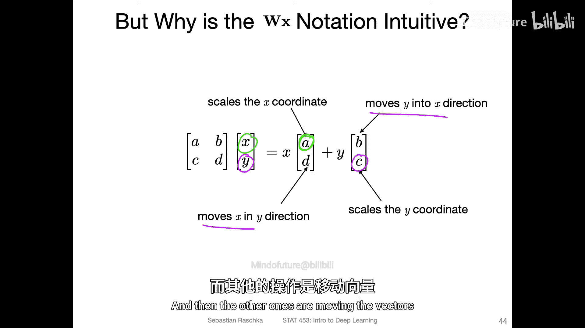

## 总结

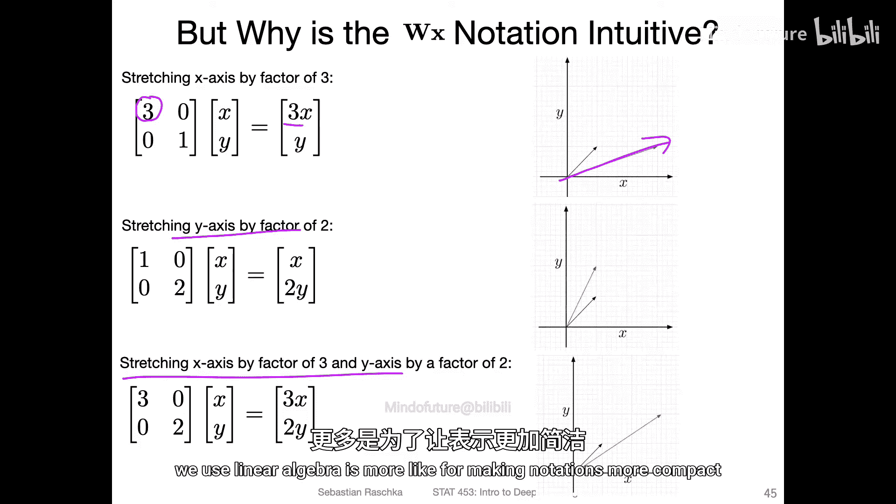

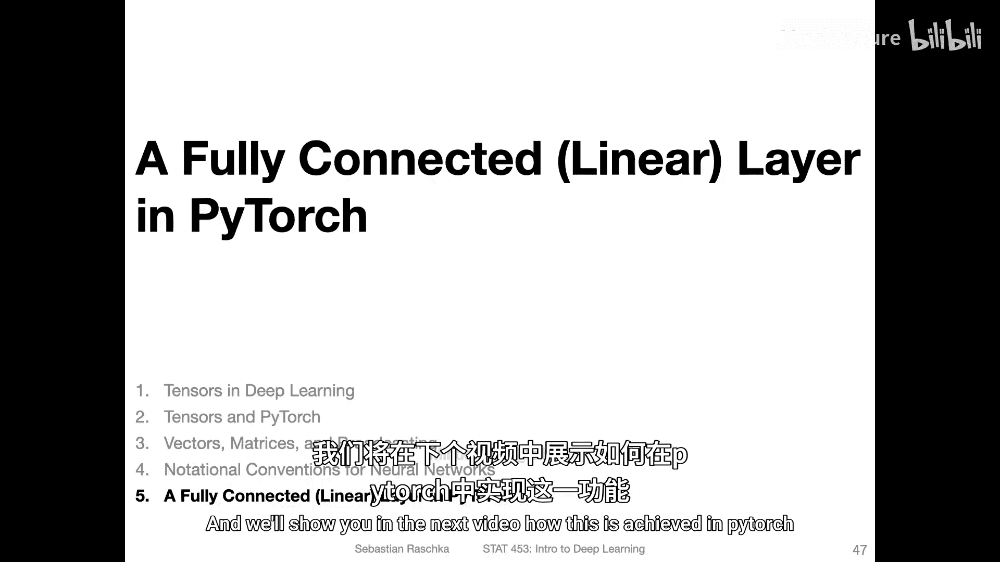

本节课中我们一起学习了深度学习中线性代数的符号约定。我们从单样本感知机的计算出发，扩展到使用设计矩阵处理多样本，以及使用权重矩阵处理多输出的情况。我们还探讨了 `W * x` 表示法背后的几何直觉，并将其理解为对输入空间的一系列线性变换。理解这些符号约定是掌握神经网络前向传播计算的基础。