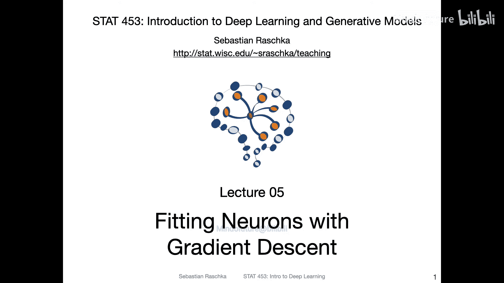
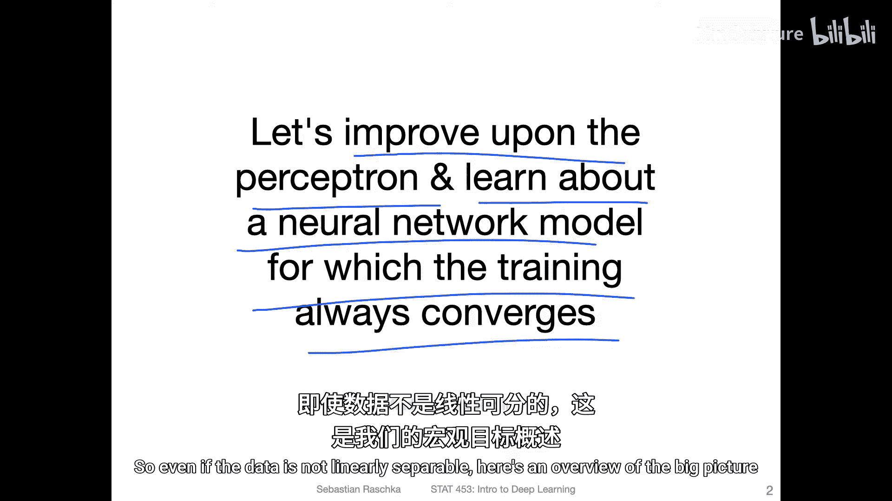
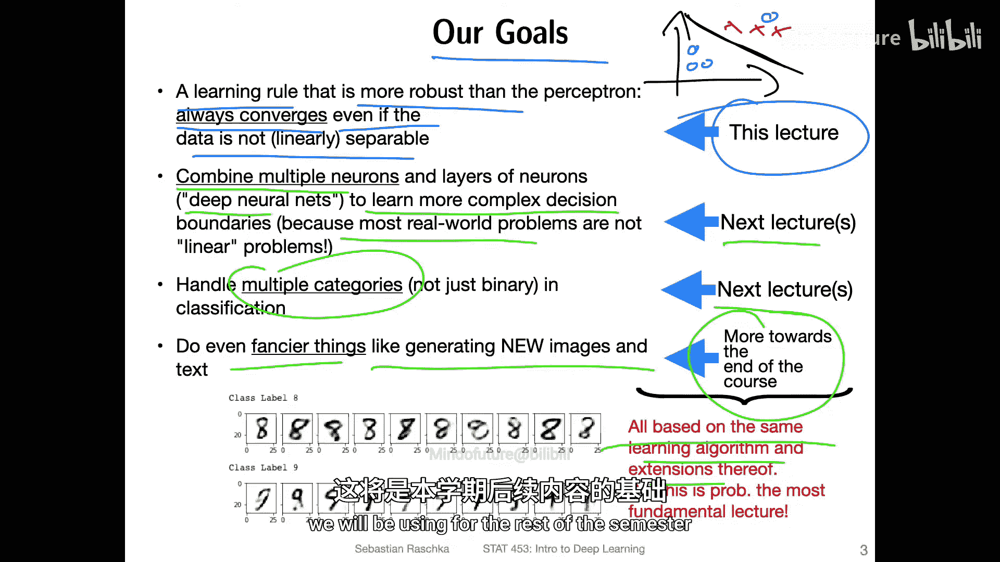
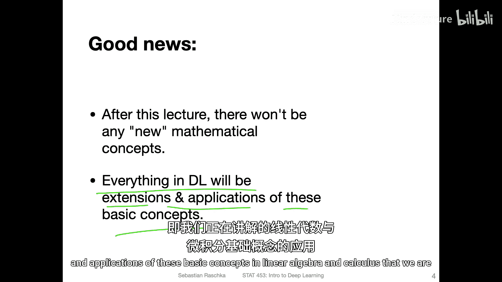
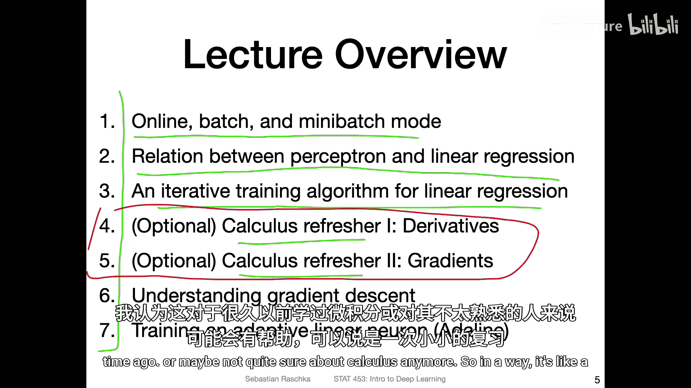
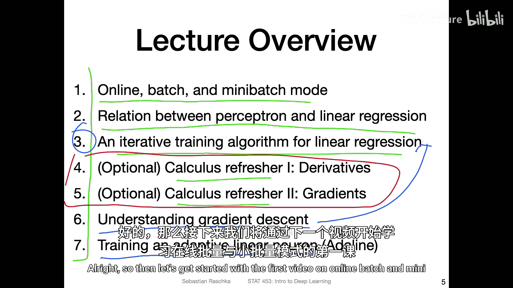

# 032：梯度下降——讲座概述 🎯

在本节课中，我们将要学习一种比感知机更稳健的学习规则——梯度下降。这种算法即使在数据非线性可分的情况下也能保证收敛，为后续构建更复杂的多层神经网络模型奠定基础。

上一节我们回顾了线性代数的基础知识。本节中，我们将引入一些微积分概念，因为它们对于使用梯度下降法来拟合神经元至关重要。

## 课程目标与路线图 🗺️

我们的核心目标是改进上周介绍的感知机模型。具体来说，我们将学习一种训练过程总能收敛的神经网络模型，无论数据是否线性可分。

但这并非本课程的最终目标。我们更关心的是如何构建比单层神经网络更复杂的分类器，以解决比简单的二元或线性可分问题更复杂的任务。例如，感知机无法处理非线性可分的数据点组合。在实践中，我们需要解决更复杂的现实世界问题，如目标检测或任意物体分类。

为了实现这一点，我们需要找到组合多个神经元的方法。深度神经网络能够帮助我们学习更复杂的决策边界。我们将在下一讲开始探讨如何组合神经元。本节课首先打好基础，讨论学习规则，然后在后续课程中将同样的学习规则应用于神经元的组合，并扩展到多类别分类问题。

好消息是，本节课之后将不再引入新的核心数学概念。深度学习中的所有内容都是我们现在学习的线性代数和微积分基本概念的延伸与应用。

## 本节课内容概览 📚

以下是本节课将涵盖的主要内容：

首先，我们将讨论不同的学习模式，包括在线学习、批量学习和小批量学习。这是一个适用于所有类型神经网络（单层、多层、卷积网络等）的通用概念。

接着，我们将探讨感知机与线性回归之间的关系，并学习线性回归的一种迭代训练算法。虽然线性回归有直接的解析解（矩阵公式），但理解其迭代算法有助于我们掌握神经网络的训练原理。

然后，课程包含一个可选的微积分复习部分。这部分是为那些很久没接触微积分或想巩固基础的同学准备的，熟悉微积分的同学可以跳过，以缩短学习时间。

之后，我们将深入讲解**梯度下降**算法，这是本节课的核心学习算法。

最后，我们将训练一个线性神经元（Adaline），并通过一个PyTorch代码示例，展示如何使用梯度下降的概念来训练这样的神经元。

好了，让我们在下一个视频中，从学习模式开始正式进入课程内容。