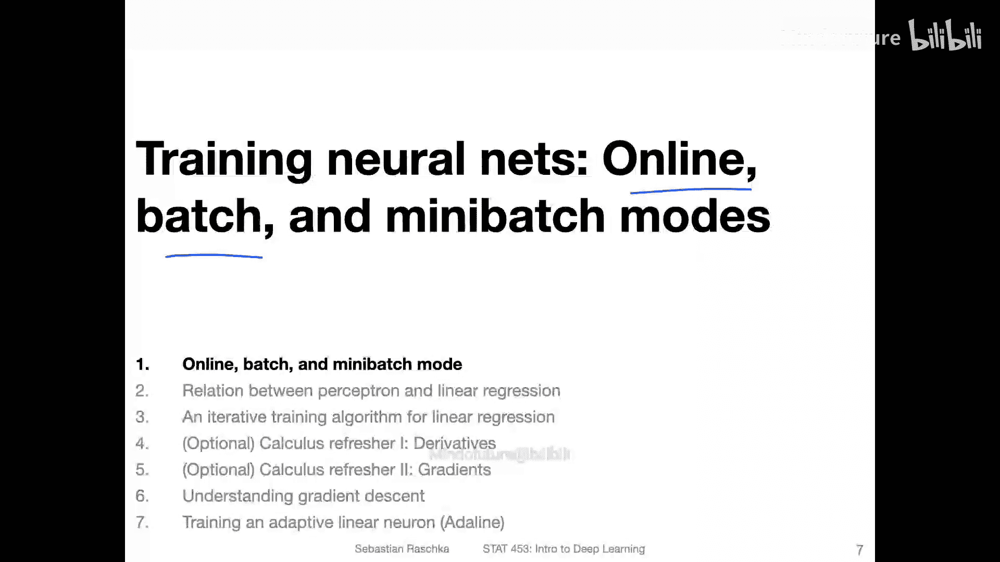
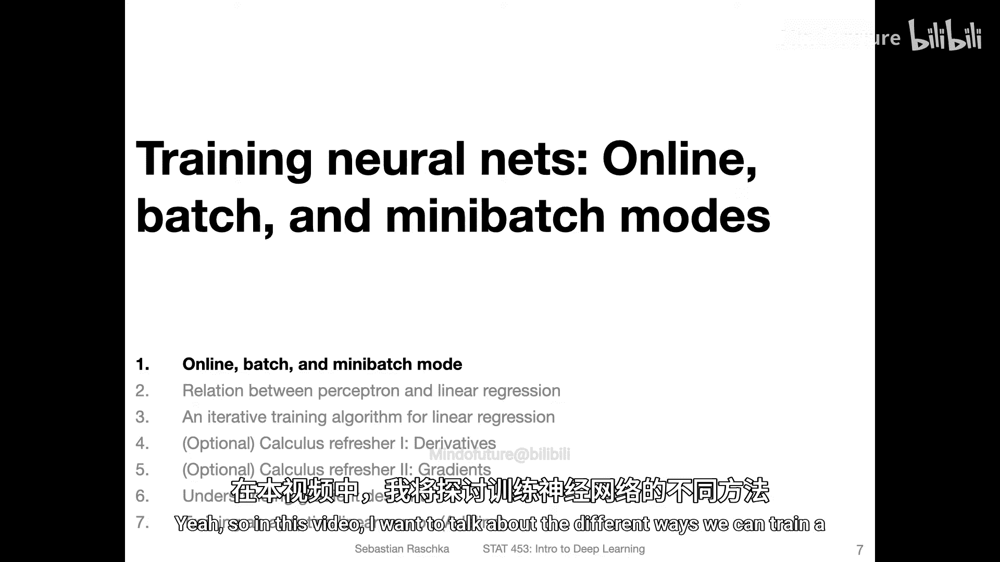
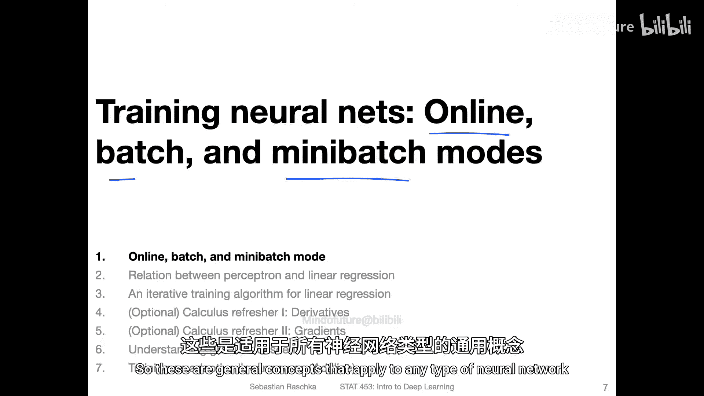
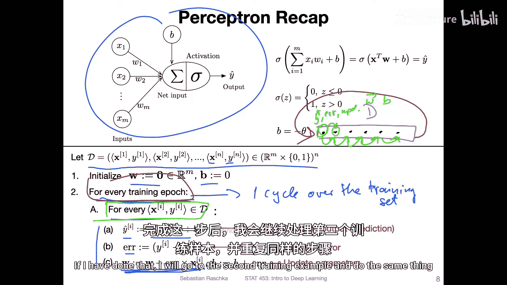
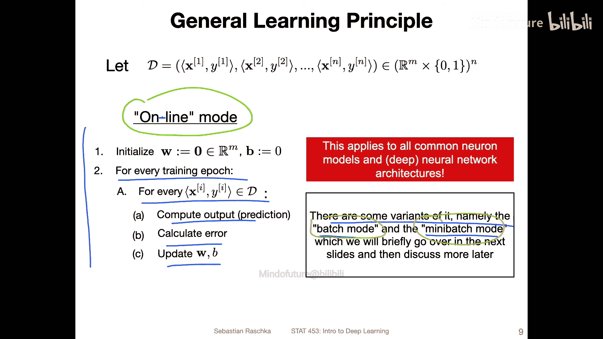
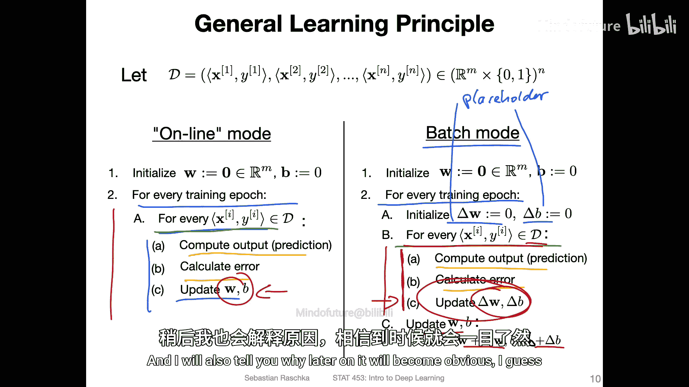
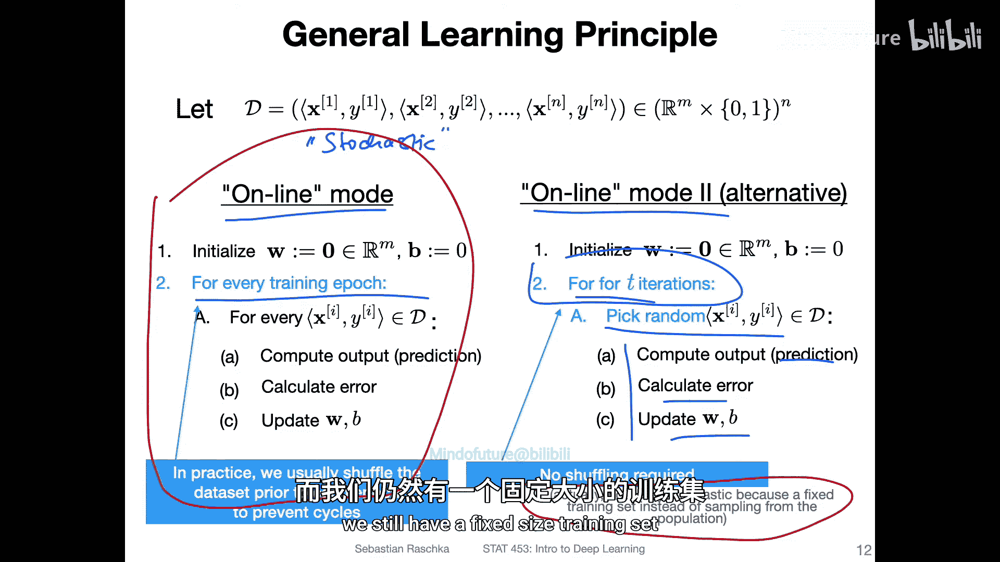
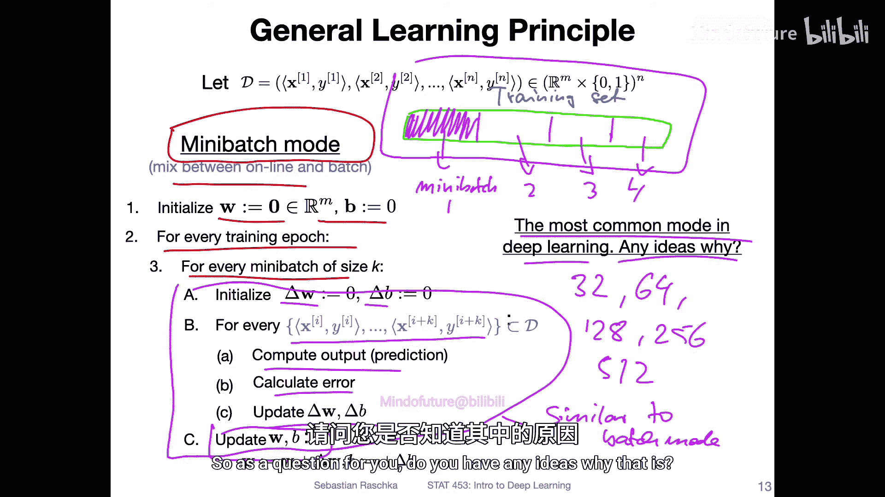
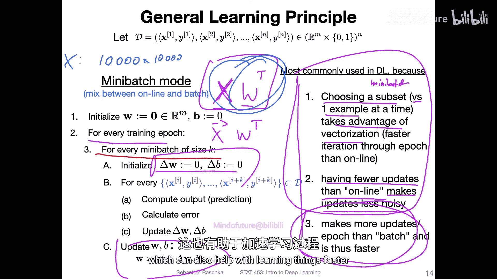
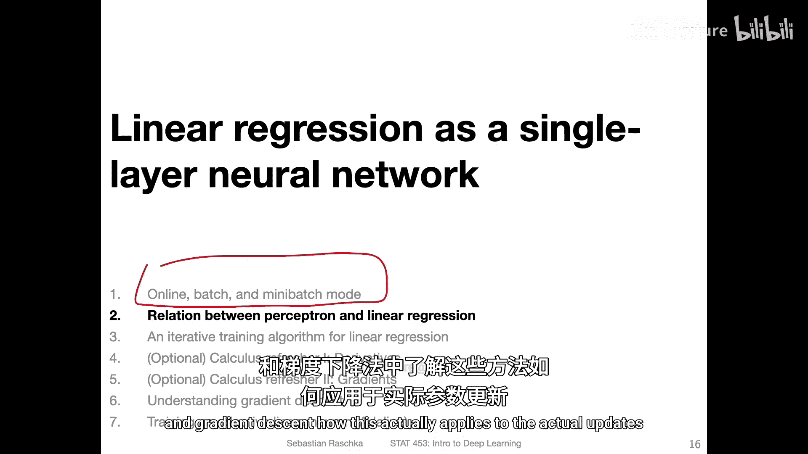

# 033：在线、批处理与迷你批处理模式 🧠

在本节课中，我们将探讨训练神经网络模型的三种不同模式：在线模式、批处理模式和迷你批处理模式。这些模式定义了我们在训练过程中如何利用数据、如何读取数据以及如何更新模型参数。理解这些概念对于后续学习更复杂的优化算法至关重要。

## 在线模式 🔄

上一节我们回顾了感知机模型的基本训练流程。本节中，我们来看看第一种训练模式——在线模式。

在线模式的核心思想是：**每处理一个训练样本，就立即更新一次模型参数**。以下是其具体步骤：

1.  初始化模型参数（例如，权重 `w` 和偏置 `b` 设为0）。
2.  对于每一个训练周期（epoch）：
    *   对于数据集 `D` 中的每一个训练样本 `(x_i, y_i)`：
        *   计算预测值：`ŷ_i = f(w·x_i + b)`，其中 `f` 是激活函数（如阶跃函数）。
        *   计算误差。
        *   **立即更新**权重 `w` 和偏置 `b`。

**优点**：模型可以快速适应新数据，适用于数据流式到达的场景（如实时推荐系统）。
**缺点**：每次更新只基于单个样本，更新方向噪声较大，可能导致训练过程不稳定。

在实践中，为了防止模型因数据顺序而陷入循环或振荡，通常在每个训练周期开始前**随机打乱**数据集。

## 批处理模式 📦

在线模式每次更新都很快，但可能不够稳定。接下来，我们看看另一种更稳健的方法——批处理模式。

批处理模式与在线模式的关键区别在于：**它收集完整个数据集的信息后，才进行一次参数更新**。其流程如下：

1.  初始化模型参数 `w` 和 `b`。
2.  对于每一个训练周期（epoch）：
    *   初始化权重和偏置的“变化量”累加器 `Δw` 和 `Δb`（通常设为0）。
    *   对于数据集 `D` 中的每一个训练样本 `(x_i, y_i)`：
        *   计算预测值 `ŷ_i` 和误差。
        *   计算该样本导致的参数变化，并**累加**到 `Δw` 和 `Δb` 中，**但不立即更新** `w` 和 `b`。
    *   遍历完**所有样本**后，**使用累加的变化量一次性更新**参数：`w = w + Δw`， `b = b + Δb`。

**优点**：更新方向基于整个数据集计算，更加准确和稳定，噪声小。
**缺点**：每个训练周期只更新一次，学习速度较慢。对于大型数据集，将全部数据加载到内存进行计算可能不可行。

## 迷你批处理模式 ⚡

在线模式更新快但噪声大，批处理模式稳定但效率低。在深度学习中，最常采用的是结合两者优点的**迷你批处理模式**。

迷你批处理模式将训练数据集划分为多个较小的子集，称为“迷你批”。模型在一个训练周期内，按顺序处理这些迷你批，**每处理完一个迷你批，就更新一次参数**。

以下是其工作原理：

1.  初始化模型参数 `w` 和 `b`。
2.  对于每一个训练周期（epoch）：
    *   将数据集随机打乱并划分为多个大小为 `batch_size` 的迷你批。
    *   对于每一个迷你批 `B`：
        *   采用与**批处理模式类似**的方法：初始化累加器 `Δw` 和 `Δb`，对 `B` 内所有样本计算预测和误差并累加变化量。
        *   处理完当前迷你批的所有样本后，**立即用累加的变化量更新**参数 `w` 和 `b`。

迷你批的大小（如32， 64， 128）是一个需要调整的超参数。

以下是迷你批处理模式成为深度学习首选的三点主要原因：

*   **利用向量化加速计算**：通过将迷你批中的数据组织成矩阵，可以利用高效的矩阵运算（如 `X @ W`）一次性处理多个样本，远比在循环中逐个计算快得多。
*   **平衡噪声与稳定性**：相比在线模式，它减少了更新噪声，使训练更稳定；相比批处理模式，它保留了一定的噪声，这有助于模型跳出局部最优解。
*   **内存效率与更新频率**：它避免了一次性加载全部数据对内存的过高要求。同时，它在每个训练周期内进行了多次更新，比批处理模式的学习速度更快。

## 总结 📝

本节课我们一起学习了神经网络的三种基本训练模式：
*   **在线模式**：逐个样本处理并立即更新，快速但嘈杂。
*   **批处理模式**：整个数据集计算后统一更新，稳定但缓慢。
*   **迷你批处理模式**：将数据分成小批，每批计算后更新，在速度、稳定性和内存效率之间取得了最佳平衡，因而成为深度学习的标准实践。

理解这些数据利用方式，为我们接下来学习**梯度下降**和**随机梯度下降**等核心优化算法奠定了重要基础。